## 2020-12-09

1. [Ground Experiments and Performance Evaluation of the Low-Frequency Radio Spectrometer Onboard the Lander of Chang'e-4 Mission](https://arxiv.org/abs/2012.04347)

   嫦娥4号低频天线受到着陆器和环境中的电磁干扰（EMI，Electro magnetic Interference），EMI缓解（mitigation）后的灵敏度或许可以到$10^{-18}Wm^2/Hz$。

2. [Improving the open cluster census. I. Comparison of clustering algorithms applied to Gaia DR2 data](https://arxiv.org/abs/2012.04267)

   使用聚类算法搜索Open Clusters：GMM效率低下，在已知的OCs找回率高。DBSCAN找回率高，错误率低，但是难以检测密度可变的OC。HDBSCAN最敏感，但是会产生误报，需要后期处理。

3. [Identifying Candidate Optical Variables Using Gaia Data Release 2](https://arxiv.org/abs/2012.04006)

   使用Gaia DR2找变星，因为变星的测光不准确度会明显高于恒星。但是Gaia对于每一颗恒星测量的次数不同，测量次数多的恒星G星等的不确定度会偏小，也就是说对于测量次数不同的恒星，$M_G\ vs.\ M_{Gerr}$会有不同的曲线（基线），在找变星的时候要考虑到。

   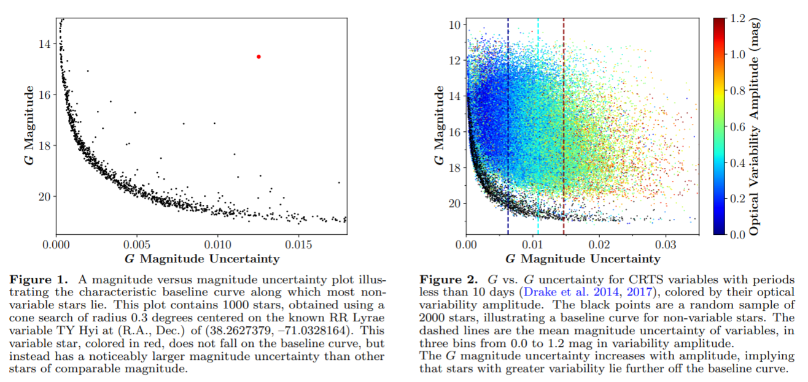

4. [FUV Observations of the Inner Coma of 46P/Wirtanen](https://arxiv.org/abs/2012.04619)

   使用哈勃望远镜观测46P光谱，在$900-1430\AA$波段，当彗星距离地球$0.16-0.23AU$时，观测到Inner Coma主要是H和O的发射线（也就是水）。没发现CO Fourth Positive Group emission（使用4-0，$1420\AA$的线，给出CO上限为$3.6\times10^{25}mol\ s^{-1}$），没发现dissociative electron impact（使用O I $1356\AA$），O $1302-1306\AA$ triplet首次在cometary coma中被观测到。

5. [3D kinematics and age distribution of the Open Cluster population](https://arxiv.org/abs/2012.04017)

   使用Gaia DR2-RVS，Gaia-ESO survey，APOGEE，RAVE，GALAH和smaller catalogues，得到目前最大的RV for OCs catalog，来研究他们的运动学。这几个巡天研究的RV的零点在1km/s的水平上是一致的，所有的非Gaia RV的测量结果都是矫正过后跟Gaia对齐的。

## 2020-12-10

1. [A repository of vanilla long term integrations of the Solar System](https://arxiv.org/abs/2012.05177)

   使用N-body code `REBOUND`，辛积分器（symplectic integrator，为哈密顿方程数值解设计）`WHFast`，在Jacobi coorbinates中进行太阳系积分，为了获得高精度，使用了17阶的 symplectic correctors和modified kick step。数据生成使用了2.4GHz的至强CPU六核年，并释放了200kg的$CO_2$，代码和数据位于[这里](https://zenodo.org/record/429910)。

2. [Real-time triggering capabilities for Fast Radio Bursts at the MeerKAT telescope](https://arxiv.org/abs/2012.05173)

   Fast radio bursts (FRBs; Lorimer et al. 2007; Thornton et al. 2013) are luminous shortduration (about ms) extra-galactic radio transients of yet unclear nature (for recent reviews see Petroff et al. 2019; Cordes & Chatterjee 2019). MeerKAT是位于南非的射电望远镜阵，可以实时搜索并定位爆发。软件发布在[这里](https://www.meertrap.org)。

3. [he Brightness of OneWeb Satellites](https://arxiv.org/abs/2012.05100)

   在1000km的位置，OneWeb卫星的视亮度为$7.18\pm0.03$，这组卫星的高度一般是1200km，此时视亮度7.58，相同的距离上，比Starlink暗。

4. [Distance and Tangential Velocity of the Main Ionizing Star in the North America/Pelican Nebulae with Gaia EDR3](https://arxiv.org/abs/2012.05074)

   Bajamar Star是一颗早期O型星，它使North America/Pelican Nebulae电离，在Gaia DR2中，恒星和星云之间视差有差异，在EDR3中没了，但是还是存在速度差异，说明恒星形成后从中脱离了。[Kuhn et al. (2020) ](Kuhn, M. A., Hillenbrand, L. A., Carpenter, J. M., et al. 2020, ApJ, 899, 128)对这个区域的恒星做了聚类。

5. [On the benefits of the Eastern Pamirs for sub-mm astronomy](https://arxiv.org/abs/2012.04647)

   东帕米尔高原独特的天气气候，仅次于智利的Chajnantor高原和MaunaKea。4300-4500m的高海拔，远离海洋，相对湿度低，大气稳定度极高，并且在无线电和光学波段没有任何干扰，使得其成为光学和亚毫米波天文学的良好台址。

## 2020-12-11

1. [On the Robustness of Phosphine Signatures in Venus' Clouds](https://arxiv.org/abs/2012.05844)

   之前这群人在Nature上发表文章称使用JCMT和ALMA发现了金星大气中的$PH_3$，后来被别人评价说用12阶多项式拟合去基线不合理。他们今天发文称，规则的多项式拟合不会导致JCMT出现“伪线”（概率<~1%）。并且，使用`double-conincidence`检验测试，发现只有$PH_3$线在没有多项式拟合的时候，出现在了两份数据中。

2. [Classification of Fermi-LAT sources with deep learning using energy and time spectra](https://arxiv.org/abs/2012.05251)

   4FGL-DR2 catlog，[gll_psc_v23.fits](https://fermi.gsfc.nasa.gov/ssc/data/access/lat/10yr_catalog/)。使用DNN做分类，输入是光子能谱（photon energy spectrum）和时间序列（time series）。对于AGN和PSE的分类，有$97.59\pm0.35\%$的准确率，对于脉冲星的分类，YNG和MSP的准确率达到（$87.25\pm3.82\%$）。

3. [Charting the Galactic acceleration field I. A search for stellar streams with Gaia DR2 and EDR3 with follow-up from ESPaDOnS and UVES](https://arxiv.org/abs/2012.05245)

   使用[StreamFinder](https://arxiv.org/pdf/1804.11338.pdf)算法，从Gaia DR2和EDR3中找星流。在DR2中发现了3条，EDR3中发现了7条。

## 2020-12-14

1. [Multi-dimensional population modelling using frbpoppy: magnetars can produce the observed Fast Radio Burst sky](https://arxiv.org/abs/2012.06396)

   Multi-dimensional FRB population synthesis可以得到唯一的自洽的FRB族。他们做了两种图，一个是$log\ N\sim\log\ S$，不知道为什么大家都这么喜欢这个。另一个是MC模拟，几个参数$\log\ N - \log\ S\ slope\ \alpha$，spectral index $si$，luminosity index $li$，minimum luminosity $lum_{min}$，maximum luminosity $lim_{max}$，mean intrinsic pulse width $w_{ini,\ mean}$，standard deviation intrinsic pulse width $w_{ini,\ std}$，Macquart idnex $DM_{IGM,\ slope}$，host dispersion measure $DM_{host}$。主要是这图看起来有点意思。

   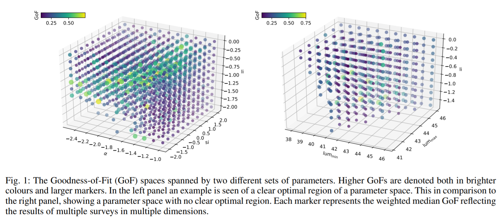

2. [The International Virtual Observatory Alliance (IVOA) in 2020](https://arxiv.org/abs/2012.05988)

   国际虚拟天文台联合会，International Virtual Observatory Alliance ([IVOA](https://wiki.ivoa.net/twiki/bin/view/IVOA)) is an organisation that debates and agrees the technical standards that are needed to make the VO possible.。

3. [Neural network based image reconstruction with astrophysical priors](https://arxiv.org/abs/2012.05947)

   使用生成对抗网络做图像重建（GAN），贝叶斯先验使用目标源的辐射传递模型。

   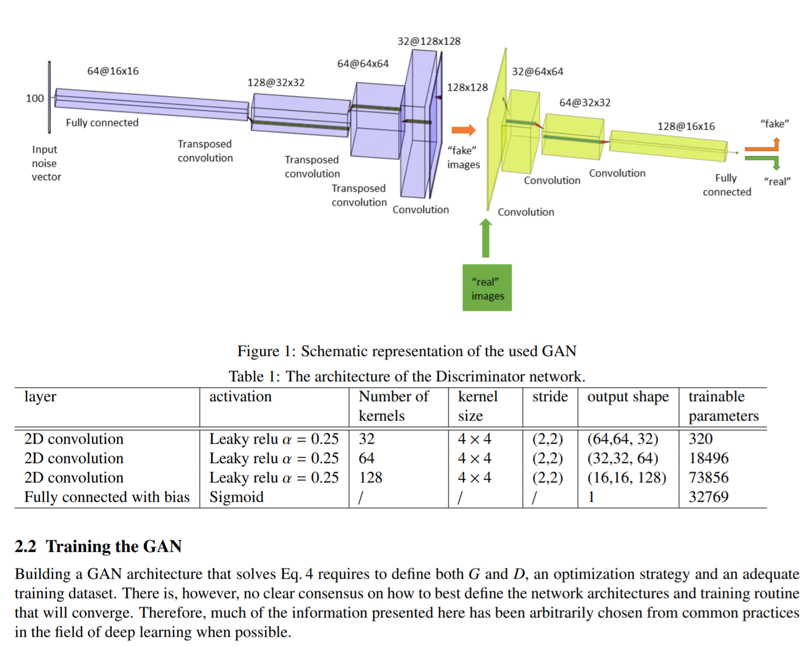

4.  [Solving Inverse Problems for Spectral Energy Distributions with Deep Generative Networks](https://arxiv.org/abs/2012.06331)

   使用深度生成网络从不可靠或者比较少的测量中重建光谱能量分布（SEDs）。

5. [Gaia pulsars and where to find them in EDR3](https://arxiv.org/abs/2012.06335)

   相关（其实是同一个人写的） - [Gaia pulsars and where to find them](https://arxiv.org/abs/2011.08075)

   脉冲星的位置不确定度只有0.5arcsec，在DR2中找1534个脉冲星的伴星，找到了22个与已知脉冲星匹配，和8个可能的伴星。对于有掩食的毫秒脉冲星和三个有低质量白矮星作为伴星的毫秒脉冲星都满足以下条件：
   $$
   \begin{aligned}
   M_G &\le 2.7(G_{BP}-G_{RP}) + 10.5\\
   M_G &> 3.7(G_{BP}-G_{RP}) + 2.4\\
   H_g &> 5.3(G_{BP}-G_{RP}) + 5.9 \quad where\quad H_g=m_g+5\log_{10}\frac{\mu}{mas\ yr^{-1}}-10 + A_g \quad where \quad \mu = \sqrt{\mu_\alpha^2+\mu_\delta^2}
   \end{aligned}
   $$

## 2020-12-15

1. [A comparison between repeating bursts of FRB 121102 and giant pulses from Crab pulsar and its applications](https://arxiv.org/abs/2012.07303)

   用幂律$N(>E)\propto E^{-\alpha}$拟合Crab巨脉冲（GPs）的能量分布，用断幂拟合FRB121102：
   $$
   N_{cum}(>E)=A\left[\left(\frac{E}{E_b}\right)^{\alpha_1\omega}+\left(\frac{E}{E_b}\right)^{\alpha_2\omega}\right]^{-1/\omega}
   $$

   使用Goodness-of-Fit检查拟合优劣：
   $$
   \chi_{d.o.f}=\sqrt{\frac{1}{N_{tot}-n_{par}}\sum_{i=1}^{N_{tot}}\frac{\left[N_{cum}(E_i)-N_{cum,obs}(E_i)\right]^2}{\sigma_{cum,i}^2}}
   $$
   发现121102的幂指数和巨脉冲的幂律指数差不多，然后没了。

2. [Algorithmic Pulsar Timing](https://arxiv.org/abs/2012.07809)

   写了算法脉冲星计时（APT），可以精确的做相位相连，对孤立的脉冲做计时。

3. [Astronomical research in the next decade: trends, barriers and needs in data access, management, visualization and analysis](https://arxiv.org/abs/2012.07686)

   在线匿名调查天体物理学界的人对当前学界研究的障碍和未来的期望。四个方面：open science practices, data access and management, data visualization and multiwavelength astronomy, and data analysis and machine learning。该调查通过电子邮件向主要来自西班牙、意大利、葡萄牙、希腊、法国、德国和英国的多个研究和学术机构分发，同时也在一个只包括专业天文学家的Facebook私人小组内分发。

   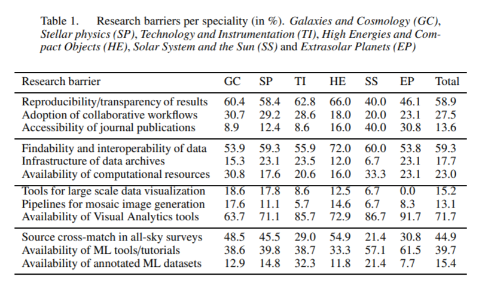

4. [A single pulse study of PSR J1022+1001](https://arxiv.org/abs/2012.06709)

   冯毅的关于脉冲星J1022+1001的论文，与我有关。

## 2020-12-16

1. [The ITRF coordinates of the spherical center of FAST](https://arxiv.org/abs/2012.08359)

   计算了FAST的ITRF坐标。 FAST球面中心的WGS-84坐标是
   $$
   \lambda=106^\circ51'24.000740'',\ \phi=25^\circ39'10.626537'',\ h=1110.028801\ m
   $$
   ITRF坐标
   $$
   X=−1668557.2070983793,\ Y=5506838.5266271923,\ Z=2744934.9655897617
   $$
   转换方法
   $$
   \begin{aligned}
   X &= (N+h)\ cos\phi\ cos\lambda \\
   Y &= (N+h)\ cos\phi\ sin\lambda \\
   Z &= [N(1-e^2)+h]\ sin\phi \\
   N &= a/\sqrt{1-e^2sin^2\phi}\quad a = 6378137\ m,\ b =6356752.3142451795\ m, e^2 = (a^2-b^2/a^2)
   \end{aligned}
   $$

2. [Chromatic periodic activity down to 120 MHz in a Fast Radio Burst](https://arxiv.org/abs/2012.08348)

   他们看的是FRB 20180916B，（文章里有到现在为止所有看到的这个FRB的脉冲的文章link），其实就是FRB 180916.J0158+6，有$16.35$周期（[Periodic activity from a fast radio burst source](https://www.nature.com/articles/s41586-020-2398-2)）的那个。他们发现这个FRB在120MHz还有射电辐射，并且在一个周期的活动窗口中，高频的脉冲分布更窄，而且出现更早。

   在方法里，介绍了观测和脉冲搜寻的方法，数据处理方法，活动窗口，极化（Polarisation），色散（Dispersion），子脉冲漂移率，散射（Scattering），爆发率。

3. [Anomaly Detection in Astronomical Images with Generative Adversarial Networks](https://arxiv.org/abs/2012.08082)

   使用夏威夷的Subaru望远镜的Hyper Suprime-Cam（[HSC](https://hsc.mtk.nao.ac.jp/ssp/)）的近百万个观测对象，使用WGAN生成HSC图像，并使用卷积自动编码器（CAE）来表征异常，从中得到了9000个异常的样本，其中包含了星系合并、潮汐特征以及极端恒星形成星系等。

   第一行原始数据，第二行WGAN生成结果，第三行残差。

   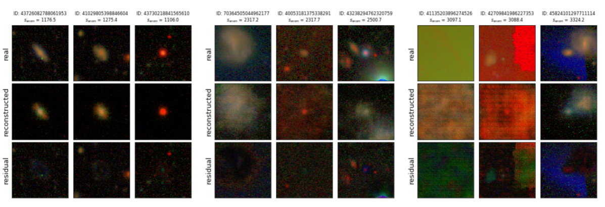

4. [Variational Image Feature Extraction for the EHT](https://arxiv.org/abs/2012.07889)

   VLBI图像重建术。

5. [A Statistical Estimation of the Occurrence of Extraterrestrial Intelligence in the Milky Way Galaxy](https://arxiv.org/abs/2012.07902)

   Extraterrestrial Intelligence (ETI) 。他们设计了一个模型来估计银河系内地外生命，主要研究三个参数：abiogenesis 的概率，进化时标（Tevo），自我毁灭的概率（Pann），发现第三个参数严重影响智慧生命的年龄。模拟表明在据银河系中心4kpc的位置在80亿年的时间处是ETI的峰值，离开峰值点，复杂生命在时间和空间上都减少。

6. [Identifying and Repairing Catastrophic Errors in Galaxy Properties Using Dimensionality Reduction](https://arxiv.org/abs/2012.07855)

   对银河系演化的理解来自各种大型巡天项目，但是每个巡天项目只调查了百分之几的部分，可能不够准确。也发现了测光红移和光谱红移严重偏离的天体。通过t-SNE来聚类，并分辨特殊天体。

## 2020-12-17

1. [Systematics-insensitive Periodogram for finding periods in TESS observations of long-period rotators](https://arxiv.org/abs/2012.08972)

   [TESS-SIP](https://github.com/christinahedges/TESS-SIP)，使用线性模型，消除仪器系统差和正弦分量，然后用Lomb-Scargle做周期分析。针对TESS开发，创建一个$s\times t$的稀疏矩阵，只在块对角线上有值，旨在消除TESS14天的观测效应。

2. [A Resource for Creating a Website to Promote Your Scientific Work](https://arxiv.org/abs/2012.08553)

   调查了天文学家有自己的网站的人，附录里有他们的建议。

## 2020-12-18

1. [Isochrone fitting in the Gaia era. III. Distances, ages and masses from UniDAM using Gaia eDR3 data](https://arxiv.org/abs/2012.09690)

   他们开发过的工具[UniDAM](https://github.com/minzastro/unidam)，[A Unified tool to estimate Distances, Ages, and Masses (UniDAM) from spectrophotometric data](https://www.aanda.org/articles/aa/abs/2017/08/aa30090-16/aa30090-16.html#FN1)可以从分光光度数据和Gaia EDR3视差的组合中可以估算距离、年龄和质量。

2. [StarcNet: Machine Learning for Star Cluster Identification](https://arxiv.org/abs/2012.09327)

   使用StarcNet（一种多尺度卷积神经网络）对图像中星团做分类，准确率有68.6%（四类）/ 86.0%（两类）。

   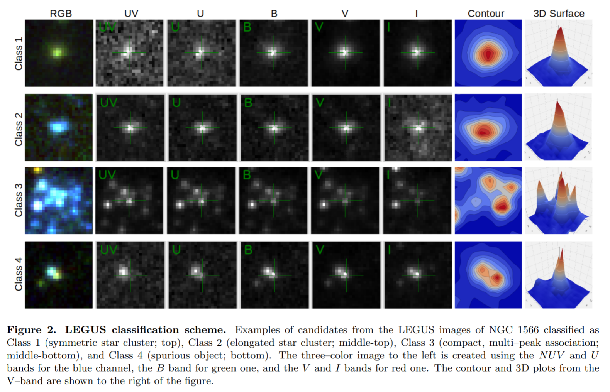

## 2020-12-21

1. [ESO's Exposure Time Calculator 2.0](https://arxiv.org/abs/2012.09860)

   使用python开发的La Silla, VLT and ELT instruments的曝光时间计算器。

2. [Exploring and Interrogating Astrophysical Data in Virtual Reality](https://arxiv.org/abs/2012.10342)

   定制的交互式VR工具（称为IDAVIE套件）的开发和结果，这些工具是由星系演化、宇宙网大尺度结构、星系与星系之间的相互作用以及附近星系的气体/运动学的调查和定向观测研究所提供的信息和驱动的。以实现在虚拟现实中查看数据。

   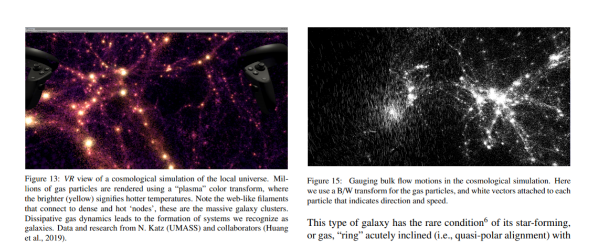

3. [Interactive Cosmology Visualization Using the Hubble UltraDeep Field Data in the Classroom](https://arxiv.org/abs/2012.09994)

   使用Java开发的哈勃深场图像查看的工具，可以以超过$500\times10^{12}$倍的光速查看红移从0-6（大约是大爆炸后1Gyr）的宇宙。http://ahah.asu.edu/exercises.html，https://astrosom.com/Jan2018.php，http://ahah.asu.edu/clickonHUDF/index.html。

4. [The updated BaSTI stellar evolution models and isochrones: II. alpha-enhanced calculations](https://arxiv.org/abs/2012.10085)

   BaSTI依据恒星演化模型绘制等龄线的[工具](http://basti-iac.oa-teramo.inaf.it/)，这篇文章介绍的是更新的版本。等龄线包括了20Myr-14.5Gyr的年龄范围，包括前主序。（他们这个界面和今天的第一篇文章的界面很像）

## 2020-12-22

1. [The Tsinghua University-Ma Huateng Telescopes for Survey: Overview and Performance of the System](https://arxiv.org/abs/2012.11456)

   马化腾冠名，清华-马化腾巡天望远镜。

   
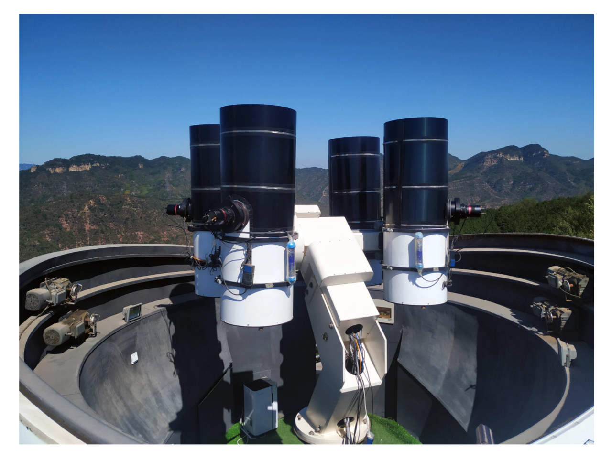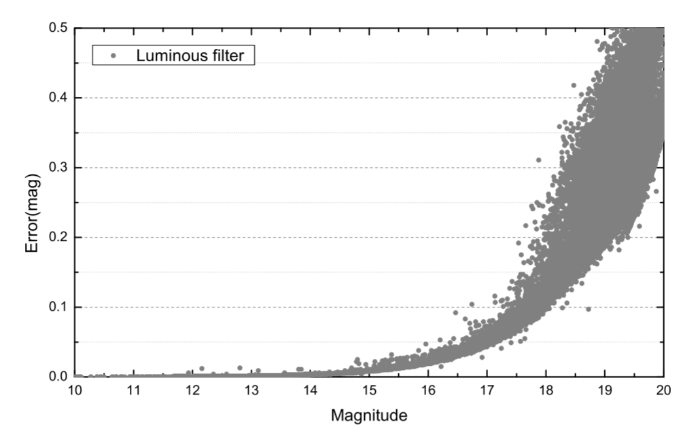

2. [ESCAPE -- addressing Open Science challenges](https://arxiv.org/abs/2012.11534)

   快逃科学技术研究院 - 欧洲分院。ESCAPE (European Science Cluster of Astronomy & Particle physics ESFRI research infrastructures)，欧洲天文学与粒子物理科学集群ESFRI研究基础设施，旨在应对天体物理学和基于加速器的物理与核物理ESFRI项目共同面临的开放科学挑战。

3. [TOPCAT Visualisation over the Web](https://arxiv.org/abs/2012.10560)

   TOPCAT可以部署在线版本了，可以在线请求任何的绘图选项，并且嵌入到Jupyter笔记本中。目前已经发布STILTS (v3.3)，可以被公众接触到。

4. [Untangling the Galaxy III: Photometric Search for Pre-main Sequence Stars with Deep Learning](https://arxiv.org/abs/2012.10463)

   使用恒星Av、Parallax、G、Bp、Rp、J、H、K的输入数据，使用卷积神经网络，输出YSO的年龄预测。使用Isochrone给定的恒星年龄来训练。有训练出来的Orion Complex年龄。

   
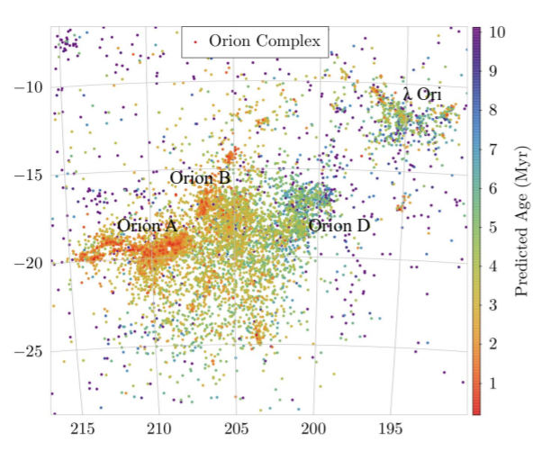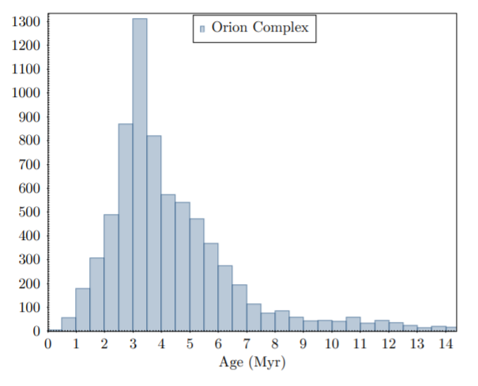

   下面这个图有点意思。说是看到了Local Bubble，左图中间的图。

   
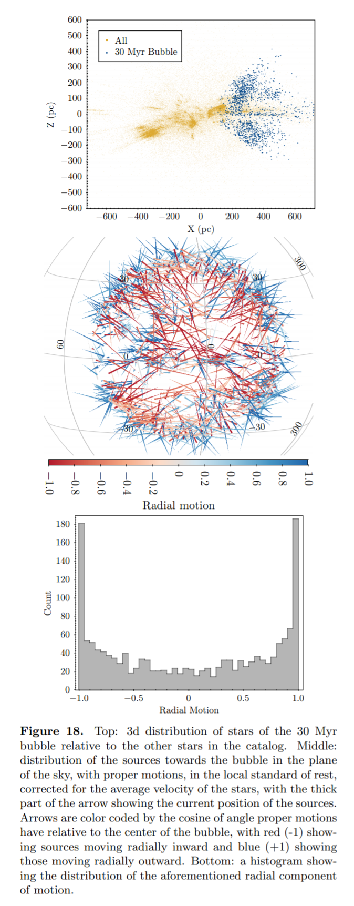

5. [Photometric and spectroscopic analysis of Comet 29P/Schwassmann-Wachmann 1 activity](https://arxiv.org/abs/2012.10705)

   用6-m BTA telescope (SAO RAS, Russia)和1.6-m telescope of the National Laboratory for Astro-physics (LNA, Brazil)在February 20, 2012, and on May 31, 2011观测了29P。发现了CO+和N2+的释放。以及使用图像增强技术研究彗星形态，发现了两个喷流。

   
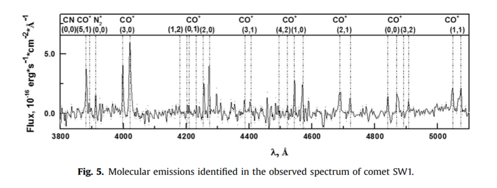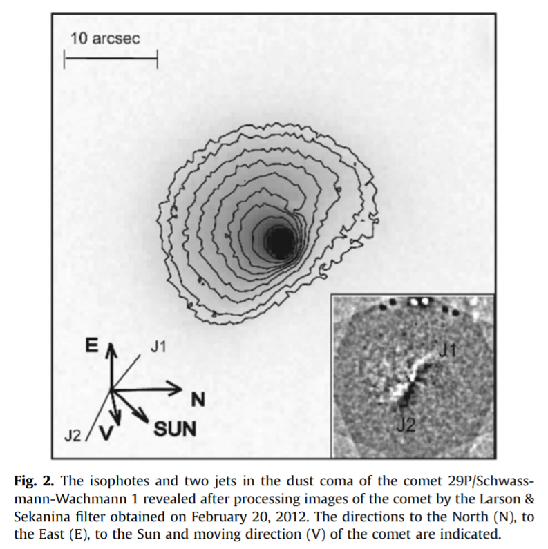

## 2020-12-23

1. [A High-Resolution View of Fast Radio Burst Host Environments](https://arxiv.org/abs/2012.11617)

   现在有13个FRB找到了宿主星系，其中有3个重复暴（121102、180916、190711）和10个非重复暴。这篇文章里给了8个（包括3个重复暴）的宿主星系的HST的图像。做了点统计，说FRB不位于恒星形成率高的地方。

2. [Fourier domain excision of periodic radio frequency interference](https://arxiv.org/abs/2012.11630)

   RFI有一些非常明亮，容易消除。有一些很弱，但是有周期性，这种干扰信号的存在会淹没天体的信号，用C封装好的[工具](https://github.com/ymaan4/rficlean)。三个步骤消除RFI：

   - 0按块读入数据，用FFTW做DFT，识别出周期信号的RFI剔除，然后IDFT替换掉原始数据。
   - 计算块的均值和方差（如果是白噪声的信号，那均值和方差应该相对稳定），找到离群的区块，用相邻的未被污染的区块代替。
   - 最后对整个事件序列用阈值消除RFI。

3. [The impact of Solar wind variability on pulsar timing](https://arxiv.org/abs/2012.11726)

   受到太阳风的影响，而导致的DM变大，脉冲星计时也会相应地受到影响。使用LOFAR对14颗脉冲星6年的低频监测的数据，检验了模型，证明具有时变振幅的球形模型比具有恒定振幅的球形模型对观测结果的模拟效果更好。

## 2020-12-24

1. [Citizen COmputing for Pulsar Searches: CICLOPS](https://arxiv.org/abs/2012.12629)

   CICLOPS将脉冲星的搜索转换为3D视频游戏。使用用户的CPU和GPU计算，构建了分布式计算平台，找到最佳的候选脉冲。

2. [Results of the Photometric LSST Astronomical Time-series Classification Challenge (PLAsTiCC)](https://arxiv.org/abs/2012.12392)

   在Kaggle上做的测光数据分类比赛。boosted decision trees,、neural networks,和multi-layer perceptrons在Ia型超新星和千新星上表现出色。

3. [Space Debris -- Optical Measurements](https://arxiv.org/abs/2012.12549)

   使用光学望远镜寻找空间碎片并分类，后续观测调查轨道。

## 2020-12-25

1. [Inverse analysis of asteroseismic data: a review](https://arxiv.org/abs/2012.12925)

   描述了星震反演的方法，并概述了在测量恒星内部方面取得的进展。星震反演可以推断一颗恒星的

   - 进化史：年龄、质量、初始成分；内部结构：各个位置的等温声速；径向差旋转：核和表面的旋转速率；纬度旋转差：不同纬度的表面旋转速率；其他数据：平均密度、声速半径、声速梯度。

   但是反演问题通常是ill-posed。就像给一个数列1234，之后可能是5，6 (a sequence known as Ulam’s numbers)，7 (numbers 𝑛 such that $(68\times10𝑛 + 7)/3$ is prime)，10 (counting in base 5)，17 (𝑛 such that 𝑛 · 𝜑(𝑛) is a palindrome, where 𝜑 is Euler’s totient function)，−42𝜋 (a sequence we have just invented)。一个好的反解问题需要解**存在**、**唯一**并且**稳定**。但是星震的反解问题会遇到这样的问题。
   $$
   f(\tau,{\bf x})={\bf y}
   $$
   $\tau$是年龄

   ${\bf x}=[mass,\ chemical\ composition,\ etc.]$，${\bf y}=[effective\ temperature,\ metallicity,\ oscillation\ frequencies,\ etc.]$

   方法：Machine learning、Optimization（贝叶斯拟合之类的）、Scaling relations（以太阳为参考，估算恒星年龄之类的）。

   星震问题是通过，推导恒星与适当选择的参考模型之间内部声速曲线的差异，这可以通过分析它们振荡频率的差异来实现。

2. [Self-Supervised Representation Learning for Astronomical Images](https://arxiv.org/abs/2012.13083)

   在SDSS的多波段星系测光数据上使用无监督学习框架，用于星系形态分类，使用Galaxy Zoo 2数据集和SDSS光谱标签来fine-tune，估计光度红移。

## 2020-12-28

圣诞节停更。

## 2020-12-29

1. [Stellar parametrization of LAMOST M dwarf stars](https://arxiv.org/abs/2012.14080)

   使用LAMOST的光谱和APOGEE的温度和金属丰度作为标签，训练[SLAM](https://arxiv.org/abs/1908.08677)（Stellar LAbel Machine）。SLAM就是普通的支持向量回归。他们先预处理数据，把标签和光谱流量归一化并标准化，然后使用训练集训练在每个像素波长训练SVR，最后从观测光谱预测。

2. [A search for hard X-ray bursts occurring simultaneously to fast radio bursts in the repeating FRB 121102](https://arxiv.org/abs/2012.14266)

   他们在FRB121102射电爆发时期周围从Swift/BAT的事件中搜寻短时硬X射线暴，发现最好的候选体也跟背景波动一致，也就是说，没有发现硬X射线暴。

3. [Triaxiality in galaxy clusters: Mass versus Potential reconstructions](https://arxiv.org/abs/2012.13413)

   使用PCA和椭圆拟合，研究relaxed和dynamically active simulated clusters中等密度线和等势线的形状。将这种PCA算法应用于数据的三种不同的表示方式：

   - binned isosurfaces (3D) or isocontours (2D) of the distribution of the quantity of interest;
   - the full spatial distribution of the quantity of interest within isosurfaces (cumulative);
   - a “binary” version of the cluster in which the value of the quantity of interest is set to one within the isosurfaces (uniform distribution).

   结果就是把它降维到一维上，看光度之类随广义半径的变化。

   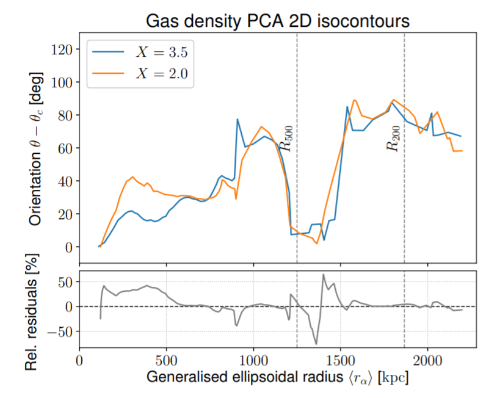
