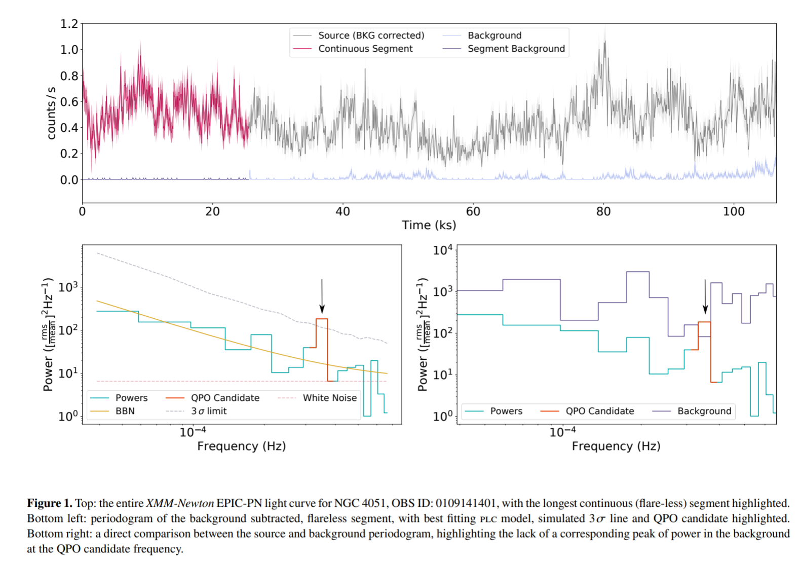
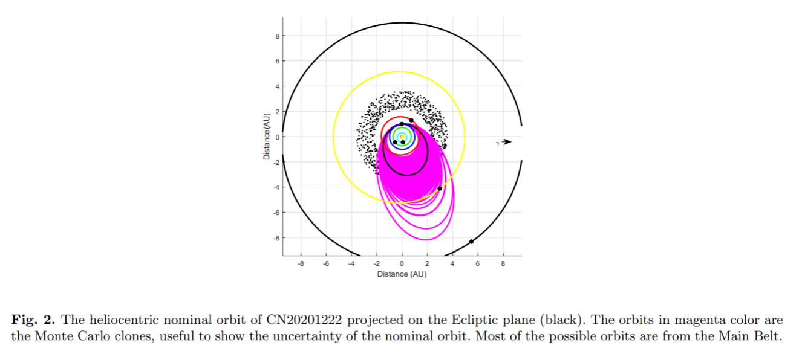
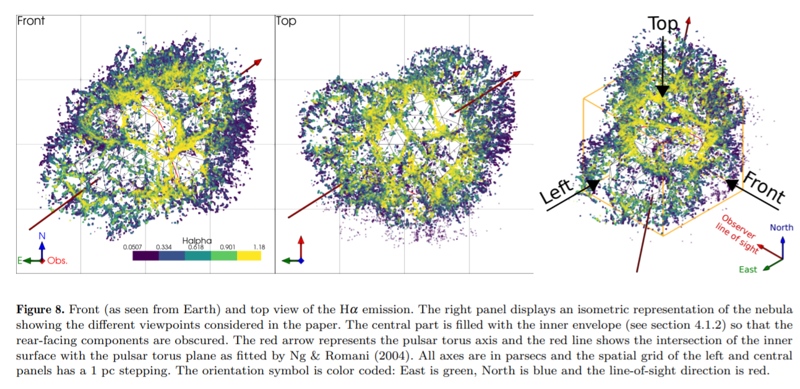
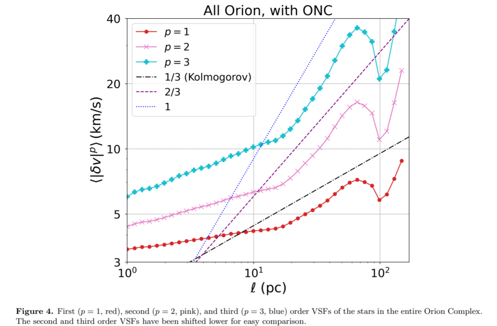
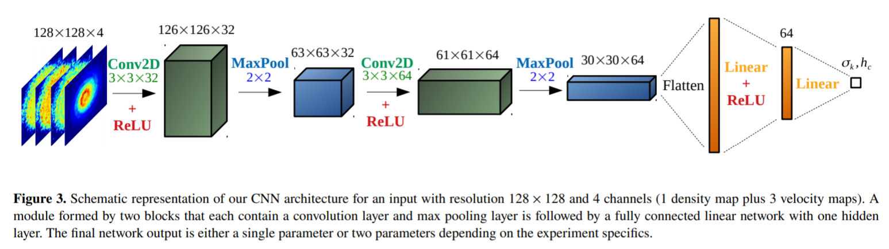
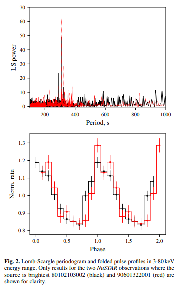
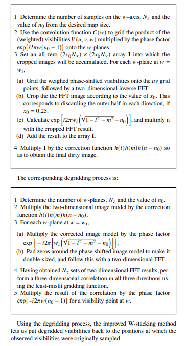
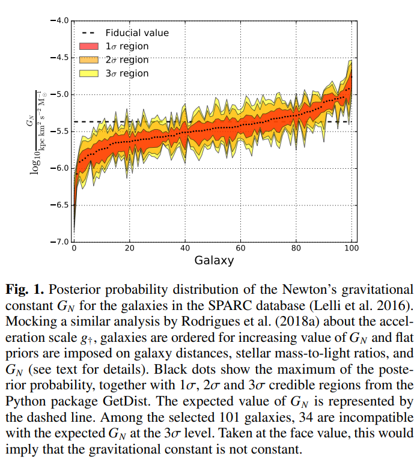

## 2021-01-01

1. [The Fast Radio Burst Dispersion Measure Distribution](https://arxiv.org/abs/2012.15051)

   使用ASKAP和Parkes望远镜探测到的FRB的DM建立了DM的分布模型。
   $$
   \begin{aligned}
   &\frac{dR_F}{dz}(F_\nu>F_0,z;\alpha,\gamma,n,F_0,F_{min},F_{max})\\

   &=4\pi D_H^5\left(\frac{D_M}{D_H}\right)^4\frac{(1+z)^{\alpha-1}}{E(z)}\psi_n(z)

   \left\{\begin{aligned}
   &0 &F_0>F_{max}\\
   &\frac{(1+z)^{2-\alpha}}{4\pi D_L^2}\left(\frac{F_{max}^{1-\gamma}-F_{0}^{1-\gamma}}{F_{max}^{1-\gamma}-F_{min}^{1-\gamma}}\right) & F_{min}\le F_0\le F_{max}\\
   &\frac{(1+z)^{2-\alpha}}{4\pi D_L^2} &F_0<F_{min}
   \end{aligned}\right.

   \end{aligned}
   $$

   $$
   \frac{dR_F}{dDM}(DM;\alpha,\gamma,n,F_0,F_{min},F_{max})=\frac{dR_F}{dz}(F_\nu>F_0,z;\alpha,\gamma,n,F_0,F_{min},F_{max})/\frac{d\overline{DM}}{dz}
   $$

   其中
   $$
   \psi_n(z)=K\left(\frac{0.015(1+z)^{2.7}}{1+((1+z)/2.9)^{5.6}}\right)^n\ yr^{-1}\ Mpc^{-3}
   $$

   $$
   \overline{DM}(z)=\frac{3H_0c\Omega_b}{8\pi Gm_p}\int_0^z\frac{(1+z')\left[\frac34\chi_{e,H}(z')+\frac18\chi_{e,He}(z')\right]}{\sqrt{(1+z')^3\Omega_m+\Omega_\Lambda}}dz'
   $$

   拟合得到的$\alpha=2.2^{+0.7}_{-1.0}$和$\gamma=2.0^{+0.3}_{-0.1}$。那这篇文章主要是跟[LuoRui (2018)](https://academic.oup.com/mnras/article/481/2/2320/5088370)以及[LuoRui(2020)](https://academic.oup.com/mnras/article/494/1/665/5805205?login=true)文章里描述的东西有点类似。

2. [Testing Models of Periodically Modulated FRB Activity](https://arxiv.org/abs/2012.15354)

   FRB180916和FRB121102存在可能的周期性，重复暴的周期可能被调制，导致Pdot对周期不敏感。被调制的周期性FRB可能是由沿预处理盘轴线在圆锥内游走的窄束发射造成的，例如X射线双星中的吸积盘。那么，既非吸积也非双星的中子星所产生的FRB 200428就显示出普遍性：相干发射可能发生在广泛的环境中。

3. [Predicting future astronomical events using deep learning](https://arxiv.org/abs/2012.15476)

   他们的代码在[这里](https://github.com/SSingh087/seq-pred)。使用ConvLSTM组成的网络，训练了Sa、Sb、S0和Sd星系合并的演化，以及$15M_\odot$的前景星系较高红移处引力透镜的演化。

4. [Age-metallicity dependent stellar kinematics of the Milky Way disc from LAMOST and Gaia](https://arxiv.org/abs/2012.14628)

   利用来自LAMOST和Gaia的118,945颗红巨星分支（RGB）的样本，研究了$7<R<13$kpc的银河盘的恒星运动学。最突出的特征是速度、作用和轨道参数分布的强烈变化，从年轻的、富含金属的薄盘到老的、缺乏金属的厚盘，一些较小尺度的结构--如速度流、南北不对称和螺旋臂的运动学特征--被清晰地揭示出来。

   重点是他们使用的数据，[Wu et al. (2019)](https://academic.oup.com/mnras/article/484/4/5315/5321195)里有用LAMOST和Gaia得到的了0.64 million RGB（Red Giant Branch）恒星的质量和年龄。数据在[这里](http://dr4.lamost.org/doc/vac)。在[Wu et al. (2018)](https://academic.oup.com/mnras/article-abstract/475/3/3633/4772882?redirectedFrom=fulltext)中他们介绍了使用KPCA估计质量和年龄的方法。

## 2021-01-05

1. [In Situ Geochronology for the Next Decade: Mission Designs for the Moon, Mars, and Vesta](https://arxiv.org/abs/2101.01131)

   构思了一个直接对行星表面定年的载荷，包括两台测量辐射年龄的仪器、一台成像光谱仪、光学相机、微量元素分析仪和样品采集处理系统，对月球、火星和灶神星研究。Geochronology，地质年代学，根据古代和近代岩浆产物的年龄约束地壳形成，确定地质事件的绝对年龄，是对行星和太阳系形成和演化研究的基础。

2. [Implementing CUDA Streams into AstroAccelerate -- A Case Study](https://arxiv.org/abs/2101.00941)

   在GPU上异步运行程序，需要在CUDA Streams上执行。文章以CUDA流在AstroAccelerate中的实现为例子，这是一个用于时域射电天文中实时信号处理的pipline的GPU加速算法，可以做单脉冲搜索和傅里叶加速搜索等。

   在输入数据时，将信号分为n个时间块，除以所需要的CUDA流的数量，分成较小的块，然后与流ID关联，对所有时间块重复操作到数据处理完毕。需要注意的是要把内存块正确地分配给CUDA流。

3. [New Insights into Time Series Analysis IV: Panchromatic and Flux Independent Period Finding Methods](https://arxiv.org/abs/2101.00918)

   全相关色指数panchromatic correlated indices $K_{f_i}^{(s)}$和$L_{pfc}$用于量化相位空间中光变曲线的平滑度，他们造了一个用于多波段观测的新周期搜寻方式。
   $$
   PK^{(s)}=\frac{N^{(+)}}{N}\quad PL^{(s)}=\frac1N\sum_{i=1}^NQ_i^{(s)}
   $$

4. [The Brightness of VisorSat-Design Starlink Satellites](https://arxiv.org/abs/2101.00374)

   430个可见的VisorSats在550km的视亮度为$5.92\pm0.04$，比原设计的星链卫星暗1.29等。VisorSats是SpaceX和天文学界合作设计，在原星链卫星上加了个遮阳帘。

5. [Detecting residues of cosmic events using residual neural network](https://arxiv.org/abs/2101.00195)

   使用残差神经网络搜索GW。

## 2021-01-06

1. [Searching for energy-resolved quasi-periodic oscillations in AGN](https://arxiv.org/abs/2101.01194)

   AGN中的X射线的准周期振荡（QPO）能够帮助了解高度弯曲的时空中的吸积性质。下图是他们找到的QPO的候选体。

   周期图：We produce periodograms for each energy-resolved lightcurve (reduced to 2 𝑛 bins where 𝑛 is an integer) by applying a fast-Fourier transform (FFT) and a fractionalrms normalisation。

   

2. [The young massive star cluster Westerlund 2 observed with MUSE. III. A cluster in motion -- the complex internal dynamics](https://arxiv.org/abs/2101.01694)

   使用MUSE观测的年轻大质量星团Westerlund 2的数据分析了恒星和气体的运动学，平均径向速度是$15.9km/s$，与Wd2是云云碰撞的假设一致。他们估算了动力学质量的范围，算式如下：
   $$
   M_{dyn}=\eta\frac{\sigma^2r_{hm}}{G}\quad r_{hm}=a\sqrt{0.5^{2/(2-\gamma)}-1}\quad t_{dyn}=\sqrt{\frac{r_{vir}^2}{GM_{phot}}}
   $$
   $r_{hm}$是半质量半径，$\eta$是将观测值与理论值联系起来的无量纲参数，对于$\gamma>4$的星团$\eta=9.75$。$\gamma$和a是EFF profile的参数，可以看[Portegies Zwart et al. 2010](https://www.annualreviews.org/doi/10.1146/annurev-astro-081309-130834)。

3. [A classification of natural and social distributions Part one: the descriptions](https://arxiv.org/abs/1507.03408)

   
这篇不是今天的，是2015年的。

   这篇文章对自然科学和社会科学中的“规律”进行了调查。重点是Appendix，里面有各种活动对应的最好的分布。

## 2021-01-07

1. [Comparing Classification Models on Kepler Data](https://arxiv.org/abs/2101.01904)

   使用逻辑回归、决策树和神经网络来对开普勒的数据做分类。检验分类结果用的是McNemar's test（麦克尼马尔卡方检验）：
   $$
   \chi^2=\frac{(b-c)^2}{b+c}
   $$
   这是[配对的四格资料表的卡方检验](https://bookdown.org/wxhyihuan/Notebook-of-medical-statistics-1605856202966/%E7%AC%AC%E4%B8%83%E7%AB%A0-chi2%E6%A3%80%E9%AA%8C.html)。

## 2021-01-08

1. [The Great Chinese Fireball of December 22, 2020](https://arxiv.org/abs/2101.02457)

   是去年12月23日青海的那个火流星。被美国的监视卫星看到（CNEOS），速度$13.6km/s$，爆炸高度$35.5km$，爆炸碎片范围$(+32.3^\circ N;96.3^\circ E)$到$(+30.3^\circ N;96.5^\circ E)$，大约$4000km^2$。用蒙特卡洛做模拟，发现可能来自于小行星带。

   

2. [Automatic identification of outliers in Hubble Space Telescope galaxy images](https://arxiv.org/abs/2101.02623)

   介绍了一种用于自动检测离群星系图像的无监督机器学习算法，并将其应用于多个哈勃太空望远镜领域。该算法不需要训练，因此不依赖于准备干净的训练集。将该算法应用于大量星系集合，检测到了多种离群星系图像。该算法并不完美，因为并不是所有被算法检测到的天体都确实被认为是离群值，但它将数据集减少了两个数量级，可以进行实际的人工识别。

## 2021-01-11

1. [3D mapping of the Crab Nebula with SITELLE. I. Deconvolution and kinematic reconstruction](https://arxiv.org/abs/2101.02709)

   SITELLE是位于夏威夷的3.6米CFHT望远镜上新近装备的成像光谱仪。这是一架比较独特的基于迈克耳孙干涉仪的傅里叶变换光谱仪，并拥有较大的视场。SITELLE可以一次性获得整个11x11平方角分内天体的高分辨光谱。这种光谱仪的技术特点是非常适合进行有气体发射线的天体的研究。

   这次蟹状星云的观测是2016年仪器测试时进行的，也有展示仪器能力的作用。这组科学家对观测到的蟹状星云中气体的不同发射线进行了建模分析，并通过发射线的视向速度构建除了一幅非常完整的3-D图像。主要的结论其实就是蟹状星云的3维轮廓并不像之前预想的那么“椭球”，而是有点“心形”。

   

2. [2021-H0 Odyssey: Closed, Phantom and Interacting Dark Energy Cosmologies](https://arxiv.org/abs/2101.03129)

   最新的宇宙学数据分析表明：

   - A closed universe is preferred by the Planck data at more than 99% CL
   - Interacting scenarios offer a very compelling solution to the Hubble constant tension.

3. [Ultra Fast Astronomy: Optimized Detection of Multimessenger Transients](https://arxiv.org/abs/2101.02714)

   Ultra Fast Astronomy是一个新的领域，通过改进探测器技术，可以发现毫秒到纳秒时间尺度的光学瞬变现象。介绍了一些分析和一些数值优化，包括原始探测和科学特征分析，如Fisher信息分析，以限制突发延迟-闪光持续时间的关系。

## 2021-01-12

1. [Measuring Turbulence with Young Stars in the Orion Complex](https://arxiv.org/abs/2101.03176)

   他们也是用的Apogee的那篇文章的选源方法，没说用的APOGEE的DR几，Gaia是DR2，选出了恒星，然后计算猎户座不同区域恒星对之间的距离和速度差，做了个图，说湍流明显存在。

   

2. [Iron Mobility During Diagenesis at Vera Rubin Ridge, Gale Crater, Mars](https://arxiv.org/abs/2101.03767)

   2020年9月份就能下到的文章，现在才贴到ArXiv上。火星上一个小山梁，起名Vera Rubin，轨道器看到这个地区的FeO含量异常高，让好奇号去测。

3. [Four decades of advances from MSDP to S4I and SLED imaging spectrometers](https://arxiv.org/abs/2101.03918)

   The Multichannel Subtractive Double Pass (MSDP)，多通道减法双通是一种成像光谱技术，可在二维视场内以高空间和时间分辨率观测谱线轮廓。Spectral Sampling with Slicer for Solar Instrumentation(S4I)，太阳仪器的光谱取样与切片机可以与新的快速偏振分析相结合。这种新一代的MSDP技术能够很好地适应大型望远镜。此外，还介绍了该仪器的衍生紧凑版本--the Solar Line Emission Dopplerometer (SLED)的目标，太阳线发射多普勒仪致力于对在禁铁线和突出物中观测到的日冕环进行动态研究。它是为观测日全食而设计的，并分别部署在弗罗茨瓦夫日冕仪和洛姆尼基峰日冕仪上，用于观测突出和日冕。

4. [Constraining the Fast Radio Burst (FRB) properties using the joint distributions of dispersion measure and fluence of the events detected at Parkes, ASKAP, CHIME and UTMOST](https://arxiv.org/abs/2101.04082)

   使用Parkes，ASKAP，CHIME和UTMOST四台望远镜探测到的FRB的事件，对DM和Fluence的联合分布建模来限制FRB的性质。
   $$
   \begin{aligned}
   &F=\frac{\bar\phi(z)B(\vec{\theta})}{4\pi r^2}E\qquad E_\nu=E\phi(\nu)=EK\nu^\alpha\\

   &n(E, z)=\left\{\begin{aligned}
   &\frac{n_0(z)}{\bar E}\exp\left(-\frac{E}{\bar E}\right) & \gamma=0\\
   &\frac{n_0(z)}{\bar E}\frac{\gamma}{\Gamma(1+\gamma)}\left(-\frac{\gamma E}{\bar E}\right)^\gamma\exp\left(-\frac{\gamma E}{\bar E}\right) & \gamma>0
   \end{aligned}\right.
   \end{aligned}
   $$

## 2021-01-13

1. [The Science of Fundamental Catalogs](https://arxiv.org/abs/2101.04175)

   这篇综述论文讨论了天体测量目录的科学、其目前的应用和未来的前景，以使基础天文学、天体物理学和引力物理学取得进展。我们讨论了基本目录的概念、它们的实际实现以及未来的前景。我们特别关注星表的天体物理实现，如奥尔特常数(Oort constants)的测量、世俗差(secular aberration)和视差(parallax)，以及星宿学(asteroseismology)。我们还考虑了基本目录在引力物理学中的应用，以检验广义相对论和探测宇宙学起源的超长引力波。

2. [Correction to the photometric colors of the Gaia Data Release 2 with the stellar color regression method](https://arxiv.org/abs/2101.04290)

   是刘继峰老师参与的一篇文章。Gaia DR2的测光精度随着星等降低会到达10mmag的误差，限制了它在科学中发挥作用。使用LAMOST DR5的50万颗恒星，应用恒星光谱的颜色回归来校准Gaia的$G-G_{rp}$和$G_{bp}-G_{rp}$颜色。

## 2021-01-14

1. [The Physics of Fast Radio Bursts](https://arxiv.org/abs/2101.04907)

   发表在中国科学上 (SCIENCE CHINA Physics, Mechanics & Astronomy)的FRB综述文章。2013年，FRB才取了FRB这个名字。文章讨论了观测性质 (observational property)、传播效应 (propagation effect)、种群研究 (population study)、辐射机制 (radiation mechanism)、源模型 (source model)以及在宇宙学中的应用 (application in cosmology)。

2. [Re-Analysis of Breakthrough Listen Observations of FRB 121102: Polarization Properties of Eight New Spectrally Narrow Bursts](https://arxiv.org/abs/2101.05172)

   使用GBT的Breakthrough Listen observation计划中看到的FRB 121102的八个脉冲，重新分析它们的偏振，发现它们有近100%的线偏振，Faraday rotation measures (RM) bordering $9.3\times10^4rad\ m^{-2}$。确认了这几个是真的FRB，and further support the use of sub-banded search techniques in FRB detection.

3. [*mirkwood*: Fast and Accurate SED Modeling Using Machine Learning](https://arxiv.org/abs/2101.04687)

   由于星系恒星形成历史和尘埃衰减曲线的不确定性，用于推导星系物理特性的传统光谱能量分布(SED)拟合代码往往是几个级别的不确定因素。

   SED拟合通常用贝叶斯拟合，是计算密集型任务。开发了{mirkwood}：一个用户友好的工具，由一系列基于监督机器学习的模型组成，能够将星系通量与它们的属性进行非线性映射。

## 2021-01-15

1. [A million binaries from Gaia eDR3: sample selection and validation of Gaia parallax uncertainties](https://arxiv.org/abs/2101.05282)

   从Gaia EDR3中筛选出双星目录，距离在太阳周围1kpc内。用这个样本校准EDR3的视差不确定度，因为双星的视差比较接近。他们发现，这个不确定度对于暗星 ($G\ge18$)是基本可靠的，但是对于亮星，Gaia给出的不确定度有点小。他们提供了一个经验性的拟合函数，来inflate published $\sigma_\omega$。

   先从Gaia数据中选出所有的1kpc以内的所有恒星，任意两颗都可能是双星，筛选双星的条件：

   - 投影距离小于1pc：$\theta/{\bf arcsec}\le206.265\times\omega_1/{\bf mas}$，其中$\omega_1$是两颗星中G星等较亮的星的视差。1pc对应轨道周期$10^8\ yr$，引力束缚的双星很少距离源于这个尺度，在这个尺度上，银河潮汐和两颗星之间的引力相当。

     银河系潮汐场主导双星内部加速度的距离，称为雅各比半径。在太阳附近，这个半径为：$r_J\approx1.35pc\times(M_{tot}/M_\odot)$，$M_{tot}$是双星总质量，在这个尺度上，双星会被其它恒星或分子云的引力破坏。

   - 视差限制：$|\omega_1-\omega_2|<b\sqrt{\sigma_{\omega,1}^2+\sigma_{\omega,2}^2}$，$\theta>4$时，$b=3$；$\theta<4$时，$b=6$。

   - 自行限制：$\Delta\mu\le\Delta\mu_{orbit}+2\sigma_{\Delta\mu}$，定义可以看文章里。

   他们还把Gaia EDR3和LAMOST的数据交叉匹配，在CDS Xmatch上，匹配半径是1arcsec，对于有多次观测的源，只保留G-band信噪比最高的观测，之后跟他们的目录匹配，用Gaia source ids。

## 2021-01-18

1. [Analyzing the Galactic pulsar distribution with machine learning](https://arxiv.org/abs/2101.06145)

   Velocity Map，在x-y平面上的银河系盘状投影，4张map的颜色分别是模拟的脉冲星的数密度、$v_r$、$v_\phi$、$v_z$。用CNN对脉冲星种群的Velocity Map和Maxwell kick velocity $\sigma_k$和银河系标高$h_c$之间做映射。在有真实测量到的Map之后，就可以用建立好的CNN模型来计算$\sigma_k$和$h_c$。

   

2. [Digital color codes of stars](https://arxiv.org/abs/2101.06254)

   使用预先计算的Phoenix和Tlusty恒星模型光谱，与360nm到839nm之间人类能感知到的色彩进行卷积。对不同的黑体温度、金属丰度做了网格，将恒星的颜色数字化。在色轮中说明了主序列没有黄色、绿色、青色或紫色的恒星。红矮星（光谱类型为M0V-M9V）在人眼里其实是橙色的。老的白矮星，如WD1856+534，在人眼里是淡淡的橙色，而不是白色。

   他们有代码`Spec2Col.py`可以用来把输入光谱计算为恒星颜色。[这里](https://doi.org/10.5281/zenodo.4090873)是他们的部分数据。表格5已经部署到小青上了。

3. [Emission Properties of Periodic Fast Radio Bursts from the Motion of Magnetars: Testing Dynamical Models](https://arxiv.org/abs/2101.05836)

   FRB 180916观测到周期性，在暴发期和暴发之间有小的线偏振位置角 (PA)的波动，活动窗口在高频下更窄更早，这排除了恒星伴星光厚风驱动的中子星隐没的周期性模型。这篇文章中展示了磁星曲率辐射与射电辐射的高度依赖性。

4. [Towards Cosmological Simulations of Dark Matter on Quantum Computers](https://arxiv.org/abs/2101.05821)

   使用量子计算机解决自引力-暗物质演化的非线性Schrodinger-poisson方程：
   $$
   i\frac{\partial}{\partial t}\psi=-\frac{\nabla^2}{2}\psi+aV\psi\qquad \nabla^2V=|\psi|^2-1
   $$
   量子计算机可以比经典计算机以指数级的速度进行某些计算，使用指数级的能源和内存，并且可以进行极其庞大的模拟，在具有统计学代表性的宇宙体积内准确地捕捉宇宙结构的整个动态范围。量子电路在量子态上是线性作用的，因此非线性（如宇宙学模拟中的自引力）构成了一个重大挑战。文章里描述了一种可能的解决这个问题的方法。

## 2021-01-19

1. [Bringing SOUL on sky](https://arxiv.org/abs/2101.07091)

   名字起的很独特。SOUL WFSs是Large Binocular Telescope (LBT)上的一个设备。

## 2021-01-20

1. [Galaxy Image Translation with Semi-supervised Noise-reconstructed Generative Adversarial Networks](https://arxiv.org/abs/2101.07389)

   使用深度学习神经网络，特别是使用生成式对抗网络（GANs）进行图像到图像的转换，是模拟天文图像的最强大方法之一。通过在斯隆数字巡天（SDSS）和加拿大-法国-夏威夷望远镜遗留巡天（CFHT）的多波段星系图像上进行实验，我们证明了我们的方法能够有效地恢复全局和局部属性，并优于基准图像转换模型。

## 2021-01-21

1. [Possible periodic activity in the short bursts of SGR 1806-20: connection to fast radio bursts](https://arxiv.org/abs/2101.07923)

   用相位折叠和Lomb-Scargle做SGR 1806-20的周期分析，使用包括RXTE、HETE-2、ICE和Konus的观测数据。发现了可能的周期性$398.2\pm24.45\ d$，我看他们的图是不敢说那算个周期的。

2. [The z--DM distribution of fast radio bursts](https://arxiv.org/abs/2101.08005)

   我们开发了一个复杂的FRB观测模型，考虑到了固有的宇宙学气体分布和宿主星系的贡献，并充分考虑了由于爆发宽度、色散测量和精确的望远镜光束形状而产生的观测偏差。在一定的DM以上，观测偏差会导致Macquart（DM--z）关系倒置，因此假设1-1 DM-z关系在工作中可能会得出错误的结果。

3. [The fast radio burst population evolves with the star-formation rate](https://arxiv.org/abs/2101.07998)

   FRB种群随着红移的变化与恒星形成率相一致。模型就是上一篇文章。

## 2021-01-22

1. [Massive White Dwarfs in Young Star Clusters](https://arxiv.org/abs/2101.08300)

   为了被认为是星团成员，白矮星必须具有适当的运动和视差，其运动和视差在其潜在母星团运动和视差的2、3或4σ范围内，这是以其天空区域的污染程度为基础的，其冷却年龄小于星团年龄，其质量与IFMR大致一致。

## 2021-01-25

1. [Revealing the cosmic reionisation history with fast radio bursts in the era of Square Kilometre Array](https://arxiv.org/abs/2101.08798)

   揭示宇宙再电离历史是银河系外天文学的前沿。通过测量CMB的偏振功率谱可以约束电离历史。这里是想使用FRB的DM测量$DM_{IGM}$来衡量星系间介质中电离物质数量。

## 2021-01-26

1. [Complications in the ALMA Detection of Phosphine at Venus](https://arxiv.org/abs/2101.09831) 和 [Claimed detection of PH3 in the clouds of Venus is consistent with mesospheric SO2](https://arxiv.org/abs/2101.09837)

   事情都过去这么久了，今天又冒出两篇文章讨论金星上PH3的事情。在266.94GHz处会有SO2和PH3的谱线共同起作用，SO2在257.54 GHz处也会有特征谱线。最开始的文章，就是因为在257.54GHz处没有看到SO2的谱线，认为SO2在金星大气中并不显著，因此将266.94GHz的特征归因于PH3。

   第一篇讲他们重新处理了ALMA的数据，并且研究了ALMA天线配置导致的不同空间尺度上的表观谱线稀释现象( apparent spectral line dilution)。表明在266.94GHz的PH3的光谱特征并不明显。因为谱线稀释，导致10ppb的SO2并不会在257.54GHz处被ALMA探测到。

   第二篇讲他们假设PH3的特征是存在的，使用辐射转移模型来分析PH3，发现266.94 GHz的线并不是起源于云层，而是在金星中间层80公里以上。这种谱线的形成水平与假设PH3在金星云层中产生的化学模型不一致。而典型的金星SO2垂直分布和丰度与JCMT 266.94 GHz的特征相吻合，因为line dilution，257.54GHz处的SO2辐射特征在ALMA数据中仍然无法检测到。

## 2021-01-27

1. [Evidence for Radial Expansion at the Core of the Orion Complex with Gaia EDR3](https://arxiv.org/abs/2101.10380)

   用SNN（Shared Nearest Neighbor）对Orion Complex中心的两个星团聚类：Briceño-1 和 Orion Belt Population-near (OBP-near)。然后使用APOGEE和GALAH的径向速度数据，发现这两组恒星从一个共同的中心径向膨胀，并且膨胀只局限于这两个星团附近，其他星团有更复杂的运动。

   在[Chen et al.(2020)](https://arxiv.org/abs/0912.3693)中，他们使用了SNN对猎户座区域恒星做了分类，只用了Gaia的5D信息，其中位置转换到笛卡尔坐标系，自行依然使用了Gaia中的自行测量。使用SNN找到了25个stellar groups，还跟t-SNE做了比较，当然，并没有提他们用t-SNE的参数。

   他们在研究时减掉了太阳系在笛卡尔坐标系中的运动，$(U,V,W)_\odot=(11.1,\ 12.14,\ 7.25)km/s$，这个速度在[Schonrich et al. 2010](https://arxiv.org/abs/0912.3693)中有介绍。并且减掉了银河系旋转的速度，使用Galpy中的MilkyWay2014 potential。位置和速度的误差用Monte Carlo方法得到，就是按照每个测量量的均值和误差作为高斯分布的两个参数，采样1万次，对得到的1万组速度和位置的均值和标准差作为均值和误差。

   年龄使用PARSEC的等龄线，年龄范围从1~20Myr，步长0.05Myr，消光$A_V$从0.0-1.0mag，步长0.1mag，假设Z=0.00158。使用最大似然估计，假设误差是高斯的，来估算年龄和消光。每个星团中恒星的年龄当作是同样的年龄。

   他们对这两个星团减掉了两个星团合并的平均速度，在XYZ-V的三维图（V方向用锥形箭头，颜色表示大小）上看到了类似膨胀的运动，然后在$(v_i - i)_{i=x,y,z}$的三个图中对两个参数做拟合，发现$v_i$随$i$增加而变大，使用Kendall’s τ correlation test来检验这个相关性。膨胀时标用线性拟合出来的斜率的倒数表示。

   最后结论处，他们表示他们将在恒星的这种径向膨胀和恒星反馈中建立联系。

2. [New star clusters discovered towards the Galactic bulge direction using Gaia DR2](https://arxiv.org/abs/2101.10982)

   这还有一个找星团的，他们之前提出了一种方法[Ferreira et al. (2019)](https://arxiv.org/pdf/1812.10795.pdf)。在应用了一系列filters来加强星表中的成团对比度，之后检查恒星自行。

3. [Identifying Planetary Transit Candidates in TESS Full-Frame Image Light Curves via Convolutional Neural Networks](https://arxiv.org/abs/2101.10919) 

   The Transiting Exoplanet Survey Satellite (TESS)，以前不知道TESS到底是干嘛的，也没去查，这里提到了是“在其为期两年的任务中测量约75%的天空中的恒星，产生数百万条TESS 30分钟的光变曲线，用于分析寻找过境系外行星”。他们使用简单的CNN来筛选可能的行星过境信号，Input-光变曲线，OutPut-真信号的可能性，结构9个卷积块（1D卷积+激活+Spatial Dropout+Pooling+Batch Normalization），3个全连接块（Dense+Activation+Dropout+Batch Normalization），一个全连接+Sigmoid输出层。

4. [SGR 0755−2933: a new High Mass X-ray binary with the wrong name](https://arxiv.org/abs/2101.10834)

   软伽马暴SGR 0755-2933被Swift/BAT发现，后续有Swift/XRT、NuSTAR和Cahndra对其做软X射线对应体的后续观测，他们使用Lomb-Scargle对三个观测做分析，发现了明显的308s周期，折叠后，看到光变曲线如下图，猜测是双星。

   

5. [Science and survival: insights from Astronomy](https://arxiv.org/abs/2101.10346)

   讲天文学在COVID-19流行时期如何帮助社会，以及在全球做天文学的宣传活动中得到的经验教训。比如在使用气体处理设备有专业知识的天文学家和工程师正在合作设计呼吸机，拥有超级计算机权限的天文学家正在帮助建立病毒结构及其传播的模型。 

## 2021-01-28

1. [CosmoReionMC: A package for estimating cosmological and astrophysical parameters using CMB, Lyman-α absorption and global 21 cm data](https://arxiv.org/abs/2101.11088)

   宇宙学最爱的MCMC环节。基于电离半分析模型，使用CMB、21cm和Lyman-α 联合约束$\Lambda CDM$的宇宙学参数（5个）和与氢电离相关的天体物理参数（7个），开发出了一个软件包CosmoReionMC。

2. [High dynamic range wide field imaging method in radio interferometry](https://arxiv.org/abs/2101.11172)

   叶昊杨的文章。提出了一种高动态范围的射电干涉仪宽场成像方法。该方法改进了广泛使用的W堆叠法，使射电天文学家能够制作出动态范围(峰值:均值)超过$10^6:1$的高保真宽场干涉测量图像。下面是她们改进后的W-stacking方法的步骤。

   

## 2021-01-29

1. [A cautionary tale in fitting galaxy rotation curves with Bayesian techniques: does Newton's constant vary from galaxy to galaxy?](https://arxiv.org/abs/2101.11644)

   在使用贝叶斯拟合星系旋转曲线时，是否存在一个普遍的加速scale $g_\dagger$，这之中有的拟合声称有，有的没有，这是一个矛盾。他们提出了一个分析，在对SPARC数据库中的旋转曲线进行拟合时，允许牛顿引力常数$G_N$是可变的，以类比最近争论不休的贝叶斯分析中的g†。发现在给$G_N$一个flat 先验时，$G_N$的分布显示在不同星系中$G_N$并不是一个常数，如下图。当使用一个对数正态分布的先验时（基于经验），则可以得到一个几乎是常数的$G_N$。

   

