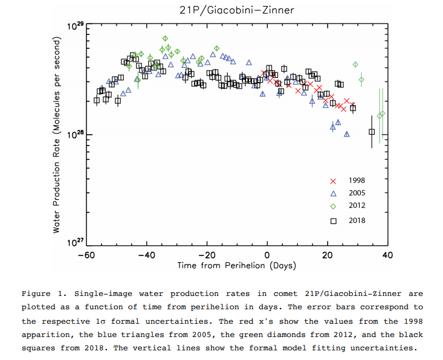
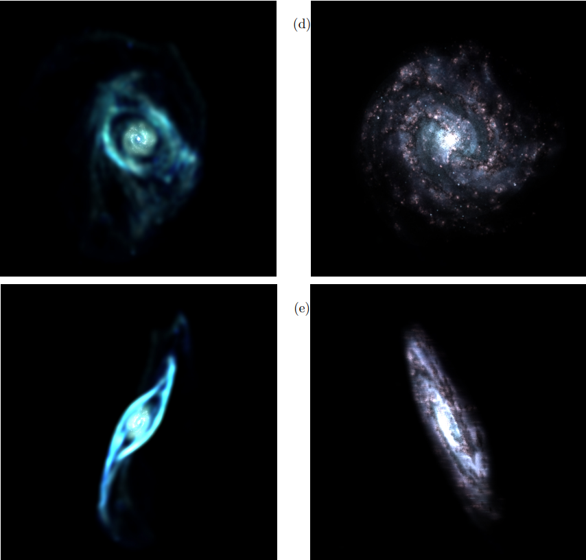
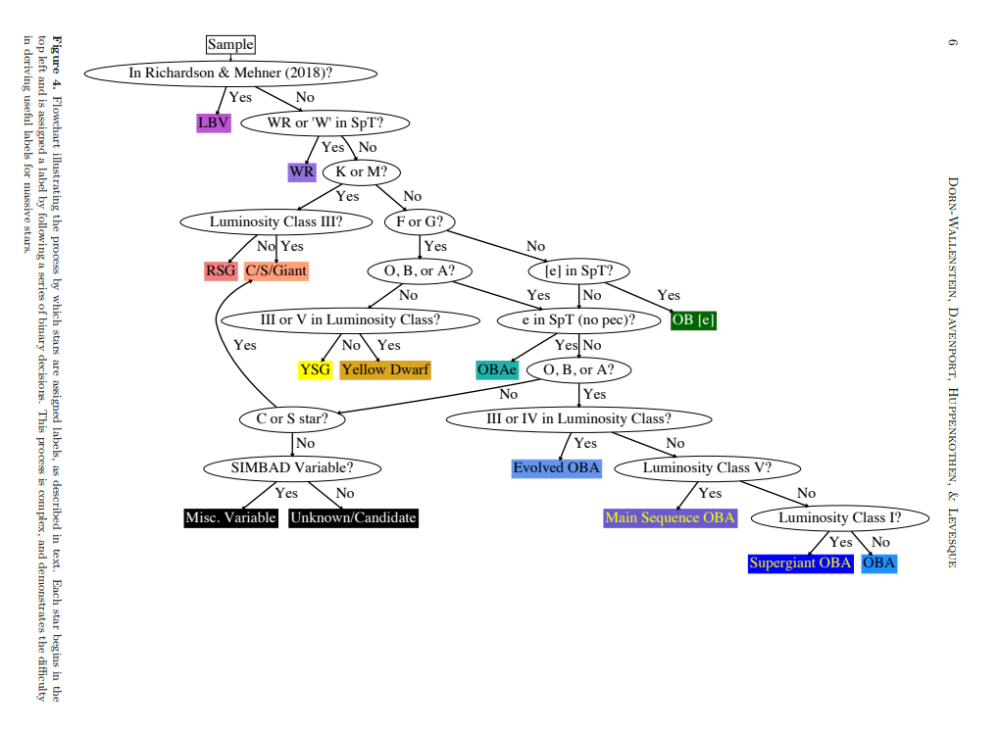
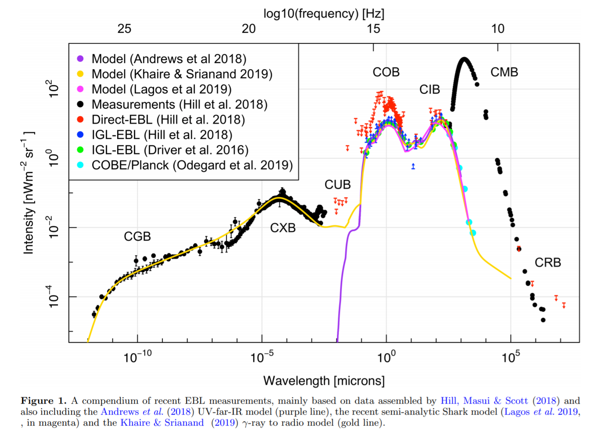

## 2021-02-01

1. [A Fast Template Periodogram for Detecting Non-sinusoidal Fixed-shape Signals in Irregularly Sampled Time Series](https://arxiv.org/abs/2101.12348)

   搜索时间序列中的周期信号，最有效的算法是快速傅里叶变换，复杂度是$O(N\log N)$，但是对于非正弦信号的形状匹配不佳。用模板拟合运算复杂度$O(N_fN_{obs})$，$N_f$是频率通道数量，$N_{obs}$是数据量。他们基于Lomb-Scargle周期图，提出了一个非线性扩展，运算复杂度$N(N_f\log N_{obs})$，使模板拟合在每个频率上的非线性优化被重构为多项式寻找零点的问题，其中多项式的系数可以通过非等距快速傅里叶变换（non-equispaced fast Fourier transform）来计算。他们的方法在github上开源，url - https://github.com/PrincetonUniversity/FastTemplatePeriodogram。

## 2021-02-02

1. [Effect of Redshift Distributions of Fast Radio Bursts on Cosmological Constraints](https://arxiv.org/abs/2102.00579)

   过于研究中使用的FRB的红移，通常是从给定的红移分布中随机给一个红移。不同的红移分布会导致模拟的FRB对于宇宙学有不同的约束能力。前者通常用Burr分布描述。
   $$
   f_{Burr}(x, b, k)=\frac{bkx^{-b-1}}{(1+x^{-b})^{k+1}}
   $$

## 2021-02-03

1. [Comet 21P/Giacobini-Zinner: Water Production Activity over 20 Years with SOHO/SWAN](https://arxiv.org/abs/2102.01608)

   21P/Giacobini-Zinner是被International Cometary Explorer (ICE)访问的第一颗彗星，在1985年。这颗彗星的轨道周期是6.621年，在1998、2005、2012和2018年出现，被SWAN和SOHO观测到。这篇文章比较了1998和2005年从hydrogen image 计算出来的water production rates，发现这颗彗星的产水率在不同的回归周期中没有明显的减少。

   

## 2021-02-04

1. [Mapping stellar surfaces II: An interpretable Gaussian process model for light curves](https://arxiv.org/abs/2102.01697)

   高斯过程在天文时间序列的数据集中普遍使用。但是GP模型对Starspot相关的参数（如星斑的大小、对比度-contrast、纬度分度等）不敏感，因此当光变曲线是由于星斑导致的时候，GP模型可能就不那么适用了。这篇文章中推导出了一个GP模型的平均数和协方差的closed-form expression，在给定星斑大小、对比度和维度为分布。描述一个旋转、演化的恒星光变曲线。他们的模型封装在https://github.com/rodluger/starry_process。
   
   高斯过程形式上是多维的高斯分布，在上边的情况下，就是跨越连续域（时域）的函数上的额高斯分布。假设在长度为K的时间序列$\bf t$上定义的随机变量的值f是一个高斯过程，也就是说：
   $$
   \mathbb{f}\sim\mathcal{N}({\bf \mu}, {\bf \Sigma})
   $$
   其中$\mu_i=\mu(t)$，$\Sigma_{i,j}=k(t_i, t_j)$，$k$是核函数$k(t, t')$。在假设这个过程是平稳的情况下:
   $$
   \Sigma_{i,j}=k(t_i,t_j)=k(|t_i-t_j)\equiv k(\Delta t)
   $$
   他们给出的GP模型是：
   $$
   \mathbb{\tilde f}(P,{\bf u}, {\bf \theta_\cdot})\sim\mathcal{N}(1, {\bf \tilde\Sigma(P,u,\theta_\cdot)})\qquad \theta_\cdot=(n\ c\ \mu_\phi\ \sigma_\phi\ r)^T
   $$
   其中$\mathbb{\tilde f}$是mean-normalized flux，P是恒星旋转周期，u是临边昏暗系数的向量 (the vector of limb darkening coefficients)，$\theta_\cdot$是描述spot distribution的参数，n是spot的数量，c是对比度（背景和星斑的亮度之比），$\mu_\phi$和$\sigma_\phi$分别是纬度分布的峰值（mode）和标准差，r是spot的半径。文章中的图在https://github.com/rodluger/mapping_stellar_surfaces。
   
2. [3D Modelling and Visualisation of Observed Galaxies](https://arxiv.org/abs/2102.02141)

   他们提出一种基于观测数据重建和可视化星系三维表征的方法，并且利用科学可视化软件`Splotch`生成高质量的可视化表征，如下。

   

   文章里开头提到了一个网址，这个网址是[*Astrophotography by Bob Franke*](http://bf-astro.com/index.htm)，里面有他做Hubble为彩色图像处理的软件。

## 2021-02-05

1. [Accurate Identification of Galaxy Mergers with Stellar Kinematics](https://arxiv.org/abs/2102.02208)

   为了确定合并星系对星系演化的重要性，有必要识别合并星系的种类或者阶段。使用 GADGET-3/SUNRISE模拟合并星系，加上linear discriminant analysis (LDA)，可以创建一个精确的合并星系的分类器，来区分合并星系与非合并星系。

## 2021-02-08

1. [Photometric Classifications of Evolved Massive Stars: Preparing for the Era of Webb and Roman with Machine Learning](https://arxiv.org/abs/2102.02829)

   使用支持向量机对恒星做粗略分类，包括热星、冷星和发射线星，但是训练样本恒星的标签来源不同导致分类器的分类效果并不好。有意思的是文中的一个图，如何给恒星加label。

   

2. [Deep reinforcement learning for smart calibration of radio telescopes](https://arxiv.org/abs/2102.03200)

   在望远镜的一生中，要进行成千上万次的观测，但是每次观测都会有独特的系统设置，观测pipline的微调是一项繁琐的工作。为了自动完成这样超参数选择的工作，引入强化学习，使用双延迟深度确定性策略梯度（twin delayed deep deterministic policy gradient，[TD3](Addressing Function Approximation Error in Actor-Critic Methods)）来训练一个自主代理来执行这种微调。

## 2021-02-09

1. [Quasi-Periodic Particle Acceleration in a Solar Flare](https://arxiv.org/abs/2102.04267)

   太阳耀斑电磁辐射的强度随时间变化，被称为准周期性脉动（QPPs）。使用小波分析在X射线、低频射电和EUV波长的时间序列中识别QPPs，发现，171$\AA$、1600$\AA$、软X射线（SXR）和硬X射线（HXR）光曲线内的脉动分别产生了相似的周期，分别为～122秒、～131秒、～123秒和～137秒，表明有一个共同的起源。

2. [Periodic repeating fast radio bursts: interaction between a magnetized neutron star and its planet in an eccentric orbit](https://arxiv.org/abs/2102.04264)

   提出一个新模型，周期性重复的FRBs是中子星和它的行星作用的结果。行星位于偏心率极高的椭圆轨道上，经过中子星时受到潮汐力影响，产生碎片，落向中子星，诞生了观测到的FRBs。

   

3. [Inferring Time-Dependent Distribution Functions from Kinematic Snapshots](https://arxiv.org/abs/2102.03519)

   从孤立的运动学快照中构造无碰撞系统在依赖时间的相位空间中的分布函数。假设最后的分布函数是由spectrum of the system's Koopman operator建立的，这可以将原来的问题简化为将运动快照映射到离散的频谱上，而不是时间相关的函数上。使用CNN，并把模型应用在一个自引力的等温平面上，看到了类似Gaia DR2中看到的相空间的螺旋结构。

   

4. [The Kinematic Richness of Star Clusters - II. Stability of Spherical Anisotropic Models with Rotation](https://arxiv.org/abs/2102.04383)

   研究恒星系统中的无碰撞稳定性，两种最重要的方法是𝑁体技术和矩阵方法。后者只处理线性稳定性问题，而且往往不那么灵活，但可以直接了解动力学，因为它们可以自然地用作用角变量（或其他不变量）来表达。使用的N体代码是[`gyrfalcON`](https://arxiv.org/abs/astro-ph/0202512)和[`NBODY6`](https://arxiv.org/abs/1205.1222)。矩阵的方法最早可以追溯到[Kalnajs 1977](https://ui.adsabs.harvard.edu/abs/1977ApJ...212..637K/abstract)。

## 2021-02-10

1. [PyAutoFit: A Classy Probabilistic Programming Language for Model Composition and Fitting](https://arxiv.org/abs/2102.04472)

   最近数据科学的趋势是做贝叶斯统计，概率编程语言（PPL）得到发展，PPL提供了一个框架，允许用户轻松地指定一个概率模型并自动执行推理。[PyAutoFit](https://github.com/Jammy2211/autofit_workspace)就是PPL之一。（这样的文章好像一般都发在JOSS上）文章最后还看到tensorflow的[probability](https://github.com/tensorflow/probability)。

2. [The curse of clouds](https://arxiv.org/abs/2102.04772)

   标题很有意思。

   对于高度irradiated的热木星，气溶胶（aerosol）通常会存在，另外，整个热木星的温度变化很大，这可能产生部分或零星的云层。随着詹姆斯-韦伯空间望远镜的发射，观测能力将进一步提高，因此，社区正在努力准备能够恢复热系外行星上可变和零星云层信息的建模和分析工具。

## 2021-02-11

1. [A Comprehensive Power Spectral Density Analysis of Astronomical Time Series. II. The Swift/BAT Long Gamma-Ray Bursts](https://arxiv.org/abs/2102.05330)

   使用Lomb-Scargle分析周期图，使用小波找QPO。

   

## 2021-02-12

1. [Did Mars possess a dense atmosphere during the first ~400 million years?](https://arxiv.org/abs/2102.05976)

   对热逃逸过程的研究表明，挥发物的传递和火山喷气不能抵消强烈的热逃逸。因此，在短短几百万年(Myr)内，就可能失去一个由CO2和H2O，或CO和H2还原条件下的大气。

## 2021-02-15

1. [Gamma-ray image reconstruction of the Andromeda galaxy](https://arxiv.org/abs/2102.06447)

   两位法国天文学家分析了Fermi卫星在过去12年里观测M31 - 仙女座大星系的数据，得到了M31在高能伽马射线波段的图像。10年前，银河系中著名的Fermi“气泡”结构被Fermi卫星的数据揭示出来，之前曾有天文学家有7年的观测大胆提出M31中也有类似Fermi“气泡”的结构，这篇文章用更新的数据表示，这样的证据非常弱。

   

## 2021-02-16

1. [Breakup of a Long-Period Comet as the Origin of the Dinosaur Extinction](https://arxiv.org/abs/2102.06785)

   Chicxulub被认为是K/T大灭绝事件的起因，但是主带小行星和长周期彗星的低撞击率无法解释这一事件。这篇文章认为，一部分长周期彗星在靠近太阳时会被潮汐力破坏，每颗彗星都会产生一批较小的碎片，这将Chixulub撞击事件的概率提升了一个数量级。这个说法也可以解释地球上已确认的撞击坑的构成，以及过去100万年内最大的撞击坑。

2. [An Algorithm for Reconstructing the Orphan Stream Progenitor with MilkyWay@home Volunteer Computing](https://arxiv.org/abs/2102.07257)

   从矮星系落入银河时被撕裂的恒星潮汐流中，可以估计原矮星系的特性。使用一台PetaFLOPS规模的分布式超级计算机【MilkyWay@home】，来优化矮星系参数。算法中拟合了暗物质质量、暗物质半径、恒星质量、恒星的径向轮廓和轨道时间。模拟假设银河系引力势、矮星系轨道和矮星系密度模型的形式都是准确已知的。

## 2021-02-17

1. [Substructure in the Perseus Molecular Cloud using Gaia DR2](https://arxiv.org/abs/2102.08263)

   使用来自Gaia DR2的测光和运动数据来探索与英仙座分子云相关的恒星形成区域的结构。先筛选出Gaia DR2较大范围的恒星，用等龄线选出年龄小于10 Myr的恒星，模型是[Marigo et al.(2013)](https://arxiv.org/abs/1305.4485)中的。下图是恒星数密度分布，选择密度高的地方的中心作为中心点，用astroML.stats中的`fit_bivariate_normal`来对Ra和Dec做了一个双高斯拟合，取其中$3\sigma$的范围作为成员星候选，再对二维的proper motion做双高四拟合，排除$5\sigma$以外的恒星。单高斯拟合，选择$3\sigma$以内的parallax的源。组成新的星团。

   

2. [`Oumuamua is not Artificial](https://arxiv.org/abs/2102.07871)

   文章中列举了反对“Oumuamua是人造的”说法的证据，附录中讨论了“Breakthough” proposal中用激光将航天器加速到半相对论速度的缺陷。

## 2021-02-18

1. [Constraints on power law cosmology from cosmic chronometer, standard ruler, and standard candle data](https://arxiv.org/abs/2102.08457)

   文章中比较了一个简单的宇宙膨胀幂律模型与标准的ΛCDM模型的拟合质量，发现ΛCDM模型的拟合程度要好于幂律模型。
   $$
   H(z)=H_0(1+z)^{1/\beta}\qquad H(z)=H_0\sqrt{\Omega_{m0}(1+z)^3+1-\Omega_{m0}}
   $$

## 2021-02-19

1. [Cygnus X-1 contains a 21-solar mass black hole -- implications for massive star winds](https://arxiv.org/abs/2102.09091)

   大质量恒星演化过程中，星风会带走很大一部分质量，限制其生成黑洞的质量。射电观测X射线双星系统 Cygnus X-1，确定了它的距离$2.22^{+0.18}_{-0.17}\ kpc$，结合光学的数据，黑洞的质量被限制在$21.2\pm2.2\ M_\odot$。

   这个工作中有苟利军他们组的人参与，同时还发表了[Re-estimating the Spin Parameter of the Black Hole in Cygnus X-1](https://arxiv.org/abs/2102.09093)。前面的工作中更新了这个黑洞的质量、轨道倾角核距离这三个参数。他们使用 continuum-fitting，来拟合这几个参数来确定自旋参数，限制为$a_*>0.9985$。

2. [Joshua's Total Solar Eclipse at Gibeon](https://arxiv.org/abs/2102.09402)

   Joshua 10:12 中记载的约书亚命令太阳在一天中停止，大家认为此事在历史上发生过。这篇文章重新分析了这段历史，确认公元前1131年9月30日的日全食时最可能的候选日期。重新计算了这次日食的Besselian Elements，地球自转的减速参数$\Delta T$的误差提高了两倍。

## 2021-02-22

1. [UV Extinction as a More Fundamental Measure of Dust than E(B-V) or A(V)](https://arxiv.org/abs/2102.09575)

   在银河系、麦哲伦云以及一般情况下，红化恒星的气尘比通常可以用 - 氢柱密度N(H)与红化 E(B-V)或者V波段消光A(V)之间的线性关系来表示。如果消光曲线真正具有普遍性，那么对于任何波长的消光，N(H)和E(B-V)的线性关系会保持不变。但是在银河系中，消光曲线在各不相同。他们使用41MW sightlines的全消光曲线，发现在$2900\pm160\AA$处线性关系最好。结论是 - 近紫外消光是测量MW尘埃的尘柱密度的优越方法。

## 2021-02-23

1. [3D Morphology of Open Clusters in the Solar Neighborhood with Gaia EDR3: its Relation to Cluster Dynamics](https://arxiv.org/abs/2102.10508)

   做星团形态学的。使用StarGO（无监督机器学习）识别OCs（开放星团），分析其结构和形态。主要是想看一下他们是如何描述他们的方法的，如下。

   The unsupervised machine learning method, StarGO (Yuan et al. 2018) 1 has proven to be successful in membership determination of OCs, e.g., for the Coma Berenices cluster (Tang et al. 2019), Blanco 1 (Zhang et al. 2020), NGC 2232 and LP 2439 (Pang et al. 2020). The algorithm is based on the Self-Organizing-Map (SOM) method that maps high-dimensional data onto a two-dimension neural network, while preserving the topological structures of the data.

2. [Removing Atmospheric Fringes from Zwicky Transient Facility i-Band Images using Principal Component Analysis](https://arxiv.org/abs/2102.10738)

   Zwicky Transient Facility是一个光学时域一起，安装在帕尔马天文台的48-inch的Samurl Oschin Telescope上。由16块CCD组成，每次曝光视场是47平方度。但是在i波段滤光片成像中存在明显的大气条纹(atmospheric fringes)，他们使用PCA来消除这种条纹。先从图像中找到条纹占据的特征向量，作为模型，再从每个图像中应用这个变换，得到条纹，图像减条纹，得到正常的图像。

   

3. [CRAFTS for Fast Radio Bursts Extending the dispersion-fluence relation with new FRBs detected by FAST](https://arxiv.org/abs/2102.10546)

   牛晨辉的论文，关于CRAFTS搜FRB的，我作为合作者出现在论文中。

## 2021-02-24

1. [Consistent equivalence principle tests with fast radio bursts](https://arxiv.org/abs/2102.11554)

   FRB的辐射光子在穿过大尺度结构产生的势能时会有 gravitational Shapiro time delay ，如果等效原理（ equivalence principle, EP）成立，那么对于所有频率的光子，Shapiro delay是相同的。如果EP被破坏，那么会产生额外的DM。使用DM波动的角度统计来对后牛顿参数γ参数化的EP进行约束。以前的研究存在一个问题，即在宇宙学环境中，负责延迟的引力势会发生变化，而我们的方法则避免了这个问题。

## 2021-02-25

1. [Measuring energy production in the Universe over all wavelengths and all time](https://arxiv.org/abs/2102.12089)

   Extragalactic Background Light (EBL)。从星系外领域入射到地球表面的所有光子，编码了我们宇宙中能源生产的整个历史。

   通过改进尘埃模型和AGN的处理，从伽马射线到射电波长的EBL模型的也取得了进展。随着新设施的上线，以及从伽马射线到射电波长的更统一的研究正在进行，很快就可以测量出精确到1%以内的EBL。在这个水平上，正确的电离模型、对缺失种群或光的认识、来自星团内和光环气体的辐射，以及来自衰变的暗物质的任何信号都变得非常重要。

   

## 2021-02-26

1. [Nested sampling with any prior you like](https://arxiv.org/abs/2102.12478)

   Nested sampling是在进行贝叶斯分析的一个工具，可以对后验分布进行抽样，也可以为模型比较计算边际似然。One technical obstacle to using nested sampling in practice is the requirement that prior distributions be provided in the form of bijective transformations from the unit hyper-cube to the target prior density. 先验需要写成从单位超立方体到目标先验密度的bijective transformations形式，在层次化贝叶斯模型中不容易实现。他们提供了一种方法，让Nested Sampling在任意先验下的实际使用成为可能。

2. [Multi-class Gaussian Process Classification with Noisy Inputs](https://arxiv.org/abs/2001.10523)

   监督学习在输入数据有噪声时可能表现不佳。这篇文章中，使用几个多类高斯过程分类器作为底层分类器，解决多分类问题，可以考虑输入噪声。
