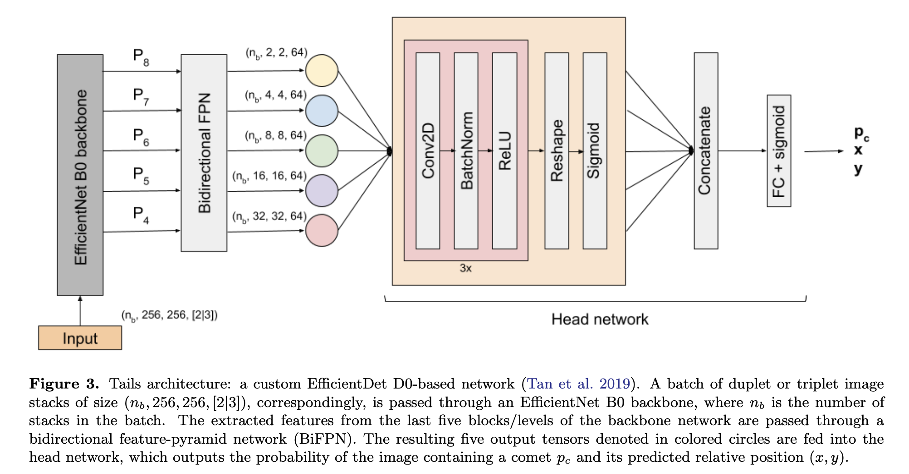

## 2021-03-01

1. [One star, two star, red star, blue star: an updated planetary nebula central star distance catalogue from Gaia EDR3](https://arxiv.org/abs/2102.13654)

   Planetary nebulae (PNe)。行星状星云是恒星演化的短暂阶段，在银河系中的大样本统计中比较少见。将Hong Kong/AAO/Strasbourg Hα (HASH) PN catalogue ([Parker et al. 2016](https://arxiv.org/abs/1603.07042))与Gaia EDR3交叉匹配，得到更完整的PNe测光目录。交叉匹配方法使用[Chornay & Walton 2020](https://arxiv.org/abs/2001.08266)。另外由于PNe中心星的颜色比Gaia DR2中的恒星颜色普遍偏蓝，因此加上了颜色来做匹配。

2. [Markov chain Monte Carlo analyses of the flux ratios of B, Be and Li with the DRAGON2 code](https://arxiv.org/abs/2102.13238)

   了解宇宙射线的传输对银河系传播模型提出了挑战。对二次宇宙射线 (B, Be, Li and sub-iron species)进行良好的表征，对于约束这些模型和利用现代CR实验的精度至关重要。这篇文章中用MCMC拟合B、Be和Li之间的实验通量比及其与初级宇宙射线核C和O的通量比，能够更好地推断出传播参数。这个方法在 - 使用了DRAGON2（用于宇宙射线传播的数值代码）来重现AMS-02实验中高达Z=14的宇宙射线核数据中应用了。其中MCMC的后验概率分布是：
   $$
   \mathcal{P}(\vec\theta|\vec D)\propto\mathcal{L}(\vec D|\vec\theta)\Pi(\vec\theta)
   $$

   $$
   \Pi(\vec\theta) = \left\{\begin{aligned}
   &\prod_i\frac{1}{\theta_{i,max}-\theta_{i,min}}&\theta_{i,min}<\theta_i<\theta_{i,nax}\\
   &0&elsewhere
   \end{aligned}\right.
   $$

   $$
   \mathcal{L}(\vec D|\vec\theta)=\prod_{i,j}\frac{1}{\sqrt{2\pi\sigma_{i,j}^2}}\exp\left[-\frac{(\Phi_{i,j}(\vec\theta)-\Phi_{i,j,data})^2}{2\sigma_{i,j}^2}\right]
   $$

   其中$\vec\theta=\{\theta_i\}_{i=1\cdots m}$是参数空间，$\vec D$是用到的数据集（也就是CR flux ratios measuered by AMS-02），$\Phi_{i,j}$是simulation中计算的flux ratio，$\Phi_{i,j,data}$是AMS-02测量的flux ratio，$\sigma_{i,j}$是$i-th$的flux ratio和$j-th$的能量bin的协方差。
   
3. [Tails: Chasing Comets with the Zwicky Transient Facility and Deep Learning](https://arxiv.org/abs/2102.13352)

   Tails是开源的深度学习框架，用于识别和定位Zwicky图像数据中的彗星。Tails采用了基于EfficientDet的定制架构，能够实时地在单幅图像中寻找彗星，召回率为99%，假阳性率为0.01%，预测位置的均方根误差为1-2像素。使用这一技术发现了一颗彗星 - C/2020 T2。

   下图是使用的训练数据集，左图是science image，中间的图是没有彗星的照片，右图是用[ZOGY](https://arxiv.org/abs/1601.02655)算法减掉参考图像得到的彗星残余图。

   

   这个是网络结构，代码在[这里](https://github.com/dmitryduev/tails)。

   

## 2021-03-02

1. [Emission Mechanisms of Fast Radio Bursts](https://arxiv.org/abs/2103.00470)

   Fast radio bursts (FRBs) are recently discovered mysterious single pulses of radio emission, mostly coming from cosmological distances (∼1 Gpc).

   讨论了曲率发射、同步加速脉泽发射以及在磁重联过程中可变电流的无线电波发射。特别注意到磁星耀斑是最有希望的FRBs来源。概述了可能对发射的辐射功率施加限制的非线性效应。

2. [Detecting and analysing geomorphological structures in images of comet 67P/Churyumov-Gerasimenko using Fourier transform](https://arxiv.org/abs/2103.00970)

   使用傅立叶变换的图像频域特征，提出了一种从图像中检测和分析准周期线状结构的方法。所开发的方法适用于各种准周期结构的检测和分析，如地质分层、褶皱和断层，以及一般的纹理分析。

   

## 2021-03-03

1. [A nearby repeating fast radio burst in the direction of M81](https://arxiv.org/abs/2103.01295)

   CHIME发现了一个低DM的重复FRB 20200120E，DM=87.82 pc cm$^{-3}$，是到这天为止DM最低的FRB，尽管如此，还是高于银河系星际介质在这个方向上的最大期望值（约为50  pc cm$^{-3}$）。定位在M81附近，这是一个距离我们3.6Mpc的螺旋星系，FRB和M81偶然重合的概率$<10^{-2}$。

2. [The first evidence for three-dimensional spin-velocity alignment in pulsars](https://arxiv.org/abs/2103.01839)

   姚菊枚师姐的文章，昨晚搞到挺晚才帮她上传到arXiv上。

   观测表明，年轻脉冲星在二维空间的速度和自转轴对齐。依据FAST对PSR J0538+2817及其相关超新星遗迹S147的观测，确定了脉冲星在超新星遗迹中的位置，从而得到了它的径向速度。发现了速度和自转轴在三维空间中的对齐趋势。

3. [The Future Of The Arecibo Observatory: The Next Generation Arecibo Telescope](https://arxiv.org/abs/2103.01367)

   Arecibo倒了，认为有必要在AO台址建造一个增强型的下一代雷达-射电望远镜。设想的要求是：

   - 5 MW of continuous wave transmitter power at 2 - 6 GHz
   - 10 MW of peak transmitter power at 430 MHz (also at 220MHz under consideration)
   - zenith angle coverage 0 to 48 deg
   - frequency coverage 0.2 to 30 GHz and increased FoV

   这样的要求需要新的仪器设计 - 一个可倾斜的板状结构上组成一个紧凑的固定天线阵列，收集面积相当于一个300米的天线。这一概念被称为下一代阿雷西博望远镜(the Next Generation Arecibo Telescope，NGAT)。

## 2021-03-04

1. [Origin of the Moon](https://arxiv.org/abs/2103.02045)

   Book chapter in "New Views on the Moon II”.

   月球的半径约为地球的1/4，比除冥王星的卡戎以外的所有已知卫星都要大。月球的核心很小，可能只占其质量的1%，而地球的核心则占其质量的近30%。地月系统具有很高的总角动量，意味着月球形成时，地球正在快速旋转。此外，早期的月球很热，至少部分熔化，有深层岩浆海洋。确定一个能够令人满意地解释所有这些特征的月球起源模型一直是几十年来研究的重点。

2. [Paper-and-pencil cosmological calculator](https://arxiv.org/abs/1303.5961)

   paper-and-pencil calculator是宇宙学的诺莫图（Nomogram，列线图）是一种利用图像来进行计算（查图）的工具。是一个二维的图像，用来进行非精确的计算。它可以用普朗克任务的参数找到标准宇宙学模型的红移、距离、宇宙年龄、物理和角度大小、光度和视星等之间的关系。

   

## 2021-03-05

1. [The Atacama Cosmology Telescope: Summary of DR4 and DR5 Data Products and Data Access](https://arxiv.org/abs/2103.03154)

   阿塔卡玛宇宙望远镜（ACT）是在智利阿塔卡玛沙漠的六米射电望远镜，观测波段在90、150、220、28、41 GHz，旨在研究CMB。最近发布DR4和DR5，包括弧分分辨率的三个波段的几乎半Tina的温度和偏振图，lensing maps and component-separated maps，derived power spectra and cosmological likelihoods，4,000多个星系团的目录。提供了方便访问和分析这些数据的Jupyter Notebook，在[这里](https://github.com/ACTCollaboration/DR4_DR5_Notebooks)。

## 2021-03-08

1. [Broadband Imaging of Meteor Radio Afterglows](https://arxiv.org/abs/2103.03347)

   使用长波阵列塞维利亚塔站（LWA-SV）新的宽带成像仪对86个流星射电余辉（MRAs）进行观测，使用log-normal和powerlaw拟合光谱。前者拟合时，光谱在30-40MHz之间的频率表现出转折，似乎是一个更好的函数拟合光谱。log-normal turnover frequency和MRAs的高度有微弱的相关性。

   

## 2021-03-09

1. [Repeating Fast Radio Bursts from Collapse of Strange Star Crust](https://arxiv.org/abs/2103.04165)

   文章认为FRB重复暴食由Strange Star地壳的间歇性碎裂塌缩引起的，由其低质量伴星的吸积物质重新填充。周期性是由盘面不稳定性(如热-粘性不稳定性)对吸积速度的调节所造成的。

## 2021-03-10

1. [PArthENoPE Revolutions](https://arxiv.org/abs/2103.05027)

   PArthENoPE是用来计算大爆炸核合成过程中产生的轻元素丰度的，使用Fortran77写的程序。继2008年、2018年之后，这是[第三版](http://parthenope.na.infn.it/)。新版本主要是考虑了氘破坏反应H2(p,gamma)He3, H2(d, n)He3 and H2(d, p)H3的核反应速率。并且有了新的图形界面。

## 2021-03-11

1. [Sparse Box-fitting Least Squares](https://arxiv.org/abs/2103.06193)

   使用一种新方法 - Sparse Box-fitting Least Squares （SBLS）来从光变曲线中探测行星掩食。这种方法适用于稀疏数据。

   对于给定的时间序列值$x_j$和误差$\sigma_j$，转换成归一化权重的零加权平均数据集$(\tilde x_j,\tilde w_j)$：
   $$
   w_j=\sigma_j^{-2}\qquad W=\sum_{j=1}^Nw_j\qquad \tilde w_j=\frac{w_j}{W}\qquad \mu=\sum_{j=1}^N\tilde w_j x_j\qquad \tilde x_j=x_j-\mu
   $$
   对于每一个可能的周期P，计算相位（Phase-Folding）：
   $$
   \phi_i=\frac{t_i\ mod\ P}{P}
   $$
   对于相位折叠的数据集$\{i_1,i_1+1,\cdots,i_2\}$，计算Signal Residue（SR）：
   $$
   s=\sum_{i=i_1}^{i_2}\tilde w_i\tilde x_i\qquad r=\sum_{i=i_1}^{i_2}\tilde w_i\qquad SR=\left(\frac{s^2}{r(1-r)}\right)^{1/2}
   $$
   s和r可以用来估计恒星星等（M）和transit depth（d）：
   $$
   \hat M=\mu-\frac{s}{1-r}\qquad \hat d=\frac{s}{r(1-r)}
   $$
   这一检测效率不依赖于相位网格，比BLS略好，也要快于BLS。

2. [Multi-frequency observations of SGR J1935+2154](https://arxiv.org/abs/2103.06052)

   磁星是FRB起源的候选体之一。2020年4月28日SGR J1935+2154探测到极高亮度的射电暴发为这一假说增添了可信度。在4月28日事件发生后的几天和几个月内，使用Arecibo、Effelsberg、LOFAR、MeerKAT、MK2和Northern Cross射电望远镜以及MeerLICHT光学望远镜进行的同步和非同步观测活动中，没有探测到任何显著的单次射电脉冲。使用MeerLICHT的多色图像结合DM、NH、reddening之间的关系，SGR1935的距离倍限制在1.5-6.5 kpc。

## 2021-03-12

1. [Extragalactic HI 21-cm absorption line observations with the Five-hundred-meter Aperture Spherical radio Telescope](https://arxiv.org/abs/2103.06573)

   FAST对银河系外HI吸收线的实验性研究。观测到了5个有HI吸收特征的continuum sources。FAST获得的HI吸收谱图比现有数据有更高的光谱分辨率和更高的信噪比。根据在试验性观测中达到的灵敏度水平，估计FAST可以探测到1,500多个星系外HI吸收系统。

## 2021-03-15

1. [From the SpaceX Starlink megaconstellation to the search for Type-I civilizations](https://arxiv.org/abs/2103.07227)

   如果I型文明建造了行星巨型结构（如卫星网络-starlink），使用The Very Large Telescope Interferometer (VLTI)获取可以探测到其发射模式。这样的巨型结构在红外（IR）波段是可见的，用VLTI探测，可以看到260光年（约为80pc），在这个距离下，有1k个Solar-type恒星。考虑FAST的系统温度$T_{sys}=20K$和有效光圈$A=7108cm^2$，探测的最小流量密度（flux density）是$kT/A=6\times10^{-24}ergs\ s^{-1}\ cm^{-2}\ Hz^{-1}$。如果文明选择1420MHz发射无线电信号，FAST最远可以看到160pc的位置。

## 2021-03-16

1. [Multiwavelength observations of Fast Radio Bursts](https://arxiv.org/abs/2103.07786)

   经过十多年的努力，快速射电暴（FRB）的起源和现象仍然是未知数（见arXiv:astro-ph.HE/1804.09092、1904.07947、1906.05878、2011.03500、2101.04907的回顾）。这篇文章总结了对几个FRB的多波段的观测，结论是需要更多对ms-second时标敏感的多波段观测活动。光学/红外的快速光度测量可能是唯一可行的策略。以及一些小望远镜也是有效的策略。

2. [Constraints on the abundance of primordial black holes with different mass distributions from lensing of fast radio bursts](https://arxiv.org/abs/2103.08510)

   原初黑洞（primordial black holes，PBHs）可能是构成暗物质的一部分，但是在$1-100M_\odot$（恒星质量范围）内约束很差。LIGO发现的黑洞并合双星给这一猜想提供了新的约束。FRB的透镜效应被认为是约束恒星质量窗口中PBHs存在的最干净的探针之一。目前公开的FRB的观测结果的约束弱于引力波探测结果。当有$10^5$个持续时间$\Delta \le1ms$的FRB，对EMDs的参数空间的约束将与引力波事件相当。

3. [Reconstruction of Baryon Fraction in Intergalactic Medium through Dispersion Measurements of Fast Radio Bursts](https://arxiv.org/abs/2103.08479)

   快速射电暴（FRB）通过色散（DMs）可以探测星系间介质（IGM）中自由电子沿传播路径的总柱密度。结合普朗克2018年的测量结果，从$10^4$个FRBs中给出$f_{IGM}(z)$的烟花约束：
   $$
   f_{IGM}(z)=f_{IGM,0}+\alpha\frac{z}{1+z}\qquad f_{IGM,0}=0.752\pm0.076\quad \alpha=0.283\pm0.353
   $$

## 2021-03-17

1. [To H0 or not to H0?](https://arxiv.org/abs/2103.08723)

   Changes to late time physics能否解决Hubble tension。许多文献赞成的原因是对是因为对于距离阶梯应用场景的误解，特别是对距离阶梯H0先验的不正确应用。A dynamics-free inverse distance ladder表明changes to late time physics瘦到强烈的观测约束，无法解决SH0ES数据和Planck推断的LCDM宇宙学之间的差异。

2. [Concentrated Lunar Resources: Imminent Implications for Governance and Justice](https://arxiv.org/abs/2103.09045)

   今后十年内对月球表面的开发利用可能只集中在少数几个有价值的地区，这样的区域有限且稀少，具有罕见的地形或集中了具有特殊价值的资源。对于天文有用的地区包括Peaks of Eternal Light, the coldest of the cold traps and smooth areas on the far side. 如果不采取措施，这些地区会很快变得拥挤。这篇文章是讨论会议 "月球天文学：未来几十年 "的一部分。

3. [Formation of Massive Star Clusters by Fast HI Gas Collision](https://arxiv.org/abs/2011.11650)

   年轻的大质量星团（Young massive clusters, YMCs）是年轻恒星的密集集合体，由于其紫外线辐射、恒星风和超新星的存在，对星系的演化至关重要。YMCs典型的质量和半径是$10^4M_\odot$和$1pc$。YMCs的前身云形成可能很困难，因为在恒星反馈把云吹走之前，需要形成一个非常紧凑的大规模的云。最近的研究表明，YMCs的形成可能是快速HI气体碰撞的结果，速度约为$100km/s$。这篇文章使用三维磁流体动力学模拟，引入了自引力、辐射冷却/加热和化学效应，检验HI气体碰撞是否会引发YMC形成。结果表明，碰撞带来的冲击压缩区形成了$M>10^4M_\odot$、$L\sim4pc$的气体团块，这样的气体团块可以演化成YMCs。YMCs的前身云是分子云的引力塌缩形成的，即使在麦哲伦云等低金属环境中也能形成YMC。

## 2021-03-18

1. [Metallicity of Galactic RR Lyrae from Optical and Infrared Light Curves: I. Period-Fourier-Metallicity Relations for Fundamental Mode RR Lyrae](https://arxiv.org/abs/2103.09372)

   提出了RR变星新校准的$Period-\phi_{31}-[Fe/H]$的关系。
   $$
   [Fe/H]=a+b\times(P-P_0)+c\times(\phi_{31}-\phi_{31,0})
   $$
   其中$P_0$和$\phi_{31,0}$是在拟合过程中增加鲁棒性并减少参数不确定性的额外元素。

   在一条光变曲线中，相位表示为：
   $$
   m(\Phi)=A_0+\sum_{i=1}^nA_isin\left[2\pi i(\Phi+\Phi_0)+\phi_i\right]
   $$
   $\Phi_0$是光度最强时的相位，$A_i$和$\phi_i$分别是第$i$阶傅立叶振幅和相位系数。傅立叶系数的某些组合是与变星的一些物理参数相关的，这些洗漱定义为傅立叶相位的线性组合：
   $$
   \phi_{ij}=j\phi_i-i\phi_j\quad\Rightarrow\quad \phi_{31}=\phi_3-3\phi_1
   $$

## 2021-03-19

1. [The old moving groups in the field of Taurus](https://arxiv.org/abs/2103.10154)

   使用DBSCAN搜索到Taurus区域的22个恒星集群，包括8个年龄在2-4Myr、距离约130-170pc的年轻星群（1-8群），14个年龄在8-49Myr、距离约110-210pc的老星群（9-22群）。恒星选取：
   $$
   55^\circ\le RA\le90^\circ\qquad 10^\circ\le DEC\le35^\circ\qquad \omega/\sigma_\omega\ge5\qquad 3.33\le \omega\le10
   $$
   使用[Bressan et al. (2012)](https://arxiv.org/abs/1208.4498)中的100Myr的等龄线从Gaia DR2的color-magnitude图中选出年轻星。并对之后搜索出的种群用等龄线拟合。

   重要的是DBSCAN的描述：DBSCAN is a density-based clustering method. Its principal idea is if a point is belonging to a group, then it should be surrounded by members of the same group in the multi-dimensional space. The idea is realized by finding neighborhoods of data points exceed a given density threshold, which is defined as the minimum number of neighbors or data points ($min\ Pts$) within a given search radius $\varepsilon$.

   使用DBSCAN对xyz和$\mu_\alpha\mu_\beta$的五维空间做聚类。使用之前文章中光谱类别搜索时确认的6个恒星种群，这里发现$min\ Pts=9$，$\varepsilon=0.035$可以恢复这些种群，并且进一步细分为22类，以此验证正确性。（这篇文章是刘超老师参与的一篇文章）。

2. [Fast radio burst detection in the presence of coloured noise](https://arxiv.org/abs/2103.10233)

   correlated noise对FRB搜索的影响：

   - 增加了误报概率
   - 误报的信噪比变高
   - 误报的脉冲宽度分布，越宽误报越多。

   用南山26米射电望远镜对M82星系进行的55小时观测来证明相关噪声模型的应用，候选星系的数量和假阳性星系的参数分布都可以通过相关噪声模型重现。

## 2021-03-22

1. [Portuguese eyewitness accounts of the great space weather event of 1582](https://arxiv.org/abs/2103.10941)

   新发现的关于1582年3月的极光描述，由里斯本的葡萄牙观察员记录，极光连续爆发了三天晚上。“像火焰一样在天空北部”，推测极光的颜色是红色。发生在满月期间，表明极光亮度很大。

2. [Distinguishing Time Clustering of Astrophysical Bursts](https://arxiv.org/abs/2103.10618)

   天体物理上的爆发事件 - 如FRB、GRB，重复但没有明确的模式，在时间上是成团的，也即周期性窗口。对SGR1935+2154的6年数据进行分析，得出了231天的周期和55%的占空比。方法是friend of friend，对脉冲到达时间的时间序列聚类，寻找Periodic Windowed Behavior。

## 2021-03-23

1. [Galactic internet made possible by star gravitational lensing](https://arxiv.org/abs/2103.11483)

   如果用太阳作为引力透镜，可以在550AU的最小距离（及以上），看到太阳另一边任何的射电信号。跨星际距离的比特率误差（BER）只有在使用太阳作为引力透镜时，BER才小到可以用来通信。由太阳和另一颗恒星的两个引力透镜投诚的恒星之间的无线电桥的对准时非常严格的，但是由于两颗恒星的透镜对系统整体天线增益的贡献非常巨大，所以可以节省很大的发射功率。

   

2. [Astrocladistics: Multivariate Evolutionary Analysis in Astrophysics](https://arxiv.org/abs/1005.5636)

   Astrocladistics，caldistics是支序分类学，指依据演化树显示的分化关系，而不参考形态上的相似性来归类物种。“**支序**”的意思是指演化分支的序列，或亲缘分支顺序。1930年代建立的基于形态学的哈勃音叉图一直是星系分类的首选方案。但是现在大量的数据看到了高红移的位置，再对星系分类时没有考虑到星系的演化。最大简约法和基于距离的方法是产生系统发育树的最流行的方法。

## 2021-03-24

1. [Evolution and mass extinctions as lognormal stochastic processes](https://arxiv.org/abs/2103.12062)

   Evo-SETI模型 - 将达尔文进化论和人类历史纳入单一的统计图像中。其中用到的数学工具有：

   - 几何布朗运动（Geometric Brownian motion, GBM）过去35亿年来地球上生活的物种数量随机增加的随机过程。GBM在金融数学中非常常见（Black-Sholes models），其概率密度是lognormal，平均值是递增或递减的时间的指数函数。
   - 概率分布是b-lognormals，从某个正时刻b开始的lognormal，让这些lognormal的峰值位于GBM的指数均值曲线上（Peak-Locus定理）。在达尔文进化论的框架中，由此产生的数学构造被证明是进化生物学家称之为“克拉德主义者”（Cladistics）。
   - 这种b-lognormal的香农熵代表每个有机体或各大生命有机体（如人类历史文明）所达到的“进步程度”。 人类历史可以转化为b-lognormal语言，这种语言在时间上越来越有条理（熵越来越小），并且在GBM指数上产生峰值，这一指数是人类历史上的“进步趋势”。
   - 所有这些结果也与SETI匹配（统计Drake方程得到的星系中存在的地球外文明数量的概率分布，这是一个lognormal分布）。
   - Molecular Clock of Evolution，是Kimura的分子进化中性理论中的“分子水平上的恒定进化率”，与人类的增长速度吻合，与Evo-SETI模型的熵相同，都是从生命起源开始随时间线性增长。
   - 将Evo-SETI应用于其他lognormal过程，提供了物种大灭绝的两个模型
     - 基于GBM的物种灭绝
     - 基于抛物线均值的模型，涵盖灭绝和随后的生命形态恢复
   - 最后，使用Evo-SETI模型识别Markov&Korotayev的达尔文进化模型，该模型的lognormal随机过程的均值是时间的三次函数。

   这个lognormal的随机过程很有意思。

## 2021-03-25

1. [Quantifying the anisotropic density structure of the Central Molecular Zone -- a 2D correlation function approach](https://arxiv.org/abs/2103.13048)

   蔡秀玉和钱老师的文章。使用二位相关函数研究中央分子区（CMZ）气体密度结构的各向异性。定义各向异性参数：
   $$
   A=\frac{\pi}{4\theta_{half}}-1
   $$
   其中$\theta_{half}$是临界角。在大尺度下（～100pc），密度结构有强的各向异性，且各向异性随尺度减小。

2. [The TMRT K Band Observations towards 26 Infrared Dark Clouds: NH3, CCS, and HC3N](https://arxiv.org/abs/2103.12985)

   谢津津的文章。使用上海天马望远镜对26个红外暗云的K波段观测。

## 2021-03-26

1. [Narrowband Observations of Comet 46P/Wirtanen During its Exceptional Apparition of 2018/19 II: Photometry, Jet Morphology, and Modeling Results](https://arxiv.org/abs/2103.13486)

   使用对46P在1991、1997、2008和2018-2019的窄带测光结果，显示这颗彗星的活动在下降。含碳物质（CN、$C_3$、$C_2$）的产生速率在近日点周围大致对称，OH和NH的出射速率较陡。构建了一个蒙特卡洛模型，该模型以一个单一的、自一致的主轴旋转解来复制CN彗发的形状、运动和亮度分布。模型产生了一个极值点：
   $$
   Ra, Dec = 319^\circ,-5^\circ\qquad pole\ obliquity\ of\ 70^\circ
   $$

## 2021-03-29

1. [Activity of the Jupiter co-orbital comet P/2019~LD2 (ATLAS) observed with OSIRIS at the 10.4 m GTC](https://arxiv.org/abs/2103.14613)

   Jupiter co-orbital comets，木星共轨彗星的轨道并不稳定，在与木星距离足够近时，潮汐干扰使其轨道变化。通过10.4m的加那利大型望远镜（Gran Telescopio Canarias, GTC）对P/2019 LD2 (ATLAS)进行观测，研究其活动和动力学演化。通过MC尘埃尾拟合代码进行图像分析，研究其活动特征；光谱研究寻找气体辐射；[N体模拟](https://people.ast.cam.ac.uk/~sverre/web/pages/nbody.htm)研究轨道演化。2020年5月15日的图像中表现出明显的慧发和彗尾，光谱中没有CN、C2、C3的辐射。在2.6''的光圈中亮度是$r'=19.34\pm0.02$，颜色是$g'-r'=0.78\pm0.03$，$i'-z'=0.26\pm0.03$。尘埃的损失率在时间上基本是高斯型的，FWHM是350天，2019年8月15日最大是60kg/s，总的尘埃损失是1.9E9kg。LD2在2063年1月23日将距离木星0.016AU，在未来0.5Myr期间逃离太阳系的概率是$0.53\pm0.03$。

## 2021-03-30

1. [Bounding the photon mass with cosmological propagation of fast radio bursts](https://arxiv.org/abs/2103.15299)

   光子是电磁场中的基本量子，在麦克斯韦理论中光子的质量$m_\gamma$严格为0。如果光子的静止质量不为0，不同频率的光子经过固定距离后，会有一个额外的时间延迟。FRB以毫秒级的持续时间和宇宙尺度的传播为特征，是约束$m_\gamma$的绝佳天体物理实验室。在贝叶斯框架中使用129个FRB约束光子质量，在68%的置信度下，$m_\gamma\le3.1\times10^{-51}kg\simeq1.7\times10^{-15}eV/c^2$，在95%的置信度下，$m_\gamma\le3.9\times10^{-51}kg\simeq2.2\times10^{-15}eV/c^2$。

   在这样的假设下，时间延迟可以写成：$\Delta t=\Delta t_{DM}+\Delta t_{m_\gamma}$，相应的DM：$DM_{obs}=DM_{astro}+{DM_\gamma}$，其中：
   $$
   DM_\gamma\equiv\frac{4\pi^2m_e\epsilon_0c_0^5}{h^2e^2}\frac{H_\gamma(z)}{H_0}m_\gamma^2\qquad \Delta t_{m_\gamma}=\frac{1}{2H_0}\left(\frac{m_\gamma c_0^2}{h\nu}\right)^2H_\gamma(z)
   $$

   $$
   H_\gamma(z)\equiv\int_0^z\frac{dz'}{(1+z')^2\sqrt{\Omega_\Lambda+(1+z')^2\Omega_m}}
   $$

2. [Three Pulsars Discovered by FAST in the Globular Cluster NGC 6517 with a Pulsar Candidate Sifting Code Based on Dispersion Measure to Signal-to-Noise Ratio Plots](https://arxiv.org/abs/2103.14927)

   FAST在NGC6517中发现了三颗新的脉冲星，自旋周期和DM分别为：7.60ms，24.89ms，51.59ms，183.29，183.713，185.3 $pc/cm^3$。

## 2021-03-31

1. [New probability distributions in astrophysics: V. The truncated Weibull distribution](https://arxiv.org/abs/2103.16346)

   截断的Weibull分布可以用来描述一些天体物理现象。比如恒星的初始质量函数，SDSS星系的光度函数，2MASS红移调查（2MRS）星系的大小和红移的关系。
   $$
   f(x;b,c)=1-e^{-\left(\frac{x}{b}\right)^c} \qquad\qquad f(x;b,c,x_l,x_u)=\frac{-e^{-\left(\frac{x}{b}\right)^c}+e^{-\left(\frac{x_l}{b}\right)^c}}{-e^{-\left(\frac{x_u}{b}\right)^c}+e^{-\left(\frac{x_l}{b}\right)^c}}
   $$

