## 2021-04-01

1. [Using Artificial Intelligence to Shed Light on the Star of Biscuits: The Jaffa Cake](https://arxiv.org/abs/2103.16575)

   在英国脱欧（Brexit）之前，英国家庭之间最大的一个争论就是佳发蛋糕（Jaffa Cake）到底是蛋糕还是饼干的问题。在英国，巧克力饼干要缴纳增值税，巧克力蛋糕不用。佳发蛋糕因为外形以及常被摆在饼干货架上，被很多人认为是饼干，并为是否要缴税的问题在1991年上过法庭。

   

   这里用对天文瞬变（transient）源分类的方法，对100个传统蛋糕和饼干的食谱训练了两个分类器，一个随机森林和一个支持向量机，两个分类器的准确率分别是95%和91%。而两个分类器均认为，佳发蛋糕绝对是蛋糕。

2. [The secret of the elixir of youth of blue straggler stars](https://arxiv.org/abs/2103.16866)

   Using Gaia EDR3, we study the most spectacular and photogenic cluster of Ptolemy. After deriving its membership, we identify in its colour-magnitude diagram a star that definitively decided to straggle and dress in blue. 

   利用Gaia EDR3，我们研究了托勒密最壮观、最上镜的星团。在推导出它的成员资格后，我们在它的色-量级图中发现一颗恒星，它最终决定摇摇晃晃地穿上蓝色的衣服。通过FARCE望远镜进一步分析，从光变曲线中发现了它长生不老的秘密。（这项研究是对实现DJ Format所宣称的天文学终极目标的重要贡献。）

   作者驳斥了关于“天文学的终极目的就是要在星系里殖民”的论调，提出了天文学还有许多其他目的，比如寻找长生不老药。一般星团中恒星年龄一致，大质量恒星演化快，在年老星团中会缺少蓝色OB星。但蓝离散星就是在年老星团中，依然保持年轻。作者在Gaia EDR3的数据中得到了M7的赫罗图，发现了一颗蓝离散星。又用5cm甚小望远镜（5-cm Extremely LIttle TElescope, ELITE）搭载由Joke&Bug开发的FACER（滑稽剧）仪器，观测光变曲线，看起来这颗恒星就很开心。作者得出结论，想要长生不老，就要保持开心。

   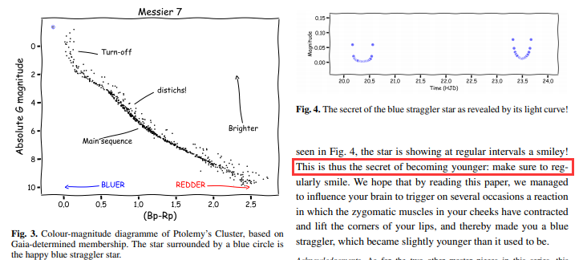

3. [Detection of Rotational Variability in Floofy Objects at Optical Wavelengths](https://arxiv.org/abs/2103.16636)

   通过对行星的相位解析观测，可以让我们了解使其变得独特的经纬度变化。在对光变数据分析的时候，发现了一种“毛茸茸”天体的自转光变，很可能其半球之间存在强烈的差异，由表米娜不同的反射率造成的。

   作者很认真地研究了不同的猫猫在打滚的时候，肉眼感受到的“亮度” 是如何改变的，而且是非常细致的研究。作者在文章里处处埋猫梗，单词里只要出现“cat”字母组合的都被高亮了，文章最后的caveat (注意事项) 讨论变成了 "Catveat"；作者还说要把文章投到 Catstrophysical 杂志上去。

   
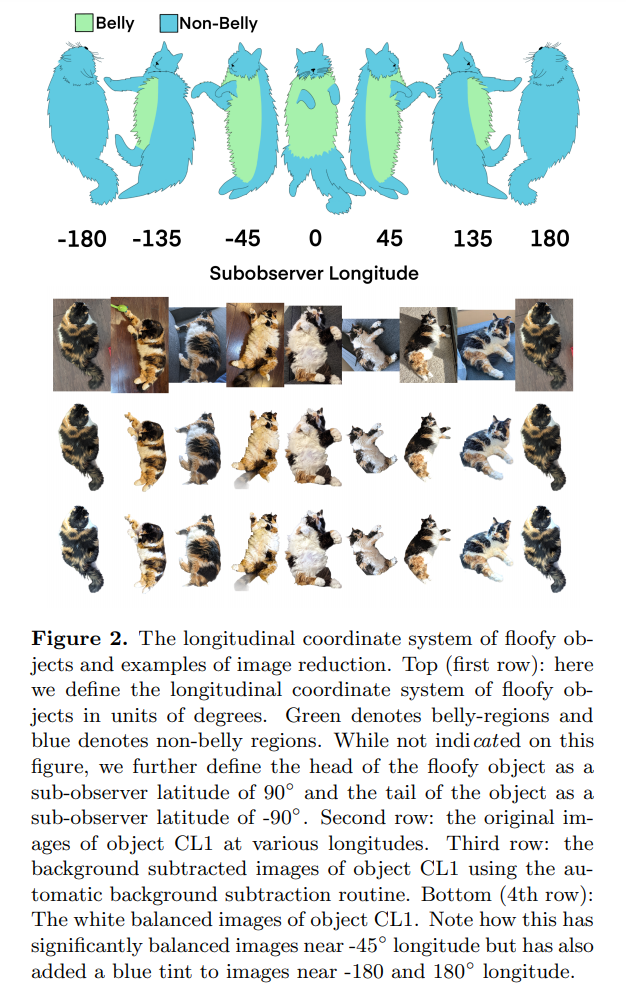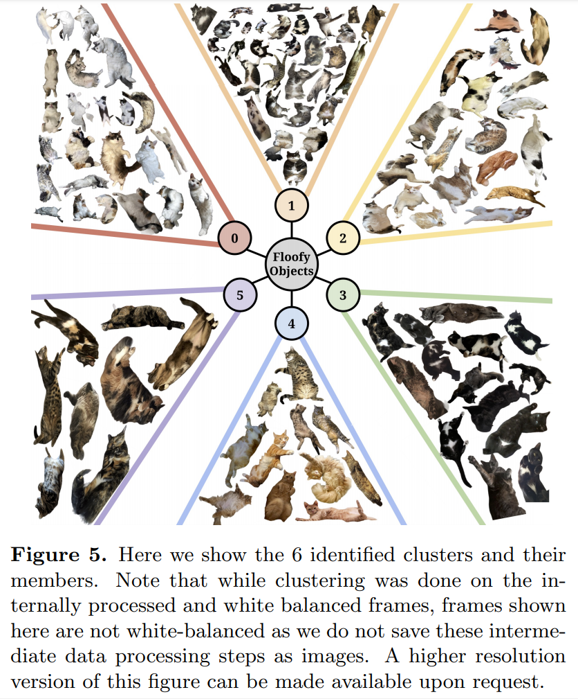

4. [Science Spoofs, Physics Pranks and Astronomical Antics](https://arxiv.org/abs/2103.17057)

   There are plenty of examples of humor being combined with science. 物理和天文学家的一些有趣的故事。

5. [I Knew You Were Trouble: Emotional Trends in the Repertoire of Taylor Swift](https://arxiv.org/abs/2103.16737)

   行星科学包罗万象。对Taylor Swift在14年间的149首歌的情绪研究。为了量化一首歌的情感状态，根据歌词和弦音（chordal tones），将标准分为乐观程度（H）和关系的承诺强度（R）。发现在更强的关系中，情绪也倾向更加积极。线性拟合的关系为：
   $$
   R=0.642^{+0.086}_{-0.053}H-1.74^{+0.39}_{-0.29}
   $$
   另外发现各个专辑内的平均幸福感（H）随时间的变化没有显著的趋势。另外，跟蓝眼睛的人合作整体上积极情绪较少，而跟绿色或者靛蓝色（indigo-colored）眼睛的人可能会产生更积极的情绪与更强的关系。

当真是愚人节。

## 2021-04-02

1. [The distribution of open clusters in the Galaxy](https://arxiv.org/abs/2104.00134)

   使用Gaia DR2的数据，获得新的1750个开放星团的目录。使用银河金属丰度梯度作为金属丰度的先验，以及一个更新的Gaia DR2光度带通消光的多项式和改进的等龄线拟合，得到了更好的年龄测量。星表也包含了更好的银河平面位置和自行，可以讨论星团目前的空间分布，还可以讨论星团出生地的空间分布，这些空间分布是通过整合与星团年龄相等的时间的轨道获得的。银河系臂的旋转速度为$28.5\pm1.0 km\ s^{-1}kpc^{-1}$。

## 2021-04-05

1. [Revisiting Pulsar Velocities Using Gaia Data Release 2](https://arxiv.org/abs/2104.01169)

   杨猛的文章，发在RAA上。本来是想从Gaia数据中找新脉冲星，这篇文章是使用已知的脉冲星，计算本地（LSR）的速度。脉冲星本地的速度与银河系自转模型之间速度差中值~7.6km/s，比典型的速度离散~27.5km/s小。

## 2021-04-06

1. [Fast radio bursts and their high-energy counterpart from magnetar magnetospheres](https://arxiv.org/abs/2104.01925)

   提出FRBs是由磁星的地壳断裂引发的，爆发事件率取决于地壳中的磁场强度。地壳断裂会产生阿尔芬波，在磁层中形成一个电荷匮乏的区域，并导致非稳态对等离子体放电。由于跨磁场线的非均匀对子产生，相干等离子体发射产生FRB。同时，FRB相关的XRB是由外部磁场线的快速弛豫产生的。

   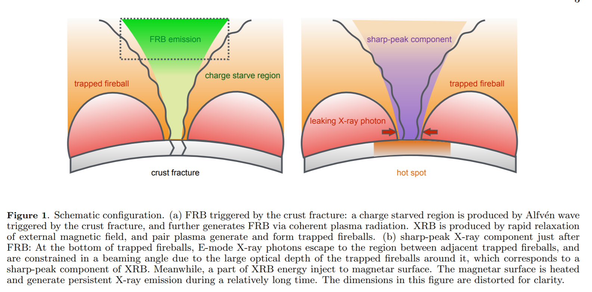

   在这幅图中，与FRB 200428相关的尖峰硬X射线成分来自于相邻被困火球之间的区域，其具有高截止能量的光谱被认为是共振康普顿散射所致。持续的X射线发射来自于一个被磁层活动加热的热点，其温度演变是由磁星表面冷却所主导的。在这种情况下，磁场较强的磁星往往会产生更亮、更频繁的重复爆发。

2. [The Phosphene Controversy: Is it Phosphene? Is there life on Venus?](https://arxiv.org/abs/2104.01932)

   总结了一下之前在金星上发现PH3的工作，以及对它的争议。

## 2021-04-07

1. [A peek outside our Universe](https://arxiv.org/abs/2104.00521)

   根据广义相对论，一个具有宇宙学常数$\Lambda$的宇宙，就像我们的宇宙一样，被困在一个事件视界$r<\sqrt{3/\Lambda}$内。外面是什么？用Israel（1967）的交界条件表明，外面可能有一个不同的宇宙。我们的宇宙在外部观察者看来就像一个黑洞。传出的光子不能逃离我们的宇宙，但传入的光子可以进入并在CMB中留下印记。从CMB地图的分析中呈现出一幅化石记录的画面，它与黑洞宇宙的预测一致，但却挑战了我们对原始宇宙起源的理解。

2. [Jacobi stability analysis of the classical restricted three body problem](https://arxiv.org/abs/2104.02432)

   Kosambi-Cartan-Chern(KCC)理论中提出的Jacobi稳定性概念，来分析受限三体问题的运动稳定性。KCC理论是一种微分几何方法，用于描述一个动力学系统的整个轨迹相对于附近轨迹的偏差的变分方程。从KCC理论和Jacobi稳定性的角度来看，受限三体问题的五个拉格朗日平衡点都是不稳定的。

3. [Radio Millisecond pulsars](https://arxiv.org/abs/2104.02294)

   毫秒脉冲星(MSPs)具有极端的时间稳定性，加上其奇异的环境和演化历史，使其成为探测极端条件下物质的绝佳实验室。种群研究表明，我们发现了银河系不到5%的MSP，这意味着大量的射电MSP正等待着通过改进的搜索技术和更灵敏的调查来发现。在本章中，我们将概述正在进行和即将进行的MSP调查的现状。本章还总结了已知射电MSP的观测光谱、轮廓和极化特性。最后，我们介绍了射电MSP的定时研究是如何实现巨大的科学回报的，包括利用MSP阵列探测引力波的尝试，利用个别有趣的MSP系统进行引力测试，以及利用紧凑双星系统中MSP观测到的日食探测双星内物质。

   是《Millisecond Pulsars》的一章。

## 2021-04-08

1. [A Southern-Hemisphere all-sky radio transient monitor for SKA-Low prototype stations](https://arxiv.org/abs/2104.02940)

   介绍了在平方公里阵列低频部分的两个原型站上实施的第一个南半球全天空成像仪和无线电暂现源监测系统。该系统自部署以来，一直用于实时监测记录的调试数据。此外，还对产生的全天空图像执行了一种暂现源搜索算法。该算法采用差分成像技术，能够识别各种暂现源类别，从人为的无线电频率干扰到真正的天体物理事件。

## 2021-04-09

1. [A New Blind Asteroid Detection Scheme](https://arxiv.org/abs/2104.03411)

   传统的数字跟踪方法，无法在运动近似线性的时间尺度之外，有效地实现将检测阈值推到更暗的极限。提出了一个方案，在用户定义的运动空间参数中进行采样，将这些采样轨迹映射到数据空间，并计算一个最佳信号匹配滤波器，用于计算试验轨迹的信噪比。在暗能量相机的一个小型测试数据集上展示了这种方法的能力，恢复了预期出现的大部分小行星，并且仅用几个小时的观测就发现了数百个新的小行星。

## 2021-04-12

1. [Multi-wavelength follow-up of FRB 180309](https://arxiv.org/abs/2104.03991)

   使用Gemini、VLA和ATCA对FRB180309进行多波段观测，找宿主星系。红移上限0.32，光度大于$8.7\times10^{32}erg\ Hz^{-1}$。使用Parkes的多波束模型，将其定位到$2'\times2'$的区域，这个区域有14个星系的光度红移与FRB的红移上限一致，其中两个有PRS（"persistent" radio sources），宿主星系还需进一步使用$H\alpha$辐射确认。

## 2021-04-13

1. [The Rotation of Selected Globular Clusters and the Differential Rotation of M3 in Multiple Populations from the SDSS-IV APOGEE-2 Survey](https://arxiv.org/abs/2104.04524)

   使用APOGEE-2的高精度径向速度数据分析10个球状星团的旋转特性。方法，首先将星团从星团中心分成两部分，分割线的position angle从0度到180度，2度为步长，之后计算两部分恒信的径向速度的平均值，计算两个平均值的差$\Delta v$。如果有旋转，那$\Delta v$应该随PA正弦变化，振幅是旋转速度的两倍，最小和最大值的位置是旋转轴的PA。通过每次丢掉20%的恒星，计算100次来估算误差。由此测到了9个球状星团（M2、M3、M5、M12、M13、M15、M53、M92、M107）的旋转速度和旋转轴的位置角。

   对于M3、M5、M13、M15，通过[Al/Fe]丰度将星团分成初代恒星（FG，first generation）和第二代恒星（SG），发现FG和SG有显著差异。

   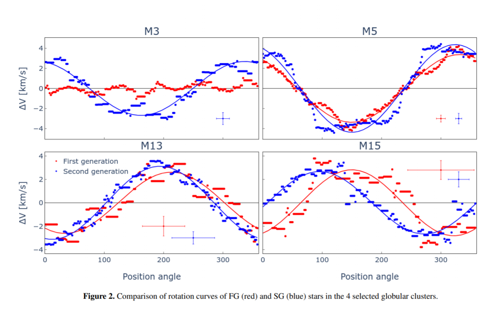

2. [A new measurement of the Hubble constant using Fast Radio Bursts](https://arxiv.org/abs/2104.04538)

   使用FRB的DM测量来估计哈勃参数，使用九个已知宿主星系的FRB，根据其红移和DM，限制哈勃常数为$H_0=62.3\pm9.1km\ s^{-1}Mpc^{-1}$。估计有几百个有红移的FRB就可以将哈勃常数限制在1%的误差。

   似然概率：
   $$
   \mathcal{L}(DM,z)=\prod_i\mathcal{L}(DM_i,z_i)=\prod_i\frac{1}{\sqrt{2\pi}\sigma_i}\exp\left[\frac{(DM_i-DM^{theo}(z_i))^2}{2\sigma_i^2}\right]
   $$

   $$
   DM_{LSS}(z)=\frac{3\Omega_bH_0}{8\pi Gm_p}\chi_ef_{IGM}\int_0^z\frac{1+z'}{E(z')}dz'
   $$

   其中$\sigma^2(z_i)=\sigma_{MW}^2+\sigma_{host}^2(z_i)+\sigma_{LSS}^2(z_i)$，$DM^{theo}(z_i)=DM_{LSS}(z_i)+\left<DM_{host}\right>(z_i)$。

   

   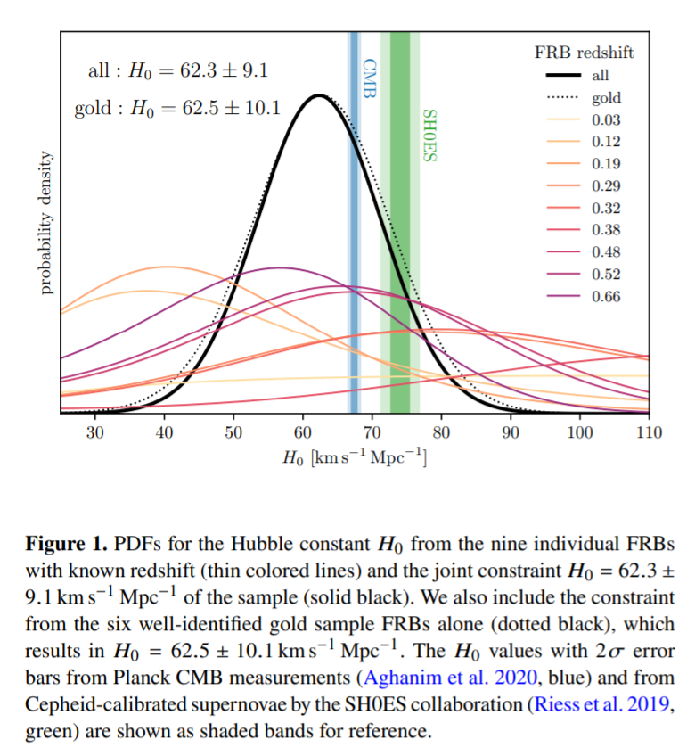

3. [Radio Recombination Line Observations at 1.0-1.5 GHz with FAST](https://arxiv.org/abs/2104.05272)

   HII区广泛的分布在银河系中，是恒星形成的示踪剂，其分布与银河系螺旋结构有关。氢和其它原子的射电重组线（Radio recombination lines, RRLs）可以测定温度和密度等参数。但是1.4GHz的RRLs很弱，FAST的19波束可以覆盖23个RRLs，包括$Hn\{\alpha\}, Hen\{\alpha\}, Cn\{\alpha\}$，其中n=164-186。观测了9个HII区，每个区域20分钟，以达到9mk的灵敏度，速度分辨率2km/s。

   电子温度：
   $$
   T_e=\left[\left(\frac{6985}{\alpha(\nu,T_e)}\right)\left(\frac{\Delta V_{H167\alpha}}{km\ s^{-1}}\right)^{-1}\left(\frac{T_{1.4GHz}}{T_{H167\alpha}}\right)\left(\frac{\nu}{GHz}\right)^{1.1}\left(1+\frac{N(He^+)}{N(H^+)}\right)^{-1}\right]^{0.87}
   $$
   发射测量（Emission Measure, EM）：
   $$
   EM=7.1pc\ cm^{-6}\left(\frac{S_L}{Jy}\right)\left(\frac{\lambda}{mm}\right)\left(\frac{T_e}{K}\right)^{1.5}\left(\frac{\Delta V}{km\ s^{-1}}\right)\left(\frac{\theta_s}{arcsec}\right)^{-2}=n_e^2Lf_V
   $$
   来自ionized gas的压力：
   $$
   P_e=2n_ek_bT_e
   $$

4. [Empirical Scaling Laws of Rocket Exhaust Cratering](https://arxiv.org/abs/2104.05176)

   研究火箭喷气形成的坑洞的经验规律。根据densimetric Froude number $F_r$，引入了侵蚀参数e erosion parameter $E_c$，以预测侵蚀坑的尺寸。参数由气体速度$v$，气体密度$\rho_g$，沙子密度$\rho_s$，沙粒的直径$d$，喷气口在表面上方高度$H$，和喷气口的直径$D$决定：
   $$
   F_r=\frac{\rho_gv^2}{(\rho_s-\rho_g)d}\qquad E_c=\sqrt{F_r}\times\frac{D}{H}
   $$
   尽管物理现象复杂，但侵蚀坑的深度的形成规律还是简单的。在较高的推力测试中，较深的内部坑先形成，外部坑缓慢形成。较低的推力测试，没有形成内部深坑。在整个测试过程中，火山口的深度始终是时间的对数，与气体速度等无关：
   $$
   \frac{d}{a}=\log\left[b\left(t+\frac1b\right)\right]\qquad \frac{\dot d}{a}=b e^{-d/a}
   $$
   d是深度，a是时间和深度的scale参数。

## 2021-04-14

1. [No Sub-Saturn Mass Planet Desert in the CORALIE/HARPS Radial Velocity Sample](https://arxiv.org/abs/2104.05713)

   CORALIE/HARPS使用径向速度法发现的系外行星样本（Mayor et al. 2011）中，当与$10-100M_\odot$的宿主恒星距离小于3AU时，恒星失控的气体吸积可能会使系外行星失去大气，在表面上显现“沙漠”的迹象。MOA微引力透镜的调差结果（Sukuzi et al. 2018）与这篇文章类似，均没有发现系外行星中存在沙漠。这些结果共同暗示，核心吸积理论的失控吸积情景对系外行星的最终质量和半主轴分布影响不大。

## 2021-04-15

1. [Jupyter-Enabled Astrophysical Analysis for Researchers and Students](https://arxiv.org/abs/2104.06527)

   Astro数据实验室是由NOIRLab开发和运营的，其使命是为天文学界服务，目前已有超过1500名注册用户。为研究人员提供访问大型数据集的权限，提供软件、工具和数据服务。github链接：https://github.com/noaodatalab/datalab。

## 2021-04-16

1. [Robust Assessment of Clustering Methods for Fast Radio Transient Candidates](https://arxiv.org/abs/2104.07046)

   Fast Radio Transient的候选体搜索需要对时间和DM做遍历，遍历产生大量的数据需要检查。使用天空位置（l，m）、时间和色散（DM）对候选体进行聚类。加入天空位置后，性能提高10%。

2. [SETI tactics on FAST fractality](https://arxiv.org/abs/2104.07334)

   FAST的SETI后端 - Koch snowflake antennae，优化望远镜的定向灵敏度。

## 2021-04-19

1. [An Empirical Bayesian Approach to Limb-darkening in Modeling WASP-121b Transit Light Curves](https://arxiv.org/abs/2104.07864)

   一种新的迭代方法，使用经验贝叶斯从TESS的光变曲线中对WASP-121b凌星导致的临边昏暗建模。
   $$
   \frac{I(\mu)}{I(1)}=1-u_1(1-\mu)-u_2(1-\mu)^2\qquad quadratic\ law\\
   \frac{I(\mu)}{I(1)}=1-\sum_{n=1}^4c_n(1-\mu^{n/2})\qquad non-linear\ law
   $$
   对于模型的各种参数，$R_p/R_*$是行星/恒星半径比，$i$是Inclination，$a/R_*$是Semi-major axis of planet orbit in stellar radii，$T_0$是Time offset of transit center，$u_1$是Linear limb-darkening，$u_2$是Quadratic limb-darkening，$c_{1-4}$是Quadratic limb-darkening coefficient。

## 2021-04-20

1. [Recovery of Spectra of Phosphine in Venus' Clouds](https://arxiv.org/abs/2104.09285)

   最初声称在金星发现$PH_3$的人，使用三种不同的校准方法以超过$4\sigma$的置信度恢复了金星大气层中的$PH_3$信号。并且认为Villanueva等人没找到信号的原因是保留了所有的天线基线，使噪声提高了2.5倍。另外Villanueva等人提出$SO_2$污染信号，ALMA的$PH_3$线的$SO_2$的污染是最小的，JCMT的$PH_3$的净丰度是20ppb，ALMA是7ppb。

2. [Capturing the physics of MaNGA galaxies with self-supervised Machine Learning](https://arxiv.org/abs/2104.08292)

   Integral field spectroscopic galaxy surveys，集成视场光谱星系巡天，包含了多个维度的复杂数据。使用Simple framework for Contrastive Learning of visual Representations （SimCLR）来提取天文数据中的特征。这里用的是CNN的encoder，加上non-linear head projection function来计算损失函数。这个方法对非物理属性不敏感（如积分视场单元大小）。只从数据来看，星系会自然的聚成三类：rotating main-sequence disks, massive slow rotators and low-mass rotation-dominated quenched galaxies。

3. [Photon-Inter-Correlation Optical Communication](https://arxiv.org/abs/2104.08913)

   由于深空的光学衍射极限，使用以光子为载体的通信，在大容量、远距离的星际通讯的过程中会有巨大的几何损耗，尽管有较高的信道容量，但传输距离上有了难以逾越的极限。这里提出一种针对超高信道孙搞得光子间相关通信（PICOC）方法。将光视为光子流，从极弱的脉冲序列中获取内部相关和光子统计的信息。成功的将嵌入在10倍以上噪声中的单光子信号分离出来了，在损耗高达160dB的通道中建立了高保真的信道。PICOC仅用市售的望远镜，就可以使用毫瓦的激光，建立从火星到地球的通信链路，用几瓦的激光，就可以实现从太阳系边缘到地球的通信链路。

4. [linemake: An Atomic and Molecular Line List Generator](https://arxiv.org/abs/2104.08286)

   一个开源的原子和分子谱线列表生成器，地址https://github.com/vmplacco/linemake。

## 2021-04-21

1. [A Thesaurus for Common Priors in Gravitational-Wave Astronomy](https://arxiv.org/abs/2104.09508)

   在引力波数据分析中，经常用到关于双星质量、红移和自旋等非微观先验概率，并在参数转换的基础上计算隐含的先验，或者将后验从一个先验重新加权到另一个。这篇文章介绍了一些常用的操作，并提供了一个雅各布表，用来转换质量参数之间的先验，并推到了“有效自旋”参数的先验分析表达式。

   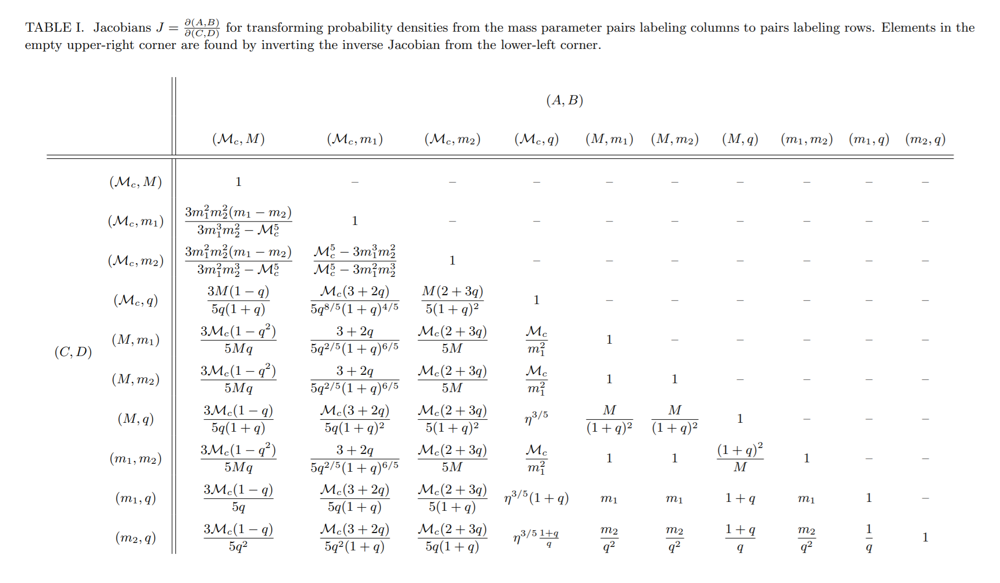

2. [Constraining bright optical counterparts of Fast Radio Bursts](https://arxiv.org/abs/2104.09727)

   通过Las Cumbres天文台全球望远镜网络（LCOGTR）在8个定位良好的FRB的位置处，在不同的时间尺度上，如FRB爆发后的一天、几个月或者一年，搜索光学瞬变现象。在r波段极限星等为22等的情况下，没有发现光学瞬变现象。根据此极限星等，与超光速超新星（SLSNe）、Ia型超新星（SNe）、伽马暴相关超新星（GRB SNe）、千禧星和潮汐破坏时间（TDEs）的光变曲线进行比较，以99.9%的置信度排除了FRB与SLSNe有关的可能性。

3. [The continuous wavelet derived by smoothing function and its application in cosmology](https://arxiv.org/abs/2104.09505)

   一种构建连续小波函数的方案 - 通过提取平滑函数相对于尺度参数的一阶导数得到小波函数。这种小波构建的反变换只是相对于尺度参数的一维积分，因此用这种方式构建的连续小波变换比通常的方案更容易使用。

## 2021-04-22

1. [An Exact Integral-to-Sum Relation for Products of Bessel Functions](https://arxiv.org/abs/2104.10169)

   Dominici et al. 2012发现了两个贝塞尔函数的无穷求和与无穷积分之间的关系。这篇文章将其扩展到了N个贝塞尔函数的乘积上，并表明可以用Abel-Plana定理直接证明。
   $$
   \int_0^\infty dt\ t^{2k}\prod_{j=1}^N\left[t^{-\nu_j}J_{\nu_j}(a_jt)\right]=\sum_{m=0}^\infty\varepsilon_mm^{2k}\prod_{j=1}^N\left[m^{-\nu_j}J_{\nu_j}(a_jm)\right]
   $$
   Abel-Plana定理：
   $$
   \sum_{k=0}^\infty f(k)=\int_0^{\infty}dx\ f(x)+\frac12f(0)+i\int_0^\infty dy\ \frac{f(iy)-f(-iy)}{e^{2\pi y}-1}
   $$
   $f:\mathbb{C}\rightarrow\mathbb{C}$满足：

   - $f(z)$在$U=\{z\in\mathbb C:Re(z)\ge0\}$上解析。
   - $\lim_{y\rightarrow\infty}|f(z\pm iy)|e^{-2\pi y}=0$。
   - $\int_0^\infty dy\ |f(x+iy)-f(x-iy)|e^{-2\pi y}$对于任意$x\ge0$存在，并且当$x\rightarrow\infty$时趋近于0。

## 2021-04-23

1. [Recovering 21-cm signal from simulated FAST intensity maps](https://arxiv.org/abs/2104.10937)

   HI可以用来调查宇宙大尺度结构，但是会受到前景的干扰，比如银河的同步辐射、自由辐射、河外点源以及大气噪声。模拟观测的天区，使用PCA分离前景，从总图中减去PCA清理过的前景和噪声图，输出的信号和模拟的输入信号差为0.034mK，表明PCA可以为FAST恢复高精度的HI功率谱。
   
   以$X=N_\nu\times N_p$为输入，前者为频率通道数，后者为FAST可见天区测量的pixel的数量，也就是天区$x\times y$的温度（强度）。计算X的协方差，对其做PCA，保留特征值大的几项，做投影，然后用X减掉投影出来的特征，得到干净的HI图。

## 2021-04-26

1. [Spectral-temporal features of repeating ( one-off ) FRBs and Axion Star](https://arxiv.org/abs/2104.11389)

   提出一个统一FRB重复暴和非重复暴的模型。FRB产生于轴子星与中子星或者星系黑洞的磁化吸积盘的碰撞。可以解释以前观测到的光谱-时间特征，以及频率向下漂移等。

2. [Cuando la ortodoxia no es lo más relevante: el paisaje de La Gomera y la orientación de sus iglesias](https://arxiv.org/abs/2104.11290)

   当东正教不再是最重要的东西时：拉戈梅拉的风景和其教堂的方向。测量加那利群岛的拉戈梅拉岛的38座基督教堂的方向，面积约为370平方公里。对于每个教堂，测量了每个寺庙的祭坛所指向的方向的方位角和地平线的高度，获得的数据与考古天文学研究中经常使用的数字地形模型相印证。结果带来的猜想，拉戈梅拉岛已知的 "突兀性 "也许是其礼拜圣地的特殊方向模式的主要原因。

## 2021-04-27

1. [To observe, or not to observe, quantum-coherent dark matter in the Milky Way, that is a question](https://arxiv.org/abs/2104.12252)

   标题老莎士比亚了。玻色-爱因斯坦凝聚暗物质（BEC-DM），也成为标量场暗物质（SFDM），已经成为无碰撞的冷暗物质（CDM）的替代方案。SFDM可以抑制结构的形成，解决CDM在一定范围内玻色子质量的小尺度危机，也会对星系内BEC-DM亚结构产生影响。BEC-DM对重子示踪剂的影响有一些约束条件，研究银河系的暗物质子结构将很快解决这个问题，即暗物质在≲1 kpc的尺度上是表现为经典还是量子。
   
2. [Data analysis recipes: Fitting a model to data](https://arxiv.org/abs/1008.4686)

   Comments: a chapter from a non-existent book. 2010年的文章，讨论用模型拟合数据，以二维平面的点的线性拟合为例。标准的加权最小二乘拟合只有在一个维度的数据有可忽略的不确定性，以及另一个维度的所有不确定性都可以用已知方差的高斯描述时，才合适。但这一条件在实践中很少满足。如果数据有一个近似的“生成”模型，随后的拟合就不是任意的了，因为该模型允许直接计算参数的后验概率分布。如果有 "讨厌的参数”需要边际化，构建后验概率分布是必不可少的。

## 2021-04-28

1. [The lopsided distribution of satellites of isolated central galaxies](https://arxiv.org/abs/2104.12787)

   卫星星系在中心星系周围的分布不是完全随机的，而是显示出`polar and planar`的结构。通过流体动力学模拟孤立星系的卫星星系在二维平面上投影位置的角度分布，发现了统计上的bias。取决于星系的质量、颜色和大尺度环境。这为研究星系演化提供了一个有用的视角，关于卫星吸积、内部演化和与宇宙大尺度结构的相互作用。

   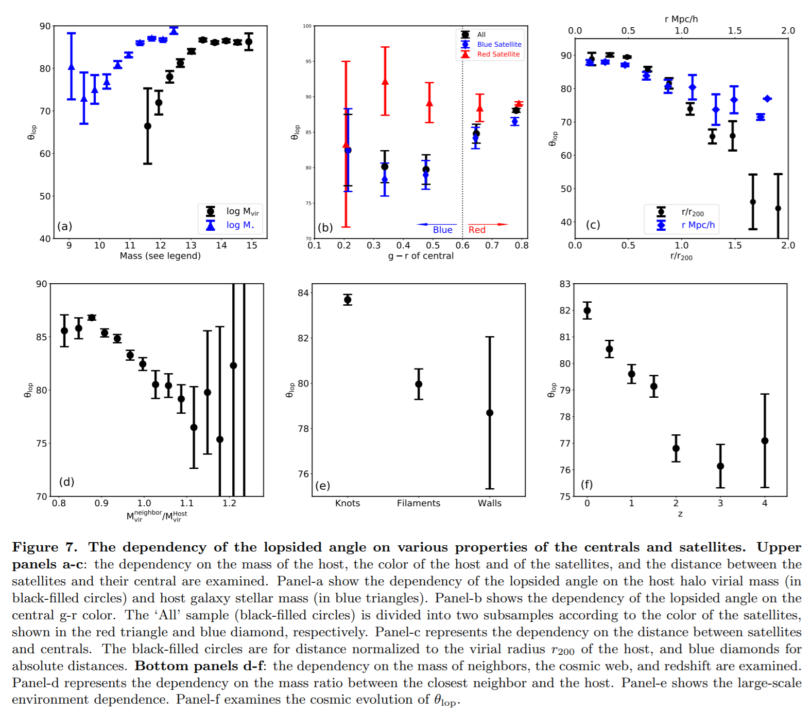

2. [Via Machinae: Searching for Stellar Streams using Unsupervised Machine Learning](https://arxiv.org/abs/2104.12789)

   在ANODE（[ANOmaly detection with Density Estimation](https://arxiv.org/abs/2001.04990)，基于密度估计的异常检测，使用条件密度估计和边界插值的非参数估计方法）的基础上，开发Via Machinae算法，用于识别Gaia数据中的冷恒星流，使用位置、自行和光度测量作为输入。

   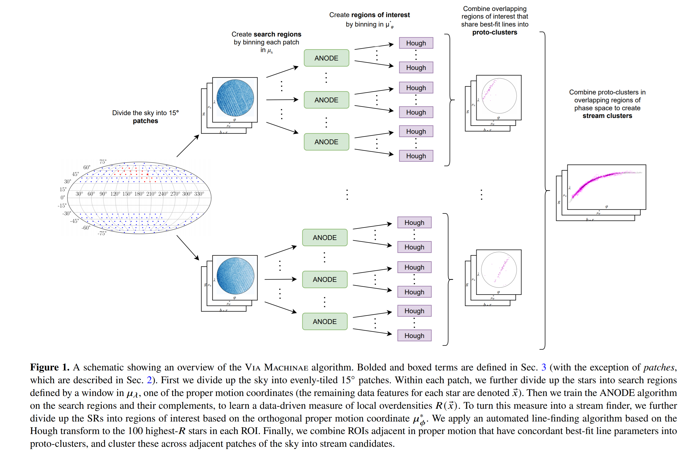

3. [Multi-Output Random Forest Regression to Emulate the Earliest Stages of Planet Formation](https://arxiv.org/abs/2104.12845)

   人们认为大质量天体（如小行星和行星等）的第一步需要小的星际尘埃颗粒相互碰撞，成长为较大的尺寸。这些小的石子最初形成受到`Smoluchowski coagulation equation`的约束，计算成本很高，难以解决这一方程的分析。
   $$
   {\frac  {\partial n(x,t)}{\partial t}}={\frac  {1}{2}}\int _{0}^{x}K(x-y,y)n(x-y,t)n(y,t)\,dy-\int _{0}^{\infty }K(x,y)n(x,t)n(y,t)\,dy
   $$
   这篇文章开发了一个多输出的随机森林回归模型，在暴力计算的数据上进行训练，以逼近不同时间点的原行星盘中灰尘颗粒大小的分布。也就是以上方程为基础，暴力数据计算的尘埃成团的演化过程，这里让模型在暴力计算的数据集上训练，得到一个回归方程，可以做到$R^2=0.97$准确度的预测。

## 2021-04-29

1. [PyTorchDIA: A flexible, GPU-accelerated numerical approach to Difference Image Analysis](https://arxiv.org/abs/2104.13715)

   通过利用PyTorch张量（GPU兼容的多维矩阵）和相关的深度学习工具，使用内在的大规模并行优化来解决内核问题。通过将差异图像分析（DIA）问题作为一个利用自动微分工具的GPU加速优化，算法对标量目标函数的选择是灵活的，并且可以在天文数据集上执行DIA，比其经典的类似算法至少快一个数量级。

## 2021-04-30

1. [Uranus' hidden narrow rings](https://arxiv.org/abs/2104.14482)

   天王星除了狭长的密集行星环之外，还有一个极其复杂的尘埃环系统，一些尘埃环宽度不到20公里，极其狭窄，并且不接近卫星共振。

   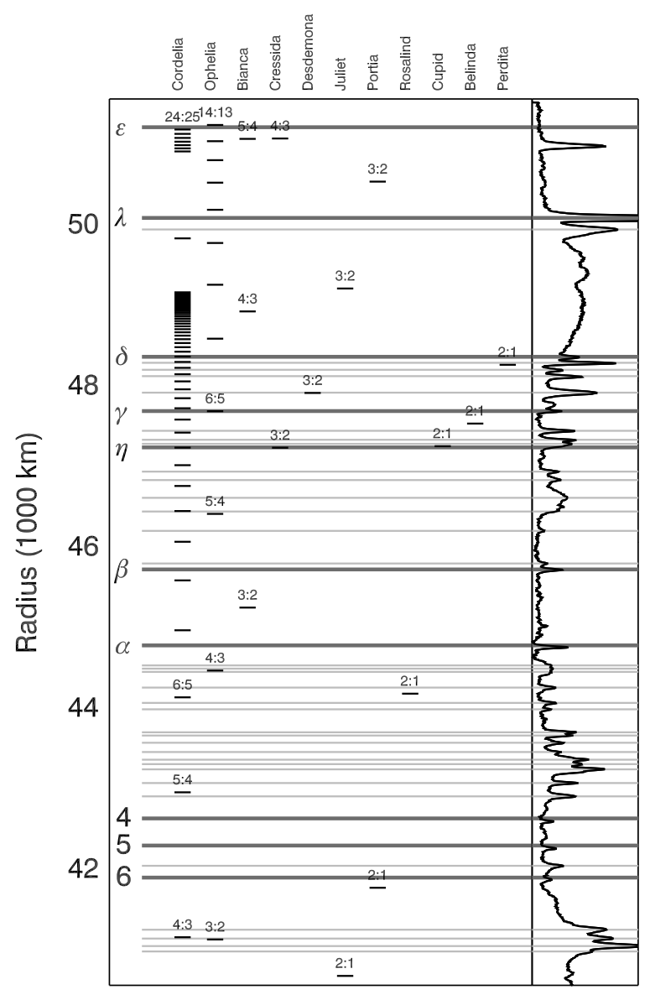

   旅行者号航天器飞过天王星之后，在其高分辨率图像中分辨出了这一尘埃环系统。

   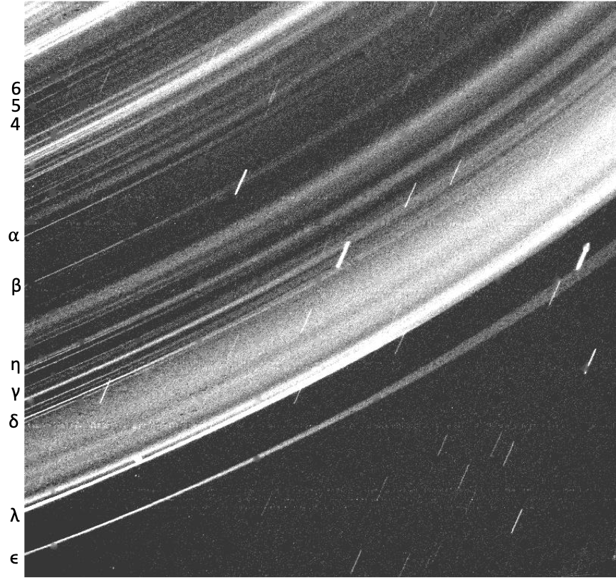

2. [Interferences in the Stochastic Gravitational Wave Background](https://arxiv.org/abs/2104.14231)

   宇宙膨胀打破了时间演化的对称性，但是对随机引力波背景（SGWB）的宇宙学预测通常是在宇宙静止的假说下得出的。如果放弃这一假设，跟踪所有尺度上引力波的时间依赖性，推导出由scaling sources（如 cosmic defects）产生的SGWB的预期不等时（和等时）波形。所有的客观测量都是由各向异性应力相关的全形傅立叶变换唯一的和分析的决定的。应变功率谱和能量密度参数都被证明有一个振荡的精细结构，它们在大尺度上有明显的差异，同时在大文数k下运行相位对立。预计由物质时代的长宇宙弦产生的重标应变功率谱k2h将围绕一个尺度不变的高原振荡。这些奇异的源也被证明会在重标应变谱和能量密度参数之间产生数量级的差异，这表明只有前者应该被用来做可靠的可观测预测。

