## 2021-05-03

1. [EXP: N-body integration using basis function expansions](https://arxiv.org/abs/2104.14577)

   `EXP`使用经验选择的基函数来扩展粒子的势场，适用于输入的质量分布，使高度非球形粒子场的模拟成为可能，以实现对粒子的N体模拟。在三种模型上测试，基于球形或非球形光环的模型、基于指数盘的模型、和基于条形盘的模型。发现EXP与直接求和或基于树的计算一样准确，而且在某些方面更好，同时计算量大大减少。EXP代码正准备进行公开发布，并附带描述软件设计的用户手册。

## 2021-05-04

1. [Real-Time Detection and Classification of Astronomical Transient Events: The State-of-the-Art](https://arxiv.org/abs/2105.00089)

   介绍暂现源的种类及其自动实时监测和分类的技术，和正在进行时域天文学调查的项目。

   暂现源的种类：

   - `Novaae, Kilonovae, Supernovae, Hypernovae`、`Tidal Disruption Events`、`Transits`、`GRB/FRB`、`Gravitational Microlensing`

   数据处理的特征：

   - `Automation`、`Real-Time`、`Reliability`、`Low rate of false positives`、`Learning`、`Follow-up`

   分类技术：

   - `Bayesian Network and Light Curve based approach`、`Contextual information and Classifiers`、 `Follow-up`

   时域天文学巡天项目：

   - Catalina Real-Time Sky Survey (`CRTS`)、Transiting Exoplanet Survey Satellite (`TESS`)、 Antarctic Survey Telescopes (`AST3`)、Large Synoptic Survey Telescope (`LSST`)、Panoramic Survey Telescope and Rapid Response System (`Pan-STARRS`)、Spitzer Space Telescope、Zwicky Transient Facility、Colorado Ultraviolet Transit Experiment (`CUTE`)、Sardinia Radio Telescope (`SRT`)、Gamma- Ray Light Detector (`AGILE`)、Robotic Optical Transient Search Experiment (`ROTSE`)、 James Webb Space Telescope (`JWST`)、Very Large Array (`VLA`)、Wide-Field Infrared Survey Telescope (`WFIRST`)、`EUCLID`

## 2021-05-05

1. [Stability of Neptune's distant resonances in the presence of Planet Nine](https://arxiv.org/abs/2105.01065)

   研究了海王星3:1和14:1之间的每一个n:1谐振中的跨海王星物体（Trans-Neptunian Objects, `TNOs`）的演变。结论是，超过12:1的共振和非共振天体在157AU附近都会通过假设的第九行星的扰动而被相当有效地移除。

## 2021-05-06

1. [Comparison of ground-based and Gaia photometry of astrometric radio sources](https://arxiv.org/abs/2105.01884)

   天体射电源的地基观测星等和Gaia星等结果非常不一致。

   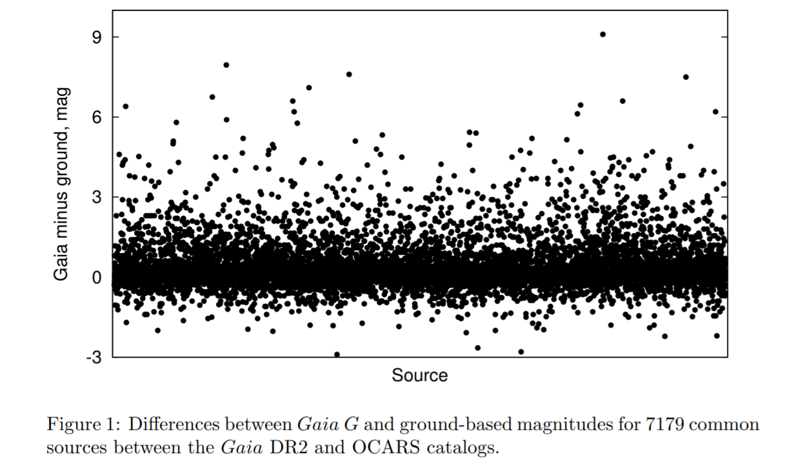

   原因可能有三个：

   - 由于天文射电源和Gaia Object错误的Cross-Identification
   - 源本身是光变的
   - 由于射电源和光学对应体在OCARS目录中错误的Cross-Identification，目前发现一半都是来自于此。

   这样的分析可以作为验证天体交叉识别的过滤器。另一方面，可以帮助检测射电源的光学星等可能的探测误差。

2. [Follow-up spectroscopy of comet C/2020 F3 (NEOWISE)](https://arxiv.org/abs/2105.02193)

   在2020年7月底，使用耶拿大学天文台的埃歇尔光谱仪`FLECHAS`对C/2020 F3 (NEOWISE)的彗核进行光谱分析。在4685Å和7376Å之间检测到了许多突出的发射特征，`C2 Swan`、`amidogen radical`、`two forbidden lines of oxygen`。另外，只有在2020年7月21日和23日拍摄的彗星光谱中检测到强烈的钠发射，在这两个夜晚之间，钠发射明显减弱，到2020年7月29日，光谱中不再出现Na。下图是光谱的一部分。

   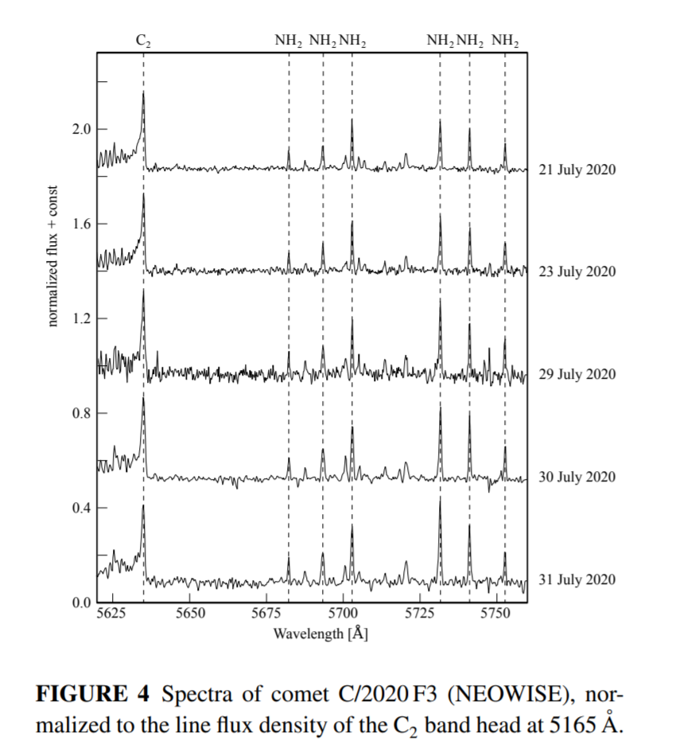

3. [The Three Hundred Project: The stellar angular momentum evolution of cluster galaxies](https://arxiv.org/abs/2105.01676)

   使用由`Three Hundred`项目提供的324个数值模拟的星系团，研究恒星的运动学特征在`first infall`时的演变。尽管在进入主星团时被剥离了暗物质和气体，但恒星的运动学几乎没有变化。绝大多数“星系”的运动学特征，以及它们的角动量-恒星质量平面，没有收到中心主星团的影响而改变。对于少数坠落星系，恒星和并与靠近中心主星团，能够使它们的恒星成分`spin-up`。

## 2021-05-07

1. [Disintegration of Long-Period Comet C/2019 Y4 (ATLAS): I. Hubble Space Telescope Observations](https://arxiv.org/abs/2105.02269)

   使用HST对解体后的C/2019 Y4做了三天观测。分裂成了两个碎片群，C/2019 Y4-A/B。两个碎片群有不同的演化行为，A的寿命短，在3天的活动中显示出明显的质量损失。最初碎裂的原因不能确定，粗略的说是核的自旋破坏或者次表层的冰失控升华，导致大量气体释放。解体前不久观察到彗星发蓝佐证这一点。气体只能由挥发性冰的升华产生，这需要它在$q=0.25AU$的近日点距离上至少存活过一次。推测ATLAS彗星来自一个非均匀的、宽达千米的富冰体内部，这一天体在前一个近日点分裂。

   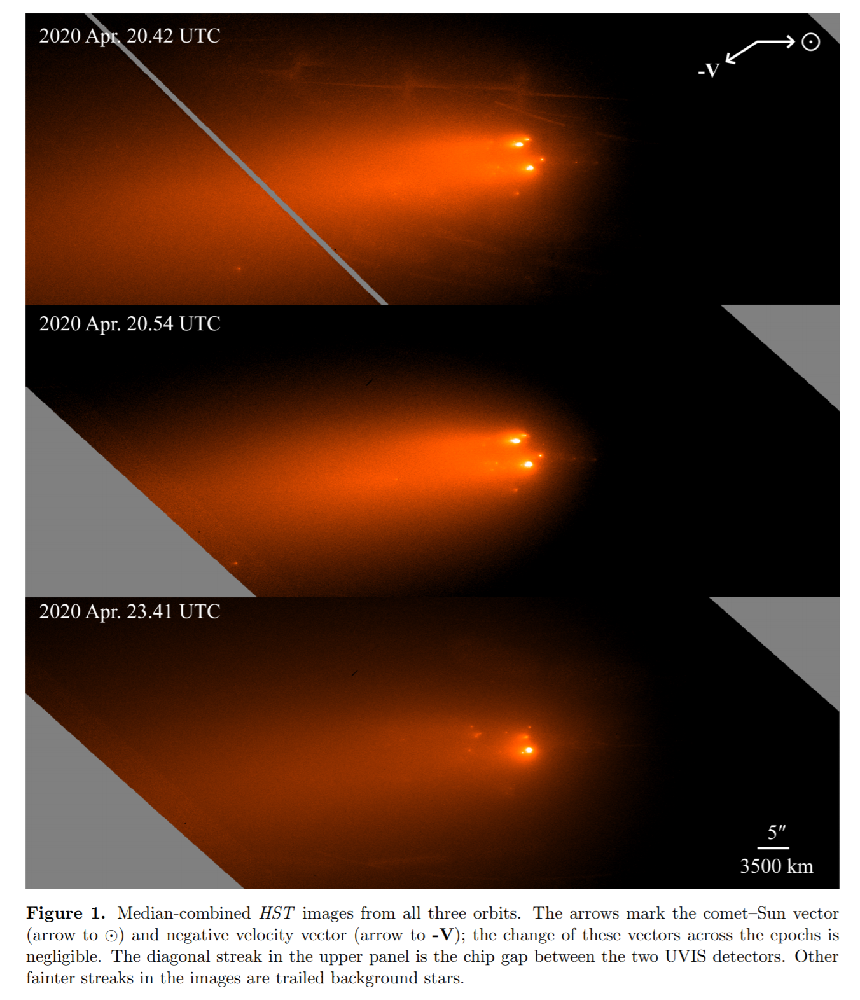

2. [A Pilot Study of Interplanetary Scintillation with FAST](https://arxiv.org/abs/2105.02783)

   行星际闪烁（Interplanetary Scintillation，`IPS`）的观测是研究太阳风和内日光层的有效遥感方法。使用超宽带接收机（UWB，270-1620MHz）观测3C286和3C279。宽频率覆盖，可以使用单频和双频分析来确定太阳风的速度。高的灵敏度也可以帮助观测到微弱的IPS信号。

3. [Anomaly detection in Hyper Suprime-Cam galaxy images with generative adversarial networks](https://arxiv.org/abs/2105.02434)

   一个无监督的异常检测方法。使用WGAN对Hyper Suprime-Cam (HSC) 调查中近百万张光学星系图像进行检测。WGAN根据数据集的分布生成类似HSC的星系，异常图像就定义在生成器的不良重建和判别器学习的离群特征。与生成器相比，判别器对潜在的有趣异常更加敏感。使用判别器得到了一个约有13000个的高异常样本。使用卷积自动编码器（convolutional autoencoder，`CAE`)来降级真实图像和WGAN重构的图像之间的残差，以此来描述异常图像。对残差聚类，检测到包括星系合并、潮汐特征和极端星系形成。对其中几个天体进行了后续的光谱分析，发现了一个有非常蓝的高金属性的HII区的贫金属矮星系。异常星系目录和代码在[这里](https://github.com/kstoreyf/anomalies-GAN-HSC)，探索数据的交互式可视化工具在[这里](https://weirdgalaxi.es/)。

## 2021-05-10

1. [Predicting the spectrum of UGC 2885, Rubin's Galaxy with machine learning](https://arxiv.org/abs/2105.03377)

   使用CNN在Pan-STARRS 3π Steradian Survey DR2的$56''\times56''$ grizy图像上训练，来预测星系的光学光谱。最初是[Wu & Peak 2020](https://arxiv.org/abs/2009.12318)中使用的框架。

2. [What is the Standard Cosmological Model?](https://arxiv.org/abs/2105.02903)

   `Reports of "cosmology in crisis" are in vogue, but as Mark Twain said, "the report of my death was an exaggeration"`。

## 2021-05-11

1. [zeus: A Python implementation of Ensemble Slice Sampling for efficient Bayesian parameter inference](https://arxiv.org/abs/2105.03468)

   `zeus`是用来做Ensemble Slice Sampling (ESS) 方法的贝叶斯参数推断的Python实现。ESS是一种新的MCMC算法，用于解决现代天文学和宇宙学分析对计算带来的挑战，不需要手动调整任何超参数，它的性能对线性相关不敏感，可以轻松拓展到1000个CPU。另外，它的局部适应性允许再存在强非线性相关的情况下也能有效地采样。即使在高位的强多模态分布中，这一方法也能达到很好的性能。与`emcee`相比，`zeus`在宇宙学和系外行星的应用中表现要好9倍和29倍。代码位于[这里](https://github.com/minaskar/zeus)，看起来用法和`emcee`相同，可以很方便的在两个工具之间切换。

2. [Fast Period Searches Using the Lomb-Scargle Algorithm on Graphics Processing Units for Large Datasets and Real-Time Applications](https://arxiv.org/abs/2105.04006)

   提出GPU加速的Lomb-Scargle周期搜寻方法，可以计算单个或批量对象的周期。在LSST的时间测量数据上进行测试，几乎可以实时得到太阳系天体的旋转周期。代码位于[这里](https://github.com/mgowanlock/gpu_lomb_scargle)，是CUDA代码。

3. [The Galactic neutron star population I -- an extragalactic view of the Milky Way and the implications for fast radio bursts](https://arxiv.org/abs/2105.04549)

   磁星和快速射电暴之间或许存在联系。通过对银河系的大小、结构和颜色的最佳估计，创建了银河系的正面图像。依据现有的距离信息，将银河系的磁星、脉冲星和X射线双星放在这个图像上。将`Galactocentric offsets`，`enclosed fluxes` 和` fraction of light distributions`与银河系外的暂现源进行比较，发现FRB在宿主星系上的位置与银河系中子星在银河系上的位置一致。

   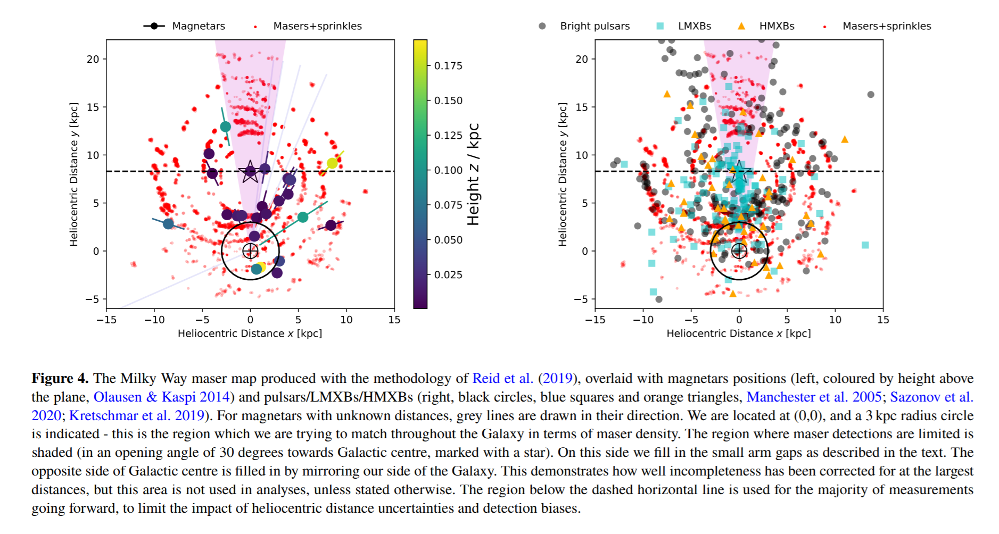

4. [A kinematic perspective on the formation process of the stellar groups in the Rosette Nebula](https://arxiv.org/abs/2105.03698)

   使用Gaia数据高分辨率光谱对Rosette中的年轻恒星群进行了运动学研究。使用中红外测光数据和X射线源列表筛选出403颗有相近视差和自行的成员。这一恒星形成区是高度亚结构化的，位于中心的年轻疏散星团NGC 2244有一个径向膨胀和旋转的模式，讨论了对星团形成的影响，例如 `monolithic cold collapse` 或者 `hierarchical assembly`。
   $$
   \Delta\left<RV\right> =2V_{rot}sin\,i\ sin(\phi+\phi_0)
   $$
   其中$V_{rot}$，$i$和$\phi_0$分别是旋转速度，旋转轴倾角和相位，
   $$
   V_{rot}=(d_{RA}\times V_{Dec}-d_{Dec}\times V_{RA})/r
   $$
   $r$是径向距离，$d$和$V$分别是位置和切向速度在RA和Dec上的分量。

   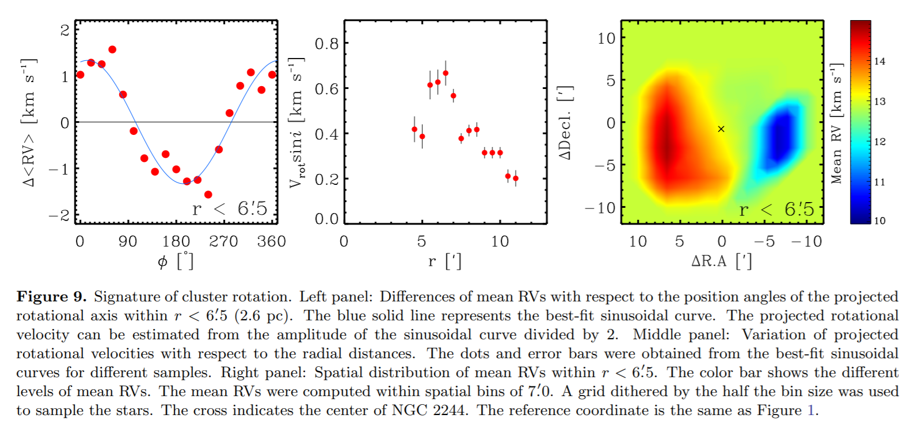

   还研究了位于HIII区气泡周围的三个星团。西部的组与邻近的气体结构在空间上相关，但它们的运动学与气体的运动学没有关系。南部的组没有显示任何相对于NGC 2244的系统运动。这两个组可能是在湍流云的丝状结构中自发形成的。东部组在空间和运动上与从NGC 2244退去的气柱有关。这一组可能是由NGC 2244中大质量恒星的反馈形成的。

   结果表明，玫瑰星云中的恒星群可能是通过三个不同的过程形成的：恒星群的膨胀、湍流云中的分层恒星形成以及反馈驱动的恒星形成。

5. [BESTP -- An Automated Bayesian Modeling Tool for Asteroseismology](https://arxiv.org/abs/2105.03728)

   恒星参数的贝叶斯估计（Bayesian Estimation of STellar Parameters，`BESTP`）是一个利用贝叶斯统计和Nested Sampling MCMC的工具，用于搜索最符合星震学观测的恒星模型。采样使用[DIAMONDS](https://diamonds.readthedocs.io/en/latest/index.html)进行，估计了太阳和红巨星HD 222076的基本恒星属性。对于太阳系的情况，估计质量、半径和年龄的不确定性分别减少了0.7%、0.3%和8%。对于HD 222076，更明显地减少了2%、0.5%和4.7%。将盖亚视差作为约束条件时，HD 222076的年龄提高了10%。

6. [Asteroseismic analysis of 15 solar-like oscillating evolved stars](https://arxiv.org/abs/2105.03776)
   $$
   \begin{aligned}
   &\frac{M_{sca}}{M_\odot}=\left(\frac{\nu_{max}}{\nu_{max\odot}}\right)^3\left(\frac{\left<\Delta\nu\right>}{\left<\Delta\nu_\odot\right>}\right)^{-4}\left(\frac{T_{eff}}{T_{eff\odot}}\right)^{1.5}\\
   &\frac{R_{sca}}{R_\odot}=\left(\frac{\nu_{max}}{\nu_{max\odot}}\right)\left(\frac{\left<\Delta\nu\right>}{\left<\Delta\nu_\odot\right>}\right)^{-2}\left(\frac{T_{eff}}{T_{eff\odot}}\right)^{0.5}
   \end{aligned}
   $$
   星震学的观测参数$\Delta\nu$和$\nu_{max}$。天基望远镜的星震学对于理解恒星结构和演化非常重要，CoRoT、Kepler和TESS已经探测到大量类似太阳的振荡演化恒星。这里使用Kepler和CoRoT望远镜观测15颗类太阳恒星的数据，确定恒星的基本参数。发现15颗恒星的质量和半径分别在$0.79-1.47M_\odot$和$1.60-3.15R_\odot$范围内。它们的模型年龄在$2.19-12.75 Gyr$之间。`Fitting reference frequencies increase the accuracy of asteroseismic radius, mass, and age`。

   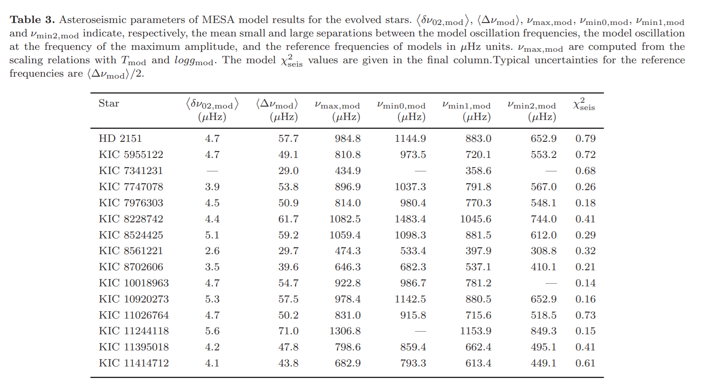

7. [The Drake Equation at 60: Reconsidered and Abandoned](https://arxiv.org/abs/2105.03984)

   考虑了德雷克方程的每个因素，要么被丢弃，或者被重新定义，最后被简化为一个新的参数$f_d$，也就是`用任何手段都可以探测到的技术生命的一部分`。然而无论是Drake方程还是替代方程，都不能真正解决`N`的问题。只有SETI和与外星文明的接触，才能确定N。

## 2021-05-12

1. [Asteroseismic inference of central structure in a subgiant star](https://arxiv.org/abs/2105.04564)

   星震测量能够推断恒星结构，例如恒星内部各点的密度和声速。通过评估预测的恒星结构是否与测量的结构一致，来检验恒星演化理论。到目前为止，这种逆向分析只被应用于太阳和三颗类太阳主序恒星。将这一技术扩展到亚巨星分支上的恒星，并将其应用于开普勒任务中描述最好的亚巨星之一，HR 7322。对这颗恒星的混合振荡模式的观察有助于推断其惰性氦核、核燃烧的氢壳以及辐射包络的深层部分的状况。发现，尽管模式频率有很大的不同，但这颗恒星中心附近的结构与预测的结构没有明显的区别。

## 2021-05-13

1. [Bayes-based orbital elements estimation in triple hierarchical stellar systems](https://arxiv.org/abs/2105.05258)

   从轨道参数估计的角度看，一些条件下的三体系统可以很好的被近似为两个双星系统的组合。但即使在这种近似下，高维参数空间与观测数据之间的复杂关系也是具有挑战性的技术问题。这里提出一种新的方法，使用MCMC框架，引入图模型，以动态自洽的方式描述参数和观测之间的概率关系。考虑了只有天体测量结果（只有自行）、只有径向速度和两类测量都有的情况。对三个经过充分研究的三体系统进行测试，确定了轨道倾角、恒星质量等参数的后验概率分布，结果与研究一致。提供了一个数学形式。

   
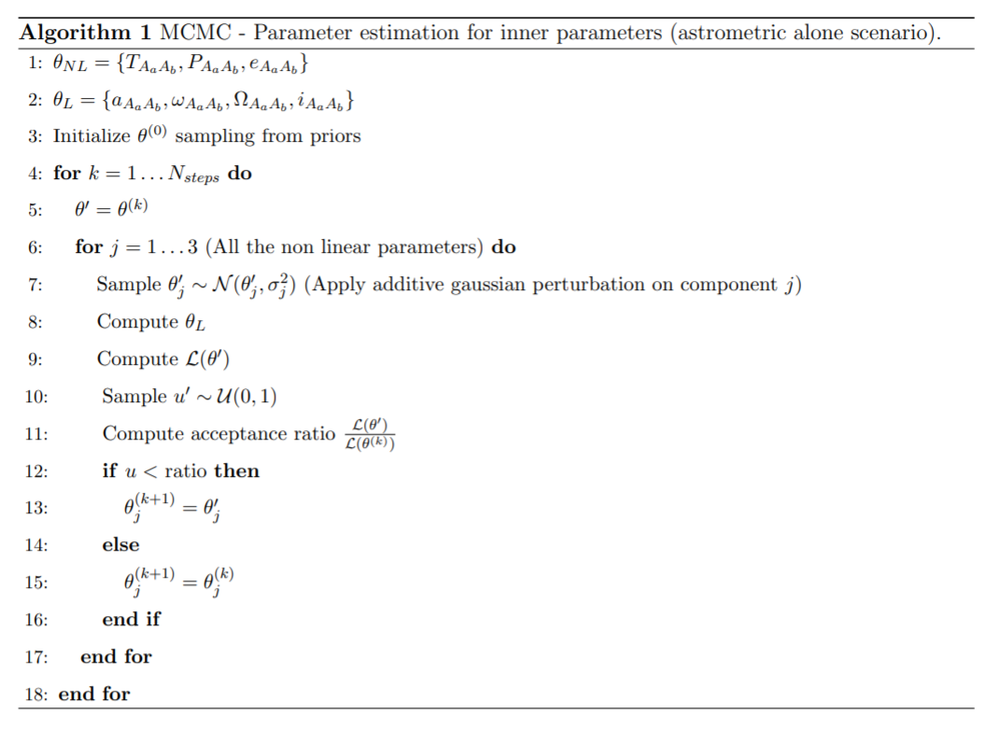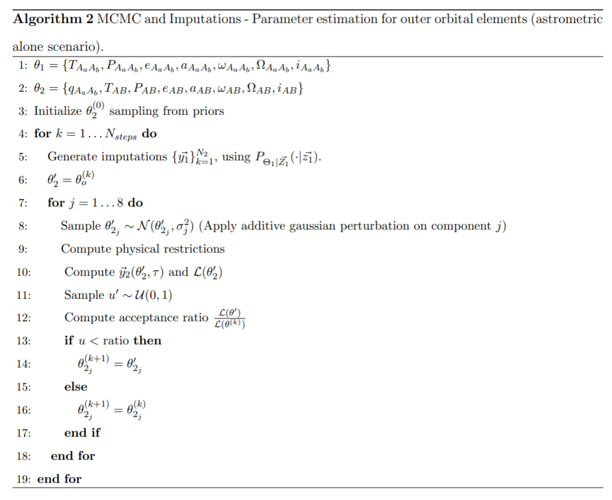

2. [Mars Astrobiological Cave and Internal habitability Explorer (MACIE): A New Frontiers Mission Concept](https://arxiv.org/abs/2105.05281)

   火星地表下的可居住性和天体生物学可以通过`lava tube cave`进行评估，而无需钻探。`MACIE`涉及十年调查（2013-2022）的两个关键目标和`MEPAG`的三个目标。机器人架构、自主导航、目标样本选择和分析方面的新进展将使MACIE能够探索火星次表层。

   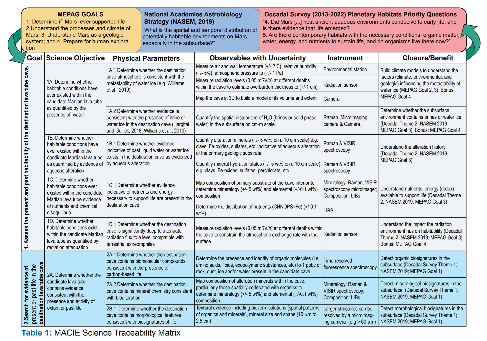

3. [Six Outbursts of Comet 46P/Wirtanen](https://arxiv.org/abs/2105.05826)

   对彗星46P/Wirtanen在2018年近日点附近的光变曲线中发现了六个爆发事件。在5英寸半径的孔径测光中，星等从-0.2变化到-1.6等，对应的尘埃质量在104到106公斤之间，但由于未知的颗粒大小分布，有很大的不确定性。检查了哈勃太空望远镜在一次近日点爆发后约2天拍摄的图像，在图像中没有发现大尺度喷发的证据，意味着喷发物质极限半径约为2米。

   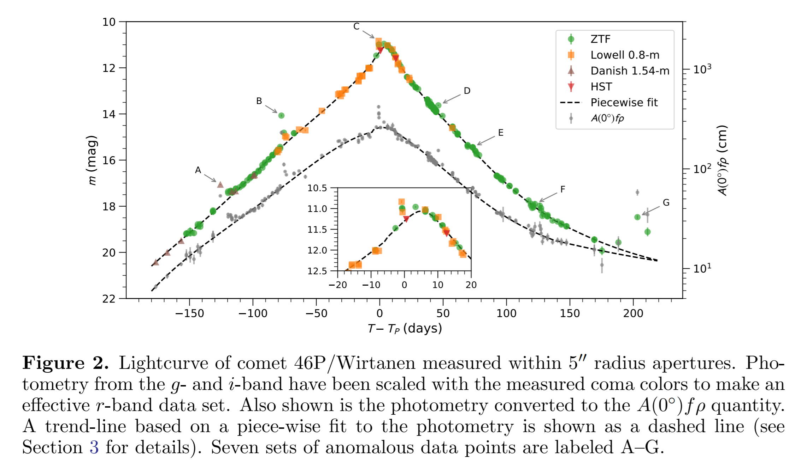

## 2021-05-14

1. [FRBs Lensed by Point Masses I. Lens Mass Estimation for Doubly Imaged FRBs](https://arxiv.org/abs/2105.05868)

   认为`质点`或者`质点+外部剪切力`的强引力透镜效应可以让FRB产生双峰（透镜图像），前者会导致前峰放大，因为后峰更亮，后者可以产生放大成都较低的前峰。透镜$M$和红移$z$的组合$M(1+z)$可以直接根据两个峰之间的延迟时间$\Delta t$和通量比$R$计算出来：
   $$
   M(1+z)=\frac{c^3\Delta t}{2G}\frac{\sqrt{R}}{R-1+\sqrt R\ln R}\approx101.5\frac{\Delta t}{1\ ms}\frac{\sqrt{R}}{R-1+\sqrt R\ln R}M_\odot
   $$
   

   当观察到的R较大时，可以实现更严格的透镜质量约束。

2. [The 3-D Kinematics of the Orion Nebula Cluster: NIRSPEC-AO Radial Velocities of the Core Population](https://arxiv.org/abs/2105.05871)

   使用Keck II NIRSPEC+AO的数据，测量了ONC区域56个低质量天体的径向速度，以及SDSS/APOGEE观测的172个源的径向速度，文章里给了表格。与HST ACS/WFPC2/WFC3IR和Keck II NIRC2测量的自行数据结合，得到了136个有三维速度的天体。速度分布是正态的，并且观察到`filament`沿南北方向伸长，（`这在以前的文献中已经得到很好的研究`），在视线到切向速度上也有伸长。

   
这些三维运动学，加上对源质量的估计，将使未来的研究能够确定主导的形成机制，区分竞争性吸积和湍流碎裂等模型。

## 2021-05-17

1. [Advances in Machine and Deep Learning for Modeling and Real-time Detection of Multi-Messenger Sources](https://arxiv.org/abs/2105.06479)

   `Handbook of Gravitational Wave Astronomy`的一章，讨论人工智能算法在多信使天文学时代的发展和应用。

## 2021-05-18

1. [Stellar Spectra Models Classification and Parameter Estimation Using Machine Learning Algorithms](https://arxiv.org/abs/2105.07110)

   用NN训练光谱数据，用于恒星光谱分类和恒星参数估计（$T_{eff}(K)$、$\log (L/L_\odot)$、$\log g$、$M/M_{\odot}$、$V_{rot}$）。

   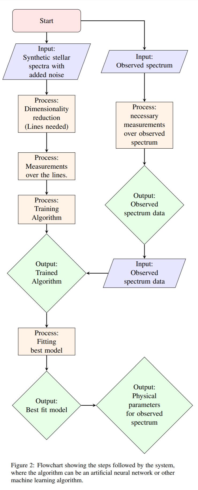

## 2021-05-19

1. [The FAST Galactic Plane Pulsar Snapshot survey: I. Project design and pulsar discoveries](https://arxiv.org/abs/2105.08460)

   GPPS的描述文章。使用`snapshot`观测模式，19波束的四次观测覆盖一个`0.1575`平方度的天区，每次积分时间`300`秒，一次观测使用`21`分钟。GPPS的目标是发现银纬$\pm10^\circ$范围内的脉冲星。GPPS现在发现了201颗脉冲星，包括弱脉冲星、高DM的脉冲星、有超新星遗迹的脉冲星、40颗毫秒脉冲星、16颗双脉冲星、模式变换的脉冲星和RRATs，数据在[这里](http://zmtt.bao.ac.cn/GPPS/)更新。

## 2021-05-20

1. [Search for period changes in Mira stars](https://arxiv.org/abs/2105.09018)

   在$R_C$和$i'_{Sloan}$波段重新观测了仙后座（Cassiopeia）的七个米拉（Mira）变星，历史的$i'_{Sloan}$波段光变曲线可以从1967-84年Asiago天文台拍摄的照相板中获得。所有恒星在其光变周期内都检测到了明显的颜色变化。V890 Cas星的周期从483天下降到428天，下降12%。其它所有的恒星都显示出较小的变化幅度，可能是由于光度测量的精度高于`photographic plates`的精度。

## 2021-05-21

1. [Accurate distances to Galactic globular clusters through a combination of Gaia EDR3, HST and literature data](https://arxiv.org/abs/2105.09526)

   通过Gaia EDR3的`parallax`直接获得距离
   通过运动学方法，合并EDR3的径向速度的弥散profile和HST的自行速度弥散profile。
   通过将附近的亚矮星（其绝对亮度由Gaia EDR3视差确定）与球状星团主序进行拟合来计算星团的距离。
   使用基于HST的恒星数量计数来确定距离。
   从不同的方法得出的平均距离有很好的一致性，误差低至2%左右。

## 2021-05-24

1. [The Detectability of Nightside City Lights on Exoplanets](https://arxiv.org/abs/2105.09990)

   使用拟建设的`LUVOIR`和`HabEx`观测站的直接成像观测，估计附近类地球的系外行星上夜晚城市灯光的可探测性。使用`Soumi National Polar-orbiting Partnership satellite`的数据来确定地球大气层顶部城市灯光的通量，使用商业的大功率等的光谱来模拟城市灯光的光谱能量分布。估计100个小时的观测，在太阳10pc内的行星的城市化水平为$0.4\sim3\%$时可探测。

   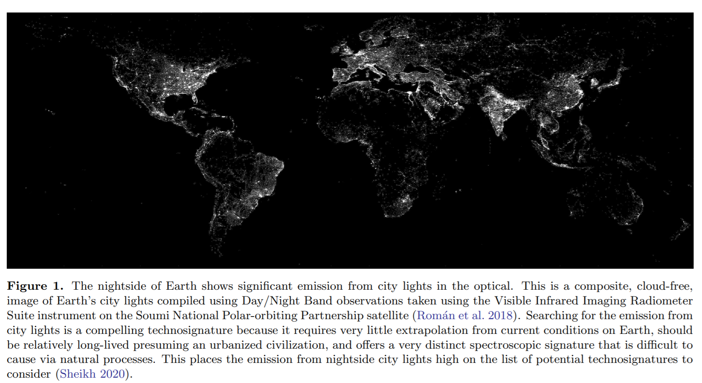

## 2021-05-25

1. [A Bright Fast Radio Burst from FRB 20200120E with Sub-100-Nanosecond Structure](https://arxiv.org/abs/2105.10987)

   使用在西班牙马德里的70m天线（DSS-63）探测到来自FRB20200120E的一个脉冲，频率在2.2-2.3GHz之间。这一FRB被CHIME探测到，位置在M81附近。找到其中有100ns的子结构，这椅子结构峰值流量密度为270J，总亮度为$4\times10^{30}\ erg\ s^{-1}Hz^{-1}$，比Crab的nanopulse亮500倍。

   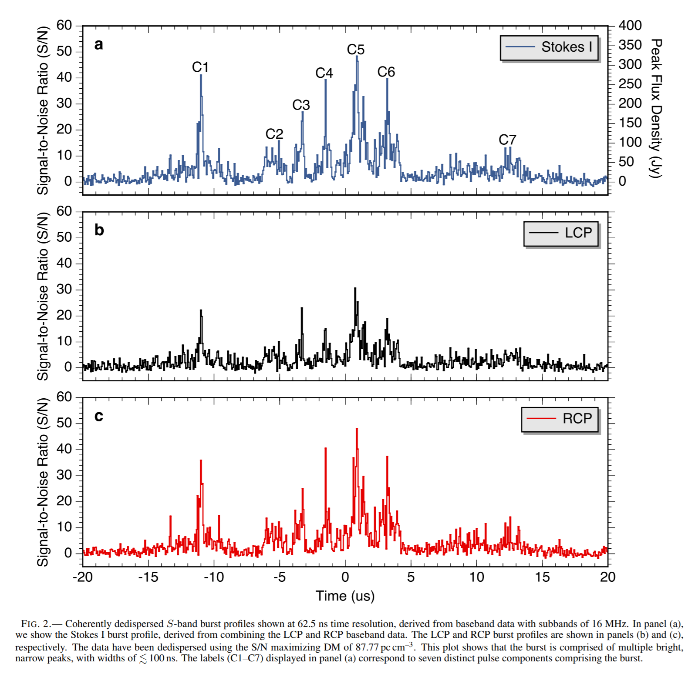

2. [Discovery of Carbon Monoxide in Distant Comet C/2017 K2 (PANSTARRS)](https://arxiv.org/abs/2105.10986)

   C/2017 K2 (PANSTARRS)的光学观测表明，其在35AU的位置开始活跃，这一位置水冰来不及升华，猜测可能是CO的升华。使用JCMT观测，在日心距离为6.72AU的位置检测到CO J=2-1的自旋跃迁。

3. [Interrelations between Astrochemistry and Galactic Dynamics](https://arxiv.org/abs/2105.10628)

   天体化学和星系动力学的关系。天体化学旨在研究分子的存在和形成，以及它们对天体的结构、演化和动力学的影响。相关领域包括恒星形成、原行星盘、旋臂的作用和银河系盘中的化学丰度梯度。

   - 早期宇宙的化学，包括外部星系
   - 恒星形成区域
   - AGB恒星和环星包层

   现代和新的设施不仅在天体化学方面，而且在射电天文学和相关领域的新发现中都能发挥关键作用。

## 2021-05-26

1. [The Hipparcos-Gaia Catalog of Accelerations: Gaia EDR3 Edition](https://arxiv.org/abs/2105.11662)

   依巴谷卫星和Gaia EDR3的数据的交叉匹配得到的长期的自行测量，由二者的位置差异给出。自行残差提供了一个强大的工具，可以测量附近恒星的微弱质量伴星的质量和轨道。

## 2021-05-27

1. [Analysis of Selected Runaway Stars in the Orion Nebula Based on Data from the Gaia EDR3 Catalogue](https://arxiv.org/abs/2105.12600)

   使用蒙特卡洛模拟几颗离群恒星的轨迹，数据是Gaia EDR3的自行和视差。证实了AE Aur和$\mu$Col是2.5Myr前由于Orion分裂从Orion Trapezium中脱离出来的恒星。Close triple encounters确认了HD30112和HD43112是从Col69中脱离出来的恒星。Gaia EDR3 3021115184676332288 和 Gaia EDR3 2983790269606043648 有0.5%的概率是1.1Myr之前从双星系统中分离出来的。

## 2021-05-28

1. [Do the periodic activities of repeating fast radio bursts represent the spins of neutron stars?](https://arxiv.org/abs/2105.13122)

   孤立的中子星自旋很难长达几个小时。孤立的中子星或者磁星可能的最大自旋周期，由恒星磁场和盘之间的相互作用主导。盘风改变了质量流速演化方程中的幂律指数。没有盘风的磁星最长的自旋周期是几十个小时。有经典参数的盘风的磁星，最长的自旋周期可以达到数百小时。对于由于盘风或其他角动量提取过程而导致的质量流率的更大幂律指数，自旋周期仍有可能达到16-160天。

2. [The Nanohertz Gravitational Wave Astronomer](https://arxiv.org/abs/2105.13270)

   概述了PTA作为精密引力波探测仪器的情况，回顾了在典型的脉冲星数据分析中遇到的信号和噪声过程的类型。说明了在实际工作中是如何进行搜索的，并在可能的情况下引导读 者找到可以自己探索的代码或技术。

## 2021-05-31

1. [Panchromatic HST/WFC3 Imaging Studies of Young, Rapidly Evolving Planetary Nebulae. I. NGC 6302](https://arxiv.org/abs/2105.13953)

   使用HST对年轻的行星状星云NGC 6302进行了全面的从近紫外到近红外的成像研究。该星云是富含尘埃和分子气体的极端`bi-lobed`、`pinched-waist`的PNe的典型代表。新的WFC3发射线图像清楚地将NGC 6302的`polar lobes`定义为一分为二的尘埃环形赤道结构，以及其中的精细结构（团块、结点和纤维状结构）。

   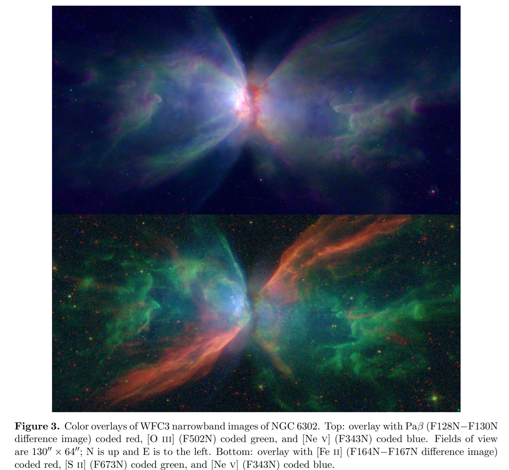

2. [Development of a new wideband heterodyne receiver system for the Osaka 1.85-m mm-submm telescope -- Corrugated horn & Optics covering 210-375 GHz band](https://arxiv.org/abs/2105.13605)

   波纹喇叭是一种经常用于射电望远镜的高性能馈源，它提高了观测效率，能够同时观测重要的发射线，如处于多种激发状态的CO。然而，在毫米/亚毫米波段，由于波长很短，很难制作出狭窄的波纹。通过优化波纹的尺寸，在210-375GHz频段设计了一个具有良好回波损耗、低交叉极化和对称波束模式的锥形波纹喇叭。波纹喇叭被安装在大阪1.85米毫米亚毫米望远镜上，成功地对$^{12}CO$、$^{13}CO$和$C^{18}O$（J=2-1，3-2）进行了同步观测。

   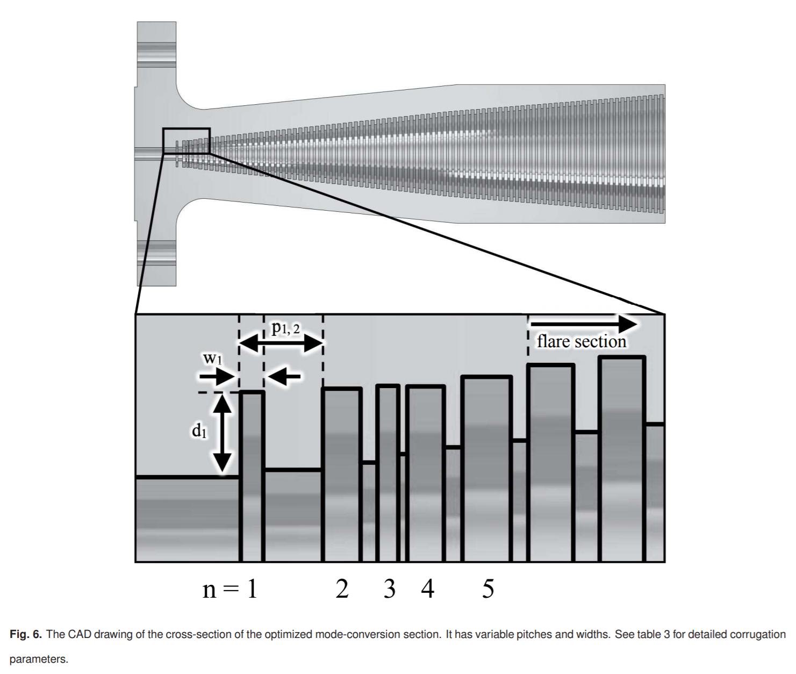

