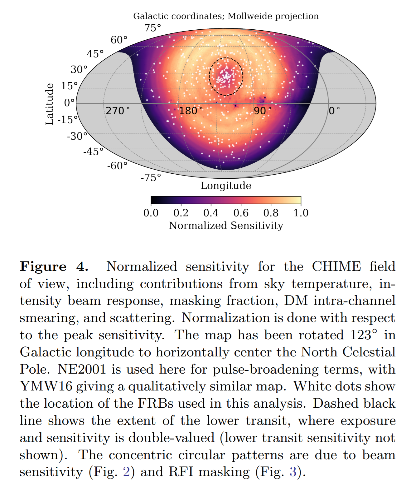
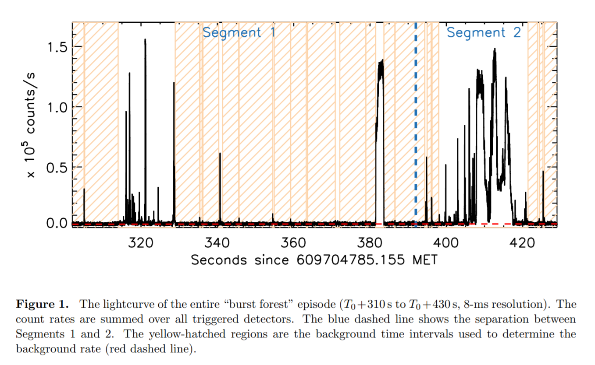

## 2021-06-01

1. [Binary comb models for FRB 121102](https://arxiv.org/abs/2105.14480)

   解释FRB 121102为一个相互作用的中子星双星系统，其轨道周期为159天。通过在轨道上引入一个偏心率来`develop a binary comb model`。

   

2. [Eclipsing White Dwarf Binaries in Gaia and the Zwicky Transient Facility](https://arxiv.org/abs/2105.14028)

   在ZTF DR3中，使用`Box Least Squares algorithm`在光变曲线的统计中找到18个新的双星，其中17个是食变双星。在Gaia的HR图上，发现这些白矮星的伴星大都是主序星。

## 2021-06-02

1. [Catalog of Long-Term Transient Sources in the First 10 Years of Fermi-LAT Data](https://arxiv.org/abs/2106.00100)

   Fermi Large Area Telescope （`LAT`）的第一个`long-term`的$\gamma-ray$暂现源目录（`1FLT`）。使用基于小波的目标检测算法对月度数据集进行了分析，为避免低银纬区域散射的影响，搜索只在高银纬处进行，所有$4\sigma$以上的目录都被列入了目录。

## 2021-06-03

1. [Testing whether a signal is strictly periodic. Application to disentangling planets and stellar activity in radial velocities](https://arxiv.org/abs/2106.01365)

   对时间序列中的周期性搜索通常依赖周期性信号模型，统计意义通过虚警概率或者贝叶斯系数评估。一个有统计意义的周期性模型可能并不是来自于周期性。`one expects transient signals that show periodicity for a certain amount of time before vanishing.`在径向速度数据中寻找行星就会遇到这种情况，由于恒星活动本应有稳定相位、频率和振幅的行星信号会变得不再稳定。这篇文章中探讨了使用周期函数乘时间窗口来诊断一个明显的周期性信号是否持续存在于时间序列中，并且有稳定的相位、振幅和周期。这些测试在周期图和贝叶斯框架中都有表述。

   文章中有周期图的计算公式，实现了非均匀采样的小波变换，之后可以研究一下。

## 2021-06-04

1. [A Comparative Study of Convolutional Neural Networks for the Detection of Strong Gravitational Lensing](https://arxiv.org/abs/2106.01754)

   使用CNN和`LEXACTUM`框架训练引力透镜检测器，以加速在LSST和SKA时代的图像处理效率。在空间和地面数据集上，每幅图像只要0.0061s和0.0594s。数据集位于[这里](http://metcalf1.difa.unibo.it/blf-portal/gg_challenge.html)，19个G，就是发布出来让大家训练模型的。

   

2. [PyAutoLens: Open-Source Strong Gravitational Lensing](https://arxiv.org/abs/2106.01384)

   `PyAutoLens`是用来做全自动的星系和星系团的强引力透镜建模的，支持直接成像和干涉仪数据。API可以实现光线追踪来建立强引力透镜样本通过使用`analytic light` 和`mass profiles`。示例脚本、数据集和HowToLens讲座开源在[这里](https://github.com/Jammy2211/autolens_workspace)。

   

3. [Morphological classification of galaxies with deep learning: comparing 3-way and 4-way CNNs](https://arxiv.org/abs/2106.01571)

   CNN对星系形态分类。分为三类：椭圆`elliptical`、透镜`lenticular`、螺旋`spiral`，或者分为四类：再加上不规则/杂色`irregular/miscellaneous`。下图中C2是文章中使用的CNN结构，在14034幅SDSS的图像上，这个架构在三类和四类的分类上都可以表现出不错的性能。如果做二元分类，椭圆和螺旋星系是最容易区分的，螺旋和不规则是最难区分的。

   

4. [Investigative Study on Preprint Journal Club as an Effective Method of Teaching Latest Knowledge in Astronomy](https://arxiv.org/abs/2106.01688)

   天文和物理发展迅速改写教科书，阅读预印本是了解这些领域最新知识的有效途径。这里是一项调查，了解影响Astro-ph/Astro-Coffee成功的因素。用问卷调查，发现是交流会成功的四个因素：承诺（组织者和参加者如何参与交流会）、环境（交流会如何有利和舒适地进行）、内容（交流会中讨论的主题和它们的呈现方式）以及目标（进行交流会的主要目标）。有一个总结视频，在[这里](https://www.youtube.com/watch?v=fzy2I_xA_dU)。

## 2021-06-07

1. [The dipper population of Taurus seen with K2](https://arxiv.org/abs/2106.02064)

   `Dippers are typically low-mass, pre-main-sequence stars that display dips in their light curves.`

   Dipper - 斗宿，是低质量的前主序星，光变曲线中有凹陷`dips`，被认为是盘中的`dusty warps`导致的。根据K2 C4和C13的光变曲线的形态，在金牛座恒星形成区挑选Dipper样本，使用周期图和小波分析研究周期性，并从光度测量中得到恒星参数。

   发现K2观测的盘星中，有30%是有`dipper`的，其中大约一半是周期性的，周期为几天。另外在金牛座的恒星样本中，观察到几个旋转周期内的`transient dipper`和周期变化的`dipper`。`Dips`的结构很复杂，在低至恒星旋转周期的尺度上强烈变化。

   尘埃结构的`angular extension`产生的`dips`与恒星周期相关。磁层吸积，导致吸积柱及其底部遮蔽恒星，可以解释大部分观察到的光曲线。尽管与该模型兼容，但许多恒星的倾角`inclination angles`是适中`moderate `的，并不排除`inner disk warp`以外的机制来解释`dipper`的光变曲线。

   

## 2021-06-08

1. [Modeling Dense Star Clusters in the Milky Way and Beyond with the Cluster Monte Carlo Code](https://arxiv.org/abs/2106.02643)

   一个并行的、`star-by-star`的N体模拟密集星团的蒙特卡洛模拟代码`CMC`，位于[这里](https://clustermontecarlo.github.io/)。`CMC`使用`Hénon`的方法处理碰撞问题。`star-by-star`的方法允许纳入额外的物理学，包括强引力三体和四体相遇、双体潮汐和引力波捕获、任意星系潮汐场中的质量损失，以及单星和双星的恒星演变。模拟最大的（N=108）`Plummer sphere`演化到核塌缩的N体模拟，再现了超过15个数量级的自相似密度分布。模拟球状星团，表明他们的动态演化可以产生大量的黑洞合并，质量大于孤立的双星演化产生的质量。

2. [The correct sense of Faraday rotation](https://arxiv.org/abs/2106.03074)

   从基本的等离子体理论出发，描述来自背景射电源的偏振通过此话、电离介质的传播，描述法拉第旋转。用图形来说明线偏振波分解为右/左圆偏振，这些偏振模式相位的时间和空间传播，以及由此产生的偏振方向的物理旋转。描述了一个既能法拉第旋转又能发射偏振辐射的介质的情况，并展示了螺旋形磁场如何构建或破坏法拉第旋转。
   
   

## 2021-06-09

1. [Exploiting the Gaia EDR3 photometry to derive stellar temperatures](https://arxiv.org/abs/2106.03882)

   使用600颗用`InfraRed Flux Method`方法，从去红化的颜色中得到过有效温度的矮星和巨星，校准Gaia EDR3的颜色-有效温度的转换。
   $$
   \frac{5040}{T_{eff}}=\theta = b_0+b_1C+b_2C^2+b_3[Fe/H]+b^4[Fe/H]+b_5[Fe/H]C
   $$
   使用颜色$C$和金属丰度$[Fe/H]$拟合一个多项式，拟合结果如下，得到有效温度，平均误差在$\pm50K$。

   

2. [How much water was delivered from the asteroid belt to the Earth after its formation?](https://arxiv.org/abs/2106.03999)

   地球上的总储水量（包括地幔中的水），有1-10个海洋。通过N体模拟，观察有多少水可以从小行星带运送到地球上。小行星是从与巨行星共振附近的不稳定区域运送过来的。其中$\nu_6$共振为地球提供了最多的小行星，该区域的小行星有2%与地球发生碰撞，最多可以有8个海洋的水送到地球上。位于与木星平均运动共振的小行星和外小行星带中的小行星与地球碰撞的概率可以忽略不计。

   地球的有效截面：
   $$
   A(R_{Earth})=\pi R^2_{Earth}\left(1+\frac{4GM_\oplus}{R_{Earth}v^2_{rel}}\right)
   $$
   其中$R_{Earth}=10R_\oplus$，$v_{rel}$是地球和小行星带的相对速度。

3. [The First CHIME/FRB Fast Radio Burst Catalog](https://arxiv.org/abs/2106.04352)

   CHIME/FRB项目从2018年7月25日到2019年7月1日之间， 在400-800MHz探测到535个FRB，其中有61个脉冲来自之前确认过的18个重复暴，也即目录中有474个非重复暴。重复暴和非重复暴的天空位置和DM分布一致，但是重复暴的脉冲宽度和光谱带宽和非重复暴不同。通过模拟注入脉冲事件校准选择效应，证明在600MHz处，本应占据整个群体很大一部分的，`Scatter`时间超过10ms的事件只有一小部分被CHIME探测到。`Fluence`的幂律分布指数$\alpha=-1.4$。`DM`大的事件对应大的$\alpha$， `DM`小的事件对应小的$\alpha$，当`DM`与距离相关时，这是自然的结果。在600MHz的5Jyms的天空事件率为$818\pm64/sky/day$。

   

4. [No Evidence for Galactic Latitude Dependence of the Fast Radio Burst Sky Distribution](https://arxiv.org/abs/2106.04353)

   考虑辐射计方程的情况下，选择高于指定灵敏度阈值的CHIME/FRB事件，使用AD和KS检查探测结果与累计事件加权曝光时间之间的关系，结果与零假设一致。使用贝叶斯，假设事件是抛硬币实验（有无探测到脉冲），结果与FRB来自各向同性的银河系外源的情况一致。

   辐射计方程`Radiometer Equation`：
   $$
   S_{min}\propto\frac{T_{sys}}{G\sqrt{\Delta\nu}}\frac{\sqrt{w_b}}{w_i}
   $$
   其中$G$是望远镜增益，$\Delta\nu$是观测带宽，$w_b$是`broadened pulse width`，$w_i$是`intrinsic pulse width`。下图是CHIME的视场中归一化的灵敏度。

   

5. [CHIME/FRB Catalog 1 results: statistical cross-correlations with large-scale structure](https://arxiv.org/abs/2106.04354)

   CHIME的FRB与`WISExSCOS`、`DESI-BGS`、`DESI-LRG`巡天的星系目录的`angular cross-correlations`。在三个巡天目录中，FRB与红移在$0.3\lesssim z\lesssim0.5$的星系之间存在统计显著相关性，并发现了FRB有大的宿主星系DM（$\sim400pc\ cm^{-3}$）的统计相关性。

   

6. [Fast Radio Burst Morphology in the First CHIME/FRB Catalog](https://arxiv.org/abs/2106.04356)

   CHIME/FRB的`Flux`随频率和时间的变化，观察到4种形态原型`simple broadband`、 `simple narrowband`、`temporally complex` 、和`downward drifting`。确认了重复暴宽度较大并且带宽较窄，可能是由于`beaming`、`propagation effects`或者`intrinsic to the populations`导致的。

   

7. [Detecting Pulsars with Neural Networks: A Proof of Concept](https://arxiv.org/abs/2106.04407)

   传统的脉冲星搜索要从射电望远镜的时间和频率数据中发现周期性信号，同时确定DM，并消除RFI，计算复杂。这里使用`CNN`的变种`Temporal Convolutional Networks`，实现有效的抑制RFI和仪器不稳定的影响，消除DM，发现周期性信号。在周期性搜索的时候，使用FFT和FFA来扩展整个流程，方法能够识别微弱的脉冲星，并保持较低的误报率。网络可以在普通消费级的GPU上实时运行预测信号中是否有脉冲星存在。代码位于[这里](https://github.com/larskuenkel/DeepPulsarNet)。

   

## 2021-06-10

1. [Searching for radio pulsation from SGR 1935+2154 with the Parkes Ultra-Wideband Low receiver](https://arxiv.org/abs/2106.04821)

   SGR1935+2154是银河系内的磁星，曾经发射过一次快速射电暴FRB20200428。文章使用Parkes望远镜的UWL接收机对这个源在704-4032MHz进行了1.6小时的观测，单脉冲搜索和周期性搜索都没有搜到可靠的信号。这使得对单脉冲全带宽的`Fluence`限制在35mJy ms，远低于FAST在前两年探测到的最亮的脉冲。这意味着SGR1935的射电暴或者带宽窄，或者`show a steep spectrum`。

## 2021-06-11

1. [Dynamical model of the Milky Way using APOGEE and Gaia data](https://arxiv.org/abs/2106.05286)

   使用`APOGEE`和`Gaia EDR3`的数据构建银河盘的动力学模型，整个银河中心半径在$5\le R\le19.5kpc$之间，使用`spherically-aligned Jeans Anisotropic Method`来建立恒星速度和速度弥散的模型，拟合到`kinematic maps`上。最佳拟合表明，暗物质晕的对数密度斜率为$\alpha_{DM}=-1.602\pm0.078_{syst}$，暗物质的密度是$\rho_{DM}=(8.92\pm0.56_{syst})\times10^{-3}M_\odot\ pc^{-3}$。（有机会可以试试下面图的配色）

   

2. [A Strange Star Scenario for the Formation of Eccentric Millisecond Pulsar PSR J1946+3417](https://arxiv.org/abs/2106.05717)

   `PSR J1946+3417`是一颗自转周期为3.17ms的毫秒脉冲星，位于轨道周期为27d的双星系统中，另一颗是白矮星。MSP和WD质量分别是$1.83M_\odot$和$0.266M_\odot$，偏心率0.134，挑战了MSP的`recycling model`。

   提出`phase transition`模型解释该系统起源。相变过程中，突然的质量损失和不对称塌缩引起的撞击会导致偏心率产生，如果相变发生在质量转移停止后，偏心轨道无法在哈勃时间内变回圆轨道。使用`MESA`模拟了这个双星系统的演化，发现初始质量为$1.4+1.6M_\odot$的中子星和主序星的双星系统在初始轨道周期为2.59天上，会演化为由$2M_\odot$的毫秒脉冲星和$0.27M_\odot$的白矮星的双星系统，轨道周期为21.5天。

## 2021-06-14

1. [lenstronomy II: A gravitational lensing software ecosystem](https://arxiv.org/abs/2106.05976)

   `lenstronomy`是astropy的模块，用于引力透镜模拟和分析。该软件最近广泛作为分析的一个组成部分，例如用延时强透镜测量哈勃常数，或从已解决和未解决的小尺度透镜失真统计中约束暗物质的性质。代码位于[这里](https://github.com/sibirrer/lenstronomy)。

2. [A FRB in a Globular Cluster: Why This Neutron Star is Different From (Almost) All Other Neutron Stars](https://arxiv.org/abs/2106.06066)

   大多数快速射电暴的模型是由相对常见的天体建立的，比如中子星、黑洞、超新星遗迹等。然而FRB相当罕见，并且在银河系内发现的大多数这些常见的天体并不产生FRB，这些天体要成为FRB源，可能需要极其罕见的条件。最近在`M81`的一个球状星团中发现的`FRB 20200120E`是一个重复暴，认为是一颗中子星和白矮星的双星系统。辐射机制可能是磁相互作用，而双中子星因此不会是长期重复的FRB源，可能产生的是非重复暴。

## 2021-06-15

1. [Strategies for Maximizing Detection Rate in Radio SETI](https://arxiv.org/abs/2106.06594)

   最大化SETI搜索效率的策略，

   - 使用低于1GHz的频率探测以获得更大的视场，而不是专注于1-10GHz的地面射电窗口
   - 小的射电望远镜阵列而不是同等面积的单镜
   - ` Aperture arrays `

## 2021-06-16

1. [The Inclination Correction to The Turbulence Structure Function of Thin Molecular Clouds and Its Application](https://arxiv.org/abs/2106.07850)

   湍流的`energy cascade rate`可以用结构函数来测量。分子云难以测量到径向速度，无法计算结构函数。如果沿着视线方向分子云是薄的，结构函数$S_{tt}^2$可以用CVD来描述$CVD^2=1/2S_{tt}^2$。这种方法被扩展到薄分子云不垂直于视线的情况，夹角为$\theta$，此时
   $$
   CVD^2=\frac12S_{tt}^2\left(1-\frac18cos^2\theta\right)R^{2/3}
   $$
   其中$R$可以用第二类椭圆积分表示：$R=2\pi E(cos\theta, \pi/2)$。这是钱老师最近发表在天文学报上的中文文章。

## 2021-06-17

1. [FAST Globular Cluster Pulsar Survey: Twenty-Four Pulsars Discovered in Fifteen Globular Clusters](https://arxiv.org/abs/2106.08559)

   潘之辰的文章，报道使用FAST在15个球状星团中发现的24颗脉冲星。

## 2021-06-18

1. [Fast Afterglows of Fast Radio Bursts](https://arxiv.org/abs/2106.09540)

   `Main` FRB事件可能会留下一个有高自由能的相对论性等离子团块。当等离子体经历`collisionless relaxation`时，会发射相干电磁波。这些电磁波可以作为快速射电余辉`fast radio afterglow`被观测到，其频率和强度不断降低。与会的峰值频率随时间的推移而减少，$\nu\propto t^{-3/2}$。

   

2. [The host galaxy and persistent radio counterpart of FRB 20201124A](https://arxiv.org/abs/2106.09710)

   到目前为止，有16个FRB的宿主星系被定位。这些星系的质量和恒星形成率之间有三个数量级的差别，意味着一个`ubiquitously occurring progenitor object`。这篇文章是使用VLA（`Very Large Array`）和VLBA（`Very Long Baseline Array`）对FRB20201124A进行定位，并将其与星系`SDSS J050803.48+260338.0`，红移z=0.098和持续射电源`persistent radio source`联系起来。

   这个星系质量很大，$3\times10^{10}M_\odot$，正在形成恒星（每年几个太阳质量），并且尘埃很多。VLA和VLBA测量的这个PRS亮度为$1.2\times 10^{29}\ erg\ s^{-1}Hz^{-1}$，延展尺度$\gtrsim50mas$。这个星系的质量比之前重复FRB的宿主星系要大一个数量级，但是和非重复FRB的宿主星系相当，认为是两种FRB之间的联系。

3. [A Neutron Star is born](https://arxiv.org/abs/2106.09515)

   `A neutron star was first detected as a pulsar in 1967. `2017年检测到的引力波GW170817，确定为来自NGC4993的两颗中子星的合并，距离我们1.4亿光年。这一事件在$\gamma$射线、X射线、紫外线、红外线、射电波段和光学波段都被探测到，开启了多信使天文学的新时代。为了理解和描述中子星，需要一个满足大体核物质特性的适当的`状态方程`，GW170817给出了额外的约束。磁星（$10^{15}G$）相比于脉冲星（$10^{12}G$）有更强的磁场。

   这篇文章概述了中子星的历史和核模型的发展，并说明对核物理的微观世界的描述如何帮助理解宇宙。

## 2021-06-21

1. [Impact of Image Persistence in the Roman Space Telescope High-Latitude Survey](https://arxiv.org/abs/2106.10273)

   `Nancy Grace Roman Space Telescope`，南希-格雷斯-罗曼太空望远镜是NASA计划发射的红外太空望远镜，意在解开暗能量和暗物质的秘密、搜索和成像系外行星，并探索红外天体物理学的许多主题。罗马太空望远镜有一个 2.4m 望远镜，与哈勃望远镜的尺寸相同，但其视野是哈勃望远镜的 100 倍。

   `High Latitude Survey`是这个望远镜的一个巡天计划，预计将测量2220平方度的数以亿计的星系的位置和形状。这个巡天将提供高质量的弱引力透镜数据。

## 2021-06-22

1. [Precautionary Planetary Defence](https://arxiv.org/abs/2106.11241)

   新发现的小行星对地球有很高的撞击概率的假设情况下，是否对其进行偏转`deflections`已经进行了大量的决策分析（`SMPAG Ad-Hoc Working Group on Legal Issues 2020`）。这里讨论了另外两个复杂的问题：

   - 由人类造成的地球撞击的风险
   - 积极管理小行星，将其置于安全港`safe harbours`，即使撞击风险低于`decision to act`的阈值。

## 2021-06-23

1. [Exploring nine simultaneously occurring transients on April 12th 1950](https://arxiv.org/abs/2106.11780)

   在1950年4月，Palomar Sky Survey `historic `的一块红外感光板上，在半小时内出现了九个点源，范围在10角分以内，而这9个点源在之前或者之后的图像中都没有出现。现在使用10.4米的Gran Telescopio Canarias `GTC`极限星等为$r\sim26\,mag$的CCD也没有探测到。

   这一块底片上暂现源的事件率远远高于已知暂现源光学对应体的探测率，包括闪烁的矮星`flaring dwarf stars`、FRB、GRB或者微引力透镜。一种可能的解释是未知类型的污染产生不同强度的点源，并在半径为10角分的范围内产生了某种集中机制`some mechanism of concentration`。另一种可能性是来自地球同步轨道附近的物体的快速`t<0.5s`的太阳反射。确认后一种情况`latter scenario`的途径是，从别的底片中寻找多个暂现源后随一条线的图像。

   

## 2021-06-24

1. [The Heraklion Extragalactic Catalogue (HECATE): a value-added galaxy catalogue for multi-messenger astrophysics](https://arxiv.org/abs/2106.12101)

   伊拉克利翁河外星系目录`HECATE`，是一个全天的星系目录，促进对本地宇宙的多波段和多信使研究。包含204733个星系，红移为0.047（D<200 Mpc），在0-170 Mpc范围内的B波段的完整性大于50%。该目录提供了位置、大小、距离、形态分类、恒星形成率、恒星质量、金属度和核活动分类。这些丰富的信息可以实现广泛的应用，例如：银河系外源的人口学研究、瞬态事件的初始特征、搜索引力波事件的电磁对应物。

2. [Chronicling the Host Galaxy Properties of the Remarkable Repeating FRB 20201124A](https://arxiv.org/abs/2106.11993)

   使用ASKAP对FRB20201124A的宿主星系进行定位，红移为$z=0.0979\pm0.0001$，恒星形成率$2.1M_\odot yr^{-1}$，金属丰度$12+\log(O/H)\approx9.0$，恒星质量为$2\times10^{10}M_\odot$，尘埃消光为$1-1.5mag$，年龄为$5-6Gyr$。

   

## 2021-06-25

1. [Combining Astrometry and Elemental Abundances: The Case of the Candidate Pre-Gaia Halo Moving Groups G03-37, G18-39, and G21-22](https://arxiv.org/abs/2106.12734)

   虽然大多数`Moving Groups`都是年轻的和附近的，但在银晕中也有发现。了解这些星团的起源和演化是重建银晕形成历史的一个重要部分。三个银晕星团：G03-37、G18-39和G21-22。根据Gaia EDR3的数据，恒星的速度和运动空间积分显示出分散性。新的Python代码使用贝叶斯方法在计算单个丰度和光谱综合时自洽地传播来自恒星大气解决方案的不确定性，得出了每颗恒星的α-（镁、硅、钙、钛）、Fe-峰（铬、Sc、锰、铁、镍）、奇-Z（钠、铝、V）和中子俘获（钡、铕）元素的丰度。发现G21-22恒星在化学上并不均匀。

## 2021-06-28

1. [Implications of a search for intergalactic civilizations on prior estimates of human survival and travel speed](https://arxiv.org/abs/2106.13348)
   $$
   \begin{aligned}
   P(\gamma,q, v | t_0, n=0) &=\frac{p_{\gamma,q,v}(n=0)  P(\gamma,q, v | t_0)}{\int \int \int p_{\gamma',q',v'}(n=0)  P(\gamma', q',v' | t_0) \, d \gamma' \, d q' \, dv'} \\
   & = \frac{s(t_0) \, e^{- q \gamma s(t_0) ( v^3 + frac (1- v^3))} \, P(q) \, P(v)}{\int \int \frac{ (e^{- q \gamma_{min} s(t_0) ( v^3 + frac (1- v^3))} - e^{- q \gamma_{max} s(t_0) ( v^3 + frac (1- v^3))}  ) \, P(q') \,P(v')}{ q' \,  (  v'^3 + frac (1- v'^3) ) } dq' dv'}
   \end{aligned}
   $$
   一个模型：一定比例的地外文明随着时间的推移均匀的扩展到宇宙学规模。结合自我暗示假设（Self Indication Assumption，`SIA`）的`anthropics `方法，估计如果在巡天中发现零、一或者更多这样的文明，可以推断出什么。结果SIA对 - 像我们这样的文明存活下来并开始扩张的机会，- 扩张的最大可行速度，给出了悲观的估计。

   

## 2021-06-29

1. [Fermi-GBM Observations of the SGR J1935+2154 Burst Forest](https://arxiv.org/abs/2106.14172)

   2020年4-5月，SGR J1935+2154发出了数百次短爆，成为最`prolific transient`的磁星之一。费米/伽马射线暴监测仪观测到了一个130秒的暴发`forest`，其中包括一些具有特殊时间曲线的暴发。介绍了对这个事件的时间分辨光谱分析结果。在整个130秒的事件中普遍存在的热光谱成分。

   

2. [The eROSITA Final Equatorial-Depth Survey (eFEDS): The Catalog of Galaxy Clusters and Groups](https://arxiv.org/abs/2106.14518)

   ` SRG/eROSITA telescope`的`eFEDS`（巡天项目），提供一个星系团和星系群的样本，数据发布在[这里](https://erosita.mpe.mpg.de/edr/eROSITAObservations/Catalogues/)。证实了eROSITA在星团科学方面的出色表现，并预期最终的全天空调查不会与发射前的预期有重大偏差。

## 2021-06-30

1. [Fast Radio Bursts as crustal dynamical events induced by magnetic field evolution in young magnetars](https://arxiv.org/abs/2106.15030)

   `Revisit `一个重复快速射电暴模型，磁场动力学影响磁星地壳释放能量。这篇文章通过解决传播问题，来满足这种模型的基本需求，并对磁层中所谓的`电荷匮乏`区域的能量和电荷束的辐射进行量化。

2. [Observation of gravitational waves from two neutron star-black hole coalescences](https://arxiv.org/abs/2106.15163)

   LIGO探测到中子星-黑洞合并的引力波，`GW200105_162426`和`GW200115_042309`。前者的前身星质量分别是$8.9^{+1.2}_{-1.5}M_\odot$、$1.9^{+0.3}_{-0.2}M_\odot$，后者是$5.7^{+1.8}_{-2.1}M_\odot$、$1.5^{+0.7}_{-0.3}M_\odot$，质量小的天体低于中子星最大质量的概率分别是89-96%和87-98%。

