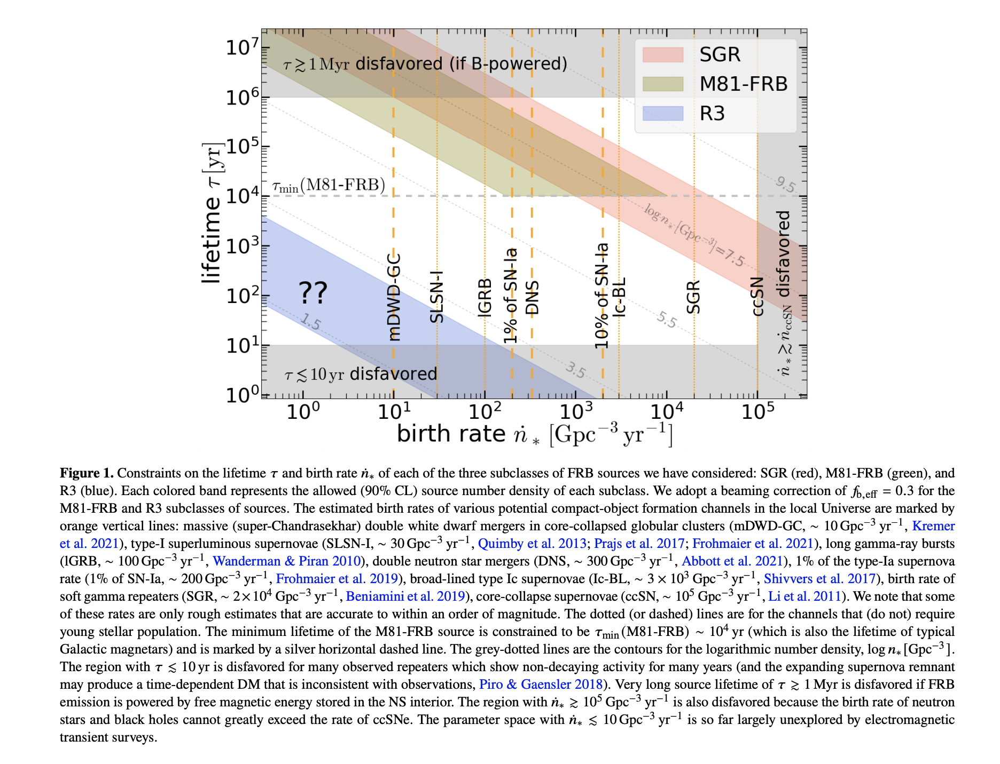
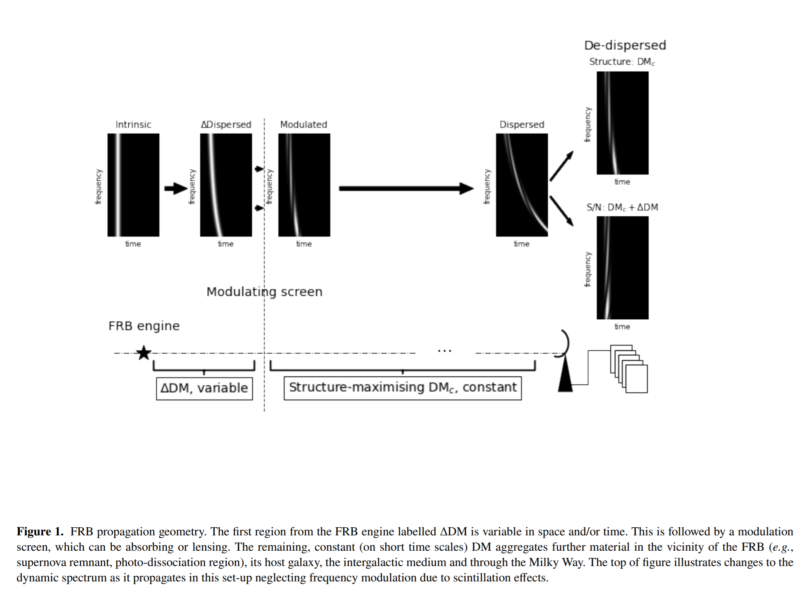

## 2021-07-01

1. [A comparison of Galactic electron density models using PyGEDM](https://arxiv.org/abs/2106.15816)

   银河系电子密度分布模型`Galactic electron density distribution models, GEDM`，是估算电离星际介质对射电脉冲星和快速射电暴的脉冲影响的重要工具。目前流行的两个模型`YMW16`和`NE2001`，两个模型有较大差异，YMW16预测反银心和低纬度地区的DM值较高，NE2001在其他方向的DM值较高。未来确定脉冲星距离应该集中在模型显示出巨大差异的目标上，因此未来的模型可以使用这些测量结果来更好地估计距离。在未来的GEDMs中，银晕应该被视为一个组成部分，以避免高估银河系外源（如FRBs）的银河系DM贡献。

## 2021-07-02

1. [Morphological classification of compact and extended radio galaxies using convolutional neural networks and data augmentation techniques](https://arxiv.org/abs/2107.00385)

   使用CNN对`Faint Images of the Radio Sky at Twenty Centimeters，FIRST`中的射电星系进行分类：`Fanaroff-Riley, FRI`、`Fanaroff-Riley II, FRII`、`Bent-Tailed, BENT`、`Compact, COMPT`。最佳增强策略是旋转、水平或垂直翻转和增加亮度。平移、缩放和降低亮度会使模型的性能弱化。

   

## 2021-07-05

1. [Towards Machine Learning-Based Meta-Studies: Applications to Cosmological Parameters](https://arxiv.org/abs/2107.00665)

   使用`Bi-LSTM`从`ArXiv`种248,000篇天体物理学相关文章种提取测量值，产生了有超过231,000个天体物理学测量值的数据库。在线界面在[这里](http://numericalatlas.cs.ucl.ac.uk/)。以下是哈勃常数的例子，可以看到过去20年间宇宙学的发展。

   

## 2021-07-06

1. [Non-detection of water-ice grains in the coma of comet 46P/Wirtanen and implications for hyperactivity](https://arxiv.org/abs/2107.01255)

   `46P/Wirtanen`和`103P/Hartley 2` 非常活跃，这样的彗星有很高的产水率，推断出的升华面积与彗核表面积相当。根据`Deep Impact spacecraft`对103P的观测，活跃性似乎是由水冰粒射入彗星，增加了升华的表面积，提高了产水率。2018年46P接近地球，下图是其近红外光谱。

   
   
   没有发现`1.5`或者`2.0`或者`3.0`微米的水冰吸收带。彗星核的超活跃性和光谱中缺乏水冰吸收特征，可以由大小为1微米的`冰粒`和少量的低反照率`尘埃`，或者包含大量大块水冰来解释。

## 2021-07-07

1. [Cleaning foregrounds from single-dish 21cm intensity maps with Kernel Principal Component Analysis](https://arxiv.org/abs/2107.02267)

   使用`Kernel PCA`分离前景辐射和21cm辐射。代码在[这里](https://github.com/philbull/FastBox)。

## 2021-07-08

1. [Latest results of ultra-high-energy cosmic ray measurements with prototypes of the Fluorescence detector Array of Single-pixel Telescopes (FAST)](https://arxiv.org/abs/2107.02949)

   超高能宇宙射线`ultra-high-energy cosmic rays, UHECRs `的起源和性质仍然是天体粒子物理学的一个未决问题。单像素望远镜荧光探测器阵列`Fluorescence detector Array of Single-pixel Telescopes, FAST`，是下一代地面`UHECRs`观测站，旨在通过部署大型低成本荧光探测器阵列来覆盖大天区。完整规模的`FAST`由四个20厘米的光电倍增管`photomultiplier tubes`组成，位于直径1.6米的分段镜的焦点上。文章介绍了FAST的最新成果，包括望远镜校准、大气监测、正在进行的电子设备升级、复杂的重建方法的开发以及UHECR的探测。

   

## 2021-07-09

1. [A Polarization Pipeline for Fast Radio Bursts Detected by CHIME/FRB](https://arxiv.org/abs/2107.03491)

   介绍CHIME/FRB搜索`RM`的流程。三种方法，包括：`RM-synthesis`、`QU-fitting`和`Coherent de-rotation`。前者容易受到仪器效应的系统误差影响，后者能在保留相位信息的数据中修正通道内的消偏。方法应用到FRB 20200917A，测量出RM为$-1294.47\ rad\ m^{-2}$，迄今为止第二大RM。

   对于`RM-synthesis`：
   $$
   \mathcal{F}(\phi)=\int_{-\infty}^{+\infty}P(\lambda^2)e^{-2i\phi\lambda^2}d\lambda^2
   $$
   其中$\phi$是`Faraday depth`，是RM的延伸。$|\mathcal F(\phi)|$是`de-rotating`后的总线偏振强度，$P(\lambda^2)=Q(\lambda^2)+iU(\lambda^2)$。

   对于`QU-fitting`：
   $$
   P_i(d_i|RM, \psi_0)=\frac{1}{\pi\sigma_{Q_i}\sigma_{U_i}}\exp\left(-\frac{(Q_i-Q_{mod,i})^2}{2\sigma_{Q_i}}+\frac{(U_i-U_{mod,i})^2}{2\sigma_{U_i}}\right)
   $$
   其中$\sigma_{Q,U}$是`single channel RMS`，$\psi_0$是无穷频率处的偏振角`polarization angle`，$p$是线偏振度。在这个模型中，V假设为0，I使用`fifth order polynomial`来拟合并作为输入$I_{mod}$。此时：
   $$
   Q_{mod}=I_{mod}p\ cos(\alpha)\qquad U_{mod}=I_{mod}p\ sin(\alpha)
   $$
   其中$\alpha=2(RM\lambda^2+\psi_0)$。对于N个频率通道：
   $$
   P(d|RM,\psi_0)=\prod_{n=1}^NP_i(d_i|RM,\psi_0)
   $$
   对于`Coherent de-rotation`：

   在RM很大的情况下，偏振角可以在一个频率通道中变化：
   $$
   \delta\psi=\frac{-2RM_{obs}c^2\delta\nu}{\nu_c^3}
   $$
   其中$\delta\psi$是频率通道内的法拉第旋转角，$\delta\nu$是带宽，$\nu_c$是这个通道的中心频率。如果$|RM|$或者$\delta\nu$很大，在每个频率通道内会消偏，消偏度为：
   $$
   f_{depol}=1-\left(\frac{sin(\delta\psi)}{\delta\psi}\right)
   $$
   在CHIME的400-800MHz的频段，$\delta\nu=390kHz$。在$\nu_c=600MHz$处，当$RM\approx5000rad\,m^2$时，灵敏度下降50%。

   `coherently correcting for Faraday rotation`使用了一个频率依赖的相位因子到圆偏振上：
   $$
   |R'\rangle=e^{-i\beta}|R\rangle\qquad |L'\rangle=e^{i\beta}|L\rangle
   $$
   其中$\beta=RMc^2/\nu^2$。

   另外，当有Stokes U-V泄漏时，`QU-fitting`要引入一个额外的参数$\tau$：
   $$
   \begin{aligned}
   Q_{mod}'&=Q_{mod}\\
   U_{mod}'&=U_{mod}\ cos(2\pi\nu\tau)-V_{mod}\ sin(2\pi\nu\tau)\\
   V_{mod}'&=U_{mod}\ sin(2\pi\nu\tau)+V_{mod}\ cos(2\pi\nu\tau)
   \end{aligned}
   $$

2. [Periodicity Search on X-ray Bursts of SGR J1935+2154 Using 8.5-year Fermi/GBM Data](https://arxiv.org/abs/2107.03800)

   使用`Fermi/GBM`从2013年1月至2021年7月对`SGR1935+2154`的X射线暴的253个爆发进行周期搜索。使用LSP，发现有`237天`的周期，占空比约为`58.6%`。

   

3. [Science with SKA](https://arxiv.org/abs/2107.03915)

   介绍SKA的科学目标，以及目前已经完成的关于其先导（MeerKAT, ASKAP）和探路者（LOFAR, NenuFAR）的科学工作，重点介绍预期的突破。

   包括`Cosmology and galaxies`，其中有` Dark sector and new physics`、`Continuum and HI survey`

   `Reionization`

   `Pulsars, Cosmic magnetism`，其中有`Pulsars and gravitational waves`、`Fast Radio Bursts`、`Magnetic Fields`

   ` Craddle for life`

## 2021-07-12

1. [Implications of a rapidly varying FRB in a globular cluster of M81](https://arxiv.org/abs/2107.04059)

   FRB与球状星团（或其他古老的恒星系统）的联系表明，强磁化中子星（也就是最可能产生这些脉冲的天体）不仅是在大质量恒星塌缩时诞生的，也是由古老的白矮星合并而成的。

   `M81-FRB`的活动时间在$10^4\sim10^6$年之间，射电爆发的能量学将磁场强度的下限设定为$10^{13}\ G$，自转周期>0.2秒，从而排除了毫秒级脉冲星的可能性。

   持续的X射线亮度的上限，加上高的FRB亮度和频繁的重复，严重制约了M81-FRB是银河系脉冲星的巨大脉冲的放大版的可能性。

   FRB光变曲线的50 ns变化表明，发射是在中子星磁层内的一个紧凑区域产生的，因为当发射的距离$>10^{10}\ cm$时，无法说明问题。

   

## 2021-07-13

1. [The Parkes pulsar timing array second data release: Timing analysis](https://arxiv.org/abs/2107.04609)

   脉冲星计时阵可以用来探测频率为`nHz`的引力波，计时观测对脉冲星和地球之间的距离变化敏感，能够精确测量脉冲星的`位置`、`距离`和`速度`，以及`轨道形状`。

   

   文章通过对`PPTA`的25颗脉冲星进行了`Timing`分析，时间长达24年。在4个脉冲星中发现了`Shapiro Delay`，`PSRs J1017-7156`、``J1125-6014`、`J1545-4550`和`J1732-5049`。PSR J1125-6014的大夏皮罗延迟给出质量为$M_p=1.5\pm0.2M_\odot$。

## 2021-07-14

1. [Comprehensive analysis of a dense sample of FRB 121102 bursts](https://arxiv.org/abs/2107.05658)

   使用Arecibo的1.4Ghz在`3个小时`内探测到`FRB121102`的`133`个脉冲。Wating time的分布更接近LogNormal，峰值从207s降到75s，认为不符合泊松过程或者Weibull分布。累计能量分布是断幂函数，低能和高能的斜率分别是`-0.4`和`-1.8`，断点为$2.3\times10^{37}erg$。

   

2. [Localizing FRBs through VLBI with the Algonquin Radio Observatory 10-m Telescope](https://arxiv.org/abs/2107.05659)

   CHIME/FRB的FRB探测出发VLBI定位解决非重复暴的定位问题。使用在`Algonquin Radio Observatory located in Ontario Canada`的一个10米射电望远镜，开发了一个实验VLBI平台，理论精度为`<30 masec`。使用Crab脉冲星验证了定位程序，并分析了各站点之间的时钟稳定性，发现以目前系统的性能，50 masec的定位是可能的。两个站点之间的电离层贡献必须测量到$1e^{-8} pc/cc$的精度，才能从400-800MHz频段的探测中提供合理的定位。

   

## 2021-07-15

1. [Probabilistic distribution functions](https://arxiv.org/abs/2107.06298)

   考虑分布函数是一个随机变量来建模星团。

## 2021-07-16

1. [Planetary Migration](https://arxiv.org/abs/2107.07269)

   是[ExoFrontiers: Big questions in exoplanetary science](https://iopscience.iop.org/bookListInfo/aas-iop-astronomy)这本书的一章。早期研究中，使用简单的`disc models`发现低质量行星的迁移非常快。后来的研究中，在`disc models`中考虑了更多物理，认为迁移的过程可能停止或逆转。在巨行星与行星盘有`非线性相互作用`的情况下，行星迁移应该更慢，并与行星盘的演化有联系。

   

2. [Strategies and Advice for the Search for Extraterrestrial Intelligence](https://arxiv.org/abs/2107.07283)

   回顾了`SETI`的搜索策略，覆盖了主动/被动搜索、模糊/决定性的技术特征、存档数据/专用搜索、交流信号/人工产物、活跃/废弃技术、搜索信标与窃听、以及基于模型/异常的搜索。

   > I cover `passive versus active` searches, `ambiguous versus dispositive` kinds of technosignatures, `commensal or archival searches versus dedicated` ones, c`ommunicative signals versus "artifacts"`, "`active" versus derelict technologies`, searches for `beacons versus eavesdropping`, and `model-based versus anomaly-based` searches.

   

3. [System parameters of three short period cataclysmic variable stars](https://arxiv.org/abs/2107.07400)

   使用`ULTRACAM`对三颗新的短周期灾变变星的光度测量，从光变曲线中提取`component stars`的轨道、质量和半径。发现质量分别为$0.06\pm0.008M_\odot$、$0.042\pm0.001M_\odot$、$0.042\pm0.004M_\odot$，后两者是低质量的亚恒星、前者在氢燃烧极限的$2\sigma$内。所有这三个新系统都接近[Knigge et al. (2011)](http://dx.doi.org/10.1088/0067-0049/194/2/28)的修改后的 "最佳 "模型演化序列。

   

4. [A Fast and Precise Analytic Method of Calculating Galaxy Two-point Correlation Functions](https://arxiv.org/abs/2107.06918)

   一种新的分析方法来有效和准确地计算`星系两点相关函数`（two-point correlation functions，`TPCFs`）。这种方法适用于矩形、立方体、圆形或球形的区域。$\widehat{RR}(r)$是`normalized random-random pair counts `，$\widehat{DR}(r)$是`normalized data-random pair counts`。前者的计算方式：
   $$
   \begin{align}
     &\widehat{RR}_{\rm rect}(r) = \frac{2\pi}{ab} r \left(1 - \frac{2(a+b)}{\pi a b}r + \frac{1}{\pi a b} r^2 \right),\\
     &\widehat{RR}_{\rm cuboid}(r) = \frac{4\pi}{abc} r^2 \left(1 - \frac{ab + ac + bc}{2 a b c}r + 
     \frac{2}{3 \pi} \frac{a + b + c}{a b c} r^2 - \frac{1}{4\pi a b c} r^3 \right),\\
     &\widehat{RR}_{\rm circ}(r) = 2 r \left(1 - \frac{2}{\pi} r + \frac{1}{12\pi} r^3 + \frac{1}{320 \pi} r^{5} + O(r^7) \right),\\
     &\widehat{RR}_{\rm sph}(r) = 3 r^2 \left(1 - \frac{3}{4} r + \frac{1}{16} r^3 \right).
   \end{align}
   $$
   后者球形的计算方式：

   

5. [The Gaia Successor in 2021](https://arxiv.org/abs/2107.07177)

   `Gaia`任务之后20年，天体测量性能接近的新任务会对天文学产生重要的影响。20年的时间差可以测量到天体`更为精确的运动`，加入`红外观测`的能力，可以看到银河系的遮蔽区域，测量`100-120亿`个新天体。欧空局把这项任务安排在了非常优先的位置，可能在2045年发射。

6. [Cataclysmic Variables in the Second Year of the Zwicky Transient Facility](https://arxiv.org/abs/2107.07051)

   使用` GROWTH Marshal`中基于颜色、星等和时间尺度的过滤器，将ZTF中的`372个`天体确定为`灾变变星`。其中93个是以前确认过的，279个是新的候选体。Gaia EDR3中有其中154个天体的`视差`，距离范围在$108-2096pc$。

7. [Astrometric accuracy of snapshot Fast Radio Burst localisations with ASKAP](https://arxiv.org/abs/2107.07068)

   定位良好的快速射电暴（FRB）促进了对`FRB宿主星系的性质`、`源周环境介质`以及这些`环境对射电暴潜在影响`的深入研究。澳大利亚平方公里阵列探路者`ASKAP`已经以`sub-arcsecond to arcsecond`的精度对11个FRB进行了定位。

   这篇文章使用ASKAP低频和中频频段的明亮射电源来研究，使用 `CRAFT`的`snapshot`技术获得的天体位置的测量精度。发现在低频和中频数据中，两帧之间的偏移量分别为0.6和0.3角秒，包括RA和Dec。

   

## 2021-07-19

1. [SETI in 2020](https://arxiv.org/abs/2107.07512)

   总结在2020年发表的`74篇`关于SETI的论文和书籍，分为六大类：`实际搜索的结果`、`新的搜索方法和仪器`、`目标和频率选择`、`技术特征的发展`、`ETI的理论`以及`SETI的社会方面`。

2. [Unexplained Spectral Phenomena in the Interstellar Medium: an introduction](https://arxiv.org/abs/2107.07571)

   星际介质中有一些光谱，经过几十年的观测仍未得到确认。弥散的星际带`diffuse interstellar bands`、220nm的特征`220 nm feature`、不明的红外发射带`unidentified infrared emission bands`、扩展的红色发射`extended red emissions`、以及21和30微米的发射特征`21 and 30 μm emission features`，在各种天体物理环境中都能看到。这些辐射的强度表明，它们来自于由普通元素组成的化合物，可能是有机的。

## 2021-07-20

1. [Unveiling the star formation history of the Upper Scorpius association through its kinematics](https://arxiv.org/abs/2107.08057)

   使用`Gaia+GALAH和APOGEE`的数据， 经过5维参数空间的筛选，得到天蝎座星协恒星的六维速度数据。天蝎座的恒星形成已经持续了10Myr以上，其中的小星团在几百万年后溶解在老星团中，但在一段时间内保留了它们最初的结构。文章假设恒星之间的相互作用可以忽略，线性往前往后推恒星位置，用等龄线拟合恒星年龄，说是可以为量化气体清除的时间尺度提供一个强有力的工具。`

2. [Sub-second periodicity in a fast radio burst](https://arxiv.org/abs/2107.08463)

   CHIME探测到三个复杂结构非重复暴，看到其中有`类周期结构`，周期分别是`216.8ms`、`2.8ms`和`10.7ms`。认为这样的短周期性暗示`中子星起源`，并且有利于产生于`中子星磁层`的发射，而不是位于离星体更远的发射区域。

   

3. [A bimodal burst energy distribution of a repeating fast radio burst source](https://arxiv.org/abs/2107.08205)

   李老师的FRB121102的文章。

## 2021-07-21

1. [Structure of Open Clusters -- Gaia DR2 and its limitations](https://arxiv.org/abs/2107.07230)

   研究星团的物理参数（`距离`、`红化`、`年龄`、`金属丰度`）和`运动学`需要非常精确的观测数据。反过来，这些数据可以让我们深入了解银河系的特性，例如追踪`银河系的螺旋结构`、`恒星形成率`和`金属丰度梯度`。

   文章研究了现有的Gaia DR2目录中的1229个开放星团的距离、大小和三维空间中的恒星分布。结果显示，在`2kpc`以内，`视差倒数`方法给出的结果与贝叶斯方法接近（`Bayesian approach based on the exponentially decreasing volume density prior`）。

   

   

   这两种方法都显示了星团的视线伸长率（由视差不确定性导致的针状形状）对距离的依赖性。当使用任何提到的视差与距离的标准转换时，在500pc以上，无法正确的研究一个开放星团的三维结构。

2. [On the use of CHIME to Detect Long-Duration Radio Transients from Neutron Star Mergers](https://arxiv.org/abs/2107.09475)

   短伽马射线暴`SGRB, GRB170817A`发现与双中子星`BNS`合并有关，但是并不清楚`SGRB`都来自`BNS`合并，也不确定`BNS`合并在什么情况下产生`SGRB`。但是既然有关系，通过探测`SGRB`的余晖或许可以探测`BNS`合并，作为`GW`的替代方法。

   文章考虑了一个在CHIME上的复杂的`SGRB`余晖探测方法，估计每年可以探测到751个余辉，其中96%的余辉是离轴的。

3. [Absence of bursts between 4-8 GHz from FRB20200120E located in an M81 Globular Cluster](https://arxiv.org/abs/2107.09445)

   使用`Robert C. Byrd Green Bank Telescope`在`4-8GHz`探测`FRB20200220E`，在2.5个小时内并没有观测到爆发。流量限制比`600MHz`和`1400MHz`低几倍。认为未探测的原因是`高频脉冲弱`、`闪烁调制`、`不在活动窗口`。

## 2021-07-22

1. [Fast radio bursts at the dawn of the 2020s](https://arxiv.org/abs/2107.10113)

   2007年发现第一个快速射电暴（FRB），2013年确认其系外起源并且非常多。在2019年关于FRB的评论中，提出了一个不断增长但仍然神秘的FRB群体 - `60个独特的源`，`2个重复的FRB`，以及`只有一个确定的宿主星系`。在短短几年内，新的观测和发现使FRB的总数超过了600个，24个重复源和14个宿主星系。`更高的时间分辨率`、`持续的观测`和`更好的定位`，使我们对`重复暴`、`宿主星系`、`爆发形态`、`源活跃性`、`模型`以及`FRB作为宇宙学探针`的用途有了深入了解。最近从银河系磁星SGR 1935+2154探测到一个明亮的类似FRB的爆发，为FRB和磁星之间提供了一个重要的联系。也不断有令人惊讶的发现，比如来自重复暴的`周期性`活动，以及将一个FRB源定位在与M81星系相关的相对较近的球状星团。

2. [ZTF J185139.81+171430.3 = ZTF18abnbzvx: the second white dwarf pulsar?](https://arxiv.org/abs/2107.09913)

   在ZTF的公开数据中发现了一短周期`12.37 min`大光变`0.8 mag`的天体，这样的一个类似的已知天体是`unique white dwarf pulsar AR Sco`。

3. [An Arecibo Search for Fast Radio Transients from M87](https://arxiv.org/abs/2107.09687)

   在2019年使用AO对M87的中心进行了10小时的L波段`1.15-1.75GHz`观测。使用匹配滤波，DM搜索到了$5500pc\ cm^{-3}$，没找到$7\sigma$以上的`0.3-123ms`之间的单脉冲，这样将M87的爆发率限制在$0.1/hr>1.4Jy\ ms/hr$，这是迄今为止获得的最严格的上限。

## 2021-07-23

1. [Repeating gas ejection events from comet 45P/Honda-Mrkos-Pajdušáková](https://arxiv.org/abs/2107.10351)

   研究从木星家族彗星（`Jupiter-family comets, JFCs`）释放出来的物质，即再彗星接近太阳时形成的气体和尘埃的包层，可以提高对其起源和演化的理解。在2017年2月接近地球期间，对`45P/Honda-Mrkos-Pajdušáková`彗星进行了观测。 

   在2月16日和17日观测到不同方向的挥发性物质，间隔时间$7.6\pm0.1$​小时，与AO测量的旋转周期一致。

## 2021-07-26

1. [Measuring interstellar turbulence in fast radio burst host galaxies](https://arxiv.org/abs/2107.11334)

   湍流是ISM的重要组成部分，可以估算星系的能量，在银河系中，可以用多种`tracer`来观测大尺度范围内的密度和速度的功率谱，但是小尺度的波动性质仍然知之甚少。对银河系外的ISM更是如此，只有`non-thermal broadening of optical recombination lines`可以作为湍流的`tracer`。

   使用FRB作为河外星系湍流的探测器，把`Scatter`与宿主星系ISM中$H\alpha$​发射看到的气体级联关联起来，发现这样的关联是合理的。

   

2. [Modeling Fast Radio Burst Dispersion and Scattering Properties in the First CHIME/FRB Catalog](https://arxiv.org/abs/2107.10858)

   使用蒙特卡洛模拟FRB族群的`Scatter`和`DM`，发现仅靠宿主星系的星际介质不能解释FRB的`Sactter`时标，需要考虑额外的散射源，包括中间星系的环星系介质`the circumgalactic medium (CGM) of intervening galaxies`和环爆介质`circumburst medium`。由这些介质产生散射与CHIME/FRB目录基本一致。

   模拟偏向于认为FRB族群`偏离星系中心`，而不是沿着旋臂分布。如果CGM作为强散射源的模型是不正确的，那么FRB必须居住在比银河系中脉冲星更极端的环境中。

## 2021-07-27

1. [The Global Meteor Network -- Methodology and First Results](https://arxiv.org/abs/2107.12335)

   全球流星网络（`Global Meteor Network，GMN`）是使用高感光度、低成本的CMOS视频机，运行在树莓派上的开源流行探测软件，目前在30个国家部署了超过450台`GMN`相机。主要目标是对光学流星的辐射量、流量和大小的分布进行长期的描述。

   使用的宽场相机$88^\circ\times48^\circ$，以每秒25帧$+6.0\pm0.5$的极限星等，从2018.12到2021.6收集了超过`22万`个精确的流星轨道，所有轨道的辐射点中位数为$0.47^\circ$​。在这段时间内，所有非日间的年度既定流星雨都被观测到了，包括5个爆发性的流星雨。

   陨石坠落的火球的分析方法，空间轨迹拟合误差仅为 $\sim40m$​​​，换算成辐射点和速度误差为3角分和每秒几十米。

   

2. [Preview of Comet C/2021 A1 (Leonard) and Its Encounter with Venus](https://arxiv.org/abs/2107.12370)

   长周期彗星`C/2021 A1（Leonard）`将于2021年12月18日接近金星0.029 AU以内，并可能在不到两天后尘埃轨迹擦过金星。在2021.1.13和3.3用`Lowell Discovery`观测，在3.20用`Palomar Hale`观测。尾部形态表明，尘埃主要是一年前产生的0.1-1mm半径的颗粒组成。窄带成像和分光光度都没有发现气体释放。

## 2021-07-28

1. [Natural dynamical reduction of the three-body problem](https://arxiv.org/abs/2107.12372)

   守恒量使机械问题自由度减少，这一过程称为动态还原`dynamical reduction`。

   三体运动是一个空间中的三角形+方向，将动力学变量分解为`三角形的几何+方向`。几何变量被证明是描述一个点在一个弯曲的三维空间中的运动，方向变量服从一个类似于旋转刚体的欧拉方程的动力学。

   这种`reduction`依赖于对质心约束的一种新的对称解决方案，其灵感来自于拉格朗日的立方体解决方案。

2. [Similar Scale-invariant Behaviors between Soft Gamma-ray Repeaters and An Extreme Epoch from FRB 121102](https://arxiv.org/abs/2107.12605)

   统计`SGR1935+2154`和`FRB121102`在不同的时间的流量、持续时间的差异的概率密度，有q-高斯的形式。q值稳定，表明其有尺度不变的结构，认为其受自组织临界（`SOC`）过程的支配。

3. [Empirical Assessment of Aperiodic and Periodic Radio Bursts from Young Precessing Magnetars](https://arxiv.org/abs/2107.12874)

   分析了`FRB121102`和`FRB180916`的长周期，和不存在的短周期（与紧凑物体的自转有关），认为这两种现象都可以由年轻的进动中子星来解释，其发射束有相位抖动`phase jitter`。使得随机自转噪声比传统脉冲星大得多，阻碍几天内的周期搜索。随着FRB老化，可能演化成类似银河系磁星的天体。

4. [Polarization properties of FRB 20201124A from detections with the 100-m Effelsberg Radio Telescope](https://arxiv.org/abs/2107.12892)

   使用`Effelsberg`探测到`FRB20201124A`的20次脉冲，测量到$DM=411.6\pm0.6\ pc/cm^3$，RM平均值为$-605\ rad/m^2$，标准差为$11.1\ rad/m^2$，比预计的银河系贡献大10倍，估计`line of sight , LoS`的磁场强度为$4-6\mu G$​。发现有圆偏振，偏振位置角是平的，在不同暴之间不同。

   认为变化的偏振度和PA与脉冲星磁层相似，但圆偏振和RM的变化难以用法拉第旋转解释。高偏振度、平的PA和向下频漂与之前的重复包相似，圆偏振则第一次出现。

   

5. [Non-Axisymmetric Precession of Magnetars and Fast Radio Bursts](https://arxiv.org/abs/2107.12911)

   使用`FRB180916`和`FRB121102`的周期性约束`precession of magnetars`内部磁场和几何。认为内部磁场必须强于$10^{16}G$，并且由三部分组成：特征强度$10^{14}G$的偶极子部分、 特征强度$10^{15}\sim10^{16}G$的环形部分（只占恒星体积的一小部分）、特征强度为$10^{16}G$​的无序场。一旦无序场成分衰减，`permitting precession`就会停止，爆发也会减少。在这个模型中，爆发是随机的，相对于一个单一的对称轴，随机的方向分布在锥体中。

6. [Free-free absorption in hot relativistic flows: application to fast radio bursts](https://arxiv.org/abs/2107.12989)

   `Magnetic flares`在磁星的光柱半径之外产生热相对论激波。在这样的激波中或在小于激波半径的地方产生的无线电发射，在通过激波介质时经历了自由-自由吸收。

   这种自由吸收可以导致频率-时间光谱的负漂移，漂移率为$|DR_{obs}/\nu_{mean}\sim10^{-2}/ms$，其中$\nu_{mean}$是脉冲的中心频率。

   `Radius of the shocked shell`是$10^{10}-10^{11}cm$，这意味着，对于由氢离子组成的喷出物质来说，相对论激波的质量上限是几$\times10^{-10}M_\odot$​​，这与从SGR 1806-20喷出的质量相比要低得多。

7. [Disruption of Hierarchical Clustering in the Vela OB2 Complex and the Cluster Pair Collinder 135 and UBC7 with Gaia EDR3: Evidence of Supernova Quenching](https://arxiv.org/abs/2106.07658)

   使用`StarGo`（基于DBSCAN和神经网络的星团成员筛选方法）识别`Vela OB2 Complex`、`Collinder 135`和`UBC 7`星团中的结构。在Vela OB2中分解出五个二级子结构，分别称为`葫芦娃1-5`。

   使用`Isochrone`确定子结构年龄，`葫芦娃1-3号`星团是老一代的星团，年龄为10-20Myr，产生了恒星反馈造成湍流，促进了`葫芦娃4-5号`（10Myr）的形成。`Collinder 135`和`UBC 7`这对星团很可能是从同一个分子云中形成的（40Myr）。

   在Vela OB2中观察到了明显的膨胀（下图），`N-Body`（使用的是[NBODY6++GPU](https://academic.oup.com/mnras/article/450/4/4070/990854)，[Github](https://github.com/lwang-astro/betanb6pp)）模拟预测，`葫芦娃1-5`和`另一对星团`将在未来100Myr内继续膨胀，并最终解体。

   

## 2021-07-29

1. [The Poissonian Origin of Power Laws in Solar Flare Waiting Time Distributions](https://arxiv.org/abs/2107.13065)

   `线性`的独立事件可以用`二项式`、`高斯式`、`指数式`或`泊松式`大小分布函数来描述。具有`非线性`行为的物理过程表现出时空一致性，其`size`分布中的`Fat Tail`适合于`幂律函数`，这是平均事件率随时间变化的结果。

   文章模拟了不同事件率（多项式、正弦、高斯）函数$\lambda(t)$​​​的`Waiting Time`，用指数`p`描述$\lambda(t)\propto t^p$的多项式的程度。发现幂律斜率是$\alpha=2+1/p$​。

   

   非线性系统中`p>2`，幂律斜率在$2.0\le\alpha\le2.5$，自组织临界（SOC）的预测值是$\alpha=2$，对太阳耀斑和日冕物质抛射的观测（至少在半个太阳周期内），发现$\alpha_{obs}\approx2.1-2.4$。由于耀斑事件率的变化，导致不是严格的幂律形式。由于幂律拟合的泊松加权误差，与理论上预言的$\alpha$​有偏差。

## 2021-07-30

1. [Identifying Periodic Variable Stars and Eclipsing Binary Systems with Long-Term Las Cumbres Observatory Photometric Monitoring of ZTF J0139+5245](https://arxiv.org/abs/2107.13548)

   使用`McDonald Observatory`的两台1米望远镜对`ZTF J0139+5245`所在天区进行长时间的观测（537天，1560张成像，2000+颗恒星），在$26'\times26'$的天区中发现了38个变星，其中27个是新发现或者新分类的。发现了28个候选的`BY Draconis variables`，3个`eclipsing binaries of type EA`，以及7个`eclipsing binaries of type EW`。在对变星进行初步分类时，证明了盖亚`颜色-星等图`（CMD）作为变星研究的强大分类工具的适用性。

   

2. [Down-drifting, bandwidth and beaming of fast radio bursts](https://arxiv.org/abs/2107.13549)

   FRB在传播过程中，经过一个小的色散之后，遇到一个`screen`，在已经被色散的脉冲上印上`temporally sharp but broadband`的结构（`向下频漂`），继续经过传播路径上得到我们看到的绝大部分的DM。

   

   漂移率应为：
   $$
   \frac{\partial \nu}{\partial t_s}=\left(\frac{\partial t_s}{\partial \nu}\right)^{-1}=-\frac{\pi\nu^3}{cr_e\Delta DM}
   $$

3. [A detection of circumgalactic gas with fast radio bursts](https://arxiv.org/abs/2107.13692)

   星系和星系群存在于充满`diffuse gas`的暗物质晕中，由于密度低（$10^{-4}/cm^3$​）、温度高（>10^6K）而难以探测。但是这样的弥散气体的质量是发光物质的80%，这使得其分布决定了星系的演化。

   现在对弥散气体的观测受限于`灵敏度`，而且必须对气体的`电离度`、`金属丰度`和`压力`进行精确建模。这里考虑使用FRB的`DM`对`电离气体`的含量进行直接测量。

   

   在CHIME的474个非重复暴样本中，确定了`24个`与局域宇宙（<40Mpc）相关的源。这些源与其它不与星系相交的样本相比，有$200\pm100\ pc/cm^3$​​​​的DM多余。这个超额量比预期的孤立星系周围的弥散气体要大。这一结果表明，FRB可以被用作测量弥散气体的灵敏的且与模型无关的方法。

4. [Constraining mechanism associated with fast radio burst and glitch from SGR J1935](https://arxiv.org/abs/2107.13725)

   星震、地壳断裂、脉冲星与小行星碰撞等FRB模型，`glitches`的大小受到`X射线暴`或类似SGR1935的`射电暴`各向同性能量释放的约束。不同机制的`glitches`大小有数量级的差异。

   如果将来检测到`glitches`与来自银河系磁星的FRB相吻合，`glitches`行为（如大小、上升时间、恢复系数和自转下降率偏移）有望作为区分`glitches`机制的标准。

5. [Kinematics of the Milky Way from the Gaia EDR3 red giants and sub-giants](https://arxiv.org/abs/2107.13979)

   使用Gaia EDR3中的红巨星研究银河系的运动学。使用`Ogorodnikov-Milne模型`描述银河系的运动参数。
   $$
   \begin{aligned}
   \ k\,\mu_l\,{\rm cos}\,b &= X_\odot/r\,{\rm sin}\, l - Y_\odot/r\, {\rm cos}\,l - \omega_1\,{\rm sin}\,b\,{\rm cos}\, l  - \omega_2\,{\rm sin}\,b\,{\rm sin}\,l + \nonumber  \\
   & + \omega_3\,{\rm cos}\,b\, + M^+_{12}\,{\rm cos}\,b\,{\rm cos}\,2l - M^+_{13}\,{\rm sin}\,b\,{\rm sin}\, l  + \nonumber \\
   &+ M^+_{23}\,{\rm sin}\,b\,{\rm cos}\,l
    - 0.5\,M^+_{11}{\rm cos}\,b\,{\rm sin}\,2l + \nonumber \\
    & + 0.5\,M^+_{22}{\rm cos}\,b\,{\rm sin}\,2l \\\\
    
     \ k\,\mu_b & = X_\odot/r\,{\rm cos}\, l\,{\rm sin}\,b + Y_\odot/r\,{\rm sin}\, l\,{\rm sin}\, b\, - Z_\odot/r\,{\rm cos}\, b  + \omega_1\,{\rm sin}\, l - \nonumber \\
    & - \omega_2\,{\rm cos}\, l -  0.5\, M^+_{12}\,{\rm sin}\, 2b\,{\rm sin}\, 2l + M^+_{13}\,{\rm cos}\, 2b\,{\rm cos}\,l + \nonumber \\
    & + M^+_{23}\,{\rm cos}\, 2b \,{\rm sin}\, l\, - 0.5\,M^+_{11}\,{\rm sin}\,2b\,{\rm cos}^2\, l - \nonumber \\ 
    & - 0.5\, M^+_{22}\,{\rm sin}\,2b\,{\rm sin}^2\,l + 0.5\,M^+_{33}\,{\rm sin}\,2b\\\\
    
    V_r/r & = -X_\odot/r\,{\rm cos}\,l{\rm cos}\,b - Y_\odot/r\,{\rm sin}\,l\,{\rm cos}\,b - Z_\odot/r\,{\rm sin}\,b + \nonumber \\
    & + M^+_{13}\,{\rm sin}\,2b\,{\rm cos}\,l + M^+_{23}\,{\rm sin}\,2b\,{\rm sin}\,l + M^+_{12}\,{\rm cos}^2\,b\,{\rm sin}\,2l + \nonumber \\
    & + M^+_{11}\,{\rm cos}^2\,b\,{\rm cos}^2\,l  + M^+_{22}\,{\rm cos}^2\,b\,{\rm sin}^2\,l + M^+_{33}\,{\rm sin}^2\,b  \label{eq:OMM_vr}   
   \end{aligned}
   $$
   这一模型的12个运动学参数是针对半径为0.5-1kpc的恒星系统得出的，通过结合一些局部参数，包括银河系的旋转曲线（斜率、速度梯度）等，可以将模型扩展到4-12kpc。在太阳系1kpc半径附近得出的运动学参数与文献中给出的参数很一致。

6. [Can the BZ mechanism power steady jets?](https://arxiv.org/abs/2107.12384)

   **布兰德福–日纳杰过程**是从旋转黑洞中提取能量的一种机制，是目前类星体能量来源的最佳解释之一，其功率可利用光速圆柱处的能量密度乘上面积得到：
   $$
   P=B^2\left(\frac{r}{r_c}\right)^4r_c c=\frac{B^3r^4\omega^2}{c}
   $$
   其中$B$是磁场强度，$r_c$是光速半径，$\omega$​是角速度。文章考虑BZ机制提取黑洞自转的能量来驱动喷流。

   由于现在在各种类型的吸积天体中都观察到了喷流，其中大多数不包含中心黑洞，因此似乎所有天体物理学天体中的喷流驱动机制都直接使用来自吸积盘的能量，而不是黑洞自旋。

