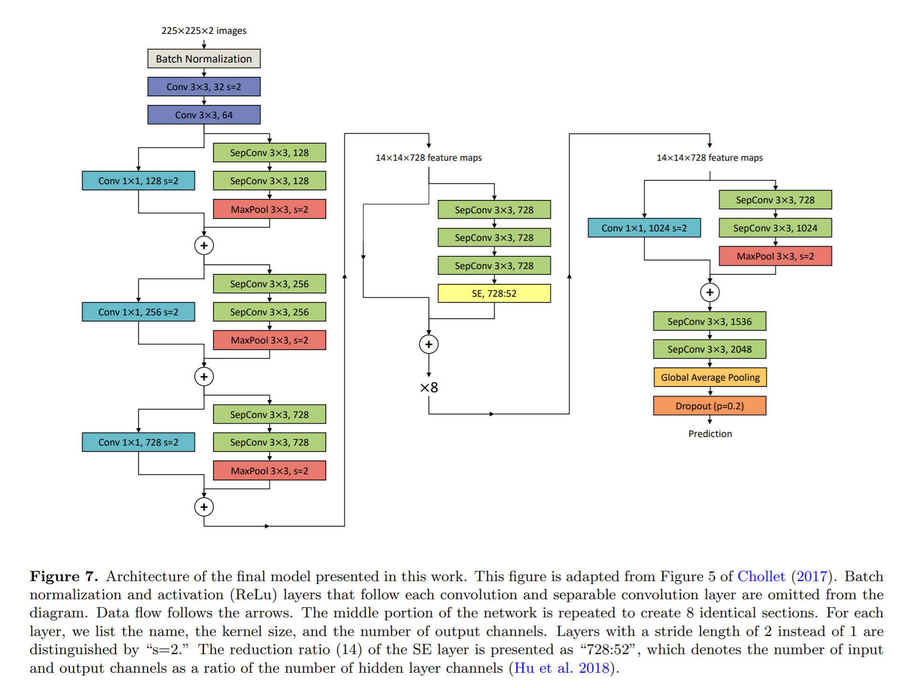
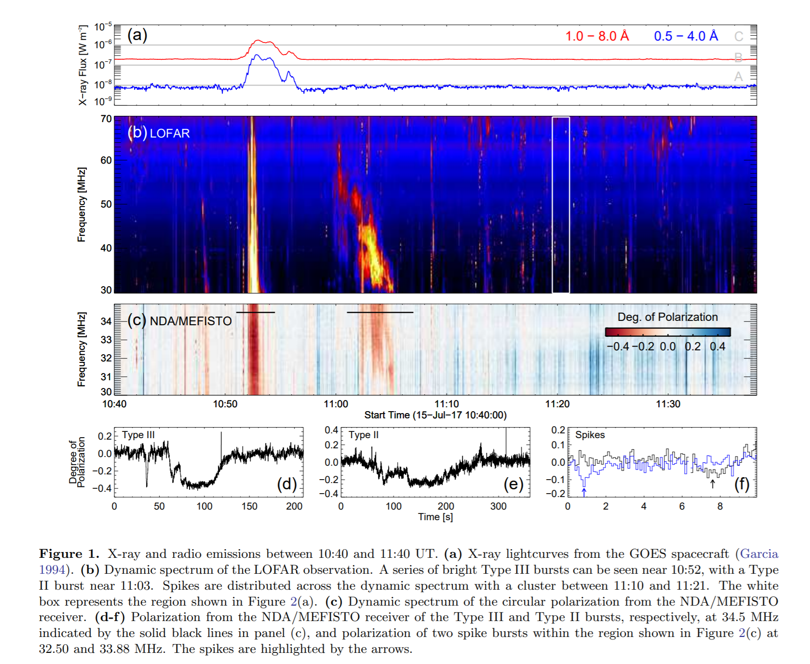

## 2021-08-02

1. [What it takes to measure reionization with fast radio bursts](https://arxiv.org/abs/2107.14242)

   使用高红移FRB的DM约束氢再电离历史，测量再电离光深$\tau$。在宇宙历史的前10亿年（红移$z>5$）中产生的100个FRB将$\tau$的精度约束到11%，再电离的中点`midpoint of reionization`约束到6%，1000个将精度提高到9%和3%。

   

2. [Machine Learning of Interstellar Chemical Inventories](https://arxiv.org/abs/2107.14610)

   `interstellar chemical inventories`，星际分子化学库可以帮助了解天体的化学和物理过程。因为`分子的组合`越来越多，即使只考虑`热力学上`最稳定的分子，导致发现`新的星际分子`越来越困难。

   通过无监督机器学习把分子表示成多维矢量，通过对这个矢量观测实现天体的化学成分识别。有监督的回归可以再现整个化学库的丰度并预测尚未看到的分子的丰度。

   

   开发的库在[这里](https://github.com/laserkelvin/umda)，将其应用到`金牛座分子云`中，结果如下图。

   

## 2021-08-03

1. [Identify Light Curve Signals with Deep Learning Based Object Detection Algorithm. I. Transit Detection](https://arxiv.org/abs/2108.00670)

   用`YOLOv3`在已识别的开普勒系外行星的光变曲线上训练，以识别`transiting`候选体。把光变曲线画出来，用计算机视觉来识别。

2. [A dynamical analysis of the Taurid Complex: evidence for past orbital convergences](https://arxiv.org/abs/2108.00041)

   使用15阶的`RADAU`积分计算了`2P/Encke`彗星、51颗近地小行星（Near-Earth Asteroids、NEAs）和16颗`Taurid fireballs`过去和未来`两万年`的位置，比较轨道相似性，研究`Taurid Complex`的动力学是否和大天体分裂形成的`Complex`一致。

   样本中只有12对天体在过去两万年之间显示出收敛的趋，这与五六千年前一个大天体的分裂吻合，导致2P/Encke、几个和TC相关的NEA是s和现在金牛座的TF。

   

3. [Touching the Stars: Using High-Resolution 3D Printing to Visualize Stellar Nurseries](https://arxiv.org/abs/2108.00014)

   使用`ENZO adaptive mesh refinement (AMR) code`模拟分子云形态，使用3D打印打印出分子云的三维结构，在九种不同的情况下：`真实分子云“正常”物理参数`、`低马赫数`、`高马赫数`、`低阿尔芬马赫数`、`高阿尔芬马赫数`、`低维里系数`、`高维里参数`、`纯solenoidal湍流`、`纯压缩湍流`。

   

4. [A Machine-Learning-Based Direction-of-Origin Filter for the Identification of Radio Frequency Interference in the Search for Technosignatures](https://arxiv.org/abs/2108.00559)

   传统识别射频干扰的方法主要是起源方向过滤器`DoO`，如果一个信号在天空的多个方向被检测到，根据频率和频率漂移率，将信号归类为RFI。使用CNN来检测在一次扫描中出现的信号是否也存在与另一个扫描中。CNN将经过传统`DoO`方法处理后仍需人工检查的数量减少了6-16倍。

   

5. [An 8% Determination of the Hubble Constant from localized Fast Radio Bursts](https://arxiv.org/abs/2108.00581)

   使用FRB测量哈勃常数。假设$DM_{host}$是`LogNormal`分布，计算$DM_{IGM}$​。
   $$
   DM_{IGM}=\frac{3cH_0\Omega_b f_{IGM}}{8\pi Gm_p}\int_0^z\frac{\chi(z)(1+z)}{\sqrt{\Omega_m(1+z)^3+\Omega_\Lambda}}dz
   $$

6. [81 New Candidate Fast Radio Bursts in Parkes Archive](https://arxiv.org/abs/2108.00609)

   基于1997年至2001年期间，Parkes探测到的`568,736,756`个瞬态事件的数据库，人工标记了3000张真/假(RFI)信号，使用ResNet去训练，找到了81个新的FRB候选体。

7. [Burst properties of the highly active FRB 20201124A using uGMRT](https://arxiv.org/abs/2108.00697)

   使用`upgraded Giant Metrewave Radio Telescope, uGMRT`在`550-750MHz`对FRB20201124A观测，非相干阵列模式使其定位精度达到角秒量级，发现了PRS。总共探测到48个脉冲，使用最亮的$F=108Jy\cdot ms$，使其结构最复杂的$DM=410.8\pm0.5pc\ cm^{-3}$​。在$10Jy\cdot ms$以上，探测是完备的，以下估计缺失80%的脉冲。宽度平均比其它FRB宽，`Waiting Time`可以用指数拟合，没发现周期。

8. [Scintillation timescale measurement of the highly active FRB20201124A](https://arxiv.org/abs/2108.00052)

   闪烁是由多路径传播引起的图像之间的干扰造成的，可以用来探测散射等离子体以及辐射源和散射屏的速度。使用`uGMRT`和`Effelsberg`观测FRB20201124A，时间接近的暴有类似的闪烁模式，通过关联这样的爆发对，可以测量闪烁的时间尺度。

   

   结果显示了各向异性的散射方向，并推断出闪烁速度为$VISS\approx(62\pm7)\sqrt{dl/2kpc}\ km/s$​​。

## 2021-08-04

1. [Automatic classification of eclipsing binary stars using deep learning methods](https://arxiv.org/abs/2108.01640)

   使用`ELISa`生成双星的光变曲线，两类 - `detached`和`over-contact`，使用`LSTM+一维CNN`做分类。

   

2. [Characterizing the FRB host galaxy population and its connection to transients in the local and extragalactic Universe](https://arxiv.org/abs/2108.01282)

   `FRB20180301A `被`Karl G. Jansky Very Large Array`探测并定位到$z=0.3304$​​​的一个恒星形成星系。`FRB20191228A`和`FRB20200906A`被`ASKAP`发现并定位在$z=0.2430$和$z=0.3688$​​两个宿主星系。结合之前定位的13个FRB，分析宿主星系特性，发现重复暴和非重复暴的宿主星系没有明显区别。FRB的宿主星系是中等恒星形成，质量略偏离恒星形成主序。

   

   恒星形成和低电离核发射线区（`LINER`）发射是FRB宿主星系电离的主要来源，FRB的空间偏移（与星系有效半径成正比）与晚期和早期星系中的球状星团（GCs）的空间偏移大多不同。

3. [Redshift Estimation and Constraints on Intergalactic and Interstellar Media from Dispersion and Scattering of Fast Radio Bursts](https://arxiv.org/abs/2108.01172)

   使用14个有红移和Scatter时标的FRB，来估计`星系间介质`、`星系晕`和`宿主星系盘`对`DM`和`Scatter`的贡献。`散射`由`宿主星系`主导，使得散射时标可以用来估计`宿主星系的DM`，也可以用来估计散射-色散的`综合红移`。
   $$
   \begin{aligned}
   &\tau(DM_{\mathfrak l}, \nu, z_{\mathfrak l}, z_s)\simeq0.48ms\times\frac{A_r\tilde FG(z_{\mathfrak l}, z_s)DM_{\mathfrak l, 100}^2}{\nu^4(1+z_{\mathfrak l}^3)}\\
   &G=\frac{\int_{layer}ds\ s(1-s/d)}{\int_{host}ds\ s(1-s/d)}\approx\frac{2d_{sl}d_{lo}}{Ld_{so}}
   \end{aligned}
   $$
   

   假定宿主星系$DM=50pc\ cm^{-3}$的情况下，只用DM估计的红移偏差为0.1，综合红移估计偏差小4-10倍。

## 2021-08-05

1. [The discovery of the largest gas filament in our Galaxy, or a new spiral arm?](https://arxiv.org/abs/2108.01905)

   使用FAST在$307.7^\circ<\alpha<311.0^\circ$，$40.9^\circ<\delta<43.4^\circ$​​​探测到一个巨大的`HI`暗条结构。与银河系中心距离`22kpc`，长度1.1kpc，速度平均值为`-150km/s`，可能是目前银河系中最远并且最大的暗条结构。命名为`CatTail`，计算的质量$6.5\times10^4M_\odot$​，宽度是207pc，这一结构并不遵循银盘的曲率。

   另外发现一个长条结构，是`Outer Scutum-Centaurus (OSC) `半人马座向银河系第一象限的延伸，`CatTail`跟在OSC后面。

## 2021-08-06

1. [Energy and spectral analysis of confined solar flares from radio and X-ray observations](https://arxiv.org/abs/2108.02601)

   研究了2014年10月的10个`confined flare events`耀斑事件，发现这些事件与延伸到9.4-15.4GHz的`microwave continuum burst `有关，这些事件的峰值频率高于4.995GHz，低于17GHz，中值9GHz，`没有`探测到能量超过300KeV的硬X射线，说明这种耀斑事件中缺乏有效的使电子加速到高能的方式。

   

   

## 2021-08-09

1. [Transit Origami: A Method to Coherently Fold Exomoon Transits in Time Series Photometry](https://arxiv.org/abs/2108.02903)

   使用单一的`satellite-to-planet mass ratio`参数，来实现系外卫星的折叠搜索（本应是折叠两次，行星一次、卫星一次）。应用在`Kepler-973b`上，表现出8分钟的 `transit timing variations，TTV`，并且TTV是单个行星导致的可能性被排除，卫星上限是`Ganymede-sized`。

   

## 2021-08-10

1. [A forecast of using fast radio burst observations to constrain holographic dark energy](https://arxiv.org/abs/2108.04127)

   使用FRB在源于量子引力全息原理的全息暗能量（`HDE`）模型和Ricci暗能量（`RDE`）模型下对宇宙学参数的估计。通过1w个精确定位的FRB与当前CMB数据结合，可以将哈勃常数的精度限制到2%，对HDE模型中暗能量参数实现6%的约束。

2. [Observation of burst activity from SGR1935+2154 associated to first galactic FRB with H.E.S.S](https://arxiv.org/abs/2108.03404)

   SGR1935在2020年看到一个FRB，在这之前`Switft-BAT` 、`H.E.S.S.`和`INTEGRAL`看到了X射线暴。

   

## 2021-08-11

1. [Birth of the ELMs: a ZTF survey for evolved cataclysmic variables turning into extremely low-mass white dwarfs](https://arxiv.org/abs/2108.04255)

   选取Gaia赫罗图上`主序以下`的，ZTF光变曲线中表现出椭圆`光变`，轨道`周期小于6个小时`的恒星系统，有`51`个亮于18等的。

   

   获得了21个系统的`many-epoch spectra`，确认了他们都是在洛希瓣有填充物的双星。其中13个正在进行质量转移，8个可能刚刚停止。大多数的次星都比已知的灾变变星（CVs）温度更高，并且温度高于7000K的次星似乎已经`detached`，冷的次星仍在进行质量转移。

   

2. [WALLABY Pre-Pilot Survey: HI Content of the Eridanus Supergroup](https://arxiv.org/abs/2108.04410)

   使用ASKAP的L波段全天盲搜`WALLABY`观测波江座`Eridanus`的超星系群，发现了51个HI源，其中12个是背景星系。所有探测到的星系中都存在扭曲的HI形态，表明正在进行潮汐相互作用，大多数都在形成恒星。并且这些星系不遵循`原子气体分数`与`恒星质量`之间的一般趋势，表明比例关系随着环境密度的变化而变化。有个3D模型，在[这里](https://sketchfab.com/3d-models/wallaby-eridanus-supergroup-vs-cf3-density-2d92e8a9f4b74f4293d9fabb9a6e73b3)。

   

3. [Observational effects of banded repeating FRBs](https://arxiv.org/abs/2108.04474)

   <p style='color:gray'>他们写文章好快啊。</p>

   在时频上用高斯模拟重复暴脉冲的辐射，观测的带宽限制导致能量分布各种可能的形状。在计算能量时使用带宽，121102的双峰能量分布就消失了。

## 2021-08-12

1. [Detecting the Stochastic Gravitational Wave Background from Massive Gravity with Pulsar Timing Arrays](https://arxiv.org/abs/2108.05344)

   使用脉冲星计时阵，如`NANOGrav`，`EPTA`，`PPTA`探测随机引力波背景（SGWB）。在广义相对论中，`Hellings-Downs`曲线用来描述两颗脉冲星的信号到达时间和之间角度的关系。文章计算了`analogous overlap reduction function`，包括了`偏振`和`引力子质量`的修正，与HD曲线进行比较。主要结果就是模拟HD曲线的完整分析形式，为未来探测引力波做准备。

   

2. [Clean catalogues of blue horizontal-branch stars using Gaia EDR3](https://arxiv.org/abs/2108.05172)

   水平支`Blue horizontal-branch`的恒星非常古老，可以用来研究银河系结构和形成历史。使用Gaia EDR3的数据和已有的水平支恒星目录交叉匹配，获得Gaia下的筛选标准。

   ```sql
   # 使用parallax筛选
   SELECT * FROM gaiaedr3.gaia_source
   WHERE parallax_over_error > 5 AND parallax > 0
   AND (sqrt(power(pmra,2)+power(pmdec,2)))*(4.74/parallax)>145
   AND phot_bp_mean_flux_over_error > 10
   AND phot_rp_mean_flux_over_error > 10
   AND phot_bp_rp_excess_factor < 1.3+0.06*power(bp_rp,2)
   AND phot_bp_rp_excess_factor > 1.0+0.015*power(bp_rp,2)
   AND bp_rp>-0.1 AND bp_rp<0.53
   AND phot_g_mean_mag+5+5*(log10(parallax/1000))>-1
   AND phot_g_mean_mag+5+5*(log10(parallax/1000))<(2.5-(2.77*bp_rp))
   # 使用proper motion筛选
   SELECT * FROM gaiaedr3.gaia_source
   WHERE parallax_over_error <= 5
   AND phot_bp_mean_flux_over_error > 10
   AND phot_rp_mean_flux_over_error > 10
   AND phot_bp_rp_excess_factor < 1.3+0.06*power(bp_rp,2)
   AND phot_bp_rp_excess_factor > 1.0+0.015*power(bp_rp,2)
   AND bp_rp>-0.1 AND bp_rp<0.53 AND abs(b)>=50
   AND phot_g_mean_mag+5+5*log10((sqrt((pmra*pmra)+(pmdec*pmdec)))/1000)<11.88
   AND phot_g_mean_mag+5+5*log10((sqrt((pmra*pmra)+(pmdec*pmdec)))/1000)>6.80
   AND (sqrt((pmra*pmra)+(pmdec*pmdec)))/(sqrt((pmdec_error*pmdec_error)+(pmra_error*pmra_error)))>5
   ```

## 2021-08-13

1. [Habitability Models for Astrobiology](https://arxiv.org/abs/2108.05417)

    天体生物学家一直在提出不同的宜居性模型，但是没有一致性。宜居性模型不仅用于确定环境是否宜居，还可以用于描述哪些因素导致宜居性从低到高的过度。文章回顾了生态学家和天体生物学家使用的一些不同的模型，并建议如何将这些模型纳入新的宜居性标准。

## 2021-08-16

1. [The ASKAP Variables and Slow Transients (VAST) Pilot Survey](https://arxiv.org/abs/2108.06039)

   ASKAP上的变星和缓变暂现源巡天`Variables and Slow Transients Survey (VAST) `旨在探测光变时间尺度为`5s ~ 5y`的射电源。文章介绍VAST第一阶段（2019.8-2020.8，在888MHz的中心频率下进行的，162小时）的观测和初步结果，$RMS=0.24mJy/beam$，角分辨率$12-20arcsec$​​，观测了113个`field`，每个`field`观测的整合时间是12分钟，重复5-13次，间隔1天到8个月。巡天面积5131平方度，发现了28个变源，7个是一致的脉冲星，7个是恒星，4个是以前没有报道的源。剩下的14个源，2个是活动星系和，6个与星系有关，6个没有多波段的对应体，无法确定。

   

2. [First Frequency-Time-Resolved Imaging Spectroscopy Observations of Solar Radio Spikes](https://arxiv.org/abs/2108.06191)

   `Solar Radio Spikes`持续时间短、窄带宽、在GHz-MHz的精细结构，表明在日冕中存在着亚秒量级的小规模能量释放，起源不知。

   

   

3. [Canis Major OB1 stellar groups contents revealed by Gaia](https://arxiv.org/abs/2108.06234)

   使用[HDBSCAN](https://hdbscan.readthedocs.io/en/latest/)对大犬座OB1`CMa OB1`附近的恒星聚类，用等龄线拟合不同的星团。几个年轻的星团CMa05、CMa06、CMa07和CMa08，被证实是CMa OB1的一部分。这些星团很符合单一场景的恒星形成，有一个共同的形成机制，并且遭受了多次恒星形成的事件。

   

4. [Ghosts without runaway](https://arxiv.org/abs/2108.06294)

   一个`canonical degree of freedom`与一个具有`负动能`的自由度（鬼）相互作用，分析证明，这样的系统的经典运动对于所有的初始条件都是稳定的。尽管负动能项的系统在现代宇宙学、量子引力和高能物理中通常被认为是不稳定的。这样的结果表型，对于经典力学系统来讲，这样的传说可能过于天真，与鬼魂一起生活也是稳定的。

## 2021-08-17

1. [Constrains on optical emission of FAST-detected FRB 20181130B with GWAC synchronized observations](https://arxiv.org/abs/2108.06931)

   在`Ground based Wide Angle Cameras，GWAC`（是放在兴隆公共天文台上的4个60/30cm的望远镜）的数据中找FRB181130的光学对应体。在FAST观测到爆发的时间内没找到，极限星等的上限是$15.43\pm0.04$。

## 2021-08-18

1. [Pitfalls of periodograms: The non-stationarity bias in the analysis of quasi-periodic oscillations](https://arxiv.org/abs/2108.07418)

   准周期振荡（QPOs）帮助理解天体暂现事件中动态行为`dynamic behavior`，如伽马射线暴、太阳耀斑、磁星耀斑等。通常使用周期图搜索QPOs，并使用`Whittle likelihood function`估计谱密度。然而只有在时间序列是静止的`stationary `，`Whittle likelihood`才有效，否则不同频率`bin`不相互独立。

   文章表明，如果时间序列是`non-stationary`的，QPO的程度会被高估，如果QPO只存在于时间序列中的一部分，而噪声水平在整个时间序列中是变化的，就会出现这种影响，像下图这样。

   

   文章证实了以前报道的太阳耀斑数据的结果中存在这种偏差，最后提出一些建议，帮助识别一个分析是否收到这种偏差的影响。

## 2021-08-19

1. [Can a strong radio burst escape the magnetosphere of a magnetar?](https://arxiv.org/abs/2108.07881)

   如果快速射电暴在磁星磁层内部发射，必须与外磁层中半径为$10^9-10^{10}\ cm$的低密度等离子体相互作用。这个区域散射截面很大，FRB会压缩磁层，能量就被场和散射吸收。散射光可以到$\gamma$波段，引发$e^{\pm}$`avalanche`，进一步增加不透明度，使FRB的辐射无法释放出来。排除了半径$R\ll10^{10}\ cm$的发射。

   

## 2021-08-20

1. [Low Levels of Sulphur Dioxide Contamination of Phosphine Spectra from Venus' Atmosphere](https://arxiv.org/abs/2108.08393)

   在2017年和2019年不同区域的ALMA和JCMT的数据中，都检测出了$PH_3$的光谱，此时$SO_2$的丰度小于10%，这表明$PH_3$的丰度在这两年并未变化。

## 2021-08-23

1. [Reconciling the 16.35-day period of FRB 20180916B with jet precession](https://arxiv.org/abs/2108.08982)

   认为FRB180916的周期与进动`precession period`有关，射电辐射由进动的喷流产生。由`disk`驱动的模型需要很小的`viscous parameter`，$\alpha\le10^{-8}$，意味着这个模型不可信。由`潮汐力`驱动的模型，考虑由中子星和白矮星组成的双星系统，正在发生质量转移。由于盘面和轨道面之间的夹角，白矮星的潮汐力驱动喷流的进动。相关的进动大概是几天到几百天，取决于吸积率和成分质量。

   

2. [FAST early pulsar discoveries: Effelsberg follow-up](https://arxiv.org/abs/2108.09121)

   Effelsberg对CRAFTS的11颗脉冲星进行了后续观测，这11颗年龄都比较老，与脉冲星的死亡线接近。其中两个，`PSR J1951+4724`有100%的线偏振，在8GHz可见，`PSR J2338+4818`是`mildly recycled pulsar`，轨道周期95.2d。

## 2021-08-24

1. [A phenomenological model for measuring generalised Faraday rotation](https://arxiv.org/abs/2108.09429)

   广义法拉第旋转使线偏振与圆偏振转换。这里定义了一个现象学模型，用来测量广义法拉第旋转对偏振的影响，模型可以适应各种可能的广义法拉第旋转诱导介质。
   $$
   \left[\begin{matrix}
   I'\\Q'\\U'\\V'
   \end{matrix}\right] =
   \left[\begin{matrix}
   1&0&0&0\\
   0&cos\theta&0&sin\theta\\
   0&0&1&0\\
   0&-sin\theta&0&cos\theta
   \end{matrix}\right] \cdot
   \left[\begin{matrix}
   1&0&0&0\\
   0&cos\varphi&-sin\varphi&0\\
   0&sin\varphi&cos\varphi&0\\
   0&0&0&1
   \end{matrix}\right]\cdot \left[\begin{matrix}
   I\\Q\\U\\V
   \end{matrix}\right]\\
   \Phi(\lambda)=\Phi_0+GRM(\lambda^\alpha-\lambda_0^\alpha)
   $$
   

2. [New continuum and polarization observations of the Cygnus Loop with FAST](https://arxiv.org/abs/2108.09631)

   使用FAST看`Cygnus Loop supernova remnant`的连续谱和偏振。观测结果以前的观测结果一致，验证数据校准程序。还获得了8个银河系外源的RM，证明宽频覆盖有助于克服RM测定的模糊性。

   

3. [Estimating the contribution of foreground halos to the FRB 180924 dispersion measure](https://arxiv.org/abs/2108.09881)

   DM记录了电离重子的存在，可以解释`cosmic web`中的物质分布。FRB180924的$DM_{cosmic}=220pc/cm^3$，小于Macquart关系估计的在红移$z=0.3216$处的平均值$280pc/cm^3$。这里使用一种概率方法，发现FRB180924没跟星系晕相交，星系晕的DM贡献小于45。

4. [Anisotropies of Cosmic Optical and Near-IR Background from China Space Station Telescope (CSST)](https://arxiv.org/abs/2108.10181)

   宇宙光学背景`COB`和宇宙近红外背景`CNIRB`的各向异性能够解决宇宙学中的一些关键问题。文章模拟了CSST的超深场`CSST-UDF`的COB和CNIRB的`角功率谱`。在$r\sim0.620\mu m$、$i\sim0.760\mu m$、$z\sim0.915\mu m$、$y\sim0.965\mu m$波段$5\sigma$的检测极限星等分别是28.3、28.2、27.6、26.7。

   

   生成模拟数据，合并图像并移除亮源，获得了$I=200-2000000$从角秒到度的角功率谱，用包含`intrahalo light (IHL)`的多参数模型拟合，对参数的约束提高了3-4倍。

## 2021-08-25

1. [Constraining the Polarization of Gravitational Waves with the Parkes Pulsar Timing Array Second Data Release](https://arxiv.org/abs/2108.10518)

   在PPTA的DR2里搜索各向同性的随机引力波背景，没有发现统计重要性的张量横向（TT）、标量横向（ST）、矢量纵向（VL）或标量纵向（SL）的关联性。将每种偏振模式的振幅限制在$\mathcal A_{TT}\le3.2\times10^{-15}$、$\mathcal A_{ST}\le1.8\times10^{-15}$、$\mathcal A_{VL}\le3.5\times10^{-16}$、$\mathcal A_{SL}\le4.2\times10^{-17}$，或者等价的，每对数频率的能量密度上限为$\Omega_{GW}^{TT}\le1.4\times10^{-8}$、$\Omega_{GW}^{ST}\le4.5\times10^{-9}$、$\Omega_{VL}^{TT}\le1.7\times10^{-10}$、$\Omega_{GW}^{SL}\le2.4\times10^{-12}$，在1/year的频率处。

2. [Optical Transients from Fast Radio Bursts Heating Companion Stars in Close Binary Systems](https://arxiv.org/abs/2108.10677)

   在靠近M81的球状星团中发现了一个重复暴`FRB20200120E`，球状星团年龄9.13Gyr。这篇文章认为FRB源处于双星系统中，当低质量主序伴星遮住FRB时，表面被加热，再辐射主要在光学波段，在FRB后有几秒钟的延迟，亮度比太阳大几倍，持续数百米秒。

## 2021-08-26

1. [Habitability and Biosignatures of Hycean Worlds](https://arxiv.org/abs/2108.10888)

   研究了一类新的宜居行星，有大量的海洋和富含$H_2$的大气，被称为`Hycean worlds`。研究了这种世界的主体属性（质量、半径和温度）、可居住性潜力以及可观测到的生物特征。于类地行星相比，海洋行星可能大得多，并且宜居带`habitable zone`也比类地行星宽。使用JWST可以很容易的检测到一些可能存在于冰洋大气中的微生物，这可以成为此类观测的理想目标。

   

## 2021-08-27

1. [A case study of ACV variables discovered in the Zwicky Transient Facility survey](https://arxiv.org/abs/2108.11411)

   磁性化学组成特殊星`Magnetic chemically peculiar，mCP`有非常复杂的大气层，可以研究原子扩散、磁场和恒星自转的相互作用，化学元素在其表面非均匀分布，旋转轴和磁轴的不一致，会导致观测数据的变化。测光可变的`mCP`被称为`alpha2 Canum Venaticorum，ACV`变星。光变曲线有特征如下

   

   不同的测光通带中的反相位变化，是ACV的一个独特特征。从ZTF的周期性变星目录中选择候选ACV变星，根据光变曲线筛选出86颗可能的ACV，其中15个有LAMOST光谱，这15个都被确认为ACV。这说明ZTF非常适合搜索ACV，然而现有的ZTF变星目录中没有考虑这一类变星。

## 2021-08-30

1. [A Local Universe Host for the Repeating Fast Radio Burst FRB 20181030A](https://arxiv.org/abs/2108.12122)

   `FRB20181030A`是CHIME探测到的一个低DM的重复暴，$DM=103.5pc/cm^3$，使用基带数据定位在5.3角分的范围，确定`NGC 3252`是最可能的宿主星系，偶然重合的概率$<2.5\times10^{-3}$，红移因此为0.05。`NGC 3252`是一个正在形成的螺旋星系，距离`20Mpc`，估计PRS在3GHz的的亮度上限为$2\times10^{26}erg/s/Hz$，比121102暗1500倍。

   

## 2021-08-31

1. [IQRM: real-time adaptive RFI masking for radio transient and pulsar searches](https://arxiv.org/abs/2108.12434)

   对RFI做遮罩的方法，对1s的频谱时间求和，对频率通道的值做微分，使用`Tukey’s fences`的方法找异常值。

   > Tukey J. W., 1977, Exploratory data analysis

