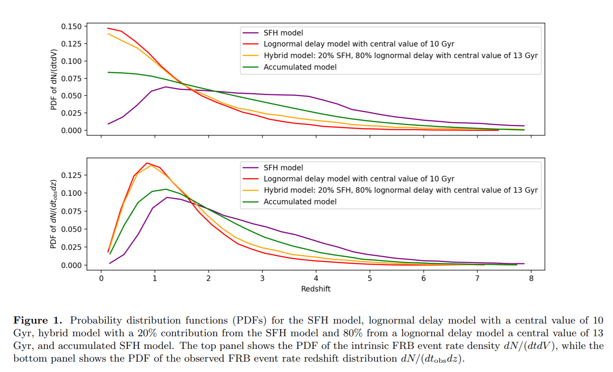
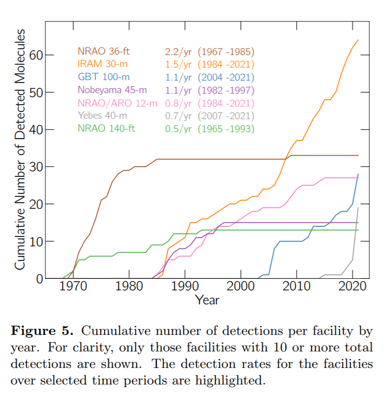
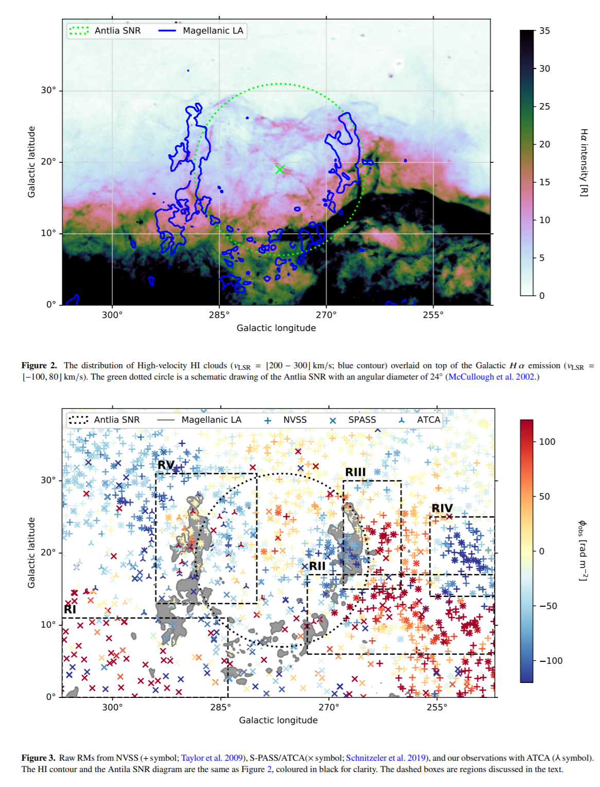

## 2021-09-01

1. [Vela Pulsar: Single Pulses Analysis with Machine Learning Techniques](https://arxiv.org/abs/2108.13462)

   对Vela脉冲星在4天内（每天超过三个小时）的观测数据分析。使用DBSCAN对单脉冲振幅聚类，发现高振幅与较早的到达时间之间有关联。使用`Self-Organizing Maps (SOM) `（[自组织映射的Keras实现](https://github.com/FlorentF9/DESOM)）基于神经网络的无监督聚类，用`Variational AutoEncoder (VAE)`（[VAE的Keras实现](https://github.com/keras-team/keras/blob/master/examples/variational_autoencoder.py)）重建脉冲，将其从噪声中分离出来，发现脉冲分成4个种类，认为支持脉冲在磁层不同高度发射。

   

## 2021-09-02

1. [Constraining the Cosmic Baryon Distribution with Fast Radio Burst Foreground Mapping](https://arxiv.org/abs/2109.00386)

    通过在FRB的前景中加入大视场星系光谱巡天数据，可以改善宇宙重子参数约束。

   

## 2021-09-03

1. [FAST discovery of an extremely radio-faint millisecond pulsar from the Fermi-LAT unassociated source 3FGL J0318.1+0252](https://arxiv.org/abs/2109.00715)

   FAST确认的第一个毫秒脉冲星，是通过对`Fermi`的$\gamma$射线源进行的射电波段观测，这颗MSP是发现的射电波段辐射最暗的。

## 2021-09-06

1. [Segmentation of turbulent computational fluid dynamics simulations with unsupervised ensemble learning](https://arxiv.org/abs/2109.01381)

   通过`SOM`（聚类，在本页的09-01节中描述过）将模拟的湍流图像中相似像素组合在一起，来分割物理结构。结合多个聚类结果，`statistically-combined ensemble (SCE) `，集成学习实现分割的稳健性。将`SCE`方法应用于磁场主导的等离子体湍流的二位模拟数据快照中。代码在[这里](https://github.com/mkruuse/segmenting-turbulent-simulations-with-ensemble-learning)。

   

## 2021-09-07

1. [The third cosmological paradigm](https://arxiv.org/abs/2109.01717)

   讨论了两种宇宙学范式`cosmological paradigms` - 热大爆炸和LCDM。讨论第三种宇宙学范式必须解决第二范式未解决的问题：重子产生、暗物质、暗能量和暴涨，真空能为什么很小，或者说明我们需要关注或者忽略多元宇宙。

2. [Velocity structure functions in multiphase turbulence: interpreting kinematics of Hα filaments in cool core clusters](https://arxiv.org/abs/2109.01771)

   对均匀、各向同性的亚声速湍流进行了模拟，用速度结构函数`VSF`来估计运动情况，研究了不同空间分辨率、磁场和视线投影对`冷热湍流`的速度结构函数的影响。

   当系统没有辐射冷却时，投影后二阶`VSF`的斜率变陡。加入辐射冷却和冷热相气体，冷热相的`VSF`相似，加磁场只使冷相`VSF`变陡，沿视线方向投影使热相`VSF`变陡，使冷相`VSF`变平。

   

## 2021-09-08

1. [Asymmetric HI 21 cm lines of fast radio burst hosts: connection with galaxy interaction](https://arxiv.org/abs/2109.02663)

   分析FRB宿主星系的HI辐射，`NGC3252 - FRB181030A`，`M81 - FRB200120E`，`MW - FRB200428`存在HI的观测数据，结果表明，三个星系都是` interacting galaxies`，HI光谱高度`不对称`，其中一个缺乏原子氢气体。表明FRB与`相互作用导致恒星形成增强`有关，长伽马射线暴和宽线Ic型超新星的宿主星系的光谱更加对称，表明FRB和GRB的发射机制可能是不同的。

   

## 2021-09-09

1. [The terrestrial planet formation paradox inferred from high-resolution N-body simulations](https://arxiv.org/abs/2109.03650)

   最近对GPU硬件和对称N体代码`GENGA`的改进使行星形成模拟的分辨率达到了前所未有的水平。文章通过对太阳系150Myr的模拟，假设木星和土星一直保持其目前的偏心轨道，可以实现目前太阳系的动力学结构，但是发生了径向混合`radial mixing`，难以解释太阳系各天体之间的同位素差异。如果假设木星和土星初始圆轨道，则可以实现低的径向混合，但是动力学结构无法重现。

   因此结果表明，在经典的形成方案中，类地行星的动力学结构和化学数据之间存在矛盾。

## 2021-09-10

1. [Joint constraints on cosmology and the impact of baryon feedback: combining KiDS-1000 lensing with the thermal Sunyaev-Zeldovich effect from Planck and ACT](https://arxiv.org/abs/2109.04458)

   利用KiDS的星系弱引力透镜效应和热苏尼亚耶夫-泽尔多维奇效应（tSZ效应）的交叉相关来限制宇宙学参数和重子反馈。纯粹的弱引力透镜观测可以用来限制宇宙中的总质量密度(Omega_m)，以及宇宙密度场涨落的幅度(sigma_8)。tSZ效应也受这两个宇宙学参数的影响，因此引入tSZ有助于更好地限制它们。

   这个工作是第二个作者Alex Mead开发的代码HMx的一个show case。HMx是一个广谱的晕模型(halo model)，可以适用于星系，暗物质晕和tSZ等示踪物，是现在计算非线性物质功率谱最好的工具之一。文章里出现了10个不同的Github和BitBucket仓库链接，也算是现代观测宇宙学数据和统计流程复杂性和开放性的写照。

## 2021-09-13

1. [Non-thermal emission from young supernova remnants in dense circumstellar environments](https://arxiv.org/abs/2109.04828)

   超新星遗迹在射电、X射线和$\gamma$射线存在非热辐射，因此可以加速宇宙线，但是尚未看到被加速到$PeV$的量级。几个年轻的SNRs的$\gamma$射线光谱存在截止频率，使得人们认为$PeV$的能量可能只在遗迹演化早期才能实现。

   文章使用`RATPaC`代码来模拟宇宙线在红巨星`RSG`和高光度蓝变星`LGV`膨胀时的加速情况。在模拟中考虑了`宇宙线的传输方程`、`磁湍流`、`热等离子体的流体力学`。

   模拟到的宇宙线的最大能量是`100-200TeV`，上限是`sub-PeV`，在爆炸一个月后达到。`LGV`的峰值亮度是$1\times 10^{43} \ erg/s$，`RSG`的是$1\times 10^{41} \ erg/s$，所有计算出的SNe在大约1个月后达到$\gamma$射线光度峰值，之后以$1/t$的速度衰减。

## 2021-09-14

1. [The In-situ Origins of Dwarf Stellar Outskirts in FIRE-2](https://arxiv.org/abs/2109.05034)

   在观测上发现小质量矮星系有一个比内部盘状结构更加“圆润”的`恒星晕状结构`。在大质量星系里，这些结构往往来源于其他`星系的并合`。但矮星系并合历史简单，需要其他的渠道。使用一套高分辨率星系形成磁流体力学模拟方法`FIRE-II`，模拟矮星系的三维形状，发现大部分矮星系的外部晕状结构都是来自于在漫长岁月里，通过不同的动力学过程从恒星盘上迁移出去的。导致矮星系中越年老的恒星，整体形状更加“圆润”。

   另外模拟还发现，`恒星形成历史`和`矮星系的形状`有关系。如果整体的恒星形成历史过于“跌宕起伏”，那么频繁的恒星形成反馈 (如超新星爆发) 过程会阻止一个稳定恒星盘的形成。

   

2. [Can we illuminate our cities and (still) see the stars?](https://arxiv.org/abs/2109.05310)

   文章表明，在大城市的中心，如果光辐射保持在可接受的水平，并且避免炫光`glare`，可以在城市内实现合理的黑暗天空。

   以城市光辐射为参数对天空亮度建模：
   $$
   m=-2.5\log_{10}\left[10^{-0.4\times m_N}+\frac{2\pi\Phi_L}{B_{ref}}\int_{R_0}^R\int_0^\infty S(\lambda)\hat\Phi(\lambda)\Psi(r,\lambda)rdrd\lambda\right]
   $$

## 2021-09-15

1. [A maximum likelihood estimate of the parameters of the FRB population](https://arxiv.org/abs/2109.06785)

   最大似然估计确定FRB的模型。分析表明，散射增宽随红移适度增加的模型好于散射增宽非常剧烈或者没有的模型。事件率在红移上是常数的模型好于随恒星形成率变化的模型。

   

2. [Discovery of Extra-Planar HI Clouds and a HI Tail in the M101 Galaxy Group with FAST](https://arxiv.org/abs/2109.06430)

   使用FAST观测`M101`旋涡星系附近$2^\circ\times2^\circ$区域的HI，发现有一个延展且不对称的HI盘。在其南部发现了三个新的没有光学对应体的HI云，在扩展HI盘中探测到一个新的HI尾巴，认为可能与`NGC5474`之间有相互作用。

## 2021-09-16

1. [Optical Observations and Modeling of the Superluminous Supernova 2018lfe](https://arxiv.org/abs/2109.06970)

   对`SN 2018lfe`的光学和光谱成像，认定其为$z=0.3501$的1型超新星，峰值绝对星等$M_r=-22.1$，是最亮的`SLSNe`之一。使用磁星中心引擎模拟光变曲线，发现喷出物质量为$M_{ej}=3.2M_\odot$，磁星自转周期$P=2.9ms$，磁场强度$B=2.8\times10^{14}G$。通过晚期成像和光谱，发现其宿主星系的绝对星等$M_r=-17.85$,金属丰度$Z=0.3Z\odot$，恒星形成率$0.8M_\odot\ yr^{-1}$。

   

## 2021-09-17

1. [The CHIME FRB population do not track the star formation history of the universe](https://arxiv.org/abs/2109.07558)

   CHIME源表中的FRB的红移分布与恒星形成历史不相符，`结论与9-15第一篇文章相似`。认为`带延迟的恒星形成红移分布`或者`混合模型`可以描述数据。

   

2. [Further evidence of shocks in the first-overtone RR Lyrae pulsators: first detection of shock-triggered magnesium emissions](https://arxiv.org/abs/2109.07486)

   `LAMOST`中分辨率连续谱观测到一个`non-Blazhko RRc pulsator`的`blueshifted Mg triplet emission`。用`pre-whitening sequence`方法分析光度观测，得到了其星历和相位。通过`Sersic`函数拟合得到了光谱的红移和径向速度。看到了`comoving blueshifted hydrogen and Mg emission`的演化，证实了`shock waves`在`RRc`脉动变星中存在。

   

## 2021-09-20

1. [Knowing when to stop](https://arxiv.org/abs/2109.08190)

   在何时停止一个项目。

## 2021-09-21

1. [Development of a Tracklet Extraction Engine](https://arxiv.org/abs/2109.09064)

   `traceee`用于从三维空间中检测排列成线段的点，用于从数据中提取移动天体（小行星、卫星和空间碎片）。方法依靠`k-nearest`，通过分组提取线段，在线段交叉时也可能很好的工作。

   

   

2. [Analyzing the Habitable Zones of Circumbinary Planets Using Machine Learning](https://arxiv.org/abs/2109.08735)

   `Kepler`和`TESS`发现了许多系外行星，包括150+颗围绕双星或者多星系统运动的系外行星。根据行星轨迹估计环双星的宜居带，发现双星的质量比和轨道偏心率是重要因素。选择`双星的质量`、`温度`、`亮度`六个参数加上`双星轨道偏心率`和`行星半长轴`作为输入数据。，使用DNN做了个分类，以快速识别行星系统是否宜居。

3. [DECORAS: detection and characterization of radio-astronomical sources using deep learning](https://arxiv.org/abs/2109.09077)

   `DECORAS`是基于编码器-解码器神经网络架构，从VLBI观测中提取点源和展源。和传统方法比，文章的方法生成的源目录更完整和干净，在$7.5\sigma$的水平上是完整的，在$5.5\sigma$的水平上可靠性提高了2倍。

   

4. [Image Subtraction in Fourier Space](https://arxiv.org/abs/2109.09334)

   [SFFT](https://github.com/thomasvrussell/sfft)，`Saccadic Fast Fourier Transform`用于做图像差分的工具，不依赖`PSF`。

5. [Galaxy Deblending using Residual Dense Neural networks](https://arxiv.org/abs/2109.09550)

   使用残差密集神经网络`RDN`对星系图像进行去伪存真`deblending`。方案使用两个网络，一个用于分离星系，一个用于分类。通过每次迭代分离一个星系，直到图像中不再有分类器确定的物体。

6. [Search for Astrophysical Nanosecond Optical Transients with TAIGA-HiSCORE Array](https://arxiv.org/abs/2109.09637)

   `TAIGA-HiSCORE`是`Cerenkov`阵列上的一个装置，用于伽马射线探测。阵列现在有近100个光学站组成，面积1平方公里。由于光学站时间同步的`高精度`和`高稳定性`（1ns），EAS到达方向重建的精度达到了$0.1^\circ$。

   该阵列也可以用于探测光学的纳秒级事件。文章介绍了探测人造地球卫星信号的例子。

7. [High resolution LAsMA 12CO and 13CO observation of the G305 giant molecular cloud complex: II. Effect of feedback on clump properties](https://arxiv.org/abs/2109.09615)

   观测`G305`的$^{12}CO$和$^{13}CO$的3-2线，研究中心OB星对其反馈。使用树状图分析法`dendrogram`将该区域分解成团块。团块质量的CDF和`L/M`比率都比银河系的平均水平平坦，表明反馈触发了恒星形成。

   

8. [Search for lensing signatures from the latest fast radio burst observations and constraints on the abundance of primordial black holes](https://arxiv.org/abs/2109.09251)

   与`2021-03-16`的第二篇是同一篇，将用FRB的透镜效应探测原初黑洞。

9. [A sudden period of high activity from repeating Fast Radio Burst 20201124A](https://arxiv.org/abs/2109.09254)

   CHIME观测的`FRB20201124A`，描述形态、流量和到达时间，事件率约束在$3.4\ day^{-1}$，光度函数的幂律指数拟合是$\alpha=-4.5$。

## 2021-09-22

1. [C/2014 UN271 (Bernardinelli-Bernstein): the nearly spherical cow of comets](https://arxiv.org/abs/2109.09852)

   `C/2014 UN271`是一颗来自奥尔特云的彗星，是所有良好测量的彗星中彗核最亮的。首次在29AU的位置被发现，比所有奥尔特云彗星都远。

   彗星轨道倾角$i=95^\circ$，将于2031年到达近日点10.97AU，之前的远日点为$40400\pm260AU$。`r`波段的反照率表明其直径为150公里，星等在0.2的水平上波动，但还看不出旋转周期。彗星的活动与`太阳处于辐射平衡的升华`的简单模型一致，推断出升华的焓值与$CO_2$和$NH_3$的升华焓值一致。

2. [Life, the universe and the hidden meaning of everything](https://arxiv.org/abs/2109.10241)

   设计一个宇宙，物理学规律的参数是随机选择的。`Dennis Sciama`认为，一个随机的宇宙几乎肯定会有只允许生命存在的参数。文章认为，如果我们的宇宙是随机的，那么可能会给人一种`经过设计的假象`，基本常数被微调到了生命出现和维持的概率。

## 2021-09-23

1. [Periodic activity from fast radio burst FRB180916 explained in the frameof the orbiting asteroid model](https://arxiv.org/abs/2109.10577)

   认为FRB是在脉冲星星风中的小行星的等离子体尾流中产生的。估计至少有几千个20km的小行星才能产生看到的爆发率，并且用星风中的半径-频率映射和湍流的小扰动解释向下漂移的子脉冲、微结构和窄带宽。

   

## 2021-09-24

1. [Circularly polarized radio emission from the repeating fast radio burst source FRB 20201124A](https://arxiv.org/abs/2109.11535)

   使用Parkes和ASKAP在2021.4对FRB20201124A进行监测，探测到16个脉冲，其中一个ASKAP看到的是迄今为止重复暴最亮的脉冲，Fluence为$640\pm70Jy\cdot ms$。Parkes探测到5个，都是高度线偏振，其中一个有47%的圆偏振，并且偏振位置角改变。

## 2021-09-27

1. [BayesicFitting, a PYTHON Toolbox for Bayesian Fitting and Evidence Calculation](https://arxiv.org/abs/2109.11976)

   做贝叶斯拟合的一个工具，[GitHub地址](https://github.com/dokester/BayesicFitting)。

## 2021-09-28

1. [Detecting Biosignatures in the Atmospheres of Gas Dwarf Planets with the James Webb Space Telescope](https://arxiv.org/abs/2109.12132)

   半径介于地球和海王星之间的系外行星有更强的表面重力，并且保留相当的以氢为主的大气层，被称为`气态矮行星， gas dwarf planets`。JWST将对这些行星提供前所未有的洞察力。

   文章使用的JWST的各种仪器研究7个气态矮行星大气中氨`NH3，一种潜在的生物特征`的可探测性。使用`petitRadTRANS`和`PandExo`来模拟行星大气，并通过改变云层条件、平均分子量和氨的混合比来模拟不同情况的JWST的观测。定义了一个指标来量化检测的意义。

   在有光子和系统噪声下限为$12.6ppm$的情况下，用MIRI的日食光谱搜索$10.3-10.8\mu m$的$NH_3$特征是非常困难的。当有`清晰的大气层`和`低平均分子量`的情况下，投射光谱中检测$1.5\mu m-6.1\mu m$的$NH_3$特征是可行的。

2. [Isochrone fitting of Galactic globular clusters -- III. NGC\,288, NGC\,362, and NGC\,6218 (M12)](https://arxiv.org/abs/2109.13115)

   使用`Dartmouth Stellar Evolution Program and Bag of Stellar Tracks`的等龄线拟合三个银河系内的球状星团。

## 2021-09-29

1. [2021 Census of Interstellar, Circumstellar, Extragalactic, Protoplanetary Disk, and Exoplanetary Molecules](https://arxiv.org/abs/2109.13848)

   `星际，星周，河外星系，原恒星盘，以及系外行星大气中分子普查-2021版`，文章把有史以来在以上环境中探测到的分子进行了归类和整理，并且对发现历史和基本性质进行了综述。文章还有发现这些分子的`望远镜积分榜`和贡献这些分子的`天体排行榜`。

   

2. [Fast radio bursts as probes of feedback from active galactic nuclei](https://arxiv.org/abs/2109.13472)

   AGN会向`intergalactic medium`注入能量，影响FRB的DM和散射。使用`EAGLE`模拟三种不同的AGN模型，在$0\le z\le3$之间测量平均DM和红移的关系，发现DM-Redshift不受AGN反馈的影响，但是较弱的反馈会导致更多的散射。分析表明大概需要104个`local`的FRB来区分`标准反馈`、`更强`和`更断续`的反馈模型。

## 2021-09-30

1. [Distant probes of RM structure -- Where is the Faraday Rotation towards the Magellanic Leading Arm?](https://arxiv.org/abs/2109.14037)

   多种磁电离介质成分对沿视线的RM有贡献，使用银河系的弥漫偏振辐射`diffuse polarised emission`做测试，评估RM观测中明显的结构是否与遥远的星系周介质`CGM`或前景星际介质`ISM`有关。`Magellanic Leading Arm`周围探测到过RM过剩，这个方向有两个突出的气态天体，麦哲伦臂和Antlia超新星遗迹。在2.3GHz的`S-PASS`图像中发现了狭窄的消偏振丝状物，与报道的RM过剩重叠。认为在`Antlia SNR`区域有陡峭的RM梯度。

   

   文章分析表明，RM过剩和麦哲伦臂重叠是巧合，建议在未来RM的研究中，检查银河系`Galactic diffuse polarisation maps`。

2. [ArtPop: A Stellar Population and Image Simulation Python Package](https://arxiv.org/abs/2109.13943)

   `ArtPop`是开源的`Artificial Stellar Populations`，用于合成星族和生成完全填充的恒星系统的图像。程序模块相互独立，可以测量当前和未来成像调查的探测效率、计算星族参数、定量比较等龄线模型。程序位于[这里](https://github.com/ArtificialStellarPopulations/ArtPop/)。

   

3. [Small Protoplanetary Disks in the Orion Nebula Cluster and OMC1 with ALMA](https://arxiv.org/abs/2109.14592)

   `ONC`，猎户座大星云是最近的密集恒星形成区，`OMC1`分子云是位于`Trapezium`后面的高消光区域。文章使用ALMA在三个波段对原行星盘进行了高分辨率的观测，分辨率分别为`0.095 arcsec 3mm Band 3`、`0.048 arcsec 1.3mm Band6`、`0.03 arcsec 0.85mm Band7`，探测了127个源，包括15个之前从未探测过的新源。其中72个在3mm有空间分辨率，大小为8-100AU。将76个在红外探测到的源归为前景ONC，其余的归为OMC1。这两个样本的恒星的原行星盘大小相似，但是OMC1的恒星在空间上更密集，表明可能构成一个空间中不同的亚群。

   另外，与其它附近的恒星形成区比较，两个样本中原行星盘都比较小，表明原行星盘的截断过程是很重要的。

   

