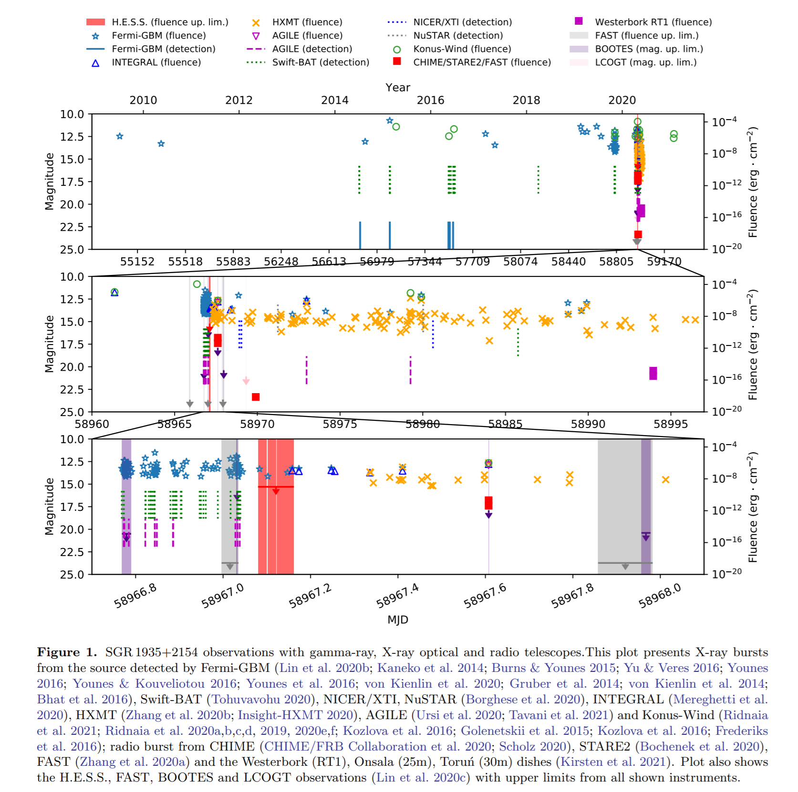

## 2021-10-01

1. [The OGLE Collection of Variable Stars. One Thousand Heartbeat Stars in the Galactic Bulge and Magellanic Clouds](https://arxiv.org/abs/2109.14616)

   心跳变星是偏心轨道上`ellipsoidal binary variables`的一个子类，亮度变化由潮汐形变和其它`proximity`效应引起的，亮度的最强变化发生在双星近邻的时候，光变曲线类似心电图`electrocardiogram signature`。

   

   `Optical Gravitational Lensing Experiment，OGLE`项目数据档案中发现了991颗心跳变星`heartbeat star HBS`。其中包括512颗银河核球`Galactic bulge`的恒星、439颗大麦云和40颗小麦云的恒星。

   恒星根据物理特性不同可以分成两组，主要区别是主星的进化状态，其中100个双星系统包含一个热主序主星，轨道周期$\le50~d$，另外900个系统包含一个红巨星，轨道周期$>100~d$。对每一颗恒星，都有超过20年的光变曲线的时间序列。

2. [Photometric Analysis of the OGLE Heartbeat Stars](https://arxiv.org/abs/2109.14614)

   上一篇文章的继续分析。使用一个流量变化的模型对光变曲线建模，导出恒星之间的潮汐形变、偏心率、轨道倾角和周期。
   $$
   \frac{\delta F}{F}(t)=S\cdot\frac{1-3\sin^3i\sin^2(\phi(t)+\omega)}{(R(t)/a)^3}+C
   $$
   其中等式左边是由潮汐形变导致的`流量的相对变化`，$S$是振幅，$i$是轨道倾角，$\omega$是角距进动`the argument of the periastron`，$\phi(t)$是近点角`anomaly`随时间变化，$R(t)$是双星距离随时间的变化，$a$是半长轴。

   

   上文中提到的两种恒星，在HR图上发现位于不同的分支上。提出一个时间序列分析，检测`tidally-excited oscillations，TEOs`，在样本中约5%的恒星发现了这种模式。

3. [Physical Characterization of Main-Belt Comet (248370) 2005 QN173](https://arxiv.org/abs/2109.14822)

   对新发现的活跃小行星`248370，2005 QN_137`的观测分析。其在近日点附近经常活跃被确定为一颗主带彗星，确定了其彗核绝对星等和颜色。在其活跃时，尘埃尾的颜色与彗核颜色一致，表明彗星不存在明显的气体。在2021观测期间，彗星的亮度在37天内下降了0.35等，但尘埃尾的表面亮度保持不变。尘埃速度非常慢，$1\mu m$的粒子速度为$1m/s$，表明观察到的尘埃排放可能是由于彗核的快速旋转降低了有效逃逸速度。

## 2021-10-04

1. [Identification of White Dwarf from Gaia EDR3 via Spectra from LAMOST DR7](https://arxiv.org/abs/2110.00002)

   将Gaia EDR3的130万个白矮星候选体与LAMOST DR7的光谱数据在3角秒内进行交叉匹配，使用光谱识别了6190个WD，其中1496个首次被确认。提供了LAMOST的[WD目录](https://paperdata.china-vo.org/XiaoKong/LAMOST_DR7_WD.fits)。

2. [Faraday depolarization by multi-path propagation and application to FRBs](https://arxiv.org/abs/2110.00028)

   `观测到的`天体的偏振与其`固有的`偏振和观测`设备的有限时间`和`光谱分辨率`相关。偏性由散射屏的`观测带宽`和`相干带宽`的比以及仪器的`时间分辨率`和屏的`变化时间`的比决定。通过`磁化散射屏`的线偏振会产生明显的圆偏振。

## 2021-10-05

1. [Searching for TeV gamma-ray emission from SGR\,1935+2154 during its 2020 X-ray and radio bursting phase](https://arxiv.org/abs/2110.00636)

   跟`2021-08-10 第2篇`内容相近，描述2020年4月对`SGR1935`的`H.E.S.S`的观测，认为观测与`INTEGRAL`和`Fermi-GBM`探测到的磁星的X射线爆发吻合。后续观测中在$E>0.6TeV$没发现明显的信号，给出了`持续性`和`瞬态性`发射的上限。

   

## 2021-10-06

1. [Cross-correlation of the Polarizations of the 21-cm and Cosmic Microwave Backgrounds](https://arxiv.org/abs/2110.01619)

   自由电子与21cm光子的`Thomson`导致了再电离时代的21cm辐射的偏振，直接探测这一信号是困难的，但是这一信号可能通过与其他示踪物的相关得到加强。首先，假设没有`重离子化`是一个`无效假设`，并确定这个无效假设能在多大程度上被观察到的`21厘米-CMB偏振相关`所排除。其次，假设从CMB中确立了再电离，可以多大程度上排除没有21厘米偏振的无效假设。

## 2021-10-07

1. [Give Me a Few Hours: Exploring Short Timescales in Rubin Observatory Cadence Simulations](https://arxiv.org/abs/2110.02314)

   根据`LSST`的观测策略，分析其晚上访问同一天区的时间间隔，目前的模拟在22分钟的位置有个峰值。但这对夜间天体的时变做不到有效的约束，会妨碍`LSST`及时发现广泛的天体物理现象。文章提出了改进搜索时间尺度的方法（与科学无关）。

   

## 2021-10-08

1. [Why do M dwarfs have more transiting planets?](https://arxiv.org/abs/2110.02971)

   `Kepler`发现的`M型矮星`周围的凌日行星发生率比`太阳型恒星`高。使用一个`pebble drift and accretion`模型来描述雪线内外行星核的生长，雪线内鹅卵石尺寸小，延迟了超级地球的生长，使外部巨行星先形成，当巨行星达到`pebble isolation mass`时，就切断了流进雪线内的鹅卵石，阻止近距离超级地球的形成。

   模型应用到$0.1-2M_\odot$之间的恒星，发现`热超级地球`和`冷巨行星`的质量是`反相关`的。在低质量恒星周围形成热超级地球的比例较高，与开普勒的系外行星事件率吻合。

2. [Fourier-domain dedispersion](https://arxiv.org/abs/2110.03482)

   通过对`傅里叶变换的时间序列`数据进行`相位旋转`来改正DM，是暴力非相干消色散算法，叫做[FDD](https://github.com/svlugt/dedisp)。传统时域消色散算法`TDD` 计算量少，对内存带宽要求高，`FDD`避免了这一限制，并且计算量也有线。对大量DM操作，`FDD`比`TDD`快两倍多。

   另外，`FDD`在基于`FFT`的脉冲星搜索中提供了额外的性能改进，因为可以省略从`FFT`回到时域的步骤。

   

## 2021-10-11

1. [VLA Observations of 9 Extended Green Objects in the Milky Way: Ubiquitous Weak, Compact Continuum Emission, and Multi-Epoch Emission from CH3OH, H2O, and NH3 Masers](https://arxiv.org/abs/2110.04270)

   `Extended Green Objects，EGOs`被认为是大质量原恒星团形成`HC HII`区的一个特定阶段，可以确认宿主星团仍然基本完整的特征，其在$4.5\mu m$的辐射被认为是原恒星的外流。

   用VLA在$1.3\ cm$和$1.5\ cm$处观察了9个EGOs，用亚角秒量级的分辨率和$7-14\ uJy/beam$的灵敏度描述连续谱的特征。在所有的目标视场中都观测到了$4.5\mu m$的微弱的`compact`辐射，以及雨EGO想观测6.7GHz的$CH_3OH$和$22GHz$的$H_2O$的混合物，在45%的观测中有$NH_3\ (3,3)$。

## 2021-10-12

1. [A Preliminary Calibration of the JAGB Method Using Gaia EDR3](https://arxiv.org/abs/2110.04576)

   `J-region Asymptotic Giant Branch，JAGB`，J区域渐近巨星支是最近开发的，校准银河系外的`Ia型超新星`的绝对星等的方法，可以作为银河系外标准烛光来独立测定哈勃常数。

   文章通过银河系内的`富碳AGB恒星`的近红外光度和Gaia EDR3中它们的视差来确定其`J波段`的绝对星等，从而确定`JAGB`方法的零点为$M_J=-6.14\pm0.05\pm0.11$。但是因为这种恒星的视差不确定性大一些，因此零点确定无法达到更高的精度。

## 2021-10-13

1. [Writing Scientific Papers in Astronomy](https://arxiv.org/abs/2110.05503)

   如何写天文的论文（详细）。

## 2021-10-14

1. [Machine Learning applied to asteroid dynamics: an emerging research field](https://arxiv.org/abs/2110.06611)

   文章回顾了机器学习在识别小天体图像中的应用。在小天体的成像和分光光度测量上已经有了进步，但是在小行星动力学上，机器学习仍处于新兴阶段。

2. [Fourier-domain transfer entropy spectrum](https://arxiv.org/abs/2110.06480)

   `Fourier-domain transfer entropy spectrum`，傅里叶域转移熵谱，是转移熵的一种新的概括，作为一种无模型的因果关系度量。

## 2021-10-15

1. [A repeating FRB in a dense environment with a compact persistent radio source](https://arxiv.org/abs/2110.07418)

   牛晨辉的文章。

2. [Calibrating photometric redshift measurements with the Multi-channel Imager (MCI) of the China Space Station Telescope (CSST)](https://arxiv.org/abs/2110.07088)

   `CSST`旨在对大面积天空$17,500\deg^2$、宽波段`NUV-NIR`的目标济宁高空间分辨率$0.15''$的光度测量成像。文章评估`CSST`的五个科学仪器之一的多通道成像仪`MCI`能否通过其九个波段的滤光片提供准确的光度红移。

   在`COSMOS`光度红移目录的基础上生成模拟数据，加入天体物理和仪器效应，来实验photo-z的精度。

## 2021-10-18

1. [FRBs Lensed by Point Masses II. The multi-peaked FRBs from the point view of microlensing](https://arxiv.org/abs/2110.07643)

   微引力透镜应用范围广泛，包括`发现系外行星`、`银河系的结构`、`约束晕族大质量致密天体，MAssive Compact Halo Objects`、`测量类星体吸积盘大小和轮廓`。

   文章尝试用透镜效应分析FRB，由于单个爆发是ms量级，因此透镜和源之间的相对运动可以忽略不计。通过计算FRB通过透镜后产生的`microimages`的放大率和相对时间延迟，表明来自单个透镜的脉冲叠加产生的光变曲线，可以产生多峰的FRBs。对于`恒星质量的透镜`，脉冲之间的相对时间延迟可以达到$0.1-1\ ms$。

   

   文章的算法提供了一种生成微透镜光变曲线的方法，可用于约束遥远星系的恒星质量分布。

## 2021-10-19

1. [Convolutional Deep Denoising Autoencoders for Radio Astronomical Images](https://arxiv.org/abs/2110.08618)

   用`encoder`去除干涉成像中的噪声。

   

2. [Uncloaking hidden repeating fast radio bursts with unsupervised machine learning](https://arxiv.org/abs/2110.09440)

   使用[UMAP](https://umap-learn.readthedocs.io/en/latest/clustering.html)（一种降维算法，说是“比t-SNE要好”，可以用来聚类）对CHIME的源表进行聚类，发现其中的重复暴可以聚集在一起，并且从非重复暴中找到了188个可能是重复暴的源。

   

3. [Escape of Fast Radio Bursts from magnetars' magnetospheres](https://arxiv.org/abs/2110.08435)

   讨论快速射电暴从磁星的磁层中产生和逃逸过程中发生的`耗散`。在发射区需要高磁场，即是为了说明`FRB的高能量`，也是为了`抑制粒子的非相干辐射损失`，这将发射半径限制在$\le {\rm few}\times10R_{NS}$。粒子的辐射损失可以发生在磁层外部区域，这里旋转周期更长（$>1s$），被几种效应抑制：背景等离子体沿波传播方向的`ponderomotive pre-acceleration`、`Landau-Pomeranchuk-Migdal effects`等。FRB在外部扰动下被耗散（比如传入Alfven波），可能产生紫外/软X射线的脉冲。

4. [Black holes](https://arxiv.org/abs/2110.08629)

   发表在《天体生物学百科全书》上的条目，`Encyclopedia of Astrobiology`。黑洞根据质量划分为`恒星级质量黑洞`、`中等质量黑洞`和`超大质量黑洞`。文章描述了如何对这三种类型的黑洞`称重`和`探测`，总结了关键的研究成果，如`黑洞吸积的普遍性`和`黑洞-星系共同演化`，并对下一代观测设施将做到的科学进行了展望。

5. [A snapshot of the oldest active galactic nuclei feedback phases](https://www.nature.com/articles/s41550-021-01491-0)

   使用LOFAR在一个`近邻星系群`的`中心星系`附近发现的一个大型且复杂的射电结构，是几亿年前，星系中心超大质量`黑洞活跃的“遗迹”`。

   > 黑洞的`射电喷流`可以把大量能量和宇宙线粒子高速地`注入`附近的星系际气体环境，并显著地改变射电喷流附近的`热气体分布`，产生一个密度较低的“气泡”结构。在周围密度更高介质的压力梯度中，`“气泡”`会因为浮力而`向外移动`，最终`消散`在星系际介质中，留下复杂的，由`被磁场加速的电子产生的同步加速辐射`组成的“遗迹”。

   

   几亿年过去了，中心黑洞又经历了`喷发-沉积-再次活跃`的循环。在射电和X射线波段上，天文学家们又在中心星系内看到了新喷流，一轮气势磅礴的射电反馈活动已经开始。而等到新的周期到达顶峰，几百万年已经悄然流过，人类还存不存在都不好说了。

## 2021-10-20

1. [Characterising coronal turbulence using snapshot imaging of radio bursts in 80-200 MHz](https://arxiv.org/abs/2110.10073)

   理论模型表明，在`局部湍流`的影响下，`爆发的表观强度`和`大小`在亚秒的尺度上会发生`随频率的演化`，但现在的分辨率很难对这样的精细结构直接成像。

   

   文章用$80-200MHz$对太阳三型爆发进行观测，时间和频率分辨率分别是0.5s、160kHz，来描述日冕湍流的特征。为了解三型爆发的形态演变，对其进行二维高斯拟合。结果发现日冕中密度波动的强度$\delta N/N$是高度$R$的函数，爆发的弛豫时间和半高宽与频率之间是幂律关系，与模型的结果大致相同。

## 2021-10-21

今天停更。

## 2021-10-22

1. [Mapping the pressure-dependent day-night temperature contrast of a strongly irradiated atmosphere with HST spectroscopic phase curve](https://arxiv.org/abs/2110.10158)

   许多褐矮星处于围绕白矮星主星的`超短周期`并且`潮汐锁定`的轨道上，轨道半长轴短使其受到的辐照`irradiation`水平与热木星相似。由于`白矮星`在近红外波段比主序星`更暗`，因此`褐矮星`是研究强辐照和快速旋转下`大气反应`的理想的热木星`近似天体`。

   文章使用HST宽视场相机的近红外`G141`光栅观测了`SDSS J141126.20+200911.1`系统中褐矮星的$1.1-1.67\mu m$光谱，其辐照温度是1300K，轨道周期为2.02864小时。在褐矮星的光谱中发现了波长依赖的昼夜变化，`water-band`通量变化约$360\pm70\%$，$J$波段通量变化$37\pm2\%$。

2. [A Toy Model for the Time-Frequency Structure of Fast Radio Bursts: Implications for the CHIME Burst Dichotomy](https://arxiv.org/abs/2110.10738)

   快速射电暴形状的`Toy Model`。
   $$
   F_\nu(t)=\sum_i F_i(t)\exp\left[-\frac{[\nu-\nu_{c,i}(t)]^2}{\Delta\nu_{c,i}(t)^2}\right]
   $$

3. [FRB 190520B -- A FRB in a Supernova Remnant?](https://arxiv.org/abs/2110.10847)

   认为190520的DM excess是来自于一个不超过10年的`Supernova Remnant`，并且变化的平均时间尺度是30年，磁场约为$\mathcal O(1G)$。

## 2021-10-25

1. [Kinematics of the molecular interstellar medium probed by Gaia: steep velocity dispersion-size relation, isotropic turbulence, and location-dependent energy dissipation](https://arxiv.org/abs/2110.11595)

   李广兴的文章。用Gaia的数据筛选银河系YSOs，15149个，研究和分子气体运动的相关性。找到了150个距离小于3kpc的YSO星协，他们的速度方向与银盘平行。计算了速度弥散，湍流耗散率随银河系中心距离的增加而减小。认为这些云是由银河系运动形成的静止的结构，湍流是持续注入维持的。

   

## 2021-10-26

1. [Variability-selected intermediate mass black hole candidates in dwarf galaxies from ZTF and WISE](https://arxiv.org/abs/2110.13098)

   用ZTF和WISE选择光学/红外光度可变的AGN样本。发现用光谱方法识别AGN会错过81%的ZTF的`IMBH`候选体和 69% 的WISE`IMBH`候选体。

## 2021-10-27

1. [Evolutionary and Observational Consequences of Dyson Sphere Feedback](https://arxiv.org/abs/2110.13887)

   文章讨论戴森球反射的光照射到恒星上会如何影响恒星的结构核演化。认为这种返回的光线会导致恒星膨胀和冷却，这种能量只能通过对流传到恒星的核心，所以低质量的恒星受到强烈的影响，高质量恒星不受影响。而同时也只有高温和高反射率的戴森球再观测上才有明显的结构。

## 2021-10-28

1. [Uncertainty in Grain Size Estimations of Volatiles on Trans-Neptunian Objects (TNOs) and Kuiper Belt Objects (KBOs)](https://arxiv.org/abs/2110.14591)

   `CH4`和`N2:CH4`是跨海王星物体和柯伊伯带物体最丰富的冰。文章在近红外$1-5\mu m$的辐射传输散射模型`RTM`中，使用`米氏散射模型`和其他两种`Hapke近似模型`，比较了这些冰的`单一散射反照率`，这可以给出外太阳系晶粒大小的估计。

   `Hapke Slab`模型给出的晶粒大小更接近米氏散射。建议在使用`RTM`研究晶粒大小时，使用`Hapke Slab`模型。

2. [Planetary Nebulae: Sources of Enlightenment](https://arxiv.org/abs/2110.13993)

   行星状星云综述，讨论了行星状星云的特性，元素丰度的确定和理论预。研究距离、双星以及行星状星云的形态和演变。

3. [Metrics of research impact in astronomy: Predicting later impact from metrics measured 10-15 years after the PhD](https://arxiv.org/abs/2110.14115)

   校准了从`SAO/NASA - ADS`中推导出来的指标（`参考文献的引用率`、`使用合作者数量归一化的所有文章引用率`、`一作文章引用率`）来估计天文研究的未来影响，从而为资源分配决策提供信息，如聘用职位和任期。

   文章前半回顾了这三个指标如何影响预测。之后文章表明，对三个指标的结果的平均会产生更准确的预测。

## 2021-10-29

1. [On the Fast Radio Burst and Persistent Radio Source Populations](https://arxiv.org/abs/2110.15323)

   定义`PRS`是亮度大于$10^{29}\ {\rm erg/s/Hz}$的快速射电暴星协，不归因于宿主星系的恒星形成活动。统计表明重复暴并不明显依赖`PRS`。CHIME的事件统计给出每个源的平均重复率在$25-440/{\rm year}$之间，假设FRB的发射束类似脉冲星，则FRB的空间密度在$2.2\times10^2-5.2\times10^4\ Gpc^{-3}$之间，这一密度与新发现的`off-nuclear "wandering" AGN`相似，文章认为一些PRS已经被探测并被误认为是AGN。

   

2. [High-Resolution Observations of Bright Boulders on Asteroid Ryugu: 1. Size Frequency Distribution and Morphology](https://arxiv.org/abs/2110.14974)

   近地小行星`162173，龙宫`显示出Cb型的平均光谱，反照率为0.04非常低。其上一部分`boulder`巨石表现出高反照率和异常的光谱，这部分`boulder`的光谱可以分成两组，分别对应S和C型小行星，前者可能与龙宫母体撞击有关。

   文章分析了`Hayabusa-2`落地后拍摄的图像，测量了其中一千多块明亮的`boulder`的尺寸，S和C型的`boulder`的尺寸都表现出幂律分布。许多`boulder`嵌入到更大的基岩中，表明它们经历了深度的混合，而不是形成时落在龙宫上的。这与S型`boulder`可能是灾难性破坏期间混入的假说一致。

   

