## 2021-11-01

1. [Global Sky Models can Improve Flux Estimates in Pulsar and FRB Studies](https://arxiv.org/abs/2110.15469)

   计算脉冲星或者快速射电暴时，通常使用`Haslam 1982`的`408MHz map`进行频率缩放来估计天空温度。文章建议不要再这样做了，转而使用`readily-available global sky models of diffuse foregrounds`。

## 2021-11-02

1. [Robustness of deep learning algorithms in astronomy -- galaxy morphology studies](https://arxiv.org/abs/2111.00961)

   深度学习由于其复杂性而难以泛化，尤其是对图像中出现的扰动。文章研究了曝光时间对观测噪声的影响，以及`one-pixel attack`对`ResNet18`区分LSST模拟数据中不同形态星系的性能的影响。

2. [Faraday rotation in fast radio bursts](https://arxiv.org/abs/2111.00281)

   研究了在磁星几个到几百个光柱半径的尺度上，偏振传播的情况。文章的模型预测，在磁场强度不同的情况下
   $$
   {\rm PA}\propto \lambda\qquad or\qquad {\rm PA}\propto \lambda^3
   $$
   都与传统等离子体预测的${\rm PA}\propto {\rm RM}\lambda^2$不同。另外模型还预测存在`法拉第消偏振`、`线偏振转圆偏振`、`同步辐射吸收`等现象。

3. [Chaos as an interpretable benchmark for forecasting and data-driven modelling](https://arxiv.org/abs/2110.05266)

   利用混动动力学系统来测试各种统计预测和数据学习模型。提出了一个时间序列数据库，包含了131个已知的混沌动力系统，跨越天体物理学、气候学和生物化学等领域。文章测试了几个实验，`迁移学习改善时间序列分类`、`重要性采样加速模型训练`，`符号回归能有效拟合`一些混沌系统。

   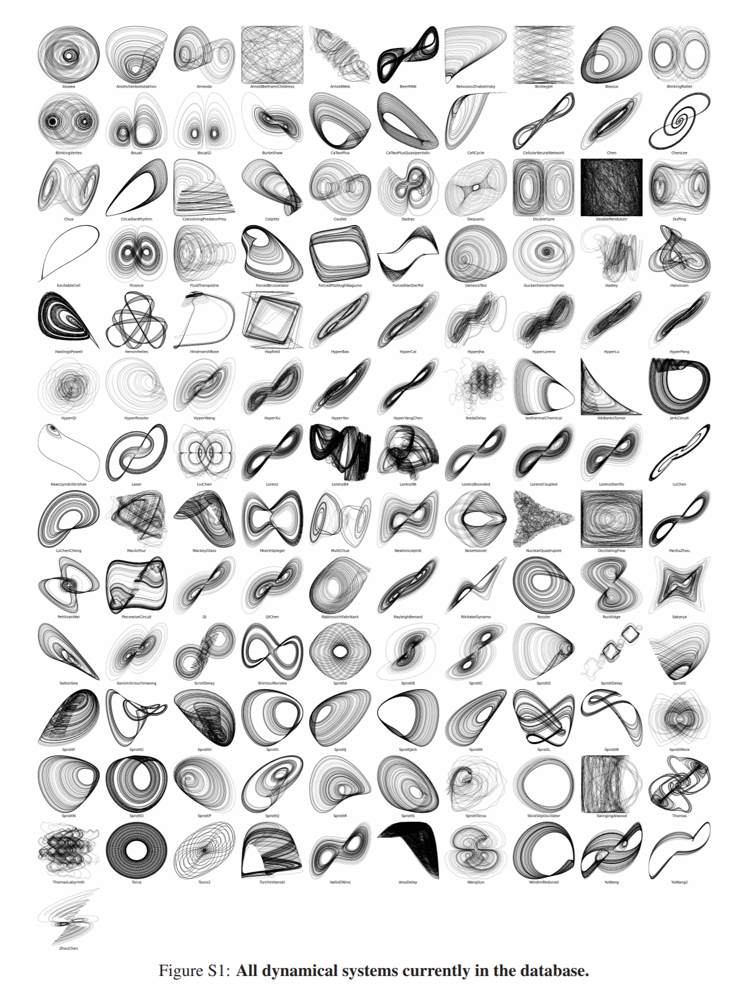

## 2021-11-03

1. [The Whisper of a Whimper of a Bang: 2400 Days of the Type Ia SN 2011fe Reveals the Decay of 55Fe](https://arxiv.org/abs/2111.01144)

   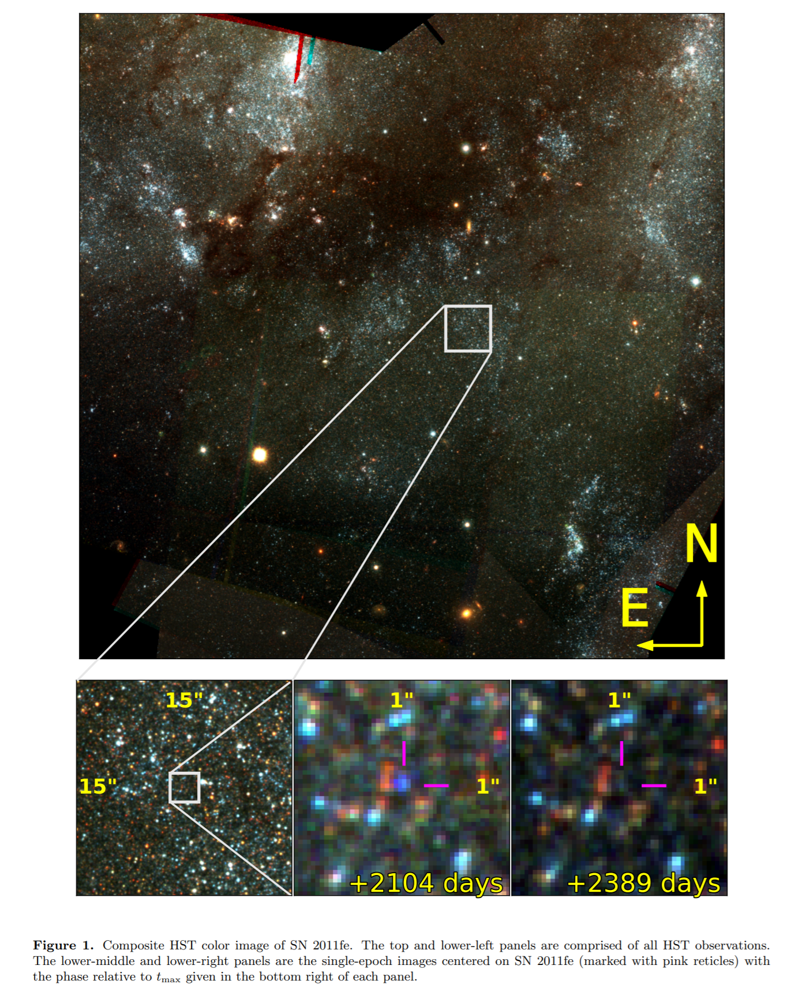

   HST对`2011fe, Ia SN`的多带测光，直到最大光度后的2400天。使用一个简单的放射性衰变模型来模拟光变曲线，发现需要$^{57}{\rm Co}$和$^{55}{\rm Fe}$的能量输入来驱动晚期的光变。
   $$
   \begin{aligned}
   &^{56}{\rm Ni}\xrightarrow{t_{1/2}=6.08d}\ ^{56}{\rm Co}\ \xrightarrow{t_{1/2}=77.2d}\ ^{56}{\rm Fe}\\
   &^{57}{\rm Ni}\xrightarrow{t_{1/2}=35.6d}\ ^{57}{\rm Co}\ \xrightarrow{t_{1/2}=271.9d}\ ^{57}{\rm Fe}\\
   &^{55}{\rm Co}\xrightarrow{t_{1/2}=17.53d}\ ^{55}{\rm Fe}\ \xrightarrow{t_{1/2}=999.67d}\ ^{55}{\rm Mn}
   \end{aligned}
   $$
   目前只有两类爆炸模型与`SN2011fe`的所有观测结果一致：

   - 一个 ${\rm low}-\rho_c,\ {\rm near}-M_{Ch}\ (1.2-1.3M_\odot)$的白矮星的延迟爆炸。
   - 一个 ${\rm sub}-M_{Ch}\ (1.0-1.1M_\odot)$的白矮星的`double detonation`。

2. [COLDz: Probing Cosmic Star Formation With Radio Free-free Emission](https://arxiv.org/abs/2111.01153)

   `Radio free-free`辐射是星系中恒星形成可靠的`tracer`之一，然而它在GHz波段比同步辐射弱一个数量级，因此用自由辐射测量恒星形成率只能局限于局域宇宙。

   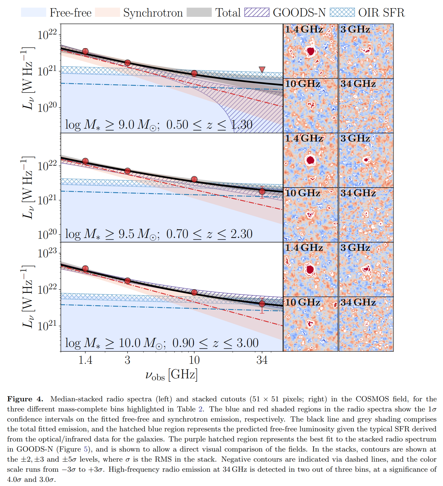

   使用VLA的$1.4-3-5-10-34\ GHz$的多频射电`stacking `，以探测宇宙恒星形成高峰期的星系的自由辐射。发现$z\sim0.5-3$的星系在静止参考系$65-90Ghz$的射电辐射比自由+同步辐射的组合预期暗2倍。文章将其解释为高频同步辐射缺失，并利用$0.5\le z\le3$的自由辐射对宇宙恒星形成历史提供了第一个约束。

3. [A gravitational and dynamical model of star formation in Orion](https://arxiv.org/abs/2111.01159)

   用Gaia EDR3的视差和自行研究`ONC`的运动。

   - 发现其中的恒星有一个年龄梯度，从最老的385pc到年轻的395pc，表明恒星形成向云层内部传播。
   - 发现中央星团有旋转特征，但是只存在于$<2Myr$的恒星中。
   - 观察到年轻恒星流入ONC引力势阱中心的i情况，这部分恒星沿着纤维分布，流出ONC的恒星则表现出球形分布，而且速度弥散较大。
   - `进一步提出了一个长期存在的问题 - 为什么ONC显示出微弱的膨胀特征，尽管处于引力束缚的状态。`这种膨胀可能是由恒星之间不稳定的N体相互作用驱动的。
   - 观测到各种低质量的恒星形成区的恒星在远至200pc的距离落入`Orion Complex`。

   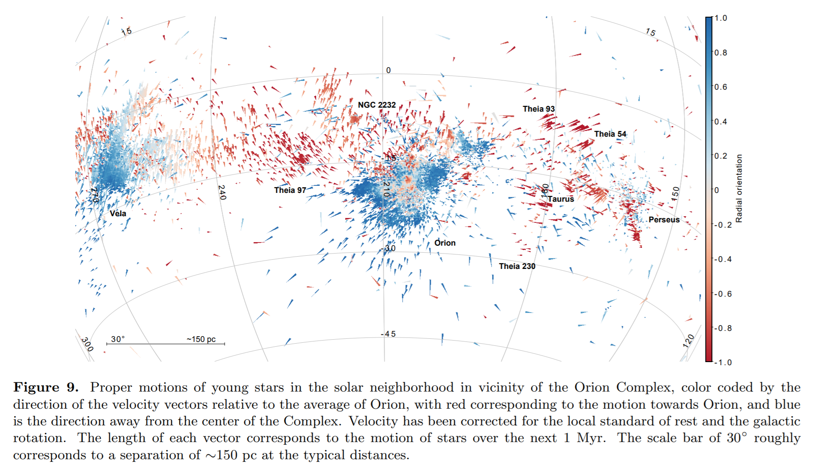

4. [Dynamics in a stellar convective layer and at its boundary: Comparison of five 3D hydrodynamics codes](https://arxiv.org/abs/2111.01165)

   通过复杂的三维流体动力学模拟预测恒星结构和演化。文章比较了物种研究恒星内部流体力学问题的代码：`FLASH`、`MUSIC`、`PPMSTAR`、`PROMPI`、`SLH`，并给出了模拟的输出结果。

5. [Age Determination of Galaxy Merger Remnant Stars using Asteroseismology](https://arxiv.org/abs/2111.01669)

   银河系是经历过几次合并后形成的。通过寻找这些外来星系的残余恒星，根据其年龄可以评估合并时间。

   星震是研究恒星如何`oscillate `和`vibrate`。所有类太阳恒星的光度时间序列的功率谱有相同的`pattern`。将这种模式分解为两个星震参数：`large frequency separation`$\Delta\nu$和`frequency at maximum power`$\nu_{max}$。星震的参数于恒星物理性质直接相关：
   $$
   \frac{M}{M_\odot}=\left[\frac{\nu_{max}}{\nu_{max,\odot}}\right]^3\left[\frac{\Delta\nu}{\Delta\nu_\odot}\right]^{-4}\left[\frac{T_{eff}}{T_{eff,\odot}}\right]^{3/2}\\
   \frac{R}{R_\odot}=\left[\frac{\nu_{max}}{\nu_{max,\odot}}\right]\left[\frac{\Delta\nu}{\Delta\nu_\odot}\right]^{-2}\left[\frac{T_{eff}}{T_{eff,\odot}}\right]^{1/2}
   $$
   根据恒星的观测参数，包括$[\alpha/Fe]$、$[Fe/H]$、$T_{eff}$、星震参数视差、测光星等等，使用`BAyesian STellar Algorithm ，BASTA`拟合出恒星的年龄。

   文章使用Gaia EDR3的运动学信息和APOGEE DR16的化学信息，选出了23颗前矮星系的红巨星。通过星震学确定其年平均年龄为$9.5^{+1.2}_{-1.3}Gyr$。将其中8颗归类为`Gaia-Enceladus/Sausage`星，这是银河系历史上最大规模的合并之一。

6. [Velocity dispersion vs cluster mass: a new scaling law with The Three Hundred clusters](https://arxiv.org/abs/2111.01724)

   `Planck Collaboration`表明`星团的数量`是其`质量`和`红移`的函数，这可以用来做宇宙学分析。但是星团的质量无法直接测量，需要通过一些`scaling law`。文章使用`The Three Hundred`的模拟星团数据，校准和速度弥散和球状星团质量之间的比例关系：
   $$
   \frac{\sigma_{200}}{{\rm km/s}}=A\left[\frac{h(z)M_{200}}{10^{15}M_\odot}\right]^{\alpha+\beta z}
   $$
   其中$A\approx1172.7$、$\alpha\approx0.357$、$\beta\approx0.029$。

7. [Milliarcsecond localisation of the repeating FRB 20201124A](https://arxiv.org/abs/2111.01600)

   使用VLBI定位FRB20201124A的宿主星系，使用的是一个临时性的阵列，这些天线也加入了EVN。两次观测中探测到18个爆发，$1\sigma$的误差为4.5亚角秒。
   $$
   {\rm baselines} = N(N-1)/2
   $$
   发现使用7个`dishes`（21baselines）和单次爆发的数据集可以做到毫角秒级定位，4个`dishes`可以做到亚角秒及定位。

   尝试了两种定位方法：脏土的峰值和高斯拟合脏图上的交叉`fringe pattern`，后者于FRB位置的便宜的平均值和标准差都更低。文章的工作将FRB20201124A定位在距离宿主星系光学中心$705\pm26mas$的位置，并于其中恒星形成有关的射电展源一致。

   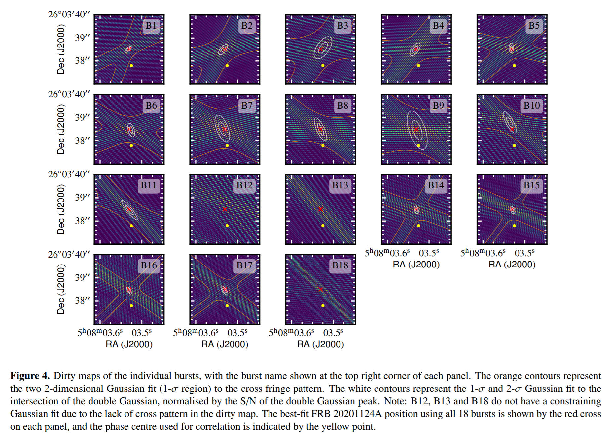

## 2021-11-04

1. [Hunting for open clusters in Gaia EDR3: 664 new open clusters found with OCfinder](https://arxiv.org/abs/2111.01819)

   使用`OCfinder`在`Gaia EDR3`中发现了663个新的疏散星团。`OCfinder`先使用`DBSCAN`找到天空中密度较为集中的区域，再使用DNN模型在`颜色-星等`图上区分是随机过密还是真实的疏散星团。

2. [The Scientific Observation Campaign of the Hayabusa-2 Capsule Re-entry](https://arxiv.org/abs/2111.02235)

   2020年12月5日17:28UTC，`Hayabusa-2`返回地球，在南澳上空进入大气层，可见53秒的火球。日本和澳大利亚合作，记录了这次事件的`光学`、`地震-声学`、`光谱`数据，使我们能够深入分析行星际物体撞击地球大气层产生的影响。

   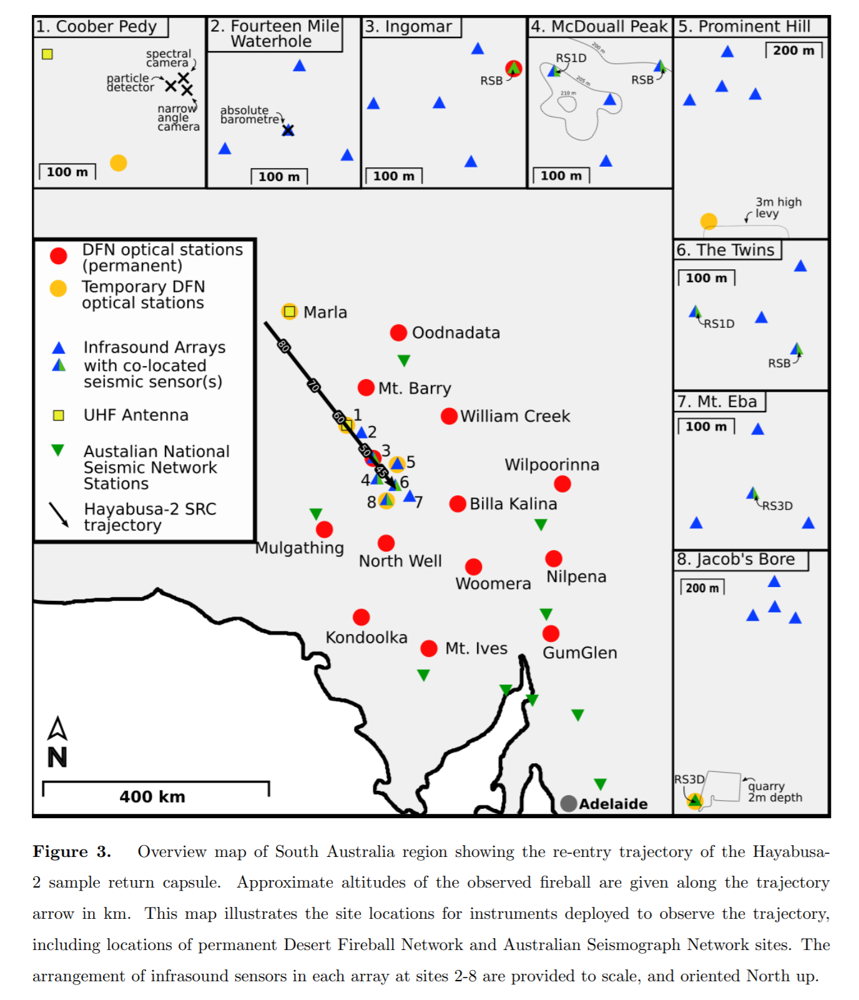

3. [Multiband Detection of Repeating FRB 20180916B](https://arxiv.org/abs/2111.02382)

   使用`uGMRT@300-500MHz`、`CHIME@400-800MHz`、`GBT@600-1000MHz`对FRB180916进行了观测。文章报告了对这个源在800-1000MHz的首次探测、低频最宽200MHz带宽的爆发探测、$30\mu s$在800MHz的窄结构。

   在一个活动周期的早期，这一FRB在高频活跃度更高。两年来，RM有所下降，DM基本不变。消DM的方法是`maximising the coherent power accross the bandwidth`，代码在[这里](https://github.com/danielemichilli/DM_phase)。

   > 代码里有用到`matplotlib.widgets`，可以用来创建交互式图像，包括矩形索引。
   
   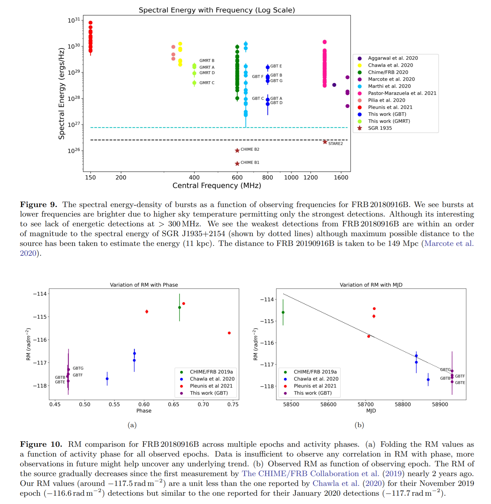

## 2021-11-05

1. [Citizen ASAS-SN Data Release I: Variable Star Classification Using Citizen Science](https://arxiv.org/abs/2111.02415)

   `Citizen ASAS-SN`是在`Zooniverse`平台上开展的超新星自动观测项目，使用新的`ASAS-SN`的g波段数据，让志愿者根据相位光变曲线对周期变星进行分类。

   在平台上给出了40640颗新的变星候选体，志愿者们确定了10420颗新发现的变星，并将其分类为4234颗脉动变星（正确率89%）、3132颗旋转变星（49%）、2923颗暗淡双星（81%）和131颗未知变星。

   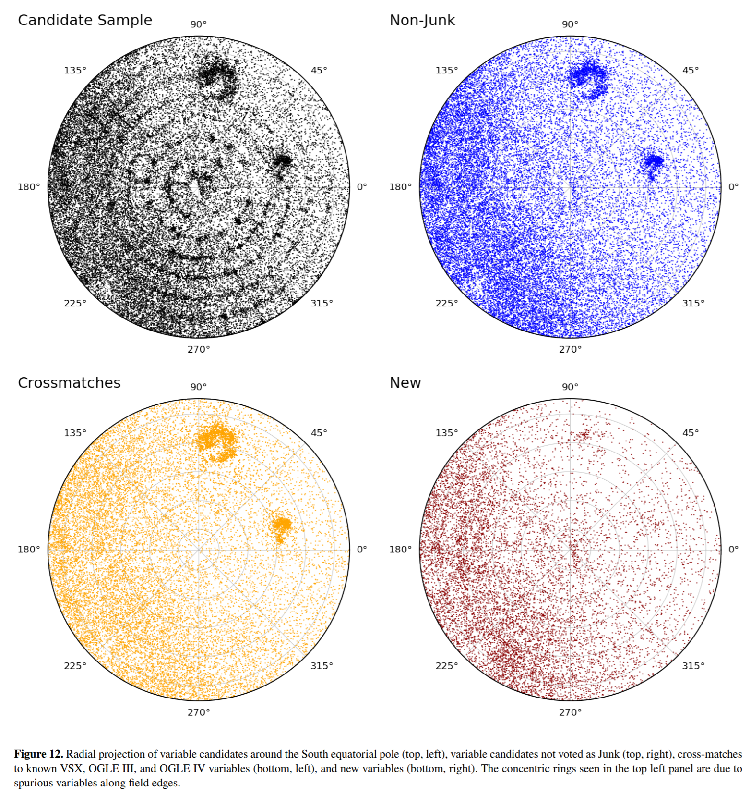

2. [prose: A Python framework for modular astronomical images processing](https://arxiv.org/abs/2111.02814)

   [prose](https://github.com/lgrcia/prose)是一个模块化的天文图像处理流程，允许用户自定义构件或者使用预设构件（测光提取等）。将`prose`与`AstroImageJ`的测光结果比对，发现前者的光变曲线有较低的白噪声和红噪声，并且需要较少的操作步骤。

## 2021-11-08

1. [Deep Radio Interferometric Imaging with POLISH: DSA-2000 and weak lensing](https://arxiv.org/abs/2111.03249)

   使用`ResNet`的基本结构，将脏图转换为分辨率更高的真实图像，同时实现`洁化`和`超分辨率`。

   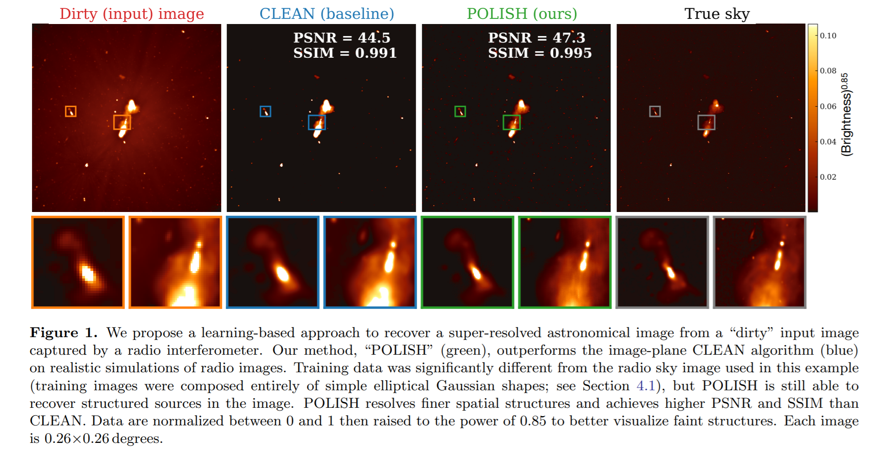

## 2021-11-09

1. [Stellar outbursts and chondrite composition](https://arxiv.org/abs/2111.03798)

   观测到的原行星盘的温度无法产生足够形成恒星的吸积率，也不足以解释`CM/CO/CV`型球粒陨石和类地行星的`volatile depletion patterns`。由高吸积率引起的恒星`outburst`可以提供必要的质量以形成恒星，并提供足够的热量来气化行星形成的材料。这样的爆发可以在1AU的距离上再现观测到的`球粒陨石`的丰度。

   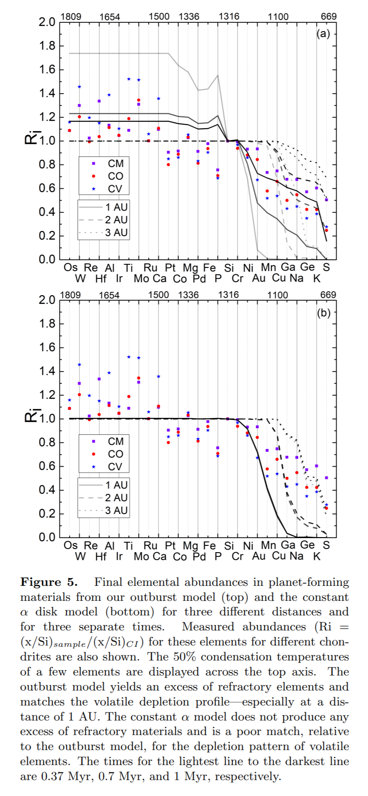

2. [Neutrino emission from FRB-emitting magnetars](https://arxiv.org/abs/2111.04121)

   FRB 200428是SGR 1935发射的，理论研究发射FRB的磁星可能发出的中微子。文章中考虑了质子加速和中微子发射在三个不同的位置：`磁层内`、`光速圆柱面外`和`远离磁层的相对论碰撞`。这三种情况都可以使质子加速到足够高的能量，与$10-200\ {\rm keV}$的X射线光子相互作用，产生中微子。中微子发射的通量随磁星半径的增加而减少。

   FRB 200428产生的中微子的通量比IceCube的灵敏度低了4个数量级。磁星在其FRB发射阶段的总中微子通量只是观测到的弥漫发射中可以忽略的一部分。

## 2021-11-10

1. [E(2) Equivariant Self-Attention for Radio Astronomy](https://arxiv.org/abs/2111.04742)

   将注意力机制加入`LeNet`来训练射电星系分类的模型，代码在[这里](https://github.com/mb010/EquivariantSelfAttention)。

   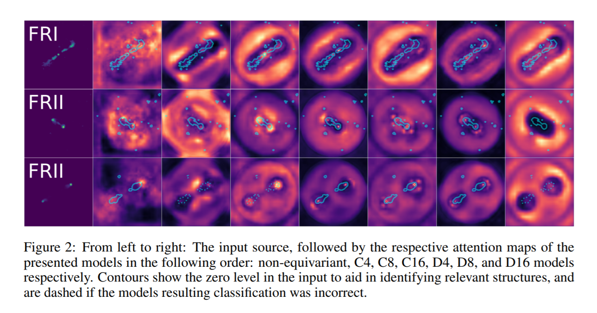

## 2021-11-11

1. [Search for an alien communication from the Solar System to a neighbor star](https://arxiv.org/abs/2111.05334)

   假设我们的银河系已经被`self-reproducing`探测器充分探测，并且探测器之间使用主星的引力透镜建立了银河系尺度的有效通信网络。

   从`Wolf 359`来看（第三近的恒星系统），地球是一颗日凌行星，意味着地球每公转一次就会穿过一次通信链路。使用`TRAPPIST-South`和`SPECULOOS-South`收集太阳系到`Wolf 359`的信号，灵敏度到$1W$，但是没有任何有效探测。

## 2021-11-12

1. [Super-resolving Dark Matter Halos using Generative Deep Learning](https://arxiv.org/abs/2111.06393)

   使用`U-Net`的变种（GAN），从低分辨率的宇宙学模拟中得到高分辨率的输出。

   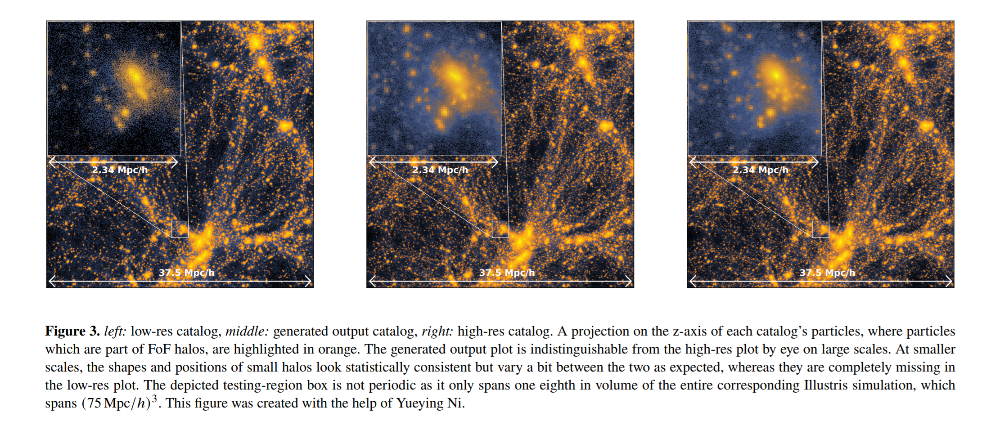

## 2021-11-15

1. [First Space-VLBI Observations of Sagittarius A*](https://arxiv.org/abs/2111.06423)

   对银河系中心超大质量黑洞的首次`地球-空间`的VLBI观测结果。使用了`RadioAstron`项目的空间望远镜`Spektr-R`和地面上20个望远镜组成的网络，在`1.35cm波长`处进行观测。基线长度达到了地球直径的3.9倍，对应的角分辨率是55mas，源处空间分辨率是$5.5\ {\rm RSch=2GM/c^2}$。

   短地面基线$<80\ M\lambda$测量与各向异性的高斯图像一致，中地面基线$100-250\ M\lambda$证实了`Sgr A*`中存在`persistent image`结构，这两个特征都符合理论上电离星际介质强散射的预期，即在短基线上`高斯散射致宽`，长基线上`折射亚结构`。在`地面空间长基线`上没有测量到干涉条纹。这一结果表明对`Sgr A*`的空间VLBI观测需要在`亚毫米波段`进行。

## 2021-11-16

1. [Identification of new M31 star cluster candidates from PAndAS images using convolutional neural networks](https://arxiv.org/abs/2111.07798)

   使用`Pan-Andromeda Archaeological Survey `已知的`M31`的星团的图像来训练一个二分类的网络，再回到[PAndAS](https://www.canfar.net/storage/list/PANDAS/PUBLIC)的原始数据集搜索新的星团。

2. [Statistical measurements of dispersion measure fluctuations of FRBs](https://arxiv.org/abs/2111.07417)

   使用CHIME的FRB目录研究`DM fluctuations`的结构函数，发现了与之前文章类似的大DM波动，但是没有显示大尺度湍流的特征。

3. [GPU-Enabled Searches for Periodic Signals of Unknown Shape](https://arxiv.org/abs/2111.07396)

   使用[supersmoother](https://github.com/mgowanlock/gpu_supersmoother)方法在GPU上搜索光变曲线周期，使用`cross-validation`来对时间序列拟合`line segments`。

4. [A new method for measuring the 3D turbulent velocity dispersion of molecular clouds](https://arxiv.org/abs/2111.07236)

   从`位置-位置-速度`图中计算分子云的三维速度弥散$\sigma_{3D}$，使用`2nd-moment`的空间平均$\sigma_i$和`梯度/旋转改正的1nd-moment`的标准差$\sigma_{\rm c-grad}$，加上一个合适的校正系数即可稳健地恢复$\sigma_{v, 3D}$，并且与云的旋转或者视线方向无关（从模拟数据中得出的结论）。
   $$
   \sigma_{v,3D}=\left[(-0.29\pm0.26)\frac fR +1.93\pm0.15\right]\sigma_{\rm p-grad}\\
   \sigma_{\rm p-grad}=\sqrt{\sigma_i^2+\sigma_{\rm c-grad}^2}
   $$

## 2021-11-17

1. [The effect of viewing angle on the Kennicutt-Schmidt relation of the local molecular clouds](https://arxiv.org/abs/2111.08072)

   `K-S relation`描述的是气体面密度和恒星形成率之间的关系。文章使用三维尘埃分布数据，计算距离太阳400pc以内的9个云的投影面积和质量的概率分布，发现观察角度对面积和质量影响很大。但是整个样本的`K-S relation`并没有受到影响，因为面积和质量的共同变化导致观测到的`平均柱密度`保持相对稳定。

2. [Automatically detecting anomalous exoplanet transits](https://arxiv.org/abs/2111.08679)

   使用`VAE`搜索光变曲线中的`outliers`，用以搜索系外行星。

## 2021-11-18

1. [Scintillation Timescales of Bright FRBs Detected by CHIME/FRB](https://arxiv.org/abs/2111.08753)

   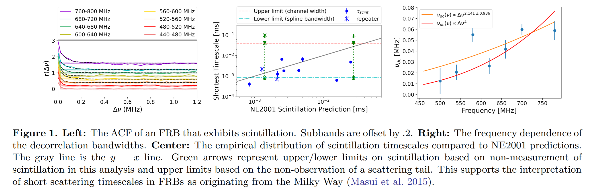

   分析CHIME的10个FRB在$4-100\ {\rm kHz}$频率带宽的闪烁特征，发现闪烁时标与NE2001对银河系闪烁时标有强烈的相关性。

2. [Evidence for dynamical changes in Betelgeuse using multi-wavelength data](https://arxiv.org/abs/2111.09218)

   参宿四在2019.10-2020.03的`dimming`的原因可能是恒星非线性动力学的改变。

3. [The updated BaSTI stellar evolution models and isochrones. III. White Dwarfs](https://arxiv.org/abs/2111.09285)

   新的[BaSTI](http://basti-iac.oa-abruzzo.inaf.it/)等龄线模型，覆盖了`碳氧白矮星`。

## 2021-11-19

1. [Milky Way total Mass derived by Rotation Curve and Globular Cluster kinematics from Gaia EDR3](https://arxiv.org/abs/2111.09324)

   使用`action-based`分布函数的动力学模型估计银河系的总质量和密度分布。并模拟和LMC对MW质量测量的影响。估计的银河系总质量在
   $$
   5.36^{+0.81}_{-0.68}\sim7.84^{+3.08}_{-1.97}\times10^{11}\ M_\odot
   $$
   这使得太阳附近暗物质的密度是$0.34\ GeV/cm^3$。

2. [Three aspects of the radius-to-frequency mapping in fast radio bursts](https://arxiv.org/abs/2111.09548)

   讨论FRB在磁星上辐射半径和频率的关系，得到了漂移率的频率依赖$\dot\nu\propto\nu^{1+1/\alpha}\rightarrow\nu^3$和时间尺度。磁力线的扭曲可能导致两个方向的漂移。对于同一个FRB，在较低的频率下，爆发的宽度较大。对FRB，重复暴的磁场可能比非重复暴强，爆发宽度也要更宽。

   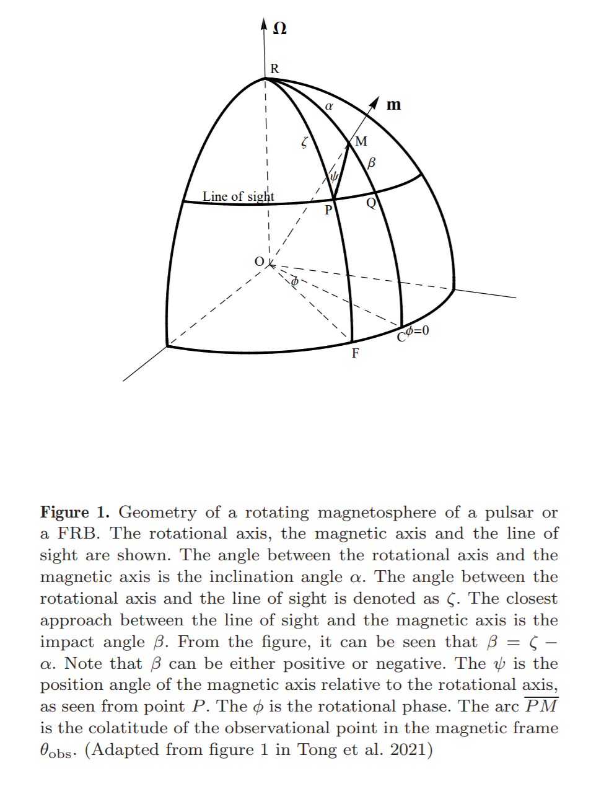

## 2021-11-22

1. [Toward a direct measurement of the cosmic acceleration: the first attempt with FAST](https://arxiv.org/abs/2111.10240)

   `HI 21cm`系统的`Damped Lyman-$\alpha$ Absorber`是通过`Sandage-Loeb Test`直接测量宇宙加速度的理想探针。在FAST调试过程中对两个DLA的观测中提取到了21cm的吸收特征，最高的频率分辨率达到了100Hz，给出的红移约束为$z=0.24671595 \pm 0.00000015$，红移误差仍比理论上宇宙加速度大三个量级。为此，需要优化多普勒校正、精确记录时间、信噪比高的DLA样本、速度不确定度的标准、去干扰。

## 2021-11-23

1. [Radio Frequency Interference Mitigation and Statistics in the Spectral Observations of FAST](https://arxiv.org/abs/2111.11018)

   给出了FAST现在完整的RFI列表。

2. [Arecibo observations of a burst storm from FRB 20121102A in 2016](https://arxiv.org/abs/2111.11282)

   用AO在2015年12月-2016年10月的59个小时的观测中，探测到478个FRB121102的爆发。这些爆发在`能量-宽度`的空间中分成两团，发现低能量的爆发的持续时间要更长。能谱用幂律拟合，在高能下变平了。

## 2021-11-24

1. [Fink: early supernovae Ia classification using active learning](https://arxiv.org/abs/2111.11438)

   [`Fink`](https://fink-portal.org/)使用`主动学习`分类早期Ia型超新星，流程包括三个阶段：`特征提取`、`分类`和`学习策略`。数据集是来自ZTF的23840个警报，其中1600个是Ia型超新星。训练从10个警报的初始样本开始（10个Ia），迭代300次，分类器可以做到89%的精确度。文章结果表明主动学习策略在构建分类器的训练样本中的有效性。

2. [A fast radio burst source at a complex magnetised site in a barred galaxy](https://arxiv.org/abs/2111.11764)

   北大的FRB20201124A的文章，与我有关。

## 2021-11-25

1. [Phenomenological classification of the Zwicky Transient Facility astronomical event alerts](https://arxiv.org/abs/2111.12142)

   [`ACAI`](https://github.com/dmitryduev/acai)作为 ZTF警报事件分类器，使用五种二元分类器来描述数据的特征。

   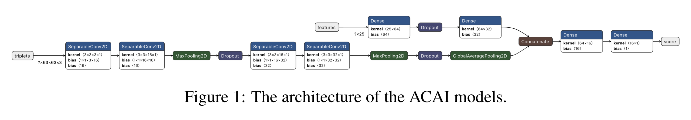

2. [Disintegrating Exoplanets: Creating Size Constraints by Statistically Peering Through the Debris](https://arxiv.org/abs/2111.12688)

   `Kepler-1520b`和`K2-22b`是两颗被恒星撕碎的行星，喷出的灰尘和碎片从它们的表面拉出尾巴，在轨道上时隐时现。通过假设光变曲线是`高斯光子噪声`和`Raleigh astrophysical`的卷积，来约束系外行星的半径。但是由于`forward scattering`主导了尘埃消光而无法约束半径。

## 2021-11-26

感恩节停更。

## 2021-11-29

1. [Estimate of the Background and Sensitivity of theFollow-up X-ray Telescope onboard Einstein Probe](https://arxiv.org/abs/2111.12976)

   `EP`两种科学载荷，宽视场X射线望远镜`WXT`和后随观测X射线望远镜`FXT`。文章使用`Geant4`模拟`FXT`的背景噪声，对于曝光时间为25分钟的点观测，在$0.5-2\ \rm KeV$可以达到几个$\mu\rm crab$的灵敏度，也就是$10^{-14}\rm erg\ cm^{-2}\ s^{-1}$，在$2-10\ \rm KeV$可以达到10几个$\mu\rm crab$的灵敏度。

2. [Search for the metal-weak thick disk from the LAMOST DR5](https://arxiv.org/abs/2111.12859)

   使用LAMOST DR5和Gaia EDR3建构了一个包含46109颗日心距离$d\le4kpc$的巨星样本，在$[Fe/H]$和$[\alpha/Fe]$的图中，厚盘由两个不同的成分组成，有不同的化学性质。

   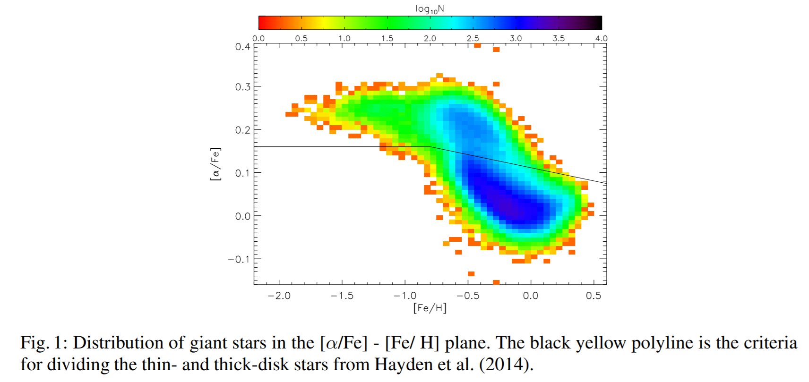

## 2021-11-30

1. [A Convolutional Autoencoder-Based Pipeline for Anomaly Detection and Classification of Periodic Variables](https://arxiv.org/abs/2111.13828)

   使用`Convolutional AE`识别ZTF中分布异常的`周期性变星`，使用`孤立森林`对编码出的特征进行异常值检验，发现异常的大多是 `不规则进化的恒星`，多波段观测表明可能是`红巨星或者渐近巨星支`。

   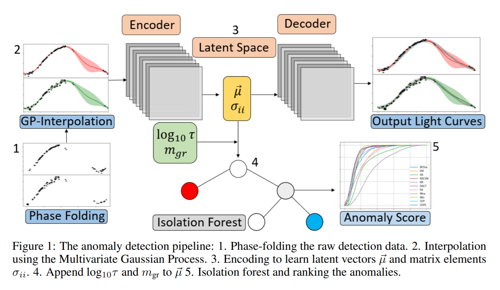

2. [Search for Low-Energy Signals from Fast Radio Bursts with the Borexino Detector](https://arxiv.org/abs/2111.14500)

   使用`Borexino`数据搜索与FRB相关的中微子事件，时间在对应的爆发的$\pm1000\ s$之内，在$0.5-50\ MeV$的中微子能量范围内，没有观察到高于背景的中微子通量。

3. [Lensing Without Borders. I. A Blind Comparison of the Amplitude of Galaxy-Galaxy Lensing Between Independent Imaging Surveys](https://arxiv.org/abs/2111.13805)

   `弱引力透镜`用遥远星系图像被前景质量分布引起的微小形变中的相干性来重构质量分布。2010年左右，弱引力透镜开始成熟，出现了若干巡天项目，但是不同项目给出的结果一致嘛？可信嘛？有没有系统偏差？是这个`弱引力透镜无国界`的组织想回答的问题。

   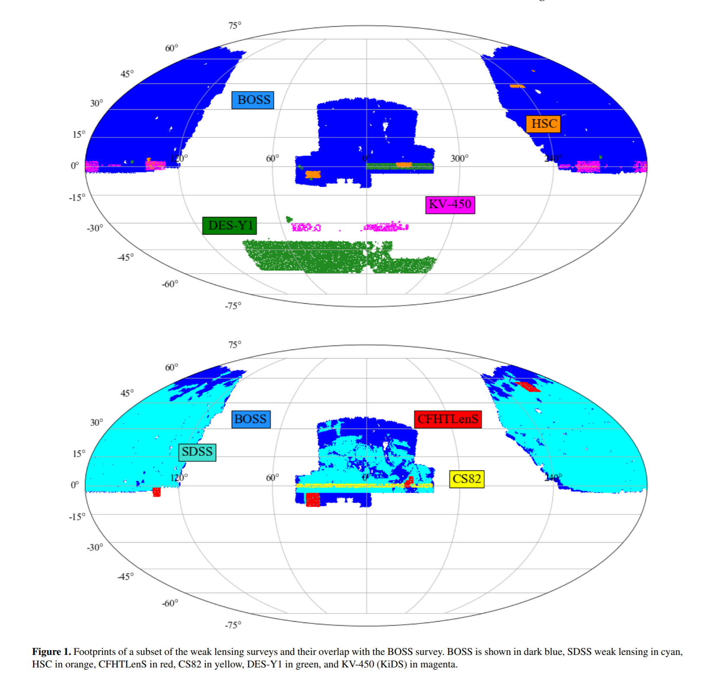

   文章考虑了当前6个最重要的弱引力透镜巡天项目，用同一组前景透镜星系作为基准，比较不同项目给出的透镜信号。这6个项目的`天区覆盖`、`使用设备`、`观测深度`、`数据处理分析方法`、`剪切量测量校准方式`、`测光红移估计方法`都有差别，但对同一族前景透镜星系给出的透镜信号整体上比较一致。

   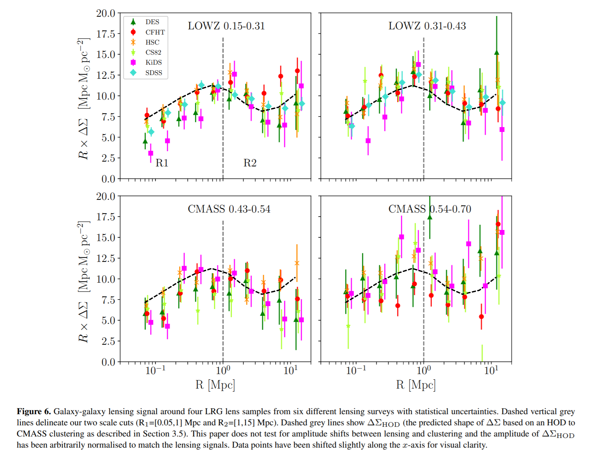

   系统差异在$2\sigma$左右，符合我们对这些巡天本身局限性的期待。不过这些比较也展示出了一些比较明确的系统问题：在一定的红移以上，`巡天观测的深度`和`所处天区的恒星密度`都对弱引力透镜分析有系统影响。

   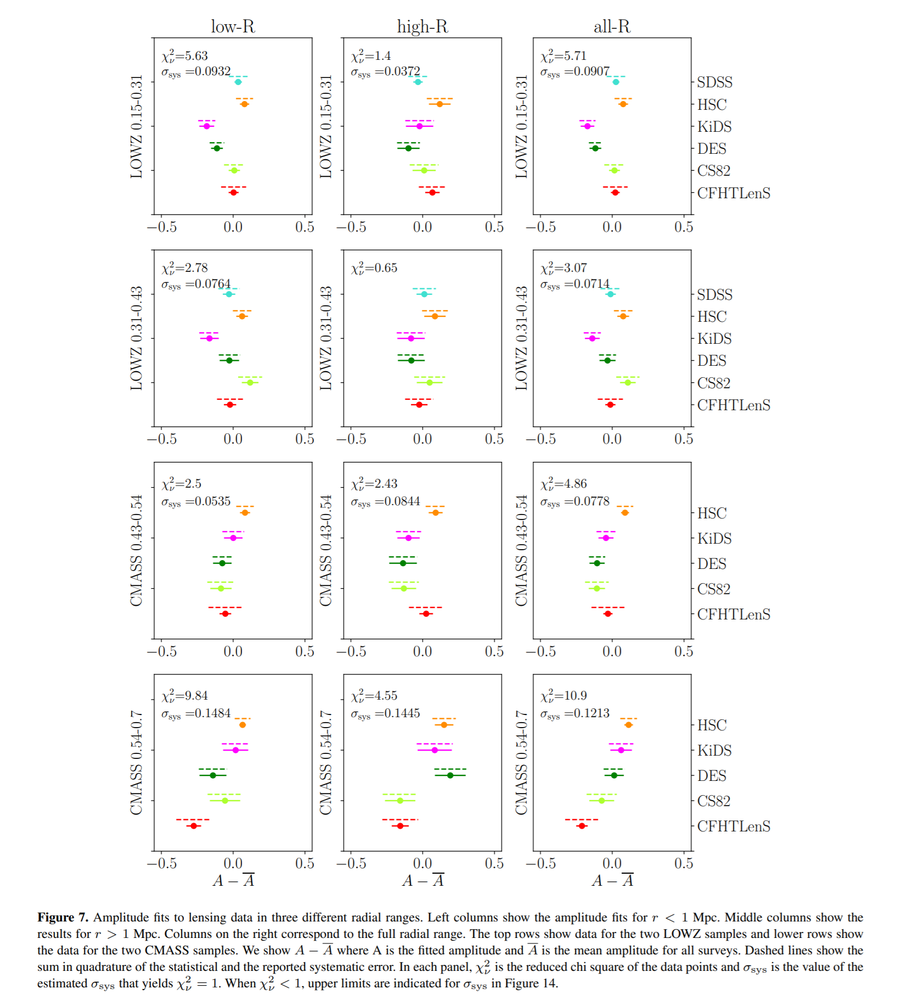

   这些结果对未来的弱引力透镜巡天数据分析有重要的指导意义。

4. [Magnetic Fields in the Milky Way and in Galaxies](https://arxiv.org/abs/1302.5663)

   宇宙中大部分物质都是电离的，磁场很容易产生，并且由于没有磁单极，磁场极难破坏。河外星系的现有数据可以用发电机的`场放大`和`排序`来解释。场强和场型与弥漫电离气体的流动模式的相似性说明了银河系磁场在动力学上的重要性，可能会影响旋臂的形成、外流和星系的总体演化。

   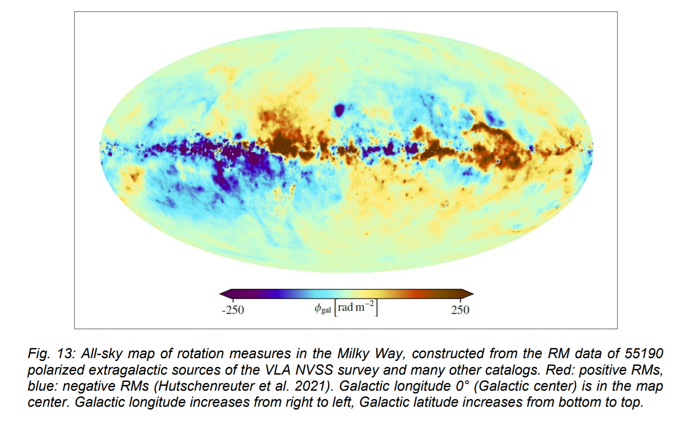

   文章是一片综述，描述银河系磁场的起源、观测等一系列问题。上图是全天RM的分布，文中一图。

