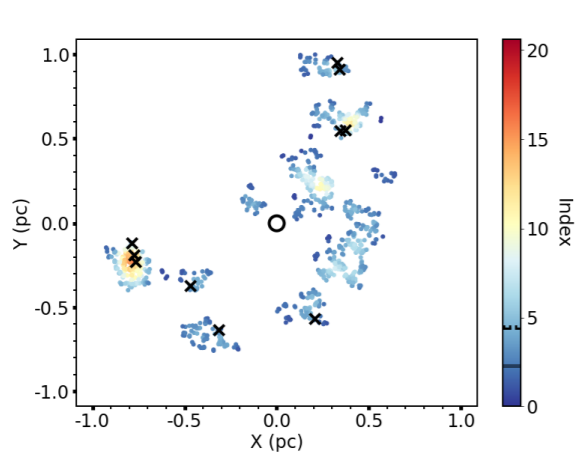
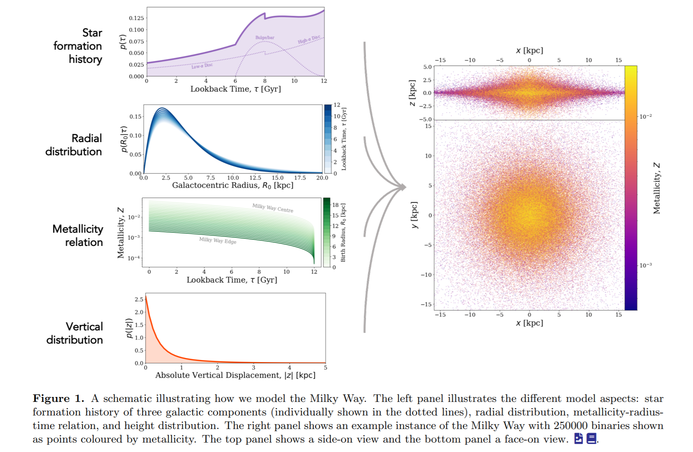
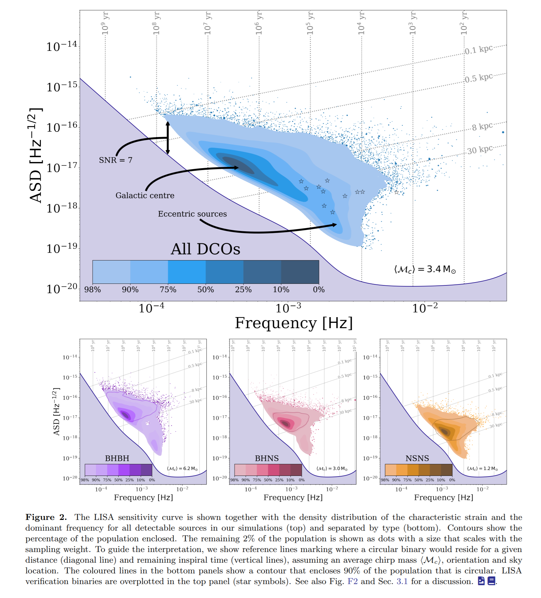
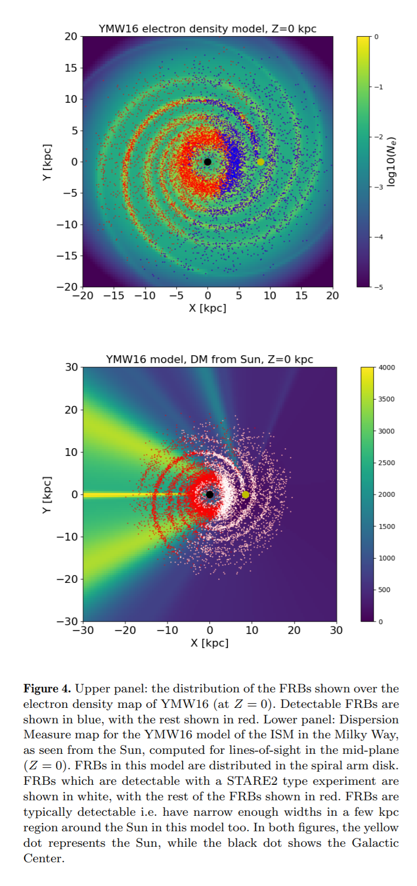
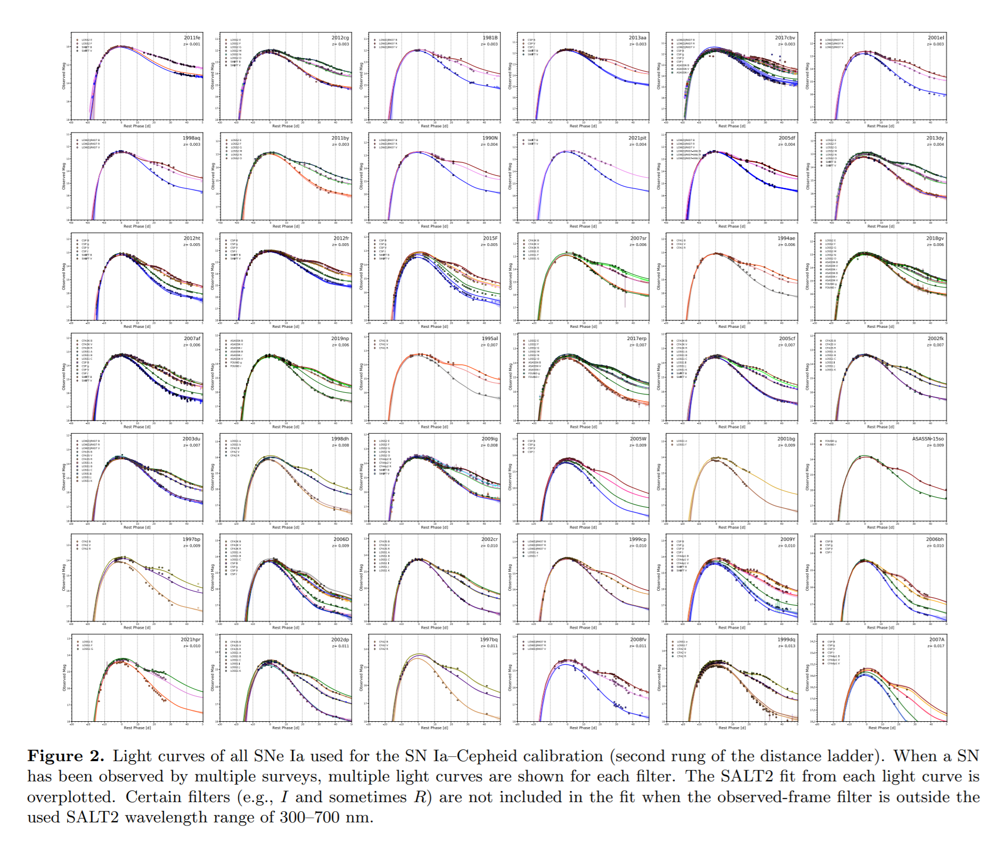
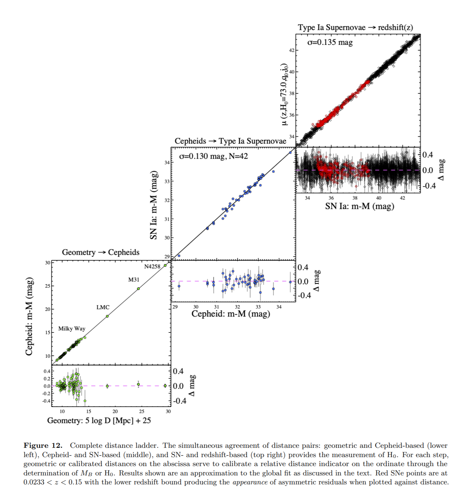
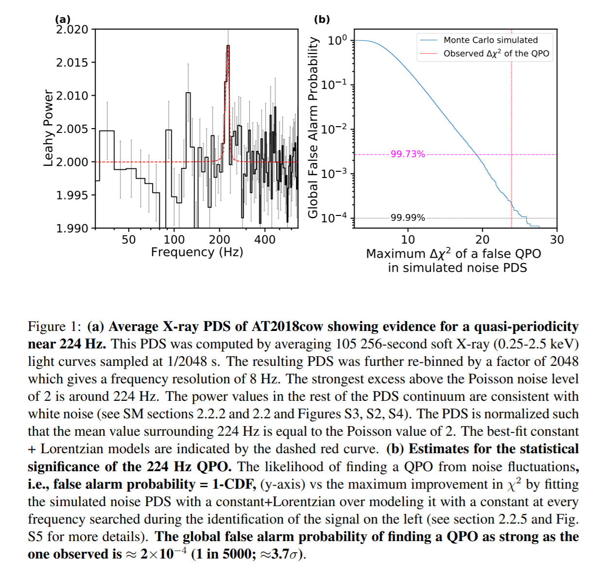

## 2021-12-01

1. [An Isolated White Dwarf with a 70 second Spin Period](https://arxiv.org/abs/2111.14902)

   发现了一个自转周期为$70.32\pm0.04\ s$的孤立白矮星`isolated white dwarf`，在`BG40`滤光片中表现出29%的光度变化，在`SDSS`中的编号为`SDSS J221141.80+113604.4`，这是目前已知的旋转最快的孤立白矮星。它的`质量大`、`转速快`、`磁场强`、`大气成分不寻常 - 氢氦混合大气`以及相对于其冷却年龄`较大的切向速度`，这意味着其可能是双白矮星合并后的产物。

2. [Investigating the structure of star-forming regions using INDICATE](https://arxiv.org/abs/2111.15435)

   `INDICATE`用于量化一个区域每颗恒星属于某一星团的程度，并确定这种程度是否高于恒星形成区的随机期望值。但是这种方法不能用于量化一个区域的整体结构。

   这个方法。先找到一群恒星在笛卡尔坐标系中的边界，取边界画立方体，在这个立方体中根据恒星数密度随机产生新的恒星。计算真实恒星与生成恒星之间最近的距离（比如与恒星最近的五颗生成恒星的距离的最大值），取所有恒星这一距离的平均值，并重新计数这一半径内的恒星数量$N_{\bar r}$
   $$
   I_j=N_{\bar r}/N
   $$
   

3. [Gravitational wave sources in our Galactic backyard: Predictions for BHBH, BHNS and NSNS binaries detectable with LISA](https://arxiv.org/abs/2111.13704)

   文章通过致密双星的演化算法结合银河系结构形成、恒星形成历史、化学演化历史的模型来模拟

   

   看LISA能够在4-10年的人物事件里探测到多少不同类型的双致密天体

   

   目前我们对于双致密天体的形成和演化还知之甚少，模拟用到了很多假设，结果也有很大的不确定性。按照文章的预测，LISA在10年的时间里能探测到的双黑洞在9到238个之间，中子星-黑洞对在3-289个之间，双中子星系统在4-57个之间，而数量预测的不确定性在两个数量级左右。文章数据在[这里](https://doi.org/10.5281/zenodo.4699712)，代码在[这里](https://github.com/TomWagg/detecting-DCOs-in-LISA)。

## 2021-12-02

1. [Constraints on the production of phosphine by Venusian volcanoes](https://arxiv.org/abs/2112.00140)

   火山活动有可能是金星磷化氢的来源。深层地幔磷化物直接喷发是不现实的，但较浅的物质可能被喷发到地表。有效的将物质运输到云层的爆炸性喷发需要`海洋：岩浆`相互作用或`水合海洋`地壳的俯冲，但这两种情况在现代金星上都不存在。

   因此，将喷发的物质运送到与观察到的$PH_3$一致的高度似乎非常低效的，要解释云层中$1{\rm ppb}$的浓度，至少需要$21,600\ km^3/year$的喷发量，这比历史上的任何火山喷发率都要大，并且会产生一些可以探测的后果。

## 2021-12-03

1. [Why haven't the observed high-frequency QPOs been produced by (MHD) computer simulations of black hole accretion disks?](https://arxiv.org/abs/2112.01415)

   将[Wagoner & Tandon (2021)](https://iopscience.iop.org/article/10.3847/1538-4357/ac1868/meta)的一些预测与[Reynolds & Miller (2009)]()的`MHD`数值模拟进行比较，看来，MHD模拟的运行时间不够长，数值阻尼也不够小，无法产生观察到的`高频QPOs`。

## 2021-12-06

1. [Could TDE outflows produce the PeV neutrino events?](https://arxiv.org/abs/2112.01748)

   超高能中微子的起源缺乏观测证据，也不知道其物理机制。`IceCube-191001A`与其之前6个月被探测到的光学潮汐瓦解事件`TDE AT2019dsg`相关联。数值模拟和观测结果表明，TDE可以产生超快的外流与超大质量黑洞附近的云层相互作用，产生的激波中质子可以被加速到$\sim60\ {\rm PeV}$，外流速度为$0.07c$，动能光度为$10^{45}{\rm erg/s}$。`PeV`中微子可以由强子反应产生。从TDE中心逃出的外流与云层碰撞可以自然地解释半年的时间延迟。

## 2021-12-07

1. [Audio Universe Tour of the Solar System: using sound to make the Universe more accessible](https://arxiv.org/abs/2112.02110)

   太阳系数据转换为声音，比如“听着行星出现在欧南台的望远镜上”，代码在[这里](https://github.com/james-trayford/strauss)。

2. [Detecting Fast Radio Bursts in the Milky Way](https://arxiv.org/abs/2112.02233)

   评估了一系列ISM模型、空间分布和光度函数，银河系中可以被`STARE2`探测到的FRB事件的比例。由于ISM的散射，只有一部分可以被探测到。

   

## 2021-12-08

1. [Searching for Anomalies in the ZTF Catalog of Periodic Variable Stars](https://arxiv.org/abs/2112.03306)

   跟`2021-11-30`第一篇是一样的文章，不知道为什么换作者了。

2. [Constraining Primordial Black Hole Dark Matter with CHIME Fast Radio Bursts](https://arxiv.org/abs/2112.03721)

   FRB的强引力透镜被认为是对原始黑洞暗物质的一种相对干净的探针。使用本征的爆发宽度和每个FRB的`flux-ratio threshold`计算PBH暗物质的界限。

## 2021-12-09

1. [A New Classification Model for the ZTF Catalog of Periodic Variable Stars](https://arxiv.org/abs/2112.04010)

   给ZTF的周期变星`Chan et al. 2021`训练一个分类模型，使用`convolutional-VAE`和`hierarchical random forest`，源的标签与SIMBAD交叉匹配，得到$31541$个匹配成功的源。分成两层13类。

   - Active Galactic Nuclei-like objects (AGNL, including blazars and quasars)
   - Cepheids (CEP)
   - Eclipsing binaries (EB)
   - Long-period variables (LPV)
   - Mira variables (Mira)
   - RR Lyraes (RR)
   - Catch-all categories of other pulsating variables (Puloth)
   - Peculiar types (Pec).
     - Carbon stars (C-Type), horizontal branch stars (HB), red giant branch stars (RGB), S-Type stars (S-Type), young stellar object-like (YSOL), and other variables (Voth).

   为了解决训练集不平衡的问题，使用`imbalanced-learn`，表现数据可以从[这里](https://zenodo.org/record/5764899)获得。

2. [The Pantheon+ Type Ia Supernova Sample: The Full Dataset and Light-Curve Release](https://arxiv.org/abs/2112.03863)

   `Pantheon+`是`SH0ES`团队从18个不同时期的SNIa项目给出的1701个超新星的多波段光变曲线。`Pantheon+`样本背后的观测数据涉及了`25个不同的测光系统`和`105个不同的滤光片`。为了保证测光系统定标的可靠性，最新的Pantheon+样本建立了一个模型同时去拟合所有这些测光系统之间的偏差，生成了非常壮观的协方差矩阵，这样每个不同的项目在宇宙学参数测量上的系统误差都可以估计。按照文章的估计，Pantheon+可以把`暗能量`的状态方程参数限制到3%的水平上，并且给出误差在 $1 \rm km/s/Mpc$ 水平的哈勃常数限制。数据和文章发布在[这里](https://pantheonplussh0es.github.io/)。

   

## 2021-12-10

1. [A Comprehensive Measurement of the Local Value of the Hubble Constant with 1 km/s/Mpc Uncertainty from the Hubble Space Telescope and the SH0ES Team](https://arxiv.org/abs/2112.04510)

   使用`HST`测量了$z<0.01$的所有合适的`SNe Ia Cepheids`造父变星样本，计算出的哈勃常数为$H_0=73.04\pm1.04\ \rm km/s/Mpc$，和Planck微波背景辐射的测量的偏差接近$5\sigma$。也即局域宇宙的哈勃常数要大于宇宙学途径测量的哈勃常数，造成这一差异的原因尚未可知。

   

2. [The design and implementation of GECAM satellite payload performance monitoring software](https://arxiv.org/abs/2112.04775)

   `The Gravitational wave high-energy Electromagnetic Counterpart All-sky Monitor (GECAM)`是引力波高能电磁对应体全天监测器，今天arXiv贴了一堆关于这个卫星的文章，高能所的卫星，也叫做“怀柔一号”。这个卫星主要是为了发现对应引力波的`伽马射线暴`。

3. [Evidence for a Compact Object in the Aftermath of the Extra-Galactic Transient AT2018cow](https://arxiv.org/abs/2112.04531)

   `The brightest Fast Blue Optical Transients (FBOTs)`，是一类新的天体物理现象，来自银河系外，尚未可知其起源。它们在不到一周的时间内达到最大光度，并在几个月内光度下降，大质量恒星塌缩无法解释，因为大质量恒星是由`镍-56`驱动的，演化更慢。

   文章描述了一个`FBOTs`源的软X射线辐射存在准周期振荡的证据，频率为$224Hz$，也即$4.4ms$，显著性$3.7\sigma$，在60天内持续了10亿个周期。高频的QPOs证明`AT2018cow`是一个致密天体，可能是小于$850M_\odot$的中子星或者黑洞。

   

    Power Density Spectrum，功率谱是傅里叶变换得到的。记光子到达的时间序列为$x(t)$，定义均值和自相关函数为时间平均值：
   $$
   \mu_x=\lim_{T\rightarrow\infty}\frac1{2T}\int_{-T}^{T}x(t)dt\\
   \phi_{xx}(\tau)=\lim_{T\rightarrow\infty}\frac1{2T}\int_{-T}^{T}x(t)x(t+\tau)dt
   $$
   由于自相关函数$\phi_{xx}(\tau)=\phi_{xx}(-\tau)$，则PDS可以写为：
   $$
   P_{xx}(f)=2\int_0^\infty\phi_{xx}(\tau)\cos(2\pi f\tau)d\tau=\lim_{T\rightarrow\infty}\frac{|X(f)|^2}{2T}\\
   X(f)=\lim_{T\rightarrow\infty}\int_{-T}^Tx(t)e^{-i2\pi ft}dt
   $$
   

   详细内容可见[X-Ray Power Density Spectra of Black Hole Binaries: A New Deadtime Model for the RXTE PCA](https://citeseerx.ist.psu.edu/viewdoc/download?doi=10.1.1.424.1542&rep=rep1&type=pdf)。

## 2021-12-13

1. [Lecture notes on inflation and primordial black holes](https://arxiv.org/abs/2112.05716)

   关于`single-field inflation`和`原初黑洞`的讲义，课程在[这里](https://agenda.infn.it/event/24368/)。`原初黑洞`是由`single-field inflation with ultra-slow-roll`结束时留下的密度涨落产生的。

## 2021-12-14

1. [Synchronous Satellites of Venus](https://arxiv.org/abs/2112.06313)

   长期以来，人们认为金星的同步卫星是不稳定的。文章使用`Poincare's surface of section`技术表明，在金星的`Hill sphere`外运行的同步卫星在几个世纪里是相当稳定的。

## 2021-12-15

1. [The Fast Radio Burst-emitting magnetar SGR 1935+2154 -- proper motion and variability from long-term Hubble Space Telescope monitoring](https://arxiv.org/abs/2112.07023)

   使用HST从2021年6月开始对`SGR 1935+2154`做观测，亮度与之前相比亮了$1.5-2.5$倍，在分钟到小时的时间尺度上没有检测到`近红外波段`的明显变化，同时X射线波段表示这个源处于宁静状态。测量的到的自行速度为$3.1\pm1.5 {\rm mas/yr}$，自行方向表明其起源非常接近`SNR G57.2+08`的几何中心。

   若采用其距离为$6.6\pm0.7{\rm kpc}$，则切向速度为$97\pm48{\rm km/s}$，则这一速度是磁星中`启动速度`最低的。另外一点，在整理现有的少数磁星启动速度时，发现其分布与普通脉冲星启动速度分布完全一致。

## 2021-12-16

1. [Multi-wavelength quasi-periodic pulsations in a stellar superflare](https://arxiv.org/abs/2112.07734)

   `KIC 8093473`是一颗`M3V`类型的恒星，在对其`White Light`和`Soft X-ray`的观测中，探测到了一个超级耀斑，比已知的太阳耀斑强1000倍。并在`WL`和`SXR`波段分别发现了3小时和1.5小时的QPP，这是第一次在热辐射和非热辐射中同时分析恒星耀斑中的振荡过程，传统上认为这些振荡过程分别来自恒星的色球层和日冕。

   太阳耀斑按照`软X射线`分类，一次X级耀斑的亮度是$10^{-4}{\rm W/m^2}$，按各向同性假设，推算到太阳上亮度为$2.8\times10^{26}{\rm erg/s}$，亮1000倍即$2.8\times10^{29}{\rm erg/s}$，太阳黑体辐射的亮度为$3.8\times10^{33}{\rm erg/s}$。一个$10^{40}{\rm erg}$的快速射电暴相当于太阳一个月内释放的能量。地球所有水总质量（包括所有相存储在任何地方的水）为$1.4\times10^{21}\rm kg$，海水总质量为$1.35\times10^{21}{\rm kg}$，太阳1s释放的能量足够把海水烧开9次（比热容4000，室温20度），一个快速射电暴可以把海水烧开`两千三百万`次。

2. [Principles of Gravitational-Wave Detection with Pulsar Timing Arrays](https://arxiv.org/abs/2112.08064)

   总结了脉冲星计时阵探测引力波的基础知识，以及最近主要脉冲星计时阵的结果。

## 2021-12-17

1. [Revealing the Field Sub-subgiant Population Using a Catalog of Active Giant Stars and Gaia EDR3](https://arxiv.org/abs/2112.09100)

   `Sub-subgiant stars, SSG`，亚次巨星是赫罗图中位于亚巨星/巨星支下方，即相比于正常的巨星又红又暗。这个区域并没有被标准的恒星演化轨迹填充。这样的恒星存在的一种假设是，由于近距离双星中`tidal synchronization`，潮汐锁定导致亚巨星/巨星快速旋转，产生的强磁场抑制了对流，产生了大的星斑，半径膨胀，使平均表面温度和光度降低。

   将巨双星`RS CVns`目录与Gaia EDR3交叉匹配，筛选出在`14Gyr`、`金属丰度高`的等龄线下方的恒星作为SSG候选，共有448颗，其中大部分周期很短，与已知的SSG旋转周期2-20天相符。说明SSG只是`RS CVns`系统演化过程中的一个正常阶段。

## 2021-12-20

1. [Future radioisotope measurements to clarify the origin of deep-ocean 244Pu](https://arxiv.org/abs/2112.09607)

   在地球深海沉积物中发现了$^{244}Pu$，`spanning`过去$10 {\rm Myr}$，这期间附近有超新星的两个$^{60}Fe$的脉冲。$^{244}Pu$是`r-process`过程的产物之一，但不知其是在超新星中产生的，还是更早期的千新星中产生的。可以通过测量其它`r-process`产生的放射性同位素，如深海或者月岩中的$^{129}I$和$^{182}Hf$。

## 2021-12-21

1. [Sudden discharge of young charged magnetars as a new model for FRBs](https://arxiv.org/abs/2112.09782)

   快速射电暴模型，带电的年轻磁星突然放电，由断裂产生的强电场和磁重联加速粒子产生曲率辐射。在总电荷量为$\sim10^{20}C$时，放电和发射的时间尺度是几毫秒，相干脉冲的总发射功率为$P_{tot}\sim10^{42-43}\ \rm erg/s$，频率范围也与观测一致。但无法解释事件率等其它一系列内容。

2. [Luminosity functions consistent with a pulsar-dominated Galactic Center Excess](https://arxiv.org/abs/2112.09699)

   银河系中心区域有`GeV`量级的伽马射线过剩可能是新的毫秒脉冲星群导致的。将这个星群的`几种光度函数`与过剩的通量进行比较，解释这一现象需要的脉冲星总数在$O(10,000-100,000)$之间。

## 2021-12-22

1. [The initial mass function of stars and the star-formation rates of galaxies](https://arxiv.org/abs/2112.10788)

   是《星系的恒星形成率》一书的第二章，`ISBN 9781107184169`。星系的恒星形成率是星系演化的一个重要制约因素，SFR的探针受到恒星质量分布`IMF`的影响。大质量恒星主导星系光度，低质量恒星主导恒星数量，会导致星系气体增加率和气体消耗时间尺度的错误。

   在这一章中，讨论`IMF`和`gwIMF`的基本属性，以及由测量和理论表明`IMF`的系统变化，以及对星系的SFR的影响。

2. [FETCH: A deep-learning based classifier for fast transient classification](https://arxiv.org/abs/1902.06343)

   去年的一个用来做FRB数据分类的网络，简单的CNN，只能做候选体的分类，输入是`时间-频率`和`时间-色散`的数据。

   这是一个所谓的[The Petabyte FRB Search Project](https://github.com/thepetabyteproject)的一部分，其中有一个项目用来做[FBR单脉冲拟合](https://github.com/thepetabyteproject/burstfit)的，有多个参数，包括`中心频率`、`频率带宽`、`到达时间`、`DM`、`峰值流量`、`散射时标`、`宽度`。似然函数是
   $$
   \begin{aligned}
   \mathcal F(f,t | S,\mu_f,\sigma_f,\mu_{DM},\sigma_t,\tau_{sc})&=S\times2.355\sigma_f\times\mathcal{P}_f(t|\mu_{DM},\sigma_t,\tau_{sc})\times\mathcal{G}(f|\mu_f,\sigma_f)\\
   
   \mathcal{G}(f|\mu_f,\sigma_f)&=\frac{1}{\sigma_f\sqrt{2\pi}}\exp\left(-\frac12\frac{(x-\mu_f)^2}{\sigma_f^2}\right)\\
   
   \mathcal{P}_f(t|\mu_{DM},\sigma_t,\tau_{sc})&=\frac{1}{2\tau_{sc}}\left\{1+\erf\left[\frac{t-(\mu_{DM}+\sigma_t^2/\tau_{sc})}{\sigma_t\sqrt2}\right]\right\}\\
   &\quad\ \times\exp\left(\frac{\sigma_t^2}{2\tau_{sc}^2}\right)\times\exp\left(\frac{t-\mu_{DM}}{\tau_{sc}}\right)\\
   
   \mu_{DM}&=\mu_t-4.148808\times10^3{\rm DM}\left(\frac1{f^2}-\frac1{f_{top}^2}\right)\\
   
   \tau_{sc}(f)&=\tau_{sc}\left(\frac f{f_{ref}}\right)^{-4}
   \end{aligned}
   $$

## 2021-12-23

1. [Analytical Modelling of Exoplanet Transit Specroscopy with Dimensional Analysis and Symbolic Regression](https://arxiv.org/abs/2112.11600)

   使用量纲分析和符号回归分析系外行星的凌星光谱，从中提取系外行星的物理特性和大气化学成分。这个过程中涉及到的物理量与单位如下表

   | 符号     | 物理量                      | SI单位                 |
   | -------- | --------------------------- | ---------------------- |
   | $R_0$    | reference raduis            | $m$                    |
   | $R_S$    | stellar raduis              | $m$                    |
   | $k_B$    | Boltzmann constant          | $m^2kg\, s^{-2}K^{-1}$ |
   | $T$      | temperature                 | $K$                    |
   | $m$      | mean molecular mass         | $kg$                   |
   | $g$      | surface gravity             | $m\,s^{-2}$            |
   | $P_0$    | reference pressure at R0    | $m^{-1}kg\, s^{-2}$    |
   | $\kappa$ | cross-section per unit mass | $m^2kg^{-1}$           |

   $\pi$定理告诉我们，上述这些量可以组成4个无量纲的量
   $$
   \pi_1=\frac{R_0R_Sm^2P_0^2\kappa^2}{k_B^2T^2}\quad \pi_2=\frac{P_0\kappa}{g}\quad\pi_3=\frac{R_0}{R_S}\quad\pi_4=\frac{R_0R_S}{m\kappa}
   $$
   由于
   $$
   \pi_1=\left(\frac{R_0mg}{k_BT}\right)^2\frac{\pi_2^2}{\pi_3}\qquad \pi_4=\frac{R_0^2}{m\kappa}\frac1{\pi_3}
   $$
   因此可以将$\pi_1$和$\pi_4$两个无量纲量化简到
   $$
   \pi_1=\frac{R_0mg}{k_BT}\quad \pi_4=\frac{R_0^2}{m\kappa}
   $$
   光谱则应该是
   $$
   M(\lambda)\sim\left(\frac{R_0}{R_S}\right)^2\times f^2(\pi_1,\pi_2(\lambda),\pi_3,\pi_4(\lambda))
   $$
   之后用符号回归拟合光谱
   $$
   f(\pi_1,\pi_2,\pi_3,\pi_4)=\frac{\ln(4.4645\pi_2\sqrt{\pi_1})}{\pi_1}
   $$
   可以看到$\pi_3$和$\pi_4$是无关变量，与以前从物理出发推导的结果 Heng & Kitzmann (2017) 一致。

## 2021-12-24

