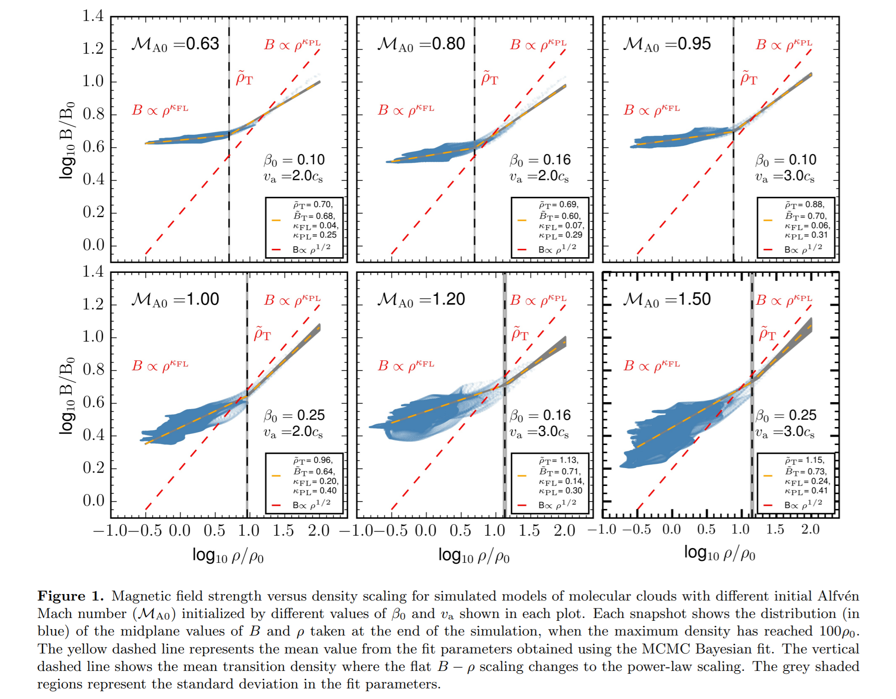
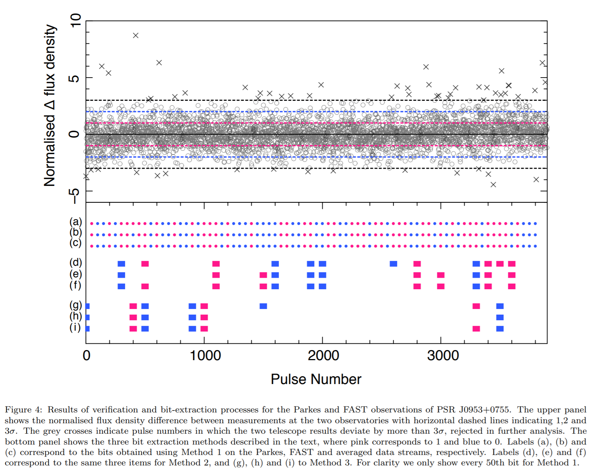
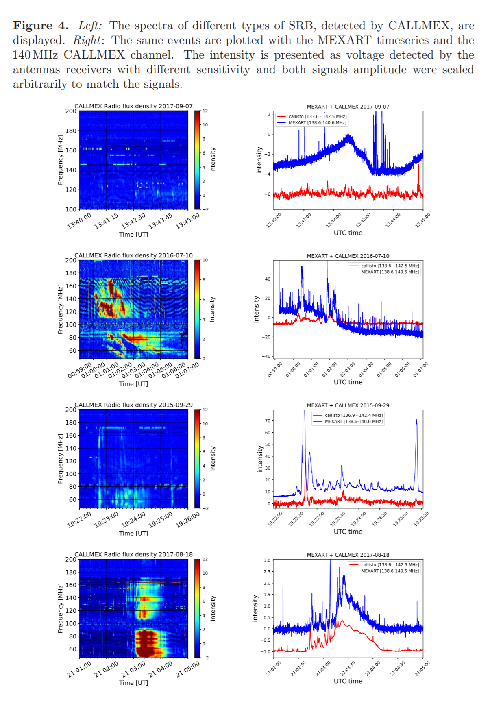
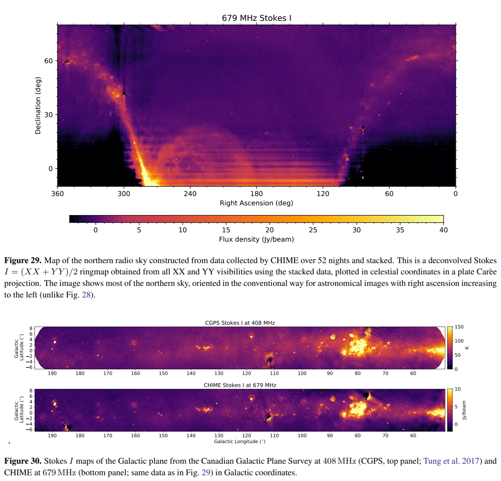
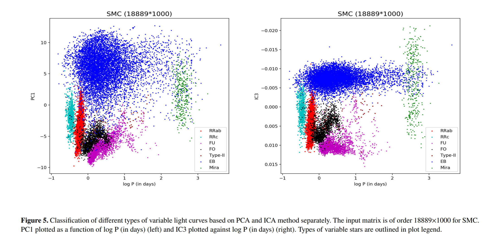
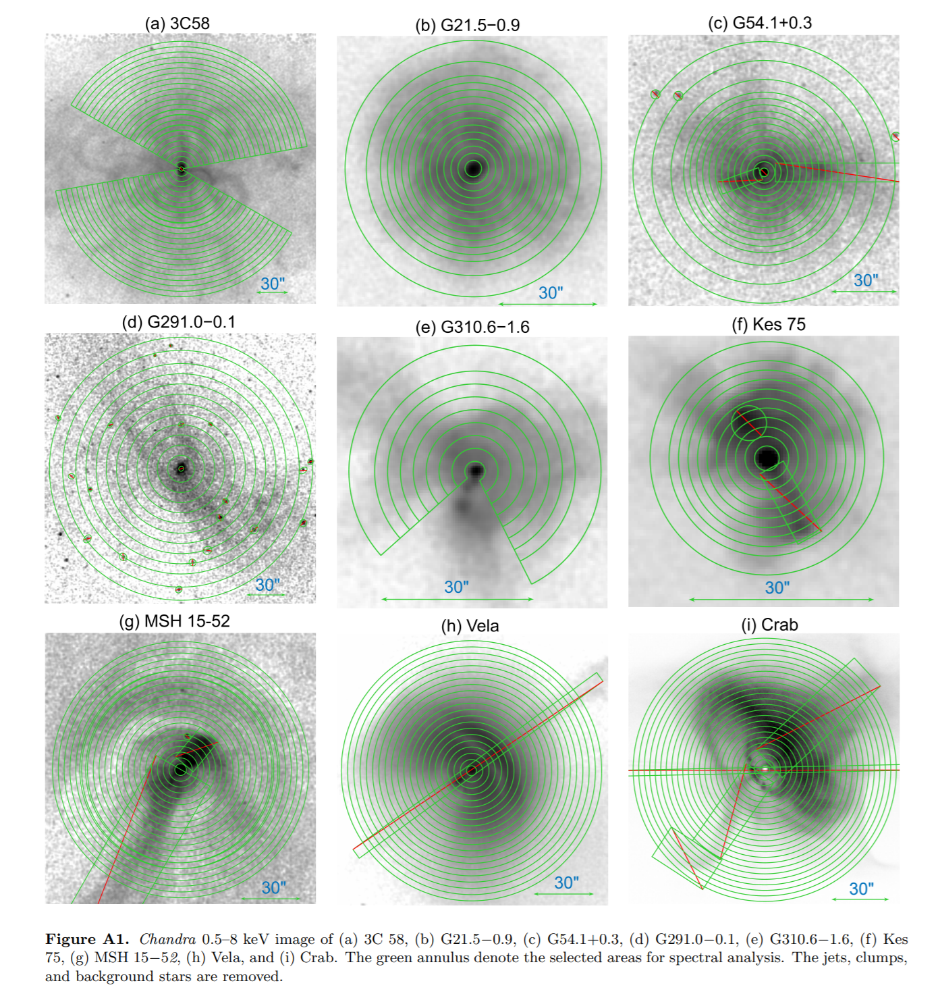
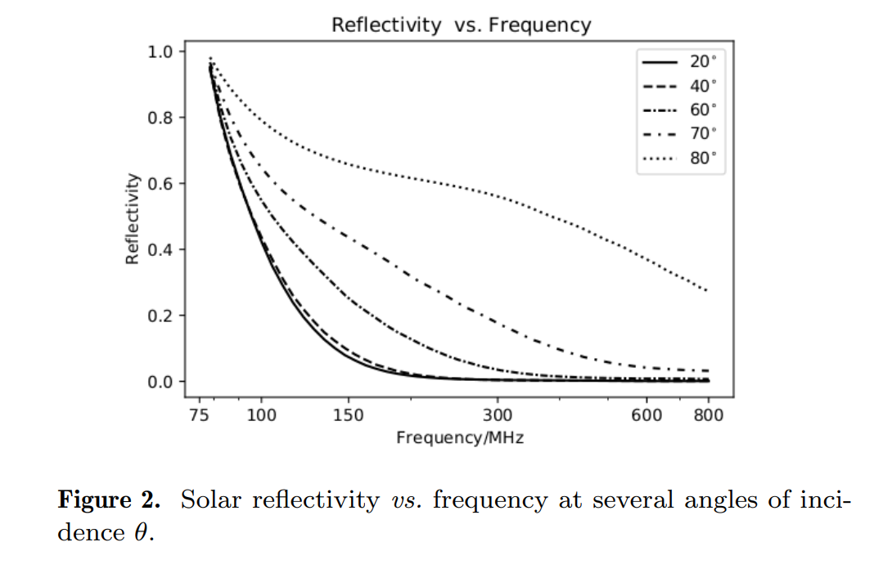

## 2022-01-03

1. [Has the impact flux of small and large asteroids varied through time on Mars, the Earth and the Moon?](https://arxiv.org/abs/2112.15274)

   > Planetary Science, Solar System, Lunar, Mars, Asteroid

   通常认为太阳系在过去30亿年间小行星的撞击流量是恒定的。地月系统在过去20亿年间出现撞击的峰值，可能与主带小行星碎裂相关。通过研究火星上大于20公里的521个撞击坑的大小和频率分布，表明小型（>5m）和大型（>1km）小行星的流量是耦合的`coupled`，在过去6亿年间没有发生变化。地球上在奥陶纪时期（4.7亿年）形成的大量撞击坑可能是保存偏差，月球上撞击的峰值可能是定年的不确定性导致的。

   因此得到结论，太阳系内大型（>1km）和小型（>100m）的陨石坑的产生速率是兼容的，小行星碎裂对陨石坑形成率的影响是有限的。这与传统模型一致：`Yarkovsky 效应`将小行星碎裂产生的大型碎片推向轨道共振，小型碎片通过碰撞被磨碎。

## 2022-01-04

1. [A MeerKAT, e-MERLIN, H.E.S.S. and Swift search for persistent and transient emission associated with three localised FRBs](https://arxiv.org/abs/2201.00069)

   > High Energy, Fast Radio Burst, Host Galaxy

   使用`MeerKAT`搜索非重复暴`FRB20190714A`和重复暴`FRB20190711A`和`FRB20171019A`可能存在的持续射电辐射。同时使用`H.E.S.S.`、`e-Merlin`和`Swift`在伽马射线、X射线、紫外、光学和射电波段对`FRB20171019A`进行观测，没有信号探测给出其在不同波段的辐射通量上限。

   对非重复暴`FRB20190714A`在$z=0.2365$处探测到$\sim53\ \rm mJy/beam$的峰值亮度的弥漫辐射，这可能是其宿主星系的持续辐射，是第三个有持续射电辐射的快速射电暴，表明可能是重复暴。但是`MeerKAT`对这三个快速射电暴的观测，在$0.08\rm \ Jy\cdot ms$的阈值下没有探测到重复爆发。

2. [On the period-age relation of long-period variables](https://arxiv.org/abs/2201.00201)

   > Stellar, Variables

   长周期变星存在经验上的`周期-年龄`关系，但这一关系很少有理论支撑。使用`nonlinear pulsation calculations`模拟长周期脉动变星的周期分布，与等龄线结合，观察周期和年龄的关系，并与银河系中长周期变星的观测进行比较，发现模型预测与观测一致，即**周期随年龄的增加而减小**，并且富氧和富碳的周期年龄关系有不同的斜率。

   这一关系应包含在`fundamental mode`脉动的变星都包含进来，并且由于周期分布有一定的宽度，因此使用这一关系研究单个长周期变星的年龄时需要谨慎考虑弥散。

   

## 2022-01-05

1. [Are the Newly-Discovered z∼13 Drop-out Sources Starburst Galaxies or Quasars?](https://arxiv.org/abs/2201.00823)

   > Extragalactic Galaxy, Cosmology

   `Harikane et al. (2021b)`探测到两个$z\sim13$的星系候选体，距离大爆炸只有$330\ \rm Myr$。研究这两个源的物理性质，包括`紫外光亮度`和`数密度`等，这两个源可能是`恒星形成星系`或者`类星体`。如果是`恒星形成星系`，则需要极高的恒星形成率，或者恒星形成率随晕质量的增加而增加，或者初始质量函数更平。如果是`类星体`，则由黑洞产生的紫外光亮度是$10^8M_\odot$，需要极大质量的黑洞，但与$z\sim7.5$的类星体所需参数一致。

2. [A comprehensive observational study of the FRB 121102 persistent radio source](https://arxiv.org/abs/2201.00999)

   > Fast Radio Burst, Extragalactic Galaxy, AGN, Radio

   使用VLA的`Ku 12-18GHz`和`K 18-26GHz`波段测量FRB121102的`PRS`的流量变化来限制其物理大小。两个波段的流量有变化可能是由于银河系的折射闪烁造成，并且要求源的大小$<10^{17}\ \rm cm$。VLA的观测发现流量变化小于闪烁理论对`PRS`的预测，说明其可能不是AGN。

   使用Keck测量$H_\alpha$，从发射线宽度估计可能存在的超大质量黑洞的质量为$<10^{4\sim5}\ M_\odot$。如果`PRS`是一个AGN，观测到的射电和X射线的光度应该对应更大质量的黑洞。另外也没有从Keck的光谱和PanSTARRS的目录中发现`PRS`相同红移的近邻星系。

   因此，没有发现任何证据支持FRB121102的`PRS`是一个AGN。

## 2022-01-06

1. [Detection of extragalactic Ultra-Compact Dwarfs and Globular Clusters using Explainable AI techniques](https://arxiv.org/abs/2201.01604)

   > Extragalactic Galaxy, Cluster, Machine Learning

   星系周围的致密恒星系统，如超致密矮星`UCDs`和球状星团`GCs`，可以用来示踪星系的合并事件。由于缺乏光谱信息，使用成像数据探测`UCDs`和`GCs`是不稳定的。这里使用`Localized Generalized Matrix Learning Vector Quantization`向量量化聚类和随机森林，并使用`Synthetic Minority Over-sampling`的方法处理样本不均匀的问题，从`Fornax`的$\rm u,g,r,i,J,Ks$六个滤光片数据中识别对象。两个方法都做到了$93\%$的查全率，并且`LGMLVQ`还可以返回不同类别不同特征的重要性。结果表明，$g-r$的颜色对聚类提供了更多的信息。

## 2022-01-07

1. [SORA: Stellar Occultation Reduction and Analysis](https://arxiv.org/abs/2201.01799)

   > Planetary Science, Solar System, Light Curve, Software

   恒星掩星可以用来确定掩星体的尺寸、形状、天体测量等信息。LSST观测预期太阳系内天体数量将增加。[SORA](https://github.com/riogroup/SORA)是用来做掩星数据归算的程序，包括从预测掩星事件以及确定天体大小、形状和位置。

## 2022-01-10

1. [Cosmology with one galaxy?](https://arxiv.org/abs/2201.02202)

   > Extragalactic Galaxy, Cosmology, Machine Learning, XGBoost

   暗物质导致宇宙加速膨胀，确定暗物质的性质是宇宙学最重要的目标之一。使用星系的属性，如恒星质量、气体金属性和恒星形成率等训练神经网络模型，得到宇宙学参数。发现在固定$\Omega_b$的情况下，可以在$10\%$的精度下得到$\Omega_m$的值，而且与星系种类无关。所有用来训练的星系属性中，恒星质量、恒星金属丰度和最大圆周运动是影响$\Omega_m$的最重要的属性。代码和数据位于[这里](https://github.com/franciscovillaescusa/Cosmo1gal)。

## 2022-01-11

1. [The AUTOmated Photometry Of Transients (AutoPhOT) pipeline](https://arxiv.org/abs/2201.02635)

   > Stellar, Light Curve, Software

   [AutoPhOT](https://github.com/Astro-Sean/autophot)基于python的自动测光代码，包含孔径测光、PSF测光、模板减法、人工源注入计算极限星等。

2. [The Absence of Periodicity in Repeating FRB](https://arxiv.org/abs/2201.02910)

   > Fast Radio Burst, Periodicity

   如果快速射电暴有严格周期$P$，如果每个事件的到达时间偏离$\pm 0.6P$以内，在周期图中周期$P$的位置依然有明显的峰值。

## 2022-01-12

1. [Energy functions of fast radio bursts derived from the first CHIME/FRB catalogue](https://arxiv.org/abs/2201.03574)

   > Fast Radio Burst, Energy Function, CHIME, Redshift

   快速射电暴能量函数的红移演化，即FRB的数密度与能量的关系，暗示FRB的起源。从CHIME的样本中得到非重复暴的能量函数在$z<1$处表现出`Schechter `函数的形式。并且能量函数和数密度向高红移处下降，与宇宙`恒星质量密度演化`相似，而与`恒星形成率`不同。

   表明非重复暴可能是由老的星族组成，如中子星和黑洞等。

2. [Is FRB 191001 embedded in a supernova remnant?](https://arxiv.org/abs/2201.03723)

   > Fast Radio Burst, Host Galaxy, Supernova Remnant

   `FRB191001`位于一个恒星形成星系的旋臂处，宿主星系的$DM\approx200\ \rm pc\ cm^{-3}$。分析发现其在旋臂中的位置与超新星在旋臂中的分布一致。以SN贡献的DM来看，`core-collapse`要比`thermonuclear runaway`更合适。但是观测到的RM并不能证实射电暴是穿过超新星遗迹的。

3. [A comprehensive photometric and kinematical characteristic of the newly discovered QCs clusters with Gaia EDR3](https://arxiv.org/abs/2201.04015)

   > Stellar, Gaia, Cluster, Kinematics

   [ASteCA](https://github.com/asteca/ASteCA)是用来做星团分析的代码，可以用来确定成员概率、金属性、年龄、距离、总质量、双星比例等。Gaia EDR3在天体测量性能的提高以及新发现的四个疏散星团，使用`ASteCA`进行分析。

## 2022-01-13

1. [Tracing Milky Way scattering by compact extragalactic radio sources](https://arxiv.org/abs/2201.04359)

   > Extragalactic Galaxy, ISM, Scattering, AGN, Radio

   星系中恒星之间充斥着星际介质，包括`星际气体`（分子、原子、离子）、`尘埃`、`电磁场`和`宇宙线`。ISM的雷诺数很大，宇宙线、星际等离子体、恒星与ISM相互作用、银河系自转等都会造成湍动。由于随机的自由电子密度波动，射电辐射穿过ISM时，波前会被扭曲，导致**散射**。

   喷流相对于同步辐射透明的区域看到的AGN Core相当致密，可以用来探测ISM的散射。相对于脉冲星，AGN`数量更多`、`在天空中均匀分布`并且`穿过整个散射屏`。对脉冲星的研究表明银河系散射屏由两个成分组成

   - 特征尺度约为$500\ \rm pc$的均匀介质
   - 规模为$100\ \rm pc$的尺度为$1\ \rm pc$的小团块集合

   大尺度的不均匀性会导致折射散射效应，如源位置的角度偏移、极端散射效应、流量缓变。小尺度的不均匀性会导致衍射散射效应，如角尺度展宽、流量在时间和频率上的快速闪烁。有两种不兼容的`散射屏模型`

   - **高斯屏模型**。透过高斯散射屏看到的点源的亮度分布是高斯型的，角直径与波长的平方成正比 - $\theta\propto\lambda^2$
   - 电子密度波动**幂律谱模型**。电子密度波动的谱近似为Kolmogorov Law，角直径与波长的2.2次方成正比 - $\theta\propto\lambda^{2.2}$
   - 如果没有散射屏，观察到的致密背景源的角直径与其本征大小一致。对于有喷流的活动星系核，观察到的大小与波长成正比 - $\theta\propto\lambda^1$

   使用VLBI观测的AGN数据，覆盖$1.4-86\ \rm GHz$，测量了`9525`个AGN的角直径，首次建立了银河系ISM大尺度散射特征分布图。热等离子体密度波动的散射屏主要集中在银盘上，并且表现出成团的结构。透过银盘看AGN有明显的增宽，在低频如$2\ \rm GHz$尤其强烈。散射最强的是银心，那里有`Sagittarius A*`和`Galactic bar`。在`Cygnus constellation`、`Taurus A`的超新星遗迹、`Vela`、`W78`、`Cassiopeia A`和`Orion Nebula`处也表现出更强的散射。

   将AGN的视角直径分为`本征`和`散射`两部分贡献，透过银盘看到的AGN散射贡献更大。幂律散射指数与湍流等离子体衍射散射的理论预测一致。

## 2022-01-14

1. [The Rate, Amplitude and Duration of Outbursts from Class 0 Protostars in Orion](https://arxiv.org/abs/2201.04647)

   > Stellar, Star Formation, Infrared

   原恒星至少有一半的质量是在`Class 0`阶段吸积的。使用$04-17$年`Spizer/IRAC`的红外光度测量，在Orion中看到3个原恒星的`Outbursts`，星等变化$>2\ \rm mag$。探测到的数量给出原恒星爆发的事件率约$438^{+1446}_{-277}$年一次。这样的爆发是由快速的质量下降引起原恒星盘中不稳定波动。

## 2022-01-17

1. [Spectral Power-law Formation by Sequential Particle Acceleration in Multiple Flare Magnetic Islands](https://arxiv.org/abs/2201.05564)

   > High Energy, Magnetic Field, Theory, Flare

   `Magnetic islands`由耀斑电流片上零星的磁重联产生，它收缩并加速粒子。在这项工作中，假设部分粒子依次跳到另一个加速器上，并提高能量与各向异性。这样的顺序过程产生的粒子光谱是幂律的，并且有高能和低能的截断。

## 2022-01-18

马丁路德金纪念日停更

## 2022-01-19

1. [The Magnetic Field versus Density relation in Star-Forming Molecular Clouds](https://arxiv.org/abs/2201.05620)

   > Molecular Cloud, Star Formation, Magnetic Field, Simulation

   使用三位磁流体力学模拟分子云中磁场与密度$B-\rho$的关系，表明低密度和高密度区域是不同的幂律。转折点密度$\rho_T$，与初始阿尔芬马赫数$\mathcal M_{A0}$成正比，意味着其实有分子云的`initial turbulent compression`设定。

   

2. [Physical Publicly Verifiable Randomness from Pulsars](https://arxiv.org/abs/2201.05763)

   > High Energy, Pulsar, Random Number

   使用明亮的毫秒脉冲星的`flux density`作为随机数生成器。

   

3. [Why hot Jupiters can be large but not too large](https://arxiv.org/abs/2201.07008)

   > Planetary Science, Hot Jupiter, Theory

   很大一部分热木星的半径超过1.2个木星半径，这无法用行星演化的标准理论解释，通常认为是潮汐加热导致的。当潮汐加热很强的时候，光度随膨胀增大，到达最大值后减小，此时加热强于冷却，辐射对流边界附近的不透明度近似于$T^4$，热量很难辐射出去，发生失控的膨胀。在这种情况下，热木星的半径不能超过$2.2R_J$，这与观测一致。

## 2022-01-20

1. [A fast radio burst progenitor born in a galaxy merger](https://arxiv.org/abs/2201.07271)

   > Fast Radio Burst, Galaxy Merger, Star Formation, HI

   测量到FRB180916的HI质量大，但分布紊乱，是一个富含气体但宁静的星系，可能最近经历了小合并，增加了HI的质量，扰乱了HI的分布，压缩了FRB附近的HI增加密度，产生FRB的原生体。

## 2022-01-21

1. [First Solar Radio Burst Observations by the Mexican Array Radio Telescope (MEXART) at 140 MHz](https://arxiv.org/abs/2201.07828)

   > Solar System, Flare, Radio

   墨西哥国家空间天气实验室`LANCE`负责协调监测墨西哥上空空间天气影响的一起，其中一个仪器是墨西哥阵列射电望远镜`MEXART`，中心频率是$139.65MHz$，带宽$1.5MHz$。2015年9月至2019年5月期间，在`MEXART`的信号中识别了75个太阳射电暴，其中有5个II型事件和70个III型事件。

   

2. [An Overview of CHIME, the Canadian Hydrogen Intensity Mapping Experiment](https://arxiv.org/abs/2201.07869)

   > Cosmology, CHIME, HI, Radio

   加拿大氢气强度测绘实验`CHIME`是一个在$400-800MHz$运行的漂移扫描射电望远镜，旨在绘制0.8至2.5红移范围内的中性氢，以约束宇宙的膨胀历史。CHIME由4个平行的圆柱反射面组成，南北方向，每个都是$100\times20m$。这使得CHIME视场是沿子午线的$2^\circ$宽的条纹，由于地球自转，每天都能观测到$3/4$的天空。加上FPGA+GPU对信号进行数字化和相关处理，为`宇宙学`、`快速射电暴`、`脉冲星`、`VLBI`和`21cm吸收`生成不同的数据产品。下图是由CHIME数据得到的天空地图。

   

## 2022-01-24

1. [Structural properties and classification of variable stars: A study through unsupervised machine learning techniques](https://arxiv.org/abs/2201.08755)

   > Stellar, Variable, Light Curve, Machine Learning, Classification

   光学引力透镜实验[OGLE](https://ogle.astrouw.edu.pl/)有庞大的变星数据库，使用PCA和ICA对光变曲线进行分析，并使用K-means对独立成分进行分类，发现其是一个非常强大的分类工具。下图是`PCA`和`ICA`的一个成分作为周期的函数，颜色是K-means对独立成分分类的结果。

   

   `PCA`的目的是找到一组向量表示，使重构误差最小，向量是正交的。`ICA`是找到一组向量表示，使每个分量最大化独立。`PCA`一般用来做`ICA`数据标准化的预处理步骤。

## 2022-01-25

1. [A Comprehensive Study of the Spectral Variation and the Brightness Profile of Young Pulsar Wind Nebulae](https://arxiv.org/abs/2201.09403)

   > High Energy, Pulsar, Nebulae

   研究年轻脉冲星风星云`PWNe`的粒子扩散传输，用包含光子指数$\Gamma$和表面亮度$\Sigma$的径向截面的纯扩散模型拟合星云截面，这一模型曾在`Crab`、`3C58`和`G21.5-0.9`上测试过。除了扩散引起的光谱软化，还计算了同步辐射功率，并建立了表面亮度曲线。大多数的`PWNe`的两个截面都很相似，模型可以很好的描述这两个截面，**表明在`PWNe`中，扩散主导了粒子传输**。另外，扩散参数与脉冲星物理参数之间没有明显的相关性。

   

## 2022-01-26

1. [The DRAKE mission: finding the frequency of life in the Cosmos](https://arxiv.org/abs/2201.10226)

   > Astrobiology, Planetary Science, Drake Equation

   `DRAKE`等式描述有生命的世界的发生率，$R_*$恒星形成率，$f_p$恒星系统存在行星的比例，$\eta$恒星系统宜居带行星的数量，$f_L$行星出现生命的比例，$f_i$有生命的世界发展出智能的比例，$f_L$智能发展出通信的比例，$L$文明存在的时标，：
   $$
   N=R_*\times f_p\times \eta\times f_L\times f_i\times f_c\times L
   $$
   通过对M型恒星宜居带的行星进行凌星光谱的调查，研究$f_L$的不确定度是如何随样本变化的。结果表明，$f_L$的不确定度是$f_L$的观测值的函数，并且抽样误差要远大于观测误差。如果样本$f_L=0$，则50颗行星的调查可以限制$f_L\le0.06$，如果样本$f_L=0.1$，则可以限制到$0.03-0.2$。

2. [Solar Radio-Frequency Reflectivity and Localization of FRB from Solar Reflection](https://arxiv.org/abs/2201.10078)

   > Fast Radio Burst, Solar, Lunar, Localization

   快速射电暴的辐射可以被月球和太阳反射。如果探测到之一的反射，信号和反射信号之间的时间间隔会将FRB定位在天空中狭窄的弧线上；如果探测到二者的反射，两条弧线会相交，可以将FRB严格定位。像`FRB 200428`这样的银河系内FRB足够亮，$25m$的射电望远镜可以探测到月球和太阳的反射。

   这里计算了太阳在`flat sun`的近似下的反射率，FRB在掠入射的情况下，反射率在$\le200\ \rm MHz$下很高，高频反射率低；而在正入射的情况下，反射率只在$\le100\ \rm MHz$下很高。

   

## 2022-01-27

