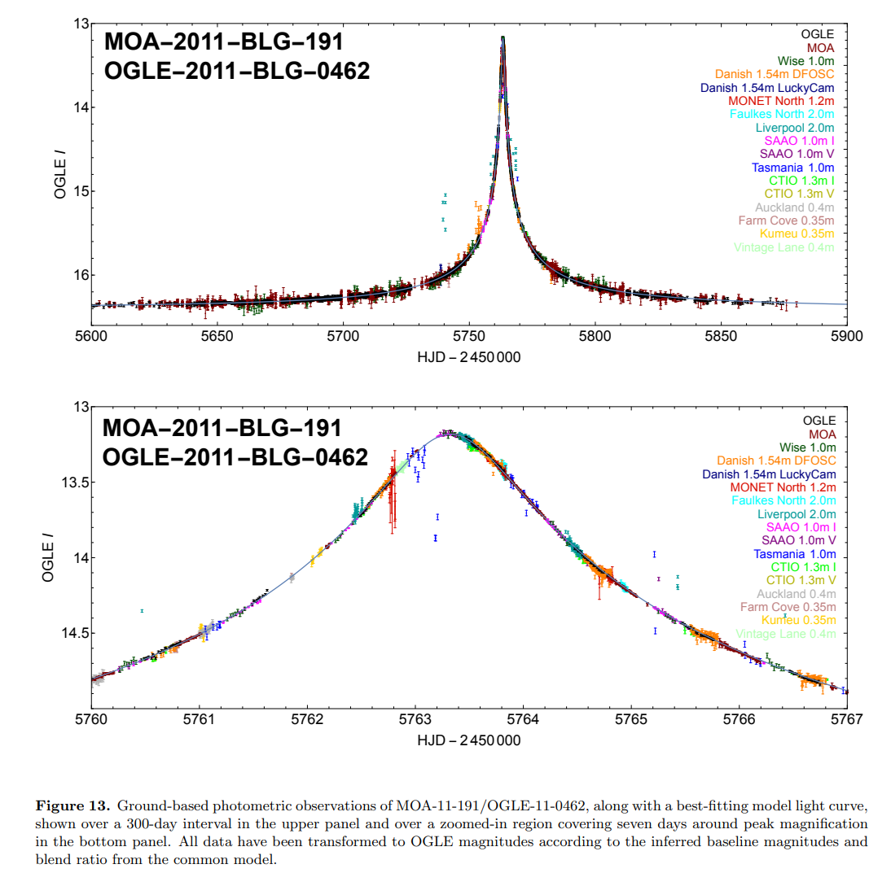
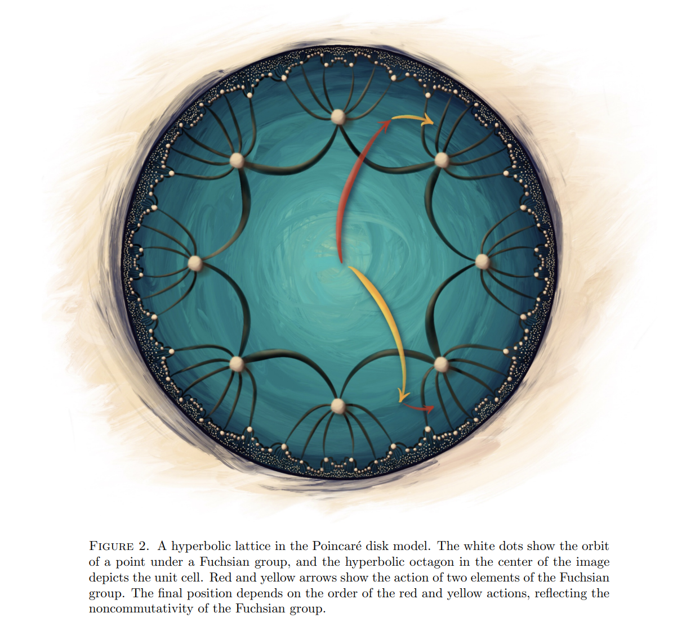

## 2022-02-01

1. [Cosmological Fast Optical Transients with the Zwicky Transient Facility: A Search for Dirty Fireballs](https://arxiv.org/abs/2201.12366)

   > Stellar, Optical Transient, Fireball, GRB, ZTF

   `脏火球`是一类可能存在的`relativistic`大质量恒星爆炸，可以产生类似于GRB长暴余晖的光学辐射。从ZTF中搜索到7个光学暂现源

   - `red colors` - $g-r>0\ \rm mag$
   - `faint host galaxy` - $r>23\ \rm mag$
   - `rapid fading` - $dr/dt>1\ \rm mag/day$

   在发现后几天内对其进行光谱观测，确定了其中六个有宇宙学距离$z=0.876-2.9$，其中4个有LGRB相关事件。对这种孤立事件最简单的解释就是，高能卫星由于探测灵敏度和占空比而遗漏的普通`LGRB`，但是排除了脏火球在每`solid angle`的能量与LGRB相似（同一数量级）。

2. [The Extreme-ultraviolet Stellar Characterization for Atmospheric Physics and Evolution (ESCAPE) Mission: Motivation and Overview](https://arxiv.org/abs/2201.13219)

   > Exoplanet, Stellar, Flare, Spectroscopy

   大气物理的极紫外恒星特征和演化`ESCAPE`任务是一个小型探测器，使用紫外光谱$\rm EUV: 80-825\AA$和$\rm FUV: 1280-1650\AA$来探测附近恒星宜居带的高能辐射环境，包括EUV和CME。`ESCAPE `将提供基本的恒星特征，以确定有利于居住的系外行星系统，为NASA未来的生命探测任务提供线路图。

## 2022-02-02

1. [An Isolated Stellar-Mass Black Hole Detected Through Astrometric Microlensing](https://arxiv.org/abs/2201.13296)

   > Stellar, Black Hole, Microlensing, Supernova

   恒星级黑洞存在的证据，往往是通过探测黑洞吸积时产生的电磁辐射找到的。吸积需要有伴星供应气体，因此已知的银河系内恒星级黑洞都在双星系统中。但孤立恒星级黑洞也是可以存在的，通过常规的超新星爆发或者从双星系统中脱离出来的黑洞。找到这样的黑洞最有希望的方法就是引力透镜效应。

   银河系内的恒星或者黑洞可以近似当作点源处理，产生的微引力透镜有两种观测表现：

   - 当黑洞移动到背景恒星正前方时，透镜会使背景恒星亮度升高。亮度增长时标超过100天的很可能来自孤立黑洞，但也不排除其他可能。因此过往巡天只能从统计上支持孤立黑洞存在。
   - 当黑洞移动到背景恒星正前方时，透镜会使背景恒星位置偏移，但也只有几毫秒的量级，地面难以测量。

   本文通过对一个叫做`MOA-2011-BLG-191/OGLE-2011-BLG-0462`的银河系核球内微引力透镜天体的观测，`MOA`和`OGLE`是发现它的巡天项目名称，明确看到了前景透镜天体导致的背景恒星的位置和亮度变化，认为是由一个距离地球5000光年的$7M_\odot$的恒星级黑洞引起的。这一事件有很长的光变时标$270天$，下图是地面观测的结果。

   

   观测给出黑洞运动速度的估计，发现黑洞速度不低，并且与周围恒星不一致，很可能就是从双星系统中被超新星爆发事件踢出来的。

2. [Hyperbolic band theory through Higgs bundles](https://arxiv.org/abs/2201.12689)

   > Math

   一篇纯数学的文章，图好看。作者是一个本科生，图是他手绘的。

   

## 2022-02-03

1. [Measuring the Expansion or Contraction of Galaxies](https://arxiv.org/abs/2202.00825)

   > Extragalactic Galaxy, Stellar

   星系由于`gaseous`外流损失质量，计算由此产生的的恒星向外的径向迁移，表明其有可能被下一代大型望远镜的高分辨率光谱仪测量。
   $$
   v_r=27{\rm cm\,s^{-1}}\left(\frac{L}{L_{MW}}\right)^{1/2}
   $$

## 2022-02-04

1. [Transformers Can Do Bayesian Inference](https://arxiv.org/abs/2112.10510)

   > Machine Learning, Bayesian Inference, Transformer

   提出`Prior-Data Fitted Networks`，通过机器学习逼近后验，进行有效的贝叶斯推理。`PFNs`可以接近完美的模仿高斯过程，也可以对难以解决的问题进行有效的贝叶斯推理。代码在[这里](https://github.com/automl/TransformersCanDoBayesianInference)。

## 2022-02-07
