## 2022-02-01

1. [Cosmological Fast Optical Transients with the Zwicky Transient Facility: A Search for Dirty Fireballs](https://arxiv.org/abs/2201.12366)

   > Stellar, Optical Transient, Fireball, GRB, ZTF

   `脏火球`是一类可能存在的`relativistic`大质量恒星爆炸，可以产生类似于GRB长暴余晖的光学辐射。从ZTF中搜索到7个光学暂现源

   - `red colors` - $g-r>0\ \rm mag$
   - `faint host galaxy` - $r>23\ \rm mag$
   - `rapid fading` - $dr/dt>1\ \rm mag/day$

   在发现后几天内对其进行光谱观测，确定了其中六个有宇宙学距离$z=0.876-2.9$，其中4个有LGRB相关事件。对这种孤立事件最简单的解释就是，高能卫星由于探测灵敏度和占空比而遗漏的普通`LGRB`，但是排除了脏火球在每`solid angle`的能量与LGRB相似（同一数量级）。

2. [The Extreme-ultraviolet Stellar Characterization for Atmospheric Physics and Evolution (ESCAPE) Mission: Motivation and Overview](https://arxiv.org/abs/2201.13219)

   > Exoplanet, Stellar, Flare, Spectroscopy

   大气物理的极紫外恒星特征和演化`ESCAPE`任务是一个小型探测器，使用紫外光谱$\rm EUV: 80-825\AA$和$\rm FUV: 1280-1650\AA$来探测附近恒星宜居带的高能辐射环境，包括EUV和CME。`ESCAPE `将提供基本的恒星特征，以确定有利于居住的系外行星系统，为NASA未来的生命探测任务提供线路图。

## 2022-02-02

1. [An Isolated Stellar-Mass Black Hole Detected Through Astrometric Microlensing](https://arxiv.org/abs/2201.13296)

   > Stellar, Black Hole, Microlensing, Supernova

   恒星级黑洞存在的证据，往往是通过探测黑洞吸积时产生的电磁辐射找到的。吸积需要有伴星供应气体，因此已知的银河系内恒星级黑洞都在双星系统中。但孤立恒星级黑洞也是可以存在的，通过常规的超新星爆发或者从双星系统中脱离出来的黑洞。找到这样的黑洞最有希望的方法就是引力透镜效应。

   银河系内的恒星或者黑洞可以近似当作点源处理，产生的微引力透镜有两种观测表现：

   - 当黑洞移动到背景恒星正前方时，透镜会使背景恒星亮度升高。亮度增长时标超过100天的很可能来自孤立黑洞，但也不排除其他可能。因此过往巡天只能从统计上支持孤立黑洞存在。
   - 当黑洞移动到背景恒星正前方时，透镜会使背景恒星位置偏移，但也只有几毫秒的量级，地面难以测量。

   本文通过对一个叫做`MOA-2011-BLG-191/OGLE-2011-BLG-0462`的银河系核球内微引力透镜天体的观测，`MOA`和`OGLE`是发现它的巡天项目名称，明确看到了前景透镜天体导致的背景恒星的位置和亮度变化，认为是由一个距离地球5000光年的$7M_\odot$的恒星级黑洞引起的。这一事件有很长的光变时标$270天$，下图是地面观测的结果。

   

   观测给出黑洞运动速度的估计，发现黑洞速度不低，并且与周围恒星不一致，很可能就是从双星系统中被超新星爆发事件踢出来的。

2. [Hyperbolic band theory through Higgs bundles](https://arxiv.org/abs/2201.12689)

   > Math

   一篇纯数学的文章，图好看。作者是一个本科生，图是他手绘的。

   

## 2022-02-03

1. [Measuring the Expansion or Contraction of Galaxies](https://arxiv.org/abs/2202.00825)

   > Extragalactic Galaxy, Stellar

   星系由于`gaseous`外流损失质量，计算由此产生的的恒星向外的径向迁移，表明其有可能被下一代大型望远镜的高分辨率光谱仪测量。
   $$
   v_r=27{\rm cm\,s^{-1}}\left(\frac{L}{L_{MW}}\right)^{1/2}
   $$

## 2022-02-04

1. [Transformers Can Do Bayesian Inference](https://arxiv.org/abs/2112.10510)

   > Machine Learning, Bayesian Inference, Transformer

   提出`Prior-Data Fitted Networks`，通过机器学习逼近后验，进行有效的贝叶斯推理。`PFNs`可以接近完美的模仿高斯过程，也可以对难以解决的问题进行有效的贝叶斯推理。代码在[这里](https://github.com/automl/TransformersCanDoBayesianInference)。

## 2022-02-07

1. [Rediscovering orbital mechanics with machine learning](https://arxiv.org/abs/2202.02306)

   > Machine Learning, GNN, Symbolic regression, Physics

   使用图神经网络从30年的轨道数据模拟太阳系行星和大卫星的动力学，使用符号回归，在假设`平移和旋转等效`以及`牛顿第二/三定律`后，可以搜寻出牛顿引力定律。

## 2022-02-08

1. [Spectroscopic Studies of Type Ia Supernovae Using LSTM Neural Networks](https://arxiv.org/abs/2202.02498)

   > Machine Learning, Supernova, Spectrum

   使用`LSTM`拟合$\rm Ia$型超新星的事件光谱序列。训练好的网络允许使用亮度最大值附近日期的单一光谱准确重建其它时间的光谱序列，表明`SN Ia`最关键的信息可以从最大光度附近的单一光谱得到。

   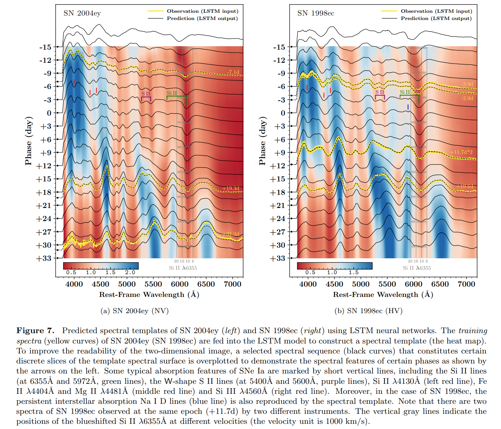

2. [UCLCHEMCMC: A MCMC Inference tool for Physical Parameters of Molecular Clouds](https://arxiv.org/abs/2202.02343)

   > ISM, Software

   [UCLCHEMCMC](https://github.com/Marcus-Keil/UCLCHEMCMC)，给定不同发射线的观测值，结合MCMC采样和化学以及辐射转移建模来估计观察到的气体云的物理参数，包括`Density`、`Temperature`、`UV factor`、`R_out`、`CR factor`。

## 2022-02-09

1. [Assessing Planetary Complexity and Potential Agnostic Biosignatures using Epsilon Machines](https://arxiv.org/abs/2202.03699)

   > Exoplanet, Astrobiology, Planetary Science, Time Series

   使用`epsilon machine reconstruction`衡量时间序列的复杂性。对比地球和木星在三个波段反射或者发射光的时间序列，地球的平均复杂性和熵分别比木星高约50%和43%。这种方法或许可以用作生物特征的检测，代码在[这里](https://nicolas.brodu.net/recherche/decisional_states/index.html)。

## 2022-02-10

1. [Can a Single Population Account for the Discriminant Properties in Fast Radio Bursts?](https://arxiv.org/abs/2202.04422)

   >  Fast Radio Burst, Population

   从`重复率`、`持续时间`、`带宽`、`谱指数`、`峰值光度`和`峰值频率`分析CHIME的目录，发现在相干曲率辐射的框架内，`谱指数`和`峰值频率`的分布区别无法用`beamed emission`解释，表明FRB可能存在两个种类。

2. [The Pantheon+ Analysis: Cosmological Constraints](https://arxiv.org/abs/2202.04077)

   > Cosmology, Hubble Tension, Supernovae

   `Pantheon+`对$z=0.001\sim2.26$的1550个`Ia型超新星`光变曲线的分析对宇宙学参数的约束，使用`SN Ia`的系统性误差占$H_0$测量总误差的1/3以下，不能解释目前局域测量和早期宇宙之间的`Hubble tension`。

3. [Comet Fading Begins Beyond Saturn](https://arxiv.org/abs/2202.04126)

   > Planetary Science, Solar System, Comet, Saturn

   长周期彗星`LPCs`经过太阳附近时，第一次经过被发现的概率最高，之后下降，主要原因是在距离太阳$\rm 2-3AU$的距离上热过程导致的碎裂。数值模拟表明，彗星观测错过了大量接近土星的`LCPs`，因为这些彗星在更远的地方就碎裂了。因此，彗星在太阳距离上的演化比之前考虑的要大得多。

## 2022-02-11

1. [The Thresher: Lucky Imaging without the Waste](https://arxiv.org/abs/2202.04686)

   > Optical, Imaging, Stack, Software

   在传统的幸运成像中，只有最清晰的图像会被保留下来作为最终图像，其它图像都被丢弃。这里提出一个多帧去卷积的图像分析方法[The Thresher](https://github.com/jah1994/TheThresher)，不需要事先估计图像的点扩散函数，可以使用所有可用的数据，返回图像信噪比高，并且不会损失角分辨率。

## 2022-02-14

1. [The FRB 20121102A November rain in 2018 observed with the Arecibo Telescope](https://arxiv.org/abs/2202.05705)

   > Fast Radio Burst, FRB121102, AO

   AO在2018年11月对FRB121102在L波段的观测，有849个爆发，事件率最高是$218/hr$，双峰分布等待时间。二维高斯拟合动态谱，发现漂移与持续时间线性相关，并与`sad-trombone`效应一致。没有短周期，无法用单一幂律拟合。

2. [Circular polarisation of fast radio bursts in the curvature radiation scenario](https://arxiv.org/abs/2202.05475)

   > Fast Radio Burst, Polarization, Circular, Theory

   重复或者非重复快速射电暴都发现有圆偏振，曲率辐射可以在辐射束侧面产生圆偏振。在有曲率辐射的情况下，为了在FRB中看到明显的圆偏振，需要更多的爆发、高洛伦兹系数的电子的爆发、中心有缓慢旋转的中子星。中子星不同的旋转周期可能解释一些FRB没有圆偏振，并且可以解释位置角摆动。

## 2022-02-15

1. [Cosmic Kite: Auto-encoding the Cosmic Microwave Background](https://arxiv.org/abs/2202.05853)

   > Cosmology, Machine Learning, VAE

   用`CAMB`计算产生随机宇宙学功率谱数据集，用`编码器-解码器`来找宇宙学参数，解码器部分是从宇宙学参数计算功率谱的模型。结果表明编码器能够估计宇宙学参数，精度与传统方法差不多，但是精度很高，代码在[这里](https://github.com/Martindelosrios/cosmic-kite)。

## 2022-02-16

1. [Astrometric identification of nearby binary stars II -- Astrometric binaries in the Gaia Catalogue of Nearby Stars](https://arxiv.org/abs/2202.06963)

   > Stellar, Gaia, Binary, HR

   使用天体测量误差寻找`Gaia EDR3`尤其是`Gaia Catalogue of Nearby Stars`中的双星。对测量误差进行`local volume`归一化，得到`Local Unit Weight Error`来筛选。

   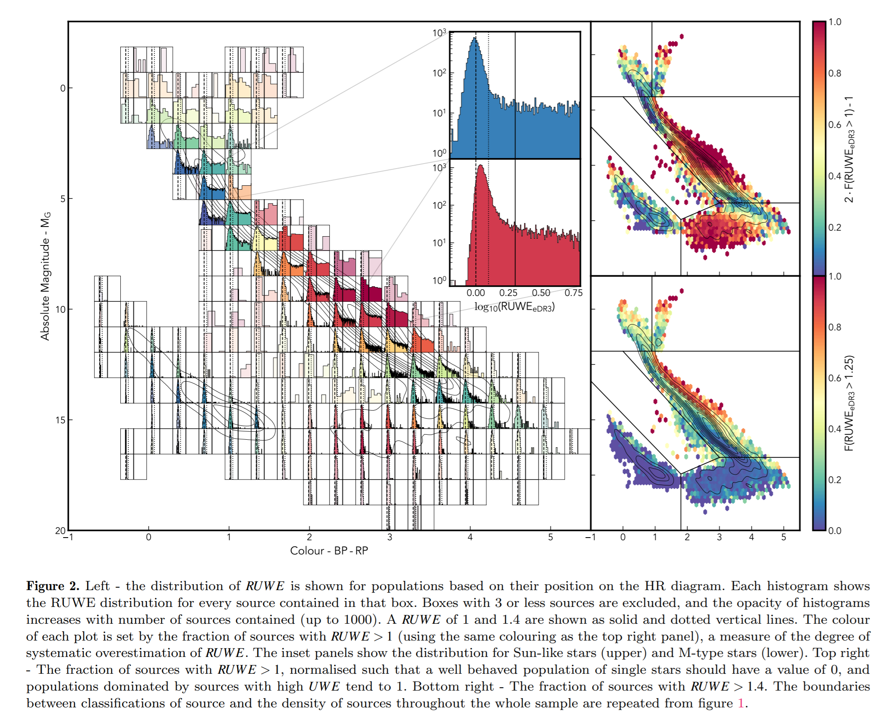

## 2022-02-17

1. [The Global Dynamical Atlas of the Milky Way mergers: Constraints from Gaia EDR3 based orbits of globular clusters, stellar streams and satellite galaxies](https://arxiv.org/abs/2202.07660)

   > Milky Way, Galaxy Merger, Gaia, Cluster, Stellar Stream

   银晕由原生星系合并形成，但对这一过程并没有太多认识，尤其是合并的数量、整体动力学特性以及银晕贡献的恒星数量。

   使用Gaia EDR3的170个球状星团、41个星流和46个卫星星系的测量结果，使用`ENLINK`检测到6个星群，包括之前已知的`Sagittarius`、`Cetus`、`Gaia-Sausage/Enceladus`、`LMS-1/Wukong`、`Arjuna/Sequoia/I'itoi`，以及一个新的，叫`Pontus`。

   对这些合并的成员进行了分析，包括成员、轨道特性和金属丰度等。发现银河系三个金属丰度最低的星流`C-19`、`Sylgr`和`Phonenix`，金属丰度分别是$-3.4,-2.9,-2.7\ |\ \rm [Fe/H]=dex$都与`LMS-1/Wukong`有关，表明它是金属含量最低的合并。

   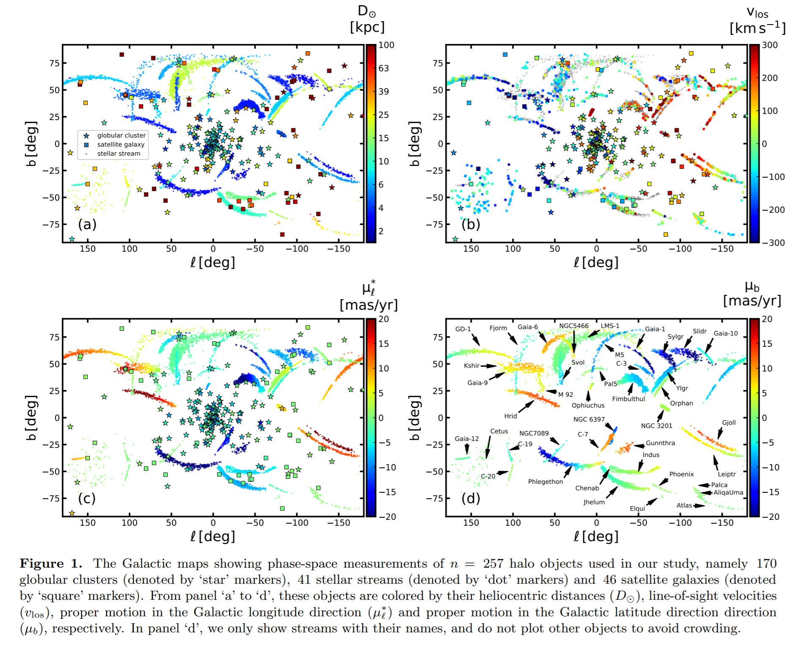

2. [The velocity distribution of white dwarfs in Gaia EDR3](https://arxiv.org/abs/2202.07672)

   > Stellar, White Dwarf, Gaia, Statistics

   使用`penalised maximum likelihood`估计太阳系附近的白矮星速度分布，显示出与太阳系附近其他恒星相似的结构，反应白矮星收到相同的动力学过程影响。

3. [GIGA-Lens: Fast Bayesian Inference for Strong Gravitational Lens Modeling](https://arxiv.org/abs/2202.07663)

   > Lensing, Modeling, Software

   `GIGA-Lens`使用`Tensorflow`和`JAX`实现的GPU加速的贝叶斯框架，用于强引力透镜系统建模。包括三个部分，多起点梯度下降优化、变分推理后验概率分布、通过哈密顿蒙特卡洛采样。

   `TensorFlow Probability`是一个用于概率推理和统计分析的库，或许可以用于FRB拟合。

   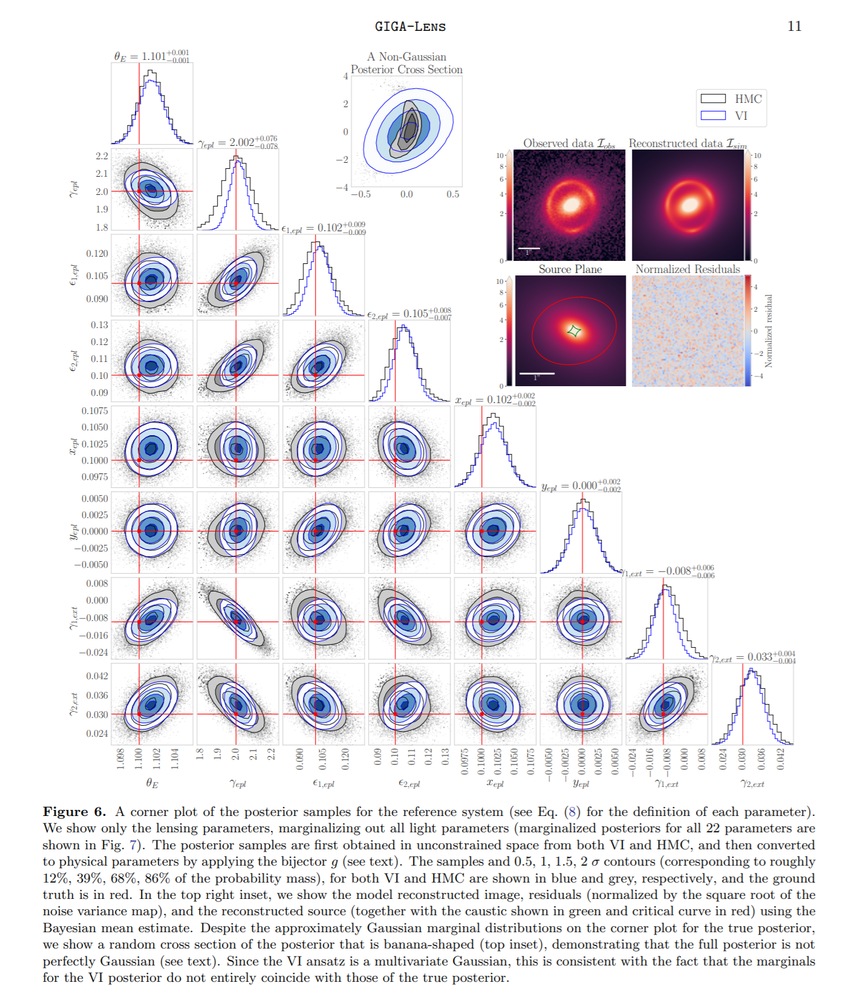

4. [The Interstellar Medium of Dwarf Galaxies](https://arxiv.org/abs/2202.08231)

   > Dwarf Galaxy, ISM, Review

   矮星系是宇宙中数量最多的星系，表现出与其它星系不同的特性。这篇综述讨论`有大量气体和尘埃的矮星系`的星际介质的`物理和化学特性`。

5. [Introduction to Radio Astronomical Polarimetry](https://arxiv.org/abs/2202.07818)

   > Radio, Polarimetry

   介绍了偏振测量的概念和数学基础，是一个讲习班的笔记。

6. [A fast radio burst with sub-millisecond quasi-periodic structure](https://arxiv.org/abs/2202.08002)

   > Fast Radio Burst, Periodicity

   FRB20201020A位于$\rm 13h51m25s,\ +49^\circ02'06''$，$DM=398.59\ \rm pc/cm^3$，$RM=110\pm69\ \rm rad/m^2$，是非重复暴，有$0.415ms$的准周期性，这样的周期超过了中子星状态方程的限制，因此不可能被解释为脉冲星旋转，因而有可能是磁星磁层中等距发射引起的。

   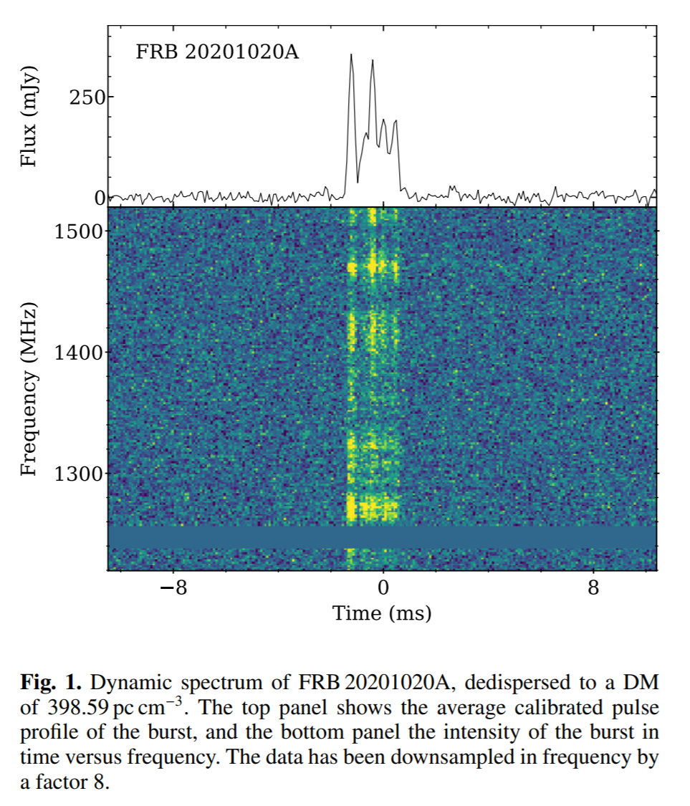

7. [Herschel-ATLAS Data Release III: Near-infrared counterparts in the South Galactic Pole field -- Another 100,000 submillimetre galaxies](https://arxiv.org/abs/2202.07687)

   > Galaxy, Terahertz, Infrared, Herschel-ATLAS

   `Herschel Astrophysical Terahertz Large Area Survey, H-ATLAS`的$\rm DR3$，给出南银极亚毫米源的红外对应体。110374 (57%) 个源可以在近红外图像中找到星系，以及一些透镜系统。

## 2022-02-18

1. [The LOFAR view of giant, early-type galaxies: radio emission from active nuclei and star formation](https://arxiv.org/abs/2202.08593)

   > Extragalactic Galaxy, LOFAR, Radio Luminosity

   研究LOFAR探测到的附近宇宙中高亮度的早型星系`ETG`的特性和射电辐射来源。188个巨型`ETG`有LOFAR的图像，其中146个的亮度高于典型亮度$10^{21}\ \rm W/Hz$，其中最亮的是$10^{26}\ \rm W/Hz$。大约三分之二的`gETG`是无法解析的，也就是说大小$<4\ \rm kpc$，这意味着附近宇宙中致密射电源的普遍性。

   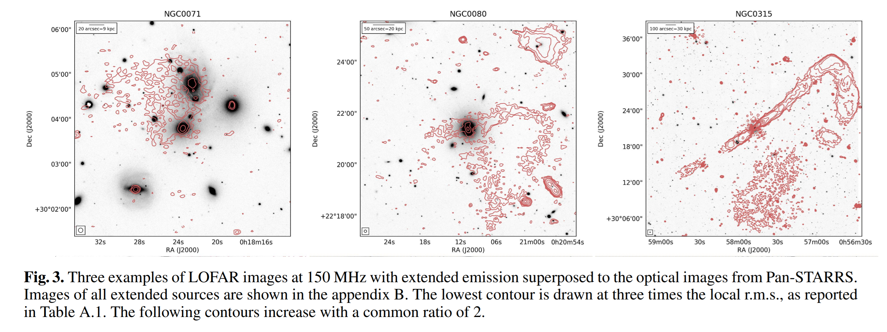

## 2022-02-21

1. [Exploring X-ray variability with unsupervised machine learning I. Self-organizing maps applied to XMM-Newton data](https://arxiv.org/abs/2202.08868)

   > Machine Learning, Self-Organizing Maps, Dimensionality Reduction, Light Curve, High Energy

   `XMM-Newton`在X波段记录了数十万个源的光变曲线，在这样有噪声的大量数据中，直接搜索或者将光变曲线模型拟合到数据上都不可靠。`Self-Organizing Maps, SOM`自组织映射是一种无监督的神经网络，可用于降维和聚类，`MiniSom`可以用来实现。

   使用`EXTraS`目录中的10万个数据训练`SOM`，可以发现`SOM`图中与`Flare`、`Eclipse`、`Dips`、`Linear Light Curve`相关的区域。

   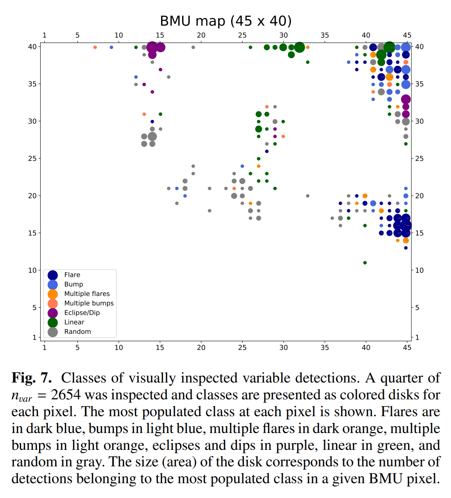

## 2022-02-22

1. [TIMES II: Investigating the Relation Between Turbulence and Star-forming Environments in Molecular Clouds](https://arxiv.org/abs/2107.13323)

   > Star Formation, Turbulence, ISM, Molecular cloud, PCA

   分子云的数据格式类似于
   $$
   T(x_i,y_i,v_j)=T_{ij}\quad {\rm where}\quad i=1,\cdots,n=N_l\times N_b
   $$
   使用`PCA`，可以将数据降维到2维，
   $$
   Su=\lambda u\quad {\rm where}\quad S_{jk}=\frac1n\sum_{i=1}^nT_{ij}T_{ik}
   $$
   `特征值`相当于数据投影到`特征向量方向上`的**方差**。`EigenImage`由特征向量重建：
   $$
   I_l(x_i,y_i)=I_l(r_i)=\sum_{j=1}^pT_{ij}u_{jl}
   $$
   特征向量$u_l$定义了具有特征速度$\delta v$的光谱窗，光谱由$u_l$加权得到的空间图测量空间距离，即可得到速度弥散与尺度之间的关系，下图是一个例子。

   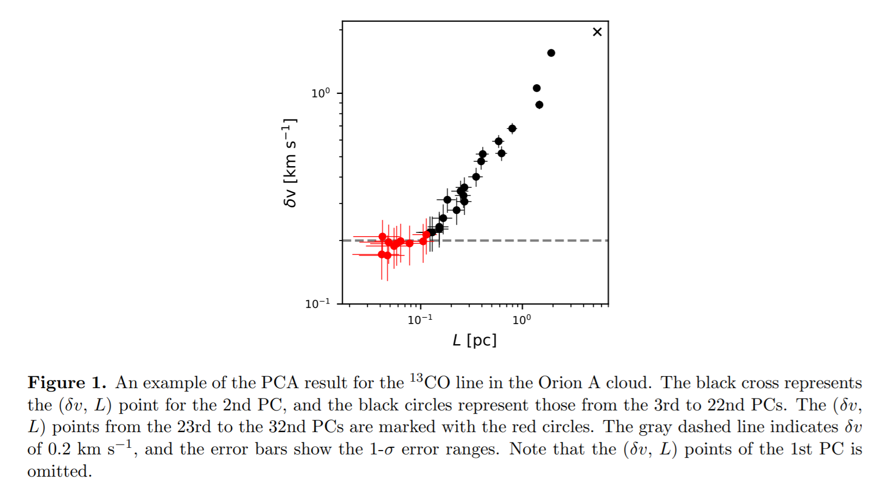

   这篇文章使用PCA研究Orion A恒星形成对湍流的影响。$^{13}CO$的PCA得到的比例关系显示

   - 在给定的尺度$L$下，速度弥散$\delta v$在活跃恒星形成区高，$\delta v$随区域内原恒星数密度和总光度增加而增加
   - $C^{18}O$、$HCO+$、$CS$的$\delta v$通常高于$^{13}CO$，意味着致密气体比弥散气体更具湍流性

2. [Frequency Dependent Polarization of Repeating Fast Radio Bursts -- Implications for Their Origin](https://arxiv.org/abs/2202.09601)

   > Fast Radio Burst, Polarization

   冯毅的文章，可视化由我实现。讲重复暴的偏振度随频率演化，低频偏振度低；不同重复暴的演化趋势可以由$\sigma_{RM}$，也即$RM$的弥散描述，反映了辐射的多径传播，环境的复杂性。

   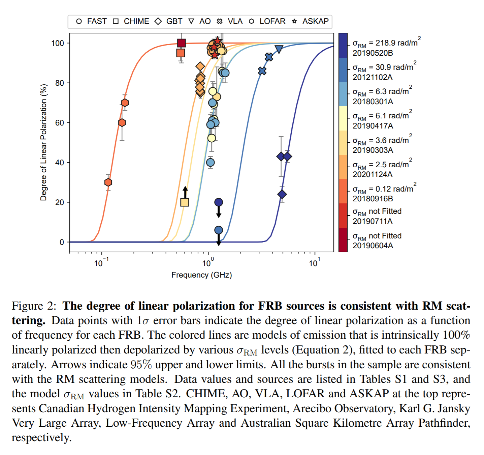

3. [Temporal Scattering, Depolarization, and Persistent Radio Emission from Magnetized Inhomogeneous Environments Near Repeating Fast Radio Burst Sources](https://arxiv.org/abs/2202.09602)

   > Fast Radio Burst, Polarization, Theory

   上一篇文章的理论解释。$\sigma_{RM}$和$\tau_s$之间的关联性表明其来自同一区域，可以通过磁化不均匀等离子体屏的多径传播来描述，预测关系应该是$\sigma_{RM}\propto\tau_s^{0.54-0.83}$。杨元培的文章。

4. [Model-independent classification of events from the first CHIME/FRB Fast Radio Burst catalog](https://arxiv.org/abs/2202.10076)

   > Fast Radio Burst, Population

   对CHIME的Catlog中FRB的轮廓进行相关分析和聚类，发现可以大致分成两类，其中一类相比另一类有较低的亮温度和较大的宽度。

   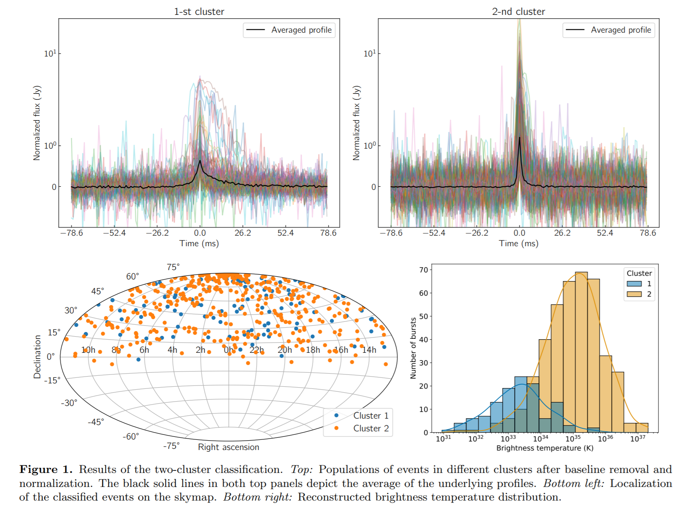

5. [Detecting and Monitoring Tidal Dissipation of Hot Jupiters in the Era of SiTian](https://arxiv.org/abs/2202.10031)

   > Exoplanet, Light Curve, SiTian

   热木星凌星`transit`时间变化`TTV`提供了行星潮汐耗散（轨道和旋转能量由于潮汐加热被耗散）的直接观测证据，使用`TTV`探测需要高精度并且足够长的凌星光变曲线。潮汐耗散的热木星的探测率将回答一个关键问题，即行星是在`形成早期`还是由于`扰动`造成的轨道迁移。

   `司天`计划使用72面$1m$的光学望远镜进行时域天文研究，时间分辨率约为$30s$。这里模拟了司天的光变曲线，并使用开发的分析方法进行光变曲线解读，获取凌星时间。

## 2022-02-23

1. [FRB 121102: drastic changes in the burst polarization contrasts with the stability of the persistent emission](https://arxiv.org/abs/2202.10519)

   > Fast Radio Burst, Polarization, PRS

   使用Effelseberg的$1.7\ \rm GHz$数据分析FRB121102的偏振，测量到了目前最高的$RM=1.27\times10^5\ \rm rad/m^2$，以及$15\%$的线偏振。如果假设RM屏不均匀，是一个宽度为$150\ \rm rad/m^2$的高斯平，可以解释这个爆发与其它时间观测到的爆发的偏振度在频率上的变化。

   $<10\%$的通量变化对年轻超新星的模型提出挑战，并且在$4.8\ \rm GHz$下，PRS的偏振度限制在$<25\%$，排除了与爆发共同起源的可能。

2. [Stacked Periodograms as a Probe of Exoplanetary Populations](https://arxiv.org/abs/2202.11050)

   > Exoplanet, Light Curve, Periodograms

   一颗系外行星在周期图中可能没有表现出显著的统计性，但通过周期图叠加可以找到一类系外行星。

   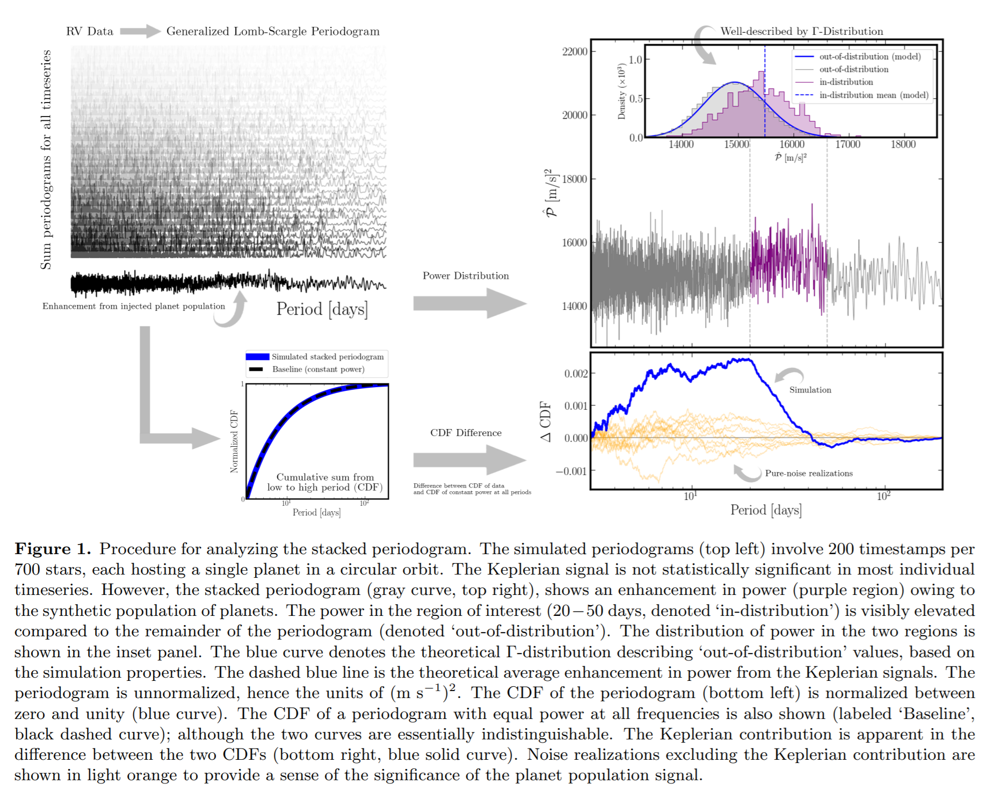

## 2022-02-24

1. [A Highly Variable Magnetized Environment in a Fast Radio Burst Source](https://arxiv.org/abs/2202.11112)

   > Fast Radio Burst, Polarization

   Sarah他们的文章，讲FRB20190520B的RM变化。

2. [PRECISE localizations of repeating Fast Radio Bursts](https://arxiv.org/abs/2202.11644)

   > Fast Radio Burst, Host Galaxy, Localization

   `EVN` 可以将FRB定位至毫角秒级别。`PRECISE`使用`EVN`的一个子集望远镜阵，每年观测数百小时，为将CHIME/FRB发现的重复暴定位。

## 2022-02-25

1. [The LOFAR Two-metre Sky Survey -- V. Second data release](https://arxiv.org/abs/2202.11733)

   > Radio Continuum, LOFAR

   `LOFAR`的$2\ \rm m\ |\ 120-160\ \rm MHz$巡天数据成图，分辨率是$6''$，并给出$4,396,228$个射电源目录，大部分以前从未在射电波段探测过，估计点源在$0.8\ \rm mJy/beam$亮度以上有$90\%$的完整度。

   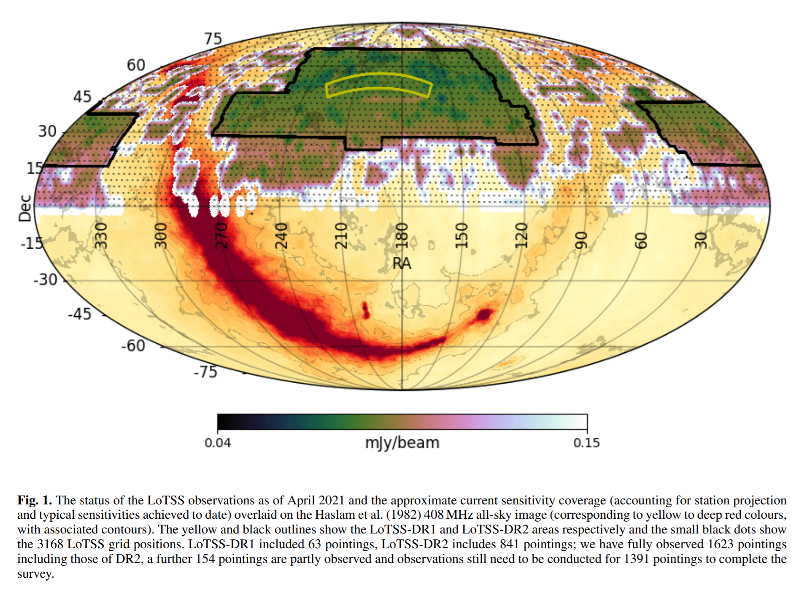

2. [H0 tension or M overestimation?](https://arxiv.org/abs/2202.11852)

   > Cosmology, Hubble Tension

   普朗克测量的$H_0^P$与低红移超新星测量的$H_0^R$之间存在差异。在分析数据时用的绝对星等值$M$是从低红移超新星中获得的。分析低红移超新星的光度距离，使用不同的$(M^P,M^R)$，对应不同的$(H_0^P,H_0^R)$。结果发现，$M$的值会影响局部不均匀性。

   使用$(M^R,H_0^R)$没有明显的不均匀性，使用$(M^P,H_0^P)$发现局部小空隙，导致$M^R$相对于$M^P$高估，并且后者更适合数据，解决了`Hubble Tension`。

## 2022-02-28

1. [R2-D2: Roman and Rubin -- From Data to Discovery](https://arxiv.org/abs/2202.12311)

   > Roman, LSST, Survey, White Paper

   `Roman`是$2.4m$的大视场红外巡天望远镜，视场$0.28\ \rm deg^2$是`Hubble`的100倍，分辨率与`Hubble`相当。`LSST`是工作在$320-1060\ \rm nm$的$8.4m$的光学望远镜，视场$9.6\ \rm deg^2$。两个望远镜有相似的灵敏度，但是再波段、空间分辨率和时域覆盖上互补。由这两个望远镜的数据可以催化丰富而广泛的发现。

2. [A Straight Lightning Bolt?! Observation of a Predicted Macro Dark Matter Signature](https://arxiv.org/abs/2202.12428)

   > Lightning, Macro Dark Matter

   `Straight lightning`认为是宏暗物质的预言，一个足够大的`macro`穿过大气层，产生一个直的等离子体柱，发出荧光。最近在澳大利亚捕捉到了4道非常直的闪电，时间相隔$0.5s$。

   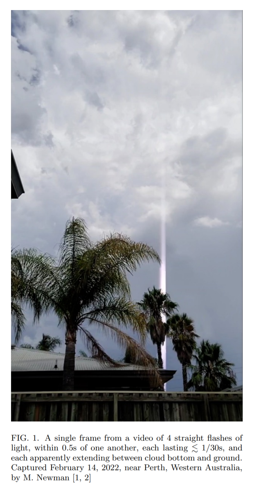

