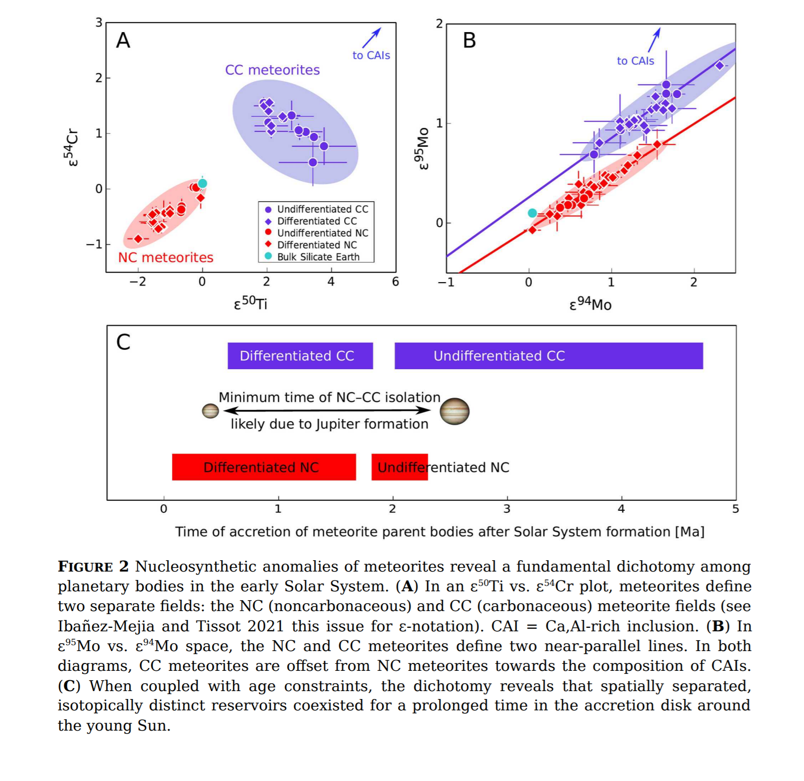

## 2022-03-01

1. [The Large Dispersion and Scattering of FRB 20190520B are Dominated by the Host Galaxy](https://arxiv.org/abs/2202.13458)

   > Fast Radio Burst, Dispersion Measure, Scattering, Host Galaxy

   `FRB 20190520B`在$1.4\ \rm Ghz$的平均散射时标是$\tau=10.9\pm1.5\ \rm ms$，闪烁带宽是$\Delta \nu_d=0.21\pm0.01\ \rm MHz$，与银河系闪烁一致。对于一个双屏散射几何，$\tau$来自宿主星系，$\Delta\nu_d$来自银河系，FRB和主要散射介质之间的距离$\le100\ \rm pc$。$\tau-\rm DM$关系可以用来估计FRB的红移。

2. [Unprecedented change in the position of four radio sources](https://arxiv.org/abs/2202.13119)

   > Extragalactic Galaxy, VLBI, AGN, Astrometry

   `VLBI`可以测量AGN的位置到亚毫角秒的精度。遥远的银河系外天体的自行通常比较小，使用2018-2021的VLBI观测数据，`3C48`、`CTA21`、`1144+352`、`1328+254`的位置在过去20年内发生了$20-130\ \rm mas$的变化，位置移动是由于射电结构变化导致的。

## 2022-03-02

1. [Homogeneous Transit Timing Analyses of Ten Exoplanet Systems](https://arxiv.org/abs/2203.00299)

   > Stellar, Exoplanet, Light Curve

   分析了10颗系外行星的凌星时间，没有发现行星轨道会有周期性的变化，轨道预计会在可观测的时间尺度上衰减。

## 2022-03-03

1. [Determining Research Priorities for Astronomy Using Machine Learning](https://arxiv.org/abs/2203.00713)

   > Machine Learning, Astronomy

   提取高影响力的天文相关文章的摘要，发现`a sum of the fractional contribution to each topic by all scientific papers`和`Compound Annual Growth Rate of these counts`与2010年美国未来十年天文学发展方向确定的高优先度的研究领域有很好的相关性。

## 2022-03-04

1. [The Velocity Statistics of Turbulent Clouds in the Presence of Gravity, Magnetic fields, Radiation, and Outflow Feedback](https://arxiv.org/abs/2203.01508)

   > ISM, Turbulence

   在模拟数据中研究引力、湍流、磁场、恒星辐射和外流反馈对恒星形成的影响。引力和外流增加了所有尺度上的速度波动。

   - 外流可以在$0.01-0.2\ \rm pc$的尺度上将速度波动放大7倍，并使湍流达到$1\ \rm pc$的尺度。
   - 引力在小尺度上更为显著，加强了小尺度的碎裂。

## 2022-03-07

1. [Planetary Genealogy](https://arxiv.org/abs/2203.02203)

   > Planetary Science, Meteorite

   观测新生恒星周围的吸积盘可以帮助理解太阳系形成与演化，陨石中稳定的同位素异常`stable isotope anomalies`可以建立一个“行星同位素谱系”，作为太阳系早期物质流动的追踪器。
   
   

## 2022-03-08

1. [Detecting the periodicity of highly irregularly sampled light-curves with Gaussian processes: the case of SDSSJ025214.67-002813.7](https://arxiv.org/abs/2203.03614)

   > Light Curve, Periodicity, Time Domian, Gaussian Process

   `SDSSJ025214.67-002813.7`长达20年的观测，采样极不规则，中间有很长的数据缺失时段。使用`高斯过程`从光变曲线中检测周期性，能够评估周期性的真实性，也可以计算功率谱密度。

## 2022-03-09

1. [Basics of Fourier Analysis for High-Energy Astronomy](https://arxiv.org/abs/2203.04106)

   > Time Domain, Fourier

   傅立叶分析入门理论基础。介绍了连续/离散傅立叶变换，加窗，FFT，功率谱，自相关，交叉光谱，双相干，Lomb-Scargle，短时傅立叶变换，小波和其他技术。

## 2022-03-10

1. [The Low Frequency Perspective on Fast Radio Bursts](https://arxiv.org/abs/2203.04890)

   > Fast Radio Burst, Review

   CHIME在$400-800\,\rm MHz$波段一年时间里发现了500个FRB。低频的观测发现了一个`nearby population`，对其研究可以描述FRB周围环境，以及近域宇宙。这是一篇综述，描述FRB在低频的研究。

## 2022-03-11

