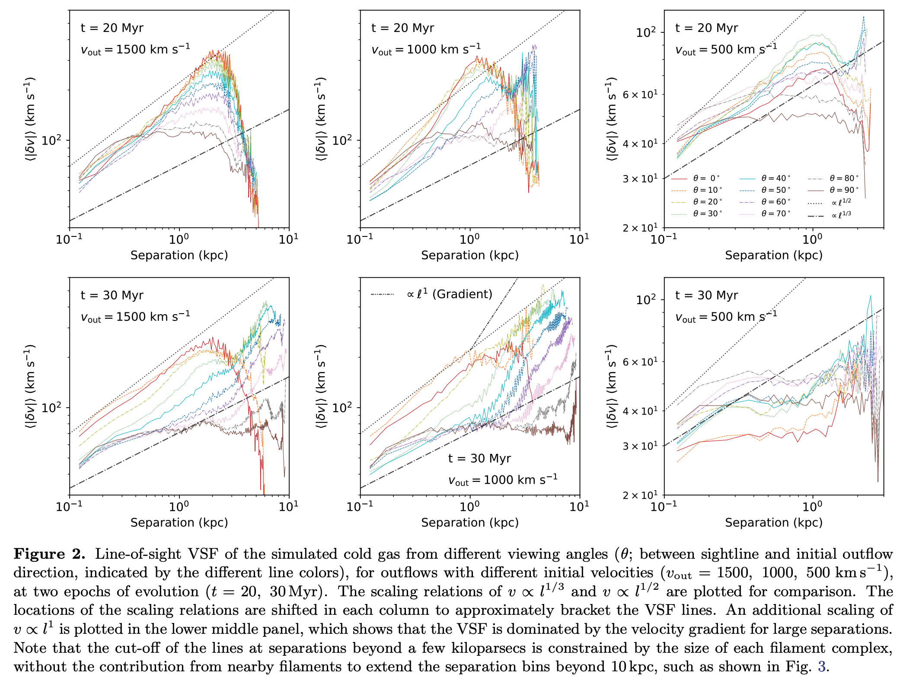
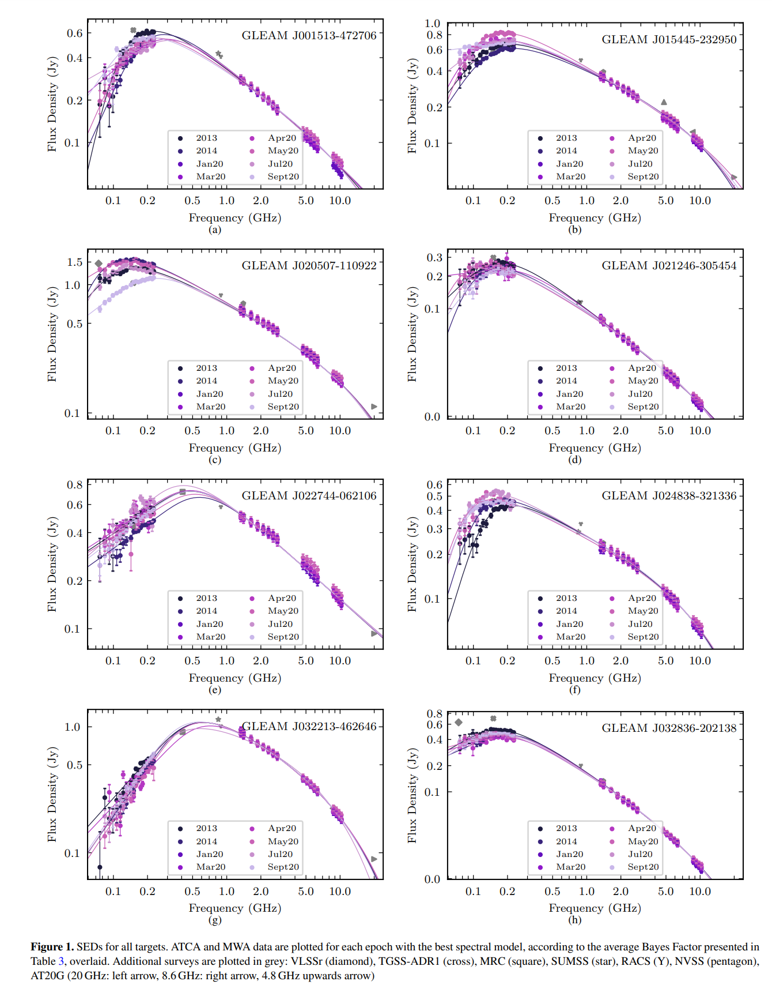
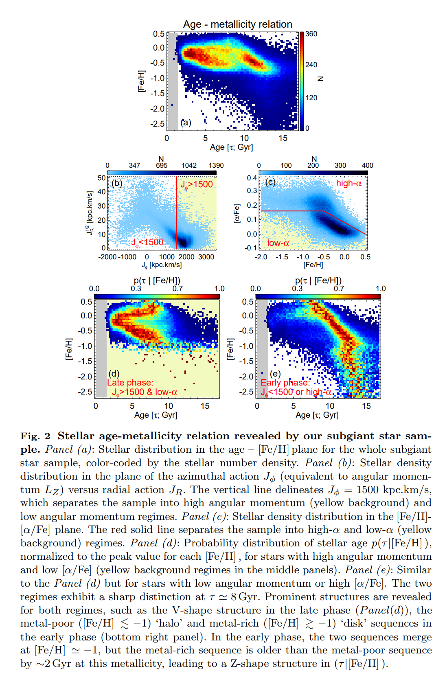
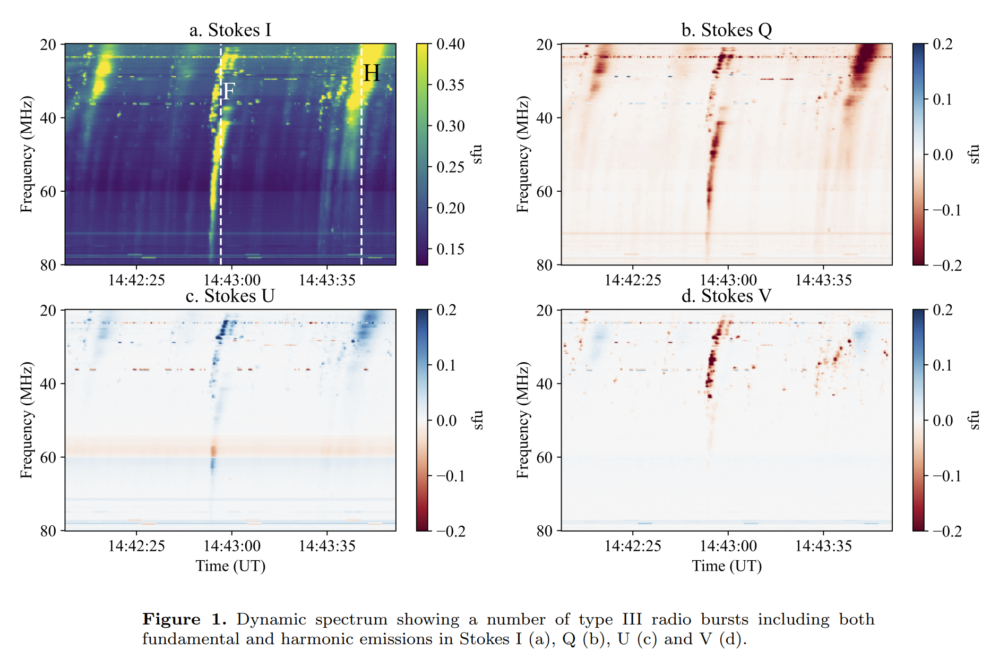
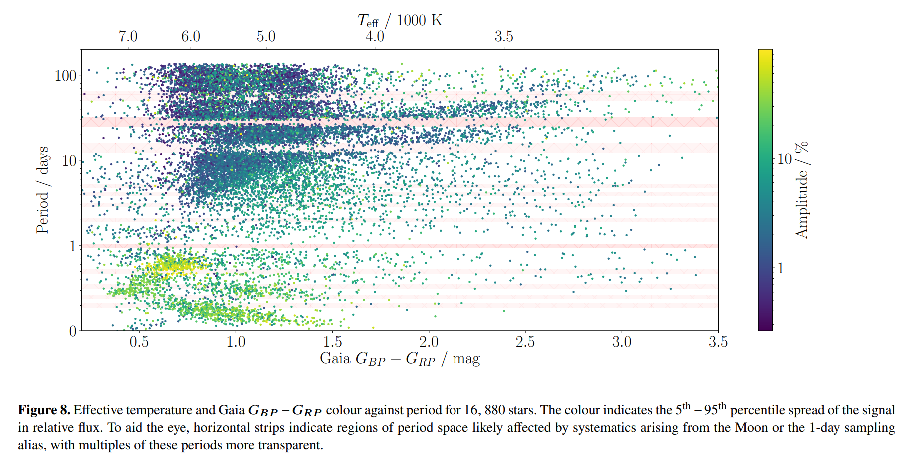

## 2022-03-01

1. [The Large Dispersion and Scattering of FRB 20190520B are Dominated by the Host Galaxy](https://arxiv.org/abs/2202.13458)

   > Fast Radio Burst, Dispersion Measure, Scattering, Host Galaxy

   `FRB 20190520B`在$1.4\ \rm Ghz$的平均散射时标是$\tau=10.9\pm1.5\ \rm ms$，闪烁带宽是$\Delta \nu_d=0.21\pm0.01\ \rm MHz$，与银河系闪烁一致。对于一个双屏散射几何，$\tau$来自宿主星系，$\Delta\nu_d$来自银河系，FRB和主要散射介质之间的距离$\le100\ \rm pc$。$\tau-\rm DM$关系可以用来估计FRB的红移。

2. [Unprecedented change in the position of four radio sources](https://arxiv.org/abs/2202.13119)

   > Extragalactic Galaxy, VLBI, AGN, Astrometry

   `VLBI`可以测量AGN的位置到亚毫角秒的精度。遥远的银河系外天体的自行通常比较小，使用2018-2021的VLBI观测数据，`3C48`、`CTA21`、`1144+352`、`1328+254`的位置在过去20年内发生了$20-130\ \rm mas$的变化，位置移动是由于射电结构变化导致的。

## 2022-03-02

1. [Homogeneous Transit Timing Analyses of Ten Exoplanet Systems](https://arxiv.org/abs/2203.00299)

   > Stellar, Exoplanet, Light Curve

   分析了10颗系外行星的凌星时间，没有发现行星轨道会有周期性的变化，轨道预计会在可观测的时间尺度上衰减。

## 2022-03-03

1. [Determining Research Priorities for Astronomy Using Machine Learning](https://arxiv.org/abs/2203.00713)

   > Machine Learning, Astronomy

   提取高影响力的天文相关文章的摘要，发现`a sum of the fractional contribution to each topic by all scientific papers`和`Compound Annual Growth Rate of these counts`与2010年美国未来十年天文学发展方向确定的高优先度的研究领域有很好的相关性。

## 2022-03-04

1. [The Velocity Statistics of Turbulent Clouds in the Presence of Gravity, Magnetic fields, Radiation, and Outflow Feedback](https://arxiv.org/abs/2203.01508)

   > ISM, Turbulence

   在模拟数据中研究引力、湍流、磁场、恒星辐射和外流反馈对恒星形成的影响。引力和外流增加了所有尺度上的速度波动。

   - 外流可以在$0.01-0.2\ \rm pc$的尺度上将速度波动放大7倍，并使湍流达到$1\ \rm pc$的尺度。
   - 引力在小尺度上更为显著，加强了小尺度的碎裂。

## 2022-03-07

1. [Planetary Genealogy](https://arxiv.org/abs/2203.02203)

   > Planetary Science, Meteorite

   观测新生恒星周围的吸积盘可以帮助理解太阳系形成与演化，陨石中稳定的同位素异常`stable isotope anomalies`可以建立一个“行星同位素谱系”，作为太阳系早期物质流动的追踪器。
   
   

## 2022-03-08

1. [Detecting the periodicity of highly irregularly sampled light-curves with Gaussian processes: the case of SDSSJ025214.67-002813.7](https://arxiv.org/abs/2203.03614)

   > Light Curve, Periodicity, Time Domian, Gaussian Process

   `SDSSJ025214.67-002813.7`长达20年的观测，采样极不规则，中间有很长的数据缺失时段。使用`高斯过程`从光变曲线中检测周期性，能够评估周期性的真实性，也可以计算功率谱密度。

## 2022-03-09

1. [Basics of Fourier Analysis for High-Energy Astronomy](https://arxiv.org/abs/2203.04106)

   > Time Domain, Fourier

   傅立叶分析入门理论基础。介绍了连续/离散傅立叶变换，加窗，FFT，功率谱，自相关，交叉光谱，双相干，Lomb-Scargle，短时傅立叶变换，小波和其他技术。

## 2022-03-10

1. [The Low Frequency Perspective on Fast Radio Bursts](https://arxiv.org/abs/2203.04890)

   > Fast Radio Burst, Review

   CHIME在$400-800\,\rm MHz$波段一年时间里发现了500个FRB。低频的观测发现了一个`nearby population`，对其研究可以描述FRB周围环境，以及近域宇宙。这是一篇综述，描述FRB在低频的研究。

## 2022-03-11

1. [Signature of Supersonic Turbulence in Galaxy Clusters](https://arxiv.org/abs/2203.04977)

   > Galaxy, Turbulence

   热星系际介质`ICM`被认为是静止的，观测到的速度弥散很低，其内表面亮度波动表明它的湍流是亚音速的，有`Kolmogorov`的比例关系，表明动能无损级联。最近对星系团中冷气体纤维的观测表明其比例关系比热等离子体更陡峭，表明动能损失。

   使用高分辨率模拟星系团冷纤维的湍流速度结构，结果表明，当冷却时标短于动力学时标时，超音速湍流结构可以被“冻结”在冷气体中，冷气体从中心AGN驱动的外流中冷却并分裂出去，表明超音速外流是`AGN-ICM`相互作用的一个组成部分，AGN活动驱动星系团中湍流。

   

## 2022-03-14

1. [On the radio spectra of Galactic millisecond pulsars](https://arxiv.org/abs/2203.05560)

   > Millisecond Pulsar, Spectra

   在$0.135-6.6\,\rm GHz$波段有179个毫秒脉冲星，MCMC拟合表明`MSP`的流量在$320\,\rm MHz$以下与频率无关，在高频与$\nu^{-1.5}$成正比，后者过高估计了在低频可能看到的`MSP`的数量。

## 2022-03-15

1. [AT2020hur: A Possible Optical Counterpart of FRB 180916B](https://arxiv.org/abs/2203.06994)

   > Fast Radio Burst, Optical

   搜索FRB光学对应体，找到重复暴`FRB20180916B`的光学暂现源`AT2020hur`，位置高度重合，重合概率$0.04\%$，并且后者位于前者的一个活动窗口中。

## 2022-03-16

1. [Simultaneous view of the FRB~180301 with FAST and NICER during a bursting phase](https://arxiv.org/abs/2203.07465)

   > Fast Radio Burst, X-ray

   `NICER`与`FAST`一起看`FRB180301`，`NICER`没看到X-ray的辐射。2021年的观测与2019年比，L波段线偏振度降低，一样没有明显的圆偏振。

2. [Limits on the hard X-ray emission from the periodic fast radio burst FRB 180916.J0158+65](https://arxiv.org/abs/2203.07489)

   > Fast Radio Burst, X-ray

   `Burst Alert Telescope (BAT)`是The Neil Gehrels Swift Observatory的硬X射线望远镜，定位精度可以做到3角分。没有看到`FRB180916`的X-ray辐射。

## 2022-03-17

1. [Magnetic Field Reversal around an Active Fast Radio Burst](https://arxiv.org/abs/2203.08151)

   > Fast Radio Burst, Polarization

   代实的文章，与我有关。讲FRB190520的RM符号反转的事情。

2. [Galaxy And Mass Assembly (GAMA): Data Release 4 and the z < 0.1 total and z < 0.08 morphological galaxy stellar mass functions](https://arxiv.org/abs/2203.08539)

   > Extragalactic Galaxy, GAMA, Mass Function

   `Galaxy And Mass Assembly, GAMA DR4`给出了248682个光谱，覆盖超过$250\,\rm deg^2$的区域。提供了15330个$z<0.08$的星系的图像，所有天体的光度红移以及111830个星系的速度弥散。对不同形态星系的质量函数的估计，结论是在$z<0.1$时，宇宙大爆炸核合成的重子质量的$4.9\%$转化为恒星。

## 2022-03-18

1. [Comparison of the Parkes and FAST FRB DM Distribution](https://arxiv.org/abs/2203.08816)

   > Fast Radio Burst, Dispersion Measure

   FAST和Parkes有相似的多波束接收机，比较两个望远镜观测到的FRB的DM分布，集中在$1000\le DM\le2000\,\rm pc/cm^3$。模型表示，FAST可能很适合用来区分红移演化模型，并且探测`IGM`的氦电离信号。

2. [X-ray Polarization at the Crossroads](https://arxiv.org/abs/2203.09066)

   > High Energy, X-ray, Polarization, Magnetar

   `IXPE`是NASA最近发射的X射线偏振成像探测器。对X射电的偏振测量将回答许多关于磁星的问题，包括其表面的物理状态、是否存在真空双折射以及硬X射线发射的性质。

## 2022-03-21

1. [The IAU Working Definition of an Exoplanet](https://arxiv.org/abs/2203.09520)

   > Exoplanet, Definition

   **行星** - 围绕恒星、褐矮星或者恒星残骸运行，最大质量低于氘聚变的天体（13个木星质量的太阳金属丰度的天体），与中心天体质量比低于$L_4/L_5$不稳定性（$M/M_c<1/25$），最小质量与太阳系内相同，自重足够克服刚体力，并且足以清除轨道周围邻域。

2. [The Life and Times of Giant Molecular Clouds](https://arxiv.org/abs/2203.09570)

   > Star Formation, ISM

   巨分子云形成与演化综述。

## 2022-03-22

1. [Magnetic fields in star formation: from clouds to cores](https://arxiv.org/abs/2203.11179)

   > Star Formation, ISM, Magnetic Field

   回顾磁场在恒星形成过程中作用的研究进展。最近的结果支持磁场在云的次级结果形成中有重要作用，它为分子云中大规模气体流动设定了首选方向，引导物质吸积到纤维和恒星形成中心。

## 2022-03-23

1. [Wide-Band Spectral Variability of Peaked Spectrum Sources](https://arxiv.org/abs/2203.11466)

   > Galaxy, Radio Continuum, Spectrum

   射电连续谱的变化可以用来研究源结构、介质的发射和吸收过程。使用`ATCA`和`MWA`对15个`Peaked Spectrum`源进行了宽带$0.072-10\, \rm GHz$的观测，在$1\,\rm GHz$以上没有检测到光谱变化，其中13个在$1\,\rm MHz$频率下看到了变化，认为是一个直径为$25\,\rm mas$的致密成分的折射导致的闪烁。

   

2. [Update on the Systematics in the ALMA Proposal Review Process after Cycle 8](https://arxiv.org/abs/2203.11334)

   > ALMA, Proposal, Systematics

   `ALMA`提案的系统性分析。第七轮给了评审小组PI的整体名单，第八轮名单都没有。有过ALMA申请经验的提案总体排名更好。第二次提交的排名相比之前有所提高。来自智利、东亚的PI比欧洲和北美的有较差的总体排名，排名没有性别差异。

## 2022-03-24

1. [A time-resolved picture of our Milky Way's early formation history](https://arxiv.org/abs/2203.12110)

   > Milky Way, Stellar, Isochrone

   基于`Yonsei-Yale stellar evolution models`产生的等龄线，结合Gaia和LAMOST数据，产生恒星年龄和金属丰度的大样本。

   在$8\,\rm Gyr$处可以将恒星的金属性分成两部分，较年轻的部分反映银盘形成的晚期，另一部分反映早期阶段银晕和厚盘形成时期。在大爆炸后$0.8\,\rm Gyr$，银河系厚盘开始形成（也即距今$13\,\rm Gyr$之前），恒星大部分形成于这之后$2\,\rm Gyr$。此时`Gaia-Sausage-Enceladus`与银河系合并，并在接下来$5-6\,\rm Gyr$，银河系元素富集了10倍。

   

2. [sympy2c: from symbolic expressions to fast C/C++ functions and ODE solvers in Python](https://arxiv.org/abs/2203.11945)

   > Software, Cosmology

   [sympy2c](https://cosmology.ethz.ch/research/software-lab/sympy2c.html)，`SymPy`的`C++`封装，可从符号表示创建计算公式，在`PyCosmo`中用来求解爱因斯坦-玻尔兹曼方程。

## 2022-03-25

1. [What it takes to measure Reionization with Fast Radio Bursts](https://arxiv.org/abs/2203.12645)

   > Fast Radio Burst, Cosmology

   使用$100$个$z>5$的FRB，`FlexKnot`参数化可以做到对再电离$4\%$精度的约束。

## 2022-03-28

1. [HST/WFC3 transmission spectroscopy of the cold rocky planet TRAPPIST-1h](https://arxiv.org/abs/2203.13698)

   > Exoplanet, Atmosphere

   `TRAPPIST-1`是一颗超冷矮星，有7颗岩质行星，使用HST观测最外围行星三次凌星的光变曲线，分析行星大气透射光谱，结果表明这颗行星大气平均分子量高、没有大气或者不透明的气溶胶层。进一步定性需要更宽的波段进行更精确的测量，这将是JWST可以做到的。

## 2022-03-29

1. [Status of the IAU Meteor Data Center](https://arxiv.org/abs/2203.13823)

   > Planetary Science, Solar System, Meteor

   IAU的流星数据中心`MDC`有两部分，轨道数据库`OD`和雨量数据库`SD`，后者包含了流星的轨道参数，主要任务是给新的流星雨命名。

2. [Fast Radio Bursts](https://arxiv.org/abs/2203.14198)

   > Fast Radio Bursts, Review

   戴老板写的FRB的综述，作为`Handbook of X-ray and Gamma-ray Astrophysics`的一章，包含了快速射电暴的各个属性，包含DM、RM、散射、闪烁等，以及理论。

3. [Overview of the LAMOST survey in the first decade](https://arxiv.org/abs/2203.14300)

   > Stellar, LAMOST, Review

   发表在*Innovation*上的介绍LAMOST在10年里直到DR8的观测和科学成果。

4. [Exploring the circular polarisation of low-frequency solar radio bursts with LOFAR](https://arxiv.org/abs/2203.14674)

   > Solar Radio Burst, LOFAR, Polarization

   使用LOFAR研究太阳III型暴的圆偏振。对2019年3-4月的六个爆发，`fundamental emission`随频率增加而增加，`harmonic emission`没有这样的趋势。

   

5. [The Environment and Constraints on the Mass of FRB 190520B](https://arxiv.org/abs/2203.14943)

   > Fast Radio Bursts, Calculation

   190520的DM与waiting time不相关，对DM产生变化的区域的特征时间尺度提供了上限$10s$。对比DM和RM的变化，约束磁场$\ge300\mu G$。

## 2022-03-30

1. [Cometary science with CUBES](https://arxiv.org/abs/2203.15579)

   > Planetary Science, Solar System, Comet

   `CUBES`是将放在`Very Large Telescope`上的紫外$305-400\,\rm nm$光谱仪，彗星的气体在这个波段有大量的发射特征，可以研究彗核的化学成分和冰的含量，为早期太阳系模型提供信息。`CUBES`对暗淡彗星的水和气态金属（如`Fel`和`Nil`）敏感，可以促进对彗星的研究。

## 2022-03-31

1. [Periodic stellar variability from almost a million NGTS light curves](https://arxiv.org/abs/2203.15894)

   > Stellar, Light Curve, Gaia

   使用自相关函数`G-ACF`分析下一代凌星巡天`NGTS`中`late-A`到`mid-M`型共16880个恒星的光变周期，在$0.1-130\,\rm d$之间。将周期与Gaia的恒星参数进行比较，发现主序星缺少$15-25\,\rm d$的周期。还观察到一小部分长周期可变的`M-dwarfs`。

   

