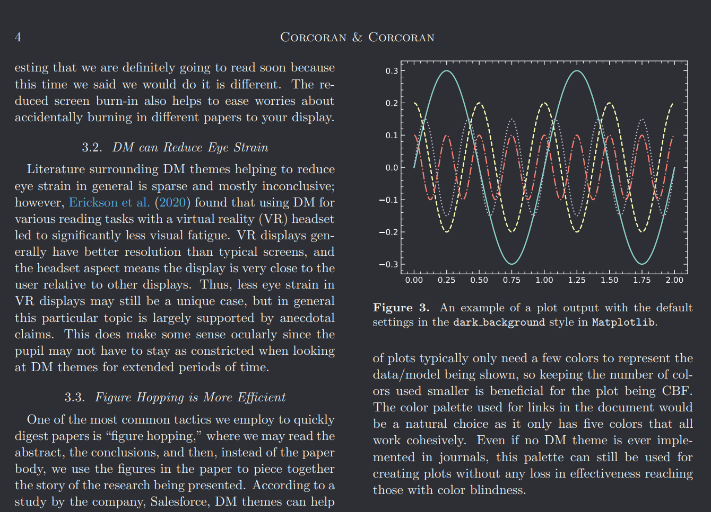
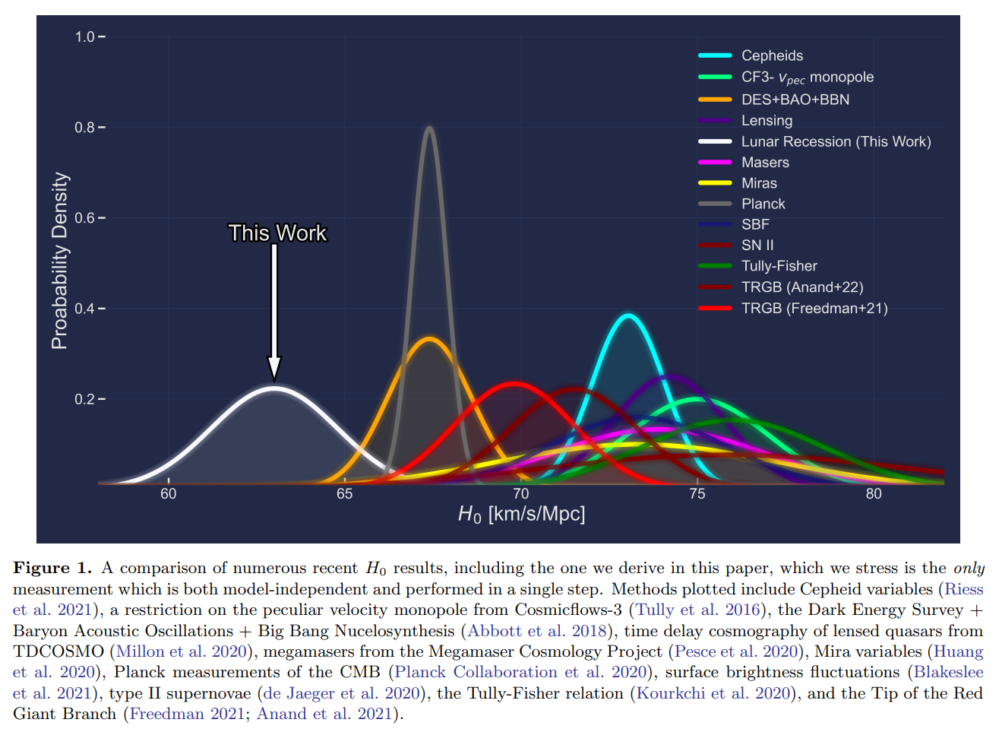
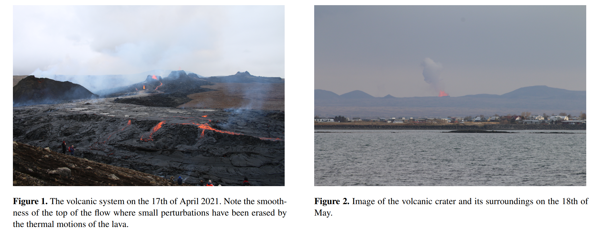
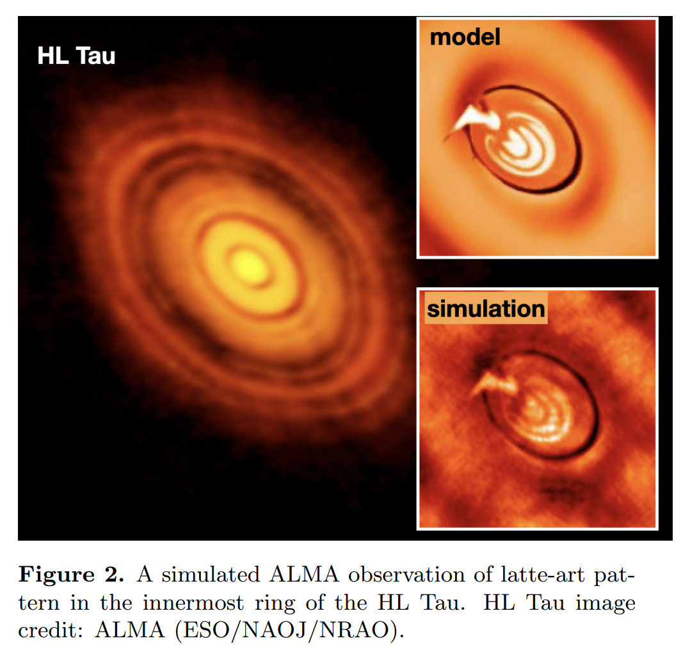
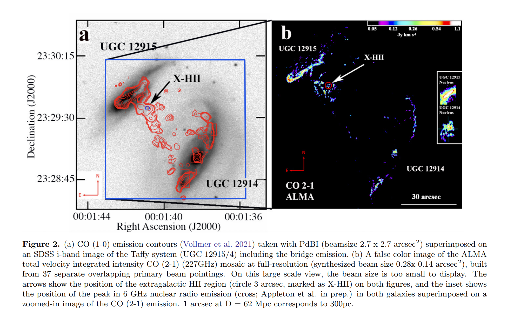
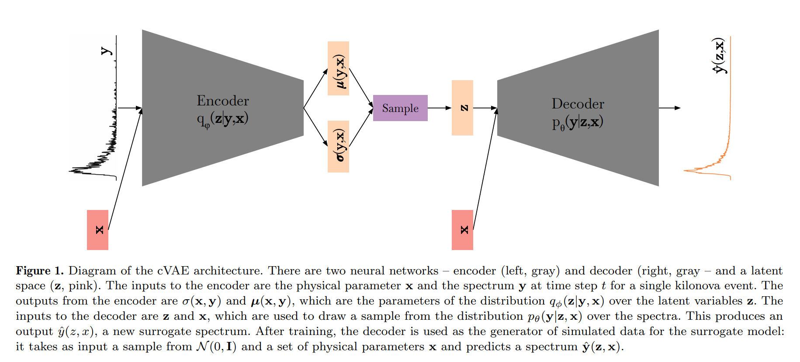

## 2022-04-01

1. ["My Rhodopsin!": Why Adding Dark Mode to Journals Could Make Us All Better Astronomers](https://arxiv.org/abs/2203.16546)

   > April Fools

   在天文期刊中增加`黑夜模式`。

   

2. [Worry No More, The Hubble Tension is Relieved: A Truly Direct Measurement of the Hubble Constant from Mooniversal Expansion](https://arxiv.org/abs/2203.16551)

   > April Fools

   使用月球的退行速度计算本地宇宙的哈勃常数$H_0=v/d=63.01\pm1.79\,\rm km/s/Mpc$，其中$d$是地月距离，与普朗克测量结果一致，说明Hubble Tension确实是距离阶梯系统不稳定的结果。

   

3. [Could fresh lava be (warm) dark matter?](https://arxiv.org/abs/2203.16563)

   > April Fools

   暗物质可以根据其对星系的影响进行分类，包括冷暗物质`CDM`、温暗物质`WDM`、自作用暗物质`SIDM`和模糊暗物质`FDM`。为了庆祝冰岛`Fagradalsfjall`火山爆发一周年，探讨岩浆作为`WDM`的候选者。首先，根据亲身经历，岩浆确实是温的，而且与产生源脱离后就会变黑。

   

4. [Taurine in Taurus. An Over-Caffeinated Search for Coffee in Space](https://arxiv.org/abs/2203.16598)

   > April Fools

   当你熬夜过度，身体空虚，会导致*意想不到*的发现…在短短$1/4$天里，开发了`Large Astrocomical Taurine Tester Experiment`拿铁实验，看向`HL Tau`，发现大量的`taurine`气体勾勒出一杯咖啡，`HL Tau`的环境结构是宇宙咖啡师表演的拿铁艺术。

   

5. [COWS all tHE way Down (COWSHED) I: Could cow based planetoids support methane atmospheres?](https://arxiv.org/abs/2203.16609)

   > April Fools

   讨论需要多少头牛（大概1019头）可以形成一个完全由牛组成的行星，并且维持甲烷大气层。

6. [On the Possibility of Discovering Exoplanets within our Solar System](https://arxiv.org/abs/2203.17075)

   > April Fools

   系外行星的发现速度大概每39个月翻一番，表明银河系的系外行星数量正在失控地增加。由于银河系空间有限，这些系外行星将越来越可能在太阳系内发现。计算出在2146年12月9日星期五发生这种情况的概率为50%。

7. [A Self-Learning Neural Network Approach for RFI Detection and Removal in Radio Astronomy](https://arxiv.org/abs/2203.16607)

   > Radio, RFI, Machine Learning

   宇宙中的信号可以被描述为一个高斯随机过程，无法被压缩。基于这样一个事实，可以做到不需要训练集来消除RFI。使用VAE找寻数据流中的可压缩信息，能够以最小的自由度解释最大的`variance`。

8. [Search for Coincident Gravitational Wave and Fast Radio Burst Events from 4-OGC and the First CHIME/FRB Catalog](https://arxiv.org/abs/2203.17222)

   > Fast Radio Burst, Gravitational Wave

   匹配`4-OGC`的引力波目录和`CHIME`的FRB目录，在2019年4月1日至7月1日之间，没有相匹配的结果。表明最多有$0.01\%-0.1\%$的FRB是由双中子星并合产生的。

9. [The CO emission in the Taffy Galaxies (UGC 12914/5) at 60pc resolution-I: The battle for star formation in the turbulent Taffy Bridge](https://arxiv.org/abs/2203.17142)

   > Star Formation, Turbulence

   使用ALMA对`Taffy`星系的CO进行$0.2$角秒$60\,\rm pc$观测，与窄带$\rm Pa\alpha$、中红外、射电连续谱和X射线以及光学光谱进行比较。这个星系最近经理了一次碰撞，产生了高度湍流的气体桥，由狭窄的纤维和团块组成。这些纤维中大都没有恒星形成，并且明显低于正常星系的KS关系。这些云是一个高度湍流的多相介质中的暂现结构，抑制恒星形成。

   

10. [Insight-HXMT dedicated 33-day observation of SGR J1935+2154 I. Burst Catalog](https://arxiv.org/abs/2203.16855)

    > High Energy, Magnetar

    慧眼对`SGR1935`在2020年33天的观测，探测到75次爆发，其中70个是单脉冲，最大爆发率是$56/day$，等待时间是`LogNormal`，持续时间长的爆发往往发生在事件率相对高的时期。脉冲能量和硬度比与持续时间没有发现关联。

## 2022-04-04

1. [KilonovaNet: Surrogate Models of Kilonova Spectra with Conditional Variational Autoencoders](https://arxiv.org/abs/2204.00285)

   > Kilonova, Spectrum, Machine Learning, VAE

   使用`cVAE`对千新星的光谱进行训练，进行参数推断。

   

## 2022-04-05

