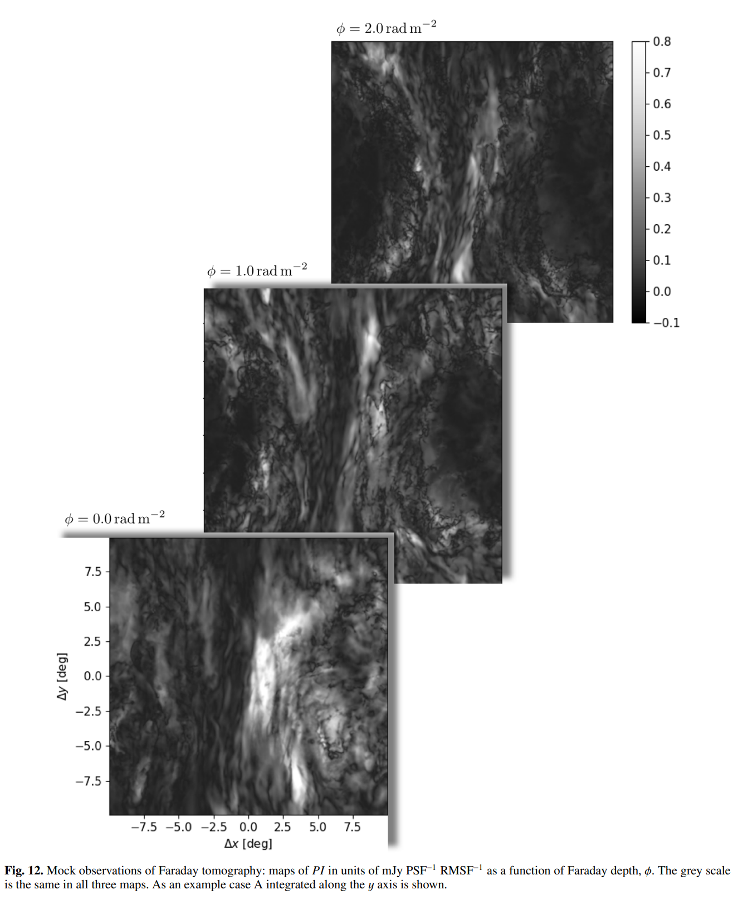
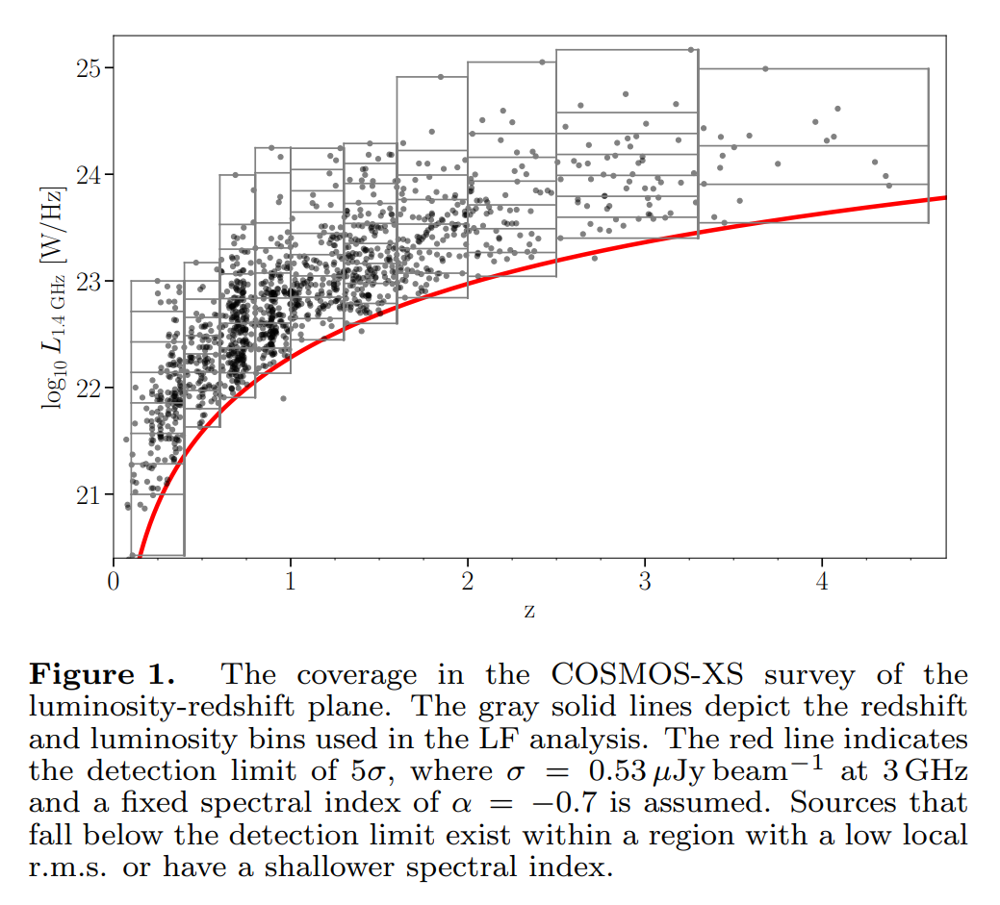
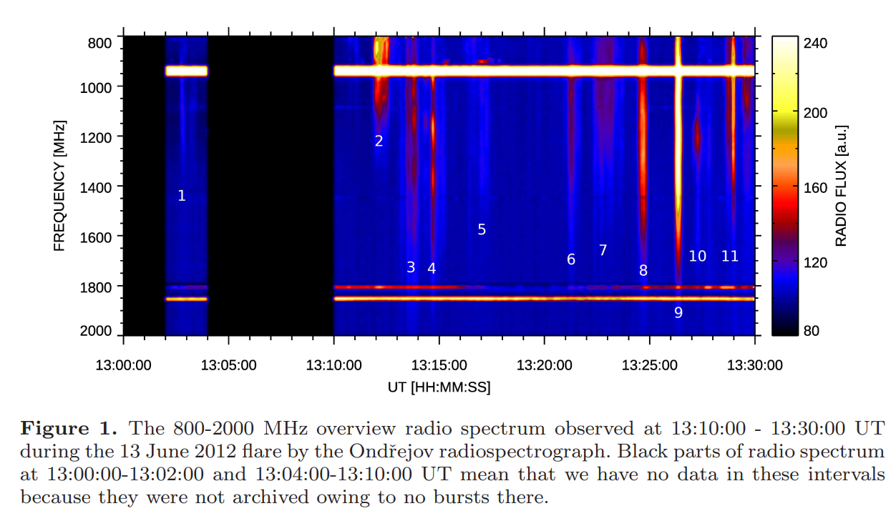

## 2022-04-01

1. ["My Rhodopsin!": Why Adding Dark Mode to Journals Could Make Us All Better Astronomers](https://arxiv.org/abs/2203.16546)

   > April Fools

   在天文期刊中增加`黑夜模式`。

   

2. [Worry No More, The Hubble Tension is Relieved: A Truly Direct Measurement of the Hubble Constant from Mooniversal Expansion](https://arxiv.org/abs/2203.16551)

   > April Fools

   使用月球的退行速度计算本地宇宙的哈勃常数$H_0=v/d=63.01\pm1.79\,\rm km/s/Mpc$，其中$d$是地月距离，与普朗克测量结果一致，说明Hubble Tension确实是距离阶梯系统不稳定的结果。

   

3. [Could fresh lava be (warm) dark matter?](https://arxiv.org/abs/2203.16563)

   > April Fools

   暗物质可以根据其对星系的影响进行分类，包括冷暗物质`CDM`、温暗物质`WDM`、自作用暗物质`SIDM`和模糊暗物质`FDM`。为了庆祝冰岛`Fagradalsfjall`火山爆发一周年，探讨岩浆作为`WDM`的候选者。首先，根据亲身经历，岩浆确实是温的，而且与产生源脱离后就会变黑。

   

4. [Taurine in Taurus. An Over-Caffeinated Search for Coffee in Space](https://arxiv.org/abs/2203.16598)

   > April Fools

   当你熬夜过度，身体空虚，会导致*意想不到*的发现…在短短$1/4$天里，开发了`Large Astrocomical Taurine Tester Experiment`拿铁实验，看向`HL Tau`，发现大量的`taurine`气体勾勒出一杯咖啡，`HL Tau`的环境结构是宇宙咖啡师表演的拿铁艺术。

   

5. [COWS all tHE way Down (COWSHED) I: Could cow based planetoids support methane atmospheres?](https://arxiv.org/abs/2203.16609)

   > April Fools

   讨论需要多少头牛（大概1019头）可以形成一个完全由牛组成的行星，并且维持甲烷大气层。

6. [On the Possibility of Discovering Exoplanets within our Solar System](https://arxiv.org/abs/2203.17075)

   > April Fools

   系外行星的发现速度大概每39个月翻一番，表明银河系的系外行星数量正在失控地增加。由于银河系空间有限，这些系外行星将越来越可能在太阳系内发现。计算出在2146年12月9日星期五发生这种情况的概率为50%。

7. [A Self-Learning Neural Network Approach for RFI Detection and Removal in Radio Astronomy](https://arxiv.org/abs/2203.16607)

   > Radio, RFI, Machine Learning

   宇宙中的信号可以被描述为一个高斯随机过程，无法被压缩。基于这样一个事实，可以做到不需要训练集来消除RFI。使用VAE找寻数据流中的可压缩信息，能够以最小的自由度解释最大的`variance`。

8. [Search for Coincident Gravitational Wave and Fast Radio Burst Events from 4-OGC and the First CHIME/FRB Catalog](https://arxiv.org/abs/2203.17222)

   > Fast Radio Burst, Gravitational Wave

   匹配`4-OGC`的引力波目录和`CHIME`的FRB目录，在2019年4月1日至7月1日之间，没有相匹配的结果。表明最多有$0.01\%-0.1\%$的FRB是由双中子星并合产生的。

9. [The CO emission in the Taffy Galaxies (UGC 12914/5) at 60pc resolution-I: The battle for star formation in the turbulent Taffy Bridge](https://arxiv.org/abs/2203.17142)

   > Star Formation, Turbulence

   使用ALMA对`Taffy`星系的CO进行$0.2$角秒$60\,\rm pc$观测，与窄带$\rm Pa\alpha$、中红外、射电连续谱和X射线以及光学光谱进行比较。这个星系最近经理了一次碰撞，产生了高度湍流的气体桥，由狭窄的纤维和团块组成。这些纤维中大都没有恒星形成，并且明显低于正常星系的KS关系。这些云是一个高度湍流的多相介质中的暂现结构，抑制恒星形成。

   

10. [Insight-HXMT dedicated 33-day observation of SGR J1935+2154 I Burst Catalog](https://arxiv.org/abs/2203.16855)

   > High Energy, Magnetar

   慧眼对`SGR1935`在2020年33天的观测，探测到75次爆发，其中70个是单脉冲，最大爆发率是$56/day$，等待时间是`LogNormal`，持续时间长的爆发往往发生在事件率相对高的时期。脉冲能量和硬度比与持续时间没有发现关联。

## 2022-04-04

1. [KilonovaNet: Surrogate Models of Kilonova Spectra with Conditional Variational Autoencoders](https://arxiv.org/abs/2204.00285)

   > Kilonova, Spectrum, Machine Learning, VAE

   使用`cVAE`对千新星的光谱进行训练，进行参数推断。

   

## 2022-04-05

1. [Fundamental scales in the kinematic phase of the turbulent dynamo](https://arxiv.org/abs/2204.00828)

   > Turbulence, Magnetic Field

   湍流发电机是将湍流动能转换为磁能的机制。湍流磁场最集中的尺度$k_p$由粘性尺度（湍流动能耗散的尺度）$k_\nu$还是电阻尺度（磁场耗散的尺度）$k_\eta$决定，一直存在一些分歧。使用磁流体动力学湍流进行数值模拟，表明$k_p$与$k_\eta$相关。而雷诺数$Re=100$湍流发电机开始起作用。

## 2022-04-06

1. [Photometric redshift-aided classification using ensemble learning](https://arxiv.org/abs/2204.02080)

   > Machine Learning, Photometry Classification

   在SDSS和WISE光度测量的数据集上使用`XGBoost`、`LightGBM`和`CatBoost`组成的集成学习分类器，来对星系、类星体和恒星进行分类，表现优于之前的随机森林分类器。

## 2022-04-07

1. [First look at the multiphase interstellar medium with synthetic observations of low-frequency Faraday tomography](https://arxiv.org/abs/2204.02774)

   > Radio, Polarization, Rotation Measure, Low Frequency

   `LOFAR`在200MHz以下偏振数据的`Faraday tomography`看到了与HI和尘埃等重性气体相关的法拉第旋转同步辐射偏振。文章模拟了物种不同阶段的气体 - `热的`、`温的`、`完全电离的`到`冷的`中性介质，研究不同气相对200MHz以下的RM和同步辐射偏振强度的合成观测的贡献。

   视线垂直于磁场时，HI和同步辐射偏振强度之间有很强的相关性，与LOFAR观测很像。

   

## 2022-04-08

1. [Serendipitous discovery of radio flaring behaviour from a nearby M dwarf with MeerKAT](https://arxiv.org/abs/2204.03481)

   > Stellar, Radio continuum, Flare

   `MKT J174641.0−321404`距离太阳$12\,\rm pc$，是一颗M型矮星。`MeerKAT`在$1.3\,\rm GHz$看到了这颗恒星的光变，之后的多波段观测表明，在整个电磁波谱内都有耀斑活动，这与`dMe`恒星的预测一致。

## 2022-04-11

1. [An ultra-deep multi-band VLA survey of the faint radio sky (COSMOS-XS): New constraints on the cosmic star formation history](https://arxiv.org/abs/2204.04167)

   > Galaxy, Cosmology, Star Formation

   使用多波段`COSMOS-XS`巡天的$3\,\rm GHz$的数据，推断`恒星形成星系, SFG`的射电`光度函数`。发现红移到$z\sim4.6$的1300个`SFG`的光度有强烈的红移演化趋势。拟合恒星形成率密度`SFRD`，发现其上升直到$z\sim1.8$，随后更快下降。

   

## 2022-04-12

1. [The Northern Cross Fast Radio Burst project - II. Monitoring of repeating FRB 20180916B, 20181030A, 20200120E and 20201124A](https://arxiv.org/abs/2204.05050)

   > Fast Radio Burst

   使用`Medicina Northern Cross radio telescope`在$408\,\rm MHz$观测四个重复暴19个月，探测到`180916`的三个爆发，均在周期预测期间探测到。没有探测到另外三个FRB的爆发，使用CHIME的事件率估算这台望远镜的事件率，`201124`应该是$1/hr$，正好没看到。

## 2022-04-13

1. [Dynamical characterization of galaxies up to z∼7](https://arxiv.org/abs/2204.05325)

   > Galaxy, Dynamics

   描述$z\sim7$的星系动力学状态对于约束早期宇宙中`mass assembly`的驱动机制至关重要。但是目前观测数据的质量不足以进行可靠的动力学分析。通过`SERRA`宇宙学模拟的$z\sim6-7$星系的`CII`辐射，包括了盘星系到合并星系等一系列动力学状态。

   模拟ALMA对这些数据的观测，并使用文献中的运动学分类方法。几乎没有分辨率的观测无法对星系动力学分类，基于`moment maps`的分析需要高分辨率和信噪比，在目前的数据中只有少数明亮星系满足条件。文章提出`PVsplit`对位置-速度图中的不对称性和形态特征进行量化，可以预测一个星系是盘星系还是并和星系，需要观测信噪比大于10。

## 2022-04-14

1. [A High-Time Resolution Search for Compact Objects using Fast Radio Burst Gravitational Lens Interferometry with CHIME/FRB](https://arxiv.org/abs/2204.06014)

   > Fast Radio Burst, Gravitational Lensing

   引力透镜可以产生多个背景源的图像，像`爱因斯坦十字`。对于FRB，引力透镜产生的多个相似形态的爆发，电场相位相同，但是会有一定的延迟。从172个CHIME的FRB事件100ms长的基带数据中搜索`相同电场波形的重复`数据，时间分辨率是$1.25\,\rm ns$，可以搜索$10^{-4}-10^4\,\rm M_\odot$的引力透镜信号，但并没有有效的引力透镜信号。

2. [Constraining Primordial Black Holes using Fast Radio Burst Gravitational-Lens Interferometry with CHIME/FRB](https://arxiv.org/abs/2204.06001)

   > Fast Radio Burst, Black Hole

   上一篇文章的延续，由于在172个FRB事件中没有探测到引力透镜事件，约束黑洞和暗物质的质量。

## 2022-04-15

1. [Long-term evolution of multimass rotating star clusters](https://arxiv.org/abs/2204.06578)

   > Stellar, Cluster, Dynamics, N-body

   N体模拟不同初始旋转程度的星团的演化。结果表明，旋转速度与恒星质量有关，大质量恒星旋转更快；质量分离和能量均分都有空间各向异性的特点。

## 2022-04-18

1. [Insight-HXMT dedicated 33-day observation of SGR J1935+2154 II. Burst Spectral Catalog](https://arxiv.org/abs/2204.07369)

   > Magnetar, X-ray

   在`FRB 200428`爆发后的一个月内，慧眼对`SGR 1935`进行了观测，在$1-250\,\rm keV$能带观测到75次爆发。爆发总体通量比`Fermi`低一个能量级，但依然是幂律分布。

## 2022-04-19

1. [A repeating fast radio burst residing in a magnetar/Be star binary](https://arxiv.org/abs/2204.08124)

   > Fast Radio Burst, Polarization, Theory

   王发印他们的文章，觉得`FRb 20201124A`和`FRB 20190520B`的RM变化是双星系统导致的。

## 2022-04-20

1. [Magnetar bursts due to Alfvén wave nonlinear breakout](https://arxiv.org/abs/2204.08513)

   > Fast Radio Burst, Magnetar, Theory

   三维电动力学模拟说明磁星爆发可以由局部地震发射的阿尔芬波产生，波包传播到外磁层，变得非线性并逃离磁层，形成相对论性喷射物，推开磁力线导致磁重联，使等离子体激发并发射X射线。

## 2022-04-21

1. [Non-detection of CHIME/FRB sources with the Arecibo Observatory](https://arxiv.org/abs/2204.09090)

   > Fast Radio Burst

   用AO的$327\,\rm MHz$接收机探测CHIME的两个重复暴和7个非重复暴，没有探测到爆发，使用Weibull限制事件率为$\lambda=10^{-2}-10^{-1}/\,\rm hr$，意味着可能存在一个低重复率的种群。FAST探测非重复暴可以参考这篇文章。

2. [Narrowband spikes observed during the 13 June 2012 flare in the 800-2000 MHz range](https://arxiv.org/abs/2204.09327)

   > Solar Flare, Radio

   2012年6月13日太阳耀斑在$800-2000\,\rm MHz$上的窄带$\sim5\,\rm MHz$和瞬时$\sim0.01s$的爆发。

   ’

3. [Biocosmology: Towards the birth of a new science](https://arxiv.org/abs/2204.09378)

   > Biocosmology

   天体生物学（×）生物宇宙学（√）

## 2022-04-22

1. [The detection efficiency of type Ia supernovae from the Zwicky Transient Facility: Limits on the intrinsic rate of early flux excesses](https://arxiv.org/abs/2204.09705)

   > Supernova, ZTF

   少数`Ia`型超新星会表现出`early flux excess`，但不知这种情况是本来就比较罕见，还是在超新星爆炸早期就探测到比较困难而导致的样本数量少。模拟ZTF探测，在`three day cadence`搜索的情况下，只有10%的`Ia`型超新星会在爆炸早期被探测到。假设其中有部分`early flux excess`的超新星，本征比例是$\sim28^{+13}_{-11}\%$。

## 2022-04-25

1. [Propagation of a fast radio burst through a birefringent relativistic plasma](https://arxiv.org/abs/2204.10816)

   > Fast Radio Burst, Polarization, Theory

   快速射电暴不仅能够研究星系间介质的等离子体，还可能研究产生这些爆发的极端磁-离子介质。`FRB20201124A`的一个爆发表现出频率依赖的圆偏振，与其它源和这个源的其它脉冲都不相同，可能是由辐射传播经过源的磁层内或靠近磁层的相对论性等离子体。

## 2022-04-26

1. [The Moving Mirror model for Fast Radio Bursts](https://arxiv.org/abs/2204.11663)

   > Fast Radio Burst, Theory

   蟹状星云脉冲星的相干辐射是由超相对论的冷等离子体驱动的，相对膨胀的等离子体可以压缩环境磁场，就像一面移动的镜子，产生相干辐射，波长比环境介质的波长短。这里提出类似的机制产生FRB，高的`洛伦兹系数`降低能量和磁场的要求。模型可以解释FRB频率漂移，以及持续时间、能量和没有全波段对应体，预测子脉冲的峰值频率随观测时间推移而下降 - $\omega_{obs}\propto t_{obs}^{-1/2}$。

## 2022-04-27

1. [Deep simultaneous limits on optical emission from FRB 20190520B by 24.4 fps observations with Tomo-e Gozen](https://arxiv.org/abs/2204.12334)

   > Fast Radio Burst, MultiWaveLength, Optical

   日本的一个1米望远镜对`190520`光学视频成像，帧率$24.4\,\rm fps$，FAST探测到11个爆发时，光学没有任何探测，光学流量上限为$0.068\,\rm Jy\cdot ms$。尽管还无法约束射电到光学的SED，如果射电探测到一个$5\,\rm Jy\cdot ms$的爆发，并且光学没有探测的话，可以排除FRB光学波段的发射是由脉冲星磁层的反康普顿散射的可能。

## 2022-04-28

