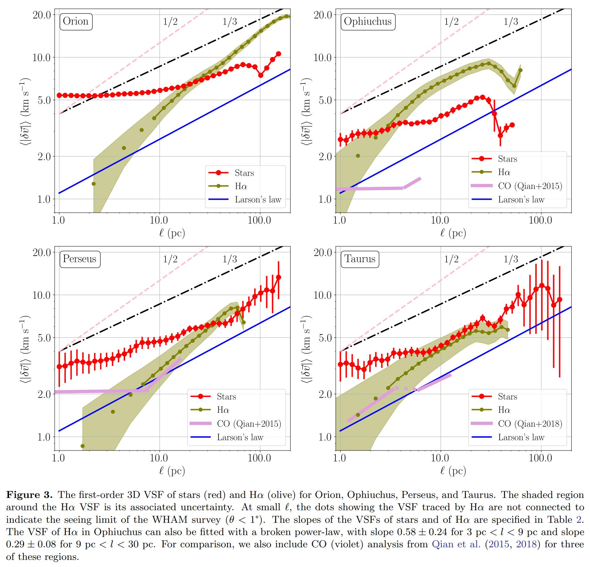
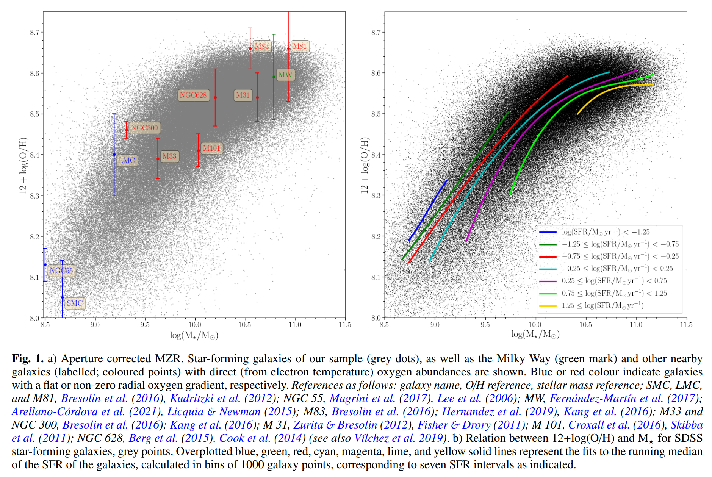
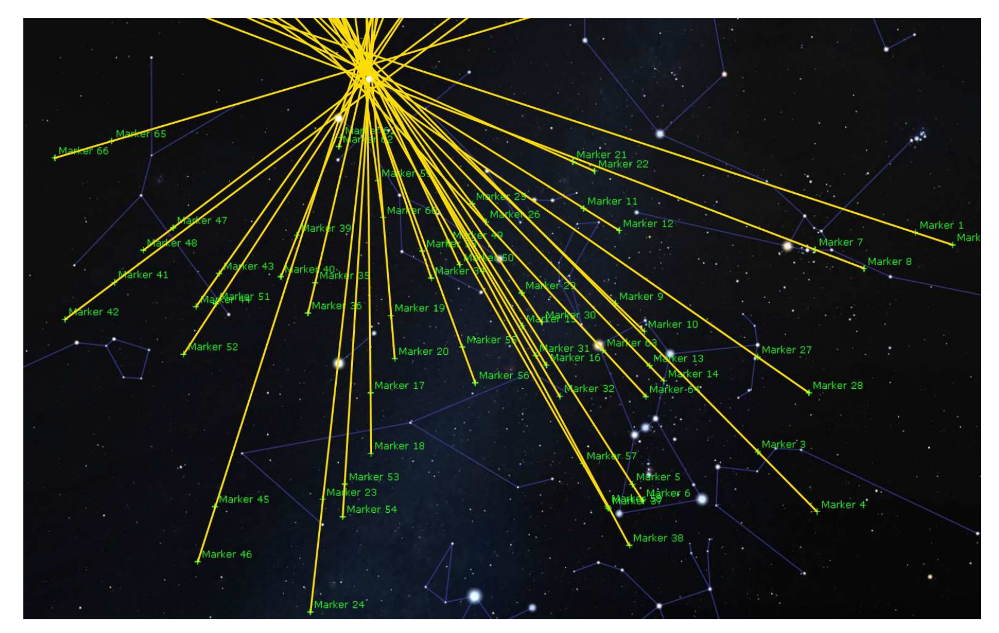
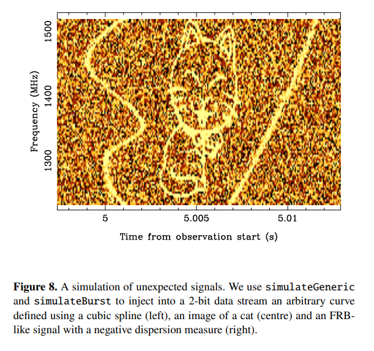
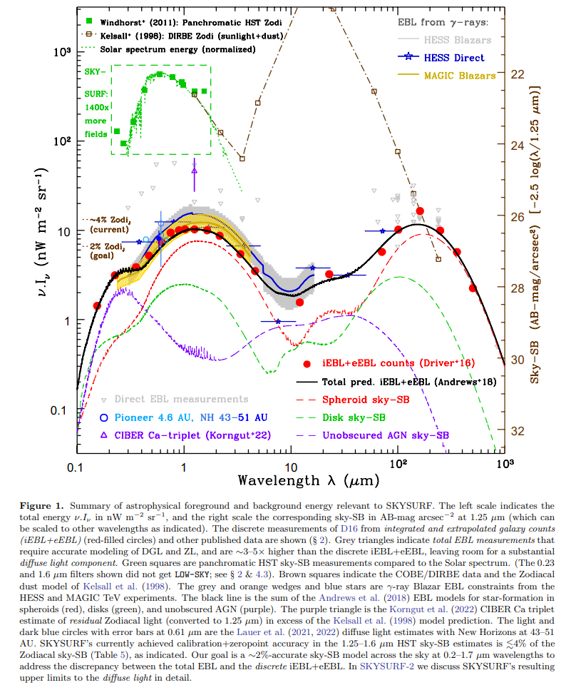

## 2022-05-02

1. [Radio sky reveals primordial electron-proton interactions](https://arxiv.org/abs/2204.13711)

   > Radio, Cosmology

   `remnant electron-proton`相互作用，导致早期宇宙中光子产生，可以解决射电测量和预测之间一直存在的差异。估计这种发射在$z\sim2150$变得重要。这种基本粒子的相互作用代表了量子电动力学在早期宇宙中的最低能量的测试。

## 2022-05-03

1. [The Potential of Detecting Radio-flaring Ultracool Dwarfs at L band in the FAST Drift-scan Survey](https://arxiv.org/abs/2205.01011)

   > Radio, Stellar, Ultracool Dwarfs

   给`Ultracool Dwarfs`估计一个光度函数，预测CRAFTS会通过圆偏振探测到170个UCDs的射电耀斑。

2. [Turbulence in Milky Way Star-Forming Regions Traced by Young Stars and Gas](https://arxiv.org/abs/2205.00012)

   > Stellar, Turbulence, Gaia, VSF

   用速度结构函数量`Orion / Ophiuchus / Perseus / Taurus`这四个区域恒星的湍流水平，恒星速度用Gaia和APOGEE得到。在有超新星活动的区域，$H\alpha$的VSF表现出能量注入的特征，以及相比恒星和CO更高的振幅，可以解释为超新星的能量传输到ISM的不同阶段，导致$H\alpha$追踪的暖电离阶段出现更高水平的湍流。没有超新星活动的区域，恒星、$H\alpha$和CO的VSF通常是一致的，表明不同阶段湍流耦合良好。

   

3. [Diagnostic functions of solar coronal magnetic fields from radio observations](https://arxiv.org/abs/2205.00136)

   > Solar, Radio, Magnetic Field

   总结了所有从太阳射电观测中测量磁场的方法，覆盖了`色球层`和`日冕`的所有区域，包括`宁静区`、`活动区`和`燃烧区`，并且包含`非相干辐射`，如宁静区上方热等离子体的轫致辐射、活动区上方磁化热等离子体的想敦伦费热电子的同步辐射、燃烧区周围的相干等离子体辐射。

## 2022-05-04

1. [Mass-Metallicity and Star Formation Rate in Galaxies: a complex relation tuned to stellar age](https://arxiv.org/abs/2205.01203)

   > Galaxy, Star Formation

   `恒星质量-金属性关系`和`SFR`之间存在复杂的相关性。

   

## 2022-05-05

1. [Observations (from 2016 to 2020) of the Geminids from different regions of Russia by an amateur astronomer](https://arxiv.org/abs/2205.01670)

   > Solar System, Amateur

   俄罗斯拍流星找辐射点。

   

## 2022-05-06

1. [A 62-minute orbital period black widow binary in a wide hierarchical triple](https://arxiv.org/abs/2205.02278)

   > Pulsar, ZTF

   双星系统中的脉冲星的辐射会烧毁低质量的伴星，这样的系统可以测试中子星的状态方程。`ZTF J1406+1222`是一个三星系统`hierarchical triple`，有第三颗恒星围绕双星系统的质心旋转的系统。里面的双星系统轨道周期是$62\,\rm min$，超过了模型的极限，即富氢系统最小$80\,\rm min$的轨道周期，光度变化超过10倍。

## 2022-05-09

1. [Simulating high-time resolution radio-telescope observations](https://arxiv.org/abs/2205.03046)

   > Radio, Signal Simulate, Software

   罗睿的文章，写了个模拟射电望远镜数据的软件，可以模拟脉冲星、FRB，也包含更细节的特征如散射和闪烁，也可以模拟RFI，软件在[这里](https://bitbucket.csiro.au/projects/psrsoft/repos/simulatesearch)。

   

2. [Dust Evolution in the Coma of Distant, Inbound Comet C/2017 K2 (PANSTARRS)](https://arxiv.org/abs/2205.02854)

   > Comet, HST

   `C/2017 K2 (PANSTARRS)`是一颗奥尔特云彗星，在2021年首次穿越内太阳系。用HST在近日点前6AU和8AU的位置观测了这颗彗星，获得光度和偏振测量。发现彗星的颜色和偏振有径向梯度，反射率和偏振距离彗核越远越强。

## 2022-05-10

1. [Four new deeply-eclipsing white dwarfs in ZTF](https://arxiv.org/abs/2205.03431)

   > Stellar, White Dwarf, ZTF

   在`ZTF DR4`中找到9个暗白矮星，其中4个进行了后随观测，分析表明四个系统都有一个$\sim0.1M_\odot$的伴星。在`ZTF DR7`中，搜索到41个暗WD+M双星系统，根据`PanSTARRS`的颜色，确定了两个短周期的`白矮星-褐矮星`双星。

2. [Interstellar planetesimals](https://arxiv.org/abs/2205.04277)

   > Planetary Science, Solar System, Asteroid

   星际小行星综述。在太阳系形成过程中，大量的小行星被行星引力甩到星际空间中，并且不再变化。星际小行星有可能被困在行星和恒星的形成环境中，作为行星形成的种子，帮助克服厘米大小的石块成长为公里大小的障碍。

   在2017年，`Oumuamua`的发现为研究行星的原始构件打开新的窗口，其可能是一个从未见过的行星形成的中间产物。

## 2022-05-11

1. [The jet and resolved features of the central supermassive black hole of M 87 observed with EHT](https://arxiv.org/abs/2205.04623)

   > Radio, Black Hole, EHT

   重处理EHT对M87观测的数据，结果与EHTC公布图像不同。在EHTC的结果中`没有喷流`并且`存在环状结构`，是由于狭窄的FOV设置以及uv数据采样偏差导致的假象，因为EHTC的模拟只考虑了输入图像模型的再现，而没有考虑输入噪声模型的再现。其最佳参数可以增强采样偏差的影响，产生$40\mu as$的环状结构，这不再是正确的图像。

## 2022-05-12

1. [CHES: a space-borne astrometric mission for the detection of habitable planets of the nearby solar-type stars](https://arxiv.org/abs/2205.05645)

   > Planetary Science, Satellite

   `Closeby Habitable Exoplanet Survey (CHES)`，提出的一个新的太空望远镜计划，直径$1.2m$，视场$0.44^\circ\times0.44^\circ$，可以在$500\sim900\,\rm nm$获得$1\mu as$的天体测量精度，运行在L2。从附近恒星宜居带中的类地行星中寻找宜居行星。

## 2022-05-13

1. [The Chinese Hα Solar Explorer (CHASE) mission: An overview](https://arxiv.org/abs/2205.05962)

   > Solar, Ha, Statellite

   「羲和」是发射于2021年10月14日的太阳探测器，对太阳进行$H\alpha$的光谱观测，有两种观测模式。光栅扫描模式获得感兴趣的区域的光谱，分辨率是$0.024\AA$，时间分辨率1分钟。连续成像模式是获得$6689\AA$周围的光球图像。文章介绍了项目的科学目标、仪器概况、数据校准流程和首批结果。**夸父已经鸽了十年了。**

2. [SKYSURF: Constraints on Zodiacal Light and Extragalactic Background Light through Panchromatic HST All-Sky Surface-Brightness Measurements: I. Survey Overview and Methods](https://arxiv.org/abs/2205.06214)

   > Solar System, HST, Zodiacal Light

   使用HST作为绝对光度计的能力，从$249,861$次曝光中测量$0.2-1.7\,\rm\mu m$的天空亮度，并约束从紫外到近红外天空中的弥漫成分，包括黄道光`Zl`、柯伊伯带天体`KBOs`、漫射银河光`DGL`、河外背景光`EBL`。

   

## 2022-05-16

