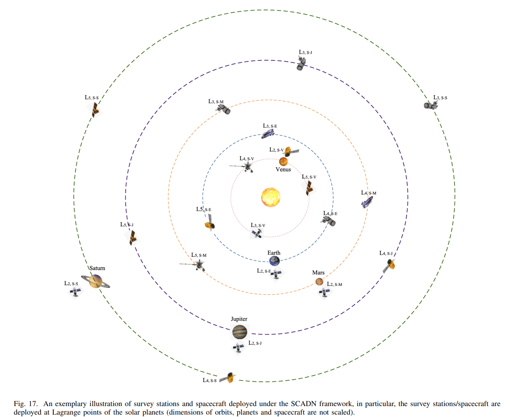

## 2022-05-02

1. [Radio sky reveals primordial electron-proton interactions](https://arxiv.org/abs/2204.13711)

   > Radio, Cosmology

   `remnant electron-proton`相互作用，导致早期宇宙中光子产生，可以解决射电测量和预测之间一直存在的差异。估计这种发射在$z\sim2150$变得重要。这种基本粒子的相互作用代表了量子电动力学在早期宇宙中的最低能量的测试。

## 2022-05-03

1. [The Potential of Detecting Radio-flaring Ultracool Dwarfs at L band in the FAST Drift-scan Survey](https://arxiv.org/abs/2205.01011)

   > Radio, Stellar, Ultracool Dwarfs

   给`Ultracool Dwarfs`估计一个光度函数，预测CRAFTS会通过圆偏振探测到170个UCDs的射电耀斑。

2. [Turbulence in Milky Way Star-Forming Regions Traced by Young Stars and Gas](https://arxiv.org/abs/2205.00012)

   > Stellar, Turbulence, Gaia, VSF

   用速度结构函数量`Orion / Ophiuchus / Perseus / Taurus`这四个区域恒星的湍流水平，恒星速度用Gaia和APOGEE得到。在有超新星活动的区域，$H\alpha$的VSF表现出能量注入的特征，以及相比恒星和CO更高的振幅，可以解释为超新星的能量传输到ISM的不同阶段，导致$H\alpha$追踪的暖电离阶段出现更高水平的湍流。没有超新星活动的区域，恒星、$H\alpha$和CO的VSF通常是一致的，表明不同阶段湍流耦合良好。

   

3. [Diagnostic functions of solar coronal magnetic fields from radio observations](https://arxiv.org/abs/2205.00136)

   > Solar, Radio, Magnetic Field

   总结了所有从太阳射电观测中测量磁场的方法，覆盖了`色球层`和`日冕`的所有区域，包括`宁静区`、`活动区`和`燃烧区`，并且包含`非相干辐射`，如宁静区上方热等离子体的轫致辐射、活动区上方磁化热等离子体的想敦伦费热电子的同步辐射、燃烧区周围的相干等离子体辐射。

## 2022-05-04

1. [Mass-Metallicity and Star Formation Rate in Galaxies: a complex relation tuned to stellar age](https://arxiv.org/abs/2205.01203)

   > Galaxy, Star Formation

   `恒星质量-金属性关系`和`SFR`之间存在复杂的相关性。

   

## 2022-05-05

1. [Observations (from 2016 to 2020) of the Geminids from different regions of Russia by an amateur astronomer](https://arxiv.org/abs/2205.01670)

   > Solar System, Amateur

   俄罗斯拍流星找辐射点。

   

## 2022-05-06

1. [A 62-minute orbital period black widow binary in a wide hierarchical triple](https://arxiv.org/abs/2205.02278)

   > Pulsar, ZTF

   双星系统中的脉冲星的辐射会烧毁低质量的伴星，这样的系统可以测试中子星的状态方程。`ZTF J1406+1222`是一个三星系统`hierarchical triple`，有第三颗恒星围绕双星系统的质心旋转的系统。里面的双星系统轨道周期是$62\,\rm min$，超过了模型的极限，即富氢系统最小$80\,\rm min$的轨道周期，光度变化超过10倍。

## 2022-05-09

1. [Simulating high-time resolution radio-telescope observations](https://arxiv.org/abs/2205.03046)

   > Radio, Signal Simulate, Software

   罗睿的文章，写了个模拟射电望远镜数据的软件，可以模拟脉冲星、FRB，也包含更细节的特征如散射和闪烁，也可以模拟RFI，软件在[这里](https://bitbucket.csiro.au/projects/psrsoft/repos/simulatesearch)。

   

2. [Dust Evolution in the Coma of Distant, Inbound Comet C/2017 K2 (PANSTARRS)](https://arxiv.org/abs/2205.02854)

   > Comet, HST

   `C/2017 K2 (PANSTARRS)`是一颗奥尔特云彗星，在2021年首次穿越内太阳系。用HST在近日点前6AU和8AU的位置观测了这颗彗星，获得光度和偏振测量。发现彗星的颜色和偏振有径向梯度，反射率和偏振距离彗核越远越强。

## 2022-05-10

1. [Four new deeply-eclipsing white dwarfs in ZTF](https://arxiv.org/abs/2205.03431)

   > Stellar, White Dwarf, ZTF

   在`ZTF DR4`中找到9个暗白矮星，其中4个进行了后随观测，分析表明四个系统都有一个$\sim0.1M_\odot$的伴星。在`ZTF DR7`中，搜索到41个暗WD+M双星系统，根据`PanSTARRS`的颜色，确定了两个短周期的`白矮星-褐矮星`双星。

2. [Interstellar planetesimals](https://arxiv.org/abs/2205.04277)

   > Planetary Science, Solar System, Asteroid

   星际小行星综述。在太阳系形成过程中，大量的小行星被行星引力甩到星际空间中，并且不再变化。星际小行星有可能被困在行星和恒星的形成环境中，作为行星形成的种子，帮助克服厘米大小的石块成长为公里大小的障碍。

   在2017年，`Oumuamua`的发现为研究行星的原始构件打开新的窗口，其可能是一个从未见过的行星形成的中间产物。

## 2022-05-11

1. [The jet and resolved features of the central supermassive black hole of M 87 observed with EHT](https://arxiv.org/abs/2205.04623)

   > Radio, Black Hole, EHT

   重处理EHT对M87观测的数据，结果与EHTC公布图像不同。在EHTC的结果中`没有喷流`并且`存在环状结构`，是由于狭窄的FOV设置以及uv数据采样偏差导致的假象，因为EHTC的模拟只考虑了输入图像模型的再现，而没有考虑输入噪声模型的再现。其最佳参数可以增强采样偏差的影响，产生$40\mu as$的环状结构，这不再是正确的图像。

## 2022-05-12

1. [CHES: a space-borne astrometric mission for the detection of habitable planets of the nearby solar-type stars](https://arxiv.org/abs/2205.05645)

   > Planetary Science, Satellite

   `Closeby Habitable Exoplanet Survey (CHES)`，提出的一个新的太空望远镜计划，直径$1.2m$，视场$0.44^\circ\times0.44^\circ$，可以在$500\sim900\,\rm nm$获得$1\mu as$的天体测量精度，运行在L2。从附近恒星宜居带中的类地行星中寻找宜居行星。

## 2022-05-13

1. [The Chinese Hα Solar Explorer (CHASE) mission: An overview](https://arxiv.org/abs/2205.05962)

   > Solar, Ha, Statellite

   「羲和」是发射于2021年10月14日的太阳探测器，对太阳进行$H\alpha$的光谱观测，有两种观测模式。光栅扫描模式获得感兴趣的区域的光谱，分辨率是$0.024\AA$，时间分辨率1分钟。连续成像模式是获得$6689\AA$周围的光球图像。文章介绍了项目的科学目标、仪器概况、数据校准流程和首批结果。**夸父已经鸽了十年了。**

2. [SKYSURF: Constraints on Zodiacal Light and Extragalactic Background Light through Panchromatic HST All-Sky Surface-Brightness Measurements: I. Survey Overview and Methods](https://arxiv.org/abs/2205.06214)

   > Solar System, HST, Zodiacal Light

   使用HST作为绝对光度计的能力，从$249,861$次曝光中测量$0.2-1.7\,\rm\mu m$的天空亮度，并约束从紫外到近红外天空中的弥漫成分，包括黄道光`Zl`、柯伊伯带天体`KBOs`、漫射银河光`DGL`、河外背景光`EBL`。

   

## 2022-05-16

1. [Improving Astronomical Time-series Classification via Data Augmentation with Generative Adversarial Networks](https://arxiv.org/abs/2205.06758)

   > Deep Learning, Light Curve, Time Domain, GAN

   使用`T-CGAN`根据`相位`、`振幅`和`类别`生成光变曲线。新东西是不平衡数据集生成模型质量的评估指标，以及识别`Fréchet Inception Distance`不能识别的`GAN`过拟合情况。在`Catalina`和`Zwicky`数据集中测试，使用合成数据训练变星的分类精度得到了提高。

## 2022-05-17

1. [Dancing with the stars: Stirring up extraordinary turbulence in Galactic center clouds](https://arxiv.org/abs/2205.06820)

   > Turbulence, Stellar, ISM, Dynamics

   `Central Molecular Zone, CMZ`的分子云有明显的湍流线宽，并且随云的尺度放缩，这里恒星密度也很高，恒星速度弥散在垂直方向弥散很大，因此年轻的恒星也可以在一生中穿过整个CMZ。计算了穿越CMZ的恒星由于`恒星风`和`动力摩擦`产生的能量沉积率，并与湍流耗散率进行比较。结果表明，`动力摩擦`不是驱动CMZ湍流的主要成分，`恒星风`导致的能量趁机可以解释CMZ湍流水平和随云尺度大小变化的比例。

2. [A hyper flare of a weeks-old magnetar born from a binary-neutron-star merger](https://arxiv.org/abs/2205.07670)

   > Magnetar, High Energy, GRB

   发现一个GRB是磁星的`hyper flare`，比磁星的`giant flare`亮1000倍，光变曲线有80ms的周期，认为是旋转周期。根据磁场强度，限制磁星年龄只有`几周`，而几周内没有超新星，说明磁星可能是由两颗中子星并合产生的。

## 2022-05-18

1. [Model-independent constraints on the baryon fraction in the IGM from fast radio bursts and supernovae data](https://arxiv.org/abs/2205.07926)

   > Fast Radio Burst, Cosmology

   将有定位的FRB的DM数据和超数据结合，分析星系间介质重子质量比例$f_{\rm IGM}$，提出一种不依赖模型的方法，证明$f_{\rm IGM}$是随红移不断演化的。

2. [A Highly Variable Magnetized Environment in a Pulsar Binary resembling Fast Radio Bursts](https://arxiv.org/abs/2205.07917)

   > Fast Radio Burst, Pulsar, Polarization, Faraday Conversion

   在球状星团双星`PSR B1744-24A`中发现在轨道相位上表现出RM随机的快速变化，以及脉冲星接近伴星时圆偏振的轮廓变化（法拉第转换）。这个源和重复FRB的相似之处、两个FRB长周期、球状星团中FRB的发现，表明部分FRB在双星系统中。李冬子的文章。

   

## 2022-05-19

1. [Polarized x-rays from a magnetar](https://arxiv.org/abs/2205.08898)

   > Magnetar, Polarization, High Energy, X-Ray

   使用`IXPE`首次在X射线波段探测到磁星的线偏振。磁星`4U 0142+61`在$2-4\,\rm keV$的线偏振度是14%，在$5.5-8\,\rm keV$是41%，在$4-5\,\rm keV$线偏振下降到一起灵敏度一下。这一发现支持了真空双折射的量子力学效应的存在。

2. [Internet of Spacecraft for Multi-planetary Defense and Prosperity](https://arxiv.org/abs/2205.08567)

   > Satellite, Planetary Defence

   回顾了`K-Pg灭绝`、`车里雅斯宾事件`、`近地天体NEO`等的观测，提出太阳系通信和防御网络框架`SCADN`，卫星分布如下。

   

3. [Categorize Radio Interference using component and temporal analysis](https://arxiv.org/abs/2205.08724)

   > Radio, RFI, Machine Learning, PCA

   用PCA对`Time-Frequency`二维数据降维，根据主成分对RFI进行分类。袁懋的文章。

## 2022-05-20

1. [Extreme solar events](https://arxiv.org/abs/2205.09265)

   > Solar, Flare, Review

   从1895年`Carrington`事件开始回顾极端太阳事件，包括`太阳黑子群`、`太阳耀斑`、`日冕物质抛射`、`太阳质子事件`、`地磁暴`。根据这些空间天气现象的发生频率分布，编制了`100- and 1000-year`事件表格。

2. [A Large Scale Magneto-ionic Fluctuation in the Local Environment of Periodic Fast Radio Burst Source, FRB 20180916B](https://arxiv.org/abs/2205.09221)

   > Fast Radio Burst, Polarization

   CHIME报道`FRB20180916B`在2018.12-2021.12之间探测到44次爆发，其中在2021.04-2021.12之间，RM增加了$50\,\rm rad/m^2$，色散变化很小，说明RM变化是磁场变化导致的。并且爆发之间有很大的RM弥散，认为其周围可能是超新星遗迹或者脉冲星风星云等磁化环境。

3. [A Polarization Pipeline for Fast Radio Bursts Detected by CHIME/FRB](https://arxiv.org/abs/2107.03491)

   > Fast Radio Burst, Polarization, CHIME, Pipline

   CHIME测量偏振的方法，主要想看他们做QU-Fitting的方式。
   $$
   \left[Q+iU\right](\lambda,t)=\left[Q+iU\right]_{\rm obs}(\lambda,t)\times e^{2i[RM(\lambda^2-\lambda_0^2)+\psi_0(t)]}
   $$
   其中$\psi_0$是$\lambda_0=0$处的PA。由于信噪比的限制，拟合不是很好做，因此先将Q和U`de-rotate`，之后沿频率积分得到$Q/U_{\rm derot}$，解出$\psi_0$：
   $$
   \psi_0(t)=\frac12\tan^{-1}\left(\frac{U_{\rm derot}(t)}{Q_{\rm derot}(t)}\right)
   $$

## 2022-05-23

1. [Reproducibility of the First Image of a Black Hole in the Galaxy M87 from the Event Horizon Telescope (EHT) Collaboration](https://arxiv.org/abs/2205.10267)

   > Radio, EHT, Imaging

   项目提供文档、代码和计算环境来帮助公众重现EHT发布的M87图像，并报告了重复EHT结果过程中遇到的挑战。

2. [The Detection of Transiting Exoplanets by Gaia](https://arxiv.org/abs/2205.10197)

   > Stellar, Variable, Exoplanet, Gaia, Light Curve

   使用`XGBoost`来对Gaia光度测量数据进行分类，找到可能有周期的候选恒星，再用`Box-Least-Square, BLS`找其中的变星。最后找到两颗新的系外行星，命名为`Gaia-1b`和`Gaia-2b`。

   

## 2022-05-24

1. [A statistical primer on exoplanet detection methods](https://arxiv.org/abs/2205.10417)

   > Astrostatistics, Exoplanet

   现在检测系外行星的方法`凌星`和`径向速度`，尽管已经被广泛使用，但是还没有被统计学家论证过。论文研究这些方法的特性。

   - 前者通过确定恒星的光变曲线中是否存在周期来探测行星，对于星光数据往往过于简陋，并且缺乏稳健性。
   - 后者通过伴星导致的多普勒位移来探测行星，无法探测微弱的多普勒位移，如地球量级的行星导致的类太阳恒星的径向速度的变化。
     - 试图通过采用当代统计研究中的分析工具来解决这一缺陷。

## 2022-05-25

1. [A Super-Earth Orbiting Near the Inner Edge of the Habitable Zone around the M4.5-dwarf Ross 508](https://arxiv.org/abs/2205.11986)

   > Exoplanet, Radial Velocity

   `Subaru`的近红外径向速度搜索找到了`M4.5 dwarf Ross 508`附近周期为10.77天的一颗超级地球，振幅$3.92^{+0.60}_{-0.58}\,\rm m/s$，对应最小质量$4.00^{+0.53}_{-0.55}$个地球质量，平均日照两是地球的1.4倍，接近宜居带的内边缘。近红外RV搜索可以在寻找像这样的冷M型矮星周围的低质量行星发挥重要作用。

## 2022-05-26

1. [The 2022 Encounter of the Outburst Material from Comet 73P/Schwassmann--Wachmann~3](https://arxiv.org/abs/2205.12473)

   > Comet, Meteor

   武仙座$\tau$流星雨，是由**彗星73P/Schwassmann-Wachmann 3**在1995年爆发时产生的流行物质带来的。2006年`Mikhail Maslov`预测在2022年5月31日，流星流量可以到几百甚至十万。叶泉志这篇文章讲说根据现有证据，可能只有很小的流量。

2. [Searching for quasi-periodic oscillations in astrophysical transients using Gaussian processes](https://arxiv.org/abs/2205.12716)

   > Time Domain, QPO, Gaussian Process

   对准周期震荡的分析可以帮助理解天体物理事件的动态行为，通常在频域上寻找QPO，如Lomb-Scargle。使用高斯过程也可以在时间序列上分析QPO。使用GPs，将QPOs建模为确定耀斑形状上的随机过程，并使用贝叶斯推理得到GP的超参数如QPO频率。在伽马射线暴、磁星耀斑、磁星巨耀斑和模拟太阳耀斑数据上可以做到不错的性能。代码在[这里](https://github.com/MoritzThomasHuebner/QPOEstimation)。

## 2022-05-27

1. [The JWST Early Release Science Program for the Direct Imaging & Spectroscopy of Exoplanetary Systems](https://arxiv.org/abs/2205.12972)

   > Exoplanet, JWST, Imaging

   关于JWST`系外行星系统直接成像`项目的描述，项目总时长54小时，计划在$5\mu m$以上的中红外波长直接观测太阳系外行星，提供详细的光谱，并探测类太阳系冰行星。

## 2022-05-30

1. [Fundamental physics with ESPRESSO: Constraints on Bekenstein and dark energy models from astrophysical and local probes](https://arxiv.org/abs/2205.13848)

   > Cosmology

   在$\Lambda\rm CDM$模型下，使用`ESPRESSO`的测量，对精细结构常数$\alpha$进行约束。工作我看不明白，主要是看这个`意式浓缩`是什么。`ESPRESSO`是`Very Large Telescope`上的高分辨率光谱仪，为超高径向速度精度和高光谱保真度设计，在$378.2-788.7\rm nm$范围内以`140000/190000`的光谱分辨率进行观测，以进行系外行星研究和基础天体物理实验。

## 2022-05-31

1. [First discoveries and localisations of Fast Radio Bursts with MeerTRAP: a real-time, commensal MeerKAT survey](https://arxiv.org/abs/2205.14600)

   > Fast Radio Burst, Discovery, MeerKAT, Galaxy

   用`MeerKAT`发现了三个新的FRB，其中`FRB 20201123A`在200ms时间内有两次爆发，并且被定位在一个星系中。

   

2. [Discovery of a radio-emitting neutron star with an ultra-long spin period of 76 s](https://arxiv.org/abs/2206.01346)

   > Pulsar, Discovery, MeerKAT

   用`MeerKAT`发现了一个超长周期$75.88\,\rm s$的脉冲星`PSR J0901-4046`，特征年龄是5.3Myr，一般中子星的自转周期是几毫秒到几十秒，并且随着年龄增大，速度减慢，射电辐射会停止。这个脉冲的脉冲形态跟FRB有些类似，并且还存在准周期。

   

3. [Water observed in the atmosphere of τ Bootis Ab with CARMENES/CAHA](https://arxiv.org/abs/2205.14975)

   > Exoplanet, Spectrum, Water

   使用`CARMENES`高分辨光谱仪在近红外，对非凌日热木星$\tau\rm Bootis\ Ab$的热辐射观测中发现了水。水在红外有明显的吸收，大概是在$1.4-1.8\,\rm \mu m$。

4. [How have astronomers cited other fields in the last decade?](https://arxiv.org/abs/2205.14153)

   > Astrostatistics

   统计`2010-2020`年arXiv的天文文章的引用。12600篇天文文章引用了超过14531篇非天文的文章，其中广义相对论是引用最多的，这一趋势与引力波发现高度相关。计算机科学从2015年第一次引用至今，引用量翻了15倍。
   
5. [The Great Dimming of Betelgeuse seen by the Himawari-8 meteorological satellite](https://www.nature.com/articles/s41550-022-01680-5)

   > Stellar, Spectrum, Betelgeuse

   参宿四在2019年年底到2020年年初突然变暗，可能因为恒星`表面有效温度下降100K`或者恒星`抛射尘埃遮挡`，要区分这两种情况需要光学到中红外的光谱测光。

   `Himawari-8`从2015年开始每10分钟给地球拍一张照，并且覆盖了从$450\,\rm nm-13.5\,\rm \mu m$的16个波段。尽管是用来观测地球的，但难免拍到一些别的恒星，其中就包括了参宿四。

   从每个时间点的16个波段的辐射组成的SED中可以提取恒星半径、有效温度、尘埃消光、尘埃光深等参数，这样就可以得到高时间分辨率的这四个参数的时间变化。可以看到，参宿四在变暗期间，表面温度下降并且尘埃消光上升，也就是说两个原因对参宿四变暗的贡献几乎是相同的。

   

   这种在中红外波段、长时间、高时间分辨率、观测一颗恒星的数据，在目前的天文观测中几乎没有，而气象卫星竟然可以补上这块短板。这篇文章也是贴在了NA，没有挂到arXiv上。

