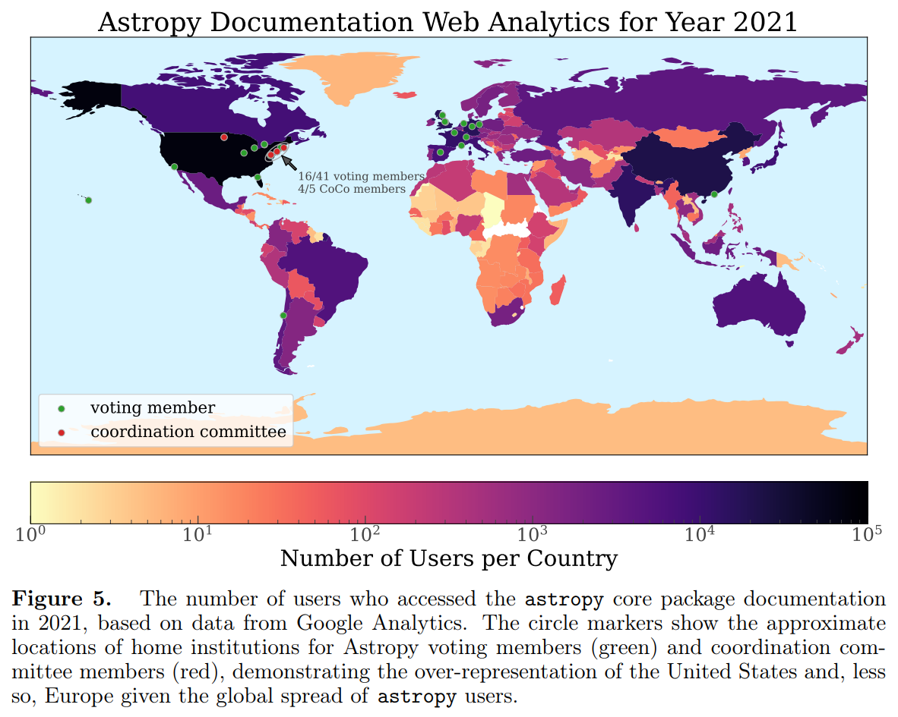

## 2022-06-01

1. [Precession and Jitter in FRB 180916B](https://arxiv.org/abs/2205.15385)

   > Fast Radio Burst, Theory

   如果FRB20180916B的周期是由吸积盘进动造成的，那么目前观测到的相位窗口宽度表明，吸积盘抖动约为倾角的0.14倍，与`jet source - SS 433`类似。

## 2022-06-02

1. [The nuclear transient AT 2017gge: a tidal disruption event in a dusty and gas-rich environment and the awakening of a dormant SMBH](https://arxiv.org/abs/2206.00049)

   > Stellar, Transient, TDE, SMBH

   对`AT 2017gge`长时间（1698d）多波段（X射线、紫外、光学、红外）的观测，其光变曲线、黑体温度、半径以及宽$\rm H/He\ I\ \lambda5876$的发射线，都与潮汐瓦解性质一致。 软X射线耀斑较光学峰值延迟了200天，之后观测到了由尘埃对光学TDE光的在辐射产生的红外回波。说明TDE发生在富含气体和尘埃的环境中，不同波段的辐射有不同的来源和位置。

   

## 2022-06-03

1. [Molecular precursors of the RNA-world in space: new nitriles in the G+0.693-0.027 molecular cloud](https://arxiv.org/abs/2206.01053)

   > Astrochemistry, ISM, RNA, Prebiotic Chemistry

   RNA的分子前体是氮化物，可能是来自地球外部，这就强调了在星际介质中建立氮化物库的重要性。对`G+0.693-0.027`的`腈类化合物`探测发现了`氰酸`$40-160\,\rm GHz$、`氰甲醛`、`乙腈`等，说明在太空中可能可以合成RNA前体分子。

## 2022-06-06

1. [MAXI : Monitor of All-sky X-ray Image](https://arxiv.org/abs/2206.01505)

   > High Energy, X-Ray, Supernovae, Instrument

   `Monitor of All-sky X-ray Image (MAXI)`是日本在ISS上的一个X射线全天监视器，探测到很多在$X/\gamma-Ray$有辐射的新星。

   

2. [SN 2020wnt: a slow-evolving carbon-rich superluminous supernova with no O II lines and a bumpy light curve](https://arxiv.org/abs/2206.01662)

   > Supernovae, Light Curve, Spectrum

   `SN 2020wnt`是一颗贫氢超量超新星`SLSN-I`，红移是0.032，光变曲线在爆炸后77.5天到达亮度峰值$M_{r}^{max}=-20.52\pm0.03\,\rm mag$，同时爆发早期有一个持续5天的`bump`。尽管亮度只是SLSN中等水平，但上升时间是目前观测到最长的。其光谱与别的`SLSN-I`不同，没有`O II`，有`C II`和`Si II`。

   光变曲线与流体力学模型比较，其光度或许可以用`radioactive powering`来揭示，其前身可能是一个大质量延展恒星，质量$80M_\odot$，半径$15R_\odot$，爆发能量$45\times10^{51}\,\rm erg$，产生了$4M_\odot$的$^{56}Ni$。在这种情况下，第一个峰值来自爆炸后冷却阶段，主峰来自大量产生的镍。

   

## 2022-06-07

1. [Primordial black hole constraints with Hawking radiation -- a review](https://arxiv.org/abs/2206.02672)

   > Black Hole, Review

   最近的数值模拟和观测数据表明`小质量黑洞`$M\sim10^{17-23}\,\rm g$可能组成了100%的暗物质，而霍金辐射似乎是唯一的探测手段。

   早期宇宙蒸发的黑洞可能造成重子不对称，改变大爆炸的核合成，扭曲了宇宙微波背景，或者产生了稳定粒子的宇宙学背景，如光子和中微子。

   这篇综述中描述了霍金辐射的原理，介绍了约束原始黑洞的最新情况，给出了未来工作的前景，包括非标准黑洞和超出标准模型自由度的发射。

## 2022-06-08

1. [Orbital characterization of superbolides observed from space: Dynamical association with near-Earth objects, meteoroid streams and identification of hyperbolic projectiles](https://arxiv.org/abs/2206.03115)

   > Meteor, NEO

   分析`NASA-JPL Center for NEOs Studies, CNEOS, fireball`数据库，确认米级流星体的来源，发现16%与`meteoroid streams`有关，4%与小行星有关，还有4%与彗星有关。

## 2022-06-09

1. [A burst storm from the repeating FRB 20200120E in an M81 globular cluster](https://arxiv.org/abs/2206.03759)

   > Fast Radio Burst

   用`Effelsberg`探测到`FRB 20200120E`的60次爆发，其中一次的40分钟观测中探测到53次爆发。累积能量比FRB 20121102A和FRB 20201124A低一个量级，DM基本不变，等待时间双峰分布。

## 2022-06-10

1. [Constraints on the Helium Abundance from Fast Radio Bursts](https://arxiv.org/abs/2206.04553)

   > Fast Radio Burst, Cosmology, Helium

   用FRB限制He的丰度。
   $$
   DM_{\rm IGM}(z)=\frac{3cH_0\Omega_bf_{\rm IGM}}{8\pi Gm_p}\left(1-\frac12\gamma_{\rm He}\right)\int_0^z\frac{1+z'}{E(z')}dz'
   $$
   其中$E(z)=H(z)/H_0$，$\chi_e(z)=\gamma_{\rm H}+\frac12\gamma_{\rm He}\approx1-\frac12\gamma_{rm He}$。

2. [Uniform Modelling of the Stellar Density of Thirteen Tidal Streams within the Galactic Halo](https://arxiv.org/abs/2206.04241)

   > Stellar, Milky Way, Tidal Steam

   根据`DES`、`DECaLS`和`Pan-STARRS`的测光数据，对银河系的13个星流进行了恒星密度模型的拟合，描述它们在天空中的轨迹、宽度等属性。发现有球状星团的星流通常比有矮星系的星流更窄，有球状星团的星流的平均亮度明显低于球状星团的典型亮度。

## 2022-06-13

1. [Quasi--Periodic Eruptions from Galaxy Nuclei](https://arxiv.org/abs/2206.04698)

   > Galaxy Nuclei, Quasi Period, Eruption

   目前已知的`星系核准周期喷发`，都可以用白矮星绕黑洞高度偏心轨道上的吸积来解释。这里表明，QPE系统中的质量转移始终是高度稳定的，但这种说法与最近文章中相反。这种稳定性可以解释在一些QPE系统中看到的长-短交替爆发的现象。随着引力波发射，白矮星轨道衰减，爆发占据轨道中更大的部分，并且变得更加明亮。

## 2022-06-14

1. [Meta-analysis of photometric and asteroseismic measurements of stellar rotation periods: the Lomb-Scargle periodogram, autocorrelation function, wavelet and rotational splitting analysis for 92 Kepler asteroseismic targets](https://arxiv.org/abs/2206.05411)

   > Asteroseismology, Stellar, Period

   对比`星震`测量和`光度`测量的恒星自转周期，样本包括70颗没有伴星的开普勒类太阳主序星。其中大多数恒星光度测量的周期表现出明显的季节差异，这表明光度测量周期是真正旋转周期的简化特征，尤其是存在较差自转的情况下。有一部分恒星光度测量周期季节变化小，跟星震测量结果一致。

2. [Gaia Data Release 3: Astrophysical parameters inference system (Apsis) I -- methods and content overview](https://arxiv.org/abs/2206.05864)

   > Gaia, Astrophysical Parameter

   Gaia DR3天体物理参数目录介绍。`Apsis`包括16亿天体的分类和概率，4.7亿天体的星际介质特征和距离，包括2D银河系消光地图，600万个类星体红移和140万个星系红移。4.7亿天体的参数，包括等效温度、金属丰度、半径、质量、年龄、DIB、活动指数、$H_\alpha$等效宽度、光谱型和发射线星的进一步分类。

   

   

3. [Gaia Data Release 3: Analysis of the Gaia BP/RP spectra using the General Stellar Parameterizer from Photometry](https://arxiv.org/abs/2206.06138)

   > Gaia, Astrophysical Parameter

    Gaia DR3恒星测光参数介绍。目录包括恒星参数、距离和消光。

   

4. [Gaia DR3 astrometric orbit determination with Markov Chain Monte Carlo and Genetic Algorithms. Systems with stellar, substellar, and planetary mass companions](https://arxiv.org/abs/2206.05439)

   > Gaia, Binary, Planet, Satellite

   Gaia DR3系外行星解决方案。天体测量发现围绕恒星运动的亚恒星质量的天体需要亚毫角秒的精度。这里用MCMC和遗传算法，用开普勒天体轨道模型拟合Gaia DR3在34个 月的天体测量时间序列，确定了1162个天体的轨道。文章里提供了Gaia Archive的检索方法，以及这些系统的轨道周期和偏心率等。

   <video src="Figures/Gaia-TwoBody-Orbit.mp4"></video>

5. [Gaia Data Release 3: Stellar multiplicity, a teaser for the hidden treasure](https://arxiv.org/abs/2206.05595)

   > Gaia, Binary, Planet

   Gaia DR3双星系统目录的说明。

6. [Gaia Data Release 3: Analysis of RVS spectra using the General Stellar Parametriser from spectroscopy](https://arxiv.org/abs/2206.05541)

   > Gaia, Spectroscopic

   Gaia DR3光谱学模块介绍。Gaia上的径向速度光谱学模块`RVS`的`GSP-Spec`测量了大约560万颗恒星包括N、Mg、Si、S、Ca、Ti、Cr、FeI、FeII、Ni、Zr、Ce、Nd的大气化学丰度，`cyanogen`线的等效宽度、DIB特征等化学物理参数。

7. [Gaia Data Release 3 Properties and validation of the radial velocities](https://arxiv.org/abs/2206.05902)

   > Gaia, Radial Velocity

   Gaia DR3径向速度的测量。与APOGEE、GALAH、GES和RAVE都有比较好的一致性。

   

8. [Gaia Data Release 3: G_RVS photometry from the RVS spectra](https://arxiv.org/abs/2206.05725)

   > Gaia, Spectroscopic, Magnitude

   Gaia DR3光谱估算星等的方法介绍。

9. [Gaia Data Release 3. Stellar chromospheric activity and mass accretion from Ca II IRT observed by the Radial Velocity Spectrometer](https://arxiv.org/abs/2206.05766)

   > Gaia, Spectroscopic, Chromosphere

   Gaia DR3光谱观测的恒星色球层活动。`RVS`波长范围内的`Ca infrared triplet`是晚型恒星色球层中磁场活动的良好诊断方法。这里介绍推断恒星活动指数设计的方法。

10. [Gaia Data Release 3: Chemical cartography of the Milky Way](https://arxiv.org/abs/2206.05534)

    > Gaia, Stellar, Metallicity

    Gaia DR3提供的完整银河系金属丰度的分布。这里用`RVS`测量的560万颗恒星的化学丰度，分析化学与银河结构、恒星运动学和轨道参数之间的关系。

    

11. [Gaia Data Release 3: Exploring and mapping the diffuse interstellar band at 862 nm](https://arxiv.org/abs/2206.05536)

    > Gaia, ISM, Dust, Extinction

    Gaia DR3中漫射星际带的分布。`Diffuse interstellar bands, DIBs`是光谱观测中常见的星际吸收特征，但来源仍不清楚。`DIBs`使用`RVS`测量，探索了距离太阳几千pc内银河系的ISM。将DIB与星际红化进行比较，发现DIB载体存在于太阳周期几乎不含尘埃的`local bubble`中。DIB的速度于CO气体速度之间显著的对应关系，表明$862nm$的DIB载体与大分子有关。

    

12. [Gaia Data Release 3: Hot-star radial velocities](https://arxiv.org/abs/2206.05486)

    > Gaia, Stellar, Radial Velocity, Spectroscopic

    Gaia DR3中热恒星的径向速度。DR3中最高的恒星有效温度到了$\rm T_{eff}=14500K$，在DR2中只有$6900K$。这里用RVS获得了热恒星$6900-14500K$的径向速度。

    径向速度是通过比对测光光谱与光谱模板的多普勒频移确定的，在热恒星中，`Ca infrared triplet`和`H Paschen lines`的混淆和系统蓝移会导致RV的系统偏差。这里开发了一个特定的代码来改进光谱模板的选择，避免这种系统偏移。

13. [Gaia Data Release 3: The second Gaia catalogue of Long-Period Variable candidates](https://arxiv.org/abs/2206.05745)

    > Gaia, Variable, Long Period

    Gaia DR3长周期变星目录。这里介绍了`LPVs`目录制作和内容，所有LPV测光深度低至20等，光变幅度大于0.1等。

14. [Gaia Data Release 3. Rotational modulation and patterns of color variations in solar-like variables](https://arxiv.org/abs/2206.05500)

    > Gaia, Stellar, Variable, Magnetic Field

    Gaia DR3中由磁活动导致光变的恒星。这里为这种恒星开发了特定的数据处理流程，以获得这种变星的周期、光度振幅等参数。`周期-振幅`图中证实了DR2中已经发现的`fast rotating stars`的双峰分布，并可以分析恒星`星等-颜色`的变化模式。

15. [Gaia Data Release 3: Pulsations in main sequence OBAF-type stars](https://arxiv.org/abs/2206.06075)

    > Gaia, Stellar, Variable, Pulsation

    Gaia DR3中光谱型为OBAF的中高质量$M\ge1.3M_\odot$的脉动变星目录。包括`beta Cep`、`slowly pulsating B, SPB`、`delta Sct`、 `gamma Dor`。

16. [Gaia Data Release 3 Validating the classification of variable Young Stellar Object candidates](https://arxiv.org/abs/2206.05796)

    > Gaia, Stellar, Variable, YSO

    Gaia DR3年轻变星的目录。

17. [Gaia Data Release 3: Ellipsoidal Variables with Possible Black-Hole or Neutron Star secondaries](https://arxiv.org/abs/2206.06032)

    >  Gaia, Stellar, Binary, Variable

    Gaia DR3中`Ellipsoidal`变星目录。这里给出了6306个短周期的椭圆变星的候选体，其相对较大的光度变化表明可能有一个大质量的伴星，如黑洞或者中子星。

18. [Gaia DR3: Specific processing and validation of all-sky RR Lyrae and Cepheid stars -- The Cepheid sample](https://arxiv.org/abs/2206.06212)

    > Gaia, Stellar, Variable, Cepheid

    Gaia DR3中`Cepheid `变星目录。

19. [Gaia DR3: Specific processing and validation of all-sky RR Lyrae and Cepheid stars -- The RR Lyrae sample](https://arxiv.org/abs/2206.06278)

    > Gaia, Stellar, Variable, RR Lyrae

    Gaia DR3中`RR Lyrae`变星目录。

20. [Data Release 3: the Solar System survey](https://arxiv.org/abs/2206.05561)

    > Gaia, Solar System, Asteroid

    Gaia DR3太阳系天体调查。发布了超过15万个太阳系天体的天体测量参数和光度测量，以及60518个小行星的平均反射光谱。

    <video src="https://dlmultimedia.esa.int/download/public/videos/2022/06/012/orig-2206_012_AR_EN.m4v"></video>

21. [Gaia Data Release 3: The Gaia Andromeda Photometric Survey](https://arxiv.org/abs/2206.05591)

    > Gaia, Galaxy, Andromeda

    Gaia DR3对仙女座星系的光度测量。发布了以M31为中心的120万个天体的光变曲线，最终结果将随DR4一起发布。测量光度时发现，使用三个测光通带之间的相关性可以更清楚地识别变星。

    

22. [Gaia Data Release 3: The extragalactic content](https://arxiv.org/abs/2206.05681)

    > Gaia, Extragalactic Object, Galaxy

    Gaia DR3河外天体测量。使用监督机器学习识别了660万个类星体和480万个星系，使用低分辨率`BP/RP`光谱估计红移，最高红移超过了4。这里概述了和外天体的数据处理和数据产品。

    

23. [Gaia Data Release 3: Microlensing Events from All Over the Sky](https://arxiv.org/abs/2206.06121)

    > Gaia, Microlensing

    Gaia DR3微引力透镜目录。介绍了目录内容，数据覆盖2014年倒2017年的34个月，共363个透镜事件，其中90个是新的。数据也可以在[这里](https://www.astrouw.edu.pl/~wyrzykow/GaiaDR3/GaiaDR3_microlensing.html)获得。

## 2022-06-15

1. [Relic jet activity in "Hanny's Voorwerp" revealed by the LOFAR Two metre Sky Survey](https://arxiv.org/abs/2206.06378)

   > Radio, LOFAR, Galaxy

   LOFAR对`IC2497`星系周围的一个高电离区`Hanny's Voorwerp`在150MHz的观测。与eVLA在1.64GHz的观测表明扩展结构发射有陡峭的频率，意味着年龄大于$10^8\rm yr$。

   

2. [Gaia Data Release 3. Summary of the variability processing and analysis](https://arxiv.org/abs/2206.06416)

   > Gaia, Stellar, Variable

   Gaia DR3的变星目录。使用已发表的变星目录作为监督学习的训练集，从Gaia DR3的18亿天体中，分类出1050万个变星。这些变星都有相应的G/GBP/GRP时间序列，进一步可以区分为950万变星和100万个活动星系核或者类星体。最终细分为35种变星，并公布了额外的物理参数。

3. [qrpca: A Package for Fast Principal Component Analysis with GPU Acceleration](https://arxiv.org/abs/2206.06797)

   > Machine Learning, PCA, Software

   `qrpca`可以使用GPU加速的PCA工具。

## 2022-06-16

1. [Hubble Space Telescope Observations of Active Asteroid P/2020 O1 (Lemmon-PANSTARRS)](https://arxiv.org/abs/2206.07703)

   > Solar System, Asteroid, Comet, Hubble

   Hubble对`P/2020 O1`的观测。质量损失在2020年8月达到峰值$<1\,\rm kg/s$，随后四个月下降到0。长时间的质量损失与升华起源一致，表明可能是含冰的主带彗星。光度测量显示了小核（半径420m）和高速旋转（周期小于2hr）。0.1mm颗粒弹射速度与核逃逸速度$0.3m/s$相当，大颗粒弹射速度低于逃逸速度，可能是冰的升华导致。如果确认是水冰升华，`P/2020 O1`将是半主轴最小的冰质小行星。

2. [Mitigating radio frequency interference in CHIME/FRB real-time intensity data](https://arxiv.org/abs/2206.07292)

   > Radio, CHIME, RFI

   CHIME处理RFI的流程。

   

   

## 2022-06-17

1. [Gravitationally lensed quasars in Gaia -- IV. 150 new lenses, quasar pairs, and projected quasars](https://arxiv.org/abs/2206.07714)

   > Gaia, Quasar, Lensing

   Gaia DR2种筛选出来的175个透镜类星体候选的光谱跟踪观测，确认了86个透镜类星体，同时还发现4个新的透镜星系，红移范围$0.62-2.79$。

   

2. [Stellar ages, masses, extinctions and orbital parameters based on spectroscopic parameters of Gaia DR3](https://arxiv.org/abs/2206.07937)

   > Gaia, Stellar, Parameter, Age

   Gaia DR3恒星年龄、质量、消光和轨道参数，数据在[这里](https://ftp.oca.eu/pub/gkordo/GDR3/)。使用校准的大气参数、2MASS和Gaia DR3的测光以及基于视差的距离，用等龄线拟合出恒星的年龄、初始质量和红化值。对有径向速度和天体测量值的恒星推导轨道参数，包括偏心率、远心点、近心点和Zmax。小于9-10Gyr的恒星的年龄估算较为可靠，较老的恒星，估计年龄会更小。消光$A_V<2.5mag$的巨星和主序星年龄的不确定性约为2Gyr。

   

## 2022-06-20

1. [Could the "Wow" signal have originated from a stochastic repeating beacon?](https://arxiv.org/abs/2206.08374)

   > Extraterrestrial Intelligence, SETI

   1977年探测到的`Wow`信号仍然是至今发现的最引人注目的SETI信号。以前的工作很大程度上排除了周期（小于40小时）重复的假设。这里假设`Wow`信号是一个二项分布，推断信号的持续时间和事件率，以及信号是一个二项分布（随机过程）的可能性。

2. [The Longest Delay](https://arxiv.org/abs/2206.08597)

   > Gravitational Lensing, SDSS, Galaxy, Quasar, Light Curve

   推断`SDSS J1004+4112`的时间延迟，是$\Delta t_{DC}=2458.47\pm1.02\,\rm day$，是迄今为止最长的引力透镜。

## 2022-06-21

黑奴解放日停更。

## 2022-06-22

1. [Differential Astrometry with Gaia: Investigating relativistic light deflection close to Jupiter](https://arxiv.org/abs/2206.09886)

   > Astrometry, Gaia, Jupiter

   背景星光经过木星周围会发生偏转。在Gaia视场中，木星是一个明亮的展源，因此测量微弱的光线偏转是极为困难的。这里使用Gaia多次观测到最接近木星的明亮目标星的数据，检测到光线的相对论偏转，证明了Gaia在极端观测条件下的科学性能。

2. [BURSTT: Bustling Universe Radio Survey Telescope for Taiwan](https://arxiv.org/abs/2206.08983)

   > Fast Radio Burst, Telescope

   湾湾提出的探测和定位FRB的望远镜阵`Bustling Universe Radio Survey Telescope for Taiwan, BURSTT`，视场$104\,\rm deg^2$，工作在$300-800\,\rm MHz$。起初由256个天线组成，之后逐渐扩展，预计每年探测到100个明亮的$>100\,\rm Jy\cdot ms$的FRB，并定位到亚角秒。

   

## 2022-06-23

1. [Gaia Data Release 3: Properties of the line broadening parameter derived with the Radial Velocity Spectrometer (RVS)](https://arxiv.org/abs/2206.10986)

   > Gaia, Radial Velocity, Line Broadening

   Gaia DR3的RVS光谱的径向速度和线宽。DR3包括了33,812,183颗有效温度在3100K到14,500K之间的恒星的径向速度。尽管线宽与其它项目，如GALAH、APOGEE和LAMOST的一致性比较好，但是在使用这个测量值仍需谨慎。在$V\sin i$较小时，线宽被高估，$T_{\rm eff}>7500K,\ GRVS>10$时，线宽的质量和意义迅速降低。

   

## 2022-06-24

1. [On the relation between duration and energy of non-repeating fast radio bursts: census with the CHIME data](https://arxiv.org/abs/2206.11330)

   > Fast Radio Burst, Population

   结合无监督机器学习对CHIME的目录中非重复FRB的分类，发现$z<0.3$的非重复FRB的能量和持续时间之间有微弱的相关性，这意味着或许可以从持续时间估计能量，从而提供一个新的宇宙学距离的测量方法。

   

## 2022-06-27

1. [Gaia Data Release 3: Reflectance spectra of Solar System small bodies](https://arxiv.org/abs/2206.12174)

   > Gaia, Solar System, SSO, Astroid

   Gaia DR3中60,518个太阳系天体的平均反射光谱。反射光谱来自于BP/RP光度计的测量结果，其中明亮的SSO的反射率光谱和文献中的结果一致性比较好。

2. [A Flat-Spectrum Radio Transient at 122 Mpc consistent with an Emerging Pulsar Wind Nebula](https://arxiv.org/abs/2206.11911)

   > Radio, Transient, Pulsar, Magnetar, Fast Radio Burst

   `VT 1137-0337`是VLA巡天观测中发现的一个不寻常的射电暂现源，位于一个矮星爆星系中（质量$10^{8.3}M_\odot$，恒星形成率$0.5M_\odot/yr$，光度距离$121.6\,\rm Mpc$，3GHz光度$2.5\times10^{28}\,\rm erg/s/Hz$），射电光谱$\propto\nu^{-0.35\pm0.02}$并且在4年内以每年5%的速度衰减，不能直接用恒星爆炸的冲击来解释，可能是一个有几十年历史的脉冲星风星云，最近才从超新星喷射物中透射出来。

   
   
   FRB的PRS的射电光谱、光谱指数和宿主星系的特性与`VT 1137-0337`有惊人的相似之处。

## 2022-06-28

1. [Random Processes With Power Law Spectral Density](https://arxiv.org/abs/2206.12722)

   > Random Process, Spectrum

   提出一个有幂律频谱密度的离散随机过程的统计模型。

## 2022-06-29

1. [Quasars as high-redshift standard candles](https://arxiv.org/abs/2206.13528)

   > Quasar, Cosmology, Redshift, Standard Candle

   类星体的X射线和UV光度之间的非线性关系可以用来推导类星体的距离，并建立红移$z\sim7$的哈勃图，这样的应用是基于红移和光度相互独立的假设。

   这里对130个$z>2.5$的类星体进行逐一分析，并进行了高质量的X射线和紫外光谱观测，发现二者之间的相关性依然存在，并且弥散非常小。因此可以安全地用于推导类星体的距离。

   

2. [An Injection System for the CHIME/FRB Experiment](https://arxiv.org/abs/2206.14079)

   > Fast Radio Burst, CHIME, Simulation

   FRB搜索的选择效应会使观察到的事件出现偏差。这里介绍了CHIME的模拟FRB注入系统，模拟了85,000个FRB并进行搜索，发现注入的FRB的`Fluence`和`SNR`之间的相关性与之前公布的第一个目录相同。但是望远镜的灵敏度随爆发宽度的变化而强烈变化，但是不随色散变化。一个模拟脉冲的代码在[这里](https://github.com/kmsmith137/simpulse)。

3. [Detecting Cosmic Strings with Lensed Fast Radio Bursts](https://arxiv.org/abs/2206.13534)

   > Fast Radio Burst, Cosmology, String

   脉冲星计时观测中的红噪声可能是`Cosmic String`发出的随机引力波，这些`宇宙弦`在大统一能量尺度附近的原始相变中形成。一致的宇宙弦探测器，即`CMB各向异性`和`河外星系透镜`对$G_\mu=10^{-10}-10^{-7}$的`low string tensions`不够敏感。这里表明FRB的强引力透镜是探测这一范围的弦张力的潜在手段。

4. [Audible universe](https://arxiv.org/abs/2206.13542)

   > Fast Radio Burst, Audio, Sonify

   Casey搞的FRB频谱声化，视频[在这](https://www.youtube.com/watch?v=i3x0sBCQ_c8)。

## 2022-06-30

1. [Stellar prospects for FRB gravitational lensing](https://arxiv.org/abs/2206.14310)

   > Fast Radio Burst, Cosmology, Gravitational Lensing

   FRB的引力透镜在宇宙学中的应用。FRB的引力透镜延迟时间尺度从微秒到年，对应的透镜质量横跨15个数量级，前景星系中的恒星透镜将在微秒时间尺度上占主导。

   未来的巡天中，如DSA-2000，将约束致密天体中暗物质的比例，并可能探测到来自中等质量黑洞的`millilensing`事件。另外，FRB的引力透镜还可以直接测量`circumgalactic medium `。

2. [The Astropy Project: Sustaining and Growing a Community-oriented Open-source Project and the Latest Major Release (v5.0) of the Core Package](https://arxiv.org/abs/2206.14220)

   > Astropy, Software

   `Astropy`5.0版本的主要功能。

   

3. [A baseline correction algorithm for FAST](https://arxiv.org/abs/2206.14544)

   > Radio, Spectrum

   紫台的人搞的FAST基线校正，用FFT和包络线校正基线去驻波。
   
   

