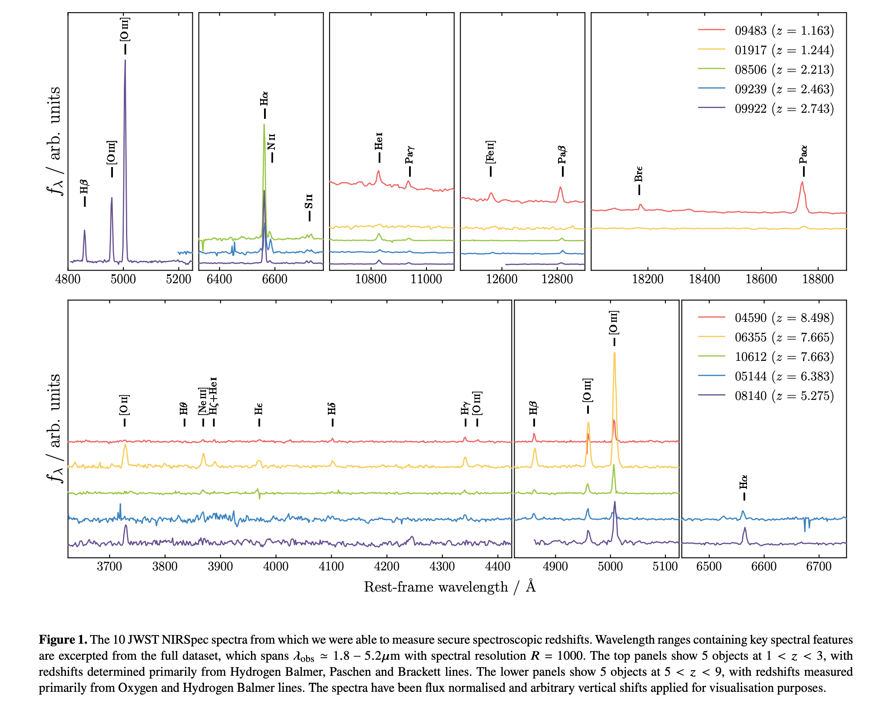

## 2022-07-01

1. [How to use GP: Effects of the mean function and hyperparameter selection on Gaussian Process regression](https://arxiv.org/abs/2206.15081)

   > Gaussian Process, Cosmology

   高斯过程已经被广泛应用于宇宙学中，以独立于模型的方式重建宇宙学常数。一个高斯过程可以被`mean`和`covariance`函数唯一决定，在宇宙学分析中，对两个函数选择的依赖性还没有得到很好的探讨。

   这里研究了函数选择对重建`Ia型超新星`的距离`moduli`的影响，结果表明，0均值函数会导致不切实际的距离推断，能最好拟合LCDM的又会导致有偏差的重建。这里建议对均值函数和超参数进行边缘化处理，以消除对重建的影响。

2. [Radio Pulsars as a Laboratory for Strong-field Gravity Tests](https://arxiv.org/abs/2206.15187)

   > Pulsar, Gravity

   是《Modified and Quantum Gravity - From theory to experimental searches on all scales》这本书的一章，邵立晶写的。回顾了使用脉冲星进行强场引力测试的基本概念，并介绍一些例子，包括引力双击辐射、大质量引力理论和强等价原理的测试。

## 2022-07-04

1. [The Periodic Signals of Nova V1674 Herculis (2021)](https://arxiv.org/abs/2207.00181)

   > Periodicity, Nova, Light Curve

   在新星`V1674 Herculis`爆发期间的光变曲线中找到了0.15d和501s的周期性信号，分别解释为双星轨道周期和白矮星自转周期。另外，自转周期在爆发的前15天天里增加了0.014%，可能是由于新星爆发导致白矮星突然失去了高角动量的气体。

2. [Learning to detect RFI in radio astronomy without seeing it](https://arxiv.org/abs/2207.00351)

   > Radio, RFI, Machine Learning

   [Nearest-Latent-Neighbours](https://github.com/mesarcik/nln)是基于`Auto-Encoder`的无监督学习器。这里用`NLN`做RFI识别，数据用的是传统方法标记并排除过RFI的干净数据，代码在[这里](https://github.com/mesarcik/RFI-NLN)。

   

## 2022-07-05

1. [Identification of Binary Neutron Star Mergers in Gravitational-Wave Data Using YOLO One-Shot Object Detection](https://arxiv.org/abs/2207.00591)

   > Machine Learning, Gravitational Wave, YOLO

   用YOLOv5找LIGO中的双中子星并和事件。

   

## 2022-07-06

1. [A machine learning classifier for LOFAR radio galaxy cross-matching techniques](https://arxiv.org/abs/2207.01645)

   > LOFAR, Machine Learning, Classification, Radio, Galaxy

   基于`SOM`开发的LOFAR射电源的分类器，主要用来识别与光学/红外目录交叉匹配时不可靠的射电源。在训练时，除源本身的属性外，增加最近邻射电源的特性、可能的光学宿主星系都可以提高模型的性能。

2. [Gaia Data Release 3: Cross-match of Gaia sources with variable objects from the literature](https://arxiv.org/abs/2207.01946)

   > Gaia DR3, Variable

   Gaia DR3目录与已知变星目录的交叉匹配。基本上是根据天体测量和光度测量与文献目录比较，确定Gaia目标的正确对应天体。这个目录包含了7,841,723个源，其中有120万个非变源和170万个星系，以及490万个100多种变源。

3. [Finding the birthplace of HMXBs in the Galaxy using Gaia EDR3: kinematical age determination through orbit integration](https://arxiv.org/abs/2207.02114)

   > Gaia, HMXB, Binary, Stellar

   大质量X射线双星`HMXBs`是大质量双星系统的第一个超新星事件后产生的。这里是从Gaia数据中找可能的HMXBs，再根据运动学估计其诞生的位置，并以此判断是否与开放星团或者银河系螺旋结构有关。`寻找的方法需要再看文章`。最终他们找到26个样本，并根据Gaia的天体测量找到诞生地，发现HMXB的祖先可能优先在开放星团中与其它大质量恒星一起形成。

## 2022-07-07

1. [Don't Pay Attention to the Noise: Learning Self-supervised Representations of Light Curves with a Denoising Time Series Transformer](https://arxiv.org/abs/2207.02777)

   > Machine Learning, Transformer, Time Domain

   用`Transformer Encoder`去除光变曲线中的噪声，在`Transiting Exoplanet Space Satellite, TESS`数据上做测试。比如下图，黑点是输入，红线是输出，绿线是中值滤波。

   

## 2022-07-08

1. [Fermi-LAT Gamma-ray Detection of the Recurrent Nova RS Ophiuchi during its 2021 Outburst](https://arxiv.org/abs/2207.02921)

   > Recurrent Nova, Gamma Ray, Transient

   `Fermi-LAT`对复发新星`RS Ophiuchi`的$\gamma$射线观测。复发新星与典型新星不同，白矮星的喷射物与红巨星伴星的星风相互作用形成冲击，产生高能光子。`RS Ophiuchi`的光谱覆盖范围$50\rm MeV-23GeV$，与其在2006年的爆发一致。

   在2021年本次新星爆发中，LAT光变曲线快速上升到峰值$>0.1\rm GeV$，峰值持续1天，随后幂律下降，45天后消失。在爆发开始后2.2天，高能光子发射量翻了一倍，可能是一个局部的冲击加速事件。$\gamma$射线和光学光度之间的比率恒定为$2.8\times10^{-3}$，但在爆发第一天，比率小了5倍，可能是冲击发展的最初阶段，$\gamma$射线被喷射物吸收。

   

   `Swift-XRT`在$2-10\rm keV$的光变曲线可以追踪冲击加热气体的轫致辐射导致的硬X射线发射，在第6天达到峰值，比GeV和光学能量晚。

2. [An Exploration of How Training Set Composition Bias in Machine Learning Affects Identifying Rare Objects](https://arxiv.org/abs/2207.03207)

   > Machine Learning, Imbalanced Data

   蔡老师他们的文章。机器学习在非平衡数据集上训练会给量少的数据较低的权重，因而通常会提高稀有类别的权重。这里证明这样的作法会使模型给稀有类别带来偏差。

## 2022-07-11

1. [Mapping Milky Way disk perturbations in stellar number density and vertical velocity using Gaia DR3](https://arxiv.org/abs/2207.03492)

   > Gaia, Galaxy, Kinematics

   用`StarHorse`的照片测距信息补充`Gaia DR3`的数据，绘制银河系恒星盘的数量密度和垂直速度，距离太阳几kpc。

## 2022-07-12

1. [Classification of Fermi-LAT unidentified gamma-ray sources using CatBoost gradient boosting decision trees](https://arxiv.org/abs/2207.04725)

   > Machine Learning, Fermi, Classification

   用`CatBoost`对Fermi的$\gamma$射线目录进行分类。

## 2022-07-13

1. [pocoMC: A Python package for accelerated Bayesian inference in astronomy and cosmology](https://arxiv.org/abs/2207.05660)

   > Software, MCMC

   [pocoMC](https://github.com/minaskar/pocomc)用于加速贝叶斯推理的库，

## 2022-07-14

1. [Visualizing the pulsar population using graph theory](https://arxiv.org/abs/2207.06311)

   > Pulsar, Classification

   用PCA分析脉冲星参数，包括自转周期$P$，周期导数$\dot P$，表面磁通密度$B_s$，光柱处磁场$B_{lc}$，能量耗散率$\dot E_{sd}$，特征年龄$\tau_c$，表面电压$\Delta\Phi$，Goldreich-Julian电荷密度$\eta_{GJ}$，尽管其他参数都可以由周期以及周期导数近似表示， 但是在PCA中，周期和周期导数不是主成分，意味着至少有第三个量参与特征空间的构建。这用`Minimum Spanning Tree`来给脉冲星画树，类似基因图谱。

   

## 2022-07-15

1. [Gaia Data Release 3: The first Gaia catalogue of variable AGN](https://arxiv.org/abs/2207.06849)

   > Gaia, AGN

   Gaia DR3的AGN目录。

2. [Precision modeling of Webb's first cluster lens SMACSJ\,0723.3−7327](https://arxiv.org/abs/2207.07101)

   > JWST, Lensing

   `SMACS J0723.3-7323`是红移0.388的大质量星团，这里对JWST在这里观测的引力透镜做模型，如下图。

   

3. [Unscrambling the lensed galaxies in JWST images behind SMACS0723](https://arxiv.org/abs/2207.07102)

   > JWST, Lensing, Galaxy

   从`SMACS J0723.3-7323`的引力透镜中分辨了13个`multiply lensed`星系，并且还找到了一个``爱因斯坦十字``的候选体。

   

## 2022-07-18

1. [A Probabilistic Autoencoder for Type Ia Supernovae Spectral Time Series](https://arxiv.org/abs/2207.07645)

   > Machine Learning, Supernovae, Spectrum

   用概率自动编码器，从Ia型超新星的光谱时间序列中学习物理参数。

   

2. [Beyond UVJ: Color Selection of Galaxies in the JWST Era](https://arxiv.org/abs/2207.07170)

   > Galaxy, Color Color Selection

   使用$u_s-g_s$和$g_s-i_s$颜色来选择恒星形成星系和宁静星系。常用的方法是$U-V$和$V-J$颜色来选择，但是在$z\ge3$的位置，这种方法选择出来的样本包含大量的尘埃遮蔽星系和强发射线星系。新方法做了改进，并且可以应用于JWST的星系。

   在$0.5<z<6$的星系中做测试，完备性与`UVJ`方法差不多，但是污染少了两倍。

## 2022-07-19

1. [A first look at the SMACS0723 JWST ERO: spectroscopic redshifts, stellar masses and star-formation histories](https://arxiv.org/abs/2207.08778)

   > JWST, Lensing, Galaxy

   JWST观测的`SMACS J0723.3-7327`透镜中的10个NIRSpec（$\lambda_{obs}=1.8-5.2\mu m$，$R=\lambda/\Delta\lambda=1000$）新测量的星系光谱的分析。

   其中$1<z<3$的五个天体有多条红外帕申线（$n\ge4\rightarrow3$），$5<z<9$的五个天体有光学氧和氢巴尔默线（$n\ge3\rightarrow2$）。

   

   与HST的光度测量结合，分析SED，分析恒星质量、平均恒星年龄、以及恒星形成历史等。

2. [One-loop correction to the enhanced curvature perturbation with local-type non-Gaussianity for the formation of primordial black holes](https://arxiv.org/abs/2207.07668)

   > Cosmology, Dark Matter, PBH

   大学同学孟徳双的文章。原初黑洞`Primordial Black Holes, PBHs`可能是冷暗物质的候选，由曲率扰动的过密区域塌缩形成。在暴涨模型中，增强的曲率扰动是非高斯的，因此对曲率功率谱的高阶`loop`修正是不能忽略的，也会改变PBHs的丰度。这里计算的是曲率功率谱的`one-loop`修正。

3. [Radio detection of an elusive millisecond pulsar in the Globular Cluster NGC 6397](https://arxiv.org/abs/2207.07880)

   > Pulsar

   张蕾的文章，我有参与。讲的是用Parkes在球状星团`NGC 6397B`中探测到一个轨道周期为1.97天、自转周期为5.78ms的毫秒脉冲星双星系统。这个轨道周期是球状星团中双星系统最长的，并且与之前的X射线源的轨道周期一致。

4. [PARSEC V2.0: Stellar tracks and isochrones of low and intermediate mass stars with rotation](https://arxiv.org/abs/2207.08642)

   > Stellar, Age, Isochrone, Software

   [PARSEC](http://stev.oapd.inaf.it/PARSEC/index.html) [v2](http://stev.oapd.inaf.it/YBC/)是一个恒星演化轨迹和等龄线工具，覆盖了恒星质量$0.09-14M_\odot$和金属丰度$Z=0.004-0.017$。

5. [TESS light curves of cataclysmic variables I -- Unknown periods in long-known stars](https://arxiv.org/abs/2207.08203)

   > TESS, Variable

   `Transiting Exoplanet Survey Satellite, TESS`将监测超过200,000颗恒星是否因为凌日导致亮度变化，已于2018年发射。

   灾变变星`CVs`的大量光变细节需要长时且不间断的观测，TESS提供的长达一个月的数据很适合这一目标。这里介绍的是在新星中寻找周期性变化。

## 2022-07-20

1. [A Convolutional Neural Network Approach to Supernova Time-Series Classification](https://arxiv.org/abs/2207.09440)

   > Machine Learning, Supernovae, Classification

   普通卷积神经网络对超新星光变曲线做分类。

   

## 2022-07-21

1. [Linear change and minutes variability of solar wind velocity revealed by FAST](https://arxiv.org/abs/2207.09612)

   > Solar System, Solar Wind

   行星际闪烁`Interplanetary Scintillation, IPS`可以用于研究太阳风和空间天气。这里介绍FAST在2020年9月对IPS的观测，发现太阳风速度随频率线性下降，并且在3-5分钟的时间尺度上会发生变化，意味着背景太阳风缓慢变化。

2. [Do Pulsar and Fast Radio Burst dispersion measures obey Benford's law?](https://arxiv.org/abs/2207.09696)

   > Fast Radio Burst, Math

   `Benford's Law`描述的是实际生活中的数字首位的频率分布，1开头的数字大概占到30%
   $$
   P(n)=\log_b(n+1)-\log_b(n)=\log_b\left(\frac{n+1}{n}\right)
   $$
   这里做的是脉冲星和FRB的DM值的第一位数字的分布发现不服从`Benford's Law`。

## 2022-07-22

1. [Rest-frame near-infrared sizes of galaxies at cosmic noon: objects in JWST's mirror are smaller than they appeared](https://arxiv.org/abs/2207.10655)

   > JWST, Galaxy, Structure

   研究星系大小在宇宙时间中的演化以测试星系形成模型，但是缺乏深度红外成像限制了$z\ge1$的研究。 这里从JWST的EGS深场成像中测量出1000个$\log M_*/M_\odot\ge9,\ 1.0\le z\le2.5$的星系在$4.4\mu m$的大小，并与$1.5\mu m$下的大小进行对比。发现星系的半光度半径在$4.4\mu m$下比$1.5\mu m$下小8%，这一差异随恒星质量增大或者颜色变红而增加。

## 2022-07-25

1. [Globally optimal and scalable N-way matching of astronomy catalogs](https://arxiv.org/abs/2207.11125)

   > Stellar, Cross Match, Software

   新的概率方法做星表之间的交叉匹配，在处理多个目录时比列举所有可能的候选天体更有优势，代码在[这里](https://github.com/tunguyen52/Nway-matching)。

2. [Image Improvement and Restoration in Optical Time Series. I. The Method](https://arxiv.org/abs/2207.10973)

   > Planetary, Lensing, Image Restoration

   流浪行星由于没有束缚在恒星上，所以无法通过传统的系外行星探测方法，如凌日、径向速度、直接成像等方式来搜索。流浪行星经过背景恒星可以造成微引力透镜，或许可以做为在球状星团中搜寻流浪行星的探针。通常对球状星团图像的时间序列做微分，以提取光变事件，并判断其中是否存在微引力透镜。但是在长期观测中，仪器的异常、观测条件的变化会导致PSF失真，从而影响微分的质量。

   这里提出一种迭代图像重建（天文图像修复）方法，在`Scaled Gradient Projection`算法的基础上修改，以恢复恒星的形状，代码在[这里](https://github.com/Yash-10/fc_sgp-star-restoration)。

## 2022-07-26

1. [First Batch of Candidate Galaxies at Redshifts 11 to 20 Revealed by the James Webb Space Telescope Early Release Observations](https://arxiv.org/abs/2207.11558)

   > JWST, Galaxy, Redshift

   HST的红外截止波长是$1.6\mu m$，对应红移11，宇宙年龄4.2亿年，JWST的`NIRCam`延伸到$5\mu m$，对应宇宙年龄千万年，可以带来对第一批恒星和星系形成过程的认识。JWST观测的`SMACS 0723-73`透镜星系团处，使用SED拟合测光红移，找到88个红移大于11的星系，最高的可以到20。黄家生老师他们的文章。

2. [Four New Fast Radio Bursts Discovered in the Parkes 70-cm Pulsar Survey Archive](https://arxiv.org/abs/2207.12332)

   > Fast Radio Burst

   在Parkes历史数据里找到4个新的FRB，宽度$>50ms$普遍长于目前发现的FRB，其中一个FRB的DM是$3338\,\rm pc/cm^{3}$，是目前DM最大的FRB，并且在时间上也比Lorimer Burst早了10年。

## 2022-07-27

1. [Formation of Comets](https://arxiv.org/abs/2207.12731)

   > Planetary, Comet

   彗星形成综述，描述彗星从太阳星云中的尘埃和冰粒到外太阳系小天体的物理演变。

   

2. [How to plan your astronomy research paper in ten steps](https://arxiv.org/abs/2207.12959)

   > Astronomy, Methodology

   十步构建天文论文。

## 2022-07-28

1. [High frequency study of FRB 20180916B using the 100-m Effelsberg radio telescope](https://arxiv.org/abs/2207.13669)

   > Fast Radio Burst, Observation

   Effelsberg在$4-8GHz$对`FRB20180916B`的观测，在一个活动窗口找到了8个爆发，比CHIME的活动峰值早了3.6天，进一步证明随频率增加活动窗口提前。与低频比，爆发宽度更窄并且频谱更宽，偏振度高并且偏振角平坦。爆发表现出银河导致的衍射闪烁，并随时间推移而变化。

   

2. [The Sources of Fast Radio Bursts](https://arxiv.org/abs/2207.13241)

   > Fast Radio Burst, Theory

   `J. I. Katz`的文章，记录了重复FRB和非重复FRB的划分征集，并讨论了不同类别可能的模型，重复FRB可能是黑洞吸积盘，非重复FRB可能是SGR。

## 2022-07-29

1. [The Eclipse Megamovie Project (2017)](https://arxiv.org/abs/2207.13704)

   > Solar System, Eclipse

   北美天文爱好者在2017年8月21日拍摄的日全食的影像数据资料，在[这里](http://eclipsemegamovie.org/)。

2. [Turbulence in the outer heliosphere](https://arxiv.org/abs/2207.14115)

   > Solar System, Turbulence, Review

   关于太阳风（SW）和近地星际介质（LISM）中湍流观测证据、建模工作以及公开的挑战的总数。

