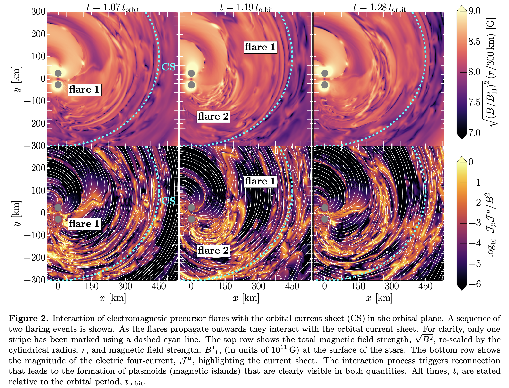
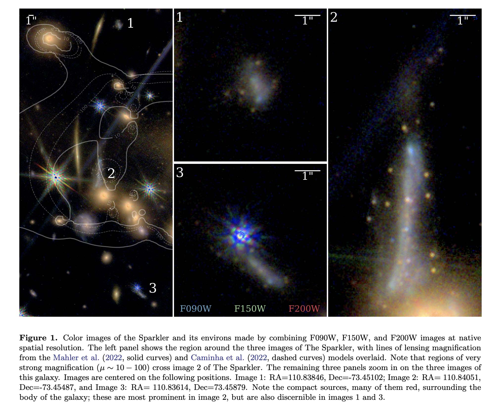
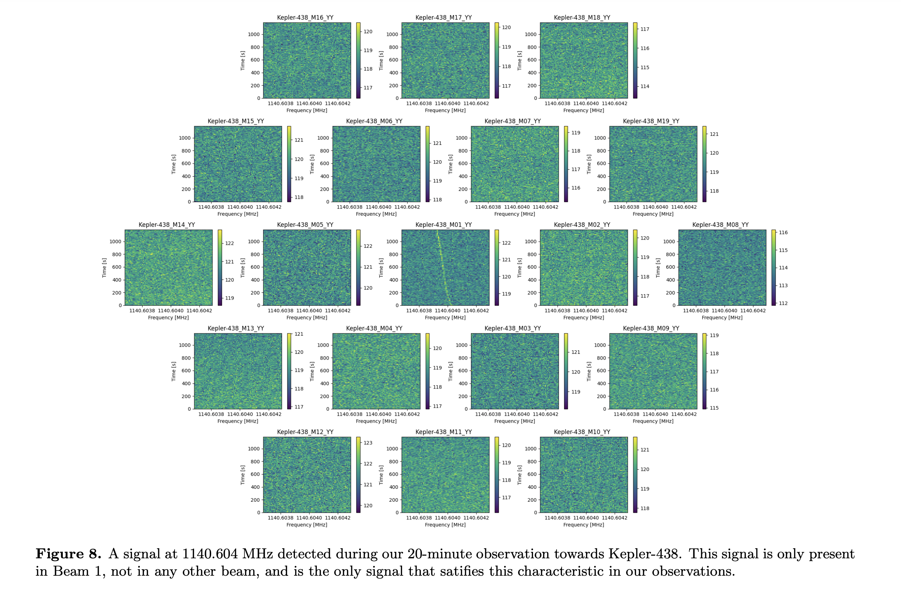
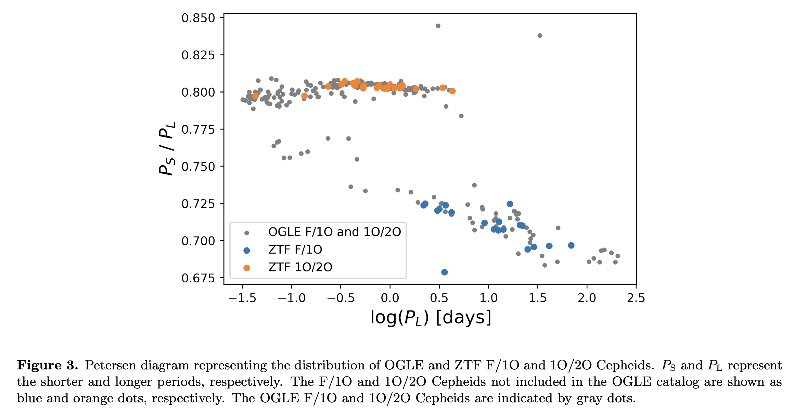
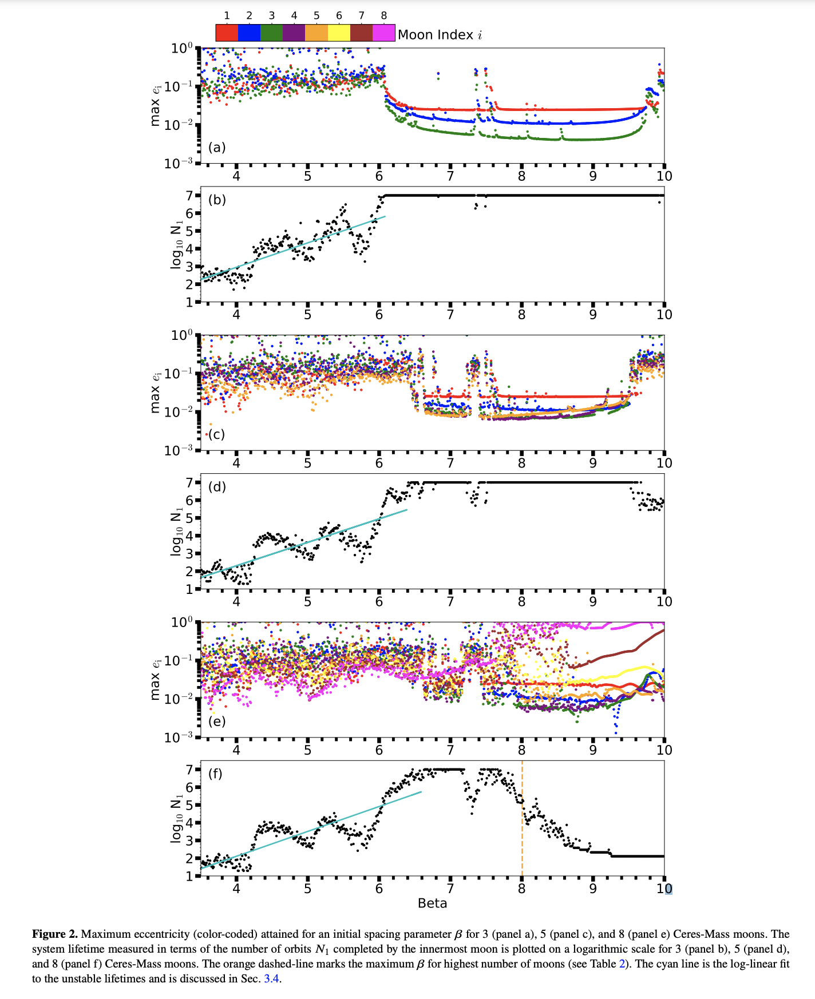
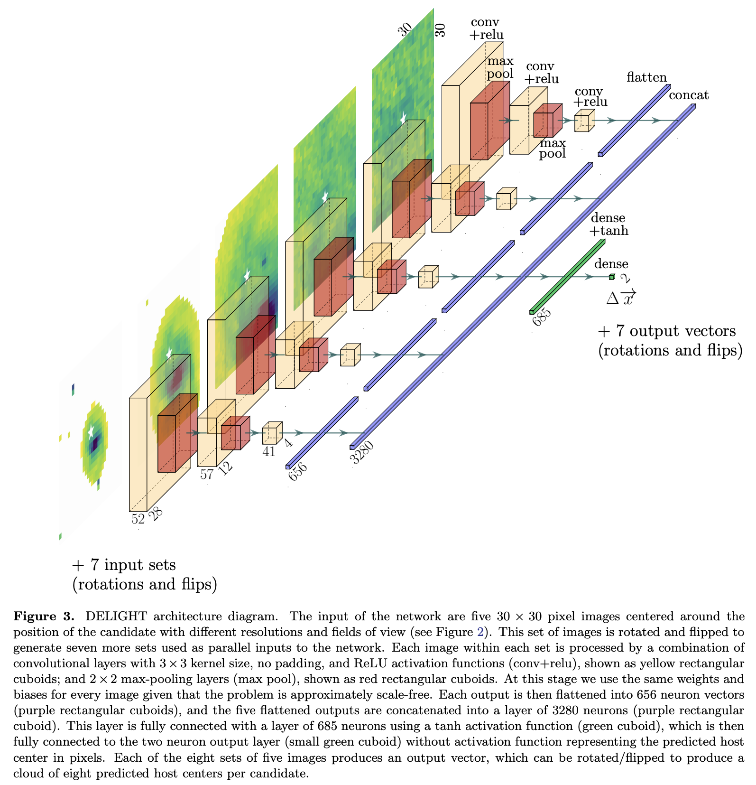
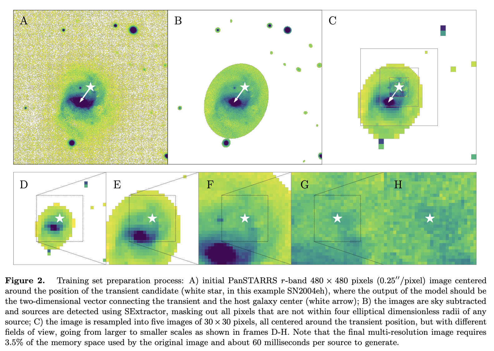
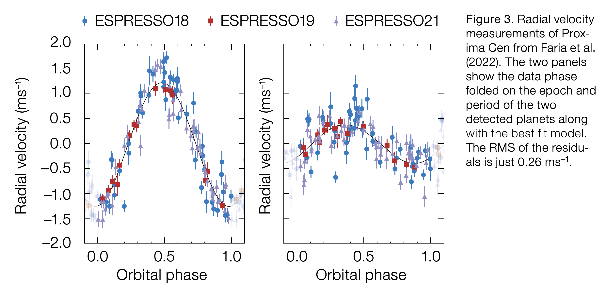
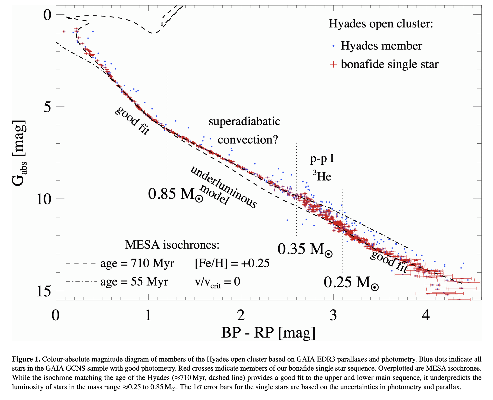

## 2022-08-01

1. [The sky at one terabit per second: Architecture and implementation of the Argus Array Hierarchical Data Processing System](https://arxiv.org/abs/2207.14304)

   > Optical, Telescope

   `Argus Optical Array`由900个20.3cm的望远镜组成，集光能力相当于全天视场的5m望远镜。高速运行时，极限星等16.1，每秒观测7916平方度，每晚产生4.3PB的数据；常速运行时，极限星等19.1，每30秒观测一次7916平方度，每晚产生145TB的数据。

   这里介绍的是数据处理系统`Argus-HDPS`，夜间产生暂现源警报以及15分钟的节奏产生整个视场全分辨率联合分析。长期光变曲线在日间进行。

2. [Inferring the Energy and Distance Distributions of Fast Radio Bursts using the First CHIME/FRB Catalog](https://arxiv.org/abs/2207.14316)

   > Fast Radio Burst

   假设$DM_{host}$是`LogNormal`，能量分布是Schechter函数，归一化系数假设与SFR有关，写了一个似然函数，从CHIME的Catlog里拟合这个函数。估计特征能量$2.38^{+5.35}_{-1.64}\times10^{41}\,\rm erg$，幂律指数$-1.3^{+0.7}_{-0.4}$。

3. [Reconnection-powered fast radio transients from coalescing neutron star binaries](https://arxiv.org/abs/2207.14435)

   > Fast Radio Burst, Theory

   这里使用`global force-free`电动力学模拟证明，两颗磁场强度远低于磁星的中子星的碰撞可以产生FRB。

   

## 2022-08-02

1. [Gaia Data Release 3: Summary of the content and survey properties](https://arxiv.org/abs/2208.00211)

   > Gaia, Survey

   Gaia数据集内容介绍。包含了与EDR3相同的源表、天体位置、自行、视差以及G/BP/RP测光。同时引入了大量新的数据产品，包括100万个天体的RVS光谱，2.2亿条BP/RP光谱，以及24种变星类型约1000万个天体的光变曲线分析结果。DR3包含4.7亿个天体的天体物理参数和1.5亿个天体的类别（恒星、星系和类型题）概率。超过15万个太阳系天体，从BP/RP光谱得到的6万个小行星。以及一个额外的数据集，M31的测光巡天。

2. [Limits on Fast Radio Burst-like Counterparts to Gamma-ray Bursts using CHIME/FRB](https://arxiv.org/abs/2208.00803)

   > Fast Radio Burst, GRB

   CHIME的FRB与`Swift/BAT`和`Fermi/GBM`在2018.7.17-2019.7.8之间探测到的81个GRB交叉匹配，没找到$3\sigma$以上置信度的，空间上重合、时间上相差一周内的对应体。

3. [A measurement of Hubble's Constant using Fast Radio Bursts](https://arxiv.org/abs/2208.00819)

   > Fast Radio Burst, Cosmology, Hubble Constant

   使用ASKAP定位的16个FRB和ASKAP+Parkes未定位的FRB，结合`红移-色散`关系、广度函数、气体分布、星系演化、$DM_{\rm host}$，估计哈勃常数为$73^{+12}_{-8}\,\rm km/s/Mpc$。这里估计的$DM_{\rm host}$中位数是$186^{+59}_{-48}\,\rm pc/cm^3$，比之前研究中估计的结果更大，表明FRB的宿主环境对DM的贡献比预期更大。并且此次测试证实了FRB群体演化与恒星形成率相似。

4. [J-comb: An image fusion algorithm to combine observations covering different spatial frequency ranges](https://arxiv.org/abs/2208.00588)

   > Radio, Software

   焦斯汗的文章。把地面低分辨率和空间高分辨率的射电图像组合起来。

## 2022-08-03

1. [Robust Clustering of the Local Milky Way Stellar Kinematic Substructures with Gaia eDR3](https://arxiv.org/abs/2208.01056)

   > Gaia, Clustering, Structure

   `HDBSCAN`用在Gaia EDR3找太阳系附近的运动亚结构，并提供一个稳定的聚类目录。

## 2022-08-04

1. [The Sparkler: Evolved High-Redshift Globular Clusters Captured by JWST](https://arxiv.org/abs/2208.02233)

   > JWST, Galaxy, Globular Cluster

   研究被`SMACS J0723.3-7327`星系团`lensing`的星系`Sparkler`，周围的致密源`sparkles`。在JWST/NIRCam中没有空间分辨，在JWST/NIRISS光谱中有`OIII`的发射，但是没有恒星形成的迹象，认为这些星团是在$z=1.378$的`evolved`球状星团，SED拟合年龄大约是$3.9-4.1Gyr$，在大爆炸后0.5Gyr形成。如果被证实，这些星团可能是宇宙中最早被观测到的停止恒星形成的天体之一。

   

## 2022-08-05

1. [Sensitive Multi-beam Targeted SETI Observations towards 33 Exoplanet Systems with FAST](https://arxiv.org/abs/2208.02421)

   > SETI, Exoplanet

   张同杰他们的文章。FAST的SETI终端看系外行星，找到1140MHz的频漂信号，特征与假定的ETI技术特征一致，但是偏振特征排除其是地外信号的可能性。

   

## 2022-08-08

1. [Double Mode Cepheids from the Zwicky Transient Facility Survey](https://arxiv.org/abs/2208.03080)

   > Variable, Light Curve

   `Multi-mode Cepheids`变星以一种以上的模式脉动，为测试恒星模型和脉动理论提供了一种独立的手段，并且还可以用来推导金属性。到目前为止，银河系中一行发现209个双模Cepheids，主要是`Optical Gravitational Lensing Experiment's (OGLE)`目录。这里从ZTF DR5中找到72个，包含OGLE中的30个。周期也很一致，如下“Petersen diagram”中显示。

   

## 2022-08-09

1. [Moon-packing around an Earth-mass Planet](https://arxiv.org/abs/2208.03604)

   > Planetary Science, Earth, Moon

   做了很细致的N体模拟地球周围最多可以有多少颗卫星稳定运行。计算表明，卫星的最大数量取决于卫星的质量，最多可以有$7\pm1$个`Ceres`谷神星、$4\pm1$个`Pluto`冥王星、$3\pm1$个`Luna`质量的卫星。下图分别是3/5/8个`Ceres`绕地球运动时的轨道稳定性。

   

2. [FRBSTATS: A web-based platform for visualization of fast radio burst properties](https://arxiv.org/abs/2208.03508)

   > Fast Radio Burst, Visualization, Software

   [FRBSTATS](https://www.herta-experiment.org/frbstats/)，是一个FRB可视化网站。

3. [Gravitational lensing in the presence of plasma scintillation with application to Fast Radio Bursts](https://arxiv.org/abs/2208.03332)

   > Fast Radio Burst, Gravitational Lensing

   描述FRB的引力透镜如何收到透镜到观测者之间的`等离子体屏`的影响。波穿过湍流介质会影响放大率（等离子体散射导致源角尺度变大，放大率被抑制）、透镜率、图像之间的时间延迟（因为不同的图像有不同的光子传播路径，不同路径DM不同）等。由于波的散射，每个图像的光变曲线会变化，这一影响对于距离源/观测者有宇宙学距离的透镜和等离子体屏是最严重的。沿着两个图像路径的不同RM可以将线偏振转圆偏振。

4. [Coherent Time-Domain Canceling of Interference for Radio Astronomy](https://arxiv.org/abs/2208.04256)

   > Radio, RFI

   `Coherent Time-domain Canceling, CTC`相干时域RFI消除，在理想情况下可以避免删除受干扰影响的数据。这里回顾CTC的能力和局限，包括消干扰的功率以及增加噪声。

5. [DELIGHT: Deep Learning Identification of Galaxy Hosts of Transients using Multi-resolution Images](https://arxiv.org/abs/2208.04310)

   > Machine Learning, Galaxy, Transient, Deep Learning

   [DELIGHT](https://github.com/fforster/delight)，用CNN来辨别`Transients`的宿主星系，想用在LSST实时光变警报流中。输入是暂现源位置为中心的多分辨率图像（是一组相同像素数的图像，像素大小随视场变大），输出暂现源和预测的宿主星系之间的二维矢量。训练数据是16791个星系以及距离星系中心1角分以内的暂现源坐标。

   

   

6. [Galaxy source counts at 7.7 μm, 10 μm and 15 μm with the James Webb Space Telescope](https://arxiv.org/abs/2208.03954)

   > JWST, Galaxy, Count

   介绍JWST中红外仪`MIRI`在$7.7/10/15\,\rm \mu m$波段获得的中红外星系数量统计结果，由于JWST超高的灵敏度，在`F770W`、`F1000W`、`F1500W`的滤光片中，80%的完备性的极限流量是$0.32/0.79/2.0\,\rm \mu Jy$，比`Spitzer`或者`AKARI`深100倍。

## 2022-08-10

1. [Keeping Exoplanet Science Caffeinated with ESPRESSO](https://arxiv.org/abs/2208.04323)

   > Exoplanet

   `ESPRESSO`是VLT上的光谱仪，从2018年开始运行，主要做系外行星科学，大口径与高分辨率光谱仪能够探测到小型、低质量的行星，并且研究行星大气。这里介绍了`ESPRESSO`的第一批结果。

   

## 2022-08-11

1. [Benchmarking MESA isochrones against the Hyades single star sequence](https://arxiv.org/abs/2208.04969)

   > Gaia, Isochrone, Stellar

   使用Gaia EDR3的测光数据，筛选`Hyades`疏散星团的恒星成员。将类太阳的MESA演化模型与单星序列进行比较，发现$[Fe/H]=+0.25$的非旋转MESA模型对质量高于0.85和低于0.25$M_\odot$的恒星拟合得很好，这质量区间内的，模型则低估了恒星的光度。
   
   

## 2022-08-12

1. [Magnetic braking saturates: evidence from the period distribution of low-mass eclipsing binaries from ZTF](https://arxiv.org/abs/2208.05488)

   > Stellar, Variable, ZTF

   脱离主序的，短轨道周期的，暗淡食变双星，它们的周期由于磁力制动会发生演变，导致轨道缩小并最终使双星接触。因此周期分布是对磁力制动（EB）的敏感探测。

   从ZTF的光变曲线中统计发现，低质量$0.1\le M_1/M_\odot\le0.9$的双星周期分布基本上是平的$dN/dP_{orb}\propto P_{orb}^0$，这与基于`Skumanich relation`的经典EB模型预测不一致$dN/dP_{orb}\propto P_{orb}^{7/3}$。这样的分布可以由`磁场饱和saturates`模型再现。另外还发现，完全对流和部分对流的双星周期分布没有明显区别。

2. [A 0.6 Mpc HI Structure Associated with Stephan's Quintet](https://arxiv.org/abs/2208.04870)

   > Galaxy, HI, FAST

   `Stephan's Quintet`，史蒂芬五重奏中多个成员相互作用，包括一个高速侵入的星系，可能产生多个气体和恒星组成的潮汐碎片，形成群内介质星爆以及星系间冲击气体。

   这里是FAST的HI观测，发表在Nature上。数据显示出一个大的HI结构（0.6Mpc），包括一个与碎片场相关的展源（0.4Mpc）和一个弯曲的弥散特征（0.5Mpc）。弥散特征可能是SQ早期阶段潮汐相互作用产生的。

   

3. [Evidencing the interaction between science fiction enthusiasm and career aspirations in the UK astronomy community](https://arxiv.org/abs/2208.05825)

   > Astronomy, Science Fiction

   对科幻小说的兴趣和天体物理学的职业抱负之间有联系，但没用做过定量统计。这里对`University of Warwick Astronomy and Astrophysics group`和`UK National Astronomy Meeting`进行案例研究，其中绝大多数受访者都表示对科幻小说感兴趣。后一个调查中，93%的英国天文学家表示对科幻小说感兴趣，69%表示科幻小说影响了他们的生活和职业选择。
   
   这项研究提供了「科幻小说影响选择天文学做职业」的统计证据。

## 2022-08-15

