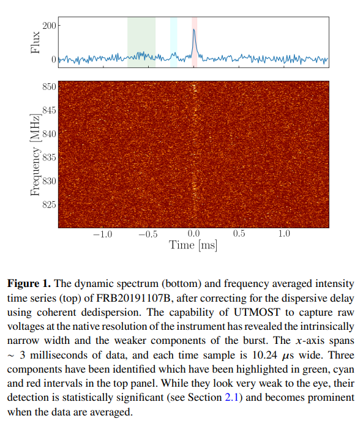
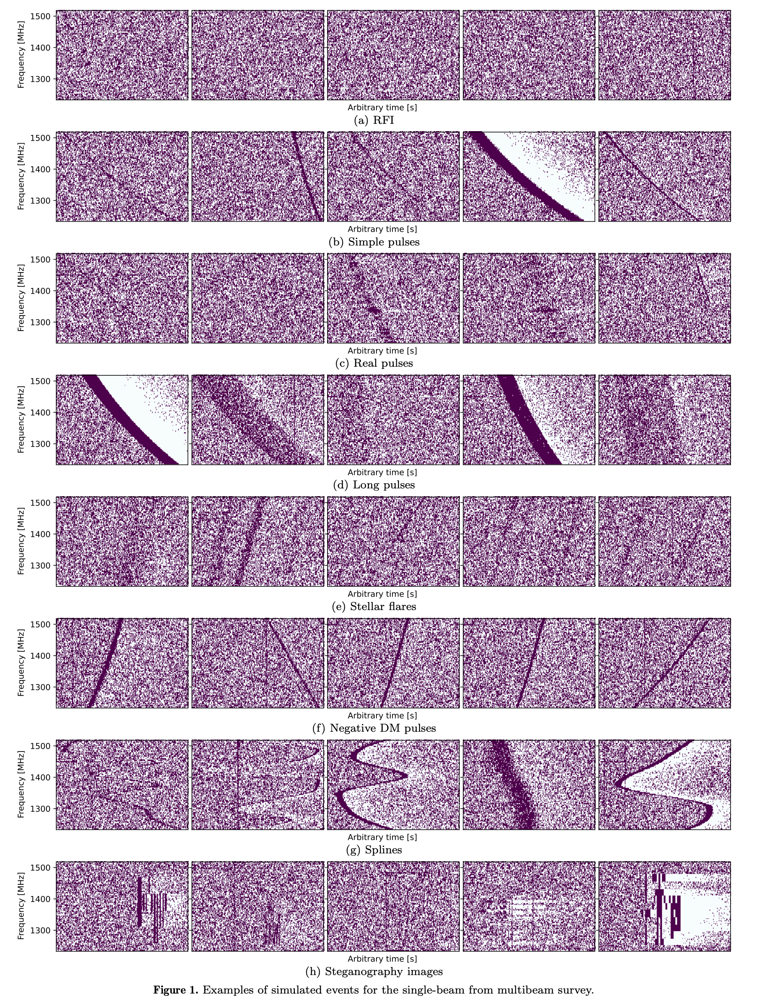
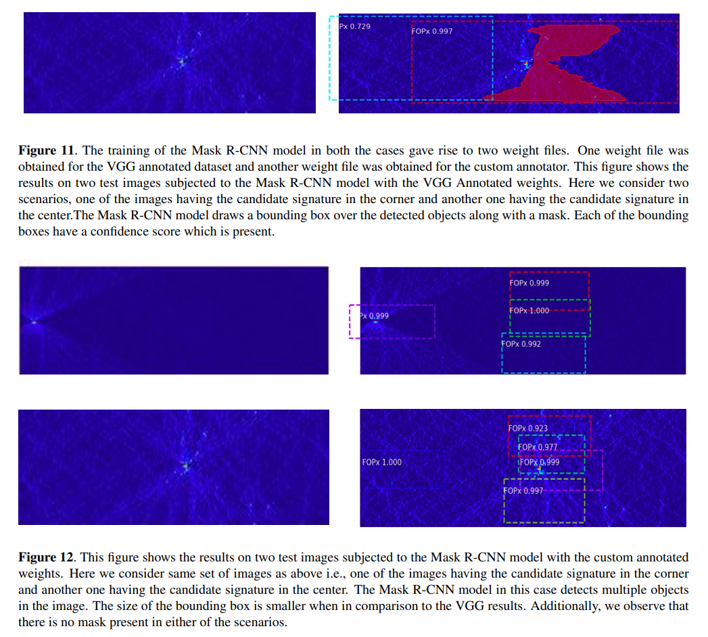
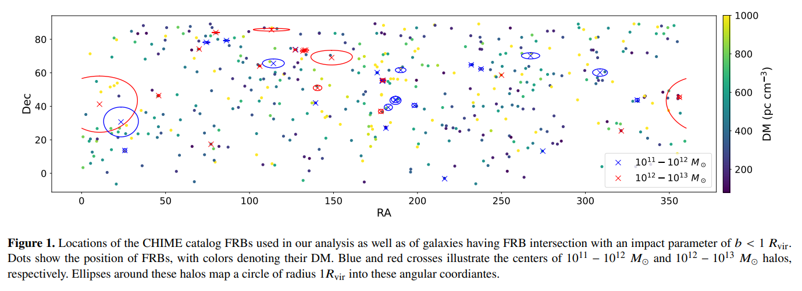
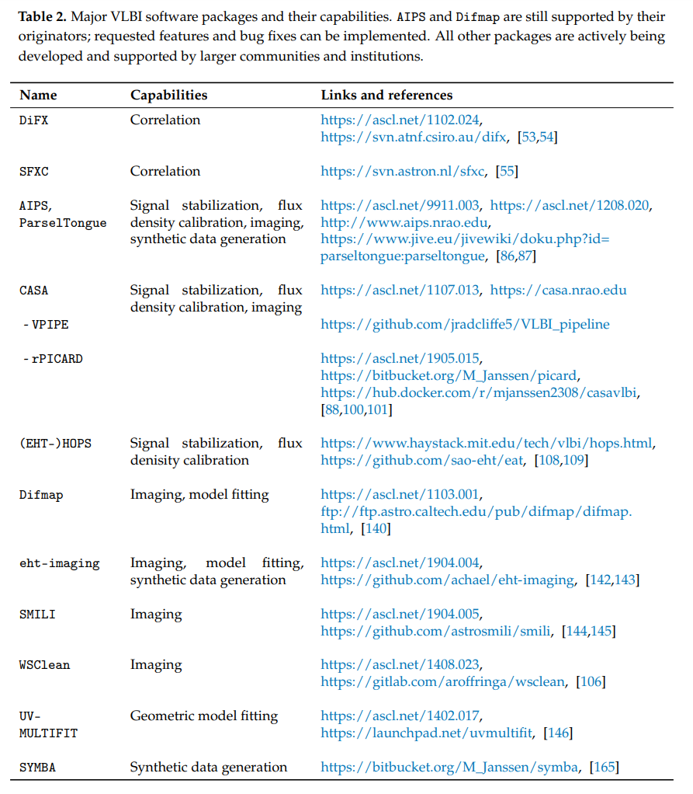

## 2022-09-01

1. [A Semi-blind PCA-based Foreground Subtraction Method for 21 cm Intensity Mapping](https://arxiv.org/abs/2208.14675)

   > Radio, Machine Learning, PCA, HI

   PCA和SVD被广泛应用于21cm成图中前景消除。这里指出这两种方法无法完全干净地分离21cm信号和前景。这里提出一种方法`Singular Vector Projection`，使用`left/right`的`singular vectors`，可以将恢复的21cm信号误差降低几个数量级。

## 2022-09-02

1. [The ultra narrow FRB20191107B, and the origins of FRB scattering](https://arxiv.org/abs/2209.00311)

   > Fast Radio Burst, Detection

   `UTMOST`探测到`FRB 20191107B`，色散$714.9\,\rm pc/cm^{-3}$，有三个部分，持续时间非常短，最亮的部分只有$11.3\,\rm \mu s$，散射时标为$21.4\,\rm \mu s$。模拟估计，`UTMOST`可能漏掉了60%这样的窄事件。

   `FRB 20191107B`的高DM和小散射时标给IGM的湍流强度设定一个上限，量化为散射尺度$SM_{IGM}<8.4\times10^{-7}\,\rm kpc/m^{-30/2}$。与其它FRB一起做统计，没发现DM和散射之间的关联，表明IGM不是FBR散射的主要来源，因此支持以前的研究结果，即宿主星系中源的局域环境最可能主导FRB的散射。

   

2. [The JWST Early Release Science Program for Direct Observations of Exoplanetary Systems II: A 1 to 20 Micron Spectrum of the Planetary-Mass Companion VHS 1256-1257 b](https://arxiv.org/abs/2209.00620)

   > JWST, Exoplanet, Spectrum

   `VHS 1256b`是褐矮星伴星，很年轻，质量小于$20M_{Jup}$，轨道半径约$150AU$，与可以直接成像的系外行星`HR 8799c/d/e`有相同的光度和光谱特征。

   用JWST的NIRSpec IFU和MIRI MRS观测，覆盖$1-20\,\rm \mu m$，分辨率1000-3700。根据与模板褐矮星光谱、分子不透明度和大气模型比较，光谱中找到了水、甲烷、一氧化碳、二氧化碳、钠和钾。`VHS 1256b`的光谱形状收到了不平衡化学和云层的影响。并且第一次对行星质量的伴星探测到了硅酸盐云。

   

## 2022-09-05

1. [Binaries with possible compact components discovered from the LAMOST Time-Domain Survey of four K2 plates](https://arxiv.org/abs/2209.00765)

   > Stellar, Binary

   看看搞恒星的在干啥。以前不知道LAMOST还有时变光谱数据，从中可以提取时变径向速度，那么就可以找轨道周期双星了。这里找到了三个有致密天体伴星的双星系统。LAMOST中分光谱中没有双线（两个同类型恒星的发射线）、没有X射线对应体、光谱分解也没有额外的光学吸收，支持伴星是致密天体。

## 2022-09-06

美国劳动节停更。

## 2022-09-07

1. [Symmetry Breaking in Repeating Fast Radio Bursts](https://arxiv.org/abs/2209.01700)

   > Fast Radio Burst, Theory

   `sad trombone`指随时间增加频率向下漂移的的结构，这样的结构是不对称的。一些模型预测所有类似FRB180916这样的周期重复FRB都会有相同的`sign of temporal asymmetry`，一些模型预测`both signs`同样丰富。

2. [A pilot ASKAP survey for radio transients towards the Galactic Centre](https://arxiv.org/abs/2209.02352)

   > ASKAP, Radio Transient

   用ASKAP看银河系中心射电瞬变源和偏振。巡天范围由五块面积组成，每块观测12分钟，在1天到4个月的周期内重复7-9次。总共探测到8个高度可变的源和7个高度圆偏振的源，其中7个是已知脉冲星，1个事低质量X射线双星，三个与光学或红外源重合，可能是恒星，剩下三个可能与`class of Galactic Centre Radio Transients`有关。如果这类源是各向同性的，那么这项调查将会发现40个爆发。

## 2022-09-08

1. [SPARKESX: Single-dish PARKES data sets for finding the uneXpected -- A data challenge](https://arxiv.org/abs/2209.03080)

   > Radio, Dataset

   基于Parkes的模拟观测产生的数据集，作为数据挑战用于寻找未知类型天体的算法开发。数据中注入了大量模拟的信号，包括脉冲星、FRB、特征不清的信号和未知信号。数据在[这里](https://doi.org/10.25919/fd4f-0g20)。

   

2. [Classifying Transients Using Host Galaxy Photometry](https://arxiv.org/abs/2209.02784)

   > Transient, Variable, Machine Learning, Classification

   根据宿主星系的测光亮度和颜色来区分暂现源的种类，用于LSST实时报告。大致可以区分出八种暂现源种类，包括TDE、SNIa、SNIa-91bg、SNIa-91T、SNIb、SNII、SNIIn、SNIIP。数据在[这里](https://sandbox.zenodo.org/record/1086145)，代码在[这里](https://github.com/marinakiseleva/thex_model)和[这里](https://github.com/marinakiseleva/z_dist)。

## 2022-09-09

1. [High Velocity Stars in SDSS/APOGEE DR17](https://arxiv.org/abs/2209.03560)

   > Stellar, Velocity, Dynamics

   APOGEE和Gaia数据找到银心坐标系下，速度大于$450km/s$的23颗恒星，其中3颗可能不受银河引力势的约束。所有23颗都是红巨星支恒星，遵循了典型的晕星丰度模式。没有找到超高速星，但这样的结果对距离非常敏感（由于速度是距离乘出来的）。

2. [Opening the era of quasar host studies at high redshift with JWST](https://arxiv.org/abs/2209.03359)

   > Galaxy, Quasar, JWST

   从SDSS和AEGIS中选出5个$z\sim1.6-3.5$的类星体的宿主星系，然后根据HST和JWST的数据进行测光分析。结果表现出，JWST提供了探测$z>3$的类星体宿主的能力，并且能够解析$z\sim2$的形态结构（spiral arms、bar）。这些类星体的宿主是盘状的，并且缺乏合并的特征。

## 2022-09-12

1. [Combining Hipparcos and Gaia data for the study of binaries: the BINARYS tool](https://arxiv.org/abs/2209.04210)

   > Stellar, Binary, Gaia, Exoplanet, Software

   [BINARYS](https://gricad-gitlab.univ-grenoble-alpes.fr/ipag-public/gaia/binarys)是用来确定双星系统轨道和单个恒星质量的工具，结合`Hipparcos`和`Gaia EDR3`的天体测量数据。

2. [Empirical constraints on the turbulence in QSO host nebulae from velocity structure function measurements](https://arxiv.org/abs/2209.04344)

   > QSO, Turbulence, VSF

   `QSO, quasi-stellar object; quasar`，类星体。这里使用`VLT`上的`MUSE`测量了四个$z=0.5-1.1$的类星体周围（以类星体为中心的直径为$50-100kpc$）的弥漫介质的光谱，计算了二阶和三阶速度结构函数：
   $$
   S_p(r)=\left<\left|v(x)-v(x+r)\right|^p\right>
   $$
   其中一个QSO的VSF与Kolmogorov定律（各向同性、均匀且不可压缩湍流）非常一致，确定湍流能量耗散率为$0.2\,\rm cm^2/s^3$。另外三个表现出VSF从大尺度到小尺度微小的下降。最后讨论了观察到的VSF在QSO形成和形成反馈中的意义。

3. [Investigation of a Machine learning methodology for the SKA pulsar search pipeline](https://arxiv.org/abs/2209.04430)

   > SKA, Machine Learning, Anomaly Detection, Object Detection, Pulsar, Software

   SKA中用于脉冲星搜索的流程，使用`Mask R-CNN`识别图像中的候选物体。

   

## 2022-09-13

1. [A measurement of circumgalactic gas around nearby galaxies using fast radio bursts](https://arxiv.org/abs/2209.04455)

   > Fast Radio Burst, CircumGalactic Medium

   `Circumgalactic Medium, CGM`，星系周介质，目前所有种类的星系的CGM中气体分布没有得到良好的约束。由于CGM对FRB的DM会有贡献，所以可以用CHIME的FRB目录来探测。通过对比FRB的位置，与堆叠后星系晕的位置，发现有20-30个FRB与质量为$10^{11}-10^{13}\,M_\odot$的晕相交。 说明CGM的确对DM做出了额外贡献。

   

2. [Repeating Fast Radio Bursts with High Burst Rates by Plate Collisions in Neutron Star Crusts](https://arxiv.org/abs/2209.04774)

   > Fast Radio Burst, Theory

   针对FRB高爆发率的理论，说是`年轻中子星壳层板块碰撞造成`。在这种情景下，对于磁场为$10^{13}G$，自转周期0.01s的中子星，爆发率可以达到$770/h$，预测等待时间分布$P(t)\propto t^{\alpha=-1.75}$，能量分布$N(E)dE\propto E^{\alpha=-1.67}dE$。

3. [Evaluating the efficacy of sonification for signal detection in univariate, evenly sampled light curves using astronify](https://arxiv.org/abs/2209.04465)

   > Astronify, Light Curve

   用`Astronify`声化了一系列不同信噪比，不同凌日信号的光变曲线。将声音文件与光变曲线发给不同的人来做判断。专家与非专家都能从声音文件中判断出高信噪比（SNR=30-100）的信号，低信噪比（SNR=3-5）的信号专家与非专家判断也都相同，但是中等信噪比（SNR=7-10）的情况，使用声音文件专家的判断并不比非专家好，但是视觉判断会好得多。这里提出之后对低信噪比的信号做处理后声化，对于识别信号可能有很大帮助。他们的声化数据在[这里](https://data.ncl.ac.uk/articles/dataset/Tucker-Brown_et_al_-_Astronify_Efficacy_Testing_-_Data/20936749)。

## 2022-09-14

1. [Search for a Black Hole Binary in Gaia DR3 Astrometric Binary Stars with Spectroscopic Data](https://arxiv.org/abs/2209.05632)

   > Stellar, Black Hole, Binary

   从Gaia DR3的双星解决方案的天体测量和光谱数据中找到一个可能的黑洞-红巨星`Gaia DR3 5870569352746779008`双星系统。尽管红巨星的质量无法确定，不过轨道参数估计伴星的质量大于$5.25\,M_\odot$，如果确认是BH双星，那么周期是最长的$1352.25\pm45.5d$。

2. [Software and techniques for VLBI data processing and analysis](https://arxiv.org/abs/2209.06115)

   > VLBI, Radio, Software

   总结了分析VLBI数据时应该了解的最新技术和算法。

   

## 2022-09-15

1. [Detection of a quasi-periodic oscillation at ∼40 mHz in Cen X-3 with Insight-HXMT](https://arxiv.org/abs/2209.06662)

   > High Energy, QPO

   `Cen X-3`是吸积X射线脉冲星，在慧眼数据中找到了$40mHz$的准周期，用的[XRONOS](https://heasarc.gsfc.nasa.gov/xanadu/xronos/xronos.html)，是NASA开发的用于X射线的时域分析软件，之后可以看一看。从$2-20keV$，QPO的rms幅度下降，可能归因于吸积盘在冠状半径附近被截断时的不稳定性。

## 2022-09-16

1. [SOXS mechanical integration and verification in Italy](https://arxiv.org/abs/2209.07182)

   > SOXS, Spectrum, Instrument

   `SOn of X-Shooter, SOXS`是一个中等分辨率（R=4500）的宽频$0.35-2.0\mu m$光谱仪，主要由5个不同的光学子系统`Common Path`、`近红外光谱仪`、`紫外-可见光光谱仪`、`照相机`、`校准`。目前正处于最后组装阶段，计划明年前安装在`La Silla`的NTT上。

2. [Noise2Astro: Astronomical Image Denoising With Self-Supervised NeuralNetworks](https://arxiv.org/abs/2209.07071)

   > Machine Learning, Deep Learning

   使用`Galfit`从图像中提取星系，作为`U-net/DnCNN`的训练集，做天文图像降噪。

## 2022-09-19

1. [Toward an understanding of the properties of neural network approaches for supernovae light curve approximation](https://arxiv.org/abs/2209.07542)

   > Stellar, Light Curve, Machine Learning

   用`多层感知机`、`贝叶斯神经网络`、`Normalizing`等在`PLAsTiCC`的模拟数据和`ZTF`的真实光变曲线数据上进行训练和测试，以估计变源的类型和光变峰值。NN比一般的高斯过程计算复杂度低，并且可以得到类似的计算准确度。代码在这里，叫[Fulu](https://github.com/HSE-LAMBDA/fulu)。

2. [Fourier Domain](https://arxiv.org/abs/2209.07954)

   > Time Series, Fourier Analysis

   周期性和准周期性是系统中基本时间尺度的指标，随机过程有助于揭示湍流吸积过程的性质。是`Timing Analysis" of the "Handbook of X-ray and Gamma-ray Astrophysics`的一章，讲傅立叶分析时间序列的相关方法。

## 2022-09-20

1. [Gaussian Process regression for astronomical time-series](https://arxiv.org/abs/2209.08940)

   > Time Series, Gaussian Process

   用`高斯过程`对时间序列数据建模的综述。介绍了GP的基本数学理论，给出建模时参数选择的建议。回顾了GP在从系外行星导活动星系核的时域数据集上的应用，文章里演示的代码在[这里](https://github.com/dfm/araa-gps)，由[showyourwork](https://github.com/showyourwork/showyourwork)建立。

## 2022-09-21

1. [Baseline correction for FAST radio recombination lines: a modified penalized least squares smoothing technique](https://arxiv.org/abs/2209.09555)

   > Radio, Baseline Correction, Method

   基于`AsLS/arPLS/asPLS`写出来的`rrlPLS`，用于FAST探测`recombination lines`消除RFI使用。

## 2022-09-22

1. [Semi-Supervised Classification and Clustering Analysis for Variable Stars](https://arxiv.org/abs/2209.09957)

   > Stellar, Variable, Machine Learning

   用半监督的方法在`Optical Gravitational Lensing Experiment`、`Catalina Sky Surveys`、`Gaia`的光变曲线数据上做分类。

   步骤是：特征预处理，用`umap`降维后变成二分类的数据，监督训练`umap`转换矩阵，用转换矩阵转换多维数据到两团，用`Radial Basis Function`核的支持向量机训练分类器，最后用SVM预测没打标签的数据。

## 2022-09-23

1. [Comets and meteor showers](https://arxiv.org/abs/2209.10654)

   > Comet, Meteor Shower

   在这一章中，讨论了流星科学的发展和现状，重点是它作为研究彗星的工具的作用，并回顾已经建立的彗星-流星雨之间的联系。

## 2022-09-26

