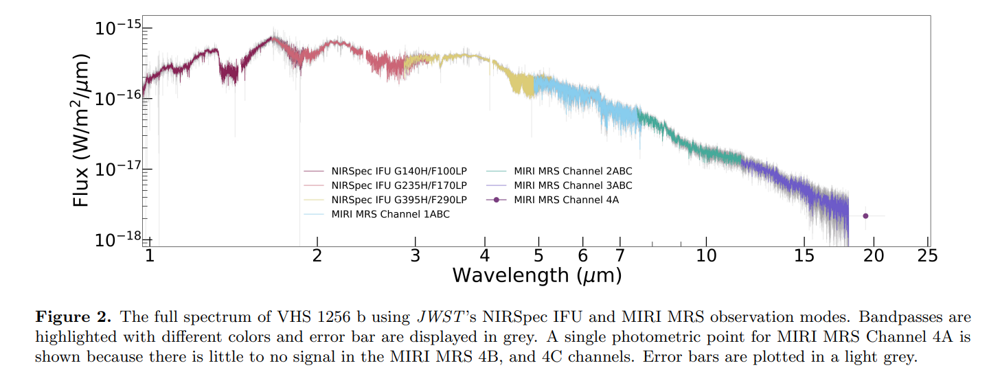

## 2022-09-01

1. [A Semi-blind PCA-based Foreground Subtraction Method for 21 cm Intensity Mapping](https://arxiv.org/abs/2208.14675)

   > Radio, Machine Learning, PCA, HI

   PCA和SVD被广泛应用于21cm成图中前景消除。这里指出这两种方法无法完全干净地分离21cm信号和前景。这里提出一种方法`Singular Vector Projection`，使用`left/right`的`singular vectors`，可以将恢复的21cm信号误差降低几个数量级。

## 2022-09-02

1. [The ultra narrow FRB20191107B, and the origins of FRB scattering](https://arxiv.org/abs/2209.00311)

   > Fast Radio Burst, Detection

   `UTMOST`探测到`FRB 20191107B`，色散$714.9\,\rm pc/cm^{-3}$，有三个部分，持续时间非常短，最亮的部分只有$11.3\,\rm \mu s$，散射时标为$21.4\,\rm \mu s$。模拟估计，`UTMOST`可能漏掉了60%这样的窄事件。

   `FRB 20191107B`的高DM和小散射时标给IGM的湍流强度设定一个上限，量化为散射尺度$SM_{IGM}<8.4\times10^{-7}\,\rm kpc/m^{-30/2}$。与其它FRB一起做统计，没发现DM和散射之间的关联，表明IGM不是FBR散射的主要来源，因此支持以前的研究结果，即宿主星系中源的局域环境最可能主导FRB的散射。

   

2. [The JWST Early Release Science Program for Direct Observations of Exoplanetary Systems II: A 1 to 20 Micron Spectrum of the Planetary-Mass Companion VHS 1256-1257 b](https://arxiv.org/abs/2209.00620)

   > JWST, Exoplanet, Spectrum

   `VHS 1256b`是褐矮星伴星，很年轻，质量小于$20M_{Jup}$，轨道半径约$150AU$，与可以直接成像的系外行星`HR 8799c/d/e`有相同的光度和光谱特征。

   用JWST的NIRSpec IFU和MIRI MRS观测，覆盖$1-20\,\rm \mu m$，分辨率1000-3700。根据与模板褐矮星光谱、分子不透明度和大气模型比较，光谱中找到了水、甲烷、一氧化碳、二氧化碳、钠和钾。`VHS 1256b`的光谱形状收到了不平衡化学和云层的影响。并且第一次对行星质量的伴星探测到了硅酸盐云。

   

## 2022-09-05

