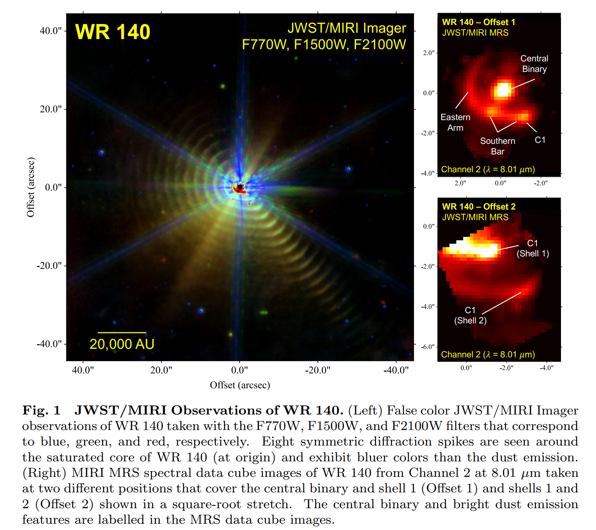
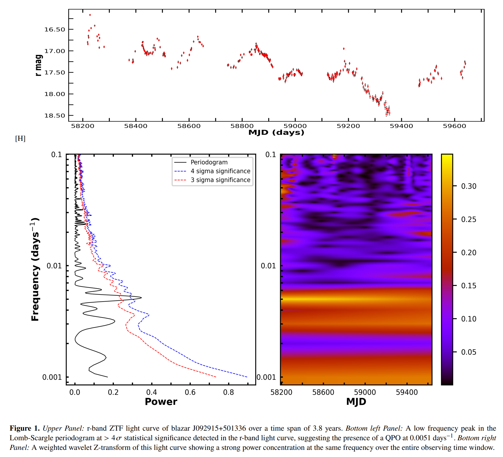
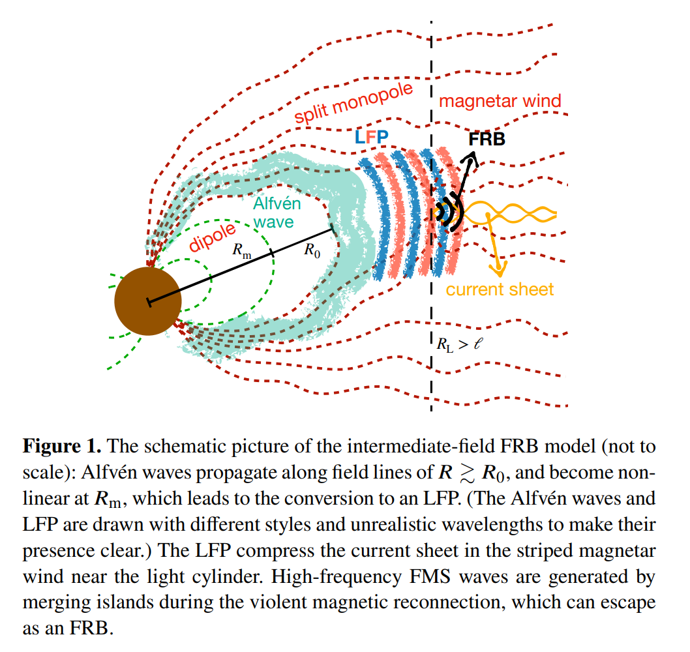
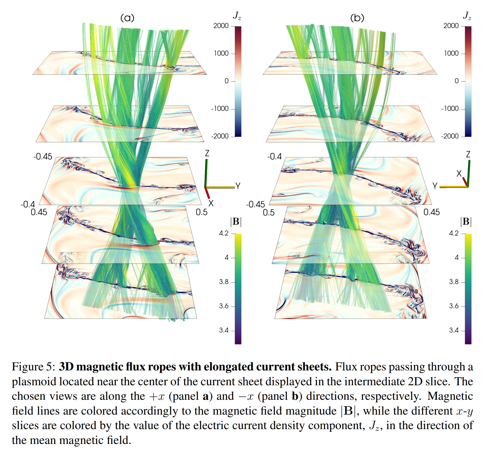
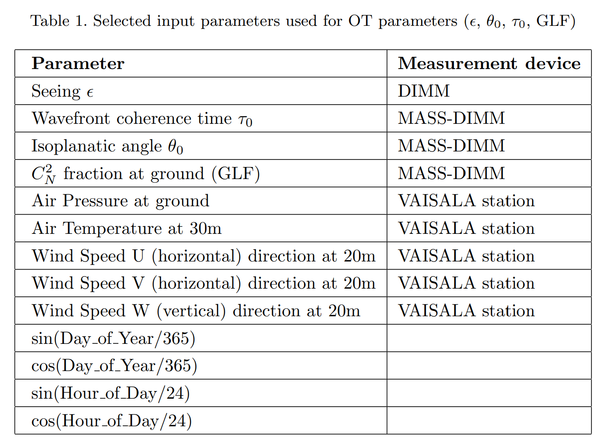
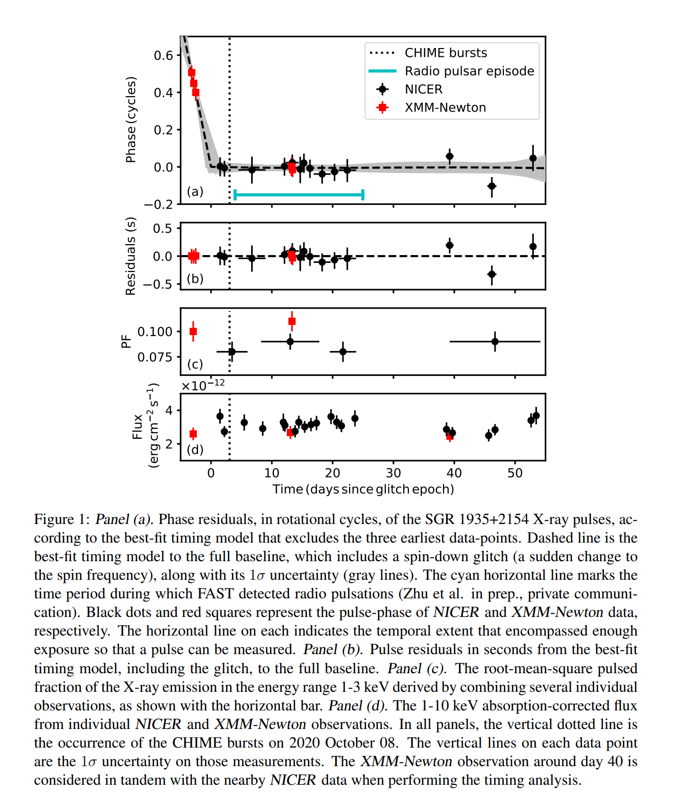
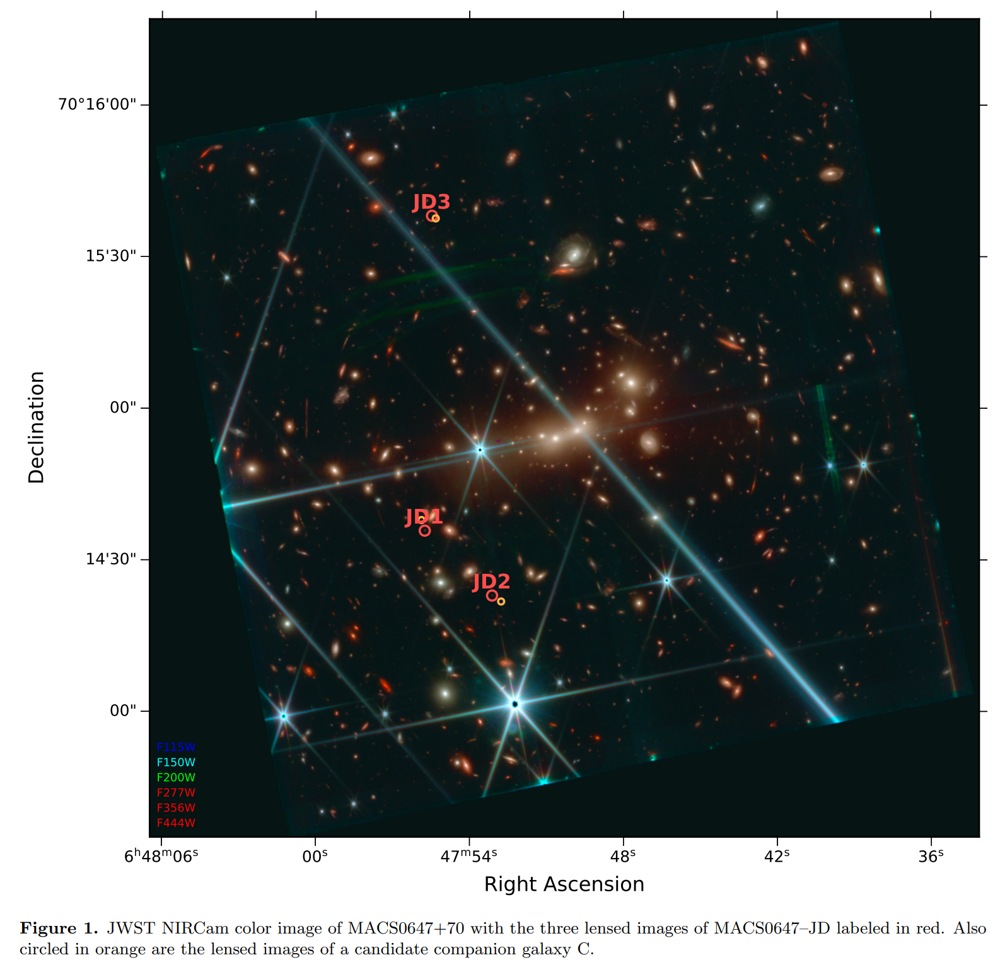
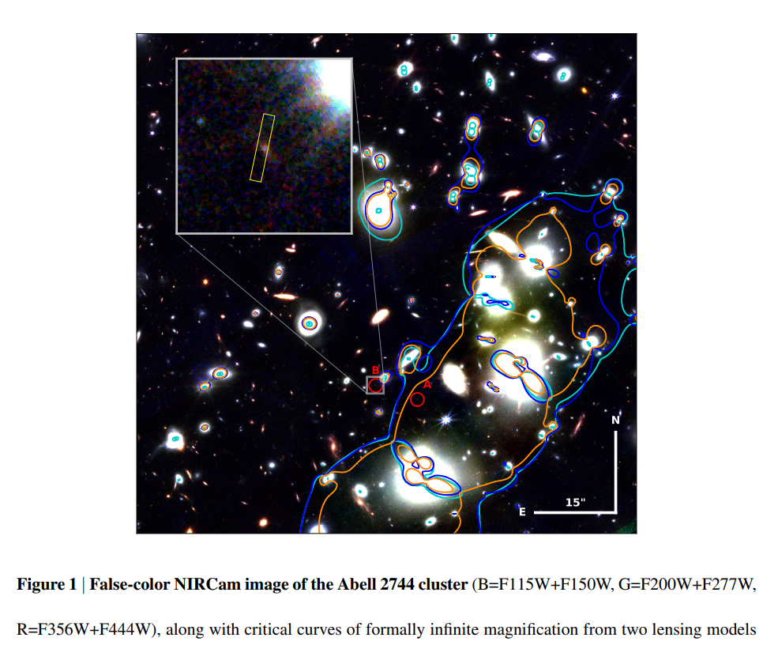

## 2022-10-03

1. [Fast Radio Bursts as Probes of Magnetic Fields in Galaxies at z < 0.5](https://arxiv.org/abs/2209.15113)

   > Fast Radio Burst, Polarization, Galaxy, Magnetic Field

   FRB的RM和`红移`没有相关性，以及RM与`宿主星系DM和`宿主星系归一化的`星系中心偏移`有强相关，表明其RM主要由宿主星系贡献。

   从九个已经良好定位在$z<0.5$的宿主星系中的FRB的RM，推导宿主星系的磁场强度。其中值只有$0.5\mu G$，比太阳系周围磁场$6\mu G$要弱，但与`star-forming, disk`星系的$2-10\mu G$下限相对一致。

   

## 2022-10-04

1. [A broad survey of spectro-temporal properties from FRB20121102A](https://arxiv.org/abs/2210.00106)

   > Fast Radio Burst, Spectrum, Morphology

   分析FRB121102的167个爆发的频谱形态，这些爆发频率在$1-7.5GHz$，持续时间$<1-10ms$。发现`sub-burst slope`和`frequency drift rate`，与持续时间成反比（与`triggered relativistic dynamical, TRDM`模型预测一致），与频率二次方成正比，持续时间随频率增加而减少。另外，`sub-burst`的持续时间与带宽有统计相关性。这个167个爆发的样本没有发现离群的，说明其形态有一致的关系。搞了个分析频谱形态的工具，叫[FRBGui](https://github.com/mef51/frbgui)。

2. [The JWST Hubble Sequence: The Rest-Frame Optical Evolution of Galaxy Structure at 1.5<z<8](https://arxiv.org/abs/2210.01110)

   > Galaxy, Morphology, JWST

   对JWST观测到的$1.5<z<8$的4256个星系进行的形态上的视觉分类，分为`disk`/`spheroid`/`peculiar`三类，据此研究从宇宙的第一个亿年依赖，这些形态的相对数量是如何演变的。另外还用[Morfometryka](http://www.ferrari.pro.br/home/research/morfometryka/)做了星系结构和形态的定量测量。

   结果表明，$z>3$的星系不像以前认为的那样由不规则和奇异结构主导。在$z\sim6$时，恒星质量和恒星形成率密度都由盘状星系主导，表明宇宙中的大多数恒星可能是在盘状星系中形成的。他们的视觉分类结果将发布在[这里](https://github.com/astroferreira/CEERS_JUNE_VISUAL_CLASSIFICATIONS)。

   

## 2022-10-05

1. [Panoramic SETI: Program Update and High-Energy Astrophysics Applications](https://arxiv.org/abs/2210.01356)

   > Instrument, Time Domain, Telescope

   `PANOSETI`是用几台家用望远镜`0.46-m f/1.32 Fresnel-lens `，加上16块$8\times8$的光子计数器`Hamamatsu S13361- 3050AE-08`组成，用于在$2500\ \rm deg^2$的天区内，搜索纳秒到秒量级的光学瞬变信号。

   在过去一段时间里，`PANOSETI`在对Crab Nebula的观测中探测到三次能量在$15-50TeV$之间的伽马射线。宇宙线打到大气中产生的次级光学辐射，也即`Cherenkov radiation`效应，当介质中运动的电荷速度超过该介质中光速时发出的一种以短波长为主的电磁辐射，其特征是蓝色辉光。

2. [Machine Learning based search for Cataclysmic Variables within Gaia Science Alerts](https://arxiv.org/abs/2210.01431)

   > Machine Learning, Random Forest, Gaia

   从`Gaia Science Alerts program, GSA`中使用机器学习识别暂现源。用随机森林模型从Gaia的超新星、活动星系核、初期恒星体的光变曲线数据中分辨灾变变星。在`GSA`的13280个没有指定类别的天体中，文章中的模型分辨出了2800个暂现源的类别。

## 2022-10-06

1. [CASA, the Common Astronomy Software Applications for Radio Astronomy](https://arxiv.org/abs/2210.02276)

   > VLBI, CASA, Software

   [CASA](https://casa.nrao.edu/)是ALMA和VLA的主要数据处理软件，可以处理`单碟`、`孔径合成`和`甚长基线干涉测量`望远镜的数据，核心功能是支持`ALMA`、`VLA`、`VLASS`和`Nobeyama 45m`望远镜的校准和成像。

2. [Immediate origin of the Moon as a post-impact satellite](https://arxiv.org/abs/2210.01814)

   > Lunar, Earth, Planetary Science

   一般认为月球是撞击地球碎片凝聚而成，但是这样的模型很难解释地球和月球岩石相似的同位素组成。这里做了高分辨率的模拟，发现撞击可以立即将质量与成分与月球相似的卫星放入远超地球洛希极限的轨道。

   <video src="Figures/Immediate origin of the Moon as a post-impact satellite - partial disruption-AQmeomxvokM.mp4"></video>

3. [FRB−SRB−XRB: Geometric and Relativistic Beaming Constraints of Fast Radio Bursts from the Galactic Magnetar SGR J1935+2154](https://arxiv.org/abs/2210.01904)

   > Fast Radio Burst, Theory

   探测到`FRB 200428`与`SGR 1935`的一次X射线暴同时出现，表明磁星可以产生FRB。目前已经从`SGR 1935`探测到许多XRB，但是没有FRB，另外检测到一些弱射电暴，可能是慢速射电暴`SRB`。这里考虑两种情况讨论FRB的几何和相对论`beaming factor`。 

   如果FRB/SRB都与XRB相关，为了保证FRB的稀缺性，FRB必须是几何上的狭窄，下限是$\theta_j\Gamma>3$，如果与FRB关联的XRB是独一无二的，那么beaming factor会是最大值$\pi/2\ \rm rad$。

   如果FRB/SRB不要求与XRB相关，使用`FRB−SRB closure relations`确定FRB的beaming factor是$\theta_j\Gamma\le3$。

4. [Scattering variability detected from the circumsource medium of FRB 20190520B](https://arxiv.org/abs/2210.01975)

   > Fast Radio Burst, Scattering

   散射测量可以确定FRB宿主星系内等离子体结构，探测银河系和银河系湍流，并限制了FRB的红移。散射也抑制了FRB的探测，并使探测到的FBR群体出现偏差。

   这里对FRB 190520的散射时间做测量，可以在几分钟到几天的时间内变化两倍以上。典型案例中，散射时间在1.45GHz的2.9分钟内从$7.9ms$变到$<3.1ms$。另外，散射时间与DM和RM测量无关。

   散射变化可归因于介质中动态的、不均匀的等离子体，在Crab Pulsar中也观察到类似的变化。

## 2022-10-07

1. [Machine learning classification of fast radio bursts: I. supervised methods](https://arxiv.org/abs/2210.02463)

   > Fast Radio Burst, Machine Learning, Classification

   用CHIME的目录训练多种监督学习模型，发现重复和非重复FRB可以被良好分类，并且影响最大的因素是`亮温度`和`rest-frame frequency bandwidth`。
   $$
   T_B=\frac{S_\nu D_A^2}{2\pi k_B(\nu\Delta t)^2}(1+z)^3\\=1.1\times10^{35}K\left(\frac{S_\nu}{\rm Jy}\right)\left(\frac{\nu}{\rm GHz}\right)^{-2}\left(\frac{\Delta t}{\rm ms}\right)\left(\frac{D_L}{\rm Gpc}\right)\frac{1}{1+z}
   $$
   

2. [Machine Learning Classification of Fast Radio Bursts: II. Unsupervised Methods](https://arxiv.org/abs/2210.02471)

   > Fast Radio Burst, Machine Learning, Classification

   类似上一篇，用无监督学习模型。

## 2022-10-10

1. [FAST observations of an extremely active episode of FRB 20201124A: I. Burst morphology](https://arxiv.org/abs/2210.03607)

   > Fast Radio Burst

   FRB20201124A在2021年9月份的FAST观测，形态。

2. [FAST observations of an extremely active episode of FRB 20201124A: II. Energy Distribution](https://arxiv.org/abs/2210.03645)

   > Fast Radio Burst

   FRB20201124A在2021年9月份的FAST观测，能量。

3. [FAST observations of an extremely active episode of FRB 20201124A: III. Polarimetry](https://arxiv.org/abs/2210.03609)

   > Fast Radio Burst

   FRB20201124A在2021年9月份的FAST观测，偏振。

4. [FAST observations of an extremely active episode of FRB 20201124A: IV. Spin Period Search](https://arxiv.org/abs/2210.03610)

   > Fast Radio Burst

   FRB20201124A在2021年9月份的FAST观测，周期。

5. [Probing the distant universe with a very luminous fast radio burst at redshift 1](https://arxiv.org/abs/2210.04680)

   > Fast Radio Burst, ASKAP, Localization

   ASKAP探测到的`FRB20220610A`，$DM=1457.6\,\rm pc /cm^3$，定位在$z=1.016\pm0.002$的宿主星系中（目前最大红移）。其红移和色散之间的关系表明，在宇宙目是前一半年龄时，大部分重子物质就已经电离并进入星系间。这个爆发的能量是目前最亮的4倍，证实高红移时存在一个高能量的爆发群。

6. [A Milliarcsecond Accurate Position for Sagittarius A*](https://arxiv.org/abs/2210.03390)

   > VLBA, Localization, Black Hole

   用VLBA在$22GHz$和$43GHz$对`Sgr A*`做了三次观测，参考亚毫角秒的河外射电源，确定`Sgr A*`的位置在$\alpha=17{\,\rm h}45{\,\rm m}40.032863{\,\rm s}\pm0.000016{\,\rm s},\ \delta=-29{\,\rm d}00{\,\rm m}28.24260{\,\rm s}\pm0.00047{\,\rm s}$，自行是$-3.152\pm0.011,\ -5.586\pm0.006\,{\rm mas/yr}$。

7. [Optical Polarimetry of the May 2022 Lunar Eclipse](https://arxiv.org/abs/2210.03434)

   > Lunar, Eclipse, Polarimetry

   月全食期间，月球上反射的太阳光经过地球大气的散射，可能使光偏振。类似的效应也应该可以从凌日系外行星大气中观测到。

   这里观测2022年5月16日的月全食光学偏振，B的偏振度为$2.1\pm0.4\%$，V是$1.2\pm0.3\%$，R是$0.5\pm0.2\%$，I是$0.2\pm0.2\%$，并且偏振度与月面反射位置无关，因此偏振的起源是由于地球大气层的散射，而不是由月球岩石造成。

## 2022-10-11

1. [Polarisation of magnetospheric curvature radiation in repeating fast radio bursts](https://arxiv.org/abs/2210.04401)

   > Fast Radio Burst, Polarization, Theory

   中子星磁层`bulk of charged bunches`的相干曲率辐射产生FRB。当视线在发射的几何光束内，出现的是高线偏振，当视线在发射的几何光束外时，出现的是高圆偏振。三个重复暴，FRB20201124A、FBR20190520B和FRB20121102A，大多以线偏振为主，圆偏振符号变换事件很少，说明FRB有可能是由大张角的薄`bulk`发射的。

2. [PySME -- Spectroscopy Made Easier](https://arxiv.org/abs/2210.04755)

   > Spectrum, Software, Exoplanet

   [PySME](https://github.com/AWehrhahn/SME)，做系外行星大气光谱拟合的软件，由IDL SME改到Python。

3. [The Nearest Neutron Star Candidate in a Binary Revealed by Optical Time-domain Surveys](https://arxiv.org/abs/2210.04685)

   > Stellar, Time Domain, Optical, Radio

   距离地球100pc以内的超新星爆炸产生的金属会在地球上沉积，因此太阳系附近的中子星仍然有待发现。这里再LAMOST时域光谱中找到一个双星系统，距离地球$127.7\pm0.3\,\rm pc$，根据多波段光谱和光变曲线，其中可见的恒星的质量是$0.7\pm 0.05M_\odot$，不可见的致密天体的质量是$\ge1.26\pm0.03M_\odot$，由于不存在过量的紫外辐射，因此不可见的天体不是超大质量白矮星，而有可能是中子星。FAST观测一小时没找到射电脉冲。说这种方法可以通过探索光学时域信息来找太阳系附近不活跃的中子星，从而促进对太阳系附近的超新星爆炸和金属富集历史的理解。

   与2022-09-27第一篇文章类似。

## 2022-10-12

1. [B-fields do not suppress star formation in low metallicity dwarf galaxies](https://arxiv.org/abs/2210.04922)

   > Galaxy, Star Formation, Magnetic Field

   分子云中的研究有结论是磁场会抑制恒星形成。然而，这些研究大多是基于已经饱和并且充分发展的磁场，很少有研究原始磁场的成长阶段如何影响低金属性环境中恒星形成。

   这里使用`AREPO`模拟矮星系，模拟纯流体、$10^{-6}\mu G$、$10^{-2}\mu G$的磁场条件，金属丰度在$0.01-0.1$之间变化，发现磁场对恒星形成率的影响很小。

## 2022-10-13

1. [Nested Dust Shells around the Wolf-Rayet Binary WR 140 observed with JWST](https://arxiv.org/abs/2210.06452)

   > Stellar, Binary, Dust, ISM, JWST

   大质量`colliding-wind binaries`是ISM中尘埃和化学富集的一个重要来源，不过这种系统中形成的尘埃和化学成分还没有很好的了解。`WR 140`是一个理想的实验室，有明确的轨道周期，每隔7.93年就会有一次可预测的尘埃形成事件。这里用JWST的MIRI、MRS和成像仪观测了过去130年形成的超过17个尘埃层，证实了`carbonaceous dust`的存在，表明`dust-forming WC binaries`可以丰富ISM中的有机化合物和碳质尘埃。

   

2. [RAD@home citizen science discovery of an AGN spewing a large unipolar radio bubble onto its merging companion galaxy](https://arxiv.org/abs/2210.06100)

   > Galaxy, Black Hole, AGN

   星系合并期间的AGN反馈用于解释黑洞-星系共同演化，然而AGN驱动的喷流/辐射如何与并和星系的气体耦合，从而导致瞬间增强以及随后下降的恒星形成，尚且知之甚少。

   这里报告一个特殊案例，`RAD12`由`RAD@HOME`发现，首次出现了射电喷流驱动的气泡$\sim137pc$，撞击到一个贫含气体的早型星系，但是既没有正反馈也没有检测到反喷流一侧的任何射电瓣。

## 2022-10-14

1. [Solar System-scale interferometry on fast radio bursts could measure cosmic distances with sub-percent precision](https://arxiv.org/abs/2210.07159)

   > Fast Radio Burst, Interferometry

   由于波前的曲率，来自距离d的光源的光到达相隔$x_\perp$的探测器的时间差是
   $$
   \Delta t=120\ {\rm ns}\left(\frac{x_\perp}{100{\rm AU}}\right)^2\left(\frac{d}{100{\rm Mpc}}\right)^{-1}
   $$
   在GHz波段，干涉测量确定的到达时间差异可以好于1ns。这里表明，四个距离太阳10AU的探测器测量光源距离的误差可以小于1/100。导致探测器位置不确定的加速度（如太阳辐射照度变化、尘埃碰撞、气体阻力等）可以每周通过GPS的三分仪来校正。这样的干涉仪还将解决银河系脉冲星的射电发射区，约束太阳系外的质量分布，并对$0.01-100\mu Hz$的引力波敏感。

## 2022-10-17

1. [Probable low-frequency quasi-periodic oscillations in blazars from the ZTF survey](https://arxiv.org/abs/2210.07266)

   > Stellar, Light Curve, Time Domain, QPO

   研究ZTF巡天中2103颗`blazars`的光变曲线，从中找到5个QPO信号，从144天到196天不等，用`Lomb-Scargle`和`Weighted Wavelet Z-transform`。光学波段存在的这种准周期信号，可能来自与具有高洛伦兹稀疏的、与观测者视线紧密相连的渐进式喷流，或者来自于等离子体团块沿着喷流中螺旋结构运动。

   

## 2022-10-18

1. [Saturation of the filamentation instability and dispersion measure of Fast Radio Bursts](https://arxiv.org/abs/2210.08754)

   > Fast Radio Burst, Theory

   非线性效应在FRB在源附近的传播中至关重要。这里研究的是FRB在相对论性磁星风中的`filamentation`，粒子数密度和辐射强度沿着风的方向发展出强烈的梯度。这种情境中

   - 色散关系与均匀等离子体中色散关系类似，但等离子体频率由薄片的间距决定，而不是由平均粒子密度决定
   - 这导致相对论性磁星风对DM的贡献要比之前认为的大几个量级
   - 重复暴的不同爆发测量到的DM会有很大变化
   - 康普顿散射被抑制，因为大部分辐射在接近真空的区域中传播

2. [The second set of pulsar discoveries by CHIME/FRB/Pulsar: 14 Rotating Radio Transients and 7 pulsars](https://arxiv.org/abs/2210.09172)

   > CHIME, Pulsar, Pipline

   CHIME找Pulsar/RRAT的流程，由于CHIME定位不准，以及DM变化，流程中用到DBSCAN在位置和DM空间中做聚类，以减少候选。流程使用presto和fetch。目前找到21个新的河内源，包括14个RRATs，6个常规慢脉冲星和1个双星系统。

## 2022-10-19

1. [Evidence for an abundant old population of Galactic Ultra long period magnetars and implications for fast radio bursts](https://arxiv.org/abs/2210.09323)

   > Long Period Magnetar, Fast Radio Burst

   最近的两个发现，周期76s的`PSR J0901-4046`和周期1091s的`GLEAM-X J162759.5-523504.3`证实了长周期射电周期源群体的存在。这些天体的探测意味着银河系内有大量类似这两种源的天体，预估数量分别是$N\ge12800^{+19000}_{-10100}$和$N\ge510^{+500}_{-420}$。

   这种磁星的存在意味着类似磁星场广泛存在了几百万年，并且与已经确认的银河系磁星行为不同。超小型磁星也可能构成FRB源。而目前对这种长周期的天体的探测是有偏的，文章估计`SKA-MID`和`DSA-2000`应该能探测到更多此类天体。

2. [An Intermediate-field Fast Radio Burst Model and the Quasi-periodic Oscillation](https://arxiv.org/abs/2210.09930)

   > Fast Radio Burst, QPO, Theory

   一些FRB中发现了准周期震荡。一个理论，磁星光柱附近的磁重联产生FRB。这里证明FRB的频率、单脉冲宽度和亮度是如何由磁星的周期、磁场、QPO频率和地震能量决定的。

   

3. [The Spectroscopic Classification of Astronomical Transients (SCAT) Survey: Overview, Pipeline Description, Initial Results, and Future Plans](https://arxiv.org/abs/2210.09322)

   > Transient, Survey, Spectrum, Optical

   `Spectroscopic Classification of Astronomical Transients, SCAT`是使用夏威夷2.2m望远镜上的超新星积分场光谱仪做的暂现源光谱分类巡天。文章描述了数据处理流程。经过3年的观测获得了650个暂现源的光谱，包括所有类型的超新星、活动星系核、灾变变星以及一些罕见的暂现源（比如超光速超新星和潮汐瓦解事件）。

## 2022-10-20

1. [Reconnection-Driven Energy Cascade in Magnetohydrodynamic Turbulence](https://arxiv.org/abs/2210.10736)

   > Solar, Turbulence, MHD, Simulation

   这里做了目前世界上最大的`3D MHD`模拟，模拟极大磁雷诺数下，磁重联如何改变湍流能量级联的经典范式。通过将拉长的电流片分解成小的`plasmoids`，磁重联导致了新范围的湍流能量级联，其中能量转移的速度由`plasmoids`的增长速度控制。因此湍流能谱变陡，谱指数变为-2.2。

   

## 2022-10-21

1. [Optical turbulence forecast over short timescales using machine learning techniques](https://arxiv.org/abs/2210.11236)

   > Turbulence, Seeing, Machine Learning

   自适应光学需要对光学湍流和大气参数的正确预测，一般的预测通常使用数值大气模型或者`autoregression`方法。机器学习也用来预测，但准确性不如前两种方法。比如这里用到的方法，随机森林做回归，以两小时的长度作为特征长度去回归一系列参数，来预测AO需要的参数（都在表格里）。

   

## 2022-10-24

1. [Magnetar spin-down glitch clearing the way for FRB-like bursts and a pulsed radio episode](https://arxiv.org/abs/2210.11518)

   > Magnetar, Fast Radio Burst, Glitch

   `NICER`在2020年10月5日探测到`SGR1935`的一次`spin-down glitch`，在随后几天里，出现了三个类似FRB的射电暴。这样时间上的近似表明了一种关联。这里推测，靠近磁极的壳层等离子体脱落产生的星风梳理了磁场线，迅速减少了恒星的角动量，同时暂时改变了磁场的几何形状，产生FRB的发射条件。

   

2. [An Unsupervised Hunt for Gravitational Lenses](https://arxiv.org/abs/2210.11681)

   > Machine Learning, Gravitational Lens

   用模拟的引力透镜数据集做GAN的数据集，同时用半监督学习模型（MixMatch、Pseudo-label、Mean Teacher、$\Pi-model$、VAT）判断lens是否为真，效果要比只用监督学习好得多。不过还是会受到召回率和准确率的限制。

## 2022-10-25

1. [Diverse Polarimetric Features of AGN Jets from Various Viewing Angles: Towards a Unified View](https://arxiv.org/abs/2210.12162)

   > AGN, Simulation, Polarization

   全偏振、广义相对论辐射转移、中等磁场强度的相对论磁流体动力学模拟超大质量黑洞和周围等离子体的图像，以研究偏振特性与观察角度的关系。

   结果证明，喷流的同步辐射偏振会发生法拉第旋转和转换。`edge-on`会看到线偏振消偏振，圆偏振符合不断变化，`face-on`可以看到线偏振，同时圆偏振符号不变。线偏振和圆偏振的测量结合可以约束观测者和黑洞旋转轴之间的倾角以及喷流等离子体特性。

## 2022-10-26

1. [The dispersion measure of Fast Radio Bursts host galaxies: estimation from cosmological simulations](https://arxiv.org/abs/2210.14052)

   > Fast Radio Burst, Dispersion Measure, Simulation

   TNG模拟FRB宿主星系DM，基于两种假设，FRB与SFR正相关（年轻）或者FRB与恒星质量正相关（年老）。结果表明，两种假设模拟出的$DM_{host}$在$z=0$时有明显差异，在$0<z<2$时DM随红移增加，差异随红移下降。DM分布都偏离了LogNormal，中值是$179\,\rm pc/cm^3$。

2. [JWST reveals a possible z∼11 galaxy merger in triply-lensed MACS0647−JD](https://arxiv.org/abs/2210.14123)

   > JWST, Galaxy, Merge, Gravitational Lensing

   `MACS0647-JD`是由HST发现的被Lensing的星系，红移$z\sim11$，Lensing产生了三个图像。这里是JWST对这个系统的重新成像，并表明其中正在发生星系合并。

   

## 2022-10-27

1. [FRB emission mechanisms vs. observations](https://arxiv.org/abs/2210.14268)

   > Fast Radio Burst, Theory, Review

   目前普遍认为FRB是由磁星中磁能释放驱动的相干发射，但是并不清楚确切的发射机制。主要有两种猜测，磁层发射和外部相对论冲击的辐射。这篇文章描述了两种方法的基本原理，并讨论现代观测如何探测。

## 2022-10-28

1. [A shot in the Dark (Ages): a faint galaxy at z=9.76 confirmed with JWST](https://arxiv.org/abs/2210.15639)

   > Galaxy, JWST

   大爆炸后最开始的十亿年，宇宙状态最后一次大的变化就是星系的出现。这个时期星系的紫外线光子电离了星系间的氢，使宇宙对紫外辐射变得透明，时间在$z\sim8$。宇宙历史上最初几亿年的大部分店里光子被认为来自非常暗淡的星系。这里从JWST的观测中确认了光谱红移是$z=9.76$的极低亮度的星系。

   

## 2022-10-31

1. [Impact of Rubin Observatory cadence choices on supernovae photometric classification](https://arxiv.org/abs/2210.15690)

   > Variable, Supernovae

   模拟LSST的观测策略对超新星分类的影响。使用[snmachine](https://github.com/LSSTDESC/snmachine)做分类器。

