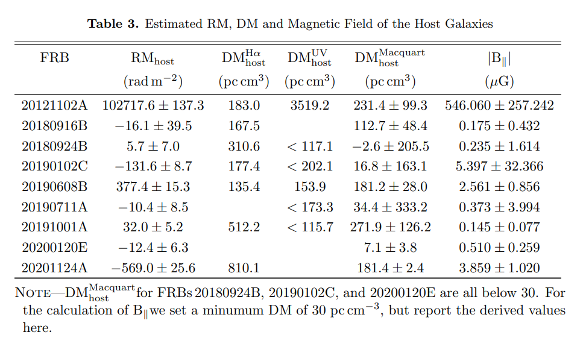
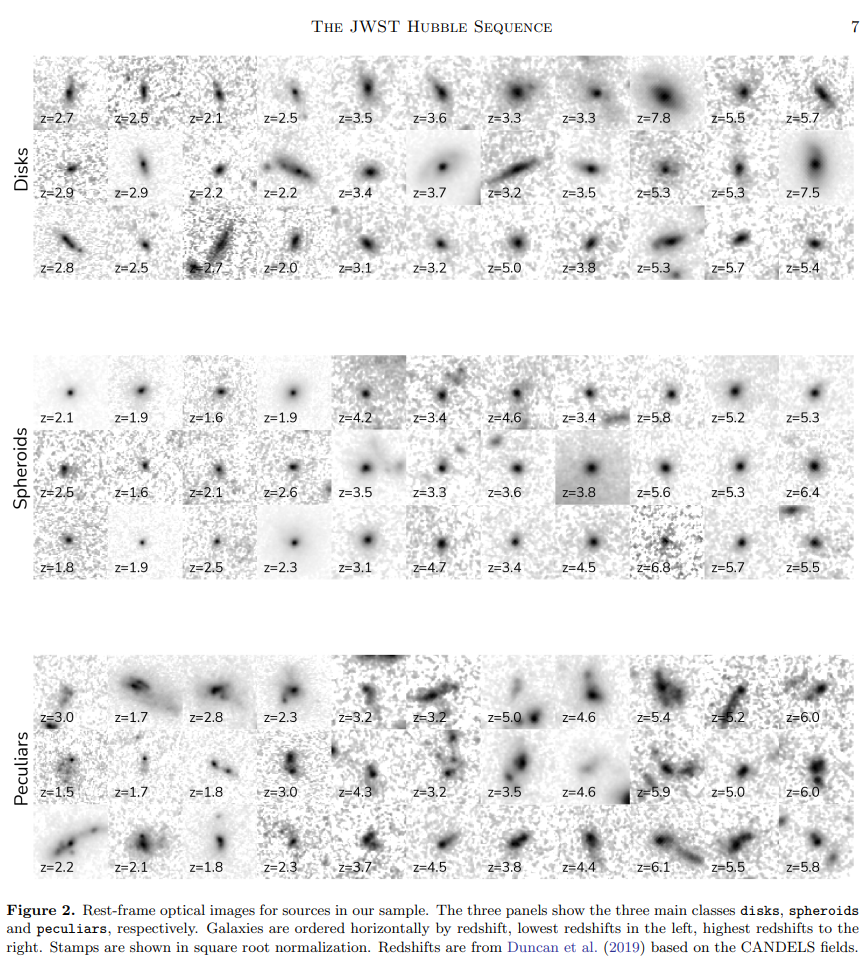
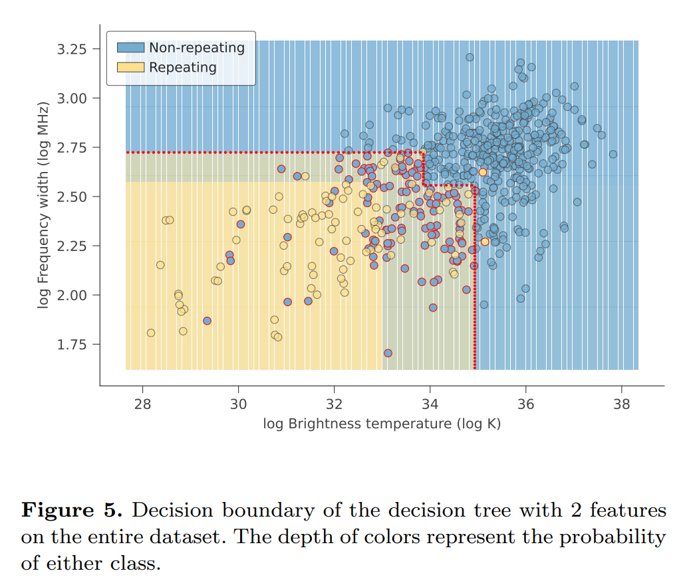

## 2022-10-03

1. [Fast Radio Bursts as Probes of Magnetic Fields in Galaxies at z < 0.5](https://arxiv.org/abs/2209.15113)

   > Fast Radio Burst, Polarization, Galaxy, Magnetic Field

   FRB的RM和`红移`没有相关性，以及RM与`宿主星系DM和`宿主星系归一化的`星系中心偏移`有强相关，表明其RM主要由宿主星系贡献。

   从九个已经良好定位在$z<0.5$的宿主星系中的FRB的RM，推导宿主星系的磁场强度。其中值只有$0.5\mu G$，比太阳系周围磁场$6\mu G$要弱，但与`star-forming, disk`星系的$2-10\mu G$下限相对一致。

   

## 2022-10-04

1. [A broad survey of spectro-temporal properties from FRB20121102A](https://arxiv.org/abs/2210.00106)

   > Fast Radio Burst, Spectrum, Morphology

   分析FRB121102的167个爆发的频谱形态，这些爆发频率在$1-7.5GHz$，持续时间$<1-10ms$。发现`sub-burst slope`和`frequency drift rate`，与持续时间成反比（与`triggered relativistic dynamical, TRDM`模型预测一致），与频率二次方成正比，持续时间随频率增加而减少。另外，`sub-burst`的持续时间与带宽有统计相关性。这个167个爆发的样本没有发现离群的，说明其形态有一致的关系。搞了个分析频谱形态的工具，叫[FRBGui](https://github.com/mef51/frbgui)。

2. [The JWST Hubble Sequence: The Rest-Frame Optical Evolution of Galaxy Structure at 1.5<z<8](https://arxiv.org/abs/2210.01110)

   > Galaxy, Morphology, JWST

   对JWST观测到的$1.5<z<8$的4256个星系进行的形态上的视觉分类，分为`disk`/`spheroid`/`peculiar`三类，据此研究从宇宙的第一个亿年依赖，这些形态的相对数量是如何演变的。另外还用[Morfometryka](http://www.ferrari.pro.br/home/research/morfometryka/)做了星系结构和形态的定量测量。

   结果表明，$z>3$的星系不像以前认为的那样由不规则和奇异结构主导。在$z\sim6$时，恒星质量和恒星形成率密度都由盘状星系主导，表明宇宙中的大多数恒星可能是在盘状星系中形成的。他们的视觉分类结果将发布在[这里](https://github.com/astroferreira/CEERS_JUNE_VISUAL_CLASSIFICATIONS)。

   

## 2022-10-05

1. [Panoramic SETI: Program Update and High-Energy Astrophysics Applications](https://arxiv.org/abs/2210.01356)

   > Instrument, Time Domain, Telescope

   `PANOSETI`是用几台家用望远镜`0.46-m f/1.32 Fresnel-lens `，加上16块$8\times8$的光子计数器`Hamamatsu S13361- 3050AE-08`组成，用于在$2500\ \rm deg^2$的天区内，搜索纳秒到秒量级的光学瞬变信号。

   在过去一段时间里，`PANOSETI`在对Crab Nebula的观测中探测到三次能量在$15-50TeV$之间的伽马射线。宇宙线打到大气中产生的次级光学辐射，也即`Cherenkov radiation`效应，当介质中运动的电荷速度超过该介质中光速时发出的一种以短波长为主的电磁辐射，其特征是蓝色辉光。

2. [Machine Learning based search for Cataclysmic Variables within Gaia Science Alerts](https://arxiv.org/abs/2210.01431)

   > Machine Learning, Random Forest, Gaia

   从`Gaia Science Alerts program, GSA`中使用机器学习识别暂现源。用随机森林模型从Gaia的超新星、活动星系核、初期恒星体的光变曲线数据中分辨灾变变星。在`GSA`的13280个没有指定类别的天体中，文章中的模型分辨出了2800个暂现源的类别。

## 2022-10-06

1. [CASA, the Common Astronomy Software Applications for Radio Astronomy](https://arxiv.org/abs/2210.02276)

   > VLBI, CASA, Software

   [CASA](https://casa.nrao.edu/)是ALMA和VLA的主要数据处理软件，可以处理`单碟`、`孔径合成`和`甚长基线干涉测量`望远镜的数据，核心功能是支持`ALMA`、`VLA`、`VLASS`和`Nobeyama 45m`望远镜的校准和成像。

2. [Immediate origin of the Moon as a post-impact satellite](https://arxiv.org/abs/2210.01814)

   > Lunar, Earth, Planetary Science

   一般认为月球是撞击地球碎片凝聚而成，但是这样的模型很难解释地球和月球岩石相似的同位素组成。这里做了高分辨率的模拟，发现撞击可以立即将质量与成分与月球相似的卫星放入远超地球洛希极限的轨道。

   <video src="Figures/Immediate origin of the Moon as a post-impact satellite - partial disruption-AQmeomxvokM.mp4"></video>

3. [FRB−SRB−XRB: Geometric and Relativistic Beaming Constraints of Fast Radio Bursts from the Galactic Magnetar SGR J1935+2154](https://arxiv.org/abs/2210.01904)

   > Fast Radio Burst, Theory

   探测到`FRB 200428`与`SGR 1935`的一次X射线暴同时出现，表明磁星可以产生FRB。目前已经从`SGR 1935`探测到许多XRB，但是没有FRB，另外检测到一些弱射电暴，可能是慢速射电暴`SRB`。这里考虑两种情况讨论FRB的几何和相对论`beaming factor`。 

   如果FRB/SRB都与XRB相关，为了保证FRB的稀缺性，FRB必须是几何上的狭窄，下限是$\theta_j\Gamma>3$，如果与FRB关联的XRB是独一无二的，那么beaming factor会是最大值$\pi/2\ \rm rad$。

   如果FRB/SRB不要求与XRB相关，使用`FRB−SRB closure relations`确定FRB的beaming factor是$\theta_j\Gamma\le3$。

4. [Scattering variability detected from the circumsource medium of FRB 20190520B](https://arxiv.org/abs/2210.01975)

   > Fast Radio Burst, Scattering

   散射测量可以确定FRB宿主星系内等离子体结构，探测银河系和银河系湍流，并限制了FRB的红移。散射也抑制了FRB的探测，并使探测到的FBR群体出现偏差。

   这里对FRB 190520的散射时间做测量，可以在几分钟到几天的时间内变化两倍以上。典型案例中，散射时间在1.45GHz的2.9分钟内从$7.9ms$变到$<3.1ms$。另外，散射时间与DM和RM测量无关。

   散射变化可归因于介质中动态的、不均匀的等离子体，在Crab Pulsar中也观察到类似的变化。

## 2022-10-07

1. [Machine learning classification of fast radio bursts: I. supervised methods](https://arxiv.org/abs/2210.02463)

   > Fast Radio Burst, Machine Learning, Classification

   用CHIME的目录训练多种监督学习模型，发现重复和非重复FRB可以被良好分类，并且影响最大的因素是`亮温度`和`rest-frame frequency bandwidth`。
   $$
   T_B=\frac{S_\nu D_A^2}{2\pi k_B(\nu\Delta t)^2}(1+z)^3\\=1.1\times10^{35}K\left(\frac{S_\nu}{\rm Jy}\right)\left(\frac{\nu}{\rm GHz}\right)^{-2}\left(\frac{\Delta t}{\rm ms}\right)\left(\frac{D_L}{\rm Gpc}\right)\frac{1}{1+z}
   $$
   

2. [Machine Learning Classification of Fast Radio Bursts: II. Unsupervised Methods](https://arxiv.org/abs/2210.02471)

   > Fast Radio Burst, Machine Learning, Classification

   类似上一篇，用无监督学习模型。

## 2022-10-10

