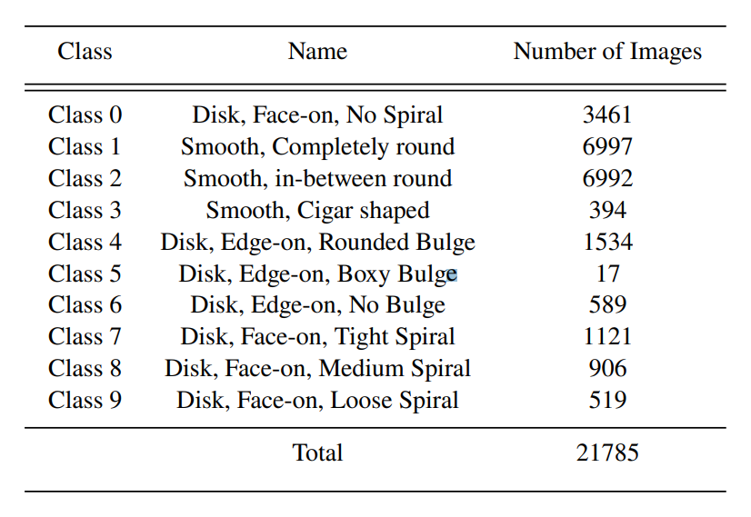
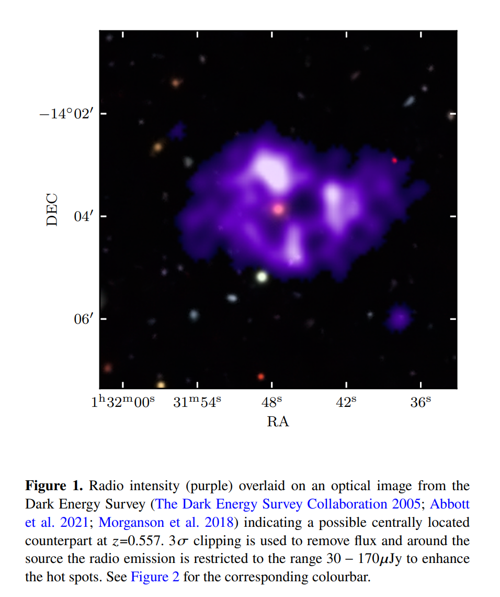
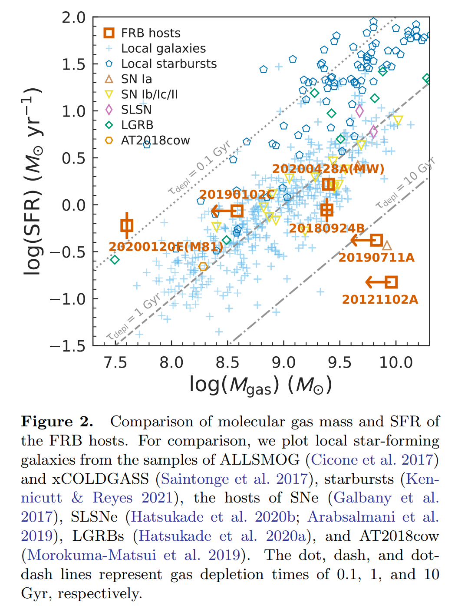
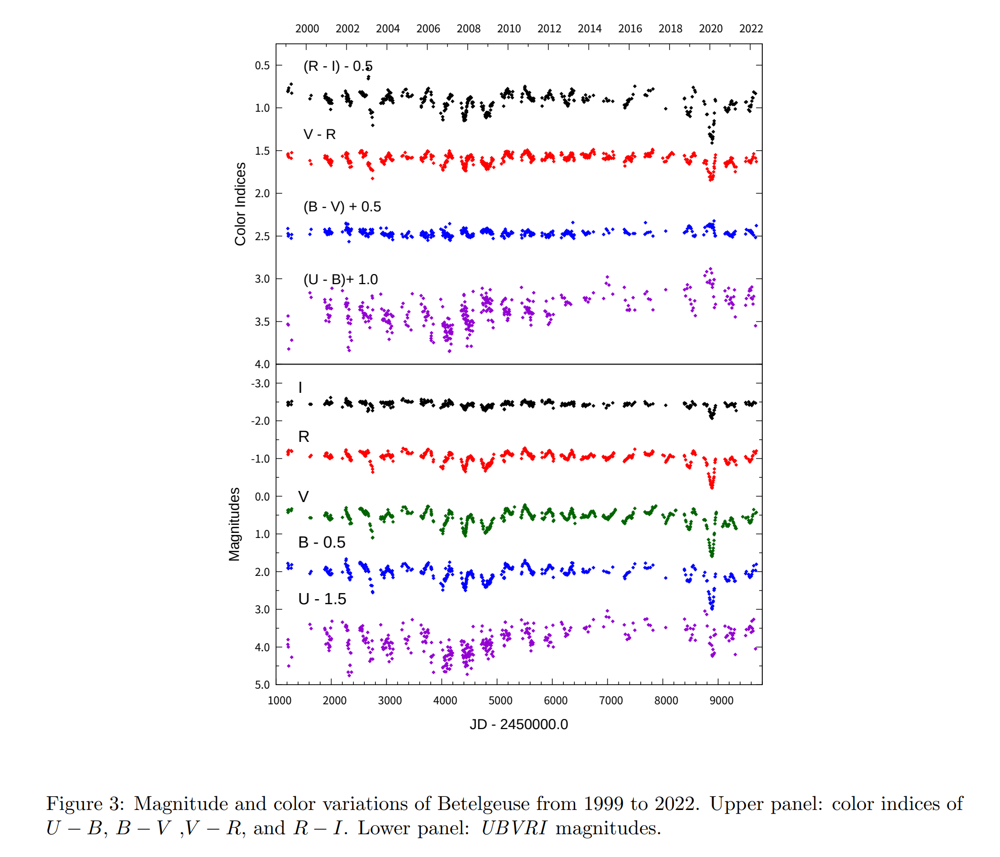
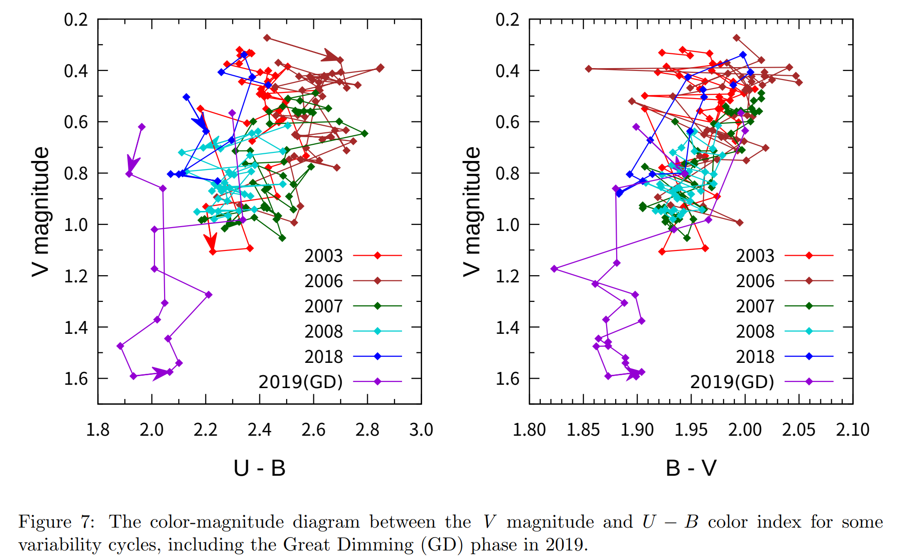
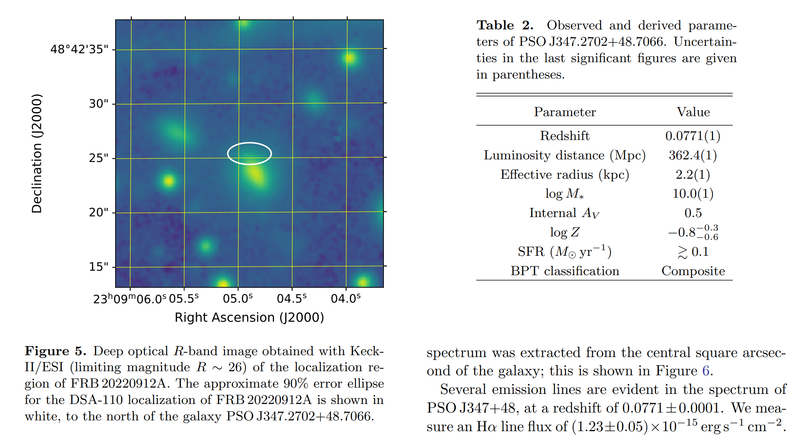
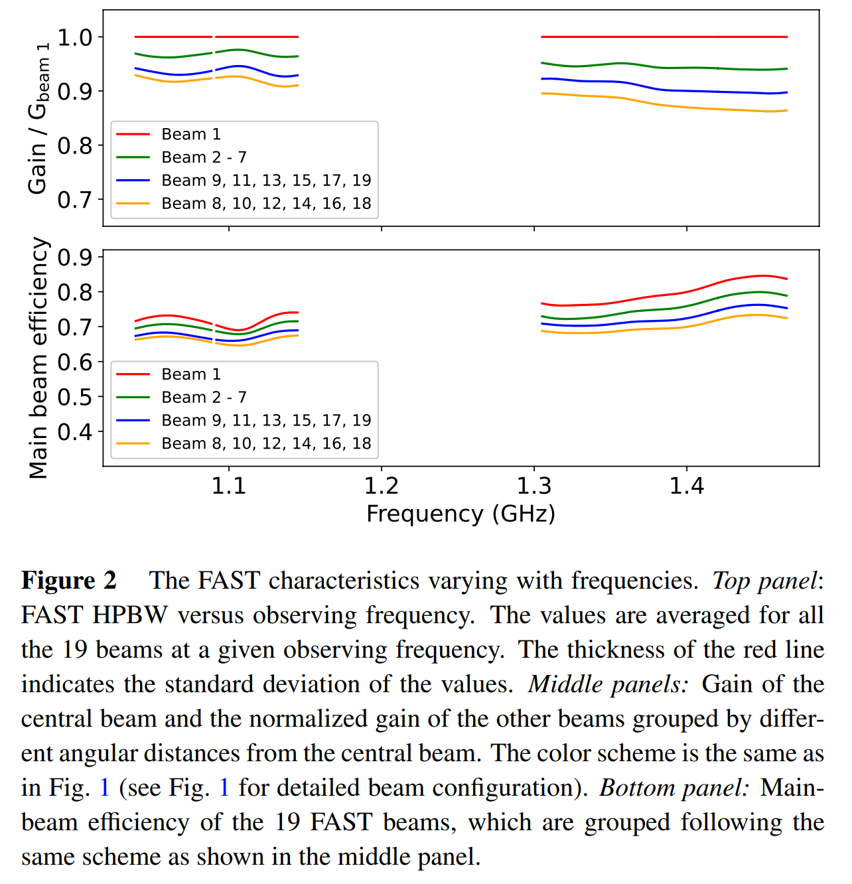

## 2022-11-01

1. [Learning to Detect Interesting Anomalies](https://arxiv.org/abs/2210.16334)

   > Machine Learning, Anomaly Detection

   `AHUNT`算法，结合深度学习和主动学习做的异常检测，在其中的主动学习过程中，迭代给选择的少量数据打上标签。

## 2022-11-02

1. [Galaxy classification: a deep learning approach for classifying Sloan Digital Sky Survey images](https://arxiv.org/abs/2211.00397)

   > Galaxy, Machine Learning, Classification

   2007年的时候，`Galaxy Zoo`，一个基于志愿者的科学项目为星系分类提供了大量的帮助。现在这里用简单的CNN做SDSS星系分类，不同于以往分类方式，这里将星系分成10类。

   

## 2022-11-03

1. [Gaia Data Release 3. The first Gaia catalogue of eclipsing binary candidates](https://arxiv.org/abs/2211.00929)

   > Gaia DR3, Binary, Variable, Catalogue

   GaiaDR3食变双星目录。

## 2022-11-04

1. [The Fifth Catalogue of Nearby Stars (CNS5)](https://arxiv.org/abs/2211.01449)

   > Gaia, Stellar, Catalogue

   使用Gaia EDR3和Hipparcos的天体测量数据，给出太阳周围25pc的所有5230颗恒星和701颗褐矮星的[目录](https://dc.g-vo.org/CNS5)。

## 2022-11-07

1. [A unique, ring-like radio source with quadrilateral structure detected with machine learning](https://arxiv.org/abs/2211.02062)

   > Galaxy, Radio, Machine Learning

   [Astronomaly](https://astronomaly.readthedocs.io/en/latest/index.html)是一个`Active Anomaly Detection`方法，这里用在MeerKAT上，找到了一个奇怪四边形结构的源，但不清楚如何形成，距离也无法确定。

   

2. [Diverse Properties of Molecular Gas in the Host Galaxies of Fast Radio Bursts](https://arxiv.org/abs/2211.02279)

   > Fast Radio Burst, Star Formation, Galaxy

   用ALMA看几个FRB的宿主星系的气体。

   

## 2022-11-08

1. [A giant glitch from the magnetar SGR J1935+2154 before FRB 200428](https://arxiv.org/abs/2211.03246)

   > Fast Radio Burst, Magnetar, Glitch

   FRB 200428爆发前3.1天，SGR1935发生过一次`glitch`，这次的`spin-down power change rate`$\Delta\dot\nu/\dot\nu$是所有脉冲星中最大的一个。`glitch`和`FRB`时间上的重合表明两者之间存在物理联系，磁星内部出发的`glitch`可能改变了磁层结构，有利于产生FRB，随后通过阿尔芬波的激发和传播，触发了许多X射线爆发，最终触发FRB。

## 2022-11-09

1. [Finding the missing baryons in the intergalactic medium with localized fast radio bursts](https://arxiv.org/abs/2211.04058)

   > Fast Radio Burst, Cosmology

   用$DM_{IGM}$的公式拟合$\Omega_b$，重子物质密度。

## 2022-11-10

1. [Deblending Galaxies with Generative Adversarial Networks](https://arxiv.org/abs/2211.04488)

   > Galaxy, Machine Learning, GAN

   以噪声向量通过GAN生成HST分辨率的星系图像，训练数据集是`CANDELS`。还有把HST降低分辨率到Subaru再用超分辨率GAN训练。

2. [UBVRI photometry of Betelgeuse over 23 years since 1999](https://arxiv.org/abs/2211.04512)

   > Stellar, Photometry, Light Curve

   对`参宿四`在过去23年的UBVRI的光变观测，使用`photodiode`避免饱和并且包含了CCD不会有的U波段光度测量。发现了405天和2160天的周期。另外，`参宿四`在2019年底的`Great Dimming`事件中，U-B色指数表现出奇特变化。

   

   

3. [On the injection scale of the turbulence in the partially ionized very local interstellar medium](https://arxiv.org/abs/2211.04496)

   > Turbulence, ISM

   关于`部分电离的极局域星际介质`中湍流的能量注入尺度的讨论，最大的可能注入尺度是$194AU$。

## 2022-11-11

1. [The Star Formation Rate of the Milky Way as seen by Herschel](https://arxiv.org/abs/2211.05573)

   > Galaxy, Star Formation

   基于`Hi-GAL`巡天估计MW的恒星形成率为$2.0\pm0.7\,M_\odot/yr$，其中$1.7\pm0.6\,M_\odot/yr$来自有可靠日心距的`clump`。$R_{gal}>3\,kpc$的位置，SFR似乎与密度有幂律关系，类似KS关系。另外，发现SFR和星团演化阶段没有明显的相关性。

## 2022-11-14

1. [The discovery and scientific potential of fast radio bursts](https://arxiv.org/abs/2211.06048)

   > Fast Radio Burst, Review

   `Matthew Bailes`写的FRB的综述。FRB的发现带来了两个科学问题，是什么产生了FRB以及FRB能告诉我们关于宇宙的什么信息。综述回顾了FRB的发现历史。几条认知

   - FRB典型能量 - $10^{38-40}$，相当于太阳一天到一个月的射电能量
   - 因果关系限制发射FRB的区域 - $d<cdt\sim c\times1ms\sim300km$
   - 向下频率漂移在FRB发现之前就被预测是磁星发射的行为
   - FRB在椭圆星系中少见，非重复暴在恒星形成率高的星系中不常见
   - FRB的色散用于测量哈勃常数和重子质量
   - 未来展望主要与未来十年上线的新设备相关，`MeerTRAP`、`ASKAP-CRACO`、`DAS-100`、`CHIME-CHORD`，都与FRB定位有关

## 2022-11-15

1. [Rotation curve decompositions with Gaussian Processes: taking into account data correlations leads to unbiased results](https://arxiv.org/abs/2211.06460)

   > Galaxy, Gaussian Process

   盘状星系旋转曲线的速度测量值有相关性，在拟合动力学模型时往往会忽略这一点。这里用高斯过程拟合，分解数据相关性
   $$
   K_{ij}=A_k\exp\left[-\frac12\left(\frac{|R_i-R_j|}{s_k}\right)^2\right]\\
   \log \mathcal{L}(\theta_V,\theta_k)=-\frac12\mathbf{V}^T_{res}K^{-1}\mathbf{V}_{res}-\frac12\log|K|
   $$
   

   其中$V_{res,i}=V_{rot,i}-V_{model}(R_i|\theta_V)$。这对于获得星系中发光和暗物质分布的无偏估计非常重要。

   代码在[这里](https://github.com/lposti/MLPages/blob/master/_notebooks/2022-11-02-gp_rotcurves.ipynb)，是很好的GP拟合的例子。

2. [EOS Manual](https://arxiv.org/abs/2211.06518)

   > Exoplanet, Theory

   状态方程`EOF`转换为系外行星的质量半径关系的详细步骤，类似教科书。

## 2022-11-16

1. [Hybrid Pulsar-Magnetar Model for FRB 20191221A](https://arxiv.org/abs/2211.07669)

   > Fast Radio Burst, Periodicity, Theory

   FRB20191221A的216ms的周期以及2%的占空比，表明观察到的活动是类似脉冲星的旋转光束模型，区别是脉冲星将旋转动能转换为电磁波，FRB将磁能转换为辐射。

## 2022-11-17

1. [Deep Synoptic Array science I: discovery of the host galaxy of FRB 20220912A](https://arxiv.org/abs/2211.09049)

   > Fast Radio Burst, Galaxy, Localization

   DSA对`FRB 20220912A`的定位，`Ra=23:09:04.9, Dec=+48:42:25.4`，误差分别是2s和1s。红移0.0771，与`PSO J347.2702+48.7066`星系重合。星系恒星形成率$0.1\,M_\odot/yr$，对色散贡献小于$50\,pc/cm^3$。

   

## 2022-11-18

1. [Estimation of Solar Observations with the Five-hundred-meter Aperture Spherical Radio Telescope (FAST)](https://arxiv.org/abs/2211.09349)

   > Solar, Radio, FAST

   估算FAST观测太阳的可能性。无论用FAST观测的是宁静太阳还是太阳射电暴，FAST接收的总功率都超过了安全操作范围，会导致接收机损坏。在1.25GHz时，太阳应与主波束保持$2^\circ$的距离，低频距离应该更远，200MHz时最好是$5^\circ$。

2. [Photometric redshift estimation of galaxies in the DESI Legacy Imaging Surveys](https://arxiv.org/abs/2211.09492)

   > Galaxy, Redshift, Machine Learning

   比较`CATBOOST`、`多层感知器`、`随机森林`在DESI上估计测光红移的性能，结果时`CATBOOST`性能最好。

## 2022-11-21

1. [Recovery of Phosphine in Venus' Atmosphere from SOFIA Observations](https://arxiv.org/abs/2211.09852)

   > Planetary Science, Venus

   金星大气中有没有$PH_3$经历过很长时间的讨论。`Cordiner et al. 2022`分析`SOFIA`获得的光谱，推断$PH_3<0.8ppb$。这篇文章重新分析`SOFIA`的数据，检测到$6.5\sigma$的`1ppb`的$PH_3$。

## 2022-11-22

1. [Exhaustive Symbolic Regression](https://arxiv.org/abs/2211.11461)

   > Symbolic Regression

   传统符号回归有两个基本问题。由于方程数量随复杂度指数增加，SR随机搜索不一定能找到最佳函数，并且SR一般的目标问题都足够简单。这里提出一种新的方法，[穷举符号回归](https://github.com/DeaglanBartlett/ESR)，系统地考虑所有可能的方程，保证找到真正的最优解，还根据最小描述长度将函数排序。

2. [Peering into the Milky Way by FAST: I. Exquisite HI structures in the inner Galactic disk from the piggyback line observations of the FAST GPPS survey](https://arxiv.org/abs/2211.11299)

   > FAST, HI, Milky Way

   老韩他们GPPS项目的HI成图。有一条新认知，在定标流程中，根据噪声管定出天线温度后，还根据测量定标源的数据，定出主波束效率，将天线温度转换为亮温度。

   

## 2022-11-23

1. [A targeted search for repeating fast radio bursts with the MWA](https://arxiv.org/abs/2211.11945)

   > Fast Radio Burst

   在MWA数据中搜索五个重复FRB的信号，没有检测到超过$6\sigma$的信号。对于FRB20190711A和FRB20201124A的观测，限制光谱指数$>-1$，如果是自由吸收导致没有探测，可以用电子温度来限制吸收介质的大小分别是$0.92\times(T/10^4K)^{-1.35}\rm pc$、$[0.22-2.50]\times(T/10^4K)^{-1.35}\rm pc$。但更可能的情况是FRB在观测期间不活跃。

2. [Image plane detection of FRB121102 with the MeerKAT radio telescope](https://arxiv.org/abs/2211.12257)

   > Fast Radio Burst

   MeerKAT对FRB121102在2019年9月的干涉观测。在1.48GHz的2s的图像中，找到6个爆发（高时间分辨率观测找到11个），定位加权的平均精度为1角秒。

## 2022-11-24

1. [PDFchem: A new fast method to determine ISM properties and infer environmental parameters using probability distributions](https://arxiv.org/abs/2211.12974)

   > ISM, Software

   [PDFchem](https://github.com/tbisbas/PDFchem)用消光$A_V$和数密度$n_H$做为输入，计算各种分子（HI、H2、CII、CI、CO、OH、OH+、H2O+、CH、HCO+）的平均风度。

## 2022-11-25

感恩节停更。

## 2022-11-28

1. [Detection of a bright burst from the repeating FRB 20201124A at 2 GHz](https://arxiv.org/abs/2211.13835)

   > Fast Radio Burst

   日本JAXA的64m望远镜在22年2月，FRB20201124A活跃时期探测到2GHz的爆发，$>189\,\rm Jy\cdot ms$的流量是来自这个源能量最高的爆发。

## 2022-11-29

1. [Gas kinematics around filamentary structures in the Orion B cloud](https://arxiv.org/abs/2211.14350)

   > ISM, Kinematics, Velocity Structure

   `IRAM 30-m`望远镜对`OrionB`的$C^{18}O_{1-0}$和$^{13}CO_{1-0}$的观测。根据不同的速度，将云分成三层，并提取其中`filament`，从中可以提取`filament`周围运动的两种模式，垂直`filament`（质量的流入或流出）以及沿着`filament`。`OrionB`中只有前者，认为是恒星形成反馈的影响。

2. [A Bayesian approach to RFI mitigation](https://arxiv.org/abs/2211.15448)

   > RFI mitigation

   假设RFI进入数据后破坏了数据点的平滑，导致这个数据点不再是高斯噪声中的点。用贝叶斯来拟合高斯噪声，从而挑选出RFI。例子代码在[这里](https://github.com/samleeney/Publications)。

## 2022-11-30

1. [Identifying the physical origin of gamma-ray bursts with supervised machine learning](https://arxiv.org/abs/2211.16451)

   > GRB, Machine Learning, XGBoost

   `XGBoost`分类GRB。

