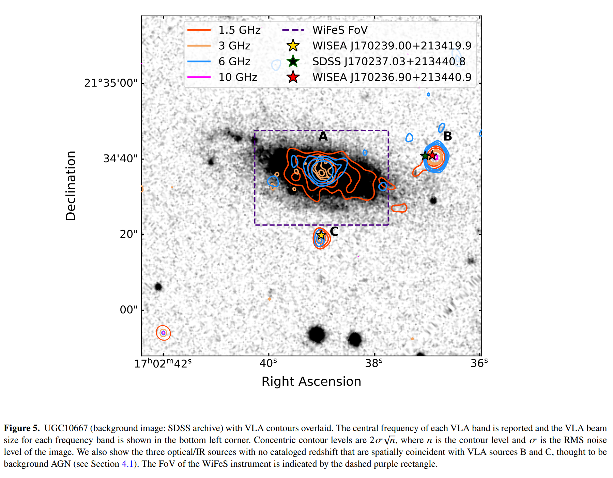
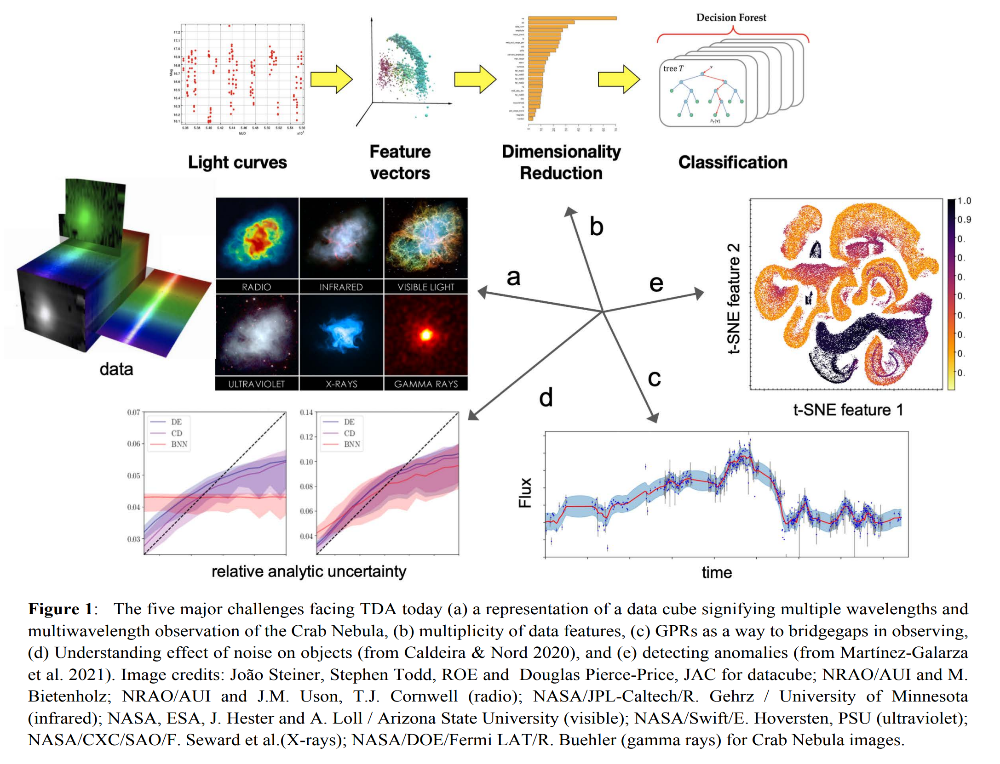
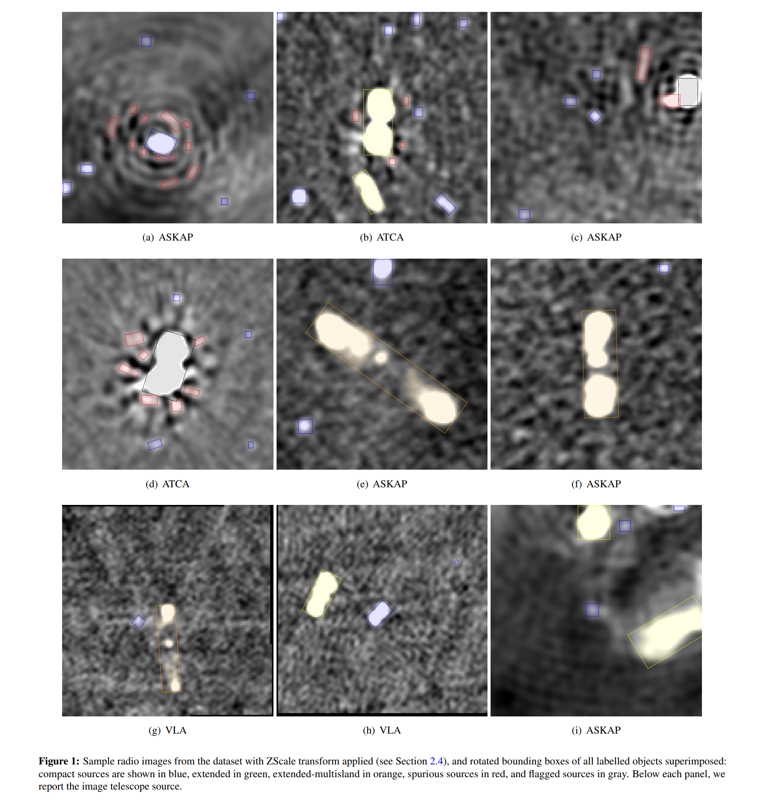
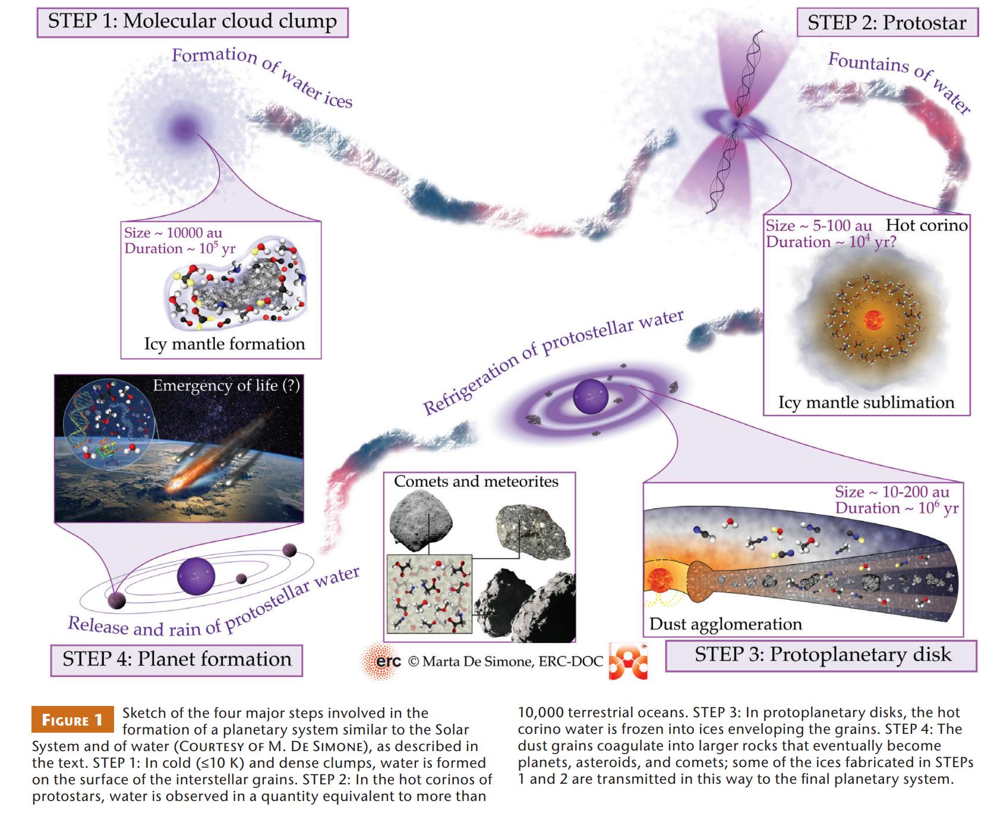
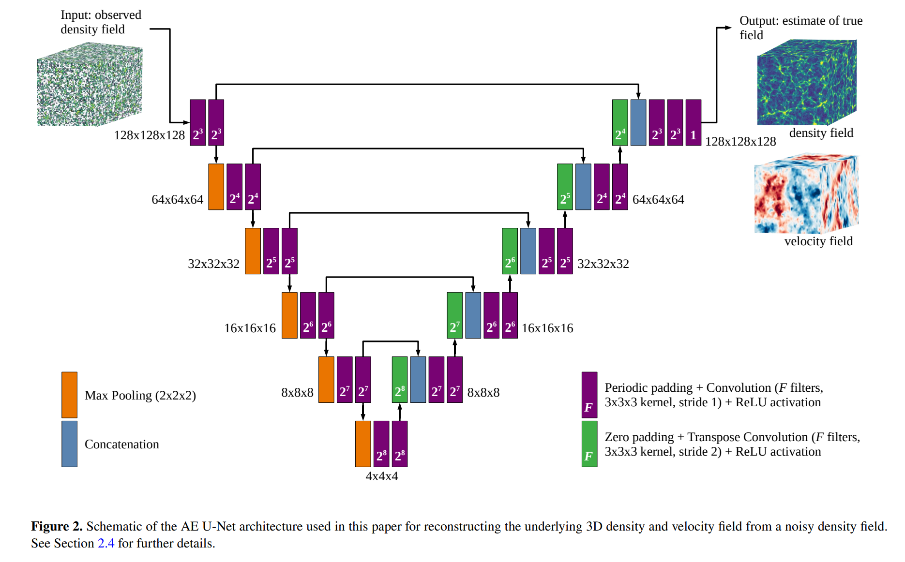
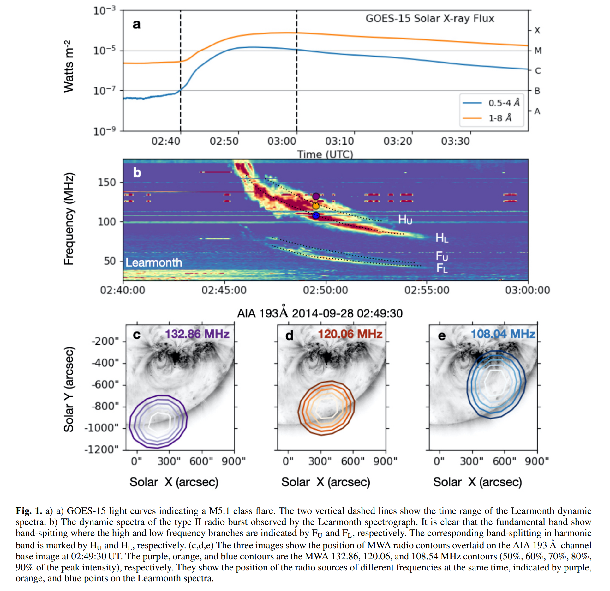
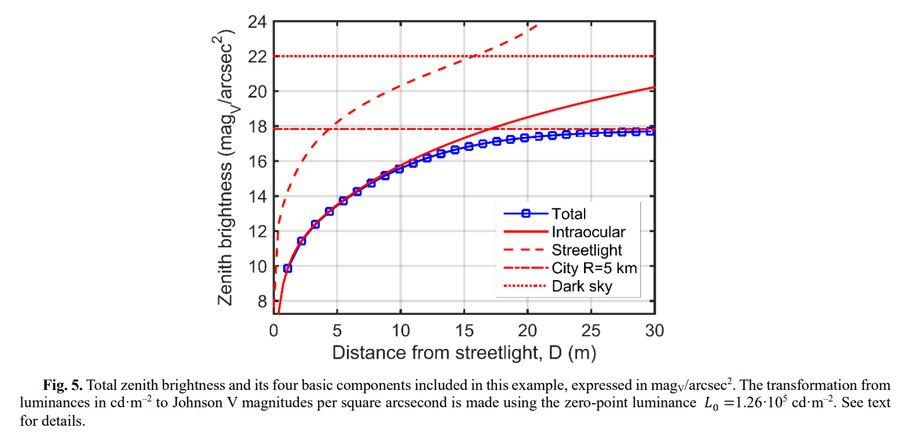
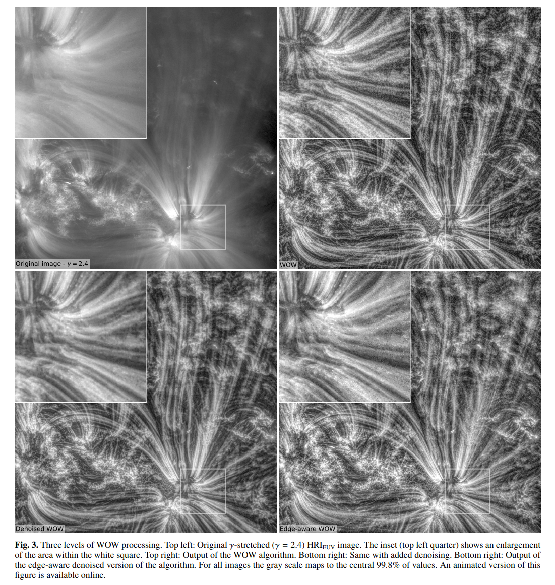
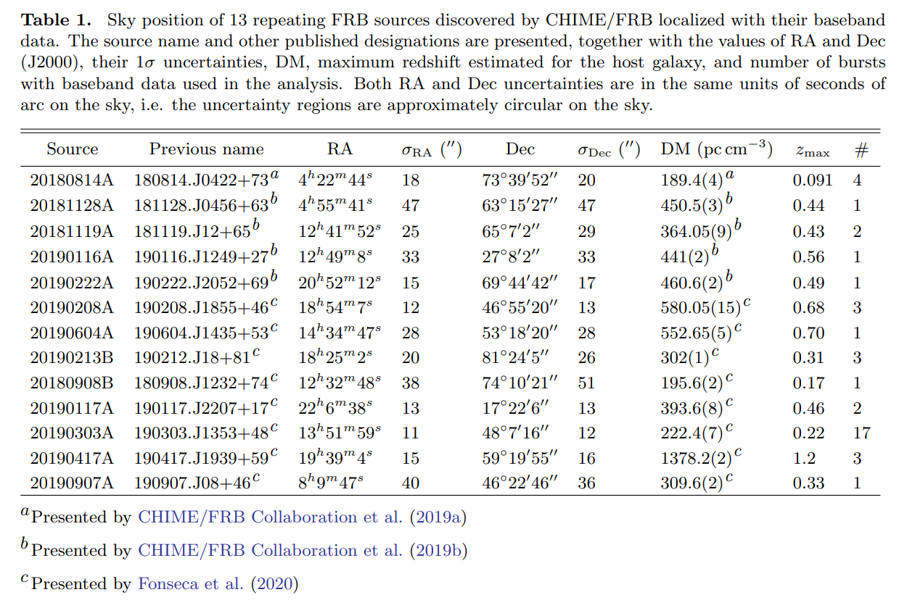
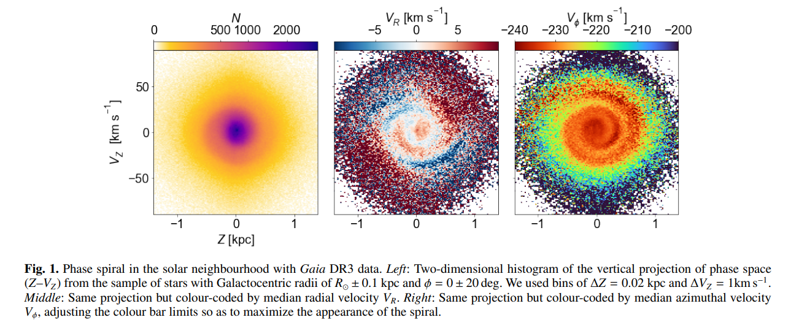

## 2022-12-01

1. [A non-repeating fast radio burst in a dwarf host galaxy](https://arxiv.org/abs/2211.16790)

   > Fast Radio Burst

   `ASKAP`探测到`FRB20210117A`，中心频率1271.5MHz，DM=728.95，RM=43，宿主星系z=0.214，没有PRS，矮星系没有恒星形成（与121102和190520不同），宿主星系有额外的DM贡献，没有圆偏振。

## 2022-12-02

1. [Repeating periodic eruptions of the supernova impostor SN 2000ch](https://arxiv.org/abs/2212.00113)

   > Stellar, Supernovae, Recurrent Novae

   `SN 2000ch`是`NGC 3432`中被错认为是超新星的天体，从2000年被发现以来，有过14次以上的爆发，爆发的光变曲线是不规则和多峰的。2010年之后的爆发有周期为198.4d，2010年之前似乎要短几天。文章认为，这种周期性的爆发来自于偏心双星系统的剧烈相互作用。

2. [An assessment of the Association Between a Fast Radio Burst and Binary Neutron Star Merger](https://arxiv.org/abs/2212.00201)

   > Fast Radio Burst, Stellar, Neutron Star, Gravitational Wave

   `LIGO-Virgo`检测到的唯一双中子星并和事件`GW190425`与CHIME探测到的`FRB20190425A`之间可能有联系。FRB发生在GW后2.5小时，DM与GW参数推断的距离一致。这种潜在的联系与以下理论一致：双中子星并和留下一个超大质量高度磁化的致密天体，该天体在失去角动量后因旋转而坍缩成黑洞，通过抛射磁层产生FRB。

## 2022-12-05

1. [The most probable host of CHIME FRB 190425A, associated with binary neutron star merger GW190425, and a late-time transient search](https://arxiv.org/abs/2212.00954)

   > Fast Radio Burst, Gravitational Wave

   跟上一篇是同一个FRB，不过做的是这个FRB的宿主星系。红移约0.03。

   

## 2022-12-06

1. [Applications of AI in Astronomy](https://arxiv.org/abs/2212.01493)

   > Machine Learning, Review

   说是人工智能在天文中的应用，实际没多少内容。

   

2. [The Mysterious Radcliffe Wave](https://arxiv.org/abs/2212.01856)

   > Stellar, Star Formation, Radcliffe Wave

   `Radcliffe Wave`是银河系中的一条分子云链，与银河系旋转轴夹角30度，描述了分子云的子u你垂直震荡阻尼振荡。期存在已经在多种天体辐射的垂直分布中得到了证实，包括

   - 星际尘埃、`maser`与`radio`恒星、低质量`T Tau`恒星、`OB`恒星、年轻的开放星团、年轻恒星垂直速度。在这篇文章中能找到对应的图。

   `Radcliffe Wave`的性质完全不清楚，大多数研究人员将其与外部引力对星系盘的影响联系起来。

   `Radcliffe Wave`的图是在`heliocentric`坐标系中，将$y'=y\cos30^\circ+x\sin30^\circ$变换画出来的，$y$基本上是距离的维度。用`quadratic`方程拟合：
   $$
   \Delta z(t)=A\times\left[-\delta d^2(t)\right]\times\sin\left[\left(\frac{2\pi d(t)}{P}\right)\left(1+\frac{d(t)/d_{max}}{\gamma}\right)+\phi\right]
   $$
   其中$d(t)=\|(x,y,z)(t)-(x_0,y_0,z_0)\|$是某个特定的分子云与波起始位置的距离，$d_{max}$是与波结束的位置，P是波的周期，$\phi$是波的相位，$\delta$是振幅的衰减率，$\gamma$是周期里衰减率的指标。

## 2022-12-07

1. [Astronomical source detection in radio continuum maps with deep neural networks](https://arxiv.org/abs/2212.02538)

   > Radio, Machine Learning, Deep Learning, Continuum

   基于[Mask-RCNN](https://github.com/matterport/Mask_RCNN)的SKA射电连续谱源的目标识别[caesar-rest](https://github.com/SKA-INAF/caesar-rest)。另外有一个模型可以关注[Rotated Mask-RCNN](https://github.com/mrlooi/rotated_maskrcnn)。

   

## 2022-12-08

1. [Primordial black holes generated by the non-minimal spectator field](https://arxiv.org/abs/2212.03577)

   > Cosmology

   孟德双的文章，由非最小旁观者场产生的原初黑洞。

## 2022-12-09

1. [A Novel JupyterLab User Experience for Interactive Data Visualization](https://arxiv.org/abs/2212.03907)

   > Software

   用`JupyterLab`做交互式数据可视化。用[pywwt](https://pywwt.readthedocs.io/en/stable/)做例子，是一个接入`AAS WorldWide`的工具。

2. [The molecular gas kinematics in the host galaxy of non-repeating FRB 180924B](https://arxiv.org/abs/2212.04027)

   > Fast Radio Burst, Galaxy, Molecular Gas

   ALMA对非重复暴`FRB 180924B`的`CO 3-2`的观测，速度显示出不对称的轮廓，有两个成分，一个$-155.40\,\rm km/s$，一个是$-7.76\,\rm km/s$，后者在FRB位置附近。表明星系分子气体的动力学结构受到干扰，说明FRB通常出现在受干扰地动力学系统中，表明气体运动学和FRB之间可能存在联系。

3. [The Physics of Fast Radio Bursts](https://arxiv.org/abs/2212.03972)

   > Fast Radio Burst, Theory, Review

   张冰老师写在《Review of Modern Physics》上的关于FRB的综述，包括观测数据的总结，基本的等离子体物理学，数据对FRB模型的约束，辐射机制、源和环境模型、传播效应，以及FRB作为宇宙学探针。还讨论了目前紧迫的问题和未来的前景。

## 2022-12-12

1. [Modelling Annual Scintillation Velocity Variations of FRB 20201124A](https://arxiv.org/abs/2212.04839)

   > Fast Radio Burst, Scintillation

   FRB通过不均匀等离子体传播产生闪烁，编码了源、散射物质和地球的相对距离和速度。这里对`FRB20201124A`的爆发光谱进行测量，观察到闪烁速度的年度变化，暗示闪烁屏在银河系内，估计距地球$0.24\pm0.04\,\rm pc$，可能与`Local Bubble`或者`Orion-Eridanus Superbubble`有关。

## 2022-12-13

1. [A Comprehensive Analysis on Repeating Fast Radio Bursts](https://arxiv.org/abs/2212.05242)

   > Fast Radio Burst, Statistics

   关于重复FRB的统计，写的怎么样先不说，长是真的长。挑出有至少5个爆发的重复FRB，统计到达时间、宽度、DM、RM、带宽、等待时间、流量、能量的分布和随时间的变化，以及这些量之间的相互关联。发现DM和SFR线性相关（但也没那么相关）。没有新结论，背景介绍可以参考。

2. [Power-law distribution and scale-invariant structure from the first CHIME/FRB Fast Radio Burst catalog](https://arxiv.org/abs/2212.05229)

   > Fast Radio Burst, Statistics

   拟合CHIME样本的能量分布，没用的文章。可以看其中关于SOC的内容，看看这个`q-Gaussian`是怎么拟合的。

3. [Circular Polarization in two Active Repeating Fast Radio Bursts](https://arxiv.org/abs/2212.05873)

   > Fast Radio Burst, Circular Polarization

   冯毅的文章，FAST探测到FRB121102和FRB190520的圆偏振。

4. [We Drink Good 4.5-Billion-Year-Old Water](https://arxiv.org/abs/2212.05441)

   > Planetary Science, Earth, Solar System

   水最初是在尘埃表面通过`hydrogenation of frozen oxygen`合成的，然后在行星系统形成的各个阶段，水进入了升华/冷冻的循环，最终被纳入行星、小行星和彗星。在地球和早期形成的行星系统中测到的重水数量表面，地球上有相当一部分的水是从太阳系形成的最初阶段继承下来的，年龄有45亿年。

   

## 2022-12-14

1. [Large-scale density and velocity field reconstructions with neural networks](https://arxiv.org/abs/2212.06439)

   > Machine Learning, Galaxy, Cosmology, Large Scale Structure

   用`AutoEncoder`从离散和不完整的星系分布中重建三位宇宙学密度和速度场。

   

## 2022-12-15

1. [Automatic Classification of Galaxy Morphology: a rotationally invariant supervised machine learning method based on the UML-dataset](https://arxiv.org/abs/2212.06981)

   > Machine Learning

   用`adaptive polar coordinate transformation`处理星系图像，改善星系旋转导致分类失效的问题。简单来说，以一定角度旋转视线，读取视线中图像的数值，极坐标展开。但这样也有问题，同一张图像，起始视线位置不同，展开位置也不同。那就按照最暗点和最亮点之间的连线做起始视线。

## 2022-12-16

1. [Imaging-spectroscopy of a band-split type II solar radio burst with the Murchison Widefield Array](https://arxiv.org/abs/2212.07698)

   > Solar, Flare

   II型太阳射电暴是由太阳爆发性事件，如日冕物质抛射（CMEs），驱动的磁流体力学（MHD）冲击引起的。

   

## 2022-12-19

1. [Data mining techniques on astronomical spectra data. I : Clustering Analysis](https://arxiv.org/abs/2212.08419)

   > Machine Learning, Clustering, Spectrum

   在`LAMOST`和`SDSS`数据上实验多种聚类算法，在[这里](https://github.com/shichenhui/SpectraClustering)给出了代码和使用改进的手册。

## 2022-12-20

1. [Detection of Quasi-Periodic Oscillations in the Blazar S4 0954+658 with TESS](https://arxiv.org/abs/2212.08918)

   > Time Domain, QPO, Blazar

   在耀变体`S4 0954+658`中发现0.6-2.5天的QPO，用Lomb-Scargle和加权小波变换WWZ确认。

2. [Skyglow inside your eyes: intraocular scattering and artificial brightness of the night sky](https://arxiv.org/abs/2212.09103)

   > Light Pollution

   光污染不是视觉天光的唯一机制，人眼内也会有光线散射，并对视网膜检测到的总天空亮度有很大贡献。文章的对这一效应进行量化，表明阻断到达眼睛的直射灯光，可以提升极限星等。

   

## 2022-12-21

1. [A New Period Determination Method for Periodic Variable Stars](https://arxiv.org/abs/2212.10037)

   > Light Curve, Stellar, Periodicity, Machine Learning, Classification

   用`Random Forest`对变星的17个特征进行分类，11个来自光变曲线，6个来自Gaia DR3、ALLWISE和2MASS。

2. [Image enhancement with wavelet-optimized whitening](https://arxiv.org/abs/2212.10134)

   > Solar, Image Enhancement

   用`wavelet-optimized whitening, WOW`来进行图像增强。基本原理是对输入图像的`à trous`小波谱进行`equalization`，规避修改`à trous`变换的边缘，以一直数据不连续产生的不良光晕。

   

## 2022-12-22

1. [Local Group Dwarf Galaxy Detection Limit in the CSST survey](https://arxiv.org/abs/2212.10804)

   > CSST, Galaxy

   CSST探测`Local Group`中矮星系的极限预测。CSST巡天覆盖$17500\,\rm deg^2$的范围，视场$1.1\,\rm deg^2$，点源极限星等$M_g=26.3$，$M_i=25.9$。对于面源矮星系，预计能够在400kpc的位置探测到$M_V=-3.0,\ \mu_{250}=32.0\,\rm mag/arcsec^2$的矮星系，在1-2Mpc的距离范围内能够探测到$M_V=-5.8,\ \mu_{250}=29.7\,\rm mag/arcsec^2$的暗场矮星系。

## 2022-12-23

1. [Sub-arcminute localization of 13 repeating fast radio bursts detected by CHIME/FRB](https://arxiv.org/abs/2212.11941)

   > Fast Radio Burst, Localization, Detection

   CHIME用基带数据干涉做的重复暴定位。宿主星系性质也各不相同，`FRB 20180814A`在$z=0.068$的螺旋星系中，几乎没有恒星形成的迹象，`FRB 20190303A`在$z=0.064$的并合螺旋星系中，有大量的恒星形成。

   

## 2022-12-26

1. [The phase spiral in Gaia DR3](https://arxiv.org/abs/2212.11987)

   > Gaia DR3, Milky Way, KKinematics

   用边缘检测算法从Gaia DR3的数据中找相位螺旋的边界，推测` phase mixing times`。

   

## 2022-12-27

1. [Distribution of fast radio burst dispersion measures in CHIME/FRB Catalog 1: implications on the origin of FRBs](https://arxiv.org/abs/2212.13148)

   > Fast Radio Burst, Statistics

   用`M&E 2018`模型拟合CHIME Catalog 1中FRB的红移，拟合SFR的幂律指数是$0-0.6$，这意味着FRB的红移演化与SFR一致或者比SFR更快。

2. [The Statistical Polarization Properties of Coherent Curvature Radiation by Bunches: Application to Fast Radio Burst Repeaters](https://arxiv.org/abs/2212.13153)

   > Fast Radio Burst, Theory, Circular Polarization

   认为FRB的圆偏振是从`bunches with the line of sight (LOS) deviating from the bunch central trajectories`的曲率辐射中产生的。模拟表明，在`opening angle of the bunch`中流量恒定，而当视线偏离这个角度时，偏离越大，圆偏振越大，流量越低。

## 2022-12-28

圣诞节停更

## 2022-12-29

1. [First statistical measurement of the Hubble constant using unlocalized fast radio bursts](https://arxiv.org/abs/2212.13433)

   > Fast Radio Burst, Cosmology, Hubble constant

   用`没定位的FRB`和`星系目录`来测量哈勃常数。

## 2022-12-30

元旦停更。
