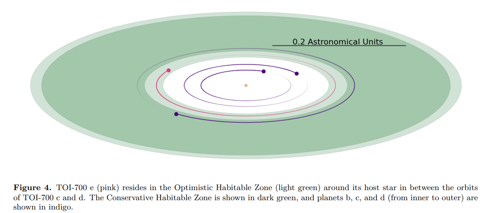
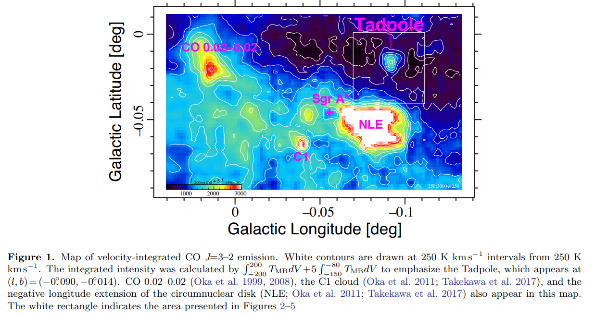
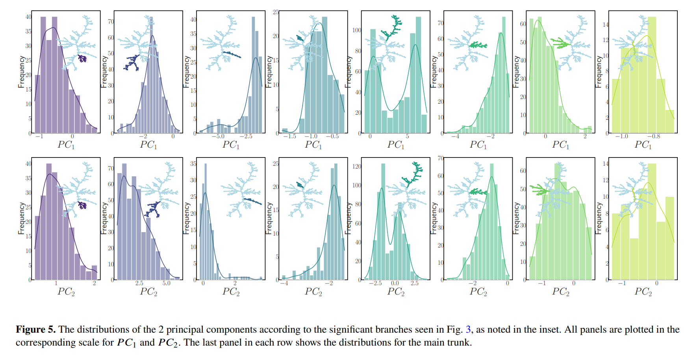
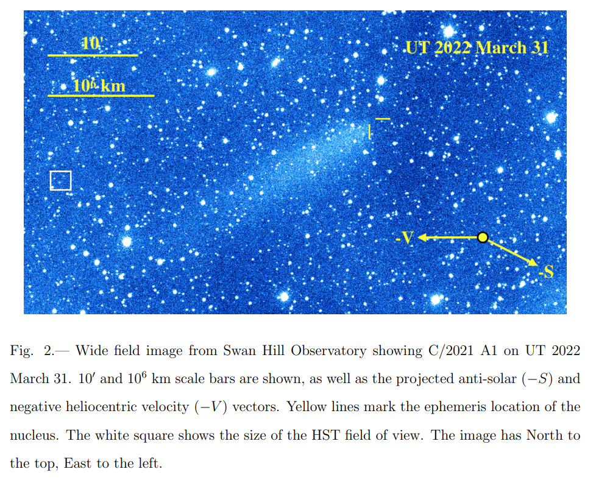
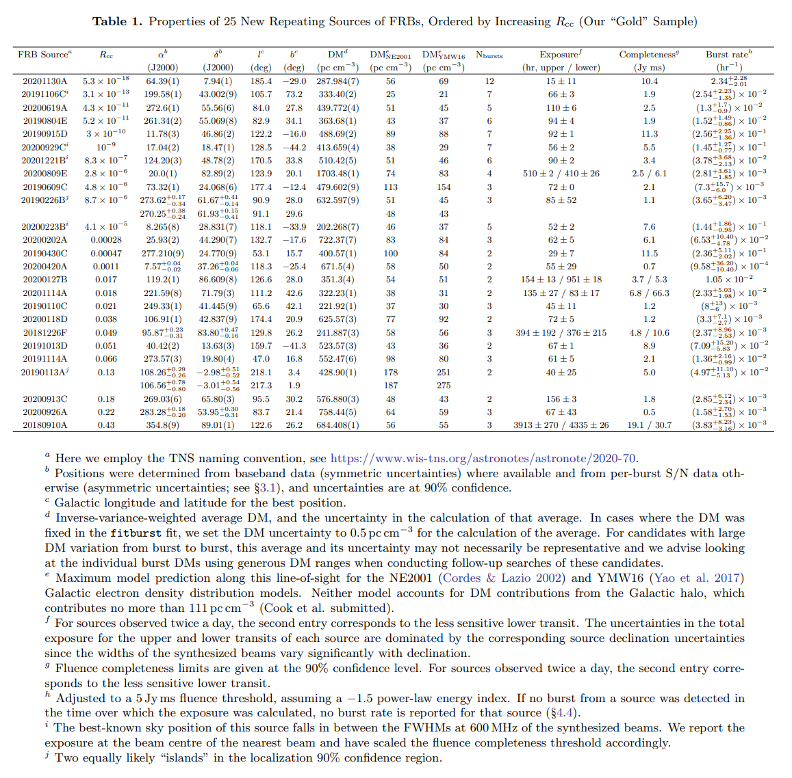
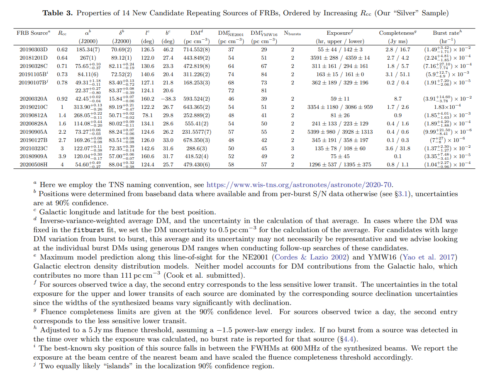
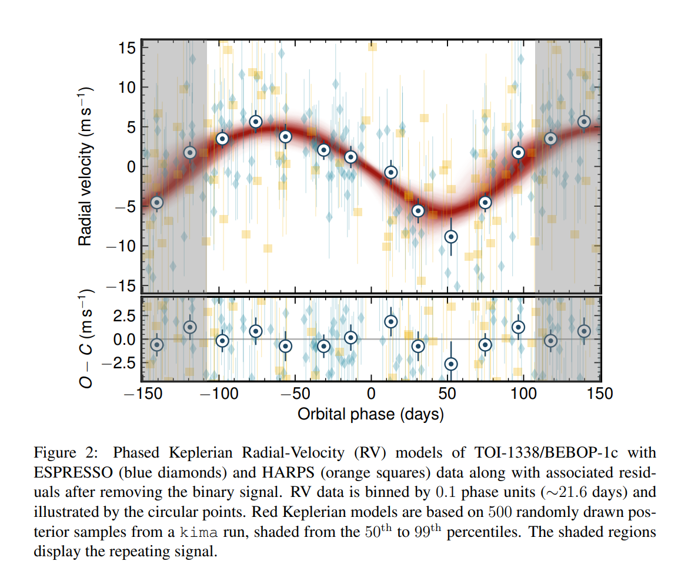
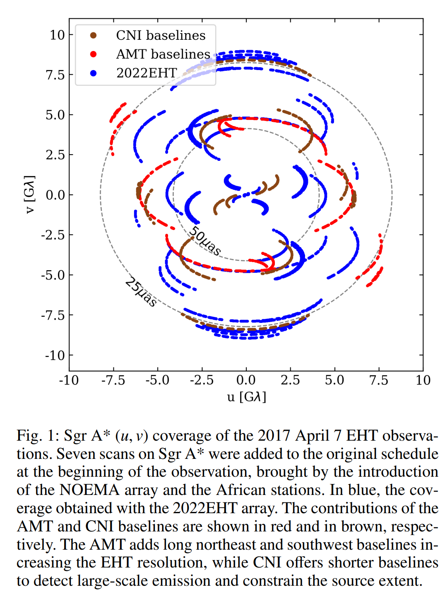

## 2023-01-02

1. [Foreground Removal of CO Intensity Mapping Using Deep Learning](https://arxiv.org/abs/2212.14712)

   > Machine Learning, Radio, Intensity Mapping

   用ResUNet消除CO成像中前景污染。

## 2023-01-03

1. [Black hole images: A Review](https://arxiv.org/abs/2301.00113)

   > Black Hole, Review

   `EHT`对`M87*`和`Sgr A*`的成像，可以帮助理解黑洞附近发生的相关物理过程，以及检验其他的引力理论。这里是这一主题最新发展的综述。

## 2023-01-04

1. [Deep Synoptic Array science: a 50 Mpc fast radio burst constrains the mass of the Milky Way circumgalactic medium](https://arxiv.org/abs/2301.01000)

   > Fast Radio Burst, Detection, Localization

   DSA发现并定位`FRB 20220319D`，一个非重复暴，位于有恒星形成的棒旋星系`IRAS 02044+7048`，距离`50Mpc`。NE2001和YMW16估计的河内DM超过了其实际DM，估计`circumgalactic medium, CGM`贡献DM的上限是`28.7`和`47.3`（取决于用FRB附近哪颗脉冲星来估计ISM DM）。这样的上限限制银河CGM总量$<10^{11}M_\odot$，考虑银晕质量，那么银河系重子质量是宇宙学平均水平的60%，支持星系形成模拟中通常预测的情景，`反馈过程将重子物质从银晕中驱逐出去`。

## 2023-01-05

1. [Atlas of dynamic spectra of fast radio burst FRB 20201124A](https://arxiv.org/abs/2301.01429)

   > Fast Radio Burst, Spectrum

   北大的`FRB 20201124A`的动态谱图集。

2. [Identifying preflare spectral features using explainable artificial intelligence](https://arxiv.org/abs/2301.01560)

   > Solar, Machine Learning

   用神经网络区分来自太阳`燃烧`和`非燃烧`活动区的MgII光谱，用于短时耀斑预测。这里使用`gradient-weighted class activation mapping, Grad-CAM`和`expected gradients, EG`来解释神经网络的决策过程。

## 2023-01-06

1. [HETDEX Public Source Catalog 1: 220K Sources Including Over 50K Lyman Alpha Emitters from an Untargeted Wide-area Spectroscopic Survey](https://arxiv.org/abs/2301.01826)

   > Galaxy, Catalog

   `Hobby-Eberly Telescope Dark Energy Experiment, HETDEX`是一个积分场光谱仪，通过测量$540\deg^2$内100w+个$Ly\alpha$发射星系的空间分布，测量`1.88<z<3.52`的哈勃膨胀参数和角直径距离。

   目录目前以发射线星系为主，包括51863个$Ly\alpha$星系，和123891个`z<0.5`的$OII$星系，4976个活动星系核，提供了位置、红移、分类、流量、发射线光度以及光谱。目录在[这里](http://hetdex.org/)。

## 2023-01-09

1. [Is there a semi-molten layer at the base of the lunar mantle?](https://arxiv.org/abs/2301.02476)

   > Planetary Science, Solar System, Lunar

   使用`Love number k2`和`tidal quality factor Q`参数化月球的潮汐耗散，发现潮汐耗散是频率依赖的，这样的现象通常是`地核-地幔边界有熔融层`的证据。

   文章是设计了一个简化月球模型，用`Sundberg-Cooper rheology`描述地幔，说明不需要熔融层也可以解释出现的频率依赖。

## 2023-01-10

1. [An FRB Sent Me a DM: Constraining the Electron Column of the Milky Way Halo with Fast Radio Burst Dispersion Measures from CHIME/FRB](https://arxiv.org/abs/2301.03502)

   > Fast Radio Burst, Milky Way, ISM, Dispersion Measure

   假设银晕`密度是球对称的`或者`密度随纬度变化更大`，从FRB的DM中估计银河系电子柱密度总量。限制银河系DM贡献观测约束为$87.8-141\rm\, pc/cm^3$，意味着银晕贡献DM的上线为$52-111\rm\, pc/cm^3$。

2. [Covariance Matrix of Fast Radio Bursts Dispersion](https://arxiv.org/abs/2301.03527)

   > Fast Radio Burst, Cosmology, Dispersion Measure

   FRB的DM是对宇宙大尺度电子分布的测量，可以用来测量宇宙学参数，包括膨胀率和宇宙重子组成。这篇文章讨论的是又大尺度结构引起的FRB的DM的协方差矩阵，因为来自天空中相近方向的爆发是有相关性的（`long wavelength modes of the electron distribution`）。

3. [Identifying meteorite droppers among the population of bright 'sporadic' bolides imaged by the Spanish Fireball Network during the spring of 2022](https://arxiv.org/abs/2301.03515)

   > Planetary Science, Meteor, Comet

   使用[3D-FireTOC](https://arxiv.org/abs/2103.13758)分析地面多站观测数据，研究西班牙上空2022年的15个火球，重建大气轨迹，计算日心轨道，并估计每个时间的初始和烧结质量。发现27%的火球在动力学上表现出彗星体的物理特征，1个与近地小行星相关，2个产生陨石的事件，但是并没有找到陨石。

## 2023-01-11

1. [A Second Earth-Sized Planet in the Habitable Zone of the M Dwarf, TOI-700](https://arxiv.org/abs/2301.03617)

   > Exoplanet, Light Curve, Photometry

   在距离太阳系31.1pc的位置，有一颗M2.5矮星`TOI-700`，发现这颗恒星的宜居带内有一颗$0.95R_\oplus$的行星。

   

## 2023-01-12

1. [Astrophysical properties of 600 bonafide single stars in the Hyades open cluster](https://arxiv.org/abs/2301.04159)

   > Stellar, Cluster, Parameters

   确定天体的物理参数依赖恒星模型，疏散星团可以用来测试和校准恒星演化模型和等龄线。这里从Gaia提供的`Hyades`星团成员中，分离单星。`PARSEC`等龄线可以很好拟合这个星团的年龄$775\pm25\,\rm Myr$，并为每一颗恒星分配质量、有效温度、亮度和表面重力。观测验证了PARSEC的等龄线。

2. [A JWST transmission spectrum of a nearby Earth-sized exoplanet](https://arxiv.org/abs/2301.04191)

   > JWST, Exoplanet, Spectroscopy, Atmosphere

   在未来十年，寻找系外行星生命的关键第一步是确定M矮星周围的岩质行星是否拥有大气层。JWST的光谱有广泛的波长覆盖和极高的灵敏度，适合用来探测地球大小行星的大气层。

   这里是JWST对`LHS 475b`的发现和验证，这是一颗温暖（586K）、0.99地球半径、位于宜居带的行星。通过两次掩食观测，排除了以氢气为主的原始大气和无云的纯甲烷大气。其无特征的透射光谱可能是类似金星（有高空云层）、类似于火星（脆弱大气层）、类似于水星（没有大气）。

## 2023-01-13

1. [First Detection of Radio Emission Associated with a Classical Cepheid](https://arxiv.org/abs/2301.04666)

   > Stellar, Variable, Radio

   VLA探测到典型造父变星`delta Cephei`在15GHz的射电连续谱发射，是第一个探测到的造父变星的射电连续谱发射。在2018年的三个脉动周期中，只有一个周期的0.43相位（最大半径和最低温度的阶段）观测到这颗恒星的 $5\sigma$发射，并且观察到的无线电发射在几天到几周的时间尺度上有`>10%`的变化。以前的X射线观测表明，在0.43相位，`delta Cephei`的X射线通量会定期增加。但目前的观测还不能确定射电发射是否与特定的脉冲阶段有关。

2. [Techniques for Measuring Parallax and Proper Motion with VLBI](https://arxiv.org/abs/2301.04756)

   > Astrometry, VLBI

   当目标和校准源间距<1度时，VLBI的测量二者之间的角度可以做到`1uas`的精度。`BeSSeL`巡天和日本的`VERA`项目正在利用这一点，测量与年轻恒星相关的数百个`Maser`源的三角视差来绘制银河系的螺旋结构。这里介绍微角秒天体测量是如何完成的。

3. [Discovery of the Tadpole Molecular Cloud near the Galactic Nucleus](https://arxiv.org/abs/2301.04831)

   > Galaxy, Milky Way, ISM, Black Hole

   在银河系中心`Sgr A*`附近发现了一个孤立的、有陡峭速度梯度的云。每个速度通道中`CO 1-2`的强度峰表明，`蝌蚪`围绕着质量为$10^5\,\rm M_\odot$的点源做开普勒运动。由于其空间紧凑以及其他波段下没有明亮的对应体，该天体可能是一个中等质量的黑洞。

   

## 2023-01-16

1. [Do simulated molecular clouds look like real ones?](https://arxiv.org/abs/2301.05245)

   > ISM, Simulation

   分子云模拟通常从高度理想化的初始条件开始（如一个均匀密度球+人工湍流速度场），虽然结果与观测相似，但还不清楚其能否真正代表分子云。

   最近的观测发现，分子谱线的积分强度和总柱密度之前有线性关系（是由于沿视线方向较高的速度弥散造成的）。这里在模拟分子云时，加入磁流体动力学、化学演化和辐射传输，在孤立（而非碰撞）的模型分子云中发现了如上的线性关系，表明理想化模型也可以代表真实分子云。

2. [Quantitative determination of minimum spanning tree structures: Using the pulsar tree for analyzing the appearance of new classes of pulsars](https://arxiv.org/abs/2301.05408)

   > Pulsar, Classification

   用最小生成树给脉冲星分类。

   

## 2023-01-17

马丁·路德·金日停更。

## 2023-01-18

1. [Hunting the gamma-ray emission from Fast Radio Burst with Fermi-LAT](https://arxiv.org/abs/2301.06464)

   > Fast Radio Burst, High Energy, Gamma Ray

   最近的观测将FRB与`磁星巨耀斑这样的软伽马重复暴`联系起来。使用超过12年的`Fermi-LAT`数据搜索FRB的伽马射线，没有找到。

2. [The transience and persistence of high optical polarization state in beamed radio quasars](https://arxiv.org/abs/2301.06159)

   > Galaxy, Quasar, Polarization, Optical, Radio

   `Flat-Spectrum`射电类星体`FSRQs`处于`blazar`状态时，在光学波段通常有很高的偏振度。但是有1/4的FSRQs在年的时间尺度上会发生高偏振度到非高偏振度状态的转变。这样偏振态的转变可能是一些瞬时过程的表现`manifestation`，比如从活动星系核中喷射出的`synchrotron plasma blobs`。

## 2023-01-19

1. [Revisiting mass-radius relationships for exoplanet populations: a machine learning insight](https://arxiv.org/abs/2301.07143)

   > Exoplanet, Machine Learning

   机器学习研究系外行星参数。聚类以$R_p\le0.91R_\oplus$和$M_p\le1.72M_\oplus$为界将系外行星分为两类。回归模型发现，行星质量、轨道周期和恒星质量在预测行星半径方面起主要作用。

2. [Real-time RFI Filtering for uGMRT: Overview of the Released System and Relevance to the SKA](https://arxiv.org/abs/2301.07402)

   > uGMRT, RFI

   uGMRT在实时观测对每个天线处理RFI，相当于在基带数据上消RFI，一般步骤也是中值滤波，找超过阈值的信号，用常数或者随机数代替。

3. [Stellar initial mass function varies with metallicity and time](https://www.nature.com/articles/s41586-022-05488-1)

   > Stellar, IMF, Gaia, LAMOST

   结合LAMOST和Gaia数据，从中挑选出93000颗有光谱观测M型矮星，做计数。发现IMF取决于金属性和恒星年龄。与经典IMF相比，早期恒星有较少的低质量恒星，与恒星金属丰度无关。在更近的时间，低质量恒星比例随恒星金属丰度增加。刘超老师的工作，发在Nature上。

## 2023-01-20

1. [Could Fast Radio Bursts Be Standard Candles?](https://arxiv.org/abs/2301.08194)

   > Fast Radio Burst, Cosmology

   由于$DM_{IGM}$的不确定性，使用DM推测FRB的光度距离有很大的误差，因此无法用于做标准烛光。借鉴校准`Ia型超新星`和`长伽马射线暴`作为标准烛光的方法来看，FRB或许可以有一定的经验关系来定距离。这里将FRB分类：

   - 非重复暴 I
     - Ia - $L_\nu\le10^{34}\,\rm erg/s/Hz$、$T_N\ge2\times10^{35}K$，Ib - 其它
   - 重复暴 II
     - IIa - $L_\nu\le10^{29}\,\rm erg/s/Hz$、$T_N\ge10^{30}K$，IIb - 其它

   其中Ib型FRB可以用不含DM的经验关系来校准并作为标准烛光使用
   $$
   \mu=-25\log\frac{F_\nu/(1+z)}{\rm Jy\cdot ms} + 22.4\log\frac{S_\nu}{\rm Jy}+65
   $$

## 2023-01-23

1. [A new limit on intergalactic magnetic fields on sub-kpc scales from fast radio bursts](https://arxiv.org/abs/2301.08259)

   > Fast Radio Burst, Magnetic Field, IGM, Theory

   用CHIME探测的FRB的散射时标推导IGM中亚kpc尺度的磁场上限。

2. [Disintegration of Long-Period Comet C/2021 A1 (Leonard)](https://arxiv.org/abs/2301.08673)

   > Comet, Planetary Science

   HST观测`C/2021 A1`表明，其碎裂后没有大于60m的碎片。`SHO`观测到碎片云，给出碎裂前星核半径$r=0.6\pm0.2km$。考虑到其轨道和大小，其碎裂最初是`rotational breakup`，随着碎裂进行，埋藏的挥发物暴露并强烈升华，加速了` rotational breakup`，导致最终核解体。

   

## 2023-01-24

1. [CHIME/FRB Discovery of 25 Repeating Fast Radio Burst Sources](https://arxiv.org/abs/2301.08762)

   > Fast Radio Burst, Detection

   介绍CHIME在2019.09.30-2021.05.01探测到的25个新的重复FRB，DM从220-1700，最少两个爆发，最多12个爆发。统计上，重复暴的DM和河外DM比非重复暴偏低。校正灵敏度和曝光效应后，重复暴的事件率和非重复暴的事件率上限之间没有明显的区分。

   

   另外还有14个可能是重复暴的候选。

   

2. [PODIUM:A Pulsar Navigation Unit for Science Missions](https://arxiv.org/abs/2301.08744)

   > Pulsar, Instrument

   `PODIUM`是正在设计中的航天器导航装置，使用脉冲星X射线观测来测量航天器到太阳系中心的距离和速度。设计目标是质量6kg，功率20w，体积$\rm 150\ mm\times 240\ mm\times600\ mm$。其中的入射式X望远镜，对于$0.2-10\ \rm keV$的光子能量，有效面积在$25-50\ \rm cm^2$之间，使用`Silicon Drift Detector, SDD`探测脉冲星光子，计时精度低于1usec。

## 2023-01-25

1. [YOLO-CL: Galaxy cluster detection in the SDSS with deep machine learning](https://arxiv.org/abs/2301.09657)

   > Galaxy, Deep Learning, Machine Learning, Object Detection

   用YOLOv3找SDSS中的星系团，之后写文章可以借鉴。

## 2023-01-26

1. [A Study of Stellar Spins in 15 Open Clusters](https://arxiv.org/abs/2301.10249)

   > Stellar, Cluster, Kinematic

   对15个疏散星团中，恒星的光谱和测光数据进行分析，确定恒星的倾角。结果表明，星团并不存在`spin alignment`，自旋方向基本是各向同性的。表明湍流在星团形成过程中主导。

## 2023-01-27

1. [The First Circumbinary Planet Discovered with Radial Velocities](https://arxiv.org/abs/2301.10794)

   > Exoplanet, Radial Velocity
   
   `Circumbinary Planet`，环联星运转行星，即环绕双星系统运动的行星。使用`HARPS`和`ESPRESSO`光谱仪测量的径向速度，探测到一颗新的环联星运转行星，是一颗气态巨行星，命名为`TOI-1338/BEBOP-1c`。这个系统之前已经被探测到有一个凌日行星`TOI-1338/BEBOP-1b`。这是第一次只使用径向速度就探测到的CP，也使`TOI-1338/BEBOP-1`成为第二个有多CP的系统。
   
   

## 2023-01-30

1. [Expanding Sgr A* dynamical imaging capabilities with an African extension to the Event Horizon Telescope](https://arxiv.org/abs/2301.11384)

   > Instrument, Black Hole, EHT

   `Canary Islands telescope, CNI`和位于纳米比亚的`Africa Millimetre Telescope, AMT`是两个正在计划中的望远镜阵列。这里研究的是，这两个阵列加入EHT后对`Sgr A*`成像的影响。

   

## 2023-01-31

1. [Coherent Curvature Radiation Spectrum by Dynamically Fluctuating Bunches in Magnetospheres](https://arxiv.org/abs/2301.12125)

   > Fast Radio Burst, Theory

   带电`bunches`的相干曲率辐射被认为是FRB和脉冲星的辐射机制，其中`bunch`在磁层中如何形成和消散，形成是离散还是连续的，光谱特征是什么，都是不清楚的问题。这里讨论的是`bunches`的光谱形状，杨元培老师的文章。

2. [Wavelet-enabled Star Classification: A Deep Learning Approach for Identifying Binary and Exoplanet Stars](https://arxiv.org/abs/2301.13115)

   > Stellar, Machine Learning, Classification

   使用深度学习区分光变曲线是`双星系统`还是`有行星的系统`。模型两个输入，一个输入是光变曲线的`mean, standard deviation, variance, kurtosis, skewness`组成的向量，另一个输入是用`PyWavelet`对光变曲线做DWT的输出。测试准确率`79.91%`。

3. [Why stars inflate to and deflate from red giant dimensions, II: replies to critics](https://arxiv.org/abs/2301.12754)

   > Stellar

   这似乎是一篇对线文章。作者`Alvio Renzini`在1992年的文章中说明了`opacity-driven`热不稳定性在恒星演化过程中的作用，包括恒星为什么会成为红巨星，以及在氦燃烧阶段的蓝循环如何形成。作者说多年来很多出版物中不认同这个观点，在这篇文章里，再次说明了不稳定性的主导作用，以及说明这些反对观点是无意义的。

