## 2023-02-01

1. [CELEBI: The CRAFT Effortless Localisation and Enhanced Burst Inspection Pipeline](https://arxiv.org/abs/2301.13484)

   > Fast Radio Burst, Software, ASKAP

   `CELEBI`是ASKAP上用于搜索和定位FRB的处理流程软件，用以实现实时探测FRB并保存对应的基带数据。

2. [What if planet 9 has satellites?](https://arxiv.org/abs/2301.13471)

   > Solar System, Planetary Science

   在过去十年间，数值模拟表明太阳系可能存在第九颗行星，可以解释柯伊伯带天体轨道聚集，但是目前并没有光学观测证实其存在。最近一些研究表明，第九行星可能是dark object，如原始黑洞。

   这篇文章表明，第九行星可能捕获`trans-Neptunian objects, TNOs`并形成卫星，而潮汐可以加热卫星，使其可被观测。

## 2023-02-02

1. [Reanalysis of the X-ray burst associated FRB 200428 with Insight-HXMT observations](https://arxiv.org/abs/2302.00176)

   > Fast Radio Burst, High Energy, Magnetar

   FRB200428对应的X射线爆发的慧眼数据再分析。

## 2023-02-03

1. [QLP Data Release Notes 003: GPU-based Transit Search](https://arxiv.org/abs/2302.01293)

   > Transient, Variable, Software

   在显卡上跑的TESS变星搜索工具，代码在[这里](https://github.com/johnh2o2/cuvarbase)。

2. [Aggregate Effects of Proliferating LEO Objects and Implications for Astronomical Data Lost in the Noise](https://arxiv.org/abs/2302.00769)

   > Astronomy, Satellite, Night

   这里提出空间物体（人造卫星和碎片等）对夜空亮度提升的定量计算。

## 2023-02-06

1. [DESI z >~ 5 Quasar Survey. I. A First Sample of 400 New Quasars at z ~ 4.7-6.6](https://arxiv.org/abs/2302.01777)

   > Galaxy, Quasar

   DESI高红移类星体巡天的结果，报道了400+$4.7\le z\le6.6$的新类星体。

## 2023-02-07

1. [Learning the Night Sky with Deep Generative Priors](https://arxiv.org/abs/2302.02030)

   > Machine Learning, Deep Learning, Deconvolution

   大气干扰会使点扩散函数变化，导致图像模糊。这里使用自编码网络，实现从多次曝光图像中恢复清晰图像。

   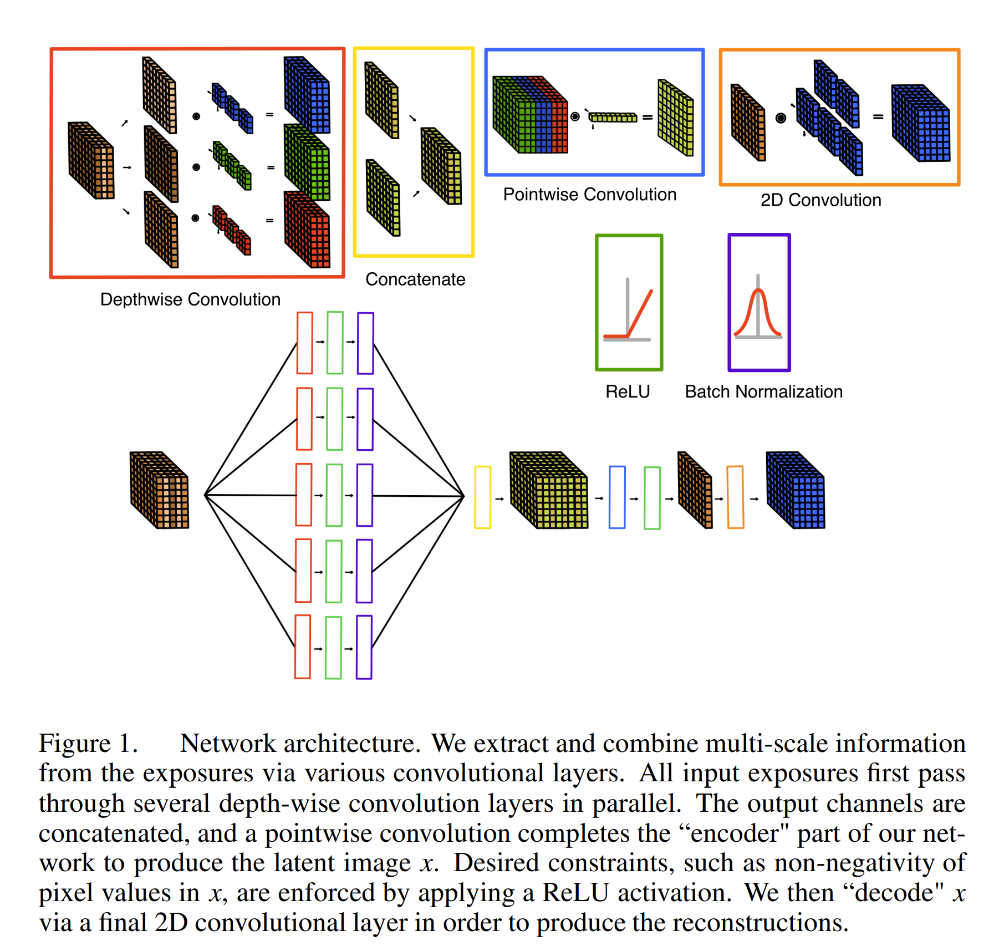

2. [Modelling the 2022 τ-Herculid outburst](https://arxiv.org/abs/2302.02915)

   > Meteor, Comet, Solar System

   `73P/Schwassmann-Wachmann 3`是一颗木族彗星，1995年解体产生了`τ-Herculids`小型流星雨，在2022年5月30日出现两个明显的活动高峰。数值模拟表明，这次活跃主要是由彗核喷出的流星体造成的，速度是彗星气体膨胀速度的4倍，体密度是$250\,\rm kg/m^3$。

## 2023-02-08

1. [Correcting Bandwidth Depolarization by Extreme Faraday Rotation](https://arxiv.org/abs/2302.03134)

   > Fast Radio Burst, Rotation Measure, Software

   新的拟合RM的算法，写到了[RM-tools](https://github.com/CIRADA-Tools/RM-Tools/wiki)里、

2. [Beyond Gaussian Noise: A Generalized Approach to Likelihood Analysis with non-Gaussian Noise](https://arxiv.org/abs/2302.03046)

   > Modeling, Measurement Error, Non-Gaussian Noise

   噪声的概率密度函数是复杂的、高维的、非高斯的、各向异性的，因此在似然分析中通常假设正态分布的噪声。这里提出一个模型，使用观测噪声来建立噪声模型，产生无偏的似然。

## 2023-02-09

1. [Comet 108P/Ciffreo: The Blob](https://arxiv.org/abs/2302.03697)

   > Solar System, Comet

   对`108P/Ciffreo`的光学观测。这颗彗星形态独特，其彗核周围伴随着一个共同运动的弥散“圆球”，后续观测圆球消失。使用太阳引力核辐射压作用下彗星粒子动力学模型，表明圆球是喷向太阳的粒子被光压反射后掉头产生的`artifact`。

   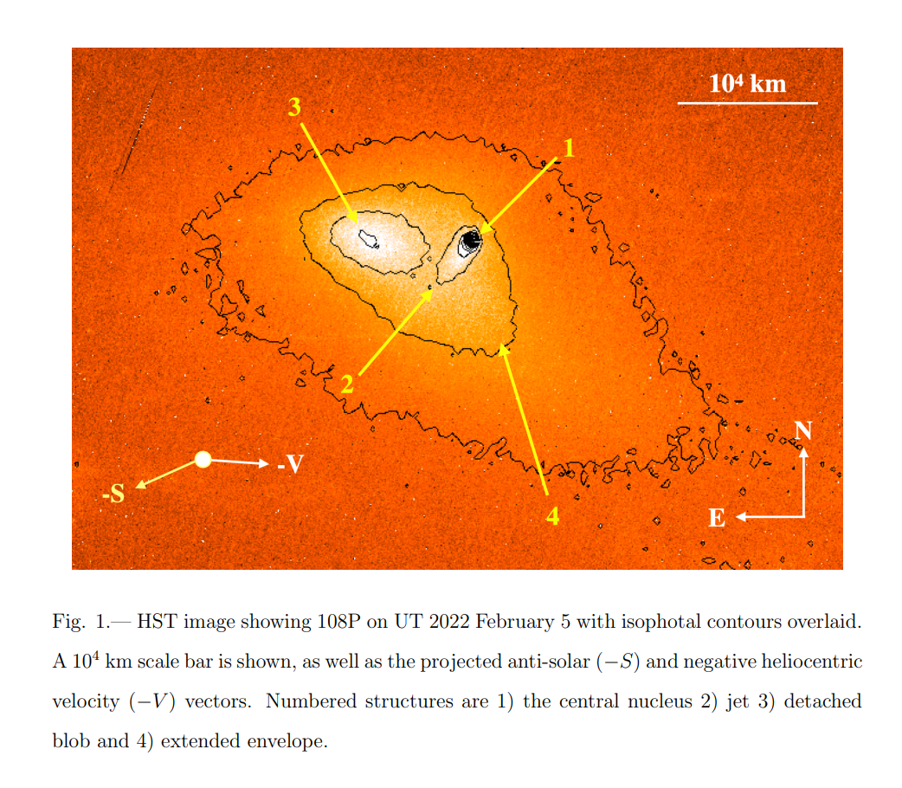

## 2023-02-10

1. [Practical Guidance for Bayesian Inference in Astronomy](https://arxiv.org/abs/2302.04703)

   > Astrostatistics

   介绍贝叶斯推理，示例代码在[这里](https://github.com/joshspeagle/nrp_astrobayes)。

## 2023-02-13

1. [Mapping the Galactic Magnetic Field Orientation and Strength in Three Dimensions](https://arxiv.org/abs/2302.05047)

   > ISM, Turbulence, Magnetic Field

   通过测量HI的速度梯度`Velocity Gradient Technique, VGT`和柱密度方差 `Column Density Variance`，可以获得两个马赫数$M_s|M_A$，从而测绘银河系磁场强度与方向。

   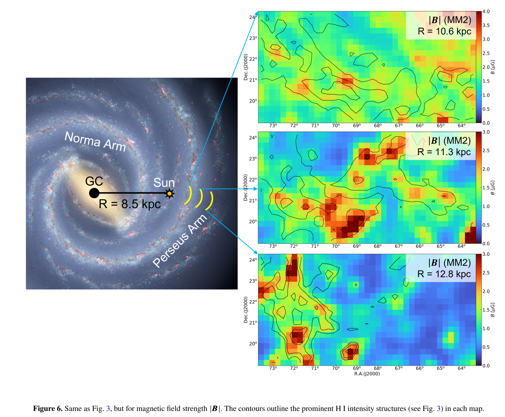

## 2023-02-14

1. [Calculation and Uncertainty of Fast Radio Burst Structure Based on Smoothed Data](https://arxiv.org/abs/2302.06220)

   > Fast Radio Burst, Dispersion Measure

   提出基于`discrete cosine transform`的`smoothing filter`，计算导数的平方和的平方根可以给出结构参数的不确定性。

2. [The Demographics, Stellar Populations, and Star Formation Histories of Fast Radio Burst Host Galaxies: Implications for the Progenitors](https://arxiv.org/abs/2302.05465)

   > Fast Radio Burst, Galaxy

   对23个FRB（6个重复，17个不重复）的宿主星系的光度和光谱观测。星系的恒星质量、年龄和恒星形成率都非常弥散，且对于重复和非重复FRB没有明显的统计相关性。21个处于恒星形成期，1个是过渡期，还有一个是宁静期。两个恒星形成不活跃的星系中的都是非重复FRB。

   这些结果支持FRB形成于核心坍缩超新星，但在不活跃环境中存在FRB，表明部分FRB是通过更`delayed channels`形成的。

3. [A variational encoder-decoder approach to precise spectroscopic age estimation for large Galactic surveys](https://arxiv.org/abs/2302.05479)

   > Stellar, Milky Way, Deep Learning

   在1000个有星震年龄测量的样本上训练VAE，使从恒星光谱推理恒星年龄，代码在[这里](https://github.com/henrysky/astroNN_ages)。

   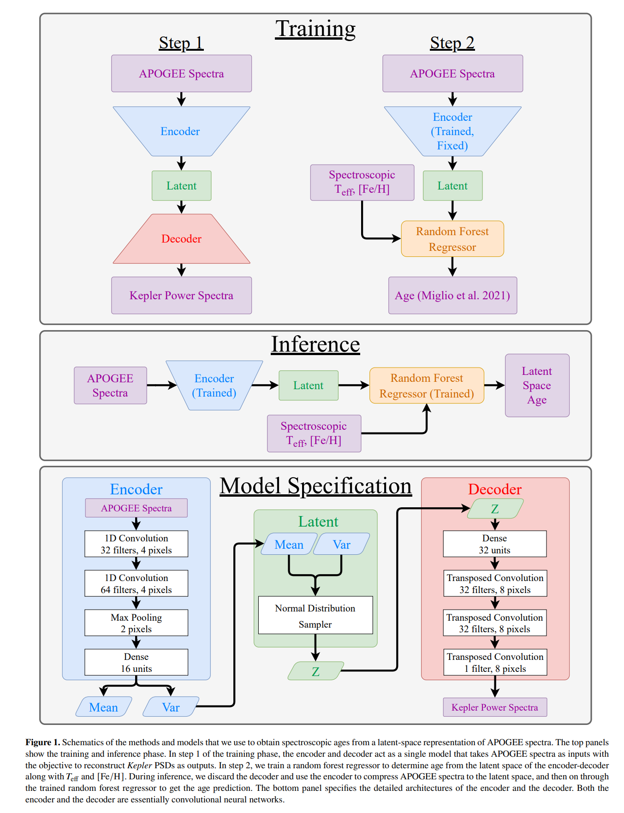

4. [RFI Flagging in Solar and Space Weather Low Frequency Radio Observations](https://arxiv.org/abs/2302.05523)

   > Solar, RFI, Radio

   测试不同标记RFI的方法在LOFAR太阳数据上的效果（挑战是太阳爆发可能会比RFI更亮）。

   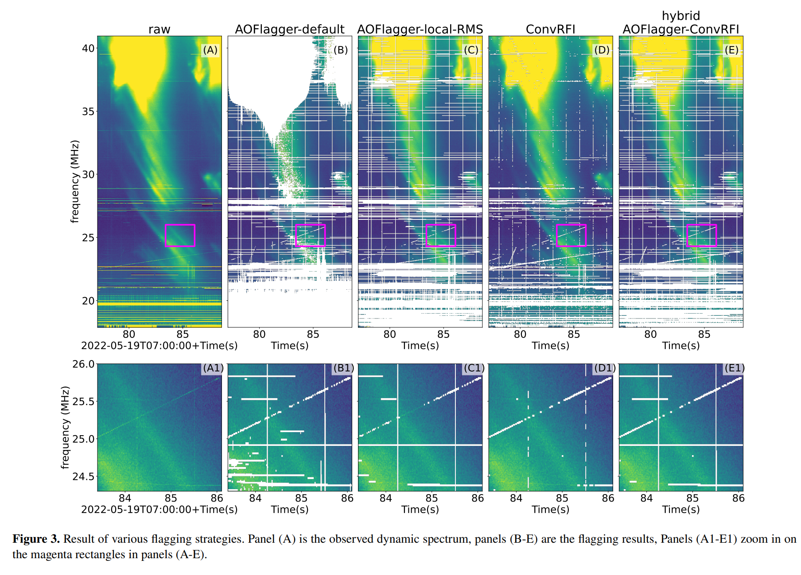

## 2023-02-15

1. [DIAmante TESS AutoRegressive Planet Search (DTARPS): I. Analysis of 0.9 Million Light Curves](https://arxiv.org/abs/2302.06700)

   > Stellar, TESS, Transient

   对TESS光变曲线的分析流程。用`ARIMA，Autoregressive Integrated Moving Average model，差分整合滑动平均自回归模型`，拟合光变曲线基线，消除趋势和自相关噪声。用`Transit Comb Filter`识别光变曲线中最强的周期性信号（周期搜索是Box-Least Squares periodogram），最后用随机森林分类。

2. [Repeating fast radio bursts reveal memory from minutes to an hour](https://arxiv.org/abs/2302.06802)

   > Fast Radio Burst, Statistics, Waiting Time, SOC

   用`Hurst exponent`拟合FRB121102和FRB20201124A的waiting time，说时间序列有记忆。

## 2023-02-16

1. [The 2022 high-energy outburst and radio disappearing act of the magnetar 1E 1547.0-5408](https://arxiv.org/abs/2302.07397)

   > Magnetar, Radio Burst, Detection, High Energy

   `Radio-loud magnetar - 1E1547.0-5408`一直有射电脉冲发出，在2022年3月，持续射电辐射消失，22天后，`Swift-BAT`探测到一个短爆发，12天后，射电辐射再次出现。多波段的观测表明，这个短爆与`spin-up glitch`有关，表明爆发可能与磁场线的重新排列有关，导致了表面加热和射电信号暂时消失，但是对硬X射线没有影响。

   这个磁星的射电脉冲的平均轮廓表现出不同的特征（如下图），以及此次测量的DM是$697\,\rm pc/cm^3$，2007年的数值是$830\,\rm pc/cm^3$，作者认为是测量方法（结构或者信噪比）不同导致。测量的RM是$-1860\,\rm rad/m^2$。

   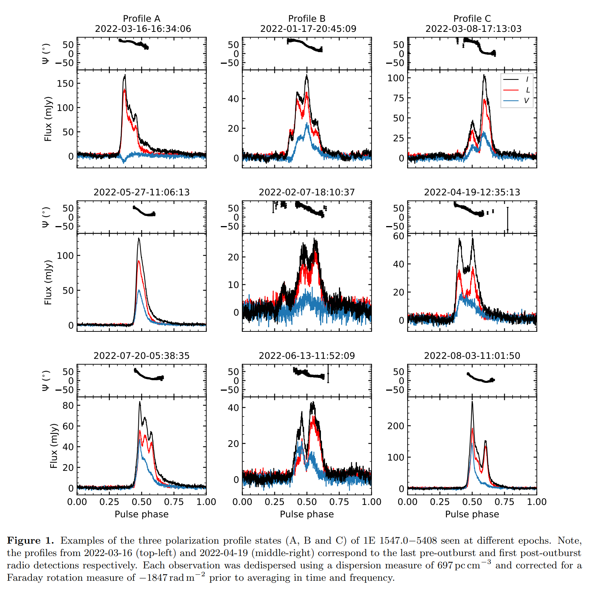

2. [The first JWST spectrum of a GRB afterglow: No bright supernova in observations of the brightest GRB of all time, GRB 221009A](https://arxiv.org/abs/2302.07761)

   > GRB, High Energy, JWST, HST

   `GRB 221009A`是2022年探测到的，到目前为止最亮的伽马射线暴。这里使用JWST和HST对其余辉进行观测。JWST光谱在0.5-12天内没有明显变化，表明没有超新星或者超新星很暗，HST观测宿主星系是`edge-on`，增加了分离超新星信号的难度。宿主星系与其它`long-GRB`没什么区别，表明这次特别亮与大尺度环境无关。

   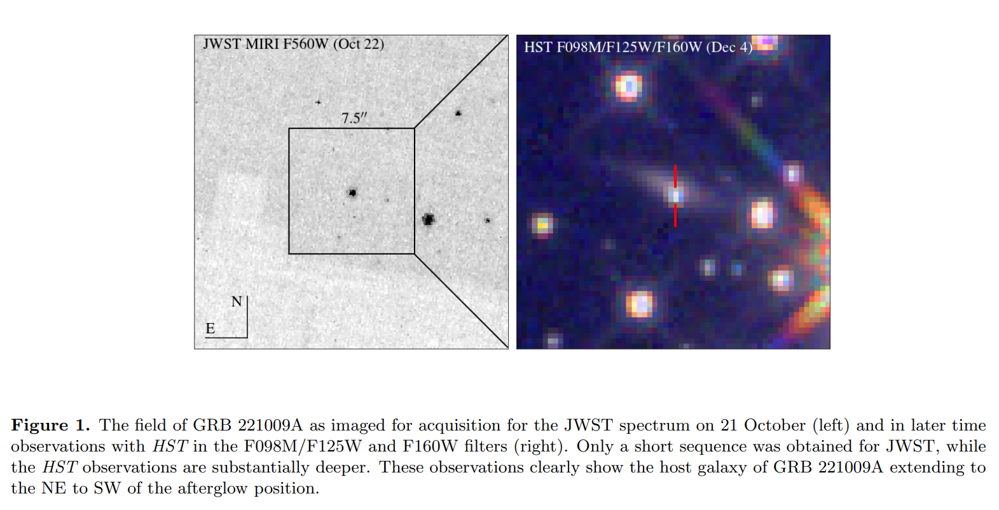

## 2023-02-17

1. [Revealing the Dynamic Magneto-ionic Environments of Repeating Fast Radio Burst Sources through Multi-year Polarimetric Monitoring with CHIME/FRB](https://arxiv.org/abs/2302.08386)

   > Fast Radio Burst, Polarization, Rotation Measure, CHIME

   CHIME报道12个重复暴的偏振。其中`FRB 20181119A`、`FRB 20190303A`和`FRB 20190417A`的RM在一个月内可以变化几百，`FRB 20181030A`、`FRB 20190208A`和`FRB 20190117A`在一个月内可以变化几十。重复FRB的RM变化，要比从银河系和麦哲伦云中的脉冲星更普遍也更极端，表明FRB所处的电磁环境与脉冲星不同。

2. [Searching for phase transitions in neutron stars with modified Gaussian processes](https://arxiv.org/abs/2302.07978)

   > Pulsar, Gaussian Process

   使用高斯过程，从声速-压力的相空间中，推断脉冲星状态方程，并寻找相变点。

## 2023-02-20

1. [Relativistic coronal mass ejections from magnetars](https://arxiv.org/abs/2302.08848)

   > Magnetar, CME, Fast Radio Burst

   讨论磁星日冕物质抛射的动力学。

## 2023-02-21

1. [Polarization of Fast Radio Bursts: radiation mechanisms and propagation effects](https://arxiv.org/abs/2302.09697)

   > Fast Radio Burst, Polarization, Theory, Circular

   张冰老师他们的文章，讨论FRB偏振如何产生的。将偏振产生机制分成磁层内、磁层外两类，并在每一类中分别讨论本征辐射机制和传播效应。

   - 磁层内
     - **曲率辐射**：由于电荷团在强磁场中沿着曲率半径较小的轨道运动，会发出高度线偏振的同步辐射。如果观测角与轨道平面一致，*线偏振度可以达到100%*。如果*观测角有一定的偏离*，线偏振度会降低，并且*可能出现圆偏振*。
     - **逆康普顿散射**：由于电荷团与背景光子发生碰撞，会将光子能量提升到高频段，并且保持原来的线偏振方向。如果观测角与背景光子方向一致，*线偏振度也可以达到100%*。如果*观测角有一定的偏离*，线偏振度也会降低，并且*可能出现圆偏振*。
     - **回旋共振吸收**：由于电子和正电子在磁场中存在不对称的洛伦兹因子分布，当光子频率等于某个回旋频率时，会被吸收并重新发射出来，并且*产生高度圆偏振*。这种机制需要满足共振条件，并且要求磁层内部有足够多的电荷密度和温度梯度。
   - 磁层外
     - **同步脉泽**：由于等离子体不稳定性，在冲击波前沿形成一个薄层结构，在这里发生强烈的同步辐射放大效应，并且产生高度线偏振的脉泽辐射。如果观测角与冲击波法向一致，*线偏振度可以接近100%*。如果*观测角有一定的偏离*，线偏振度会降低，并且*可能出现圆偏振*，但此时通量也会大幅减小，难以被探测到。
     - **同步吸收**：由于等离子体密度梯度或温度梯度，在某些频段下同步辐射会被吸收并重新发射出来，并且改变了原来的圆偏振方向和程度，倾向于*降低圆偏振度*。这种机制需要满足吸收条件，并且要求冲击波前沿有足够大的厚度和宽带性质。
     - **回旋吸收**：由于等离子体中存在低能量或非相对论性的电荷，在某些频段下回旋辐射会被吸收并重新发射出来，并且*产生高度圆偏振*。这种机制需要满足吸收条件。
     - **法拉第转换**：可以*将一种偏振模式转换为另一种*。法拉第转换需要场反转，在双星系统或FRB被超新星遗迹包围时可能实现。

   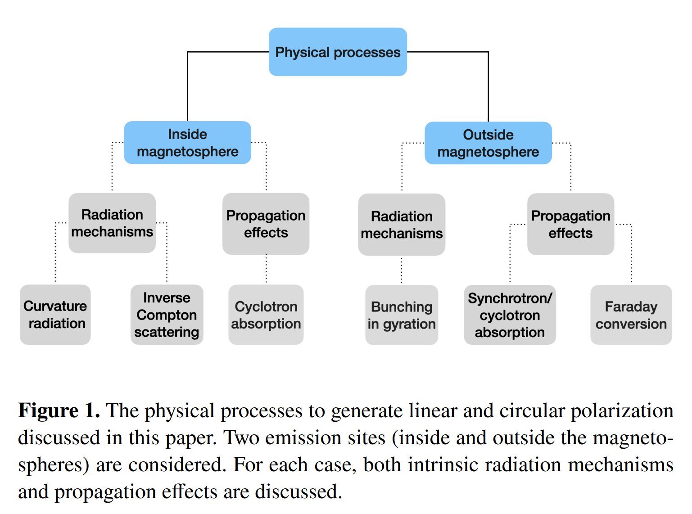

   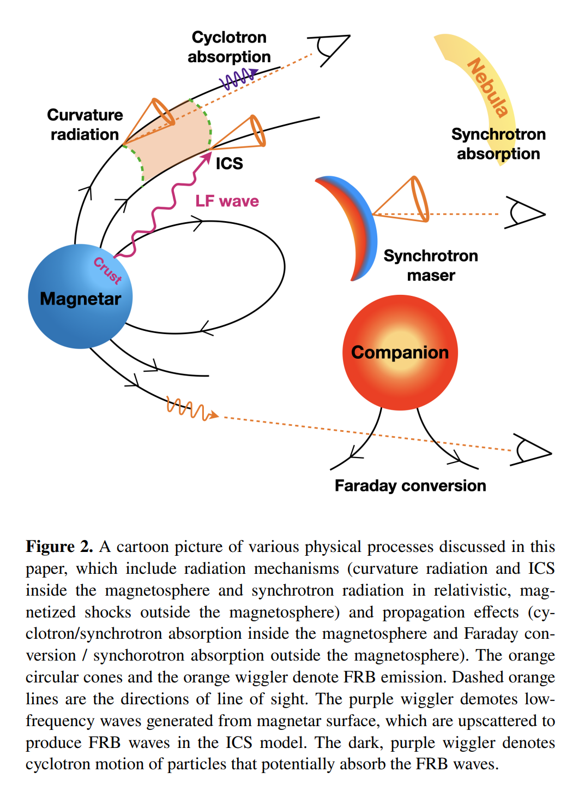

2. [Tied-Array Beam Localisation of Radio Transients and Pulsars](https://arxiv.org/abs/2302.09812)

   > Fast Radio Burst, MeerKAT, Software, Localization

   [SeeKAT](https://github.com/BezuidenhoutMC/SeeKAT)建立MeerKAT不同波束中同一个爆发信噪比的似然分布，定位爆发的位置。

3. [FRB 20210405I: the first Fast Radio Burst sub-arcsecond localised with MeerKAT](https://arxiv.org/abs/2302.09787)

   > Fast Radio Burst, Detection, MeerKAT

   MeerKAT定位的第一个FRB，`FRB 20210405I`，DM=565，定位到z=0.066的盘状星系。

4. [Discovery of an as-yet non-repeating fast radio burst with the hallmarks of a repeater](https://arxiv.org/abs/2302.09754)

   > Fast Radio Burst, Detection, MeerKAT

   MeerKAT探测到非重复暴FRB20210410D，DM=578，定位到z=0.1415的光学星系中，没有连续射电辐射。

5. [A sample of Fast Radio Bursts discovered and localised with MeerTRAP at the MeerKAT telescope](https://arxiv.org/abs/2302.10107)

   > Fast Radio Burst, MeerKAT, Detection

   MeerKAT探测并定位到`1角分`三个FRB，FRB20201211A表现出散射增宽，FRB20210202D相隔200mm有一个微弱后随爆发，FRB20210408H以50%的概率定位在红移0.5的星系。根据这些样本，推断1.28GHz的FRB全天事件率$4.4^{+4.3}_{-2.5}\,\rm sky^{-1}d^{-1}$。

6. [Consistent Constraints on the Equivalence Principle from localised Fast Radio Bursts](https://arxiv.org/abs/2302.10072)

   > Fast Radio Burst, Cosmology, Theory

   FRB的爆发信号被大尺度结构中的自由电子干扰，导致不同频率的时间延迟。另外，视线方向时间和空间的扰动，会导致`Shapiro delay`。弱等效原理保证自由落体的普遍性，如果违反，那么FRB不同频率的光子会有不同的轨迹，将产生一个额外的时间延迟。这里使用12个定位的FRB测试弱等效原理，发现表征违反弱等效原理的参数$\Delta\gamma$必须在$4.6-6meV$的能量范围内保持恒定。这是在低能量范围对$\Delta\gamma$最严格的约束。

7. [Hunting for C-rich long-period variable stars in the Milky Way's bar-bulge using unsupervised classification of Gaia BP/RP spectra](https://arxiv.org/abs/2302.10022)

   > Stellar, Gaia, Machine Learning, Classification, Variable

   用UMAP对Gaia DR3的BP/RP光谱中，长周期变星的化学成分进行分类，富O和富C的源。

   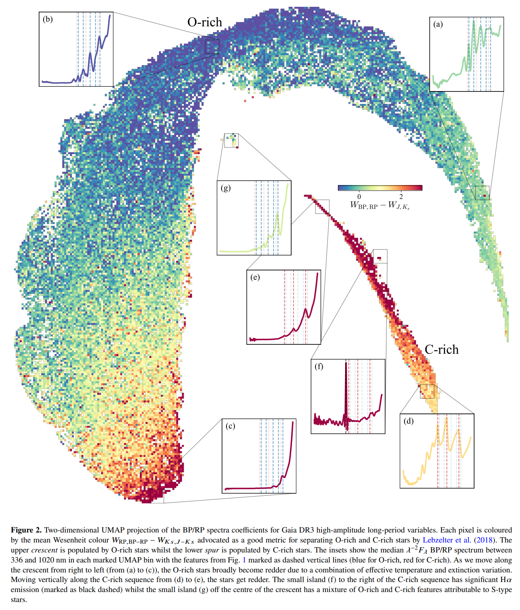

## 2023-02-22

1. [Probing the baryon mass fraction in IGM and its redshift evolution with fast radio bursts using Bayesian inference method](https://arxiv.org/abs/2302.10585)

   > Fast Radio Burst, Cosmology

   用定位了的FRB推理星系间介质中重子质量的比例
   $$
   f_{\rm IGM}(z)=f_{\rm IGM, 0}\left(1+\frac{\alpha z}{1+z}\right)
   $$
   假设了$f_{\rm IGM}$随红移演化，$\alpha$是演化参数。通过这18个FRB，估计$\alpha=0.11^{+0.24}_{-0.47}$，在$1\sigma$范围内与0一致，也即$f_{\rm IGM}$不随红移演化。由于参数之间的相关性，300个FRB也无法严格约束参数。

2. [Performant feature extraction for photometric time series](https://arxiv.org/abs/2302.10837)

   > Stellar, Variable, Light Curve, Software

   [light-curve](https://github.com/light-curve/light-curve-python)用于从变星的光变曲线中提取特征。

## 2023-02-23

1. [The Evryscope Fast Transient Engine: Real-Time Detection for Rapidly Evolving Transients](https://arxiv.org/abs/2302.10929)

   > Transient, Telescope, Machine Learning

   `Evryscopes`是一个光学望远镜，由NSF自主，一次曝光覆盖8520平方度的天空。从曝光图像中检测暂现源，对前后两张图像做微分，然后用`VetNet`做分类，探测暂现源。

   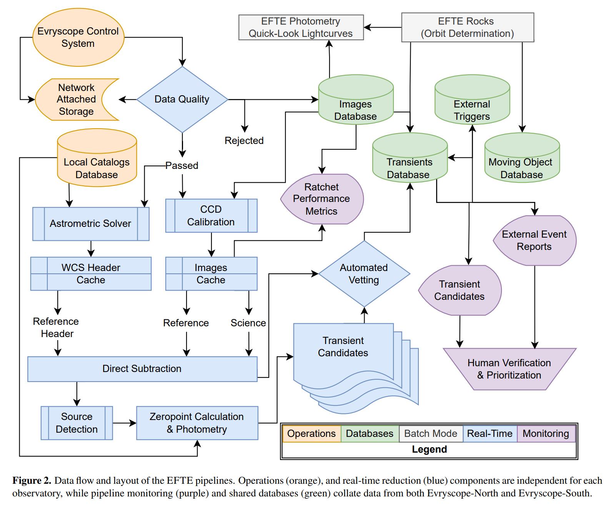

## 2023-02-24

1. [Burst search method based on likelihood ratio in Poisson Statistics](https://arxiv.org/abs/2302.11755)

   > Transient, Search, Poisson, Method

   从光变曲线中搜索暂现源，泊松统计相比高斯统计，可以提供给微弱爆发更高的显著性。

## 2023-02-27

1. [Revisiting the SFR-Mass relation at z=0 with detailed deep learning based morphologies](https://arxiv.org/abs/2302.12265)

   > Galaxy, Catalogue

   基于SDSS、MaNGA和DESI的星系形态（early/late-type、elliptical/lentiular、edge-on、barred galaxy、T-type）分类[目录](https://archive.cefca.es/ancillary_data/sdss_morphological_catalogues/sdss_morphological_catalogues.tar.gz)。基于此，下图展示了星系的`SFR-StellarMass-HubbleStageT`的关系。

   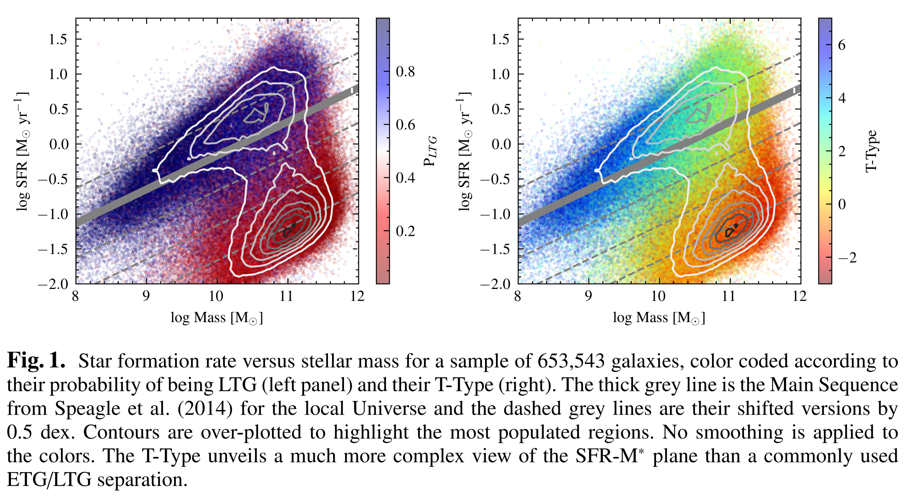

## 2023-02-28

1. [GRB 221009A, The BOAT](https://arxiv.org/abs/2302.14037)

   > High Energy, GRB, Observation

   `GRB 221009A`被称为有史以来最亮的GRB（Brightest Of All Time, BOAT）。通过与半个世纪以来的GRB进行比较，发现其具有有史以来最高的各向同性等效总能量，使其成为几乎万年一遇的事件，可能是人类文明开始以来最亮的GRB。

