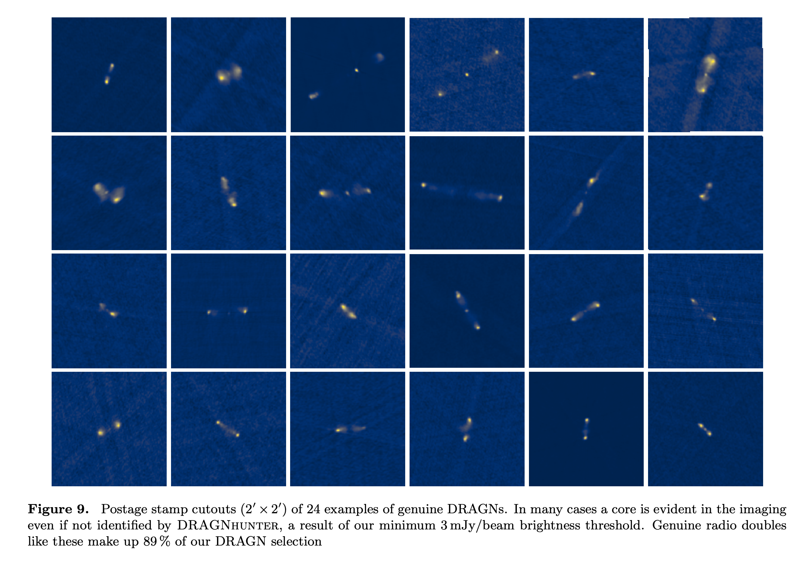

## 2023-03-01

1. [First detection of CO emission from Cepheid Variable stars](https://arxiv.org/abs/2302.14075)

   > Stellar, Variable, Spectrum

   用`IRAM 30m`对8个`Cepheid`变星进行观测，首次从其中的4颗测量到`CO 1-0`线，证实`Cepheid`大气中确实存在CO，为解释`Cepheid`中观察到的中红外颜色变化提供了证据。

2. [Deep Synoptic Array science: A massive elliptical host among two galaxy-cluster fast radio bursts](https://arxiv.org/abs/2302.14782)

   > Fast Radio Burst, Galaxy, DSA

   DSA定位两个FRB的宿主星系。`FRB 20220914A`位于`Abell 2310`星团中一个红移为0.1139的晚型星系，历史上有多次星爆。`FRB 20220509G`位于`Abell 2311`星团中一个红移为0.0894的宁静早型星系。

   两个FRB宿主星系的不同恒星形成历史表明，FRB有多种形成渠道，且FRB的`progenitors`的`delay-time`分布很广。

   

3. [Deep Synoptic Array science: Two fast radio burst sources in massive galaxy clusters](https://arxiv.org/abs/2302.14788)

   > Fast Radio Burst, ISM, Intracluster Medium

   对星系团内介质（Intracluster Medium, ICM）中热气体的研究，过去一般是使用X射线和亚毫米波的`Sunyaev-Zeldovich`效应。FRB的DM和RM等观测指标提供了一种额外的方法，可以直接测量星系团周围的ICM和气体。

   这里讲的也是上一篇中的两个FRB，`FRB 20220914A`和`FRB 20220509G`，这两个FRB是首次被定位到星系团的FRB。这里将FRB数据与这些星系团的X射线、SZ和光学观测结合，推断ICM的属性。

4. [Long-term modulation of solar cycles](https://arxiv.org/abs/2302.14845)

   > Solar System, Solar, Periodicity

   太阳活动有着大约11年的`Schwabe`周期，但是太阳周期在长度、形状和幅度上都有明显的调制。太阳黑子计数只有400年的历史，不均匀且太短，无法稳定地研究太阳变化的长期规律。$^{14}C$同位素重建太阳活动历史，可以将时间尺度扩展到12个千年。

   

   这里研究太阳活动在百年-千年时间尺度上的长期变化。结果表明，太阳周期包含一个重要的随机成分，且由于没有类似时钟的相位锁定，意味着缺乏长期记忆。

## 2023-03-02

1. [Application of Deep Learning Methods for Distinguishing Gamma-Ray Bursts from Fermi/GBM TTE Data](https://arxiv.org/abs/2303.00370)

   > High Energy, Machine Learning

   组合残差网络和注意力机制，从Fermi数据中分类GRB。通过`Grad-CAM`和`T-SNE`跟踪模型，发现模型确实专注于GRB的主要特征。

## 2023-03-03

1. [Insight-HXMT and GECAM-C observations of the brightest-of-all-time GRB 221009A](https://arxiv.org/abs/2303.01203)

   > High Energy, GRB, Observation

   HXMT和GECAM-C联合观测GRB221009A，测量了其完整的发射过程，包括`precursor, main emission, flaring emission and early afterglow`。计算各向同性等效能量是$1.5\times10^{55}\,\rm erg$，是太阳总静止质量能量的8倍。

2. [Roll Angle Adjustment Dims Starlink Satellites](https://arxiv.org/abs/2303.01431)

   > Satellite, Instrument, Astronomy

   通过调整星链卫星的姿态角，可以使其亮度变暗90%。

## 2023-03-06

1. [L dwarfs detection from SDSS images using improved Faster R-CNN](https://arxiv.org/abs/2303.01836)

   > Stellar, Machine Learninig, Object Detection

   用`FAST R-CNN`从SDSS图像中找L型矮星。

2. [YSE-PZ: A Transient Survey Management Platform that Empowers the Human-in-the-Loop](https://arxiv.org/abs/2303.02154)

   > Transient, Software, Database

   [YSE-PZ](https://github.com/davecoulter/YSE_PZ)用于接收暂现源发现警报的实时流，识别宿主星系，下载相关归档数据，并检索光度和光谱，可用Docker部署在本地。

3. [Orbital Period Change of Dimorphos Due to the DART Kinetic Impact](https://arxiv.org/abs/2303.02077)

   > Planetary Science, Planetary Defense, Asteroid

   `The Double Asteroid Redirection Test, DART`，是航天器撞击近地双小行星`Didymos 65803`的次级小行星`Dimorphos`改变其轨道的实验。

   如果DART航天器的所有动能全部转移到小行星上，预计轨道周期会变7分钟。但现在观测表明，`Dimorphos`的轨道周期变化$-33\pm1$分钟，表明撞击产生的喷射物为小行星贡献了大量的动能。

## 2023-03-07

1. [Prompt Detection of Fast Optical Bursts with the Vera C. Rubin Observatory](https://arxiv.org/abs/2303.02525)

   > Stellar, Transient, Optical

   目前实验上仍然无法分辨毫秒级的快速光学爆发（FOB），这种非常快的瞬变现象可能是FRB和或者GRB的光学对应物，或者一种未知的现象。

   由于FOB持续时间很短，一般的光学波段观测曝光无法解析，但是FOB发生后，目标源的扭曲图像应该与稳定源的图像有特征性的不同。

   将这一想法应用于LSST的模拟观测，并使用神经网络分类器区分结果，得出了`FOB持续时间-强度`参数空间的约束条件。

## 2023-03-08

1. [The Solar Upper Transition Region Imager (SUTRI) onboard the SATech-01 satellite](https://arxiv.org/abs/2303.03669)

   > Solar, Satellite, Instrument

   `Space Advanced Technology demonstration satellite, SATech-01`空间先进技术示范卫星于2022.7发射到500公里高的太阳同步轨道上。其中的`The Solar Upper Transition Region Imager, SUTRI`太阳上过渡区成像仪使用了新开发的`Sc-Si`多层反射镜以及$\rm 2k\times 2k$的`EUV CMOS`，在`Ne VII 46.5nm`光谱线上拍摄全日面图像，滤镜宽度3nm，视场$41.6'\times41.6'$，成像节奏30s，每天太阳观测时间16小时。白老师他们的文章。

   

2. [Identification of tidal features in deep optical galaxy images with Convolutional Neural Networks](https://arxiv.org/abs/2303.03407)

   > Galaxy, Machine Learning, Tidal, Classification

   使用CNN分类星系的潮汐特征，`accuracy`和`precision`对于不同的星系表面亮度是基本恒定的，`recall`受到`image depth`影响，且`recovery rate`显示出潮汐特征种类的依赖。

## 2023-03-09

1. [The Atacama Cosmology Telescope: Systematic Transient Search of 3-Day Maps](https://arxiv.org/abs/2303.04767)

   > Radio, Transient, Stellar, Flare

   从` Atacama Cosmology Telescope`三年（2017-2019）的数据中搜索到了29个暂现源，覆盖了40%的天空，从77GHz到277GHz的频段。其中8个是已知小行星引起的，3个是已经发表的，4个信噪比不高，14个新的瞬变事件，与自转变星或冷星有关。10个事件的光谱平坦或下降，表明来自同步辐射。

   

## 2023-03-10

1. [Smartphone screens as astrometric calibrators](https://arxiv.org/abs/2303.04961)

   > Astronomy, Instrument

   在使用自适应光学技术的大型望远镜中，为了提高天体测量精度，需要校准几何光学畸变。一般使用`back-illuminated pinhole masks`通过光学系统成像，这要求`pinhole masks`需要极高的精度，且必须为一个特定的系统设计。

   这里研究使用手机的OLED屏幕作为校准，通过调查826个绿色OLED像素的放置误差，测得非线性偏差是$189\pm15\,\rm nm$，在这个误差水平上，现代天文仪器可以获得毫角秒级的天体测量精度。

2. [The carbon footprint of astronomical research infrastructures](https://arxiv.org/abs/2303.05424)

   > Astronomy, Instrument, Climate

   随着世界范围内的天文观测站的建立，每年温室气体排放量为$1.2\pm0.2\,\rm Mt/yr\rightarrow CO_2$，平均每天文学家$36.6\pm14.0\,\rm t$。

## 2023-03-13

1. [Future of neutron star studies with fast radio bursts](https://arxiv.org/abs/2303.05591)

   > Fast Radio Burst, Magnetar, Pulsar

   预计未来FRB的样本，会为探测中子星物理学的各个方面带来新的可能性。文章简单的讨论了这种未来研究的主要方向，并总结了目前关于FRB及其来源的知识。

## 2023-03-14

1. [RAD@home discovery of a one-sided radio jet hitting the companion galaxy](https://arxiv.org/abs/2303.06416)

   > Galaxy, Radio, Survey, AGN

   `RAD@HOME`是基于`GMRT`数据的`citizen science discovery`项目。

   `Minkowski's Object`和`Death Star Galaxy`是两个著名的罕见事件，观察到射电喷流直接撞击近邻星系。`RAD12`是`RAD@HOME`发现的一个新的罕见事件，射电喷流宿主星系的近邻星系要更大，且喷流是单向的。

   

## 2023-03-15

1. [Searching for the sources of excess extragalactic dispersion of FRBs](https://arxiv.org/abs/2303.07387)

   > Fast Radio Burst, Galaxy, DM

   `FLIMFLAM`巡天，调查FRB视线附近星系的光谱数据，以约束宇宙中物质分布。这里使用巡天数据来确定超额河外DM的来源。

   对`FRB 20190714A`，`halo`贡献了2/3的过剩DM。对`FRB 20200906A`，`halo`贡献较小但不可忽略，需要对IGM进一步分析以确定宇宙对DM的真正贡献。对`FRB 20200430A`和`FRB 20210117A`，前景贡献可忽略，意味着`host`贡献。

   

2. [Relative Alignment Between Magnetic Fields and Molecular Gas Structure in Molecular Clouds](https://arxiv.org/abs/2303.07410)

   > ISM, Simulation, Magnetic Field

   用`三维湍流塌缩云磁流体力学`模拟，比较合成尘埃偏振结构和合成分子线结构。在`trans-Alfvénic （more strongly magnetized)`模拟中，光薄分子密度超过$4\times10^3\,\rm cm^{-3}$时，平行排列会过渡到垂直排列，但是对$^{12}CO$没有这样的转变。在`super-Alfvénic`模拟中，所有分子都不偏向于垂直或者平行排列。

   

## 2023-03-16

1. [From Images to Features: Unbiased Morphology Classification via Variational Auto-Encoders and Domain Adaptation](https://arxiv.org/abs/2303.08627)

   > Galaxy, Machine Learning, Classification, Deep Learning

   使用`variational auto-encoders`和`domain adaptation`降低星系图像的维度，表明40维的`latent variables`可以有效地表征星系样本的大多数形态特征。通过`DA`调整`VAE`网络来增强模型的泛化能力。

   

2. [A machine learning-based tool for open cluster membership determination in Gaia DR3](https://arxiv.org/abs/2303.08474)

   > Stellar, Cluster, Gaia DR3, Machine Learning

   使用神经网络判断星团成员。输入是N个恒星的5维天体测量参数+3个波段测光，输出是N个恒星是或者不是星团成员的概率。

## 2023-03-17

1. [ExoplANNET: A deep learning algorithm to detect and identify planetary signals in radial velocity data](https://arxiv.org/abs/2303.09335)

   > Stellar, Binary, Radial Velocity, Machine Learning, Deep Learning

   用`Generalised Least-Squared`变换径向速度曲线，用CNN判断是否是真实双星信号。

## 2023-03-20

1. [A catalog of nearby accelerating star candidates in Gaia DR3](https://arxiv.org/abs/2303.09712)

   > Stellar, Gaia DR3, Catalog, Machine Learning

   用随机森林训练`Hipparcos-Gaia`的`accelerating star`目录，使用Gaia目录中自行与自行误差、视差与视差误差、拟合优度、颜色、DR2和DR3自行差等作为输入，判断恒星是否是加速星。

   最终形成了$G\le17.5\,{\rm mag},\ d\le100\,\rm pc$ 共29684个加速星目录。

2. [Deep symbolic regression for physics guided by units constraints: toward the automated discovery of physical laws](https://arxiv.org/abs/2303.03192)

   > Machine Learning, Regression, Astronomy, Symbolic Regression

   [$\Phi$-SO](https://github.com/WassimTenachi/PhySO)使用RNN加速符号回归，同时使用量纲分析减少量纲错误的算式。

   

   

## 2023-03-21

1. [A reduction procedure and pipeline for the detection of trans-Neptunian objects using occultations](https://arxiv.org/abs/2303.11275)

   > Solar System, Asteroid, Instrument

   `Trans-Neptunian objects`跨海王星天体直径小于几千米，很难直接探测。但在靠近黄道面的地方，每颗恒星每隔几万小时就会被随机遮蔽一次，持续时间不到1秒，此时可以探测到TNO。

   这里提出的是用于`Weizmann Fast Astronomical Survey Telescope, W-FAST`望远镜，基于MCMC的检测衍射掩星的算法，包括清理数据、光变曲线模板库匹配、处理光变曲线中红噪声，以及模拟事件进行效率估计。

2. [GPTs are GPTs: An Early Look at the Labor Market Impact Potential of Large Language Models](https://arxiv.org/abs/2303.10130)

   > Machine Learning, Society, GPT

   评估GPT对美国劳动市场的影响。结果表明，美国80%的劳动者会有10%的工作受到GPT影响，19%的工人会有50%的任务受到影响，且高收入的工作可能会面临更大的影响。

## 2023-03-22

1. [Searching for FRB persistent radio source counterparts in dwarf galaxies using LOFAR](https://arxiv.org/abs/2303.11967)

   > Fast Radio Burst, Galaxy, PRS

   PRS在矮星系中被发现与中等质量黑洞相关。这里介绍的是LOFAR对矮星系中PRS的观测，并尝试区分FRB宿主与中等质量黑洞。

   

2. [Turbulence in Zeeman Measurements from Molecular Clouds](https://arxiv.org/abs/2303.11614)

   > ISM, Turbulence, Zeeman, Magnetic Filed, Simulation

   孤立云的磁场强度和气体密度之间有时间相关性，表明磁场对自引力的`dynamical importance`，但是这种时间相关性是无法观测的。

   `Zeeman`效应可以探测到当前天空中的空间`B-n`关系。这里使用了观测到的空间$B\sim n^{2/3}$的关系进行模拟，发现单个云核的时间`B-n`关系和空间`B-n`关系毫无相似之处，表明$2/3$指数背后的真正机制是随机湍流压缩，而不是对称的引力收缩。

## 2023-03-23

1. [New Recurrently Active Main-belt Comet 2010 LH15](https://arxiv.org/abs/2303.12102)

   > Solar System, Comet

   `2010 LH15`是一颗罕见的主带小行星，由`Active Asteroids`计划发现，表现出类似彗星的活动（由升华产生的尾巴），其将于2024年3月到达近日点，最早从2023年底开始活跃。

## 2023-03-24

1. [A Quick Look at the 3GHz Radio Sky. II. Hunting for DRAGNs in the VLA Sky Survey](https://arxiv.org/abs/2303.12830)

   > Galaxy, AGN, Radio, Catalog

   定义了`DRAGN_hunder`算法，用于从VLASS数据中寻找双射电源，发现了13000个DRAGN的宿主星系和另外234000个单成分射电源。

   

2. [Stochastic Recurrent Neural Networks for Modelling Astronomical Time Series: Advantages and Limitations](https://arxiv.org/abs/2303.13197)

   > Light Curve, Time Series, Machine Learning, Deep Learning

   Sheng et al. (2022) 中使用SRNN用于AGN的光变曲线。这里描述的是数据限制对模型推理能力的影响。

   

## 2023-03-27

1. [Predicting Physical Parameters of Cepheid and RR Lyrae variables in an Instant with Machine Learning](https://arxiv.org/abs/2303.13692)

   > Stellar, Variable, Machine Learning, Deep Learning

   使用神经网络，从天琴座RR变星和造父变星的光变曲线中推理质量、半径、光度和有效温度。

## 2023-03-28

1. [The origin diversity of non-repeating fast radio bursts: Rotational radio transient sources and cosmological compact binary merger remnants?](https://arxiv.org/abs/2303.14695)

   > Fast Radio Burst, Statistics

   统计CHIME样本的能量，发现对于$E\ge2\times10^{38}\,\rm erg$的高能FRB，能量函数是非演化的幂律形式。低能FRB的能量分布无法使用同一个能量函数描述，且低能FRB集中在银道面，维度分布类似于RRAT。

2. [Identifying gravitationally lensed supernovae within the Zwicky Transient Facility public survey](https://arxiv.org/abs/2303.15439)

   > Gravitational Lensing, Supernovae, ZTF

   将已知的透镜星系目录与ZTF的光变源交叉匹配，没找到任何可靠的透镜超新星。（但这与之前ZTF巡天对透镜超新星事件率的预期一致）。

## 2023-03-29

1. [Dealing with large gaps in asteroseismic time series](https://arxiv.org/abs/2303.15584)

   > Asteroseismology, Light Curve

   空间任务提供的小行星地震学的数据集很长，且时间序列常有巨大间隔。这里验证了通过改变时间戳来弥补差距的方式会引入假的功率谱结构。

2. [The Positron Puzzle](https://arxiv.org/abs/2303.15582)

   > Review, Positron, Cosmic Ray

   回顾正电子之谜。

   

3. [Bayesian Computation in Astronomy: Novel methods for parallel and gradient-free inference](https://arxiv.org/abs/2303.16134)

   > Review, Bayesian, Astronomy, Software

   介绍贝叶斯推理的概念以及各种方法和软件实现的介绍（ZEUS和pocoMC）。

## 2023-03-30

1. [Expectations for Fast Radio Bursts in Neutron Star-Massive Star binaries](https://arxiv.org/abs/2303.16770)

   > Fast Radio Burst, Host Galaxy

   最近发现有周期的FRB可能是在双星系统中产生。这里研究FRB宿主星系的特性和双星形成率，发现重复FRB的宿主星系倾向于`中子星-大质量星`双星系统的形成。大质量X射线双星的形成率远超FRB，或许可以解释为只有一小部分X射线双星系统才能产生FRB。观察到的PRS长期稳定的亮度与巨耀斑驱动的情况一致。

   

2. [Fast radio burst energy function in the presence of DMhost variation](https://arxiv.org/abs/2303.16775)

   > Fast Radio Burst, Statistics

   使用`LogNormal`和`Constant`两种$DM_{host}$分布，估计CHIME非重复FRB目录的能量函数，发现两种分布在误差范围内可以得到同样的能量函数。

   估计了三个不同红移区非重复FRB的体积率，趋势与`恒星-质量密度`红移演化一致。

## 2023-03-31

1. [Classifying a frequently repeating fast radio burst, FRB 20201124A, with unsupervised machine learning](https://arxiv.org/abs/2303.17133)

   > Fast Radio Burst, Machine Learning, Classification

   用`UMAP`对FRB20201124A的特征表格进行分类，发现聚成三类 - `high energy`, `high frequency`, or `low frequency`，反映了FRB在能量和频率上的分布，另外，在FRB20121102A中也发现了类似的结果。

   

2. [The FAST Galactic Plane Pulsar Snapshot Survey: II. Discovery of 76 Galactic rotating radio transients and their enigma](https://arxiv.org/abs/2303.17279)

   > Pulsar, RRAT, Detection

   GPPS探测到的新的RRAT，里面有德江的搜索算法。

3. [On The Planetary Theory of Everything](https://arxiv.org/abs/2303.17035)

   > April Fools

   宇宙中如果有`overwhelmingly`非常多的系外行星，星系形成、暗物质和宇宙膨胀的`tension`都可以解释。

   

   作者认为，既然行星是当前天文学家能提出的每一个问题的答案，那么行星科学就必须是所有科学的基础，因此当前所有的科学经费都应该保留给行星科学。

   

   Acta Prima Aprila 可能是一个愚人节的搞笑新闻或文章。“Acta”意为“行动”或“行为”，“Prima”意为“第一”，而“Aprila”则是四月的意思。因此，Acta Prima Aprila 可能指的是愚人节的“第一行动”或“第一行为”，即指愚人节的搞笑活动。

4. [As a matter of colon: I am NOT digging cheeky titles (no, but actually yes :>)](https://arxiv.org/abs/2303.17059)

   > April Fools

   研究了ADS中6000篇论文的`引用次数`与`冒号存在于标题`和`厚脸皮程度, cheekiness`之间的关系，发现冒号和厚脸皮对文章很重要，但是过于厚颜无耻也会导致`cringefests`。

5. [I Murdered Conan O'Brien and Nobody Will Ever Know -- an exercise in inference sabotage](https://arxiv.org/abs/2303.17400)

   > April Fools

   该文章是一篇虚构故事，作者使用一种基于最优化的推断方法以及 Ising 模型，试图在杀害一位合作者后逃脱指责。作者通过引入多个无法排除的推断结果，使得无法得知哪一个是“正确”的，达到混淆视听的效果。文章探讨了如何通过破坏推断过程来达到犯罪的目的。虽然这只是一个虚构的故事，但它提出了一个有趣的问题，即如何利用不完整的信息和模型，掩盖自己的罪行。

