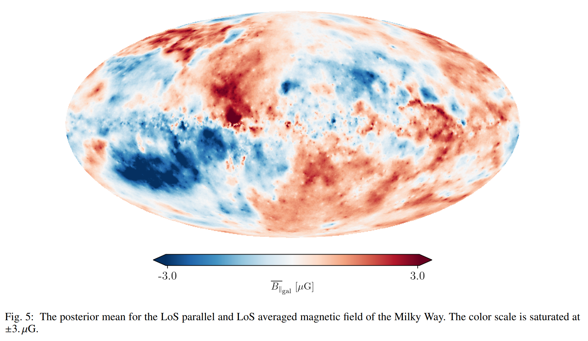

## 2023-04-03

1. [ChatGPT scores a bad birdie in counting gravitational-wave chirps](https://arxiv.org/abs/2303.17628)

   > April Fools

   目前探测到多少来自致密天体并和导致的引力波事件，不同文献数字不同，ChatGPT都回答不了这个问题。这里给了一个[数据库](http://www.broekgaarden.nl/floor/wordpress/elementor-967/)，统计了目前的探测数量，和文献中预言的未来新的探测器将会探测到的数量。

   

2. [Party Planning the Next True Happy New Year: Lunar Orbital Evolution Epochs with Integer Synodic Months Per Year](https://arxiv.org/abs/2303.17697)

   > April Fools

   `cyclostratigraphic`、`paleontological`、`tidal rhythmite`的数据证明，在过去数十亿年的时间里，太阳、地球和月球之间的角动量相互作用改变了地球和月球的轨道，因此也改变了一个月的长度。这里估计了下一次地球轨道年是整数个月的时间，大约在2.52亿年后。

   

3. [Interstellar Objects and Exocomets](https://arxiv.org/abs/2303.17980)

   > Solar System, Comet

   《Comets III》中的一章，综述奥尔特云之外的银河系彗星群。

## 2023-04-04

1. [Coherent radio bursts from known M-dwarf planet host YZ Ceti](https://arxiv.org/abs/2304.00031)

   > Stellar, Radio Burst, Binary

   观测`magnetic star-planet interaction`为确定系外行星的磁场提供了希望。理论预言，在M矮星周围近距离轨道上的类地行星，在特定的行星轨道位置，可以诱发恒星产生强偏振的相干辐射射电爆发。

   `YZ Ceti`是一个缓慢旋转的M矮星，最近的类地行星轨道周期是2天。通过2-4GHz的观测，发现在相似的轨道阶段，有两个相干爆发。尽管还不能排除是恒星磁场活动的可能，但仍然使`YZ Ceti`成为一个值得长期检测的目标。

   

2. [An Astronomers Guide to Machine Learning](https://arxiv.org/abs/2304.00512)

   > Stellar, Light Curve, Machine Learning

   光变曲线和光学成像数据中机器学习的[例子](https://github.com/sarawebb/ML_lightcurve_clustering)。

## 2023-04-05

1. [Spectro-Polarimetric variability in the repeating fast radio burst source FRB 20180301A](https://arxiv.org/abs/2304.01763)

   > Fast Radio Burst, Detection, Polarization

   Parkes对FRB180301的观测，覆盖0.7-4GHz的波段，在1.8-4GHz没有探测到爆发，在1.1GHz爆发数量达到峰值。发现DM随时间的变化$-2.7\pm0.2\, \rm pc\,cm^{-3}\,yr^{-1}$。RM发生了明显的变化，且有符号反转。大部分爆发都没有表现出偏振，有偏振的爆发的线偏振随频率降低，且没有偏振位置角的变化，与早期测量结果不同。这些测量结果，以及其它重复暴中观测到的极端偏振特性，表明FRB的progenitors处于动态磁等离子体环境中。

   

2. [Astronomical image time series classification using CONVolutional attENTION (ConvEntion)](https://arxiv.org/abs/2304.01236)

   > Stellar, Light Curve, Machine Learning, Deep Learning

   不从光变曲线中分类，直接从原始光学图像分类变源。将不同波段的单个源的光学图像重排序，使用3DCNN降采样，生成适合Attention模型的序列，加上位置编码，也即图像时间序列，用于分类。

   

## 2023-04-06

1. [Proposed host galaxies of repeating fast radio burst sources detected by CHIME/FRB](https://arxiv.org/abs/2304.02638)

   > Fast Radio Burst, Galaxy

   对CHIME用基带数据定位的那批FRB找宿主星系，大概找到了3个比较可靠。

   

2. [Measurements of the Crab Pulsar's Giant Radio Pulse Amplitude Power-Law Index Using Low-Frequency Arecibo and Green Bank Telescope Observations](https://arxiv.org/abs/2304.02589)

   > Pulsar, Giant Pulse, Energy Distribution

   用AO和GBT探测Crab低频巨脉冲，拟合幂律指数分别是$-2.63\pm0.05$和$-3.6\pm0.5$，于之前低频观测结果大致一致。

   

3. [On the correct computation of all Lyapunov exponents in Hamiltonian dynamical systems](https://arxiv.org/abs/2304.02503)

   > Chaos, Lyapunov Exponent

   Lyapunov指数是衡量混沌性的有用指标，于1980年发布。然而在哈密顿系统中，`the expected result of pairs of opposite exponents is not always obtained with enough precision.`。这里指出，`deviation vectors`的初始顺序很重要，以及如何排序以获得一个正确结果。

   

## 2023-04-07

1. [Déjà-vu et Déjà-entendu: Associating fast radio bursts with compact binary mergers via gravitational lensing](https://arxiv.org/abs/2304.02879)

   > Fast Radio Burst, Gravitational Lensing

   致密双星并和可以产生GW，也有被作为FRB产生的机制。目前还是通过空间和时间的重合，寻找可能与FRB相关的GW。但对GW和FRB之间的时间延迟知之甚少，而且两者的定位较差。这里提出，如果一个双星并和系统产生了GW和FRB，且被lensing，使用强透镜下GW和FRB图像的时间延迟，可以给出$5\sigma$的关联指示。

## 2023-04-10

1. [Machine learning-based seeing estimation and prediction using multi-layer meteorological data at Dome A, Antarctica](https://arxiv.org/abs/2304.03587)

   > Astronomy, Instrument, Machine Learning

   大气观测是评估和监测一个天文站点最重要的参数之一。能提前预测视宁度的情况可以直到观测决策，并显著提高望远镜的效率，特别是在那些环境恶劣且无人值守的天文台。

   这里使用南极层自动气象站的数据，使用LSTM神经网络来预测视宁度，未来20分钟的预测的误差为0.12角秒，且可以在一秒钟内完成视宁度的计算。

   

## 2023-04-11

1. [Prompt-to-afterglow transition of optical emission in a long gamma-ray burst consistent with a fireball](https://arxiv.org/abs/2304.04669)

   > Transient, GRB, Observation

   大质量恒星坍缩时产生的极端相对论喷流，碰撞到周边星际介质产生GRB。最初几秒`internal dissipation phase`能量释放，随后的`self-similar jet-deceleration phase`产生余辉。然而GRB的光学发射很少被探测到，限制了我们对这两个相之间过渡的理解。

   这里使用`The Ground-based Wide-angle Camera array, GWAC`探测到了GRB201223A的光学发射，与$\gamma$射线发射吻合，后期的亮度颠簸与余辉开始一致。

   

## 2023-04-12

1. [Future Constraints on Dark Matter with Gravitationally Lensed Fast Radio Bursts Detected by BURSTT](https://arxiv.org/abs/2304.04990)

   > Fast Radio Burst, Instrument, Black Hole, Gravitational Lensing

   原初黑洞是暗物质的一种可能，目前已经排除原初黑洞的质量$<10^{-16}M_\odot$和$>100M_\odot$，者之间的约束仍然很差。被lensing的FRB被认为是约束$<100M_\odot$的黑洞的有效探针。

   目前台湾计划建造一个新的望远镜`BURSTT`，专门用于探测FRB，巡天范围比CHIME大25倍，且可以通过VLBI对FRB进行定位。估计`BURSTT-2048`每年可以探测到1700个FRB，其中有24个是被lensing的，约束低至$10^{-4}M_\odot$的原初黑洞。

2. [Feature Guided Training and Rotational Standardisation for the Morphological Classification of Radio Galaxies](https://arxiv.org/abs/2304.05095)

   > Galaxy, Machine Learning, Deep Learning, Classification

   使用CNN对射电星系形态进行分类。做了adaptation，第一个是数据预处理时使用PCA，旋转星系图像将星系的主成分与坐标轴对齐。另一个是引导CNN在样本中寻找特定的特征。这样的调整可以使训练更稳定且减少训练轮数。

   

## 2023-04-13

1. [Dynamics of space debris removal: A review](https://arxiv.org/abs/2304.05709)

   > Astronomy, Satellite, Space Debris

   这篇综述讲了空间碎片的统计和规格，介绍了正在进行的清除和防止碎片产生的计划。

2. [Galactic ChitChat: Using Large Language Models to Converse with Astronomy Literature](https://arxiv.org/abs/2304.05406)

   > Astronomy, Deep Learning

   从`Galactic Archaeology`领域挑选出10篇文章，使用GPT4压缩文本

   ```
   Distill each paragraph of the given text, maintaining the same number of paragraphs and structure. Limit the word count to 50% of the original, and ensure references are included.
   ```

   使用[langchain](https://github.com/hwchase17/langchain)框架进行之后的操作。在`langchain`中，压缩后的文本使用`text-embedding-ada-002`进行`embedding`，也即特征提取成向量。使用GPT4将`expert query`和`chat history`处理成单独的问题并`embedding`，之后使用[FAISS](https://github.com/facebookresearch/faiss)将输入的问题和`embedded`的问题进行相似性搜索，最后由GPT4输出答案。

   

   使用`langchain`的具体[示例](https://github.com/liaokongVFX/LangChain-Chinese-Getting-Started-Guide)。

## 2023-04-14

1. [Quasi Real-Time Autonomous Satellite Detection and Orbit Estimation](https://arxiv.org/abs/2304.06227)

   > Astronomy, Satellite, Deep Learning, Object Detection

   用目标检测跟踪卫星。

   

## 2023-04-17

1. [Radio Galaxy Zoo EMU: Towards a Semantic Radio Galaxy Morphology Taxonomy](https://arxiv.org/abs/2304.07171)

   > Galaxy, Machine Learning, NLP, Deep Learning

   用英文标注星系，用[SpaCy](https://spacy.io/models/en#en_core_web_lg)提取相似标签，用随机森林训练星系图像匹配标签。

   

2. [Lossy Compression of Large-Scale Radio Interferometric Data](https://arxiv.org/abs/2304.07050)

   > Astronomy, Radio, Data

   压缩visibility数据

   - 使用`SVD`，将数据投影到`rank-r`的规则采样空间，在这个空间中，所有的基线数据压缩系数相同。
   - 使用`BDSVD`，将数据投影到`rank-rpq`的不规则采样空间，下标pq表示数据的秩在不同的基线pq之间变化，这使压缩系数与基线有关。

   相比传统下采样和依赖基线的平均法`BDA`，这两种方法都能同样节省空间，但能保持空间分辨率，且降低噪声方差，提高视场边缘的信噪比到1.5dB以上。

3. [A catalogue of cataclysmic variables from 20 years of the Sloan Digital Sky Survey with new classifications, periods, trends and oddities](https://arxiv.org/abs/2304.06749)

   > Stellar, Variable, Catalog

   从SDSS I-IV中观测到的507个灾变变星[目录](https://warwick.ac.uk/fac/sci/physics/research/astro/people/keithinight/sdss_paper_supplementary_information)，其中有70个新的灾变变星、59个新的周期、178个未发表的光谱和262个新的分类。

## 2023-04-18

1. [Spectral classification of young stars using conditional invertible neural networks I. Introducing and validating the method](https://arxiv.org/abs/2304.08398)

   > Stellar, Deep Learning, Simulation

   使用`Phoenix`合成光谱，训练条件可逆神经网络，用以估计恒星参数（有效温度、表面重力和消光）以及参数的后验概率分布。结果表示，在`Phoenix`中的`Settl`网格上生成的数据训练效果最好。

2. [Spectroscopic age estimates for 180 000 APOGEE red-giant stars: Precise spatial and kinematic trends with age in the Galactic disc](https://arxiv.org/abs/2304.08276)

   > Stellar, Machine Learning, Spectrum, XGBoost

   过去几年研究发现恒星丰度和年龄之间有一定的关系。使用APOGEE和Kapler观测的具有星震年龄的红巨星训练XGBoost，并使用模型估计了APOGEE观测到的约18w颗红巨星的光谱年龄。证实了2-5Gyr年龄段的金属丰度梯度比较陡峭，更大年龄段的金属丰度梯度主要由径向迁移产生。

   

## 2023-04-19

1. [Persistent and occasional: searching for the variable population of the ZTF/4MOST sky using ZTF data release 11](https://arxiv.org/abs/2304.08519)

   > Stellar, Variable, Machine Learning, Classification

   提出一个基于光变、颜色和形态的分类器，用于从ZTF DR11中识别暂现源、持续光变源和非光变源。

   模型使用了

   - 从`CatWISE`和`PS1`计算出的9种颜色
   - 从`PS1`计算的形态学分数
   - 和从`ZTF g/r`波段光变曲线计算出的61个单波段光变特征

   训练了两个分层随机森林模型，分别对应于ZTF的两个波段，将天体分为17类 - 非光变恒星和星系、三个瞬变类、五个随机光变类和七个周期光变类。

   

## 2023-04-20

1. [FAST-ASKAP Synergy: Quantifying Coexistent Tidal and Ram-Pressure Strippings in the NGC 4636 Group](https://arxiv.org/abs/2304.09795)

   > Galaxy, Radio, Observation, HI

   使用`ASKAP WALLABY`、`FAST HI`和`ALFALFA`的数据，研究`NGC 4636`中`ram-pressure`和潮汐相互作用的影响，引入了`光学盘边缘的外力强度`和`HI盘剥离程度`来量化和分解这两种效应对HI气体剥离的影响。

   

2. [The SunPy Project: An Interoperable Ecosystem for Solar Data Analysis](https://arxiv.org/abs/2304.097940)

   > Solar, Software

   [SunPy](https://github.com/sunpy/sunpy)为太阳物理学创建的python软件。

## 2023-04-21

1. [TONE: A CHIME/FRB Outrigger Pathfinder for localizations of Fast Radio Bursts using Very Long Baseline Interferometry](https://arxiv.org/abs/2304.10534)

   > Fast Radio Burst, Localization, Instrument

   在GBT旁边有8个6米的小镜子，距离CHIME有3333公里，配合CHIME做VLBI，定位FRB。目前测试对Crab定位有0.1-0.2角秒的系统误差，主要来自于钟差，与光学仪器提供的分辨率0.05角秒相当。

   

2. [Constraining the Molecular Gas Content of Fast Radio Burst (FRB) Host Galaxies](https://arxiv.org/abs/2304.10377)

   > Fast Radio Burst, Galaxy, ISM

   用ALMA看CRAFT探测到的5个FRB的宿主星系的`CO 3-2`发射，星系的红移$z\sim0.16-0.48$，从其中三个星系探测到信号。使用随金属丰度变化的`CO-H2`转换系数，估计星系的气体质量。这5个FRB的宿主星系的`气体质量-恒星质量`关系与目前宇宙中的恒星形成星系一致，气体比例为$\mu_{gas}=0.1$，气体耗尽时间为$t_{dep}\ge1Gyr$。

   

3. [VarIabiLity seLection of AstrophysIcal sources iN PTF (VILLAIN) II. Supervised classification of variable sources](https://arxiv.org/abs/2304.09905)

   > Stellar, Variable, Machine Learning, Classification, Catalog

   使用[HistGradientBoostingClassifier](https://scikit-learn.org/stable/modules/generated/sklearn.ensemble.HistGradientBoostingClassifier.html)对PTF的恒星进行分类，并给出了变星目录。

4. [A Superluminous Supernova Lightened by Collisions with Pulsational Pair-instability Shells](https://arxiv.org/abs/2304.10416)

   > Stellar, Supernovae

   超亮超新星是宇宙中能量最高的恒星爆发，其能量来源仍未可知。这里是对`SN 2017egm`的观测，是一个贫氢亚类超新星`SLSNe-I`。其亮度在最大亮度后100-350天发生颠簸，挑战了目前的模型。与总质量为$6.8-7.7M_\odot$的`circumstellar shells`的连续相互作用可以解释。

   

## 2023-04-24

1. [Neutron star phase transition as the origin for the fast radio bursts and soft gamma-ray repeaters of SGR J1935+2154](https://arxiv.org/abs/2304.10871)

   > Fast Radio Burst, Theory, Magnetar, Phase Transition

   中子星的相变可以为FRB和SGR提供动力。

## 2023-04-25

1. [Pulsar Candidate Classification Using A Computer Vision Method Combining with Convolution and Attention](https://arxiv.org/abs/2304.11604)

   > Pulsar, Machine Learning, Deep Learning, Classification

   韩金林组做的用[CoAtNet](https://github.com/chinhsuanwu/coatnet-pytorch)做的脉冲星候选体分类，使用到脉冲星信号折叠后的`Phase-Time`、`Phase-Frequency`、`DM-ReducedChi2`、`Phase-Intensity`数据作输入。

   

2. [The Performance of FAST with Ultra-Wide Bandwidth Receiver at 500-3300 MHz](https://arxiv.org/abs/2304.11895)

   > Radio, Instrument, FAST

   FAST的新超宽带的性能，覆盖`500-3300MHz`，分成四个独立波段，每个波段有`1048576=1024x1024`个通道，实现光谱分辨率为`1 kHz`。天线增益约为`14.3-7.7 K/Jy`，孔径效率为`0.56-0.3`，系统温度`88-130K`。

   

## 2023-04-26

1. [Disentangling the Faraday rotation sky](https://arxiv.org/abs/2304.12350)

   > Galaxy, Milky Way, Magnetic Field, Rotation Measure

   使用河外RM测量、河内脉冲星DM测量、轫致辐射和$H\alpha$谱线的数据测量银河系的电离介质，给出银河系视线方向磁场强度图，全天磁场强度$4\pm1.1\mu G$。

   

   以及银河系色散图。

   

## 2023-04-27

1. [Detecting HI Galaxies with Deep Neural Networks in the Presence of Radio Frequency Interference](https://arxiv.org/abs/2304.13108)

   > Galaxy, Radio, Detection, Machine Learning, Segmentation

   用`Mask RCNN + PointRend`从模拟时间-频率数据中分割星系HI信号。

   

2. [Plasma lensing with magnetic field and a small correction to the Faraday rotation measurement](https://arxiv.org/abs/2304.13210)

   > Radio, Plasma Lensing, Polarization, Theory, Fast Radio Burst

   等离子体透镜诱发双折射，除了法拉第旋转外，信号的几何延迟会引起线偏振的旋转，与频率的四次方相关。另外也会导致色散关系改变。

   

   

## 2023-04-28

1. [Classifying FRB spectrograms using nonlinear dimensionality reduction techniques](https://arxiv.org/abs/2304.139120)

   > Fast Radio Burst, Machine Learning, Classification

   用`UMAP`和`t-SNE`分别对CHIME的FRB目录中，`FRB的参数`和`FRB图像经过resnet特征提取后的向量`进行降维，说重复暴一般是窄带的，并且图像性能更好。

2. [Distinguishing a planetary transit from false positives: a Transformer-based classification for planetary transit signals](https://arxiv.org/abs/2304.14283)

   > Stellar, Light Curve, Machine Learning, Deep Learning, Transformer

   用`Transformer`分类TESS的光变曲线，并检查注意力图谱。

   

