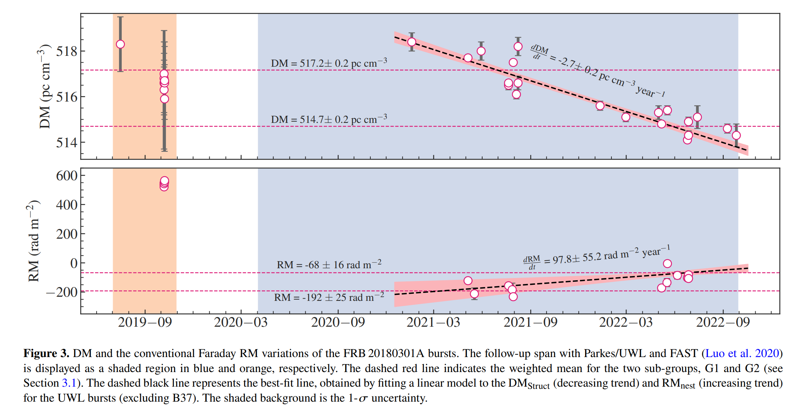

## 2023-04-03

1. [ChatGPT scores a bad birdie in counting gravitational-wave chirps](https://arxiv.org/abs/2303.17628)

   > April Fools

   目前探测到多少来自致密天体并和导致的引力波事件，不同文献数字不同，ChatGPT都回答不了这个问题。这里给了一个[数据库](http://www.broekgaarden.nl/floor/wordpress/elementor-967/)，统计了目前的探测数量，和文献中预言的未来新的探测器将会探测到的数量。

   

2. [Party Planning the Next True Happy New Year: Lunar Orbital Evolution Epochs with Integer Synodic Months Per Year](https://arxiv.org/abs/2303.17697)

   > April Fools

   `cyclostratigraphic`、`paleontological`、`tidal rhythmite`的数据证明，在过去数十亿年的时间里，太阳、地球和月球之间的角动量相互作用改变了地球和月球的轨道，因此也改变了一个月的长度。这里估计了下一次地球轨道年是整数个月的时间，大约在2.52亿年后。

   

3. [Interstellar Objects and Exocomets](https://arxiv.org/abs/2303.17980)

   > Solar System, Comet

   《Comets III》中的一章，综述奥尔特云之外的银河系彗星群。

## 2023-04-04

1. [Coherent radio bursts from known M-dwarf planet host YZ Ceti](https://arxiv.org/abs/2304.00031)

   > Stellar, Radio Burst, Binary

   观测`magnetic star-planet interaction`为确定系外行星的磁场提供了希望。理论预言，在M矮星周围近距离轨道上的类地行星，在特定的行星轨道位置，可以诱发恒星产生强偏振的相干辐射射电爆发。

   `YZ Ceti`是一个缓慢旋转的M矮星，最近的类地行星轨道周期是2天。通过2-4GHz的观测，发现在相似的轨道阶段，有两个相干爆发。尽管还不能排除是恒星磁场活动的可能，但仍然使`YZ Ceti`成为一个值得长期检测的目标。

   

2. [An Astronomers Guide to Machine Learning](https://arxiv.org/abs/2304.00512)

   > Stellar, Light Curve, Machine Learning

   光变曲线和光学成像数据中机器学习的[例子](https://github.com/sarawebb/ML_lightcurve_clustering)。

## 2023-04-05

1. [Spectro-Polarimetric variability in the repeating fast radio burst source FRB 20180301A](https://arxiv.org/abs/2304.01763)

   > Fast Radio Burst, Detection, Polarization

   Parkes对FRB180301的观测，覆盖0.7-4GHz的波段，在1.8-4GHz没有探测到爆发，在1.1GHz爆发数量达到峰值。发现DM随时间的变化$-2.7\pm0.2\, \rm pc\,cm^{-3}\,yr^{-1}$。RM发生了明显的变化，且有符号反转。大部分爆发都没有表现出偏振，有偏振的爆发的线偏振随频率降低，且没有偏振为直角的变化，与早期测量结果不同。这些测量结果，以及其它重复暴中观测到的极端偏振特性，表明FRB的progenitors处于动态磁等离子体环境中。

   

2. [Astronomical image time series classification using CONVolutional attENTION (ConvEntion)](https://arxiv.org/abs/2304.01236)

   > Stellar, Light Curve, Machine Learning, Deep Learning

   不从光变曲线中分类，直接从原始光学图像分类变源。将不同波段的单个源的光学图像重排序，使用3DCNN降采样，生成适合Attention模型的序列，加上位置编码，也即图像时间序列，用于分类。

   

## 2023-04-06

1. [Proposed host galaxies of repeating fast radio burst sources detected by CHIME/FRB](https://arxiv.org/abs/2304.02638)

   > Fast Radio Burst, Galaxy

   对CHIME用基带数据定位的那批FRB找宿主星系，大概找到了3个比较可靠。

   

2. [Measurements of the Crab Pulsar's Giant Radio Pulse Amplitude Power-Law Index Using Low-Frequency Arecibo and Green Bank Telescope Observations](https://arxiv.org/abs/2304.02589)

   > Pulsar, Giant Pulse, Energy Distribution

   用AO和GBT探测Crab低频巨脉冲，拟合幂律指数分别是$-2.63\pm0.05$和$-3.6\pm0.5$，于之前低频观测结果大致一致。

   

3. [On the correct computation of all Lyapunov exponents in Hamiltonian dynamical systems](https://arxiv.org/abs/2304.02503)

   > Chaos, Lyapunov Exponent

   Lyapunov指数是衡量混沌性的有用指标，于1980年发布。然而在哈密顿系统中，`the expected result of pairs of opposite exponents is not always obtained with enough precision.`。这里指出，`deviation vectors`的初始顺序很重要，以及如何排序以获得一个正确结果。

   

## 2023-04-07

1. [Déjà-vu et Déjà-entendu: Associating fast radio bursts with compact binary mergers via gravitational lensing](https://arxiv.org/abs/2304.02879)

   > Fast Radio Burst, Gravitational Lensing

   致密双星并和可以产生GW，也有被作为FRB产生的机制。目前还是通过空间和时间的重合，寻找可能与FRB相关的GW。但对GW和FRB之间的时间延迟知之甚少，而且两者的定位较差。这里提出，如果一个双星并和系统产生了GW和FRB，且被lensing，使用强透镜下GW和FRB图像的时间延迟，可以给出$5\sigma$的关联指示。

## 2023-04-10

1. [Machine learning-based seeing estimation and prediction using multi-layer meteorological data at Dome A, Antarctica](https://arxiv.org/abs/2304.03587)

   > Astronomy, Instrument, Machine Learning

   大气观测是评估和监测一个天文站点最重要的参数之一。能提前预测视宁度的情况可以直到观测决策，并显著提高望远镜的效率，特别是在那些环境恶劣且无人值守的天文台。

   这里使用南极层自动气象站的数据，使用LSTM神经网络来预测视宁度，未来20分钟的预测的误差为0.12角秒，且可以在一秒钟内完成视宁度的计算。

   

## 2023-04-11

1. [Prompt-to-afterglow transition of optical emission in a long gamma-ray burst consistent with a fireball](https://arxiv.org/abs/2304.04669)

   > Transient, GRB, Observation

   大质量恒星坍缩时产生的极端相对论喷流，碰撞到周边星际介质产生GRB。最初几秒`internal dissipation phase`能量释放，随后的`self-similar jet-deceleration phase`产生余辉。然而GRB的光学发射很少被探测到，限制了我们对这两个相之间过渡的理解。

   这里使用`The Ground-based Wide-angle Camera array, GWAC`探测到了GRB201223A的光学发射，与$\gamma$射线发射吻合，后期的亮度颠簸与余辉开始一致。

   

## 2023-04-12

1. [Future Constraints on Dark Matter with Gravitationally Lensed Fast Radio Bursts Detected by BURSTT](https://arxiv.org/abs/2304.04990)

   > Fast Radio Burst, Instrument, Black Hole, Gravitational Lensing

   原初黑洞是暗物质的一种可能，目前已经排除原初黑洞的质量$<10^{-16}M_\odot$和$>100M_\odot$，者之间的约束仍然很差。被lensing的FRB被认为是约束$<100M_\odot$的黑洞的有效探针。

   目前台湾计划建造一个新的望远镜`BURSTT`，专门用于探测FRB，巡天范围比CHIME大25倍，且可以通过VLBI对FRB进行定位。估计`BURSTT-2048`每年可以探测到1700个FRB，其中有24个是被lensing的，约束低至$10^{-4}M_\odot$的原初黑洞。

2. [Feature Guided Training and Rotational Standardisation for the Morphological Classification of Radio Galaxies](https://arxiv.org/abs/2304.05095)

   > Galaxy, Machine Learning, Deep Learning, Classification

   使用CNN对射电星系形态进行分类。做了adaptation，第一个是数据预处理时使用PCA，旋转星系图像将星系的主成分与坐标轴对齐。另一个是引导CNN在样本中寻找特定的特征。这样的调整可以使训练更稳定且减少训练轮数。

   

## 2023-04-13

