## 2023-05-01

1. [FAST Observations of FRB 20220912A: Burst Properties and Polarization Characteristics](https://arxiv.org/abs/2304.14665)

   > Fast Radio Burst, Observation, Detection, Polarization

   我的文章，讲FAST观测FRB20220912A。

2. [An extreme active repeating fast radio burst in a clean environment](https://arxiv.org/abs/2304.14671)

   > Fast Radio Burst, Observation, Detection, Polarization

   冯毅的文章，讲GBT观测FRB20220912A。

3. [Scintillation Arc from FRB 20220912A](https://arxiv.org/abs/2304.14697)

   > Fast Radio Burst, Sintillation

   讲从FAST观测FRB20220912A的数据中找到了scintillation arc。

4. [Revisiting constraints on the photon rest mass with cosmological fast radio bursts](https://arxiv.org/abs/2304.14784)

   > Fast Radio Burst, Cosmology

   用FRB的DM约束光子静止质量，得到上限$m_\gamma\le3.8\times10^{-51}\rm\, kg$。
   $$
   DM_\gamma(z)=\frac{4\pi^2m_e\varepsilon_0c^5}{h^2e^2}\frac{H_\gamma(z)}{H_0}m_\gamma^2\Leftarrow H_\gamma(z)=\int_0^z\frac{(1+z')^2}{\sqrt{\Omega_{m0}(1+z')^3+1-\Omega_{m0}}}dz'
   $$

## 2023-05-02

1. [Galaxy Classification Using Transfer Learning and Ensemble of CNNs With Multiple Colour Spaces](https://arxiv.org/abs/2305.00002)

   > Galaxy, Machine Learning, Deep Learning, Classification

   这个文章是作者的`Master's Thesis`，研究了`色彩空间`（RGB/XYZ/LAB）和`CNN结构`（VGG/ResNet/DenseNet/Xception）对Kaggle星系数据集分类准确性的影响。由于大多数模型都是为RGB图像设计的，这里发现在单个网络中使用转换后的色彩空间会产生更高的验证精度。

2. [A data science platform to enable time-domain astronomy](https://arxiv.org/abs/2305.00108)

   > Time Domian, Software

   [SkyPortal](https://github.com/skyportal/skyportal)是一个集成了多个时域巡天数据的平台，并使用ChatGPT生成报告。

   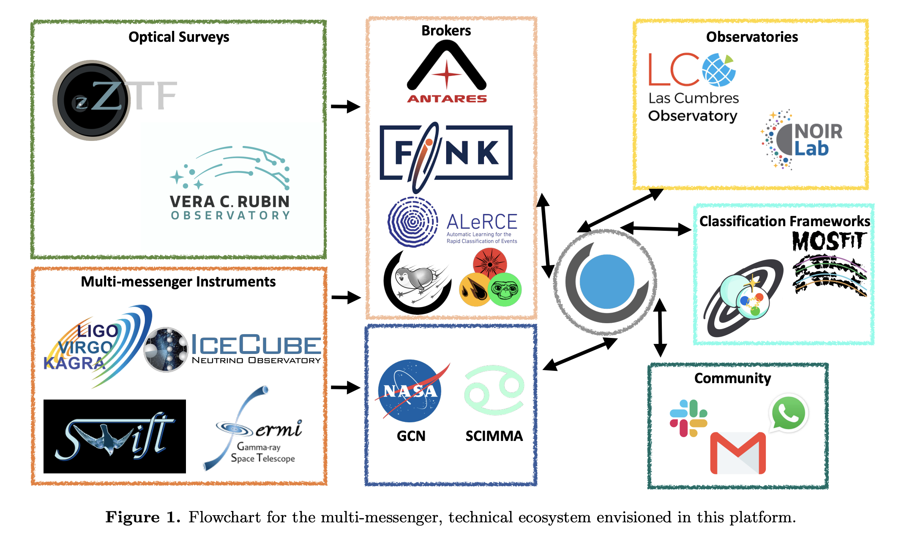

## 2023-05-03

1. [Interpretable Machine Learning for Science with PySR and SymbolicRegression.jl](https://arxiv.org/abs/2305.01582)

   > Astronomy, Machine Learning, Symbolic Regression

   [PySR](https://github.com/MilesCranmer/PySR)是基于`multi-population 进化算法`，使用[SymbolicRegression.jl](https://github.com/MilesCranmer/SymbolicRegression.jl)作后端的符号回归工具。[文章](https://github.com/MilesCranmer/pysr_paper)中引入了`EmpiricalBench`用于测试不同符号回归算法的实用性。

   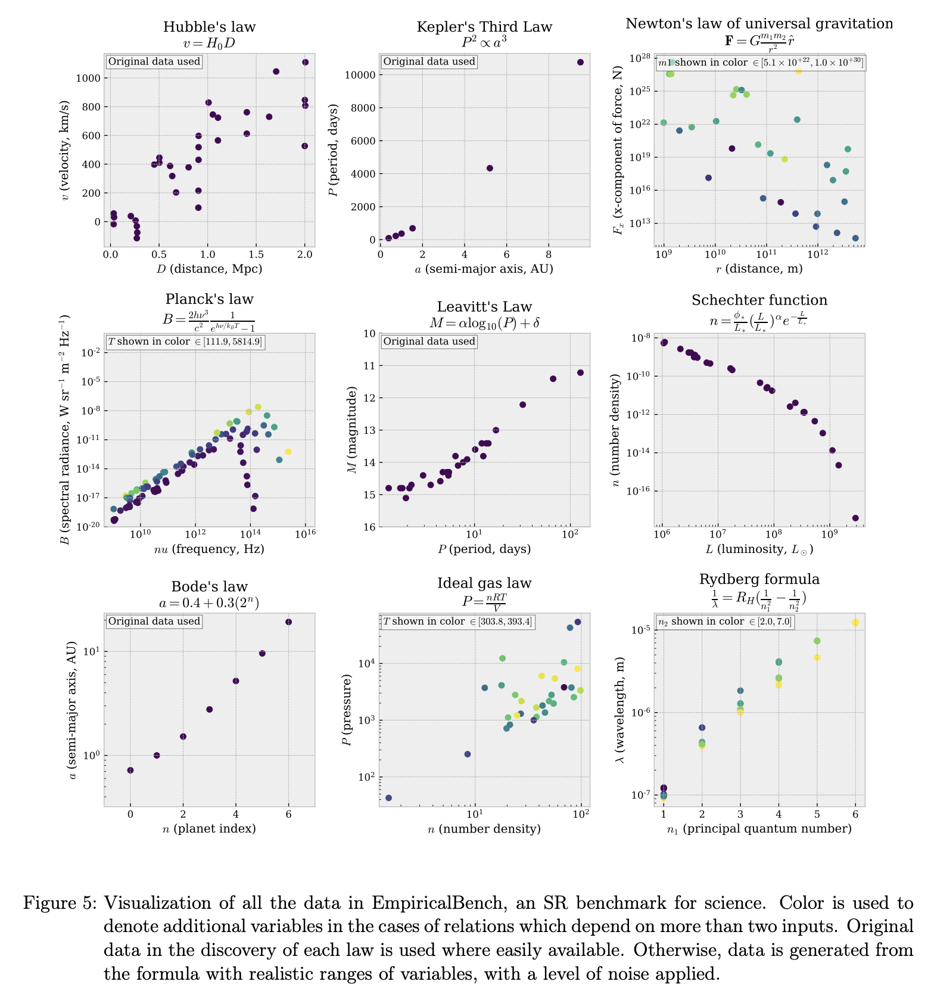

2. [An Enigmatic 380 kpc Long Linear Collimated Galactic Tail](https://arxiv.org/abs/2305.01335)

   > Galaxy, ISM

   发现一个由S0/a星系和一个高度聚集的气体和恒星尾部组成，延伸380kpc。

   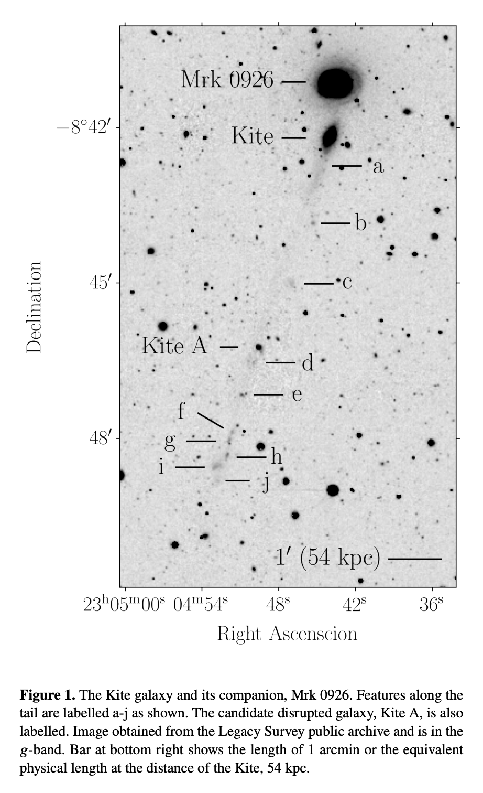

3. [Generative Agents: Interactive Simulacra of Human Behavior](https://arxiv.org/abs/2304.03442)

   > Machine Learning, NLP, Human-centered computing

   用25个ChatGPT赋予不同的人格，模拟人生。让每个人格能够记住当天发生的事情，并对第二天的事情做出决策，以及让他们做出复杂的行为。

   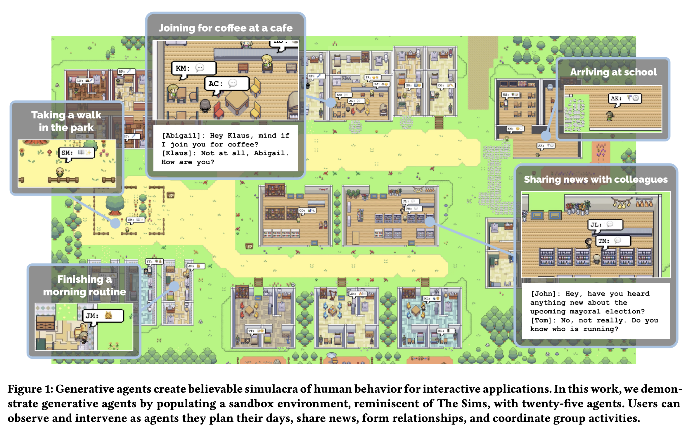

## 2023-05-04

1. [The origin of dust polarization in the Orion Bar](https://arxiv.org/abs/2305.01908)

   > ISM, Dust, Polarization, Magnetic Field

   热尘埃发射的线偏振可以用于探测磁场，因为`aspherical`颗粒往往会与磁力线对齐。但在强磁场下，颗粒对齐方向可能由磁场方向（B-RAT）转变为辐射场K向量（K-RAT）方向。

   这里使用`SOFIA HAWC+`尘埃偏振观测`Orion Bar PDR`区域，偏振方向图显示，辐射场方向平均来说不是颗粒对齐方向。

   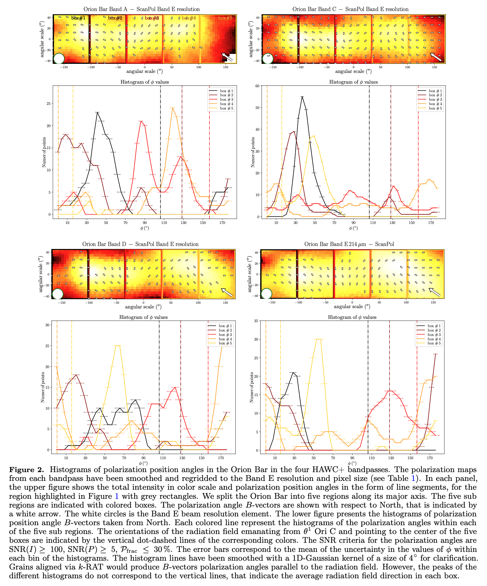

## 2023-05-05

1. [Confining Burst Energy Function and Spectral Fringe Pattern of FRB 20121102A with Multifrequency Observations](https://arxiv.org/abs/2305.02598)

   > Fast Radio Burst, Statistics

   根据FAST、AO和GBT在不同波段对FRB121102的观测，假设能量函数$dp/dE\propto E^{-\alpha_E}$，通过MCMC采样，从GBT样本中估计爆发在带宽边缘的表现。结果表明，单一幂律足以描述FRB121102的能量分布，而看到的双峰分布是由于望远镜带宽和灵敏度选择效应等带来的偏差。（但这不是循环论证吗？）

2. [On the problems of detecting Fast Radio Bursts with the LPA LPI](https://arxiv.org/abs/2305.02778)

   > Fast Radio Burst, Observation, Erratum

   过去在`Large Phased Array (LPA) radio telescope`探测到三个色散分别为247、570、1767的FRB。这里在32个频率通道数据中（原来是6通道数据）进行了验证，并没有看到相应的FRB，之前的探测结果可能是由于基线不正确扣除或者噪声不正确估计导致。

   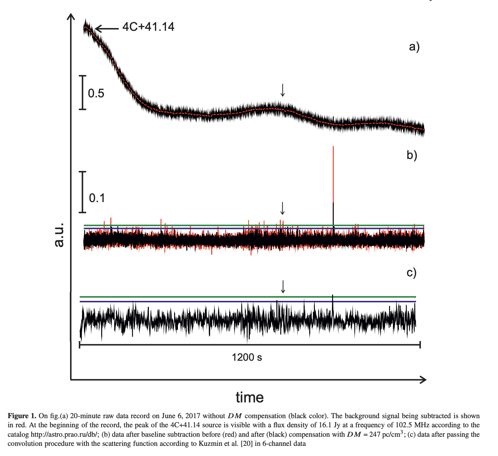

3. [Predicting Stellar Rotation Periods Using XGBoost](https://arxiv.org/abs/2305.02407)

   > Stellar, Machine Learning, XGBoost

   用XGBoost从恒星参数中预测恒星旋转周期。

4. [Inspiraling streams of enriched gas observed around a massive galaxy 11 billion years ago](https://arxiv.org/abs/2305.02344)

   > Galaxy, ISM, Star Formation

   理论认为，对于大质量星系而言，由于其本身巨大的引力势能，导致物质在塌缩过程中被激波加热，使流入星系的气体具有很高的温度，无法有效冷却，从而不能顺利聚在一起、形成恒星。然而，这一理论与新的观测相悖，因为在非常早期的宇宙中，已经发现一些大质量星系存在着剧烈的恒星形成。这也就意味着，人们还没有充分理解气体流入星系的详细过程，流入的气体如何驱动恒星形成过程也未被揭示。

   通过对红移2.3处一个大质量星系周边环境的观测，探测到中性氢、氦、电离碳的发射线，延伸到100kpc。碳的丰度表明，这些气体已经富含比氦更重的元素。进一步的光谱和数值模拟分析发现，这些富含重元素的电离气体，极为可能是早先被星系中心的活动星系核喷射到星系周围，通过复合辐射、禁戒跃迁辐射等过程冷却下来，在引力和环境角动量共同作用下，重新回流入星系，形成“循环冷气体流”。对气体动力学建模进一步表明，循环气体流是朝星系流入的，可以促进和维持恒星形成活动。

   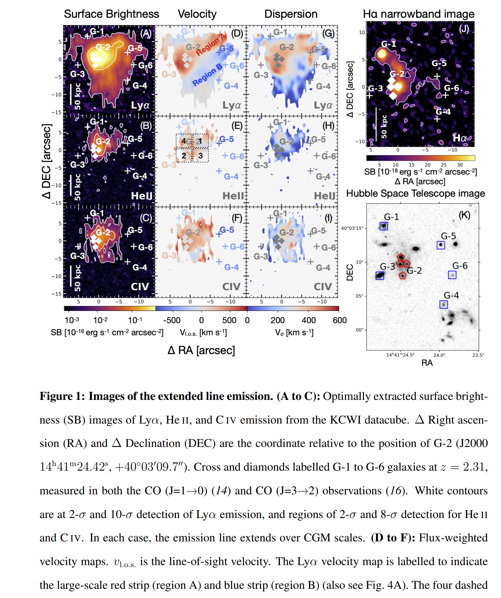

5. [Earthquake activity as captured using the network approach](https://arxiv.org/abs/2305.02775)

   > Earthquake, Machine Learning

   提出一种评估地震事件`dynamics`的方法，基于不同地震台站之间波形信号的相位，能够监测到相对较小的震级的演变。

   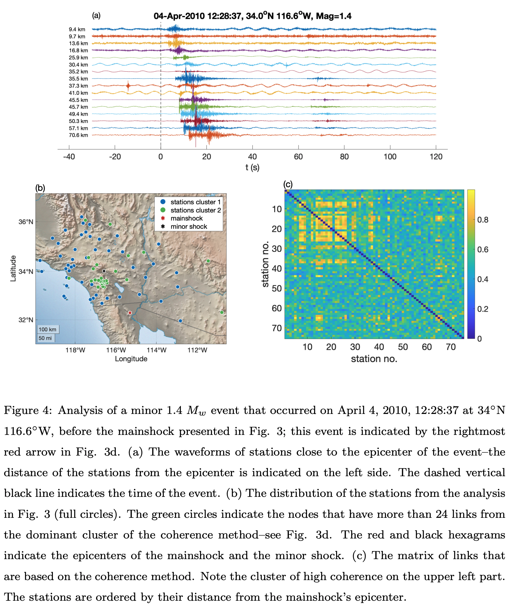

## 2023-05-08

1. [Advances on the classification of radio image cubes](https://arxiv.org/abs/2305.03435)

   > Radio, Machine Leanring, Classification

   回顾了机器学习在射电星系形态分类的应用。

   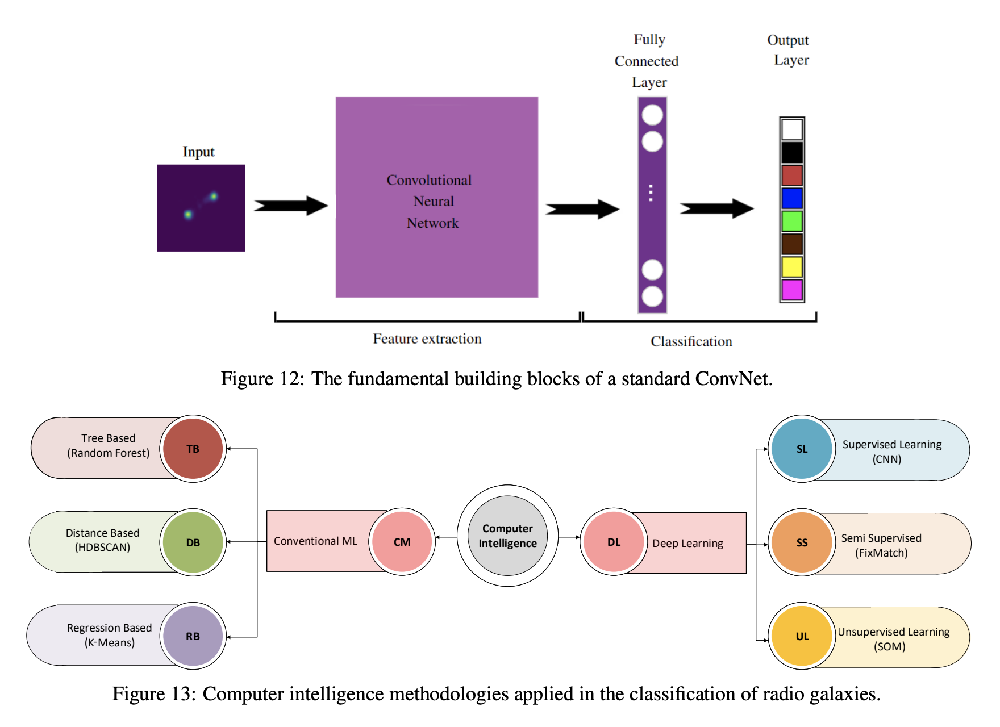

2. [Forbidden planetesimals](https://arxiv.org/abs/2305.03562)

   > Planetary Science, Solar System

   小行星在原行星盘的气体中移动时，会受到风的侵蚀而毁灭。文章尝试在微重力环境中测试，1毫米的尘埃在1Pa压力下被侵蚀所需要的剪切力。这意味着，在原行星盘中，即使是偏心率低至0.1的卵石也不能在1AU内生存。

## 2023-05-09

1. [Weakly-Supervised Anomaly Detection in the Milky Way](https://arxiv.org/abs/2305.03761)

   > Stellar, Gaia, Machine Learning, Anomaly Detection

   [CWoLA](https://github.com/hep-lbdl/GaiaCWoLa)是一种无标签分类工具，用于异常检测。这里使用`CWoLA`来识别Gaia观测中的冷恒星流。

   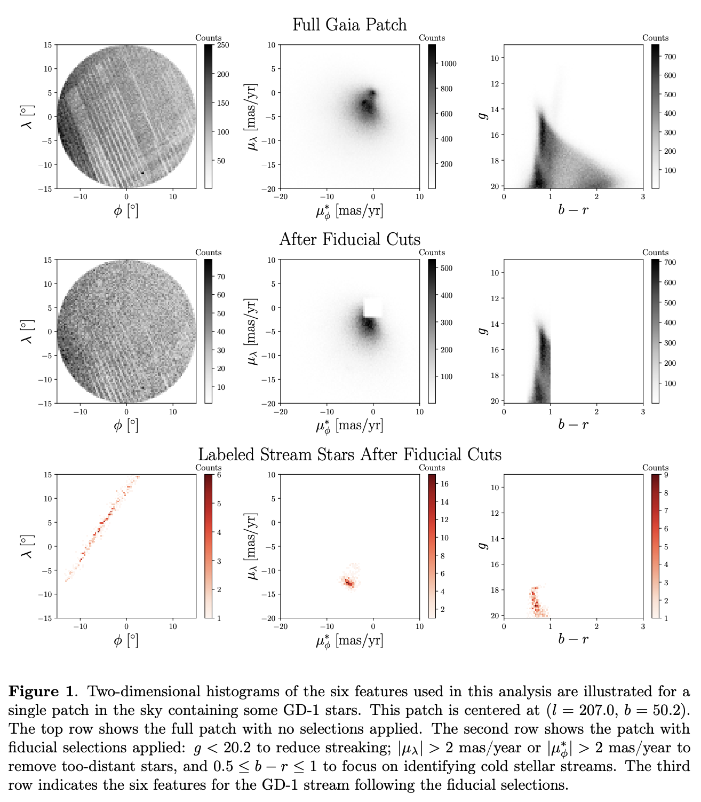

2. [Scaling and Universality in the Temporal Occurrence of Repeating FRBs](https://arxiv.org/abs/2305.04738)

   > Fast Radio Burst, Statistics

   拿121102和20201124A的waiting time做统计。先用Fluence作标准将爆发分成两段，然后用事件率作归一化。发现两个FRB的waiting time在做完归一化以后能用同一个模型拟合。

   这不是很正常的吗，就是个泊松过程，事件率归一化以后，当然一样了，再加上他们用的是CDF，抹掉了许多特征。

   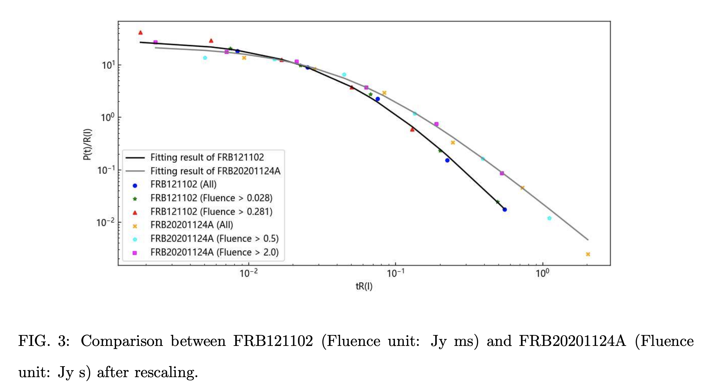

## 2023-05-10

1. [Discovery of a new lunar mineral rich in water and ammonium in lunar soils returned by Chang'e-5 mission](https://arxiv.org/abs/2305.05263)

   > Planetary Science, Lunar

   从嫦娥五号带回来的土中发现了`(NH4)MgCl3(H2O)6`，一种含水和氨的化合物。

   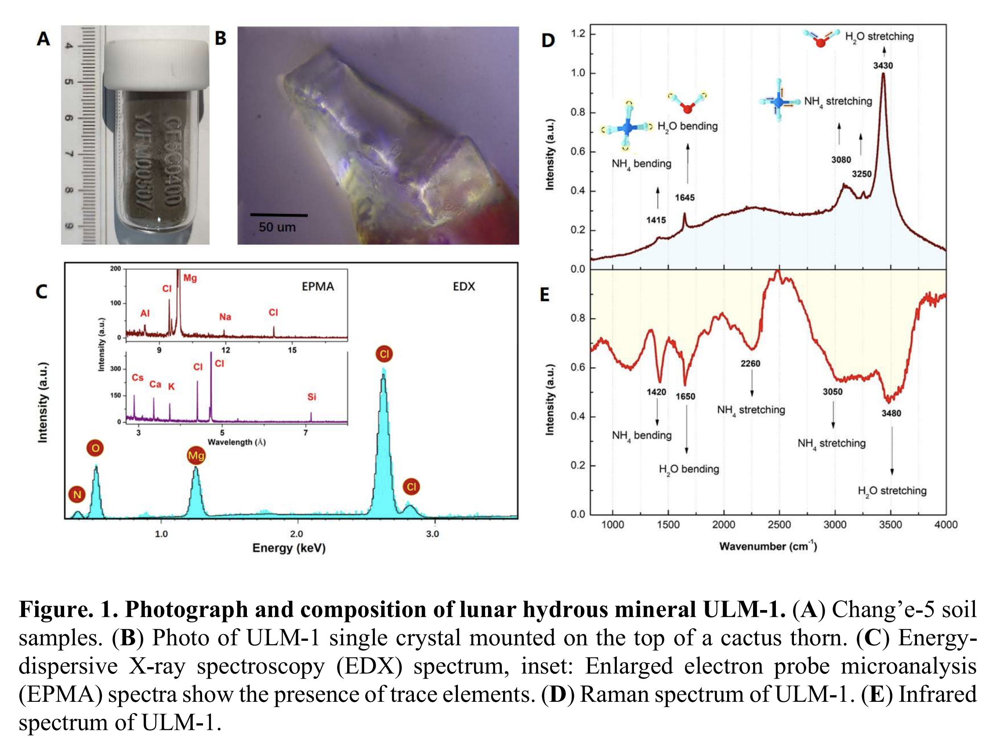

2. [Measurement of ultra-high-energy diffuse gamma-ray emission of the Galactic plane from 10 TeV to 1 PeV with LHAASO-KM2A](https://arxiv.org/abs/2305.05372)

   > High Energy, LHAASO, Gamma Ray

   LHAASO探测弥漫银河系γ射线发射`diffuse Galactic γ-ray emission`，这样的辐射主要是宇宙线和ISM之间相互作用产生的，是对宇宙线在银河系的分布、传播和相互作用的重要探测。发现银河系内部（低银纬）和银河系外部（高银纬）的能谱指数都是$-2.99$的幂律。`diffuse emission`在纬度的分布与气体一致，经度的分布与气体有轻微偏差。意味着要么存在额外的发射源，要么宇宙线的强度有空间变化。

   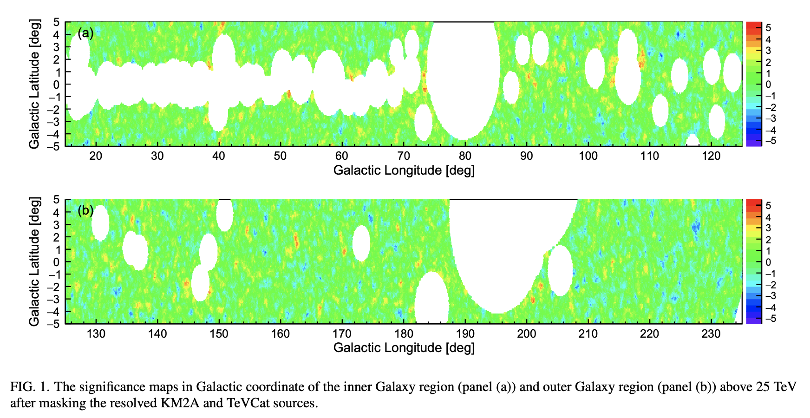

3. [Beyond Mediocrity: How Common is Life?](https://arxiv.org/abs/2305.05395)

   > Planetary Science, Astrobiology, Extraterrestrial Intelligence

   生命在合适的环境中自发出现的概率是天体生物学的主要未知数之一。由于缺乏一个工人的生命起源理论、假定地球上发生的事情有典型性，在经验和逻辑上都是有问题的。

   这里采用贝叶斯统计方法，推断生物出现的概率，发现先验（乐观的、悲观的、不可知论）对最终结果产生了最强的影响。大量可居住世界存在并不一定意味着生命在宇宙中普遍存在。

4. [Research on access, use and effective exploration of astronomical observational and bibliographical data from sonification](https://arxiv.org/abs/2305.05635)

   > Astronomy, Sonify

   考虑到残疾人在接触天文数据的障碍，利用多模态感知来补充视觉探索。这是个西语的博士论文，里面有很多数据声化的工具。

## 2023-05-11

1. [MeerKAT caught a Mini Mouse: serendipitous detection of a young radio pulsar escaping its birth sit](https://arxiv.org/abs/2305.06130)

   > Pulsar, MeerKAT, Jet

   在MeerKAT银道面X射线双星的观测中，偶然发现一个`彗星形态的射电星云`，指向之前未被识别的超新星遗迹`G45.24+0.18`。FAST在这个星云附近发现了一颗138ms的脉冲星`PSR J1914+1054g`，MeerKAT将其定位到星云头部位置。色散值约为$418\,\rm pc/cm^3$，对应$7.8-8.8\,\rm kpc$，周期导数$(2.7\pm0.3)\times10^{-14}\,\rm s\,s^{-1}$，特征年龄约为82kyr。如果中子星诞生在附近的超新星遗迹，那么其投影速度为$320-360\,\rm km/s$。但如果特征年龄准确，超新星遗迹不该这么小，或许银道面高密度环境抑制了超新星遗迹的膨胀率。

   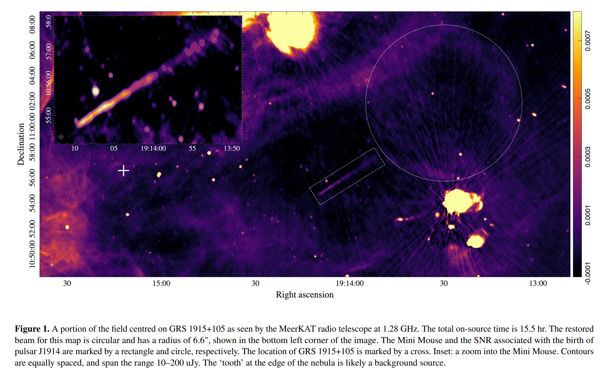

## 2023-05-12

1. [Constraints on the Hubble constant from Supernova Refsdal's reappearance](https://arxiv.org/abs/2305.06367)

   > Cosmology, Gravitational Lensing, Supernovae, Hubble Constant

   超新星`Refsdal`，通过一个大质量前景星系团，产生引力透镜。超新星与2014年出现，透镜模型预测另一个图像将于2015年出现。

   这篇文章观测到了2015年的这个图像，并结合不同的透镜模型，利用图像间的时间延迟，测量宇宙膨胀率。使用与观测结果最一致的两个模型，发现$H_0=66.6^{+4.1}_{-3.3}\,\rm km/s/Mpc$，与高红移处哈勃常数一致。

   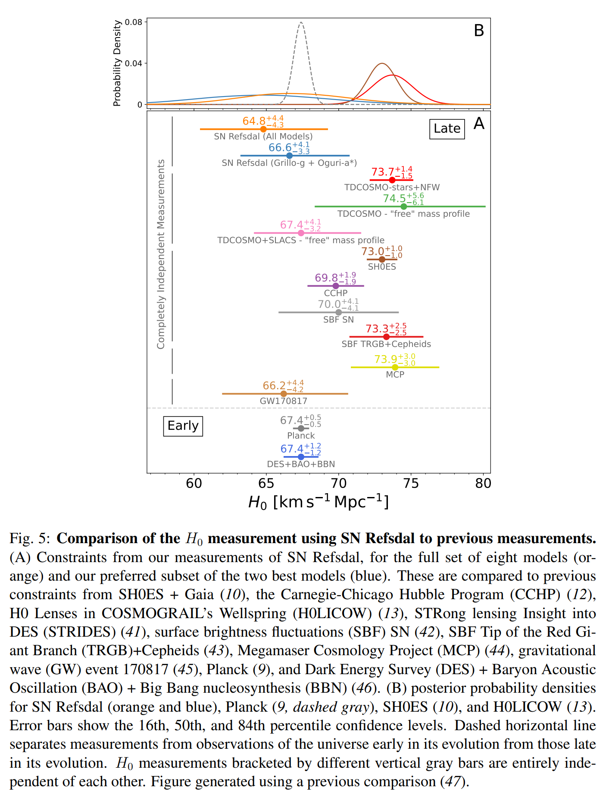

2. [The SNR of a Transit](https://arxiv.org/abs/2305.06790)

   > Stellar, Light Curve, Transit

   计算掩食光变曲线的信噪比。之前使用boxcar计算$(\delta/\sigma_0)\sqrt D$。这里证明，boxcar计算是近似的，并改进了信噪比的计算方法$(\delta/\sigma_0)\sqrt{T_{14}+2T_{23}/3}$。

3. [FAST drift scan survey for HI intensity mapping: I. preliminary data analysis](https://arxiv.org/abs/2305.06405)

   > Radio, FAST, Continuum Map

   FAST漂移扫描连续谱定标的一种方案。

4. [Propagation effects at low frequencies seen in the LOFAR long-term monitoring of the periodically active FRB 20180916B](https://arxiv.org/abs/2305.06393)

   > Fast Radio Burst, Detection, LOFAR

   LOFAR在223小时的观测中，探测到FRB180916B的11次爆发。强化了其周期随频率演化（低频相位推迟且活跃窗口更宽），且探测到明显的散射。RM也在继续减小。

   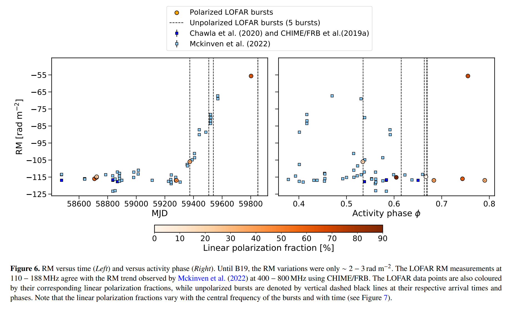

5. [Measuring the Variance of the Macquart Relation in z-DM Modeling](https://arxiv.org/abs/2305.07022)

   > Fast Radio Burs, Cosmology, DM

   来自`cosmic web`的DM的分布宽度由波动参数$F$确定，关系式$\sigma_{DM}=Fz-0.5$。这里使用78个FRB对$F$进行测量，发现在0.4<z<2区间内与`IllustrisTNG`的模拟预测一致。

## 2023-05-15

1. [A morphological analysis of the substructures in radio relics](https://arxiv.org/abs/2305.07046)

   > Galaxy, ISM, Magnetic Field, Software

   [Sub-X](https://github.com/dnswttr/Sub-X)用于从2D/3D的背景射电发射中提取子结构`filamentary structures`，用于研究星系团中弥漫射电发射。

   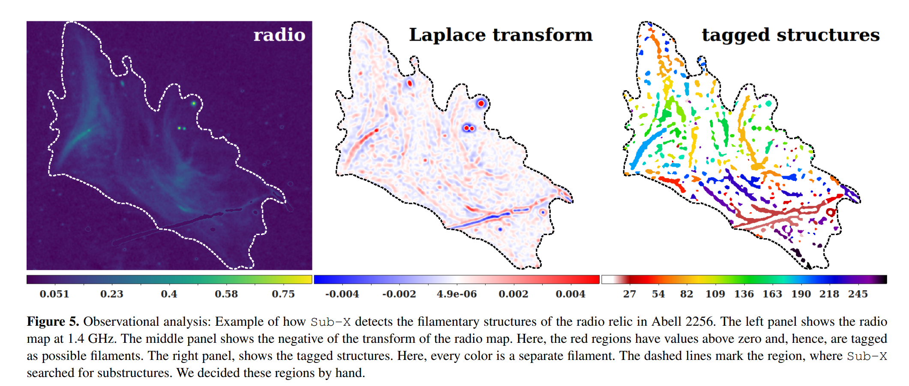

   在2D分析中，发现观测中最亮的是`filaments`，在3D模拟中，射电遗迹`radio relics`不由片状物组成，并且也没发现有投影效应可以隐藏片状结构。

2. [The nuclear reaction network WinNet](https://arxiv.org/abs/2305.07048)

   > Astronomy, Nuclear Reaction, Nucleosynthesis

   开发了类似于[XNet](https://github.com/starkiller-astro/XNet)的`WinNet`，用于计算各种天体物理环境和条件下的核合成。等发表了看看他们的技术细节。

3. [Every Author as First Author](https://arxiv.org/abs/2304.01393)

   > Digital Library

   如何让所有人都当第一作者，把所有人名字重叠起来，或者围成一个圈。代码在这里[author-stack-paper](https://github.com/edemaine/author-stack-paper)。

   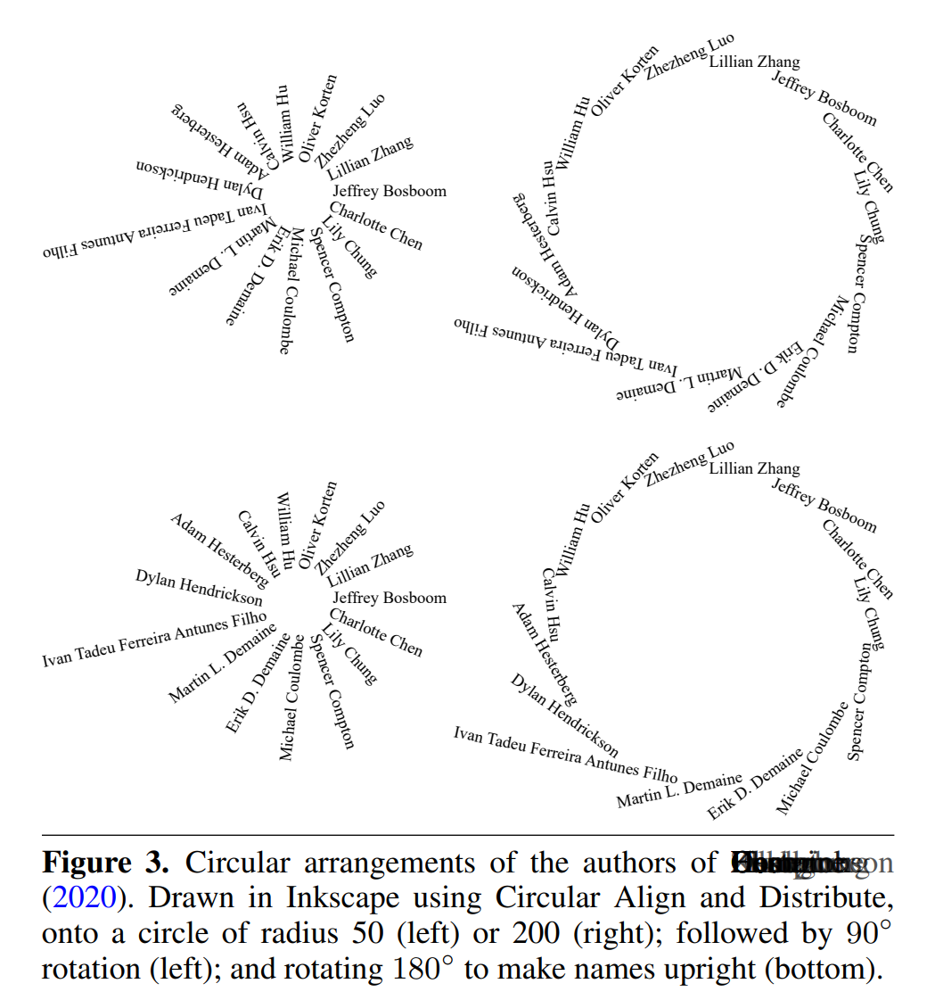

## 2023-05-16

1. [Implications of Spectra and Polarizations of Fast Radio Bursts: From Perspective of Radiation Mechanisms](https://arxiv.org/abs/2305.08649)

   > Fast Radio Burst, Theory, Polarization, Spectra

   杨元培老师的文章，讨论FRB的带宽和偏振。

   假设FRB是幂律谱，对于谱指数小于3的辐射机制（比如`synchrotron self-absorption` 谱指数 5/2，`curvature radiation by a bunch-cavity`谱指数 8/3），在半高全宽（FWHM）定义下的带宽，应有$\Delta\nu/\nu_0>0.2$。

   对于相对论粒子垂直加速的辐射机制，光谱和偏振特性取决于粒子的`deflection angle`$\psi$和`radiation beaming angle`$1/\gamma$的关系。

   - 如果窄谱是有本征辐射机制导致，要求$\gamma\psi\ll1$，这种情况下FRB的线偏振和圆偏振爆发的比例由传播效应导致。
   - $\gamma\psi\gg1$的情况下，在某些特殊分布粒子相干过程中也会产生窄谱。如果线偏振和圆偏振爆发的比例由$\gamma\psi\gg1$的辐射机制导致，那么这一比例取决于粒子的`beaming`分布。

2. [Effects of the Hunga Tonga-Hunga Ha'apai Volcanic Eruption on Observations at Paranal Observatory](https://arxiv.org/abs/2305.08620)

   > Astronomy

   汤加火山对帕拉纳尔天文台观测的影响，下图是爆发后对消光的影响。

   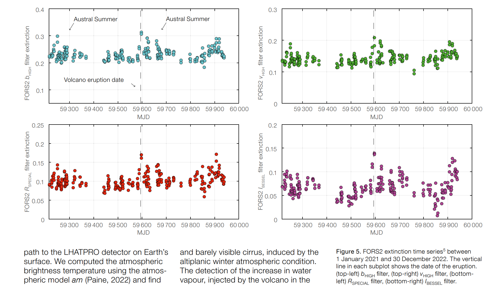

   尽管爆发发生在一年前，现在仍然能看到`stunning `令人惊叹的的日落。

## 2023-05-17

1. [Hunting for gamma-ray emission from Fast Radio Bursts](https://arxiv.org/abs/2305.09428)

   > Fast Radio Burst, GRB, Multi Wavelength

   搜索Ferimi数据中可能与FRB相关的事件，没有检测到明显的发射。

2. [Improved Type III solar radio burst detection using congruent deep learning models](https://arxiv.org/abs/2305.09327)

   > Solar, Solar Radio Burst, Machine Learning, Deep Learning, GAN, Object Detection

   用GAN生成太阳三型暴，跟LOFAR数据混合做训练集，用YoloV2检测三型暴。

   

3. [A Conditional Denoising Diffusion Probabilistic Model for Radio Interferometric Image Reconstruction](https://arxiv.org/abs/2305.09121)

   > Radio, Interferometric Imaging, Machine Learning, Deep Learning, Diffusion

   使用`Conditional Denoising Diffusion Probabilistic Model`来做射电干涉成像。在`DDPM`中，前向过程逐渐向图像中加噪声，使其成为完全的高斯图像。反向过程从图像中减噪声，使其恢复成原始图像。在训练过程中，会随机选择一个反向过程的时刻`t`，根据此时刻的带噪声图像和时刻`t`，使用UNet预测此时刻的噪声，并预测噪声为优化目标。

   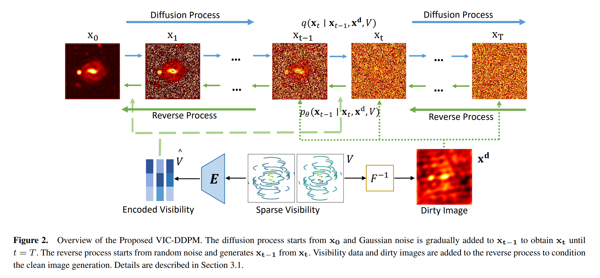

   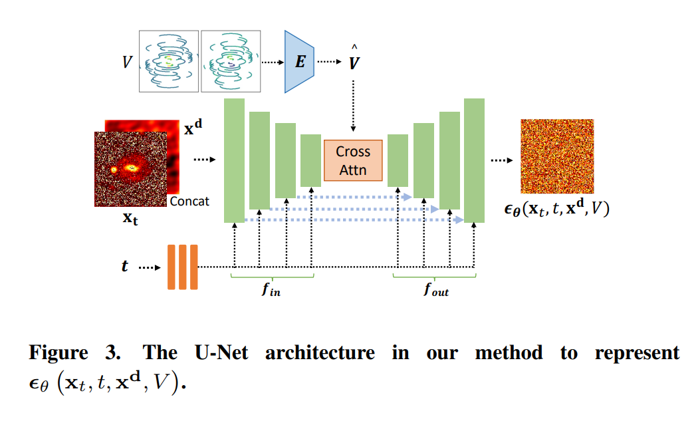

4. [Deep learning universal crater detection using Segment Anything Model (SAM)](https://arxiv.org/abs/2304.07764)

   > Planetary Science, Machine Learning, Deep Learning, Object Segment

   用`Segment Anything Model`数陨石坑。

   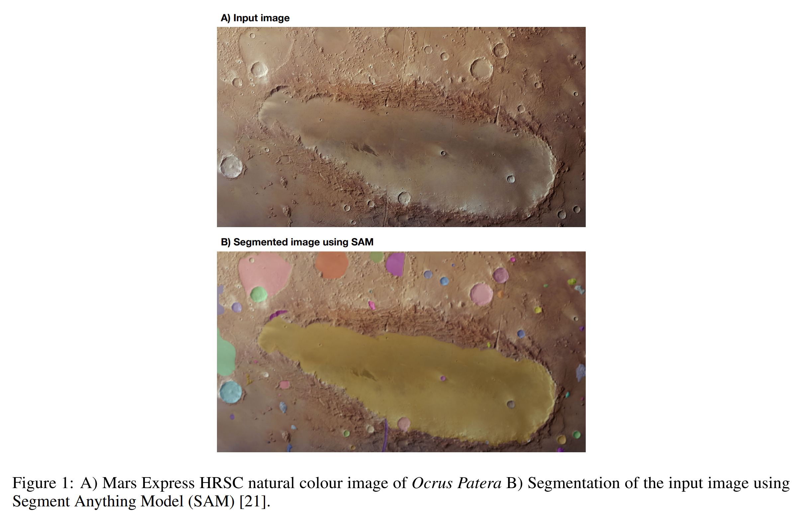

## 2023-05-18

1. [Spectral Stacking of Radio-Interferometric Data](https://arxiv.org/abs/2305.10240)

   > Radio, Spectrum, Software

   [PyStacker](https://github.com/PhangsTeam/PyStacker)，用在ALMA和NOEMA数据上，根据`CO 1-0`或者`HI`的发射测量速度，将其它信噪比低的分子线按照这个速度叠加以恢复信噪比。

## 2023-05-19

1. [MiraBest: A Dataset of Morphologically Classified Radio Galaxies for Machine Learning](https://arxiv.org/abs/2305.11108)

   > Galaxy, Radio, Machine Learning, Data

   [MiraBest](https://doi.org/10.5281/zenodo.4288837)，根据`Fanaroff-Riley`形态学分类人工标记的，NVSS和FIRST的1256个射电AGN图像数据集，红移在$0.03<z<0.1$。

## 2023-05-22

1. [Flux Calibration of CHIME/FRB Intensity Data](https://arxiv.org/abs/2305.11302)

   > Fast Radio Burst, CHIME, Technology

   CHIME对他们第一个目录中FRB的定标流程。由于其圆柱形镜面以及定位的局限性，产生的flux和fluence是FRB的下限。

2. [Two-Screen Scattering in CRAFT FRBs](https://arxiv.org/abs/2305.11477)

   > Fast Radio Burst, Scattering, Scintillation, Turbulence

   `散射`会导致FRB时间展宽，由湍流介质中辐射的多路径传播导致。`闪烁`一般认为由银河系介质导致。通过`散射`和`闪烁`测量可以用来约束散射屏。

   在多路径传播中，有
   $$
   2\pi \nu_{DC}t_{\rm scatt}=C
   $$
   其中$\nu_{DC}$是闪烁测量的` decorrelation bandwidth`，$t_{\rm scatt}$是散射测量的`时间展宽`，$C$取决于散射屏的几何和介质的密度波动，一般是$0.5-2$。另外还有
   $$
   L_xL_g\le\frac{D_s^2}{2\pi\nu^2(1+z)}\frac{\nu_{DC}}{t_{\rm scatt}}
   $$
   $L_x$和$L_g$如下图所示。

   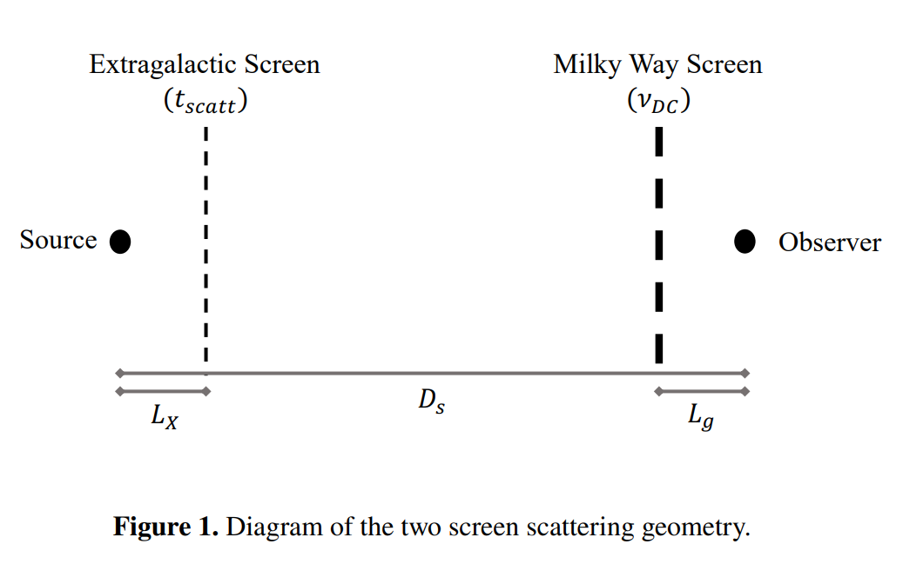

   在`ASKAP - CRAFT`的观测中，`FRB 20190608B/20210320C/20201124A`分别发现了两个散射屏的证据，离FRB源距离分别小于$16.7/3000/26\,\rm kpc$o的距离。

   以`FRB 20190608B`为例，其$\nu_{DC}=1.4\pm0.1\,\rm MHz$，$t_{\rm scatt}=4.0\pm0.4\,\rm ms$，将爆发沿着频率分割，拟合不同频率处的$\nu_{DC}$和$t_{\rm scatt}$，二者随频率的演化有幂律指数$\alpha_\nu=5.8\pm0.5$和$\alpha_t=-3\pm1$。后者符合Kolmogorov湍流中散射的预言$t_{\rm scatt}\propto \nu^{-4}$，而前者偏离了Kolmogorov湍流。有了闪烁和散射的测量，得到C的值为$35000$，暗示闪烁和散射不是同一个屏导致的结果。进一步限制$L_xL_g\le6\pm1\,\rm kpc^2$，假设$L_x\approx L_g$，那么两个屏必须分别在FRB宿主星系和银河系中。使用VLBI测量FRB的` angular broadening extent`，可以限制散射屏的距离。估计$L_g\approx0.36\,\rm kpc$，从而限制$L_x\le16.7\,\rm kpc$。

3. [Photo-zSNthesis: Converting Type Ia Supernova Lightcurves to Redshift Estimates via Deep Learning](https://arxiv.org/abs/2305.11869)

   > Stellar, Supernovae, Light Curve, Machine Learning, Deep Learning, Classification

   使用CNN对`LSST`和`SDSS`的超新星不同波长处的光变曲线构成的二维数组做分类。

   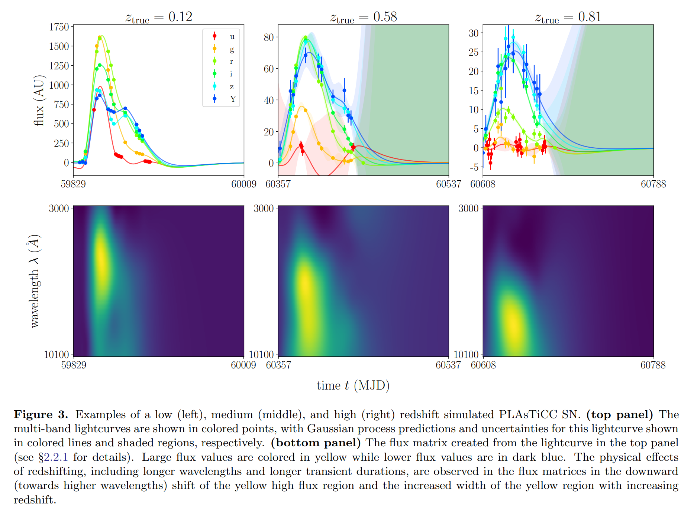

4. [Constraints on star formation in Orion A from Gaia](https://arxiv.org/abs/2305.11823)

   > Stellar, Gaia, Star Formation

   开发贝叶斯推理框架，用于从前主序星测光数据推断恒星形成历史。在框架中，改正了有星等限制的巡天中消光的偏差，另外还对没有分辨开的双星进行了适当的修正。

   应用到OrionA中，发现其中恒星形成在`0.3-5 Myr`的时间内以相对稳定的速度进行。

## 2023-05-23

1. [Connecting the Young Pulsars in Milky Way Globular Clusters with White Dwarf Mergers and the M81 Fast Radio Burst](https://arxiv.org/abs/2305.11933)

   > Fast Radio Burst, Pulsar, White Dwarf

   在银河系球状星团中探测到4颗明显年轻的脉冲星，由于是在球状星团中，因此很难想象是大质量恒星演化后的产物。

   这里讨论其由白矮星并合形成的可能性。根据观察到的磁白矮星的特性，白矮星并和形成的中子星自转周期约10-100ms，磁场$10^{11}-10^{13}\,\rm G$，当这些中子星通过磁偶极辐射`spin down`后，会自然再现看到的4颗中子星。这样的驱动机制或许是M81球状星团中FRB 20200120E的形成原因。

   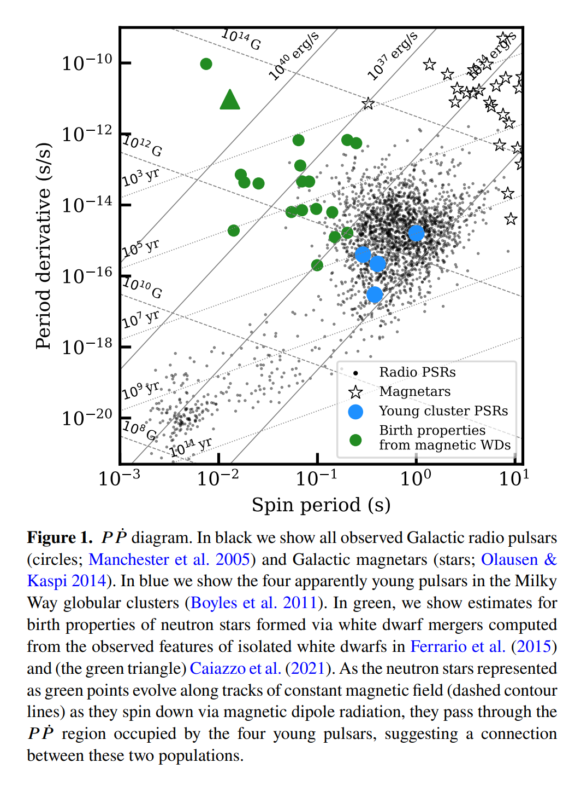

2. [VanillaNet: the Power of Minimalism in Deep Learning](https://arxiv.org/abs/2305.12972)

   > Machine Learning, Deep Learning

   陈汉亭华为那边的文章，设计了[VanillaNet](https://github.com/huawei-noah/VanillaNet)，以更小的模型实现更高的性能，6层可以超过ResNet-34，13层的VanillaNet在ImageNet达到83%的top1精度，超过几百层网络的性能。

   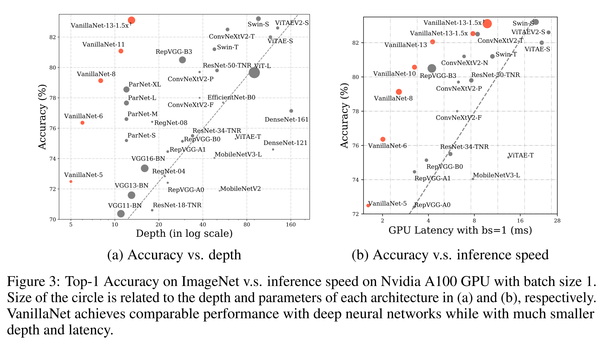

3. [Grad-CAM++: Improved Visual Explanations for Deep Convolutional Networks](https://arxiv.org/abs/1710.11063)

   > Machine Learning, Deep Learning

   [Grad-CAM++](https://github.com/adityac94/Grad_CAM_plus_plus)，利用最后一个卷积层提取的特征正偏导数的加权组合，来生成深度学习模型良好的视觉解释。

   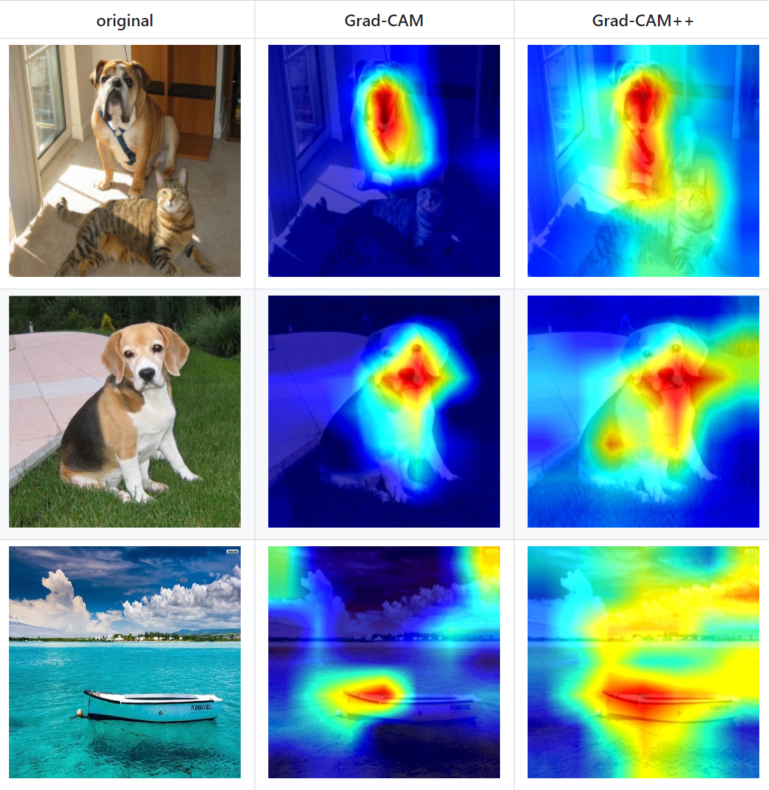

## 2023-05-24

1. [Unveiling the time evolution of chemical abundances across the Milky Way disk with APOGEE](https://arxiv.org/abs/2305.13378)

   > Galaxy, Stellar, Chemistry

   化学丰度反应银河系元素富集历史，由于`radial mixing`过程，星际介质丰度梯度随时间演化丢失了。这里使用APOGEE DR17中的红巨星，将银盘中元素的丰度演变映射为`lookback time`和`Rbirth`的函数。发现金属梯度在9/6/4 Gyr前有过三次波动，第一次与`Gaia-Sausage-Enceladus disruption`时间一致，其他的可能与人马座矮星系的穿越有关。

   

   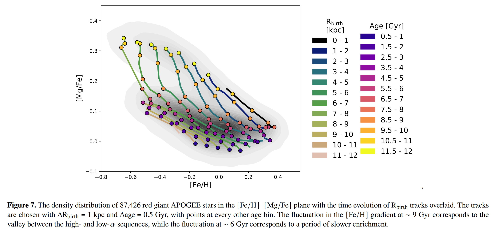

## 2023-05-25

1. [WALLABY Pilot Survey: HI in the host galaxy of a Fast Radio Burst](https://arxiv.org/abs/2305.14863)

   > Fast Radio Burst, Galaxy, HI

   使用ASKAP对`FRB20211127I`的宿主星系`WALLABY J131913-185018`的HI观测，红移0.04是目前CRAFT和WALLABY合作观测中，检测到HI发射最远的FRB宿主星系。HI质量$M_{HI}=6.5\times10^9\, M_\odot$，与恒星质量比为2.17，与1.4GHz的`continuum radio source`的流量1.3mJy吻合。

   其它FRB宿主星系，要么HI强烈不对称，要么又明显的被破坏的HI强度分布。`W13-18`的HI似乎不对称，但由于信噪比较低，无法确认这一点。但是`W13-18`的HI和光学图像中，没有强烈的迹象表明会刺激恒星形成的爆发，从而产生与FRB原生体相关的大质量恒星及其致密残余。

## 2023-05-26

1. [Radio Observations of Six Young Type Ia Supernovae](https://arxiv.org/abs/2305.15481)

   > Stellar, Supernovae, Radio

   Ia型超新星形成过程中，喷出物`ejecta`和星周物质`circumstellar material, CSM`之间的相互作用可能会产生同步辐射，这样的辐射在射电波段可以检测到。因此，如果对早期Ia型超新星进行射电观测，有可能约束`低密度星风的存在`，以及提供新的观测途径，对于有光学/紫外光过剩的Ia型超新星（CSM可以造成）。这里用VLA对六个Ia型超新星的观测，没有探测到射电发射。

## 2023-05-29

1. [A Search for Extraterrestrial Technosignatures in Archival FAST Survey Data Using a New Procedure](https://arxiv.org/abs/2305.16356)

   > Radio, RFI, SETI

   张同杰他们的文章，用`霍夫变换`消FAST的RFI。

2. [The FAST Galactic Plane Pulsar Snapshot Survey: IV. Timing results of 30 FAST-GPPS discovered pulsars](https://arxiv.org/abs/2305.16754)

   > Pulsar, Radio, Timing

   老韩他们的文章，FAST对30颗脉冲星的计时解。一个结论是，同一颗脉冲星在FAST不同观测模式、不同波束得到的TOA可以结合到一起，用于做计时解。

3. [RMTable2023 and PolSpectra2023: standards for reporting polarization and Faraday rotation measurements of radio sources](https://arxiv.org/abs/2305.16607)

   > Radio, Polarization, RM, Catalog

   RM在不同的地方以不同的格式发表，并且用于拟合RM的偏振动态谱也很少公布，限制了随着新方法或者额外观测的出现而重新分析数据的能力。

   这里提出[RMTable2023](https://github.com/CIRADA-Tools/RMTable)和[PolSpectra2023](https://github.com/CIRADA-Tools/PolSpectra)，约定用于统一RM表格和偏振光谱的标准。并且在`RMTable2023`中，已经制作了从42个目录中收集的55819个RM的目录。

   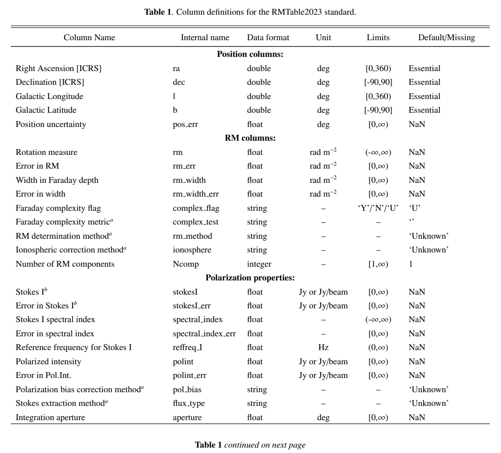

4. [An end-to-end strategy for recovering a free-form potential from a snapshot of stellar coordinates](https://arxiv.org/abs/2305.16845)

   > Stellar, Dynamics, Machine Learning, Deep Learning, Symbolic Regression 

   提出一个端到端的方案，用于从恒星的位置和速度的snapshot中恢复`free-form potential`。使用RNN作为引力势从恒星位置和速度恢复轨道，并使用`PhySO`，在**2023-03-20**中提到的符号回归方案来解释RNN。

   

## 2023-05-30

1. [Tidal capture of an asteroid by a magnetar: FRB-like bursts, glitch and anti-glitch](https://arxiv.org/abs/2305.17316)

   > Fast Radio Burst, Theory, Asteroid

   假想磁星捕获并破坏小行星，小行星角动量转移到磁星上，如果小行星轨道角动量与磁星角动量平行/反平行，就会发生`glitch/anti-glitch`，随后小行星碎片落到磁星表面，穿过磁力线，通过曲率辐射产生FRB。

2. [The Host Galaxy of FRB 20171020A Revisited](https://arxiv.org/abs/2305.17960)

   > Fast Radio Burst, Galaxy, HI

   `FRB 20171020A`是ASKAP探测到的一个非重复暴，由于没有检测到重复的爆发，难以直接确认其宿主星系。最近重新审查了这个FRB，估计了一个宿主星系`ESO 601-G036`，置信度为98%，距离我们37Mpc，是到目前为止第三近的FRB宿主星系。

   由于距离近，可以对`ESO 601-G036`进行详细的多波段分析，发现其是一个典型的恒星形成星系，恒星形成率为$SFR=0.09\pm0.01 M_\odot$。探测到一个弥漫气体尾，可能是与`ESO 601-G037`相互作用的结果。这种相互作用会影响星系的气体成分和恒星，这种活动与磁星模型或者其它FRB宿主星系的相互作用迹象一致。

3. [FRBs' Brownian Motion on Time-Energy Bivariate Space](https://arxiv.org/abs/2305.18052)

   > Fast Radio Burst, Statistics

   我的文章，将不同物理过程放在随机性-混沌性相空间中进行比较。

4. [Estimation of the flux at 1450MHz of OB stars for FAST and SKA](https://arxiv.org/abs/2305.17361)

   > Stellar, Radio

   射电观测有助于理解OB星的星风机制。这里估计了5000颗OB星在1450MHz的流量，这些OB星是结合LAMOST光谱测量和Gaia天体测量确认的。流量估计时，假设星风的辐射机制是`free-free emission`，质量损失率由恒星参数得出，得到$S_{1.4GHz}\sim3-11\,\rm Jy$，完整的SKA-II可以探测到其中一半以上的源。如果不考虑`confusion`，FAST也可以探测到几十个源，而FAST阵列可以使探测的样本增加两个数量级。

## 2023-05-31

1. [Simultaneous and panchromatic observations of the Fast Radio Burst FRB 20180916B](https://arxiv.org/abs/2305.18628)

   > Fast Radio Burst, Observation, Multi Wavelength

   在2020.10-2021.08期间的8个活动周期中，对FRB 180916进行了多波段的观测，从射电（SRT-336/1547MHz、uGMRT - 400MHz），到光学（Asiago、CMO SAI MSU、CAHA、RTT-150、TNG），到高能（AGILE、Insight-HXMT、INTEGRAL、Swift）。在SRT的336Mhz探测到14个爆发，和uGMRT探测到7个爆发。光学和高能没有暂现源事件探测。

   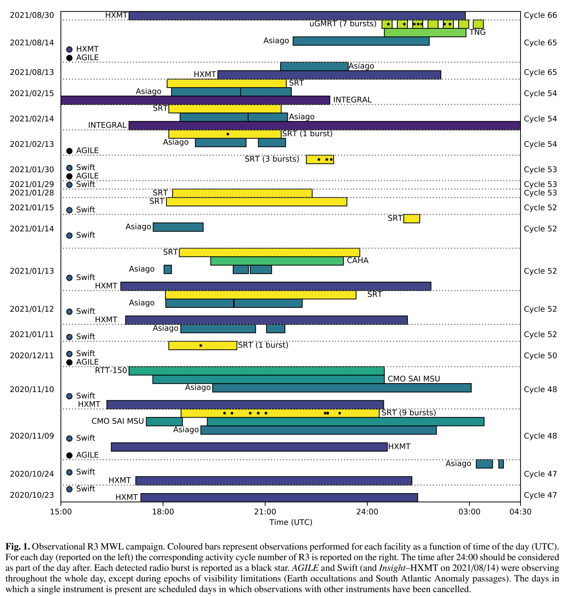

   其中TNG/SiFAP2的观测时间覆盖了uGMRT探测到的爆发，给出$E_{\rm optical}/E_{\rm radio}<1.3\times10^2$。Insight-HMXT的观测时间覆盖了SRT探测到的一个爆发，给出$E_{\rm xray}/E_{\rm radio} \in (0.9-1.3)\times10^7$。

2. [A 4-8 GHz Galactic Center Search for Periodic Technosignatures](https://arxiv.org/abs/2305.18527)

   > Radio, SETI

   SETI搜索以发现`窄带连续波信号`和`人工色散宽带爆发`为目标。另外，周期性的脉冲序列提供了一种能量上高效的星际传输手段，[blipss](https://github.com/UCBerkeleySETI/blipss)基于GPU的FFA算法，寻找射电光谱中的全频道周期信号。

