## 2023-06-01

1. [Inferring redshift and energy distributions of fast radio bursts from the first CHIME/FRB catalog](https://arxiv.org/abs/2305.19692)

   > Fast Radio Burst, Statistics

   用定位好的FRB推$DM_{E}-z$的关系，用推导出的$DM_{E}-z$的关系推断CHIME/FRB的红移和能量。

2. [Free Energy of Anisotropic Strangeon Stars](https://arxiv.org/abs/2305.19687)

   > Strangeon Star, Theory, Fast Radio Burst

   类脉冲星的致密天体除了转动能，在各向异性极小的奇子星中，更大的自由能$>10^{46}\,\rm erg$可以通过星震释放。

## 2023-06-02

1. [GW190425 and FRB20190425A: Challenges for Fast Radio Bursts as Multi-Messenger Sources from Binary Neutron Star Mergers](https://arxiv.org/abs/2306.00948)

   > Fast Radio Burst, Gravitational Wave, Observation

   最近研究认为双中子星并合产生的GW190425和FRB20190425A之间可能存在$2.8\sigma$的关联，并认为双中子星合并后产生高度磁化的超大质量中子星，在塌缩成黑洞前稳定存在了2.5小时。

   这篇文章发现，如果FRB能被探测到，那么这个BNS并合系统必须是`axis on`的。但是GW的数据给出BNS并合的`viewing angle`大于30度的可能超过了99.99%，排除了系统是`axis on`的可能，因此认为FRB和GW之间没有关联，并认为BNS并合不能解释$>1\%$的FRB形成。

2. [How limiting is optical follow-up for fast radio burst applications? Forecasts for radio and optical surveys](https://arxiv.org/abs/2306.00084)

   > Fast Radio Burst, Multi Wavelength, Galaxy, Optical

   用`frbpoppy`模拟FRB巡天观测，用`GALFORM`模拟宿主星系。

   根据FRB随恒星形成率或者恒星质量的两种形成方式，估计CHIME FRBs的红移将达到$z\sim3$，SKA1-Mid FRBs的红移将达到$z\sim5$。但并不是所有FRB的宿主星系都可以被光学观测到，

   - 类似SDSS的巡天中，将观测到20-40%的CHIME/FRB的宿主星系，这一类宿主星系的红移$z<0.5$。
   - 更深的DELVE巡天中，将观测到63-85%的ASKAP/FRB的宿主星系。

   如果1/2的ASKAP/FRB有可靠的红移，那么1000个FRB探测就可以在95%的置信度下约束$\Omega_bh_{70}$。

3. [Searches for Giant Pulses from Extragalactic Pulsars](https://arxiv.org/abs/astro-ph/0304365)

   > Pulsar, Giant Pulse, Fast Radio Burst

   Jim在2003年的文章，描述单脉冲搜索方法和条件。并介绍了对M33、LMC和其它几个星系的搜索，在M33中找到一个SNR=9的脉冲。如果真的是在M33，那么这个脉冲的能量将接近SGR1935的FRB，或许这个才是第一个FRB。

4. [Fine structures of radio bursts from flare star AD Leo with FAST observations](https://arxiv.org/abs/2306.00895)

   > Stellar, Radio Burst, Flare

   M型矮星会产生射电暴（像太阳一样），其子结构或者精细结构可以用于研究恒星的等离子体和磁场特征。这里使用FAST对已知耀斑恒星`AD Leo`进行高时间分辨率的观测。在第一天的观测发现了频率漂移率一致的条纹状爆发，类似于`Jovian S-bursts`。第二天的观测发现了随机的圆球状爆发，类似于`solar radio spikes`。这样的观测表明，`AD Leo`的发射是由电子回旋加速的不稳定性驱动的，可能与恒星耀斑或者行星相互作用有关。

   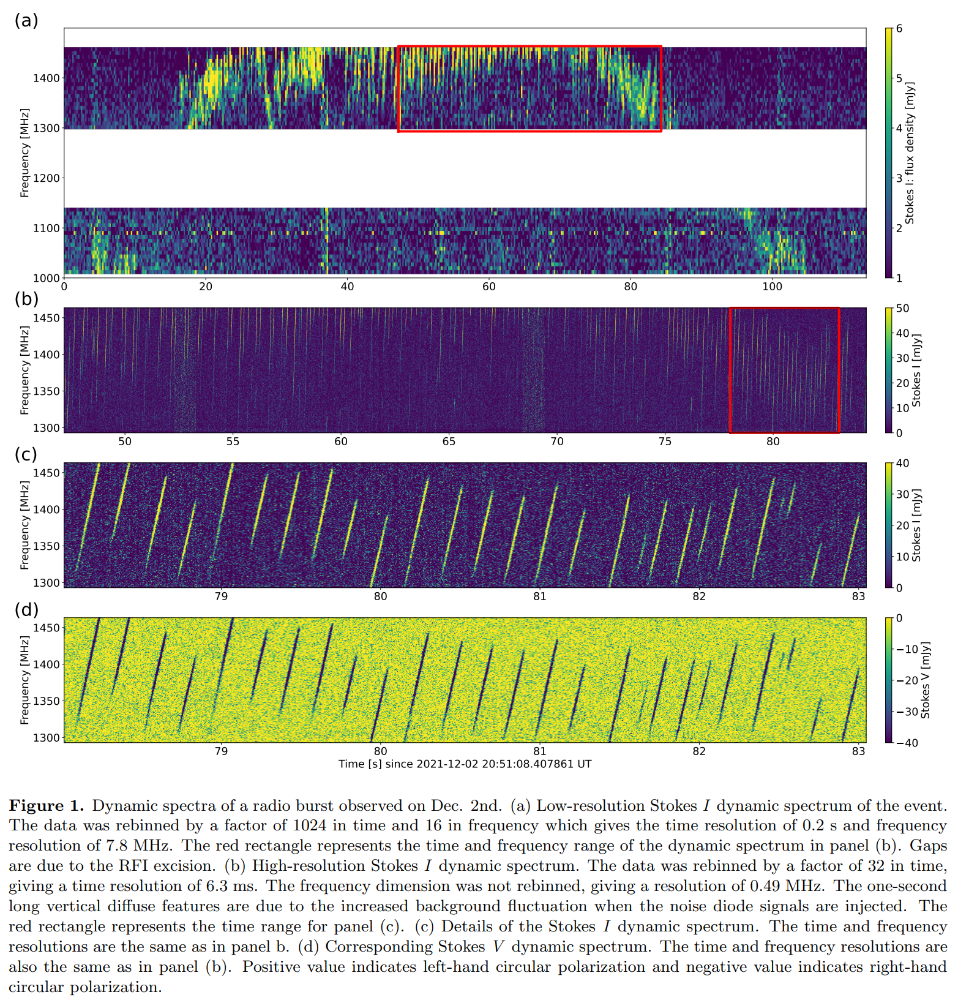

   

5. [Morphological Classification of Radio Galaxies using Semi-Supervised Group Equivariant CNNs](https://arxiv.org/abs/2306.00031)

   > Galaxy, Machine Learning, Deep Learning, Classification

   第一次看到孟加拉国的文章。将射电星系分类为`Fanaroff-Riley`I/II型的形态学分类。

   使用`Group Equivariant Convolutional Neural Network, G-CNN`作为`A Simple Framework for Contrastive Learning of Visual Representations, SimCLR`和`Bootstrap Your Own Latent, BYOL`的编码器，使用射电星系数据进行表征学习`representation learning`，也即一种自监督学习。之后使用少量标记的星系，结合全连接分类器进行微调。结果表明，这种半监督分类器的性能超过了全监督的`G-CNN`的性能。

   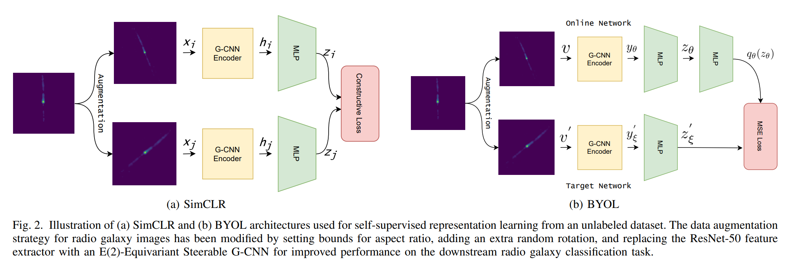

## 2023-06-05

1. [HI Absorption in Low-power Radio AGNs Detected by FAST](https://arxiv.org/abs/2306.01050)

   > Galaxy, AGN, Radio

   在FAST观测中探测到三个`low-power`活动星系核的HI吸收。

   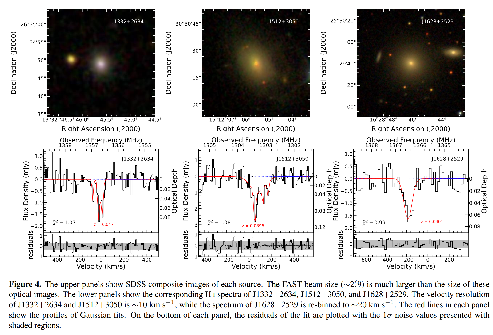

2. [Distance of PSR B0458+46 indicated by FAST HI absorption observations](https://arxiv.org/abs/2306.01246)

   > Pulsar, HI, Radio

   对`PSR B0458+46`进行HI观测，定标后，按脉冲星周期折叠，对pulse-on和pulse-off部分分别时间平均并相减，得到HI吸收谱。根据HI速度，估计吸收云的距离在$2.7^{+0.9}_{-0.8}\,\rm  kpc$，位于英仙臂之外。吸收意味着脉冲星在吸收云后，所以`PSR B0458+46`也在英仙臂之外，因此与`SNR HB9`无关。

   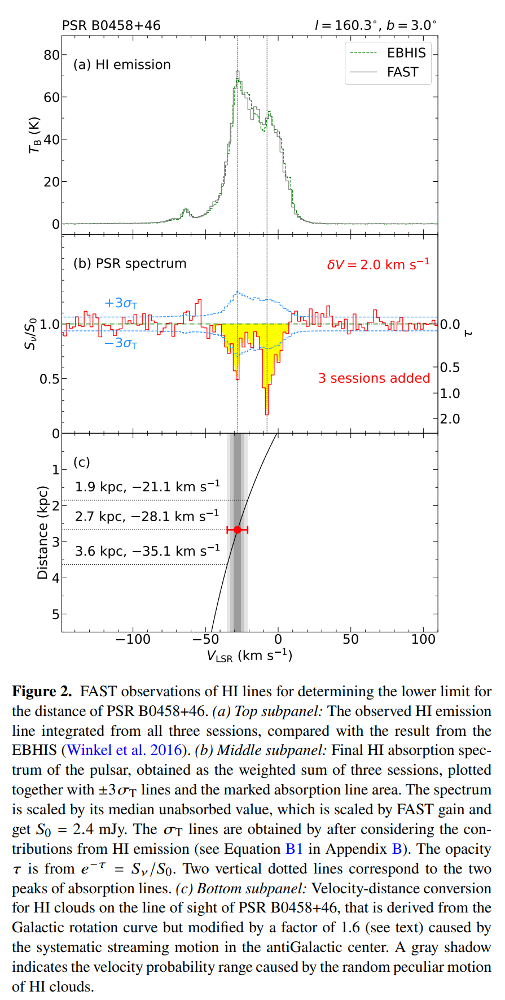

3. [Lensing reconstruction from the cosmic microwave background polarization with machine learning](https://arxiv.org/abs/2306.01516)

   > Cosmology, CMB, Lensing

   用`Residual Dense Local Feature U-net`重建CMB场。

4. [Radio Sources Segmentation and Classification with Deep Learning](https://arxiv.org/abs/2306.01426)

   > Galaxy, Radio, Machine Learning, Deep Learning, Image Segmentation

   用`MASK RCNN`对射电星系进行分割并分类，代码将会发布在[HeTu-V2](https://github.com/lao19881213/RGC-Mask-Transfiner)。

   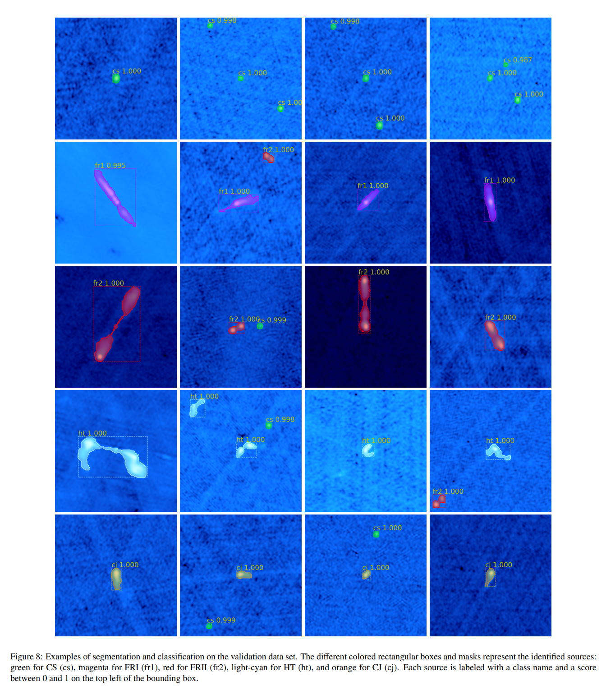

## 2023-06-06

1. [Periodically Modulated FRB as Extreme Mass Ratio Binaries](https://arxiv.org/abs/2306.01877)

   > Fast Radio Burst, Theory

   猜想FRB周期可能是黑洞吸积盘旋转轴进动导致，并进一步可以约束黑洞的质量。另外，这一模型和磁星-SNR模型对RM的演化预言不同，SNR预言RM减小 $\propto r^4\propto t^4$，这一模型预言RM随机变化，并可能产生符号反转。

2. [Exploring Proxies for the Supermassive Black Hole Mass Function: Implications for Pulsar Timing Arrays](https://arxiv.org/abs/2306.01832)

   > Black Hole, Gravitational Wave, PTA

   星系中心超大质量黑洞的质量与宿主星系的质量相关，意味着这些黑洞的演化历史相互联系。星系并合后形成的双黑洞系统可以产生脉冲星计时阵可探测的背景引力波。

   对背景引力波性质的推断依赖黑洞质量函数。目前黑洞质量函数是由观测到的星系恒星质量推断出来的。这里使用速度弥散函数直接估计黑洞质量函数，发现与以前的模型相比，双黑洞系统在高红移处有着更多的大质量系统。

## 2023-06-07

1. [Systematic performance of the ASKAP Fast Radio Burst search algorithm](https://arxiv.org/abs/2306.03886)

   > Fast Radio Burst, Simulation

   检验ASKAP上FRB搜索流程`FREDDA`的完备性，在DM小于3000时，FREDDA可以找到85%的信号。

   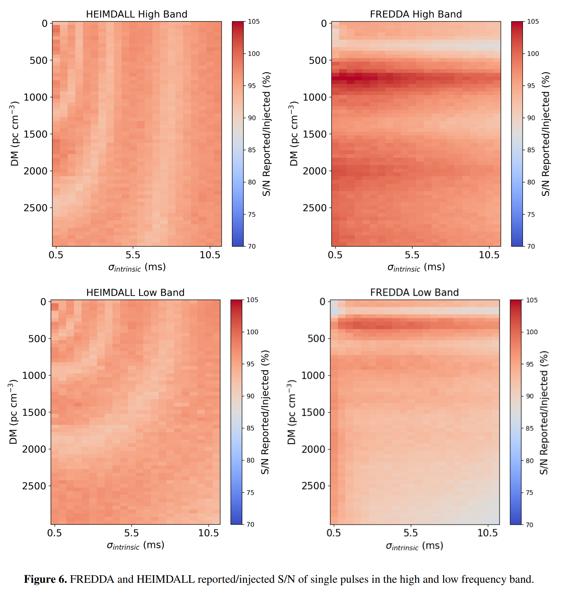

## 2023-06-08

1. [The fastest stars in the Galaxy](https://arxiv.org/abs/2306.03914)

   > Stellar, White Dwarf

   从Gaia数据中挑选高自行速度的蓝星，找到六颗新的超高速星，其中四颗总空间速度$>1300\,\rm km/s$，两颗径向速度为$-1694|-2285\,\rm km/s$，是目前的最高纪录。这样的超高速星主要来自于双白矮星系统，其中一颗爆炸推动另一颗运动。

2. [Radio Variable and Transient Sources on Minute Timescales in the ASKAP Pilot Surveys](https://arxiv.org/abs/2306.04263)

   > Stellar, Galaxy, ASKAP, Survey, Transient

   在ASKAP巡天中搜索时间尺度为15min的变源。观测总共包含了505小时，覆盖1476平方度，每次观测时间8-10小时，找到38个变源，7个是已知脉冲星，8个是恒星，22个与AGN有关，还有一个没有多波段对映体，因此还没确认。

## 2023-06-09

1. [The FRB20190520B Sightline Intersects Foreground Galaxy Clusters](https://arxiv.org/abs/2306.05403)

   > Fast Radio Burst, Galaxy, DM

   `FLIMFLAM`巡天在FRB 190520附近$3\,\rm deg^2$的区域内观测到701个星系，其中有两个$M_{\rm halo}>10^{14}M_\odot$星系团在特征半径$r_{200}$内跟FRB相交，减去这两个星系团晕贡献的DM，FRB宿主星系贡献的DM为$DM_{\rm host}=339.1^{+122.3}_{-173.5}\,\rm pc/cm^3$，这一数值与$H_\alpha$辐射测量估计一致。

   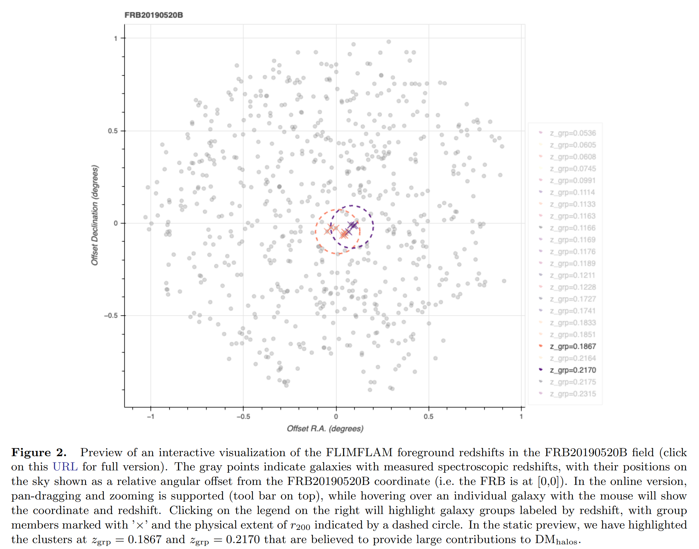

2. [Dear Magellanic Clouds, welcome back!](https://arxiv.org/abs/2306.04837)

   > Galaxy, Simulation, Dynamic

   N体模拟LMC第二次绕穿银河系，可能会再给银河系带来4-6个卫星星系。模拟代码在[这里](https://zenodo.org/record/8015660)。

   <video src="Figures/movie.mp4"></video>

3. [Model Independent Periodogram for Scanning Astrometry](https://arxiv.org/abs/2306.05063)

   > Stellar, Light Curve, Periodicity

   拓展[Zucker 2018](https://ui.adsabs.harvard.edu/abs/2018MNRAS.474L..86Z/abstract)中使用`Phase Distance Correlation Periodogram`方法，构建非参数化的[SPARTA](https://github.com/SPARTA-dev/SPARTA)，用于在巡天中检测各种类型的周期性现象。

   `PDC`基本运算是在一维时间序列中找周期。假设有一个序列$\{t_{i=1,\cdots,N},\ x_{i=1,\cdots,N}\}$，要计算测试周期$P$下的PDC，首先计算$N\times N$的距离矩阵
   $$
   a_{ij}=|x_i-x_j|
   $$
   之后计算相位矩阵
   $$
   b_{ij}=\phi_{ij}(P-\phi_{ij}) \quad\Leftarrow\quad \phi_{ij}=(t_i - t_j)\%P
   $$
   计算归一化（中心化）矩阵
   $$
   A_{ij}=a_{ij}-\bar{a_{i\cdot}}-\bar{a_{\cdot j}}+\bar{a_{\cdot\cdot}}\\
   B_{ij}=b_{ij}-\bar{b_{i\cdot}}-\bar{b_{\cdot j}}+\bar{b_{\cdot\cdot}}\\
   $$
   最后计算这一测试周期$P$下的PDC
   $$
   PDC=\frac{\sum_{ij}A_{ij}B_{ij}}{\sqrt{\sum_{ij}A_{ij}^2\sum_{ij}B_{ij}^2}}
   $$

## 2023-06-12

1. [pysersic: A Python package for determining galaxy structural properties via Bayesian inference, accelerated with jax](https://arxiv.org/abs/2306.05454)

   > Galaxy, Software

   [pysersic](https://github.com/pysersic/pysersic)，用`Sérsic profile`拟合星系（单/多星系）光分布的工具，基于贝叶斯采样拟合，并使用[jax](https://github.com/google/jax)实现即时编译/自动微分。

2. [A brief review of contrastive learning applied to astrophysics](https://arxiv.org/abs/2306.05528)

   > Astronomy, Machine Learning, Contrastive Learning, Galaxy

   对比学习在星系分类中的应用。

   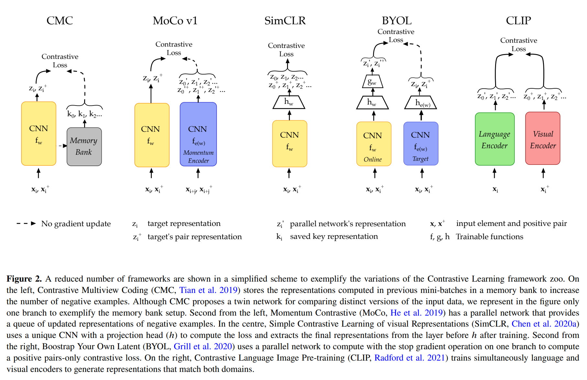

3. [Posterior predictive checking for gravitational-wave detection with pulsar timing arrays: I. The optimal statistic](https://arxiv.org/abs/2306.05558)

   > Pulsar, Timing, Gravitational Wave

   在脉冲星计时阵中探测背景引力波的贝叶斯信噪比`OS SNR`定义。并且在NANOGrav - 12.5年数据中进行检验，发现相比于平均信噪比`SNR`，这里定义的信噪比并不支持NANOGrav信号足够显著。

   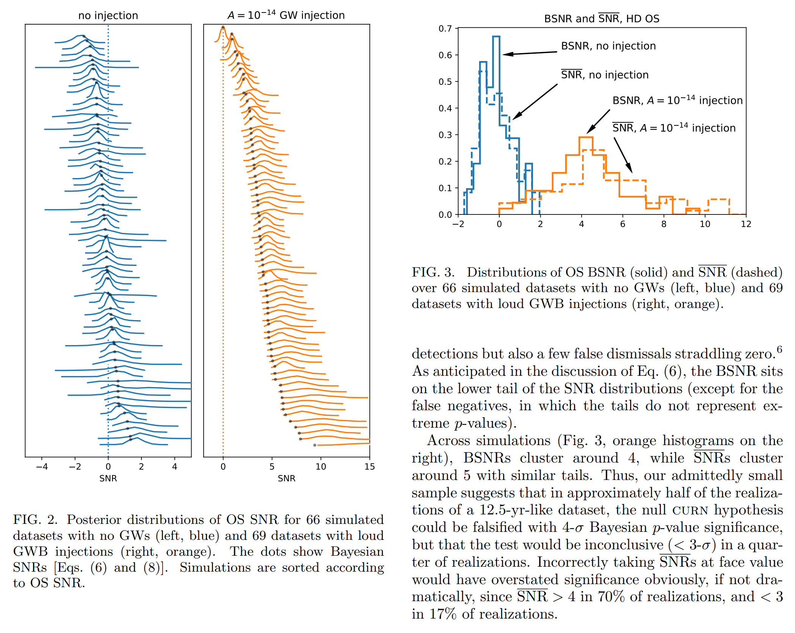

4. [Comment on the feasibility of carbon burning in Betelgeuse: a response to "The evolutionary stage of Betelgeuse inferred from its pulsation periods," [arXiv:2306.00287](https://arxiv.org/abs/2306.00287)](https://arxiv.org/abs/2306.05600)

   > Stellar, Light Curve

   [Saio et al. 2023](https://arxiv.org/abs/2306.00287)中认为参宿四在2020年的`Great Dimming`是脉动引起的光变，并认为参宿四已经开始进行碳燃烧。但是参宿四的角直径测量与此模型要求的恒星半径有冲突。这里展示了对参宿四长期的光度测量，并讨论了大光变是由于`onstructive mode interference`造成的。

   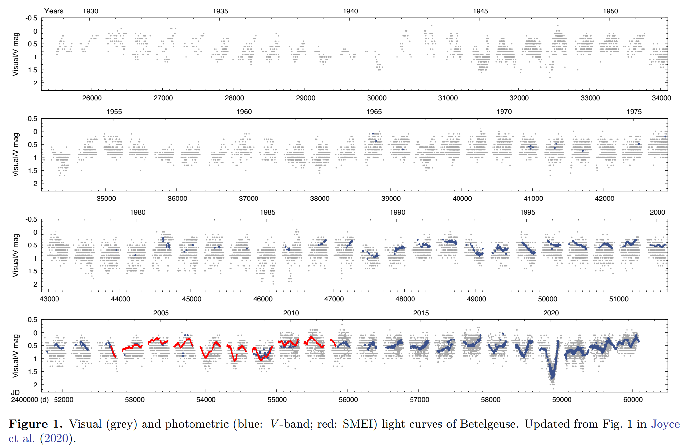

5. [Improving the open cluster census. II. An all-sky cluster catalogue with Gaia DR3](https://arxiv.org/abs/2303.13424)

   > Stellar, Catalog, Cluster, Gaia

   使用`HDBSCAN`从Gaia DR3中找星团，并使用密度测试和贝叶斯卷积神经网络来验证聚类，之后推断星团中恒星的天体测量参数、年龄、消光和距离等。

6. [A Comprehensive Survey on Deep Clustering: Taxonomy, Challenges, and Future Directions](https://arxiv.org/abs/2206.07579)

   > Machine Learning, Deep Learning, Clustering

   [DeepClustering](https://github.com/zhoushengisnoob/DeepClustering)总结了最近使用深度学习聚类的方法，并提出了benchmark方法。

## 2023-06-13

1. [The Early Data Release of the Dark Energy Spectroscopic Instrument](https://arxiv.org/abs/2306.06308)

   > Galaxy, DESI

   `DESI`第一次数据发布。包括河内天体、河外亮星系、亮红外星系、发射线星系、类星体等超过1,500,000个目标的光谱信息。这篇文章描述了光谱数据、数据质量、数据产品、大尺度结构科学目录、数据访问以及使用这些光谱的背景参考资料。

## 2023-06-14

1. [Detecting Fast Radio Bursts with Spectral Structure using the Continuous Forward Algorithm](https://arxiv.org/abs/2306.07914)

   > Fast Radio Burst, Searching, Software

   `Kalman detector`加入FRB频谱形状的信息来提高探测灵敏度。

2. [Sciences for The 2.5-meter Wide Field Survey Telescope (WFST)](https://arxiv.org/abs/2306.07590)

   > Optical, Telescope, Instrument

   `WFST`是科大和紫台搞的一个2.5米光学望远镜，计划今年夏天安装到冷湖基地。计划在`u/g/r/i`波段对天空进行每次$\rm 30\,s\ /\ 6.5\, deg^2$曝光，以探索低红移宇宙的暂现源（包括引力波电磁对映体、爆炸后几小时的超新星、潮汐瓦解事件、fast optical transients），极限星等低于22等。

## 2023-06-15

今日停更。

## 2023-06-16

1. [Point spread function modelling for astronomical telescopes: a review focused on weak gravitational lensing studies](https://arxiv.org/abs/2306.07996)

   > Optical, PSF, Review

   关于点扩散函数的综述。

   介绍了PSF的不同物理因素，包括光学的、探测器的和大气的成分，提出了一个可以复用的PSF观测模型，并讨论了用于地面和空间望远镜的参数化和非参数化的PSF模型的优缺点。讨论了PSF的验证方法，并讨论了与弱引力透镜有关的几个指标。最后讨论了天文望远镜PSF建模的挑战和未来方向。

   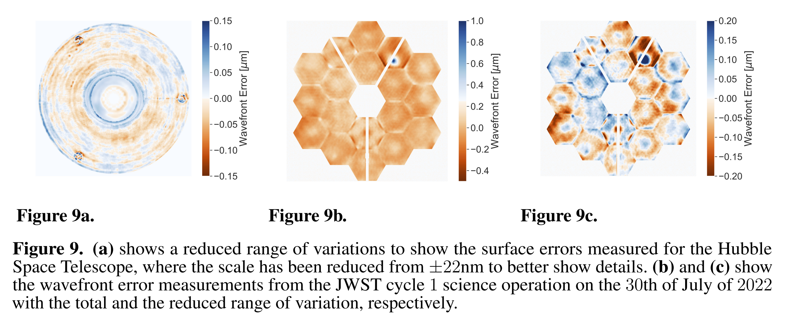

2. [Imagery Tracking of Sun Activity Using 2D Circular Kernel Time Series Transformation, Entropy Measures and Machine Learning Approaches](https://arxiv.org/abs/2306.08270)

   > Solar, Flare, Machine Learning

   将太阳2D表面辐射按照下图所示方式转换为1D序列，每个点是半径为7像素的圆。

   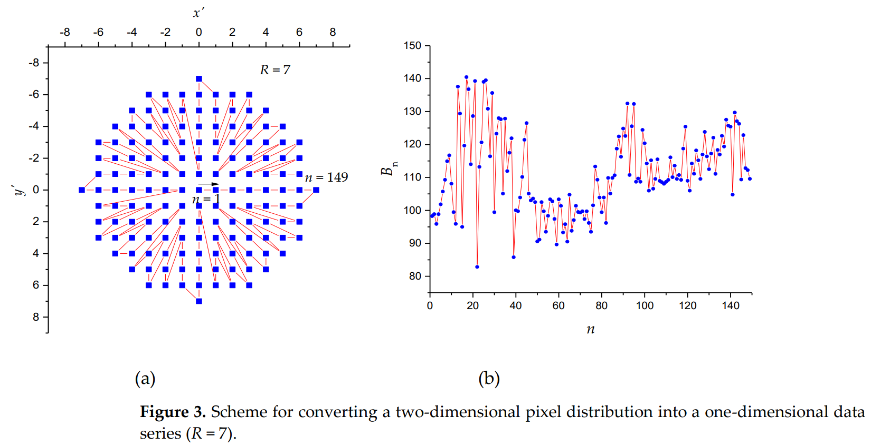

   用两种办法分类此时的太阳是否爆发

   - 计算1D序列的各种统计量（Mean Value / Median Value / Standard deviation / Variance / 5|25|75|95th Percentile / Root mean square Skewness Kurtosis）和熵（Singular Value Decomposition Entropy / Permutation Entropy / Cosine Similarity Entropy / Phase Entropy / Fuzzy Entropy），再用`Support Vector Classifier`和`K-Nearest Neighbors`进行分类
   - 直接对1D序列用`Support Vector Classifier`和`K-Nearest Neighbors`进行分类

   准确率分别为0.981和0.999，也就是说直接分类准确率更高。

3. [Map Reconstruction of radio observations with Conditional Invertible Neural Networks](https://arxiv.org/abs/2306.09217)

   > Radio, Mapping, Deep Learning

   用`conditional invertible neural network`从FAST时间-频率数据中重建频率成图。

4. [SPYGLASS. IV. New Stellar Survey of Recent Star Formation within 1 kpc](https://arxiv.org/abs/2306.08150)

   > Stellar, Cluster, Machine Learning

   `Stars with Photometrically Young Gaia Luminosities Around the Solar System, SPYGLASS`项目旨在对太阳系附近的年轻恒星进行无偏搜索。

   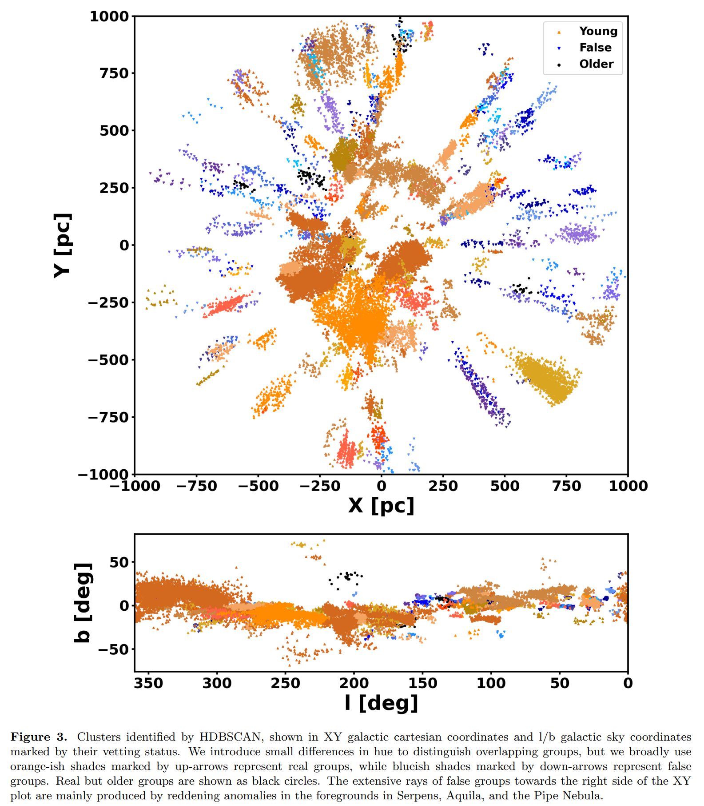

   这里使用HDBSCAN搜索太阳附近的`Young Associations`。结果暗示`Orion Complex`、`Perseus OB2`和`subregions of Vela`之间有直接的结构联系。

5. [A 5.3-minute-period pulsing white dwarf in a binary detected from radio to X-rays](https://arxiv.org/abs/2306.09272)

   > Stellar, White Dwarf, Observation, Light Curve

   探测到`J191213.72-441045.1`是一个白矮星/M矮星双星系统，轨道周期4.03小时，其中白矮星表现出5.30分钟的脉冲发射。在此之前，只有天蝎座中`AR Sco`这一白矮星双星系统中的白矮星表现出1.97分钟的脉冲发射。

   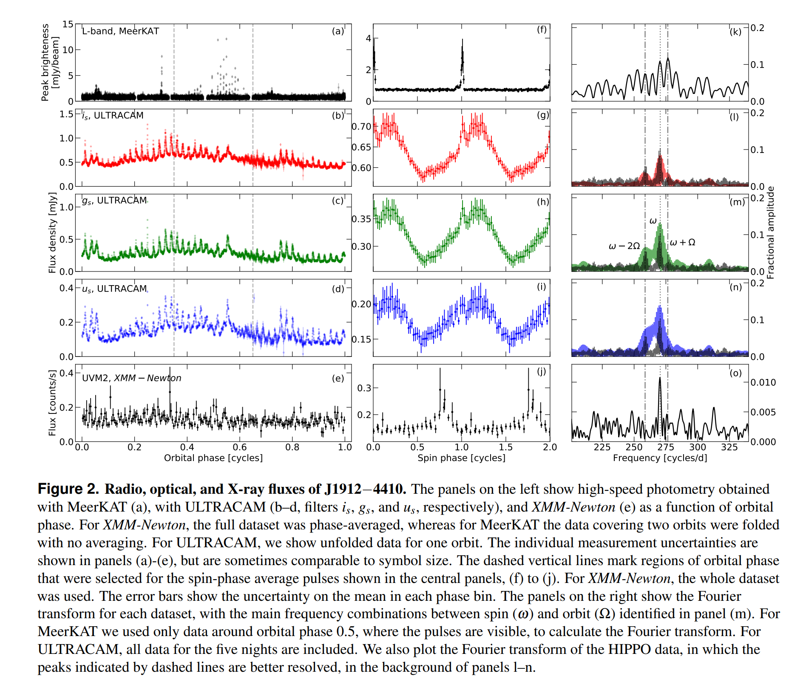

## 2023-06-19

1. [Deep learning of quasar lightcurves in the LSST era](https://arxiv.org/abs/2306.09357)

   > Quasar, Light Curve, Deep Learning

   用`Conditional neural processes, CNP`对类星体光变曲线进行分析。

## 2023-06-20

今日停更。

## 2023-06-21

1. [The use of double-mode RR Lyrae stars as robust distance and metallicity indicators](https://arxiv.org/abs/2306.10708)

   > Stellar, Distance

   `RR Lyrae`通常被用于估计球状星团、矮星系、星系等的距离。对于只有`fundamental-mode`的`RR Lyrae`，由于其绝对星等依赖于金属丰度，因此限制了距离估算的准确性。

   这里报告`duble-mode`的`RR Lyrae`的发现，并表明其周光关系不受金属丰度的影响，因此可以用来准确估计距离，在最佳情况，其距离精确度为1%。

2. [Discovery of an Extremely Intermittent Periodic Radio Source](https://arxiv.org/abs/2306.10817)

   > Pulsar, Radio

   发现一个极端消零的射电脉冲星`PSR J1710-3452`，自转周期10.4s，只零星探测到明亮单脉冲。奇怪的是，脉冲星都有这种准周期性的结构吗？

   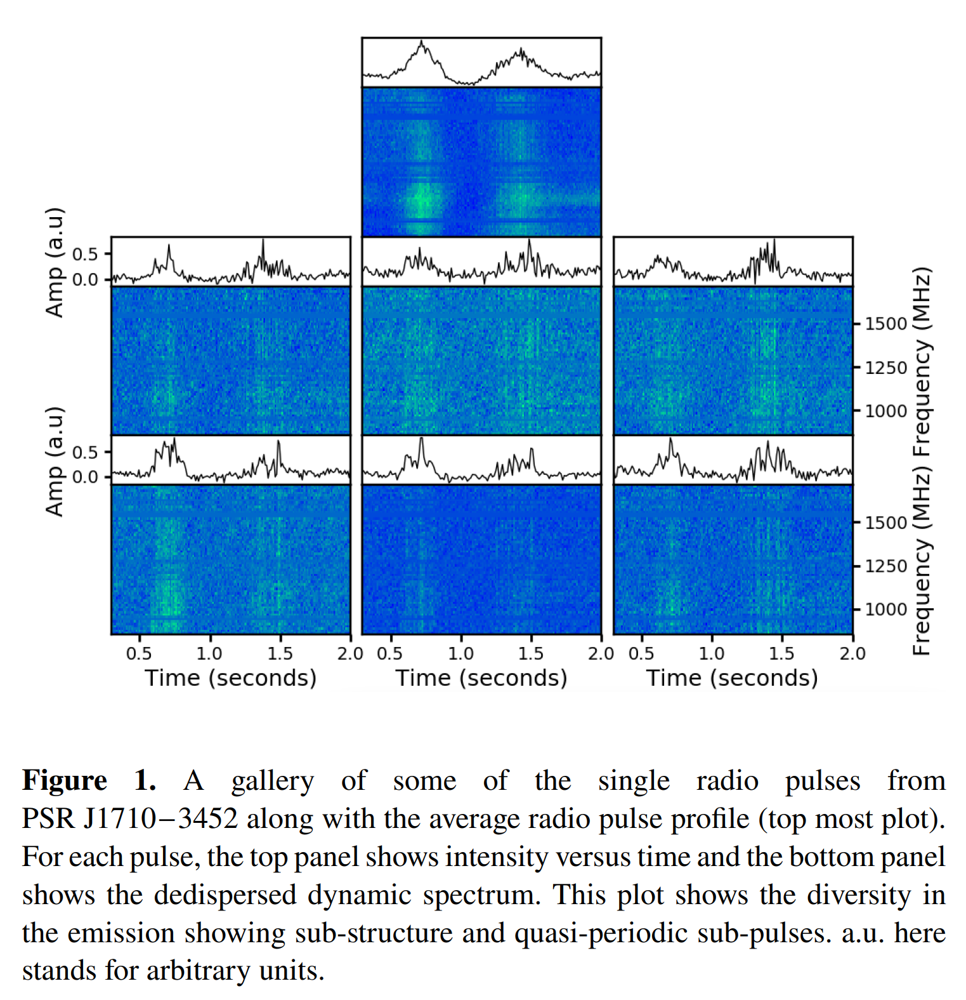

## 2023-06-22

1. [Pulsar radio emission from thunderstorms and raindrops of particles in the magnetosphere](https://arxiv.org/abs/2306.12017)

   > Pulsar, Detection

   用GPPS的数据在`PSR B2111+46`的`nulling`期间探测到脉冲。

   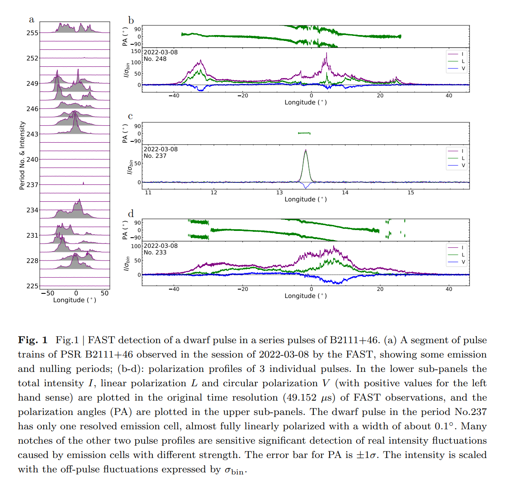

## 2023-06-23

1. [Shock cooling of a red-supergiant supernova at redshift 3 in lensed images](https://arxiv.org/abs/2306.12985)

   > Stellar, Supernovae, Gravitational Lensing

   大质量恒星死亡时，核区坍缩产生冲击，冲击到达恒星表面时恒星迅速变亮，随着膨胀冷却，因此其早期的光变曲线与原恒星的大小有一个简单的关系。然而只有一小部分附近的超新星可以通过早期光变曲线测量原恒星的半径，且几乎所有的超新星都缺乏爆炸后一天内的紫外测量。

   星系尺度的引力透镜可以放大来自超新星的光，并推迟光到达地球的事件在天的数量级，从而提供了一个强有力的工具测量遥远超新星的早期光变曲线。

   这里在HST的紫外成像中，找到了三个独立的引力透镜像，来自爆炸后5.8小时的在红移3位置的超新星。测量到其爆炸前半径为$533^{+154}_{-119}M_\odot$，与红超巨星一致。

   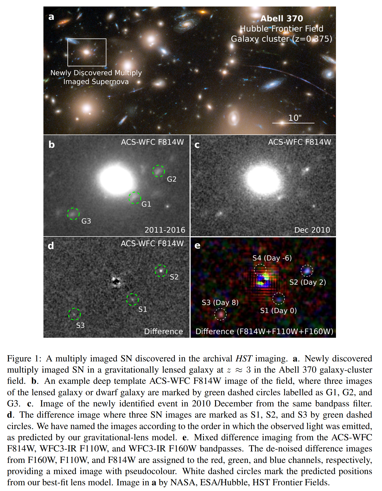

2. [Modelling Slope Microclimates in the Mars Planetary Climate Model](https://arxiv.org/abs/2306.12449)

   > Planetary Science, Solar System, Mars

   用小气候建模描述火星地表斜坡上的形态（沟壑、条纹、斜坡线等），之后可以看看是如何建模的。

## 2023-06-26

1. [Fast radio bursts trigger aftershocks resembling earthquakes, but not solar flares](https://arxiv.org/abs/2306.13612)

   > Fast Radio Burst, Statistics

   定义了一个相关变量，声称找到类似余震的现象。

2. [Characterisation of chaos and mean-motion resonances in meteoroid streams -- Application to the Draconids and Leonids](https://arxiv.org/abs/2306.13389)

   > Planetary Science, Meteor, Statistics

   用`orthogonal fast Lyapunov indicator`绘制`Draconids`和`Leonids`流星雨的`chaos maps`。

   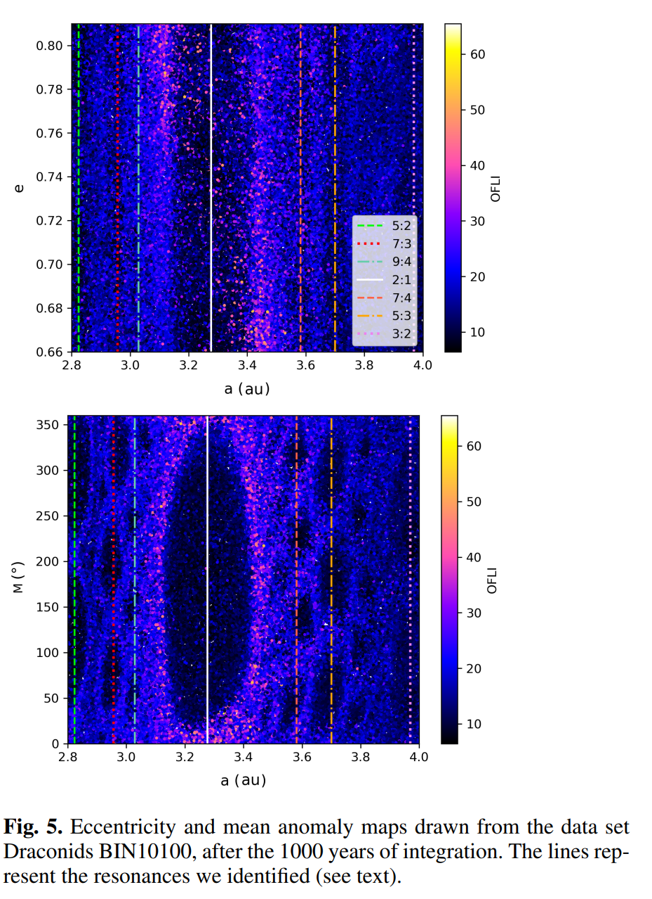

## 2023-06-27

1. [Deep learning-based deconvolution for interferometric radio transient reconstruction](https://arxiv.org/abs/2306.13909)

   > Radio, Interferometry, Deep Learning

   构建神经网络模型，对数据和仪器响应进行空间和时间建模。用于MeerKAT快速去卷积成像，搜索暂现源。

   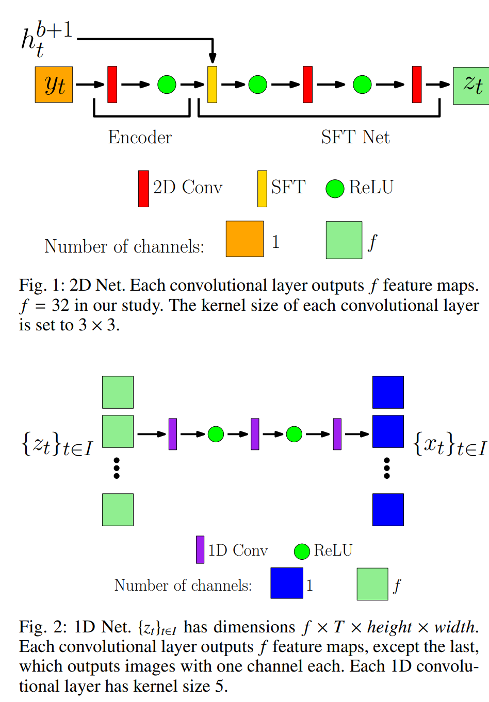

## 2023-06-28

1. [Connecting repeating and non-repeating fast radio bursts via their energy distributions](https://arxiv.org/abs/2306.15505)

   > Fast Radio Burst, Observation, Statistics

   之前审过的稿子。用四个25-32米的小望远镜盯着FRB20201124A看了2000个小时，探测到46个高能爆发。能量分布统计认为高能端更平，接近非重复暴的指数。

2. [Applying wavelet analysis to the X-ray light curves of active galactic nuclei and quasi-periodic eruptions](https://arxiv.org/abs/2306.14972)

   > AGN, Galaxy, Periodicity

   用小波变换分析AGN的X射线辐射中的准周期性。

   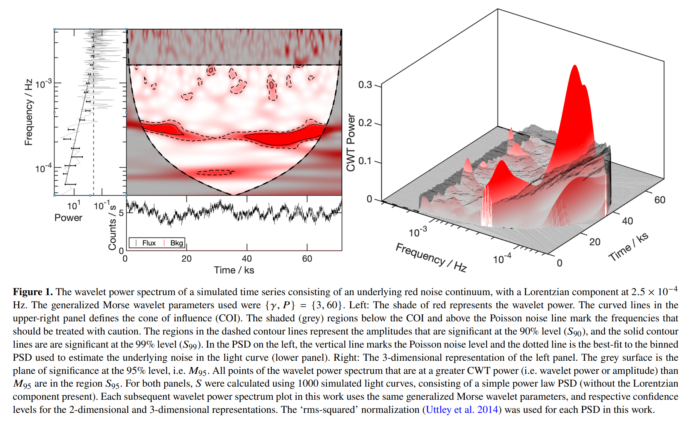

3. [Machine learning in solar physics](https://arxiv.org/abs/2306.15308)

   > Solar, Machine Learning, Review

   太阳物理中机器学习的综述。

## 2023-06-29

1. [Discovery of the Magellanic Stellar Stream Out to 100 Kiloparsecs](https://arxiv.org/abs/2306.15719)

   > Stellar, Galaxy, Kinematics

   `The Magellanic Stream`在50年前被发现，是麦哲伦云的一条气体带，横跨140度的天空。到目前为止，还没找到属于这个气体带中的恒星。

   这里在一个明亮红巨星的光谱巡天数据集中找到13个恒星，沿着MS跨越100度，金属丰度也与MS区域一致，认为是MS的成员。

2. [Constraining Below-threshold Radio Source Counts With Machine Learning](https://arxiv.org/abs/2306.15720)

   > Radio, Machine Learning, SED

   用CNN拟合`ASKAP成图图像`和`图像流量分10个区间，每个区间的源的数量`。

   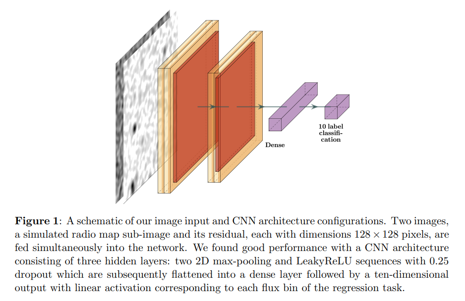

3. [A new method for short duration transient detection in radio images: Searching for transient sources in MeerKAT data of NGC 5068](https://arxiv.org/abs/2306.16383)

   > Radio, Transient, MeerKAT

   用`WSClean`实现MeerKAT的快速成图，并将数据分割为6/152/2454个时间切片，以搜寻3600/138/8秒的暂现源。搜索暂现源使用的是`LOFAR Transients Pipline`，[Trap](https://github.com/transientskp/tkp)。结果没有搜索到暂现源。

4. [Searching for the nano-Hertz stochastic gravitational wave background with the Chinese Pulsar Timing Array Data Release I](https://arxiv.org/abs/2306.16216)

   > Radio, Pulsar, Gravitational Wave, PTA

   CPTA在14nHz附近探测到信噪比为$4.6\sigma$的信号，作为背景引力波的证据。今天同样还有别的PTA文章发布，结论类似，包括[European PTA](https://arxiv.org/abs/2306.16224)、[NANOGrav](https://arxiv.org/abs/2306.16213)和[Parkes PTA](https://arxiv.org/abs/2306.16215)。

   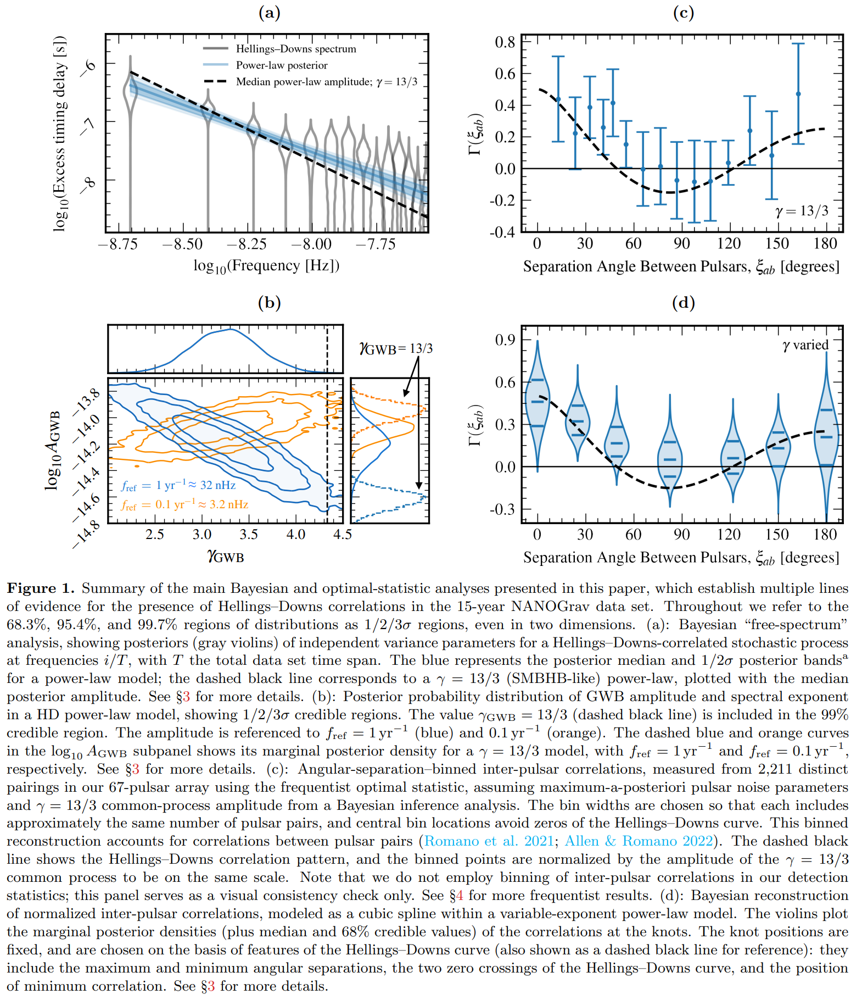

## 2023-06-30

1. [Intelligence of Astronomical Optical Telescope: Present Status and Future Perspectives](https://arxiv.org/abs/2306.16834)

   > Astronomy, Instrument, Machine Learning, Review

   机器学习在天文观测中的应用。包括

   - 天文台选址
     - 云量评估（输入全景相机图像，输出云量分类）
     - 大气参数评估（输入温度、湿度、气压等，输出大气湍流参数、视宁度）
   - 光学系统
     - 光路校正
     - 镜面校正
   - 智能调度
     - 基于神经网络的`SPIKE`系统，用于HST开发了来生成观测计划
     - `generalized differential evolution 3`，用于JWST观测规划
     - 基于贪心算法的`SWO`优化器，用于SOFIA、火星探测器的观测规划
     - `强化学习`算法，用于LSST和光学望远镜观测天区的排序，提高望远镜发现引力波、GRB、千新星等瞬态天文现象的概率。
   - 故障诊断
     - SOM和CNN用于望远镜成像分类，及时发现成像质量差的地方。
   - 成像质量优化
     - 圆顶观看（用RNN预测温度）
     - 自适应光学（CNN用于波前预测）
   - 数据库
     - 异常检测、数据分类、光谱分类、测光红移预测、恒星参数测量

   

   

