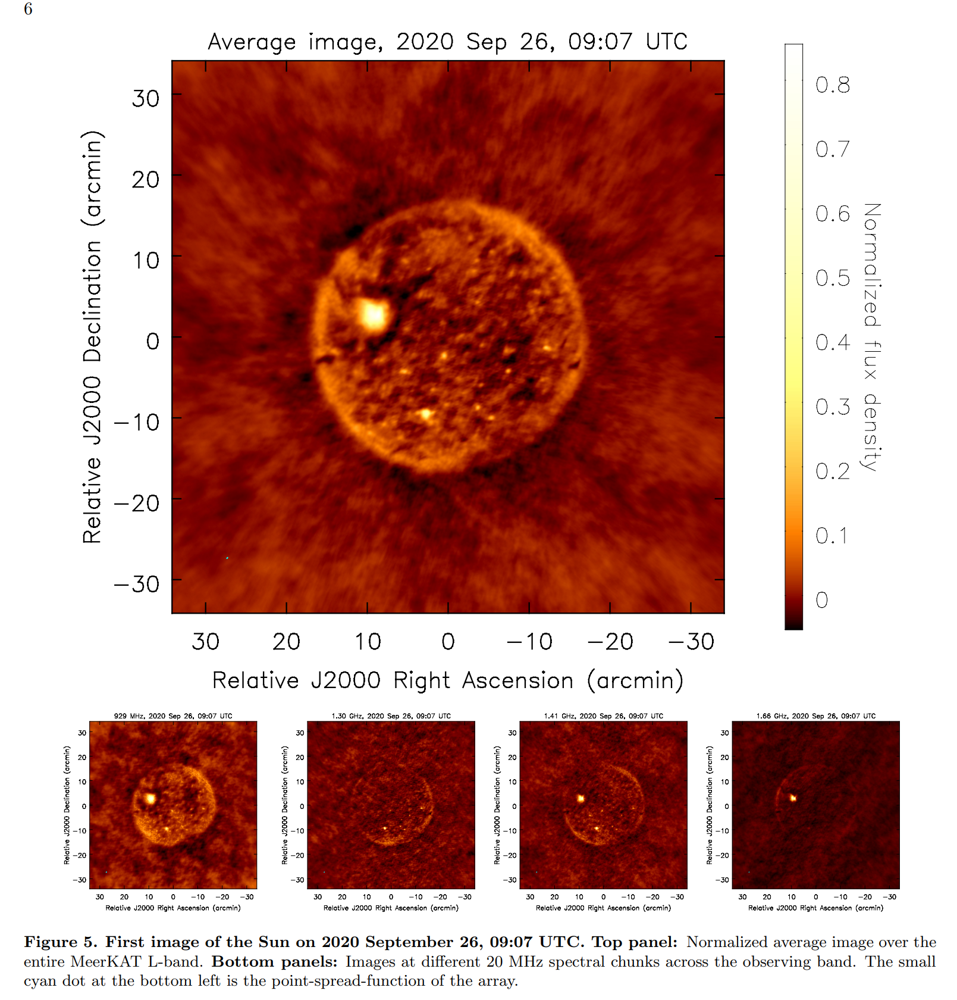

## 2023-07-03

1. [Bias-Free Estimation of Signals on Top of Unknown Backgrounds](https://arxiv.org/abs/2306.17667)

   > Cosmology, Method

   在`信号+噪声+背景`的数据中提取`axion`信号，需要背景减的好，因此对我们没啥用。一个可能有用的东西，[Savitzky-Golay Filters](https://docs.scipy.org/doc/scipy/reference/generated/scipy.signal.savgol_filter.html)用于数据平滑，在scipy中有实现。

2. [A Robust Study of High-Redshift Galaxies: Unsupervised Machine Learning for Characterising morphology with JWST up to z ~ 8](https://arxiv.org/abs/2306.17225)

   > Galaxy, JWST, Machine Learning, Clustering

   用VAE对JWST的星系图像做训练，并用中间隐藏层向量做`Hierarchical clustering`聚类。发现早起宇宙由盘状星系主导。

   

3. [Modelling repetition in zDM: a single population of repeating fast radio bursts can explain CHIME data](https://arxiv.org/abs/2306.17403)

   > Fast Radio Burst, Statistics

   对CHIME/FRB的事件率-能量分布做拟合，发现重复暴和非重复暴可以用同一个幂律表述。

## 2023-07-04

1. [The ROAD to discovery: machine learning-driven anomaly detection in radio astronomy spectrograms](https://arxiv.org/abs/2307.01054)

   > Radio, Machine Learning, Anomaly Detection

   用[语义表征的自监督学习方法](https://github.com/abhisheksambyal/Self-supervised-learning-by-context-prediction)从LOFAR数据中做异常检验。

   

## 2023-07-05

今日停更。

## 2023-07-06

1. [Cosmology with fast radio bursts in the era of SKA](https://arxiv.org/abs/2307.01605)

   > Fast Radio Burst, Cosmology, Prediction

   FRB的DM包含了宇宙中重子物质分布的信息，可以用于研究暗能量、哈勃常数和重子密度问题。预计10年SKA观测可以发现1-10万个FRB。使用这些FRB的数据，预计

   - 更加严格约束暗能量状态方程参数，相比CMB+BAO+SN联合约束
   - 与10年的EP观测引力波数据结合，可以将哈勃常数限制在1%的水平
   - 将重子密度$\Omega_bh$约束到0.1%的精度。

2. [Event Rate of Fast Radio Burst from Binary Neutron-star Mergers](https://arxiv.org/abs/2307.02111)

   > Fast Radio Burst, Theory

   `FRB 20191221A`和`FRB 20210213A`是CHIME报道的有准周期结构的两个非重复FRB，这样的FRB可能是在双中子星（BNS）并合的`inspiral phase`产生。

   对于这两个FRB的亮度和周期，需要合并前的BNS的磁场强度$B\ge10^{12}G$，这比银河系中观测到的大多数BNS（$B\sim10^9G$）高。基于`population synthesis`并采用中子星衰减磁场模型，估计了BNS并合的事件率（两个中子星磁场都高于$10^{12}G$），在红移$z<1$的情况下，事件率为$8\times10^4\, yr^{-1}$，占总BNS并合数量的19%。

3. [Statistical properties and lensing effect on the repeating fast radio burst FRB 180916.J0158+65](https://arxiv.org/abs/2307.02230)

   > Fast Radio Burst, Statistics

   对FRB180916的统计，周期16.35天，活跃窗口5.0天。DM双峰分布，左峰随频率增加而增加，右峰相反。等待时间也双峰分布，且峰值时间与爆发性质无关（无论是前一个爆发还是后一个爆发）。延迟时间差和频率相关的DM与等离子体透镜模型一致，认为其传播路径上受到等离子体透镜效应的影响。

   

4. [Microsecond-duration bursts from FRB 20121102A](https://arxiv.org/abs/2307.02303)

   > Fast Radio Burst, Observation

   在GBT高频观测FRB121102的基带数据中找到持续时间为微秒量级的爆发，偏振特征与普通爆发一致。

   

5. [First Image of the Sun with MeerKAT Solar Observations: Opening a New Frontier in Solar Physics](https://arxiv.org/abs/2307.01895)

   > Radio, Solar, MeerKAT

   MeerKAT在L波段对太阳的成像结果。尽管存在明显的流量缺失，但这打开了MeerKAT一个具有巨大发现潜力的大门。

   

6. [Unintended electromagnetic radiation from Starlink satellites detected with LOFAR between 110 and 188 MHz](https://arxiv.org/abs/2307.02316)

   > Radio, Satellite, LOFAR

   LOFAR探测到星链在低频的奇怪辐射。

   

7. [Sub-arcsecond resolution imaging of M 51 with the International LOFAR Telescope](https://arxiv.org/abs/2307.02365)

   > Galaxy, Radio, LOFAR

   LOFAR对M51的亚角秒成像，并讨论了在如此低频下探测到的超新星与其他波段的比较。
   
   

## 2023-07-07

1. [Machine Learning Classification of Repeating FRBs from FRB121102](https://arxiv.org/abs/2307.02811)

   > Fast Radio Burst, Statistics, Classification, Machine Learning

   用UMAP对FRB121102的爆发参数进行降维，用HDBSCAN聚成4类。
   

## 2023-07-10

1. [Deep Synoptic Array Science: First FRB and Host Galaxy Catalog](https://arxiv.org/abs/2307.03344)

   > Fast Radio Burst, Galaxy, Localization, Catalog

   DSA-100目前是由63个4.65m的望远镜组成的阵列，基线2.5km。这篇文章发布了DSA第一批共11个非重复FRB的定位结果与宿主星系分析。

   

   这些FRB的色散、散射和能量与已知非重复FRB相似，大多数宿主星系也都在进行恒星形成。与之前工作不同的是，这11个星系中有4个质量超过$10^{11}M_\odot$。恒星形成历史的分布表明`delay-time`分布在100Myr-10Gyr，这要求与老恒星相关的`progenitor`形成方案的存在。

2. [Rotation measure variations in Galactic Centre pulsars](https://arxiv.org/abs/2307.03230)

   > Pulsar, Polarization, RM

   用Effelsberg测量银心附近四颗脉冲星的RM。`PSR J1746-2850`的RM为$-12234\,\rm rad/m^2$，并且在年的时间尺度上会变化300-400，表明处在强磁场环境中。`PSR J1746-2850`的RM结构函数的幂律指数为1.87，与各向同性湍流的预期相当。其DM也变化超过$50\,\rm pc/cm^3$。`PSR J1746-2849`和`PSR J1746-2850`虽然角距离接近，但二者的RM的差异表明CMZ中存在至少$70\mu G$的磁场，这也可以解释该区域射电图像中缺乏偏振。

   

   

3. [Pulsar discovery prospect of FASTA](https://arxiv.org/abs/2307.03422)

   > Pulsar, FASTA, Prediction

   FAST目前已经探测到650+脉冲星，超过了20%的已知银河系脉冲星。预测FASTA可以探测到数万颗脉冲星，和数千颗毫秒脉冲星，和100颗M31脉冲星。

4. [A model local interpretation routine for deep learning based radio galaxy classification](https://arxiv.org/abs/2307.03453)

   > Galaxy, Machine Learning, Classification

   用[LIME](https://github.com/marcotcr/lime)解释星系分类模型预测行为。

   

## 2023-07-11

1. [An X-ray Census of Fast Radio Burst Host Galaxies: Constraints on AGN and X-ray Counterparts](https://arxiv.org/abs/2307.03766)

   > Fast Radio Burst, Galaxy, AGN, High Energy

   对7个良好定位FRB进行X射线观测，发现两个FRB的宿主星系有AGN。还报告了24个定位不那么准确，但是FRB宿主概率很高的星系的发射线观测，发现FRB的宿主星系`trace the underlying galaxy population`。而重复FRB的宿主星系在BPT图上并不局限于恒星形成的位置，与以前观测相反。

   另外在超强X射线源`ULXs`的背景下对FRB相关的X射线对应体进行了限制，发现目前的FRB的X射线值排除了亮度高于$10^{40}\,\rm erg/s$的ULXs。使用CHIME/FRB目录和现有ULX星表，找空间中重合的ULX/FRB对，在NGC2633中发现了两个ULX，在空间上与重复暴`FRB 20180908B`重合。

   

2. [Cosmography from well-localized Fast Radio Bursts](https://arxiv.org/abs/2307.04711)

   > Fast Radio Burst, Cosmology

   又是用DM-z关系限制宇宙学参数的。

## 2023-07-12

1. [Do All Fast Radio Bursts Repeat? Constraints from CHIME/FRB Far Side-Lobe FRBs](https://arxiv.org/abs/2307.05261)

   > Fast Radio Burst, Detection, Localization

   在CHIME旁瓣数据中找FRB。在2018年8月到2021年8月共35880个小时的曝光时间内找到10个，并且没看到重复。假设爆发分布是泊松的，那么这几个FRB的重复间隔大于11880小时，这比CHIME重复暴的间隔大2380倍。

   这个结果说明，要么FRB都是重复的，并且重复间隔分布非常广，活跃重复的比较罕见。要么不重复的FRB就是与重复FRB不一样。

   

2. [Constraints on the Intergalactic and Local Dispersion Measure of Fast Radio Bursts with the CHIME/FRB far side-lobe events](https://arxiv.org/abs/2307.05262)

   > Fast Radio Burst, Detection, DM

   上一片文章中探测到的10个FRB，发现这些时间的流量是CHIME主瓣事件的500倍，因此这样的样本统计上应该比主瓣样本近20倍。估计这10个FRB的DM来自IGM的贡献约为300附近，对应红移0.3。这个位置有助于约束重子缺失。

   

3. [The GECAM Real-Time Burst Alert System](https://arxiv.org/abs/2307.04999)

   > GRB, GW, Satellite

   用北斗短报文做GECAM探测GRB的通讯触发。
   
   

## 2023-07-13

1. [A CHIME/FRB study of burst rate and morphological evolution of the periodically repeating FRB 20180916B](https://arxiv.org/abs/2307.05839)

   > Fast Radio Burst, Detection, Statistics

   介绍CHIME在2018年8月到2021年12月期间探测到60个来自FRB180916的爆发。用CHIME的`fitburst`拟合爆发，代码即将发布在Fonseca et al.

   用`Exponentially Modified Gaussians`拟合时间轮廓
   $$
   {\rm EMG}(x, A_i,u_i,\sigma_i,\tau)=\sum_{i=1}^NA_i\frac{1}{2\tau}\exp\left(\frac{1}{2\tau}\left(2\mu_i+\frac{\sigma_i}{\tau^2}-2x\right)\right)\cdot{\rm erfc}\left(\frac{\mu_i+\sigma_i^2/\tau-x}{2\sqrt\sigma_i}\right)
   $$
   其中x是输入的事件序列，A是振幅，$\mu$是高斯均值，$\sigma$是方差，$\tau$是散射时标，$i$是N个脉冲成分。

   用``Running Power Law`拟合频率轮廓
   $$
   {\rm RPL}_i(f,A_i,r_i,\gamma_i)=A_i(f/f_o)^{-\gamma_i+r_i\ln(f/f_o)}
   $$
   其中$f_o$是大概选取的带宽中值600MHz，$r$是`spectral running`，$\gamma$是谱指数。

   拟合后研究形态学，并发现DM、RM、散射时标、带宽等，都没有表现出周期变化。每个周期的爆发次数与泊松过程一致。周期值也没发生变化，并给出周期导数的上限$1.5\times10^{-4}\,\rm day^{-1}$。

   

2. [Exponential distance relation (aka Titius-Bode law) in extra solar planetary systems](https://arxiv.org/abs/2307.06070)

   > Solar System, Planetary Science, Statistics

   提丢斯-波得定则是关于太阳系中行星轨道半径的一个简单的几何学规则，一般形式是
   $$
   a=0.4+0.3\times2^n
   $$
   其中a为行星到太阳的平均距离，n是第几个行星。

   这里选择了32个行星系统（其中一个是太阳系），每个系统都有至少5颗行星，进行`semi-log`拟合，并与随机创建的人造行星系统进行比较。结果排出了`Titius-Bode`定则的偶然性。

3. [Magnetar emergence in a peculiar gamma-ray burst from a compact star merger](https://arxiv.org/abs/2307.05689)

   > High Energy, GRB, Detection

   GRB一般认为可以由黑洞或者磁星提供动力，但目前仍然没有`磁星驱动短GRB`的观测证据。这里对`GRB 230307A`的宽带数据进行分析。

   尽管其持续时间长，但是其`prompt emission`和宿主星系的特性表明它起源于致密天体并合。随着$\gamma$射线的消失，延展的X射线成分出现了，意味着磁星的出现。并且发现在`prompt emission`阶段，高能波段出现了一个消色散的时间断裂，可能由狭窄喷流导致。张彬彬他们的文章，似乎投的Nature。

   

4. [JASMINE: Near-Infrared Astrometry and Time Series Photometry Science](https://arxiv.org/abs/2307.05666)

   > Astronomy, Satellite, Instrument, Survey

   `JASMINE`是日本在准备的一个36cm的近红外空间望远镜。在消光低的近红外波段实现Gaia级的天体测量，并在近红外获取M矮星的光变曲线，从而搜索系外行星。

5. [TESS Stellar Rotation up to 80 days in the Southern Continuous Viewing Zone](https://arxiv.org/abs/2307.05664)

   > Stellar, Variable, Light Curve, Machine Learning, Deep Learning

   `TESS`卫星的13.7天的周期限制了搜索周期长于13天的恒星。这里使用CNN来从恒星光变曲线中估计周期，输入是光变曲线的小波变换，经过最简单的CNN，输出是自转周期和不确定度。

   

## 2023-07-14

1. [Forecasting constraints on the baryon mass fraction in the IGM from fast radio bursts and type Ia supernovae](https://arxiv.org/abs/2307.06911)

   > Fast Radio Burst, Cosmology

   目前对宇宙电子密度变化导致的DM波动了解不深，星系际介质中重子物质质量分数$f_{IGM}$与一些宇宙学参数一起退化，以及对宿主星系DM贡献了解有限，限制了FRB在宇宙学中的应用。

   这里假设FRB有四种分布模型，类似GRB/恒星形成率/均匀分布/等距离分布。使用在[Lemos2023](https://arxiv.org/abs/2205.07926)中独立于宇宙学模型的方法，发现对于自由参数$f_{IGM}$和$DM_{host,0}$，GRB/SFR/均匀分布模型的结果在$2\sigma$以内是一致的。

2. [Closing the stellar labels gap: An unsupervised, generative model for Gaia BP/RP spectra](https://arxiv.org/abs/2307.06378)

   > Stellar, Spectrum, Machine Learning, Deep Learning

   用VAE对Gaia DR3的BP/RP光谱进行无监督学习。输入是BP/RP光谱，输出除了光谱外，还有BP/RP Scatter的估计。
   
   

## 2023-07-17

1. [Mapping Obscured Star Formation in the Host Galaxy of FRB 20201124A](https://arxiv.org/abs/2307.06995)

   > Fast Radio Burst, Galaxy

   用VLA (1.5-6GHz) 和 HST (光学+红外) 观测FRB 20201124A的宿主星系。测量到射电波段的恒星形成率是$8.9\,\rm M_\odot/yr$，是光学SFR的4-6倍，表明宿主星系被尘埃遮挡。

   HST的观测显示FRB偏离旋臂，但是射电辐射却延伸到FRB的位置，猜测FRB可能是从宿主星系中心迁移出去的。

   估计了FRB位置PRS的光度上限$L_{6.0\,\rm GHz}\le2.6\times10^{27}\rm erg/s/Hz$，比已知的PRS低两个数量级。然而，如果假设磁星的能量注入率是恒定的，并且年龄$\ge10^5$年，那么这个上限仍然与磁星云和超新星云的模型一致。

   

## 2023-07-18

1. [BTSbot: A Multi-input Convolutional Neural Network to Automate and Expedite Bright Transient Identification for the Zwicky Transient Facility](https://arxiv.org/abs/2307.07618)

   > Stellar, Variable, Deep Learning, Classification

   用ZTF的图像和图像中提取出的14个特征做输入，用CNN对变源进行分类。

   

2. [Outlier Detection in the DESI Bright Galaxy Survey](https://arxiv.org/abs/2307.07664)

   > Galaxy, Deep Learning, Anomaly Detection

   用VAE对星系光谱进行特征提取，并对提取出来的特征向量中，搜索低概率天体。一般的异常星系表现出不规则或者双峰发射线、或者来自星系并合、`blended sources`、罕见类星体、宽吸收线系统等。

   

3. [A Measurement of Hubble Constant Using Cosmographic Approach from Fast Radio Bursts and SNe Ia](https://arxiv.org/abs/2307.08285)

   > Fast Radio Burst, Cosmology

   在`Friedman-Lemaitre-Robertson-Walker`度规下用FRB测量宇宙学参数。

## 2023-07-19

1. [On Detecting Interstellar Scintillation in Narrowband Radio SETI](https://arxiv.org/abs/2307.08793)

   > Radio, SETI

   不自然的窄带信号被认为是有技术特征的信号。但RFI也会产生窄带辐射。信号通过湍流ISM后会产生闪烁。这里估计了这种对窄带信号搜索敏感的闪烁时间尺度，并讨论了检测这种信号的方法。

   

## 2023-07-20

1. [The first comprehensive Milky Way stellar mock catalogue for the Chinese Space Station Telescope Survey Camera](https://arxiv.org/abs/2307.10091)

   > CSST, Stellar, Catalog

   CSST[模拟星表](https://nadc.china-vo.org/data/data/csst-trilegal/f)。

   

2. [Prospects for Detecting Fast Radio Bursts in Globular Clusters of Nearby Galaxies](https://arxiv.org/abs/2210.04907)

   > Fast Radio Burst, Cluster, Prosepct, Prediction

   FRB可能由超新星塌缩形成中子星的磁活动产生。在M81的球状星团中发现的FRB20200120E挑战了这一机制，因为球状星团中很难由超新星形成。FRB20200120E的探测意味着类似事件在近邻宇宙发生率很高。

   文章从M81 FRB推断出的特征，预测附近$d<20Mpc$的星系中FRB的数量，并估计FAST和MeerKAT探测到的爆发率。其中M87是最佳候选星系，预计星系中有O(10)个FRB源。

   但是在[An Arecibo Search for Fast Radio Transients from M87](https://arxiv.org/abs/2107.09687)，AO在2019年10小时观测中，没有找到DM在5500以下的0.3-123ms的FRB。

3. [A fast radio burst localized at detection to a galactic disk using very long baseline interferometry](https://arxiv.org/abs/2307.09502)

   > Fast Radio Burst, Localization

   CHIME-TONE用3300km长基线的VLBI定位FRB20210603A，在红移0.177的edge-on星系，星系表现出近期有恒星形成。

   

## 2023-07-21

1. [FAST pulsar database: I. Polarization profiles of 682 pulsars](https://arxiv.org/abs/2307.10340)

   > Pulsar, Detection, Catalog

   GPPS探测到的脉冲星的偏振轮廓[目录](http://zmtt.bao.ac.cn/psr-fast/)。

## 2023-07-24

1. [Diffusion Models for Probabilistic Deconvolution of Galaxy Images](https://arxiv.org/abs/2307.11122)

   > Galaxy, Machine Learning, Deep Learning

   对比条件VAE和扩散模型在星系图像去卷积的效果，扩散更胜一筹，代码在[这里](https://github.com/yashpatel5400/galgen)。

## 2023-07-25

1. [Damping of strong GHz waves near magnetars and the origin of fast radio bursts](https://arxiv.org/abs/2307.12182)

   > Fast Radio Burst, Magnetar, Theory

   研究磁星的GHz射电辐射如何在磁层中传播。发现无论爆发亮度高还是低，磁层都会像枕头一样吸收GHz的辐射，并将吸收的能量以X射线的形式重新辐射出去。因此FRB可能是来自磁层爆炸式喷发的外流。

2. [The Tianlin Mission: a 6m UV/Opt/IR space telescope to explore the habitable worlds and the universe](https://arxiv.org/abs/2307.12013)

   > Planetary Science, Instrument, Satellite

   台里提出`TianLin`空间望远镜，用星冕仪加高分辨率光谱研究系外行星大气。

3. [A catalogue and statistical analysis for magnetic stars](https://arxiv.org/abs/2307.12315)

   > Stellar, Magnetic Field, Catalog

   整合过往文章中的`Magnetic Star`，给了一个目录。

   

## 2023-07-26

1. [Deep learning denoising by dimension reduction: Application to the ORION-B line cubes](https://arxiv.org/abs/2307.13009)

   > ISM, Deep Learning, Noise

   用VAE做Orion Data Cude降噪，代码在[这里](https://github.com/einigl/line-cubes-denoising)。

   

## 2023-07-27

1. [Sub-second periodic radio oscillations in a microquasar](https://arxiv.org/abs/2307.14015)

   > Quasar, Black Hole, Radio, Periodicity

   `GRS 1915+105`是一个有相对论性喷流的`fast-spinning black-hole X-ray binary`，在X射线波段有$1-10|34|67\rm Hz$的准周期振荡。这次报道FAST在射电波段探测到$5\rm Hz$的准周期震荡，并且在振荡期间有圆偏振出现。

   

2. [Deep learning-based radiointerferometric imaging with GAN-aided training](https://arxiv.org/abs/2307.14100)

   > Galaxy, Deep Learning, Imaging

   用`wGAN`生成射电星系数据，用`Radio Interferometer Measurement Equation, RIME`模拟生成`visibility`，用`SRResNet`将不完整的uv空间的实部和虚部图重建成完整的两张图，这样再经过一步傅里叶变换就可以得到成图不需要clean。

   

## 2023-07-28

1. [The unseen host galaxy and high dispersion measure of a precisely-localised Fast Radio Burst suggests a high-redshift origin](https://arxiv.org/abs/2307.14702)

   > Fast Radio Burst, Galaxy

   ASKAP定位了非重复暴`FRB 20210912A`，但后续的射电和光学观测都没有找到宿主星系。由于其色散特别大（DM=1233），因此宿主星系有几种可能

   - 特别远而无法探测
   - 比较近但特别暗，并且宿主星系对DM贡献很大
   - 没有宿主星系

   因此，即使有高精度定位和深度跟踪，一些FRB的宿主星系可能也很难被探测到。

   

2. [Individual and Averaged Power Density Spectra of X-ray bursts from SGR J1935+2154: Quasiperiodic Oscillation Search and Slopes](https://arxiv.org/abs/2307.14884)

   > Magnetar, Periodicity, QPO

   用`Power Density Spectra, PDS`找SGR1935的X射线暴发中的QPO。单个爆发中没有找到明显的QPO信号，但是多个爆发表现出可能的40Hz的QPO。

   

3. [Photometry of Type II Supernova SN 2023ixf with a Worldwide Citizen Science Network](https://arxiv.org/abs/2307.14347)

   > Stellar, Supernovae, Photometry

   由全球`Unistellar Network`对SN2023ixf进行测光，115台望远镜进行了252次观测，测量到峰值光度为$M_V=-18.18\pm0.09$。

   

## 2023-07-31

1. [Constraining the FRB mechanism from scintillation in the host galaxy](https://arxiv.org/abs/2307.15294)

   > Fast Radio Burst, Theory, Scintillation

   FRB如果起源于磁层内，那其尺寸预计为$10^7\,\rm cm$，如果起源于磁层外，其尺寸预计为$10^9\,\rm  cm$。点源被等离子体闪烁可以使其频率上辐射强度产生100%的变化，展源的辐射被等离子体闪烁调制的变化远小于点源。因此通过确认FRB在宿主星系中的闪烁指数对于区分这两种起源很有帮助。

2. [Star Cluster Classification using Deep Transfer Learning with PHANGS-HST](https://arxiv.org/abs/2307.15133)

   > Stellar, Cluster, Deep Learning, Classification

   用ResNet18对HST图像中，近距离螺旋星系$D<20\,\rm Mpc$中的星团进行分类，代码在[这里](https://archive.stsci.edu/hlsp/phangs-hst)。在验证的时候发现模型准确率和星系距离之间存在微弱的负相关，但是对距离分bin并分别进行训练并不能提高分类的准确度。

   
