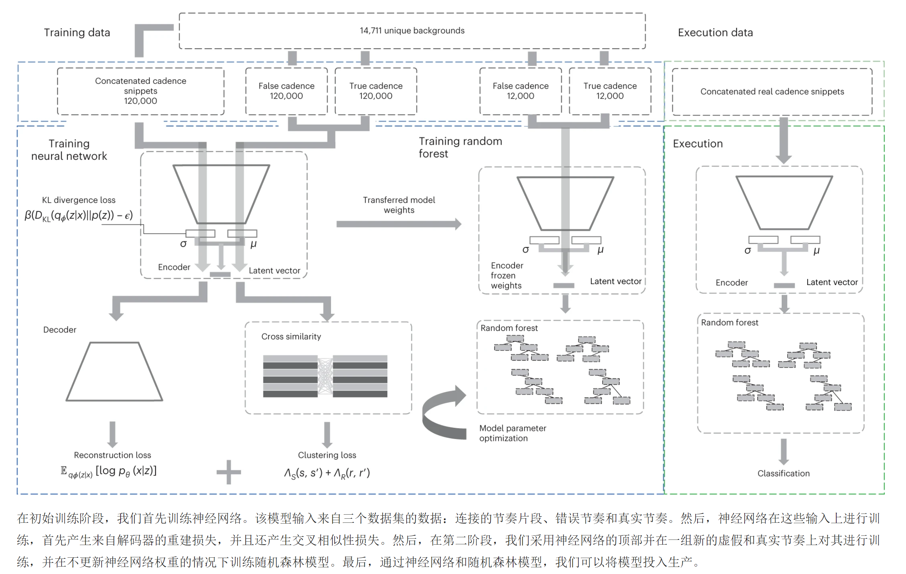
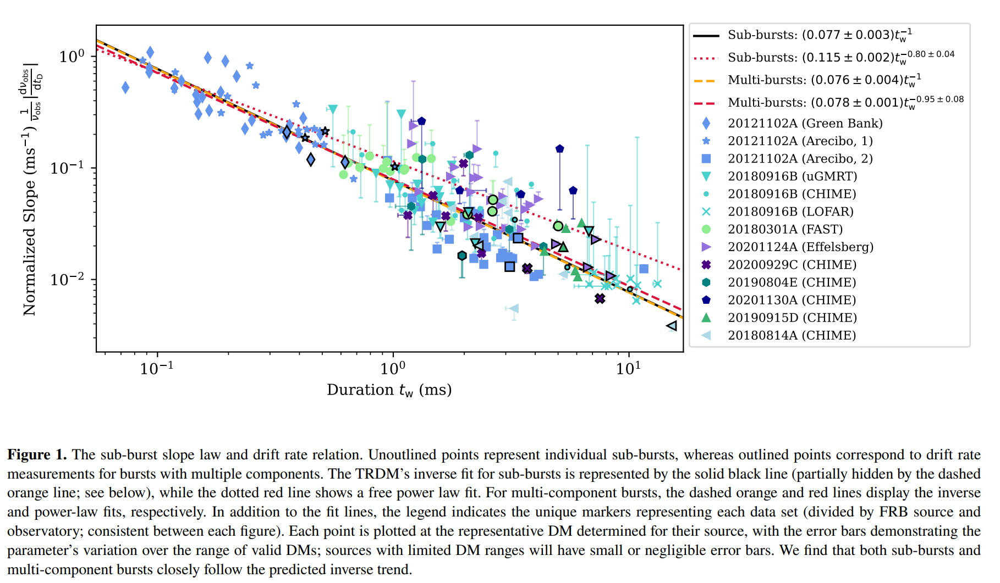

## 2023-08-01

1. [Temporal and Spectral Properties of the Persistent Radio Source Associated with FRB 20190520B with the VLA](https://arxiv.org/abs/2307.16355)

   > Fast Radio Burst, Galaxy, PRS, Radio

   用VLA在2020年和2021年对FRB20190520B的PRS，发现3GHz存在流量下降。讨论了PRS的起源，认为致密吸积天体可以解释PRS的时间和光谱特性。

   

2. [A radio pulsar phase from SGR J1935+2154 provides clues to the magnetar FRB mechanism](https://arxiv.org/abs/2307.16124)

   > Fast Radio Burst, Magnetar, Observation

   朱老师的文章，看SGR1935有脉冲星相。

3. [High Sensitivity Beamformed Observations of the Crab Pulsar's Radio Emission](https://arxiv.org/abs/2307.16362)

   > Crab, Giant Pulse, Radio, Observation

   用EVN在1658.49MHz对Crab进行观测，探测到了65951个巨脉冲，证实相距很近的巨脉冲串的可能性比随机发生的脉冲串要大。

   

## 2023-08-02

1. [Blinkverse: A Database of Fast Radio Bursts](https://arxiv.org/abs/2308.00336)

   > Fast Radio Burst, Catalog

   徐佳莹的文章，FRB的数据库。

2. [`pgmuvi`: Quick and easy Gaussian Process Regression for multi-wavelength astronomical timeseries](https://arxiv.org/abs/2308.00132)

   > Stellar, Light Curve, Gaussian Process

   [pgmuvi](https://github.com/ICSM/pgmuvi)用于多波段光变曲线的高斯过程建模。

## 2023-08-03

1. [The Oxygen Bottleneck for Technospheres](https://arxiv.org/abs/2308.01160)

   > Astrobiology, Planetary Science, SETI

   在地球上，技术发展需要燃烧，这需要氧含量高于18%。这表明，只有大气中氧气浓度相当高的行星才有能力发展“先进的技术”，从而能够探测到技术信号。

   

## 2023-08-04

1. [Subsurface pulse, crater and ejecta asymmetry from oblique impacts into granular media](https://arxiv.org/abs/2308.01876)

   > Planetary Science

   104m/s倾斜撞击沙子的实验。结果表明，即使掠射角只有10度，撞击坑也有几乎圆形的边缘，但是撞击激发的地震脉冲强度取决于撞击角。

   

## 2023-08-07

1. [Nonlinear wave damping by Kelvin-Helmholtz instability induced turbulence](https://arxiv.org/abs/2308.02217)

   > Turbulence, Simulation

   磁流体动力学中的`kink waves`是介质受到扰动后自然形成的，例如`transverse oscillations of coronal loops`。

   模拟表明，非线性`kink waves`可以引发开尔文-亥姆霍兹不稳定性`KHi`，随后在介质中产生湍流。模拟表明，`KHi`湍流的演化可以分为两个阶段，第一阶段是`KHi`湍流层$\propto t$，第二阶段是湍流运动$\propto t^{-2}$衰减。

   `KHi`湍流可以有效地阻尼弯曲波的振荡，并在日冕环中产生加热效应。
   
   

## 2023-08-08

1. [FRBs and magnetar activity statistics](https://arxiv.org/abs/2308.03207)

   > Fast Radio Burst, Theory, Magnetar

   同一磁星来源在不同时间段，可能辐射高事件率的重复FRB（持续几年），也有可能辐射强的非重复FRB（间隔10年左右，相当于巨耀斑的间隔时间）。

2. [A Search for Technosignatures Around 11,680 Stars with the Green Bank Telescope at 1.15-1.73 GHz](https://arxiv.org/abs/2308.02712)

   > SETI, Machine Learning

   文章假设ETI信号有“啁啾”信号漂移，漂移率为$f(t)=f_0+Kt$，通过遍历不同的漂移率搜索ETI信号。在GBT观测附近1万+颗恒星的射电信号，并未找到有趣的信号。根据这个结果，认为在附近100pc内的早于M8的恒星中，只有少于0.014%的恒星是能被探测到有效信号的。

   在[A deep-learning search for technosignatures from 820 nearby stars](https://www.nature.com/articles/s41550-022-01872-z)中，使用[SETIGEN](https://github.com/bbrzycki/setigen)生成训练数据，并使用$\rm \beta-VAE$加上随机森林训练ETI信号搜索模型[GBT-SETI](https://github.com/PetchMa/ML_GBT_SETI)，并在GBT的部分数据中找到8个有趣的信号。

   

   这篇文章中证明使用他们的方法也能找到这8个信号。

3. [AI-Enhanced Data Processing and Discovery Crowd Sourcing for Meteor Shower Mapping](https://arxiv.org/abs/2308.02664)

   > Solar System, Meteor

   `The Cameras for Allsky Meteor Surveillance, CAMS`是由NASA从2010年开始资助，旨在通过对南北半球16个国家多个地点的摄像机探测到的流星进行三角测量绘制[流星雨地图](https://meteorshowers.seti.org/)。

## 2023-08-09

1. [FRB 20121102A: images of the bursts and the varying radio counterpart](https://arxiv.org/abs/2308.04298)

   > Fast Radio Burst, Observation, PRS

   用MeerKAT对FRB121102的PRS进行了五次观测，前四次流量稳定，第五次PRS流量下降1/3。另外，MeerKAT的灵敏度很高，在2s的图像中，可以探测到1.3GHz处超过2.4mJy的任何FRB，因此可以用来定位所有CHIME探测到的FRB。

   

2. [A long-period radio transient active for three decades: population study in the neutron star and white dwarf rotating dipole scenarios](https://arxiv.org/abs/2307.10351)

   > Transient, Radio, Periodicity

   [A long-period radio transient active for three decades](https://www.nature.com/articles/s41586-023-06202-5)中讲用MWA探测到`GPM J1839-10`，是一个周期21分钟，持续30-300秒，有准周期结构的暂现源。对历史数据（VLA等）的搜索发现其最早于1988年开始重复出现，长时间的数据限制周期导数为$<3.6\times10^{-13}\rm s\,s^{-1}$，超过了中子星死线。分析代码在[这里](https://github.com/nhurleywalker/GPMTransient)。

   

<<<<<<< HEAD
   这个暂现源是在0.5s的时间切片里直接看到的，在VLA数据中也是，之所以之前没在VLA数据中探测到，是因为VLA的数据大多都是积分起来的，并没有做时间切片。下图展示了时间分辨率、色散和散射对探测的影响，纵坐标是光变的特征时标，当其小于时间分辨率时，探测不到，所以不需要做任何事情，斜实线上方表示色散带来的时间延迟短于光变时标，此时也不需要做任何事情，爆发可以直接被探测。点虚线上方表示散射时标短于光变时标，下方则探测不到。因此只有很小的一个参数空间需要消色散才能有所发现。 [scattering_delay_comparison.pdf](./Figures/scattering_delay_comparison.pdf)  [delay_scattering.py](./Figures/delay_scattering.txt)
=======
   这个暂现源是在0.5s的时间切片里直接看到的，在VLA数据中也是，之所以之前没在VLA数据中探测到，是因为VLA的数据大多都是积分起来的，并没有做时间切片。下图展示了时间分辨率、色散和散射对探测的影响，纵坐标是光变的特征时标，当其小于时间分辨率时，探测不到，所以不需要做任何事情，斜实线上方表示色散带来的时间延迟短于光变时标，此时也不需要做任何事情，爆发可以直接被探测。点虚线上方表示散射时标短于光变时标，下方则探测不到。因此只有很小的一个参数空间需要消色散才能有所发现。 [scattering_delay_comparison.pdf](Figures\scattering_delay_comparison.pdf)  [delay_scattering.py](Figures\delay_scattering.py) 
>>>>>>> 22bfbc0efcb1bd248abb3ccd14fe88a1a2404ef6

   

   这篇arxiv文章中讲，白矮星可以允许长周期射电发射的出现，但是还没有机制可以解释爆发为什么这么明亮。

## 2023-08-10

1. [A Walk-Through of AGN Country -- for the somewhat initiated!](https://arxiv.org/abs/2308.04621)

   > Galaxy, AGN, Review

   讨论了AGN和星系形成中的一些问题。

## 2023-08-11

1. [Deep Learning for Morphological Identification of Extended Radio Galaxies using Weak Labels](https://arxiv.org/abs/2308.05166)

   > Galaxy, Deep Learning, Classification

   用`Class Activation Map, CAM`来做ASKAP星系图像分割与分类，CAM就是我们之前在ResNet上用的看权重分类图，他们的代码在[这里](https://github.com/Nikhel1/Gal-CAM)。

   

2. [Source of radio emissions induced by the Galilean moons Io, Europa and Ganymede: in situ measurements by Juno](https://arxiv.org/abs/2308.05541)

   > Planetary Science, Satellite, Radio

   朱诺号探测到的木星极光射电辐射。在木星，极光的射电辐射的一部分是由木卫一二三引起的。

   

## 2023-08-14

1. [Investigating Cosmological Models and the Hubble Tension using Localized Fast Radio Bursts](https://arxiv.org/abs/2308.05918)

   > Fast Radio Burst, Cosmology

   还是用FRB的DM拟合宇宙学常数那一套。明确了哈勃常数强烈依赖于宿主星系DM贡献的先验以及宇宙学先验，并表明，如果真实的宇宙学是ΛCDM，那么需要1150个红移0-3内的FRB就可以排除`Friedmann-Lemaître-RobertsonWalker cosmology`，反之需要550个FRB排除ΛCDM。

## 2023-08-15

1. [Deep Synoptic Array Science: Polarimetry of 25 New Fast Radio Bursts Provides Insights into their Origins](https://arxiv.org/abs/2308.06813)

   > Fast Radio Burst, Observation, Polarization

   报告了DSA探测到的25个非重复FBR的偏振信息，测到了20个FRB的RM在$4-4670\rm\, rad/m^2$，其中9个有超过70%的线偏振度，3个有明显圆偏振，5个没有偏振，认为散射屏内随机的RM变化不是消偏振的原因。

   

   跟银河系脉冲星的偏振度进行比较，发现FRB的偏振度与最年轻的脉冲星（特征年龄小于10万年）之间有显著的相似性，提出假设——FRB的辐射是高度线偏振的，在磁层内的传播导致圆偏振和消偏振。、

2. [Deep Synoptic Array Science: Implications of Faraday Rotation Measures of Localized Fast Radio Bursts](https://arxiv.org/abs/2308.06816)

   > Fast Radio Burst, Polarization, Localization

   结合DSA新定位的10个非重复FRB和已经发表的15个定位的FRB，发现FRB河外RM主要由宿主星系贡献。并发现FRB宿主星系ISM磁场强度通常大于银河脉冲星的磁场强度，表明FRB宿主星系的ISM此话程度增加了。

   

3. [White dwarf Random Forest classification through Gaia spectral coefficients](https://arxiv.org/abs/2308.07090)

   > Stellar, White Dwarf, Machine Learning, Classification

   用随机森林应用到`Hermite coefficients of Gaia spectra`，做白矮星分类。

## 2023-08-16

1. [Searching for Novel Chemistry in Exoplanetary Atmospheres using Machine Learning for Anomaly Detection](https://arxiv.org/abs/2308.07604)

   > Planetary Science, Machine Learning, Anomaly Detection

   用`Local Outlier Factor`和`One Class Support Vector Machine`做异常值检验，用于从系外行星光谱数据（比如JWST）中找有趣的行星。

## 2023-08-17

1. [Galaxy Rotation Curve Fitting Using Machine Learning Tools](https://arxiv.org/abs/2308.08420)

   > Galaxy, Machine Learning, Dynamic, Method

   用pytorch的梯度下降和反向传播做银河系旋转曲线的拟合，不依赖神经网络。

## 2023-08-18

今日停更。

## 2023-08-21

1. [Statistical association between the candidate repeating FRB 20200320A and a galaxy group](https://arxiv.org/abs/2308.09608)

   > Fast Radio Burst, Galaxy, Statistics

   统计CHIME的FRB目录和星系的位置之间的关联，发现FRB20220320A与红移z=的一个星系群之间存在统计关联。

2. [JWST observations of the Ring Nebula (NGC 6720): I. Imaging of the rings, globules, and arcs](https://arxiv.org/abs/2308.09027)

   > ISM, Nebula, JWST, Observation

   JWST对`NGC 6720`的观测。

   

## 2023-08-22

1. [Scintillated microlensing: measuring cosmic distances with fast radio bursts](https://arxiv.org/abs/2308.10830)

   > Fast Radio Burst, Cosmology, Scintillation

   星系晕的质量曲线模型，限制了强透镜测量哈勃常数的精确度。河外恒星的微透镜只取决于透镜的质量，因此可以避免这种系统不确定性。

   FRB可以实现测量ns级别的透镜时间延迟，微透镜的时间延迟是ms级。微透镜图像之间的角间距是微角秒量级，因此无法用地面望远镜分辨。

   

   这里建议使用ISM的闪烁来分辨微透镜图像，并估算单个FRB闪烁微透镜事件可以限制哈勃常数在6%的不确定性，30个事件可以限制到$<1\%$。

## 2023-08-23

1. [Kinematics of the Milky way from the statistical analysis of the Gaia Data Release 3](https://arxiv.org/abs/2308.11060)

   > Stellar, Kinematics

   对太阳附近6kpc以内的3.3kw颗恒星运动学的统计分析。测量到太阳相对于附近恒星的速度，以及银河系不同半径下的旋转速度。做运动学分析或者需要知道银河系旋转曲线对恒星的影响可以看这篇。

   

2. [Towards an astronomical foundation model for stars with a Transformer-based model](https://arxiv.org/abs/2308.10944)

   > Astronomy, Deep Learning

   用各种观测数据和恒星标签，训练了一个基于Transformer的LLM模型，以执行各种推理任务。模型即使没有经过训练或者微调，也可以同时执行判别和生成任务（比如从Gaia XP光谱推导恒星参数，同样的模型也可以根据恒星参数生成XP光谱，补全未观测到的光谱区）。代码在[astroNN_stars_foundation](https://github.com/henrysky/astroNN_stars_foundation)。

   表明，利用多个巡天观测的数据和参数来建立一个基础模型，以预测未测量的观测数据和参数，是完全有可能实现的。

   

## 2023-08-24

1. [Dense Forests of Microshots in Bursts from FRB 20220912A](https://arxiv.org/abs/2308.12118)

   > Fast Radio Burst, Observation

   用`Nançay Radio Telescope`探测到的来自FRB20220912A的明亮爆发（$>400\rm\, Jy\cdot ms$），这些爆发表现出极高的亮度、宽带、短时（16us）结构，文章中称其为`microshots`。在FAST数据中实际上也有这样的爆发。

   文章认为这些窄爆发和宽爆发可能是不同起源，并分别对应着不同种类的太阳射电暴，因为按照窄爆发的色散改正以后，宽爆发仍然表现出$\sim100\rm\, MHz/ms$的漂移。

   

2. [Validating the Sub-Burst Slope Law: A Comprehensive Multi-Source Spectro-Temporal Analysis of Repeating Fast Radio Bursts](https://arxiv.org/abs/2308.11729)

   > Fast Radio Burst, Statistics

   在FRB的`triggered relativistic dynamical model`模型中预言了FRB爆发的sub-bursts slope law，`sub-burst slope`和`duration`之间成反比关系。
   $$
   \frac{1}{\nu_{\rm obs}}\frac{d\nu_{\rm obs}}{dt_D}=-\left(\frac{\tau_w'}{\tau_D'}\right)\frac{1}{t_w}=-A\frac{1}{t_w}
   $$
   其中$\nu_{\rm obs}$是中心频率，$t_D$是`delay time`，$t_w$是观测到的`duration`。这里通过对多个FRB的spectral-time进行统计，证实了这一规律。

   

## 2023-08-25

1. [Constraints on the persistent radio source associated with FRB 20190520B using the European VLBI Network](https://arxiv.org/abs/2308.12801)

   > Fast Radio Burst, Galaxy, Radio

   用EVN观测FRB20190520B的PRS，发现其角尺度小于2.3mas，在红移0.241处对应着小于9pc的物理尺度。在1.7GHz的流量和光度分别为$201\pm34\rm\,\mu Jy$和$(3.0\pm0.5)\times10^{29}\rm\, erg/s/Hz$，都与FRB20121102A的PRS相似。

   探测到了一个1.4GHz的爆发，位置与PRS位置一致$<20\,\rm mas$，支持存在一个中心引擎同时为爆发和PRS提供动力，比如磁星+星风星云的组合模型，这种模型估计源的年龄
   $$
   t_{\rm age}\lesssim \frac{E_{B*}}{\nu L_\nu}\approx1800 B^2_{16}\,\rm yr
   $$
   其中$E_{B*}$是磁能，$\nu L_\nu$是PRS光度，给出190520的PRS的年龄在$4-1900\,\rm yr$间。

   

2. [The Petabyte Project](https://arxiv.org/abs/2308.12432)

   > Fast Radio Burst, Survey

   那帮人提出用hemidall重新搜索过去20年间GBT、AO、Parkes等的数据，找FRB，估计不同频率的事件率。

## 2023-08-28

1. [Exploring the Use of Generative AI in the Search for Extraterrestrial Intelligence (SETI)](https://arxiv.org/abs/2308.13125)

   > SETI, Deep Learning

   用GAN在[setigen](https://github.com/bbrzycki/setigen)生成的人造信号上训练以代替`setigen`生成SETI信号。

   

2. [Gammapy: present status and future roadmap](https://arxiv.org/abs/2308.13389)

   > High Energy, Software

   为高能天体物理开发的软件[Gammapy](https://github.com/gammapy)，通过整理各种仪器探测到的事件和响应以相同格式导出为按能量、时间或空间坐标分类的数据，并对其建模。

## 2023-08-29

1. [Polarization Evolution of Fast Radio Burst Sources in Binary Systems](https://arxiv.org/abs/2308.14325)

   > Fast Radio Burst, Theory, Polarization

   对于强磁场的大质量双星系统，当FRB爆发穿过伴星的磁场时，会诱导出圆偏振，并围绕元偏振度等于0振荡，振荡频率和振幅随着频率的增加而减小。并用这个模型来解释`PSR B1744-24A`和`FRB20201124A`的观测。

2. [Searching for the spectral depolarisation of ASKAP one-off FRB sources](https://arxiv.org/abs/2308.14387)

   > Fast Radio Burst, Polarization, Observation, Statistics

   对ASKAP探测到的5个非重复FRB，分频段测量偏振度，以测量$\sigma_{\rm RM}$，并与重复FRB`20190711A`进行比较，并未发现非重复FRB的消偏振的证据。进一步证明重复FRB和非重复FRB在环境上的差异。

## 2023-08-30

1. [Machine Learning for Mini-EUSO Telescope Data Analysis](https://arxiv.org/abs/2308.14948)

   > Solar System, Deep Learning

   Mini-EUSO是在国际空间站上的一个小成像望远镜，可以用来看空间碎片和流星等。有一个叫`Stack-CNN`的模型，用于识别这个望远镜成像中的空间碎片。

   由于空间碎片在这些图像帧中是线性移动的，所以先把连续12帧图像向各个方向叠加，如果叠加方向恰好抵消了空间碎片的运动，那么成像中碎片的信噪比会提升。用CNN筛选叠加后的图像，判断哪个图像中包含信号，以减少叠加图像数量。

   这里用这个模型来识别流星。

## 2023-08-31

1. [Data-Driven Approaches to Searches for the Technosignatures of Advanced Civilizations](https://arxiv.org/abs/2308.15518)

   > SETI

   数据驱动的搜索能够以可重复的方式处理大量的数据，能够识别可能是技术特征存在线索的异常现象。

   `SETI`寻天的第一定律 - 每一次对外星文明的搜索都应该有计划地进行，即使在没有发现外星人的情况下也要给出有趣的结果，任何单一的观测或测量都不能成为探测生命或提供完全的确定性。

   图很炫酷，他们这相当于一个会议总结，会议期间确定的特别有希望的领域是，大型巡天数据挖掘、远红外波长全天巡天、射电天文干涉巡天以及太阳系中的人造信号。

   

