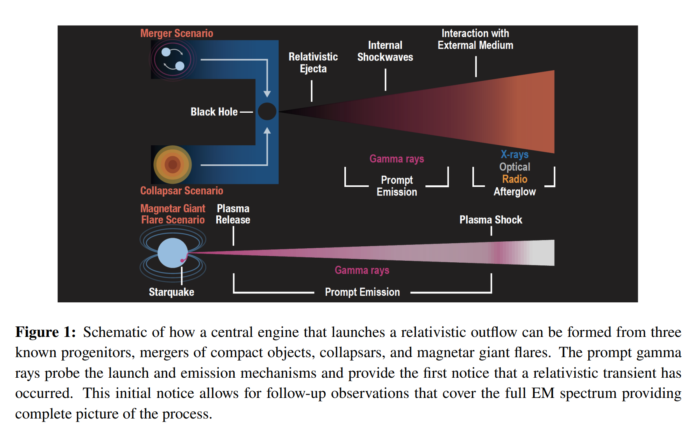

## 2023-09-01

1. [The Scientific Performance of the MoonBurst Energetics All-sky Monitor(MoonBEAM)](https://arxiv.org/abs/2308.16293)

   > Astronomy, Instrument, High Energy

   `MoonBEAM`是一个设想，在地月轨道中间放一个小卫星，用于进行暂现的相对论性喷流的多波段研究。优势在于

   - 它的轨道可以瞬间覆盖整个天空，从而最大限度地进行GRB观测，并未未探测到的GRB提供上限。
   - 与地面仪器进行三角视差测量以定位。

   全天空覆盖将使人们深入了解导致成功的相对论喷流，而不是冲击爆发事件，或核心坍缩超新星喷流完全失败的条件。

   

2. [Automatic conversion of Pop music into chiptunes for 8-bit pixel art](https://github.com/LemonATsu/pop-to-8bit)

   > Deep Learning, Music

   讲人声和器乐分离，并用音高匹配转换为8bit音乐，代码[在这](https://github.com/LemonATsu/pop-to-8bit)，之后可以试试。

## 2023-09-04

1. [Gravitational Lensing in Modified Gravity: A case study for Fast Radio Bursts](https://arxiv.org/abs/2308.16604)

   > Fast Radio Burst, Cosmology

   考虑了一个通用的修正引力理论，并考虑了快速射电暴引力透镜的影响。利用一组快速射电暴观测数据来约束这种理论中原始黑洞构成的暗物质比例。进一步证明，修正引力为引力透镜增加了一种屏蔽效应，类似于光线路径上存在等离子体作为散射屏时的情况。

## 2023-09-05

今日停更。

## 2023-09-06

1. [FAST discovery of a fast neutral hydrogen outflow](https://arxiv.org/abs/2309.01890)

   > Galaxy, HI, Radio, AGN

   `SDSS J145239.38+062738.0`是一个有I型AGN的并和射电星系，这里使用FAST探测到其HI的外流。外流的蓝移速度可能高达$-1000\,\rm km/s$，意味着能量流出率在$4.2\times10^{39}-9.7\times10^{40}\,\rm erg/s$之间。

2. [A Unified Geometric Model of Repeating and Non-Repeating Fast Radio Bursts](https://arxiv.org/abs/2309.01847)

   > Fast Radio Burst, Theory

   用几何模型来区分重复暴和非重复暴，认为与磁轴夹角小的区域产生非重复暴，角大的区域产生重复暴。由此带来的问题是非重复暴的立体角分布小，因此认为许多非重复暴之后可能会成为重复暴。

   在这个模型中，偏振是区分这两种FRB的关键。最重要的特征是，非重复暴的圆偏振变化的时间尺度小，重复暴圆偏振在一个爆发的相位中几乎不改变。

3. [A super-massive Neptune-sized planet](https://arxiv.org/abs/2309.01464)

   > Planetary Science, Light Curve

   TESS观测`TOI-1853 b`，半径是$3.46\pm0.08$地球半径，每1.24天绕一颗矮星转一圈，质量是$73.2\pm2.7$个地球质量，是目前已知的海王星大小行星（此类行星表现出多种多样的成分和密度，比如可以是有厚氢氦大气的低密度行星，也可以是有大量水和岩石大气较薄的高密度行星，取决于其演化历史）的两倍，密度是$9.7\pm0.9\,\rm g/cm^3$。

   这些数值意味着其位于海王星沙漠（距离恒星很近缺少海王星大小的区域）的中间位置，重元素在其质量中占主导地位。它可能是数次原行星碰撞的结果，也可能是高偏心率行星的最终状态。

   

## 2023-09-07

1. [Revised Constraints on the fast radio burst population from the first CHIME/FRB catalog](https://arxiv.org/abs/2309.02907)

   > Fast Radio Burst, Statistics

   用Macquart Releation估算CHIME/FRB表的红移，考虑能能量分布是Schechter function，恒星形成历史和多个FRB在不同红移分布的模型，拟合能量分布。

   结论，幂律指数$1.8\le\alpha\le2.0$，高能截断$\log E_c=42.5$，并且对红移分布模型不敏感。

2. [All sky archival search for FRB high energy counterparts with Swift and Fermi](https://arxiv.org/abs/2309.02883)

   > Fast Radio Burst, GRB, High Energy

   搜索Swift和Fermi中的GRB与FRB事件的相关性，只考虑空间上的关联，不考虑时间上的关联。即使如此，也没找到任何重要的相关性。据此估计只有4%的FRB与GRB相关联。

3. [Monthly quasi-periodic eruptions from repeated stellar disruption by a massive black hole](https://arxiv.org/abs/2309.02500)

   > Black Hole, Periodicity, Light Curve

   X射线数据中的搜索发现了一些准周期为小时的爆发，可能是超大质量黑洞对恒星的潮汐破坏（比如白矮星在围绕$10^5\,M_\odot$黑洞的偏心轨道上被反复剥离）。

   最近光学上发现了另一类周期性光变，时间尺度要长的多，可能是$10^7\,M_\odot$黑洞剥离主序星导致的。

   这里发现的是一个X射线光变，表现出几周的准周期爆发。

   

## 2023-09-08

1. [R2D2: Deep neural network series for near real-time high-dynamic range imaging in radio astronomy](https://arxiv.org/abs/2309.03291)

   > Radio, Deep Learning, Imaging

   Residual-to-Residual DNN series for high-Dynamic range imaging，用于干涉阵成像。

   

## 2023-09-11

1. [A race against the clock: Constraining the timing of cometary bombardment relative to Earth's growth](https://arxiv.org/abs/2309.03954)

   > Solar System, Comet, Planetary Science

   对67P氙同位素的测量表明，彗星对地球大气有贡献，但是还没有确凿证据表明地球地幔中有彗星成分。

   对太阳系进行了动力学模拟证明，在地球`accretion history`早期，很有可能有一些彗星被送到地球，从而对地幔做出贡献。比较了彗星物质在地球与金星和火星之间的传递情况，强调了内太阳系彗星宏基的随机性。

## 2023-09-12

1. [The FAST Galactic Plane Pulsar Snapshot survey: IV. Discovery of five fast radio bursts](https://arxiv.org/abs/2309.04826)

   > Fast Radio Burst, Detection, Observation

   GPPS探测到的5个非重复FRB，流量普遍偏低。

2. [Magnetospheric physics of magnetars](https://arxiv.org/abs/2309.05181)

   > Magnetar, Theory, Review

   仝号老师的文章，对磁星的简单的综述，总结了磁星磁层物理学的几个方面，包括磁星的GeV和硬X射线发射，软X射线观测的计时行为，磁星的光学/红外观测，磁星的射电发射和吸积。指出磁星与广泛的天体物理现象有关。

## 2023-09-13

1. [FRBs from rapid spindown neutron stars](https://arxiv.org/abs/2309.06328)

   > Fast Radio Burst, Theory

   FRB20200120E在球状星团中被发现挑战了涉及普通年轻磁星的FRB模型。这里考虑快速自旋的毫秒脉冲星，与普通脉冲星相比，快速自旋意味着更大的磁场，从经验上有利于巨脉冲发射。

   这里用`recycled pulsar with a modest magnetic field`的巨脉冲解释FRB的能量和包法律，寿命短是银河系附近亮FRB数量少的原因。主序星的潮汐瓦解的自旋上升可以提供足够的吸积率来`recycle a NS with mild magnetic field`，这可以解释观测到的源密度和FRB20200120E在球状星团中的空间偏移。

2. [Coherent Cherenkov Radiation by Bunches in Fast Radio Bursts](https://arxiv.org/abs/2309.06050)

   > Fast Radio Burst, Theory

   认为FRB来自磁层内粒子沿磁力线发射相干切伦科夫辐射，可以产生窄谱、频率漂移和100%线偏振。

3. [Fundamental-harmonic pairs of interplanetary type III radio bursts](https://arxiv.org/abs/2309.05763)

   > Solar, Radio, Observation

   报告帕克太阳探测器在千米波段探测到太阳III型暴的基波谐波对。

   

4. [AstroLLaMA: Towards Specialized Foundation Models in Astronomy](https://arxiv.org/abs/2309.06126)

   > Astronomy, Deep Learning

   用arxiv的30w篇天文的摘要微调`LLaMA-2`模型，以适应天文领域，用于自动论文摘要，模型在[这里](https://huggingface.co/universeTBD/astrollama)。

## 2023-09-14

1. [Temporal evolution of depolarization and magnetic field of FRB 20201124A](https://arxiv.org/abs/2309.06653)

   > Fast Radio Burst, Statistics

   用胥恒FRB20201124A的数据，测量$\Delta RM$和$\Delta DM$，用这个来算磁场，以及拟合了每天的$\sigma_{RM}$。结论是消偏振、磁场和RM的演化一致。但其实，由于DM基本不变，因此RM的变化与磁场变化趋势一定一样，另外$\sigma_{RM}$和$\Delta RM$在某一天都有一个峰值，说是二者类似，但这天的爆发数量很少。

## 2023-09-15

1. [Refractive lensing of scintillating FRBs by sub-parsec cloudlets in the multi-phase CGM](https://arxiv.org/abs/2309.07256)

   > Fast Radio Burst, Scintillation, Lensing, Theory

   考虑星系的`circumgalactic medium, CGM`对FRB的透镜效应，如果CGM由柱密度$10^{17}\,\rm  cm^{-2}$的`cloudlets`组成，那么通过CGM的FBR将以10ms的散射时标倍透镜变成数十个折射图像。这些像会被银河系的闪烁分辨，并因此抑制闪烁。

   因此对FRB闪烁的探测可以约束这些`cloudlets`的性质，并且目前的闪烁观测不支持这样的模型。

2. [Host Galaxy Dispersion Measure of Fast Radio Burst](https://arxiv.org/abs/2309.07751)

   > Fast Radio Burst, Statistics, Dispersion Measure, Galaxy

   计算22个定位的FRB的宿主星系DM贡献，发现宿主星系DM随红移增加。

## 2023-09-18

1. [A sub-pc BBH system in SDSS J1609+1756 through optical QPOs in ZTF light curves](https://arxiv.org/abs/2309.08078)

   > Black Hole, Periodicity, Light Curve

   用直接正弦拟合、LombScargle、自相关函数、WWZ找`SDSS J1609+1756`在ZTF三个波段中的340天的QPO，认为光学的QPO是AGN中存在双黑洞的标志。

## 2023-09-19

1. [TransientViT: A novel CNN - Vision Transformer hybrid real/bogus transient classifier for the Kilodegree Automatic Transient Survey](https://arxiv.org/abs/2309.09937)

   > Transient, Deep Learning, Classification

   在`Kilodegree Automatic Transient Survey`的数据上用VitTransformer分类变源。输入两帧图像，输出是变源的概率。每一帧图像由参考图像、当前帧图像和残差图像拼成。

   

   后面还做测试，将三帧图像两两计算并输出是变源的概率，会得到三个概率，三局两胜，可以进一步提高分类准确性。代码在[这里](https://github.com/TimeDevBlocker/TransientViT)，是新疆星明天文台的一个项目。

2. [Astronomaly at Scale: Searching for Anomalies Amongst 4 Million Galaxies](https://arxiv.org/abs/2309.08660)

   > Galaxy, Anomaly Detection

   用别人已经训练好的星系分类CNN模型，做DESI星系图像特征提取，用PCA降维后，用isolation forest做异常检测。发现如果只用异常检测结果不会很好，还需要加上主动学习。找到8个强透镜源，1609个星系并合源以及18个从未识别的异常形态的源。

   

3. [Fast Radio Bursts: Electromagnetic Counterparts to Extreme Mass Ratio Inspirals](https://arxiv.org/abs/2309.09448)

   > Fast Radio Burst, Gravitational Wave, Prediction

   FRB的RM变化认为是黑洞-中子星双星系统导致的，这样的系统会产生低频引力波，在LISA、天琴、太极这三个天基引力波探测器的探测范围内。这样的信号被称为`extreme mass ratio inspirals`，FRB可以作为EMRI的电磁对应物。在最好的情况下，LISA和天琴可以探测到$z\sim0.04$的EMRI信号。

## 2023-09-20

1. [Automatic detection of plateau phases in light curves of variable stars](https://arxiv.org/abs/2309.10174)

   > Stellar, Light Curve, Periodicity, Method

   用`Otsu's thresholding method`从光变曲线中变化的成分。

   

## 2023-09-21

1. [Galaxy Zoo DESI: Detailed Morphology Measurements for 8.7M Galaxies in the DESI Legacy Imaging Surveys](https://arxiv.org/abs/2309.11425)

   > Galaxy, Deep Learning, Classification

   基于Galaxy Zoo公民投票的星系分类结果训练分类模型，用于DESI中的星系分类，代码在[这里](https://github.com/mwalmsley/zoobot)，目录在[这里](https://zenodo.org/record/8360385)。

   

## 2023-09-22

1. [Modeling Current and Future High-Cadence Surveys of Repeating FRB Populations](https://arxiv.org/abs/2309.11522)

   > Fast Radio Burst, Predict

   模拟CHIME/FRB观测搜索流程，测试CHIME对重复FRB的观测。推断

   - CHIME/FRB观测的完备性是频率和0.5以内红移的函数
   - 重复FRB的数量在未来几十年线性增长
   - 目前CHIME的非重复FRB大约有170个会重复
   - CHIME探测的重复FRB在未来3年会达到饱和。

## 2023-09-25

1. [The Astronomy Genealogy Project is ten years old: Here are ten ways you can use it](https://arxiv.org/abs/2309.12456)

   > Astronomy

   [AstroGen](https://astrogen.aas.org/front/index.php)是由美国天文学会AAS历史天文学部发起的项目，搜集各个大学图书馆中与天王呢学相关的博士论文，并连接每个天文学者与指导老师的页面，相当于天王学族谱。现在已经收录了近37000名获得天文学相关博士学位的人员信息。

## 2023-09-26

1. [The true fraction of repeating fast radio bursts revealed through CHIME source count evolution](https://arxiv.org/abs/2309.14337)

   > Fast Radio Burst, Statistics

   CHIME对不同纬度曝光时间不一样，根据曝光时间，对CHIME/FRB目录探测到的FRB进行加权，看探测到重复暴和非重复暴的数量随时间的演化。

   CHIME探测到的非重复暴之后有新的爆发探测会被归类为重复暴，随着 CHIME 运行时间的增加，非重复FRB的探测率下降。因此认为FRB的理论模型需要包含这些低重复率的FRB。

   

2. [Periodic Variable Star Classificaion with Deep Learning: Handling Data Imbalance in an Ensemble Augmentation Way](https://arxiv.org/abs/2309.13629)

   > Stellar, Variable, Light Curve, Deep Learning, Classification

   用RNN+CNN对LSST的光变曲线进行分类，可以有比只用RNN更好的结果。给RNN输入光变曲线，CNN输入光变曲线画的图。

## 2023-09-27

1. [Citizen Science Time Domain Astronomy with Astro-COLIBRI](https://arxiv.org/abs/2309.14725)

   > Astronomy, Instrument

   `Astro-COLIBRI`是一个用于提醒用户世界各地天文台新发现的暂现源，包括超新星、GRB、GW等。有手机App。

   

## 2023-09-28

1. [WTH! Wok the Hydrogen: Measurement of Galactic Neutral Hydrogen in Noisy Urban Environment Using Kitchenware](https://arxiv.org/abs/2309.15163)

   > Astronomy, Radio, Instrument

   用炒菜锅做天线接收HI信号。在B站上也有[从零开始的射电天文](https://www.bilibili.com/video/BV1Sh411b7fV/)低成本实现射电望远镜接收HI信号。

   

## 2023-09-29

1. [Astroconformer: The Prospects of Analyzing Stellar Light Curves with Transformer-Based Deep Learning Models](https://arxiv.org/abs/2309.16316)

   > Stellar, Light Curve, Deep Learning, Classification

   从恒星光变曲线推断恒星参数，如表面重力等。之前的工作主要从光变曲线的功率谱进行分析，或者用CNN从光变曲线推断恒星属性。但CNN只能提取短程关联，为此，使用Transformer来从光变曲线提取恒星参数。

   
