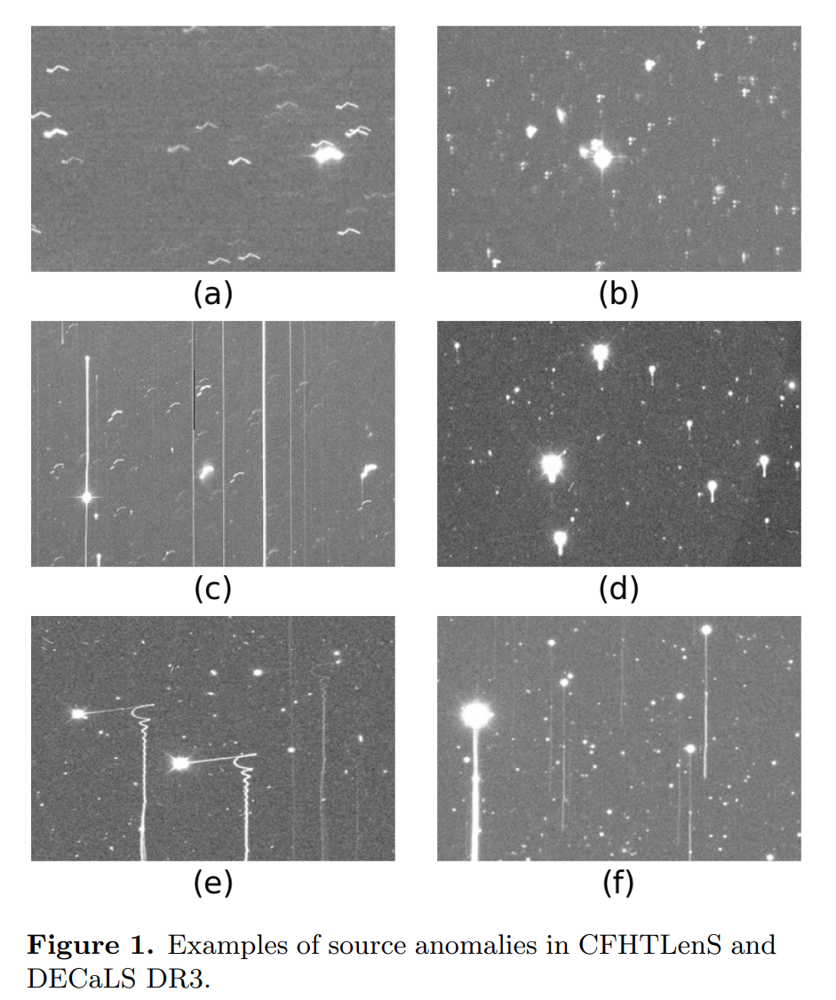

## 2023-10-02

1. [PopSED: Population-Level Inference for Galaxy Properties from Broadband Photometry with Neural Density Estimation](https://arxiv.org/abs/2309.16958)

   > Galaxy, Deep Learning, SED

   用`normalizing flow`来给星系群体建模，通过最小化星系群的合成光度测量与观测数据之间的瓦瑟斯坦距离`Wasserstein distance`来逼近星系群分布。

   

## 2023-10-03

1. [A bright radio burst from FRB 20200120E in a globular cluster of the nearby galaxy M81](https://arxiv.org/abs/2310.00908)

   > Fast Radio Burst, Detection, Observation

   用Effelsberg探测到FRB20200120E的最高能量的爆发$31.4\,\rm Jy\cdot ms$，比之前L波段爆发的能量高44倍，比SGR的爆发FRB20200428高5倍，到了FRB20121102A最弱的爆发的1/3。

   认为球状星团可以产生宇宙学距离的FRB，与SGR1935一起，支持FRB多个起源。

   

2. [Escaping of Fast Radio Bursts](https://arxiv.org/abs/2310.01177)

   > Fast Radio Burst, Theory

   FRB的脉冲有多种方式可以避免非线性吸收，从而从磁星磁层中逃逸出来。

3. [Detection of long-lasting aurora-like radio emission above a sunspot](https://arxiv.org/abs/2310.01240)

   > Solar, Radio, Observation

   行星极区高能电子汇聚，回旋发射产生高偏振、高强度的射电爆发，也就是极光。在低质量恒星和褐矮星中也有类似的爆发。

   这里报告了对太阳长期观测的结果，观测到高亮温度、宽带宽和高圆偏振的太阳射电暴类似极光的射电辐射。辐射源位于太阳黑子的上方，那里存在一个强会聚磁场。认为这样的太阳暴或者其它具有大型星斑的恒星上产生的爆发，形成机制与行星极光一致。

   

## 2023-10-04

1. [Enhanced Bayesian RFI Mitigation and Transient Flagging Using Likelihood Reweighting](https://arxiv.org/abs/2310.02146)

   > Radio, RFI

   假设了噪声的分布，用贝叶斯方法找异常值标记RFI，并将筛选阈值作为拟合参数拟合。

2. [Ultra-High-Energy Gamma-Ray Astronomy](https://arxiv.org/abs/2310.01744)

   > High Energy, Review

   曹臻写的$\gamma-\rm ray$综述。

## 2023-10-05

1. [Identifying physical structures in our Galaxy with Gaussian Mixture Models: An unsupervised machine learning technique](https://arxiv.org/abs/2310.02939)

   > Galaxy, Machine Learning

   用[高斯混合模型](https://github.com/pmelchior/pygmmis)分辨星系结构。

   

2. [AstroCLIP: Cross-Modal Pre-Training for Astronomical Foundation Models](https://arxiv.org/abs/2310.03024)

   > Galaxy, Deep Learning

   [AstroCLIP](https://github.com/PolymathicAI/AstroCLIP)将星系光学图像和光谱共同embedding，进行自监督对比学习预训练。通过接入别的输出层，可以用于输出星系的物理特性，如质量或者红移。

   

## 2023-10-06

1. [Relationship of peak fluxes of solar radio bursts and X-ray class of solar flares: Application to early great solar flares](https://arxiv.org/abs/2310.03135)

   > Solar, Flare, Radio, Statistics

   统计太阳爆发的射电流量和X射线种类，发现二者正相关，意味着可以通过射电流量大致估计X射线爆发的等级。

   

2. [Wavelet transforms of microlensing data: Denoising, extracting intrinsic pulsations, and planetary signals](https://arxiv.org/abs/2310.03338)

   > Gravitational Lensing, Wavelet, Method

   用小波对微引力透镜降噪，提高信号信噪比，最好用的小波族是`Symlet`和`Biorthogonal`。

## 2023-10-09

1. [Rotation Curve Fitting Model](https://arxiv.org/abs/2310.04372)

   > Galaxy, Method

   提出一个仅使用星系光度轮廓加一个自由参数的新模型来拟合星系旋转曲线。

   

## 2023-10-10

1. [Solaris photometric survey: Search for circumbinary companions using eclipse timing variations](https://arxiv.org/abs/2310.05890)

   > Stellar, Variable, Light Curve

   掩食时间变化可以探测到食变双星周围的伴星（三体）。这里介绍`Solaris`，用南半球四台0.5m的望远镜来寻找这种环双星伴星。

   介绍了`Solaris`观测数据的处理，包括光变曲线提取、去趋势以及食变双星建模。对7个事变双星进行观测，并用LSP搜索光变曲线中的周期信号，发现`GSC 08814-01026`有个245d的周期信号，由一个M矮星造成。

2.  [The orbital period of the recurrent nova V2487 Oph revealed](https://arxiv.org/abs/2310.05877)

   > Stellar, Variable, Light Curve

   测到了复发新星`V2487 Oph`的轨道周期18.1小时，是目前已知周期最长的灾变变星之一，用[PyAstronomy](https://github.com/sczesla/PyAstronomy)中的gLSP。并拍到了其处处于耀斑状态时的光谱，在下图中可以看到有$-2000\,\rm km/s$和$1200\,\rm km/s$的HII发射。

   

## 2023-10-11

1. [Discovery of a Radiation Component from the Vela Pulsar Reaching 20 Teraelectronvolts](https://arxiv.org/abs/2310.06181)

   > High Energy, Observation

   高能孤立脉冲星是银河系中很好的粒子加速器和反物质工厂。迄今为止观测到的所有伽马射线脉冲星的光谱在GeV以上截断。

   这里使用HESS在Vela的宽带光中探测到新的辐射成分，将伽马射线的能量扩展到20TeV，比之前唯一在TeV有辐射的Crab高一个数量级。

   

2. [Defining Millisecond Pulsars](https://arxiv.org/abs/2310.06230)

   > Pulsar, Statistics

   用混合高斯模型对脉冲星进行聚类，定义毫秒脉冲星$P\le16\,\rm ms$。

   

3. [Radiation Modes in FRB 20220912A Microshots and a Crab PSR nanoshot](https://arxiv.org/abs/2310.06173)

   > Fast Radio Burst, Theory, Uncertainty Relation

   FRB20220912A的爆发宽度$\le31.25\,\rm ns$，频率通道宽度$16\,\rm MHz$，接近了不确定性原理$\Delta\omega\Delta t=2\pi\Delta\nu\Delta t\ge 1$，同样在Crab的nanoshot中也有$\Delta t\le0.2\,\rm ns$和$\Delta\nu\le 2.2\rm\, GHz$，$\Delta\omega\Delta t\le3$。由此限制等离子体的激发。

## 2023-10-12

1. [The Qitai Radio Telescope](https://arxiv.org/abs/2310.07163)

   > Radio, Instrument

   介绍QTT，海拔1800m，格里高利式望远镜，直径为110米，伞形支撑，150MHz - 115GHz，超宽带接收器和大视场多波束接收器，主要科学目标包括，脉冲星计时阵列、脉冲星巡天、发现双黑洞系统、探索暗物质和宇宙生命起源。

2. [Evidence of mini-jet emission in a large emission zone from a magnetically-dominated gamma-ray burst jet](https://arxiv.org/abs/2310.07205)

   > High Energy, GRB, Observation

   GRB的`prompt emission ` 起源未知，主要有两种假设，一种是物质主导的壳层碰撞诱导激波产生，一种是磁场主导的壳层碰撞诱导磁重联和湍流（ICMART）产生。

   历史上第二亮的GRB GRB230307A，具有能量依赖的快速上升指数衰减（FRED）特征的单宽脉冲形状。对其分析表明其宽脉冲是由许多快速变化的短脉冲组成的，而不是许多短脉冲叠加在一个慢分量上。这一特征与ICMART图像是一致的。
   
   

## 2023-10-13

1. [A 12.4 day periodicity in a close binary system after a supernova](https://arxiv.org/abs/2310.07784)

   > Stellar, Supernova, Observation

   探测到`SN 2022jli`，一颗剥离包络型超新星，衰减光变曲线有12.4天的周期性振荡，晚期光谱中检测到$H\alpha$发射，并有周期性的速度偏移，表明这是一颗双星系统中的大质量恒星发生的爆发。

   

## 2023-10-16

1. [A Thorough Search for Short Timescale Periodicity in Five Repeating FRBs](https://arxiv.org/abs/2310.08971)

   > Fast Radio Burst, Periodicity, Statistics

   用了相位折叠、Schuster周期图和LSP搜索FRB 20121102A、20180916B、20190520B、20200120E 和 20201124A的短周期，都没找到1ms-1000s的周期。

2.  [Precessing jet nozzle connecting to a spinning black hole in M87](https://arxiv.org/abs/2310.09015)

   > Black Hole, Observation

   看到M87黑洞喷流方向以11年的准周期发生偏移。

   

3. [Methods for Averaging Spectral Line Data](https://arxiv.org/abs/2310.09076)

   > Spectrum, Method

   三种谱线平均过程中的加权方案，提升信噪比。

## 2023-10-17

1. [An Information Theory Approach to Identifying Signs of Life on Transiting Planets](https://arxiv.org/abs/2310.09472)

   > Planetary Science, Statistics, SETI

   通过JWST探测系外行星的投射光谱，使用信息熵方法检验光谱是否含有生命特征。
   $$
   \mathcal{D}_{JS}(p||q)=\frac12\sum_\nu p_\nu\log\left(\frac{p_\nu}{r_\nu}\right)+\frac12\sum_\nu q_\nu\log\left(\frac{q_\nu}{r_\nu}\right)
   $$
   其中$p_\nu=h_\nu/\sum_\nu h_\nu$，其中$h_\nu$是大气在特定波长处的有效高度，$r_\nu=(p_\nu+q_\nu)/2$，是由于$p_\nu$和$q_\nu$不对易导致，比如说，地球和火星的光谱信息偏差与火星和地球的光谱信息偏差是一致的，但是$\mathcal{D}_{KL}=\sum_\nu p_\nu\log\frac{p_\nu}{q_\nu}$是不一样的。

2. [Host Galaxies for Four Nearby CHIME/FRB Sources and the Local Universe FRB Host Galaxy Population](https://arxiv.org/abs/2310.10018)

   > Fast Radio Burst, Galaxy

   筛选CHIME中低色散（$<100\,\rm pc/cm^3$）和高银纬（$>10^\circ$）中的非重复暴，与红移在$0.027-0.071$之间中等以上恒星形成率的星系进行交叉匹配，根据CHIME对4个非重复FRB 20181223C、20190418A、20191220A和20190425A的基带定位，发现这些FRB的宿主星系都是螺旋星系，认为超新星是形成FRB的主要渠道。并据此推断，在局域宇宙中，重复和非重复FRB的宿主性质没有差别，且这4个非重复FRB的事件率与CHIME对重复暴采样的事件率是一致的，因此鼓励后续观测。

   

3. [Is the M81 Fast Radio Burst Host Globular Cluster Special?](https://arxiv.org/abs/2310.10328)

   > Fast Radio Burst, Galaxy, Optical, Observation

   重新测量了HST对FRB20200120E的球状星团的观测数据，发现FRB 20200120E距离中心1.92pc，但在半光半径以内，并估计了`relative encounter rate of the FRB host`，略高于对比样本中的恒星交会率$\Gamma$。
   $$
   \Gamma=\int\rho^2/\sigma dV
   $$
   其中$\rho$是星团恒星密度，$\sigma$是星团恒星速度弥散，$V$是星团体积。

   

## 2023-10-18

1. [Double Trouble: Two Transits of the Super-Earth GJ 1132 b Observed with JWST NIRSpec G395H](https://arxiv.org/abs/2310.10711)

   > Planetary Science, Exoplanet, JWST, Observation

   用JWST的近红外探测器`G395H`对岩质行星`GJ 1132 b`进行的两次凌日观测，第一次观测符合以H2O为主的大气层，第二次观测与无特征光谱一致。没有发现两次观测之间的仪器的系统效应，最合理的解释是随机噪声采样导致了两种观测结果。认为JWST研究行星大气需要重复观测。

   

## 2023-10-19

1. [Transformers for scientific data: a pedagogical review for astronomers](https://arxiv.org/abs/2310.12069)

   > Astronomy, Deep Learning

   介绍Transformer，以及在时域序列处理和图像分类在天文上的应用。

2. [Observed Trends in FRB Population and Bi-modality in the Luminosity Density Distribution](https://arxiv.org/abs/2310.11992)

   > Fast Radio Burst, Statistics

   设计了几个无量纲的量比较FRB
   $$
   X_1 = \frac{EL_{300}}{(F^2+S^2t^2)\nu^2DM^4/n_e^4}\qquad X_4=\frac{E\cdot DM^3}{c^3t^3L_{300}n_e^3}\qquad X_6=\frac{k_BT_b}{E}
   $$
   在CHIME的FRB和非CHIME的FRB的计算中，这些量的结果差不多。

## 2023-10-20

1. [Constructing Impactful Machine Learning Research for Astronomy: Best Practices for Researchers and Reviewers](https://arxiv.org/abs/2310.12528)

   > Astronomy, Machine Learning

   介绍如何实施机器学习模型并以确保结果准确性、研究结果可重现性和方法的实用性的方式报告它们的结果。

   

## 2023-10-23

1. [Shedding Light on Low Surface Brightness Galaxies in Dark Energy Survey with Transformers](https://arxiv.org/abs/2310.13543)

   > Galaxy, Deep Learning, Classification, Statistics

   用Transformer ViT从DESI的DR1中搜寻低表面亮度星系（LSBGs, fainter than the night sky，在理解星系演化和宇宙学模型方面起着至关重要的作用），找到了4083个新的LSBG，发现与星系团中心的LSBG相比，星系团边缘的LSBG越来越蓝，体积也越来越大。

   

## 2023-10-24

1. [The Intensity of the Diffuse Galactic Emission Reflected by the Meteor Trails](https://arxiv.org/abs/2310.13929)

   > Meteor

   计算流星尾对星系发射的漫反射，证明反射信号的频谱是宽带的，并且是$-1.3$的幂律。反射信号的强度随当地恒星时和流星亮度的变化而变化，最高可达2000Jy，这与流星射电余辉（MRA）的观测结果吻合。

2. [Weather Forecast of the Milky Way: Shear and Stellar feedback determine the lives of Galactic-scale filaments](https://arxiv.org/abs/2207.03835)

   > ISM, Galaxy, Milky Way, Dynamics

   李广兴的文章，抄他一句话。Young Stellar Objects (YSO) are newly-born stars and they inherit the motion of the gas where they originate from.

   获取银河系YSO星团的三维速度，模拟YSO-分子云在星系势中的运动。结论是，星系的剪切将分子云拉伸成星系尺度的细丝，恒星反馈造成的膨胀为ISM注入了特殊的速度。同时认为Radcliffe Wave也是这么形成的。

   

## 2023-10-25

1. [Detecting anomalous images in astronomical datasets](https://arxiv.org/abs/2310.15481)

   > Galaxy, Deep Learning, Anomaly Detection

   用Entropy方法和Autoencoders进行CCD图像异常检测，结果表明前者在保持较高的召回率的情况下可以保持较低的误报率，目前优于VAE。

   `Entropy`方法，在正常图像中，光源是随机方向的，熵高，在异常图像中，光源指向特定方向，熵降低，并且越亮的源越异常，因此无需对弱源进行统计。挑选图中所有超过$4\sigma$的源，选出其$64\times64$的的像素，统计源的长轴和x轴之间的夹角$\theta$，定义为
   $$
   \theta=\frac{\arctan (e_2/e_1)}{2}
   $$
   其中
   $$
   e_1=\frac{Q_{20}-Q_{02}}{Q_{20}+Q_{02}}\qquad e_2=\frac{2Q_{11}}{Q_{20}+Q_{02}}\qquad Q_{ij}=\sum_{\substack{I(r=\sqrt{x^2+y^2})\\ >I_0=0.02I_{r=0}}}I(r)x^iy^j
   $$
   统计$\theta$的KL散度
   $$
   KL(P_i|\bar P)=\sum_{j=1}^NP_i(\theta_j)\cdot \ln\frac{P_i(\theta_j)}{\bar P(\theta_j)}
   $$
   其中$P_i(\theta_j)$是第$i$次曝光的第$j$个区间的$\theta$数量，$\bar P(\theta_j)$是所有曝光中第$j$个区间$\theta$的平均值。

   

2. [Tully-Fisher relation](https://arxiv.org/abs/2310.16053)

   > Cosmology, Theory, Review

   星系速度由哈勃膨胀和物质密度波动结构的引力共同组成，要计算哈勃常数，就需要测量真实距离。Tully-Fisher是螺旋星系的光度和旋转速度之间的一种经验相关关系，可以作为一种距离指标独立于红移测量距离。

   这个综述讲了Tully-Fisher关系的定义和历史，以及用这个关系测量哈勃常数的方法。
   $$
   M=a+b\log W
   $$
   其中M是绝对光度，W是旋转。

## 2023-10-26

1. [The physical origin of the periodic activity for FRB 20180916B](https://arxiv.org/abs/2310.16307)

   > Fast Radio Burst, Periodicity, Theory

   对CHIME的爆发做P-Pdot折叠，发现可能存在一点周期导数，认为长自转是导致周期的原因。但这样无法解释RM变化，于是引入一个中子星伴星，预测RM是周期性变化的。

   

2. [Deep machine learning for meteor monitoring: advances with transfer learning and gradient-weighted class activation mapping](https://arxiv.org/abs/2310.16826)

   > Meteor, Deep Learning

   用ResNet34对相机图像进行分类，找其中含有流星的帧，用Grad-CAM（通过将最后一个卷积层的激活度与该卷积层特征图的梯度平均值相乘，来帮助识别感兴趣的区域）来确定流星的位置。

   

## 2023-10-27

1. [Comprehensive Bayesian analysis of FRB-like bursts from SGR 1935+2154 observed by CHIME/FRB](https://arxiv.org/abs/2310.16932)

   > Fast Radio Burst, Observation, Statistics

   分析CHIME在2020年到2022年探测到SGR 1935的5个射电爆发。用贝叶斯对这些爆发建模，证实2020年4月的爆发，射电成分先于高能对应物的对应峰值出现。2022年10月的爆发于X射线爆发同时，并且于GBT探测到的射电爆发到达时间一致。估计了SGR 1935的FRB类事件率$0.005^{+0.082}_{-0.004}个/天$，高于$10\,\rm kJy\,ms$的流量。

   

## 2023-10-30

1. [Feature Extraction and Classification from Planetary Science Datasets enabled by Machine Learning](https://arxiv.org/abs/2310.17681)

   > Planetary Science, Deep Learning, Object Detection

   用`Mask R-CNN`识别木卫二断裂冰层区域的冰块，和土卫六上的云层，用于识别有趣的图像，减少卫星数据传输量。

   

## 2023-10-31

1. [Searching for Associations Between Short Gamma-ray Bursts and Fast Radio Burst](https://arxiv.org/abs/2310.19318)

   > Fast Radio Burst, GRB, Progenitor

   在空间中搜索与FRB相关的GRB，找到FRB 190309A和GRB 060502B，但显著性小于$3\sigma$。

2. [Discovering Black Hole Mass Scaling Relations with Symbolic Regression](https://arxiv.org/abs/2310.19406)

   > Galaxy, Black Hole, Machine Learning, Symbolic Regression

   用符号回归+随机森林，找星系-黑洞质量共同演化的方程。

   

3. [Investigating scaling relations in X-ray reverberating AGN using symbolic regression](https://arxiv.org/abs/2310.18584)

   > AGN, Symbolic Regression

   用符号回归找`soft Fe-L lags`和`AGN参数`的关系，发现与黑洞质量或者反射率和爱丁顿比有关。

