## 2023-11-01

1. [Zephyr : Stitching Heterogeneous Training Data with Normalizing Flows for Photometric Redshift Inference](https://arxiv.org/abs/2310.20125)

   > Galaxy, Redshift, Machine Learning

   用`normalizing flow`和`mixture density estimation`估计测光红移。作者列表有点意思，有沈佳士、黄崧、丁源森、蔡峥。

   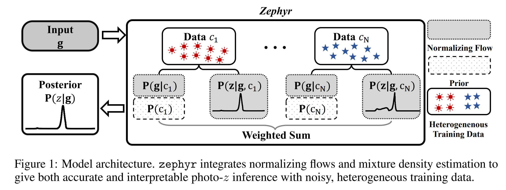

## 2023-11-02

1. [Updating the first CHIME/FRB catalog of fast radio bursts with baseband data](https://arxiv.org/abs/2311.00111)

   > Fast Radio Burst, Observation, Catalog

   CHIME的Catalog1中发布了536个FRB，其中140个有基带数据（时间分辨率2.56 us，频率分辨率 391 kHz）。对基带数据的重新分析，定位到亚角分。提供了140个FRB的偏振信息，数据发布在[Baseband Catalog](https://www.chime-frb.ca/baseband-catalog-1)。CHIME的讨论区[commuynity](https://github.com/chime-frb-open-data/community/discussions)。

   这些爆发中，FRBs 20181215B, 20190122C, 20190124F, 20190411C, 20190502C, 20190617A, and 20190624B形态复杂，FRB 20190630D表现出上漂。结合DESI数据，FRBs 20190617A, 20190411C, 20190227A, 20190303B, 20190423A,  20190605C定位到宿主星系。

   140个爆发中，12个爆发来自7个重复FRB，其中3个在FAST可见天区，FRB 20190117A在VOEvent中出现过，最近一次是2023年5月。

   - FRB 20190116A，$ra=192.270^\circ\pm65^{''}\quad dec=27.164^\circ\pm86^{''}$
   - FRB 20190117A，$ra=331.6579^\circ\pm14^{''}\quad dec=17.3688^\circ\pm17^{''}$
   - FRB 20190606A，$ra=218.714^\circ\pm61^{''}\quad dec=53.313^\circ\pm58^{''}$

   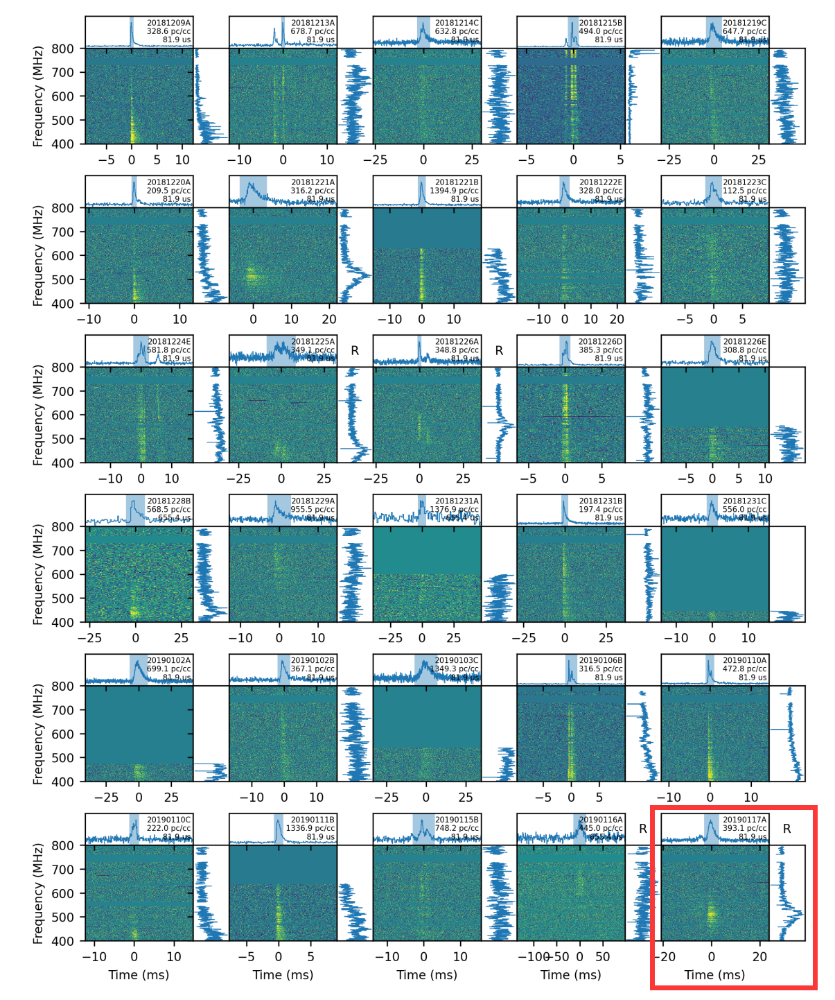

   有一系列文章会在2024年出来。

2. [Estimating distances from parallaxes. VI: A method for inferring distances and transverse velocities from parallaxes and proper motions demonstrated on Gaia Data Release 3](https://arxiv.org/abs/2311.00374)

   > Astrometry, Stellar, Catalog

   时差推断恒星距离，准确性随着距离的增加而迅速降低。这里建立了一个模型，通过恒星的自行和时差一起推断距离和速度。

## 2023-11-03

1. [21 cm Intensity Mapping with the DSA-2000](https://arxiv.org/abs/2311.00896)

   > Instrument, HI, Mapping

   DSA-2000因为系统误差可能导致HI观测无法成图。

## 2023-11-06

1. [A brief review on Fast Radio Bursts](https://arxiv.org/abs/2311.01899)

   > Fast Radio Burst, Review

   总结了法国天体物理学界与快速射电暴相关的研究，最后分享了对快速射电暴科学未来的一些见解。目前观测到FRB爆发的频率从110MHz-8GHz，NenuFAR在10-85MHz观测FRB，期望看到更低频的FRB。

   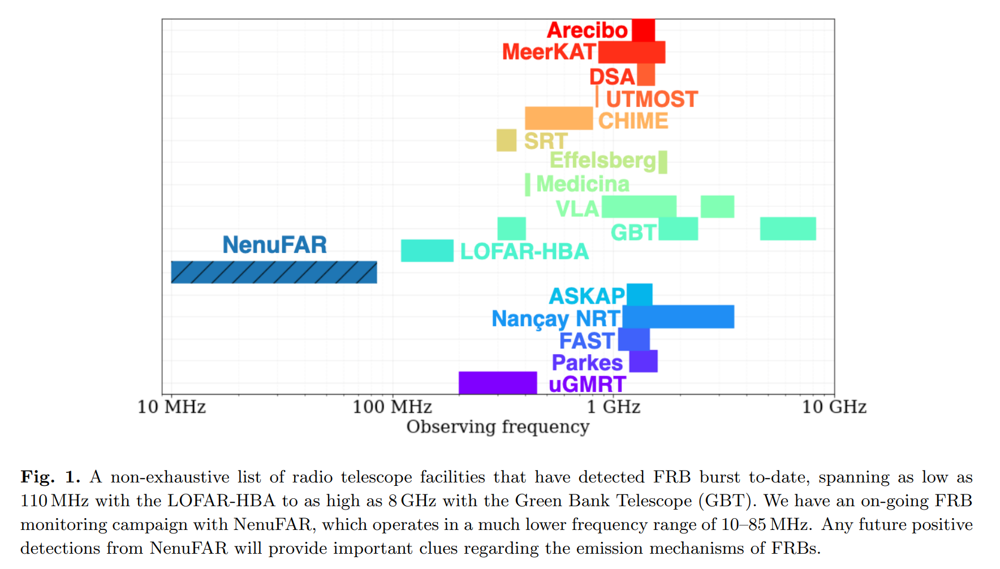

## 2023-11-07

1. [Multi-wavelength studies on Fast Radio Bursts](https://arxiv.org/abs/2311.02360)

   > Fast Radio Burst, Review

   多波段观测FRB，希望找到爆发在射电以外波段的辐射，以及其它一些Associated counterparts，包括PRS、超新星遗迹、持续X射线源、引力波、伽马射线。

   可能的方法包括

   - 以射电望远镜为主体，用其它波段的设备覆盖。
   - 使用射电望远镜跟踪Swift/XRT的事件
   - 多个望远镜共同观测一个源
   - 在已知的FRB的位置搜索其它波段的档案数据

## 2023-11-08

1. [A Topological Data Analysis of the CHIME/FRB Catalogues](https://arxiv.org/abs/2311.03456)

   > Fast Radio Burst, Statistics

   用`Topological Data Analysis (TDA)`拓扑数据分析来分析CHIME的FRB参数（包括下表中的数据）。

   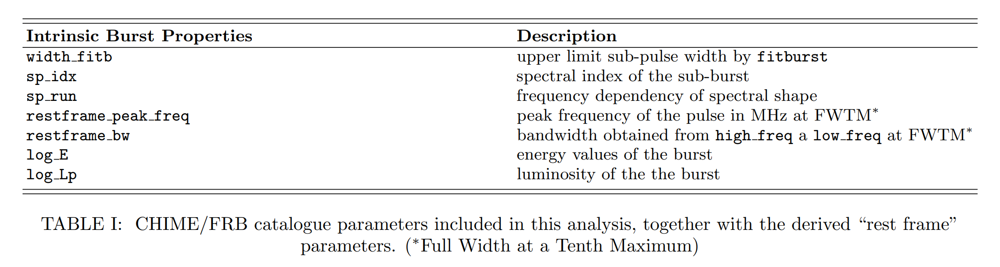

   TDA使用拓扑（研究空间的形状和连通性）从复杂和高维数据集中推断数据中的相关特征，两个主要工具包括`Persistent Homology`和`Mapper`，前者专注于捕获随着过滤参数变化而持续演变的特征，适合于理解数据的全局拓扑特征，后者有助于复杂数据形状和结构的表征。

   分析使用[Ripser](https://github.com/scikit-tda/ripser.py)和[kepler-mapper](https://github.com/scikit-tda/kepler-mapper)进行，这两个都是属于[scikit-tda](https://github.com/scikit-tda)的包，用于对数据进行TDA分析。在流形空间中发现这些FRB聚成了三类，并认为TDA是探索FRB现象多样性和复杂性的有力工具。

   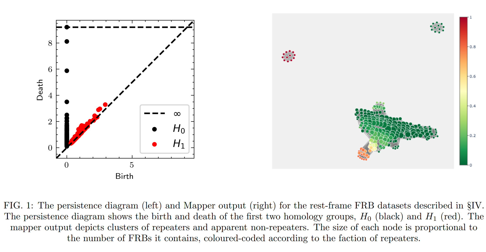

2. [Linear to circular conversion in the polarized radio emission of a magnetar](https://arxiv.org/abs/2311.04195)

   > Magnetar, Polarization, Observation

   射电磁星XTE J1810-197周期5.54s，用Parkes观测发现随着时间推移，线偏振和圆偏振之间会相互转换。可能是磁层或者近场传播效应导致。

   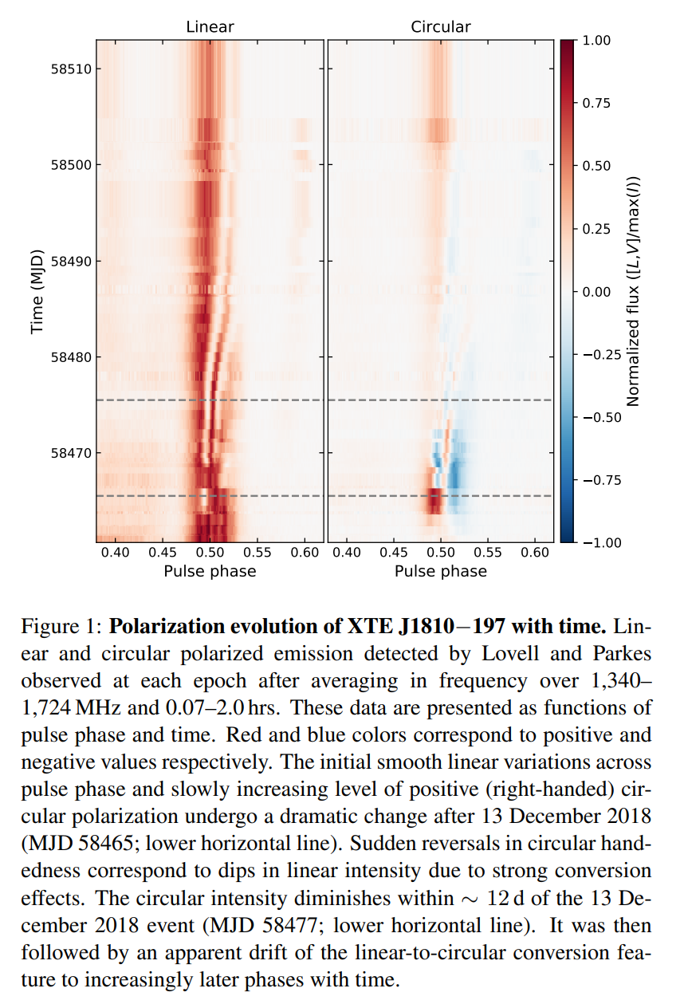

   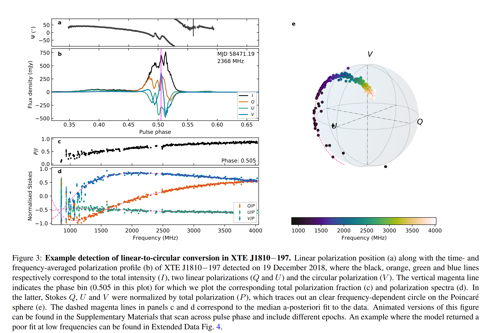

## 2023-11-09

1. [Automated transient detection in the context of the 4m ILMT](https://arxiv.org/abs/2311.04716)

   > Instrument, Transient, Variable, Method

   `4m International Liquid Mirror Telescope`是印度的一个光学液体望远镜，在2022年6月初光。这篇介绍暂现源分类，图像微分然后CNN分类。

## 2023-11-10

1. [Rapid Evolution of the White Dwarf Pulsar AR Scorpii](https://arxiv.org/abs/2311.04967)

   > White Dwarf, Radio

   光学望远镜观测`AR Sco`的9年的光变曲线，周期成分发生了变化，与岁差进动一致。

   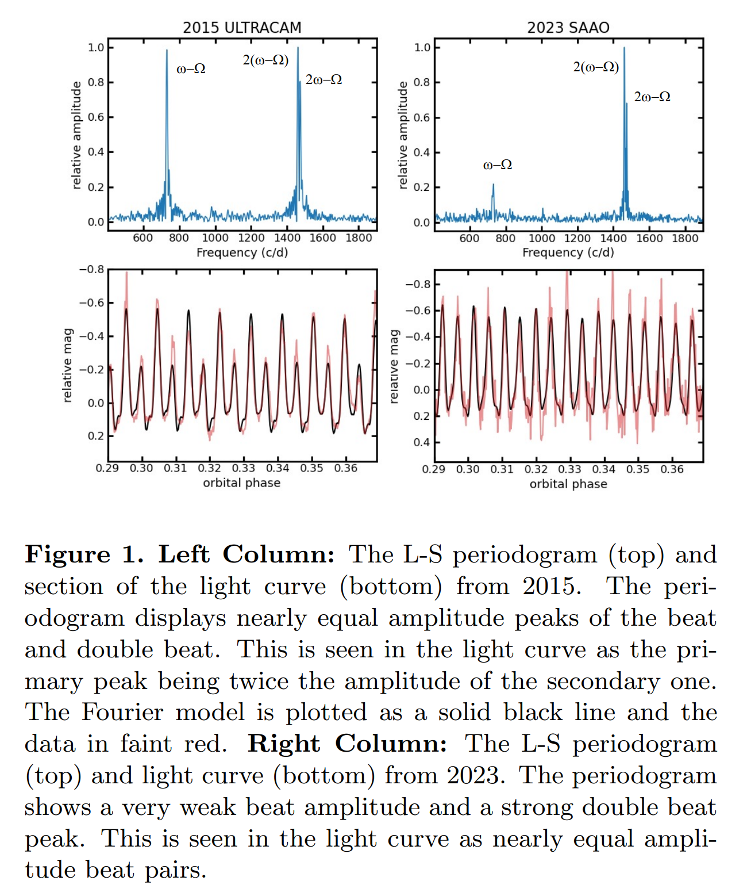

## 2023-11-13

1. [Modeling the Morphology of Fast Radio Bursts and Radio Pulsars with fitburst](https://arxiv.org/abs/2311.05829)

   > Fast Radio Burst, Method

   CHIME的[fitburst](https://github.com/CHIMEFRB/fitburst)终于放出来了，用`Exponentially Modified Gaussians`和`Running Power Law`对爆发进行建模并拟合，对闪烁也有一定的说法。

   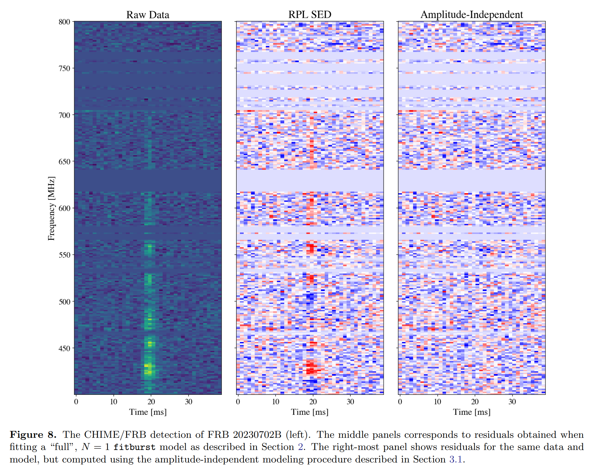

2. [Dynamics of baryon ejection in magnetar giant flares: implications for radio afterglows, r-process nucleosynthesis, and fast radio bursts](https://arxiv.org/abs/2311.05681)

   > Fast Radio Burst, Theory, Magnetar

   磁星巨耀斑对中子星外壳的影响。

## 2023-11-14

1. [Quantifying Period Uncertainty in X-ray Pulsars with Poisson-Limited Data](https://arxiv.org/abs/2311.06620)

   > Pulsar, Statistics, Periodicity

   用泊松统计估计X射线脉冲星周期的不确定性，代码在[这里](https://github.com/akshats14/frequency_error_pulsar/)。

## 2023-11-15

1. [Identifying Light-curve Signals with a Deep Learning Based Object Detection Algorithm. II. A General Light Curve Classification Framework](https://arxiv.org/abs/2311.08080)

   > Variable, Light Curve, Deep Learning

   用弱监督模型分类光变曲线。识别光变曲线和功率谱的最佳窗口并放大，进行特征提取，使模型能够处理不同尺度和采样间隔数据。代码在[这里](https://github.com/ckm3/Deep-LC)。

   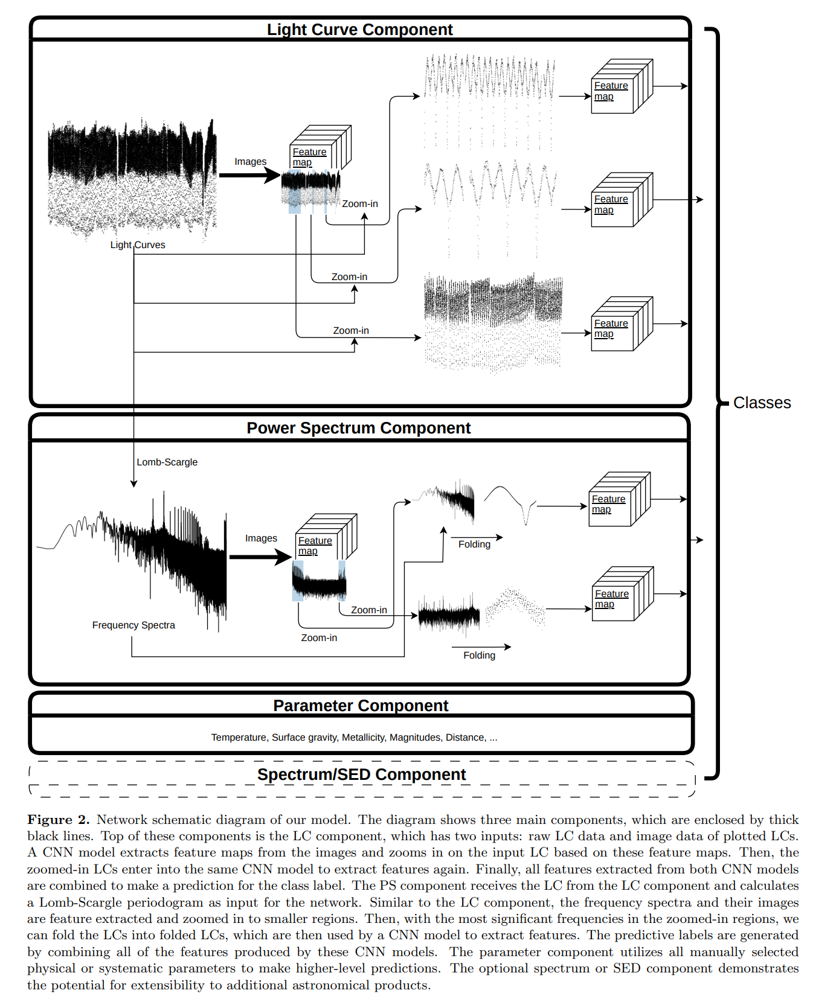

## 2023-11-16

1. [Plasma Radiation Model of Fast Radio Bursts from Magnetars](https://arxiv.org/abs/2311.09097)

   > Fast Radio Burst, Theory

   研究FRB与磁星耀斑有关的辐射机制，讨论由正负电子和质子组成的相对论性强磁化等离子体的辐射区域参数，以实现对观测的预测。

   猜测FRB的爆发会产生谐波，谐波频率是原始爆发频率的一半，亮度也是原始爆发的一半，类似下图的爆发。

   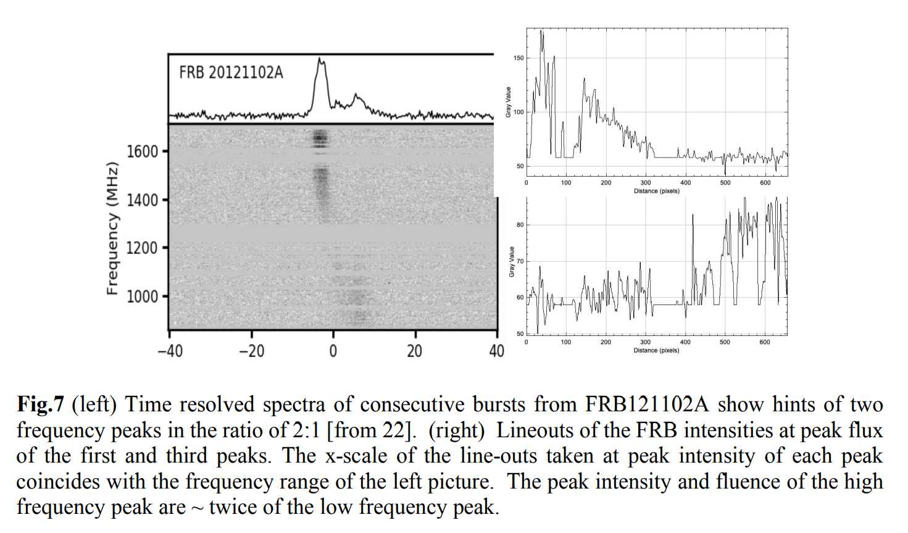

2. [Asteroseismic Modelling of Fast Rotators and its Opportunities for Astrophysics](https://arxiv.org/abs/2311.08453)

   > Asteroseismic, Stellar, Review

   星震综述。

   在恒星演化过程中，自旋会在恒星内部引发多种动力学现象，引导着整个恒星内部的角动量和化学元素迁移，其影响不断累积，决定了当恒星耗尽氢时内核的氦含量与恒星生命末期的重元素产量。

   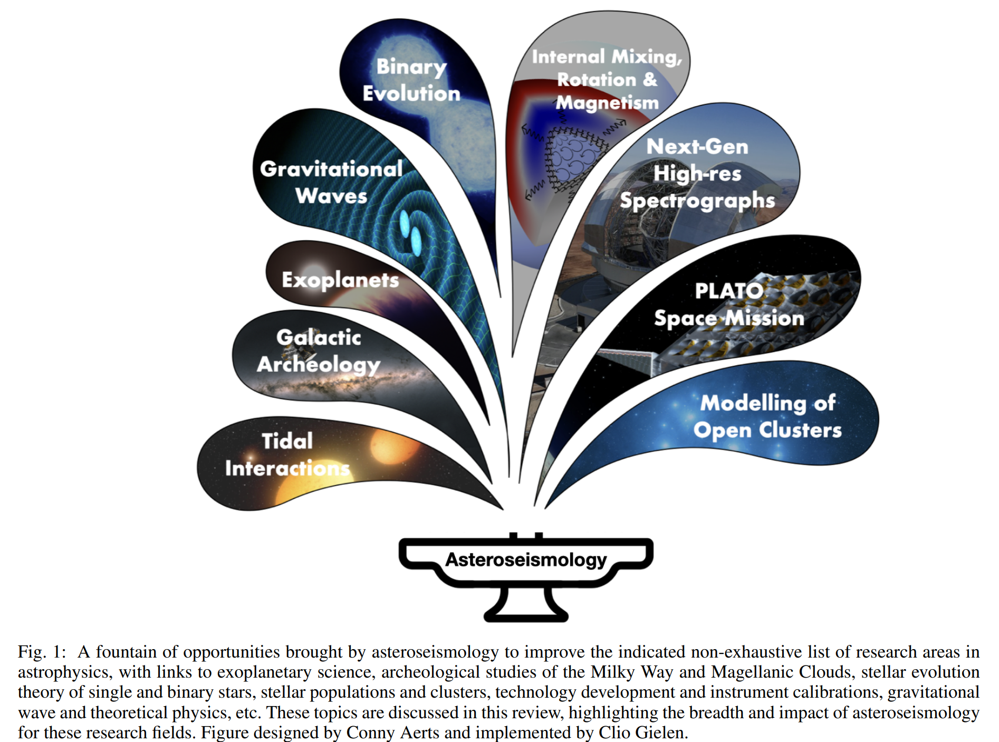

## 2023-11-17

1. [PALANTIR: an updated prediction tool for exoplanetary radio emissions](https://arxiv.org/abs/2311.10033)

   > Planetary Science, Radio, Method

   基于[Exoplanet](https://www.exoplanet.eu/)目录中的系外行星参数，估计它们的射电辐射（行星的射电辐射主要发生在低频<100MHz，周期与行星轨道相同，由回旋maser产生）。或许可以考虑FAST观测申请。

   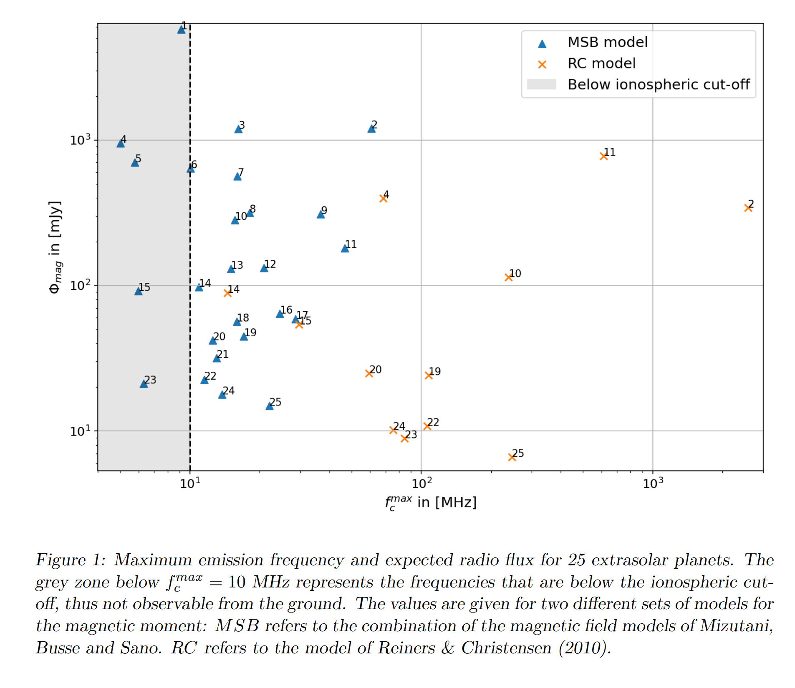

2. [A Collection of German Science Interests in the Next Generation Very Large Array](https://arxiv.org/abs/2311.10056)

   > Astronomy, Instrument, Radio

   德国天文学界对ngVLA的科学兴趣。有Studies of fast radio Bursts above 2 GHz with the ngVLA，写东西可以抄。

## 2023-11-20

1. [LenSiam: Self-Supervised Learning on Strong Gravitational Lens Images](https://arxiv.org/abs/2311.10100)

   > Gravitational Lensing, Deep Learning

   自监督学习框架[SimSiam](https://github.com/facebookresearch/simsiam)是一种简单的孪生网络，用于在不使用标签数据的情况下学习图像的特征表示。它的基本思想是让两个增强视图的特征向量尽可能相似，从而学习到图像的不变性。simsiam的特点是不需要negative pair或对比学习，也不需要large batch，因此它比其他自监督学习方法更简单和高效。

   这里是基于simsiam，开发[LenSiam](https://github.com/kuanweih/LenSiam)，用于强引力透镜图像表征。常用的图像增强会改变透镜属性，比如图像放大会改变爱因斯坦半径，因此引入了一种透镜增强方法，通过固定透镜模型改变源星系保留透镜属性。预训练的lensiam可以用于下游任务。

   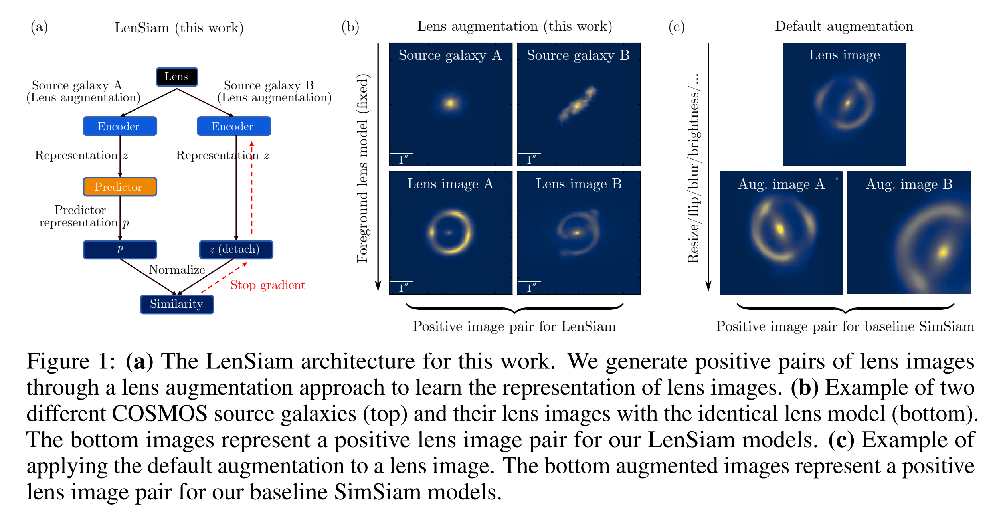

## 2023-11-21

1. [A Fast Radio Burst in a Compact Galaxy Group at z~1](https://arxiv.org/abs/2311.10815)

   > Fast Radio Burst, Galaxy, Observation

   HST对FRB20220610A（红移1的那个）的宿主星系的光学观测，其中一个最可能是宿主星系的光谱红移$z=1.017$，另外附近有三个处于相同红移的源，确定该系统是一个紧凑的星系群。

   这个宿主星系是一个恒星形成星系，恒星形成率$1.7M_\odot/yr$，与红移1处的星系相同，与其它FRB的宿主星系性质也类似。估计FRB的环爆环境有500的色散过量。

   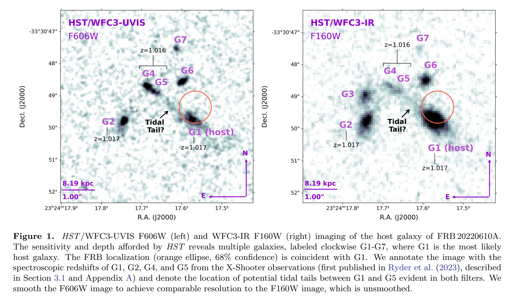

## 2023-11-22

1. [Nuclear regions as seen with LOFAR international baselines: A high-resolution study of the recurrent activity](https://arxiv.org/abs/2311.12114)

   > Galaxy, AGN, LOFAR, Observation

   用LOFAR国际基线的150MHz波段，对Lockman Hole区域6.6平方度的35个射电星系中心区域进行观测，分辨率是0.3角秒。同时结合FIRST的1.4GHz和VLA的3GHz观测测量谱指数。在这些星系中发现了各种形态与频谱特征（flat/steep/peaked），以及确认了之前认为是restarted sample中的5个。

   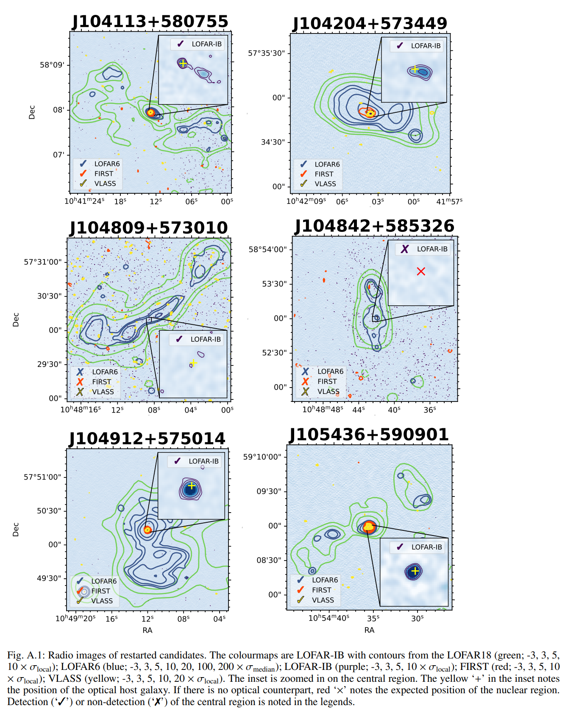

2. [MeerKAT 1.3 GHz Observations of Supernova Remnants](https://arxiv.org/abs/2311.12140)

   > Supernova Remnant, Radio, Observation

   MeerKAT在856-1712MHz对高纬度超新星遗迹的观测，分辨率普遍为8-10角秒。超新星遗迹样本中有一半以上有blowouts/ears，有共同的特征。

   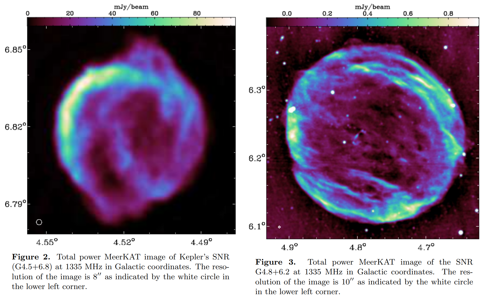

   其中`G15.1-1.6`是一个HII区，而不是SNR。

   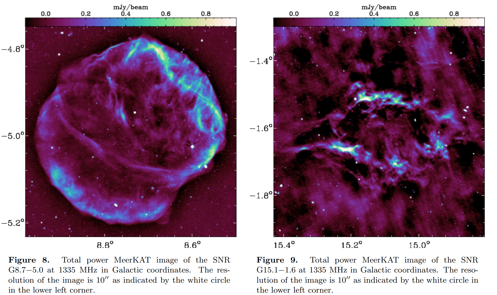

   `G327.6+14.6`与一个延展的偏振喷流背景AGN重叠，从中测量到了法拉第旋转的证据。

   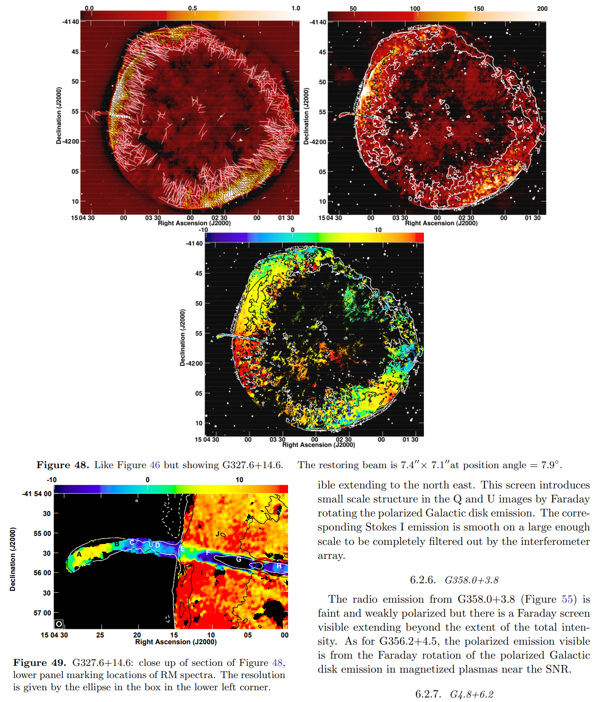

3. [The first Ka-band (26.1-35 GHz) blind line survey towards Orion KL](https://arxiv.org/abs/2311.12276)

   > ISM, Star Formation, Observation, Radio, Spectrum

   用天马的Ka波段26.1-35GHz对OrionKL区域进行谱线盲搜，识别出592个高斯成分，其中257条射电重组线`radio recombination lines (RRLs)`，318条线是来自37个分子，其中10个分子在天马的Q波段巡天中没有被探测到。强调了Ka波段对同时测量RRL和分子谱线非常有用。

   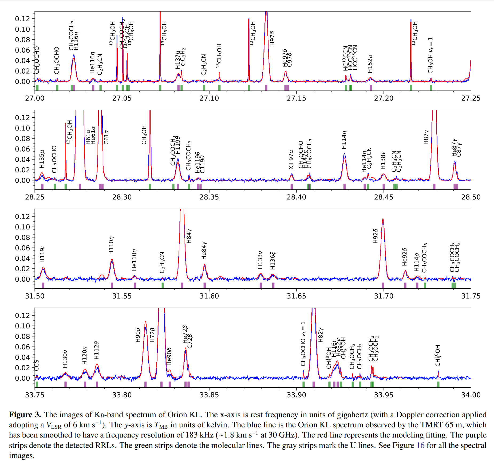

4. [The Rapid ASKAP Continuum Survey V: cataloguing the sky at 1367.5 MHz and the second data release of RACS-mid](https://arxiv.org/abs/2311.12369)

   > Radio, Continuum, Catalog, Observation

   ASKAP在1367.5MHz的[连续谱源星表](https://doi.org/10.25919/p524-xb81)，覆盖了$DEC<+49^\circ$的天空，36200平方度，包括了3,105,668个射电源。目录在1.6mJy以上是完备的。[另一份星表](https://doi.org/10.25919/p8ns-da63)是原始RACS-mid图像中的源列表合并成，没有额外的卷积和去重，以避免丢失时变信号。

   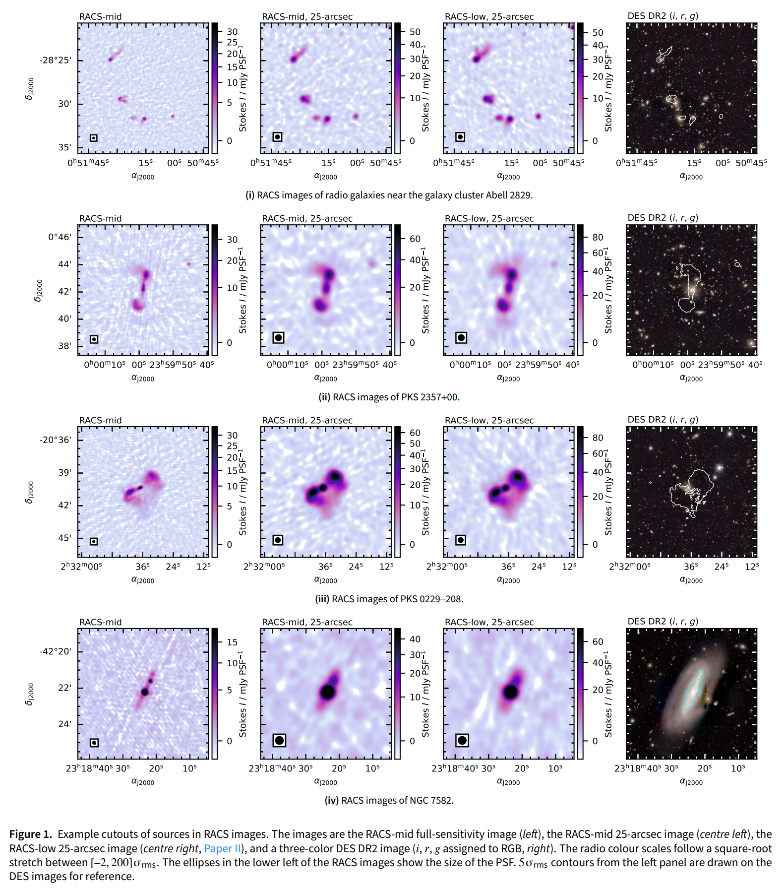

## 2023-11-23

1. [Narrow spectrum in repeating fast radio burst](https://arxiv.org/abs/2311.13114)

   > Fast Radio Burst, Theory

   FRB的窄谱可以看作是bunching的准周期分布，与正态分布的bunching的曲率辐射（会产生宽谱辐射）有相同的偏振，on-beam主要是线偏振，off-beam会产生圆偏振。

2. [Magnetic Fields in Giant Filaments Probed by the Velocity Gradient Technique: Regular Magnetic Field interrupted by Magnetization Gaps](https://arxiv.org/abs/2311.02931)

   > ISM, Dynamics

   用速度梯度技术`Velocity Gradient technique, VGT`，在13CO数据上研究银河系旋臂上filament的磁场方向`magnetic field orientation`。与尘埃偏振发射相比，速度梯度技术使我们能够利用速度信息来分离前景和背景，并从中可靠地确定磁场的方向。

   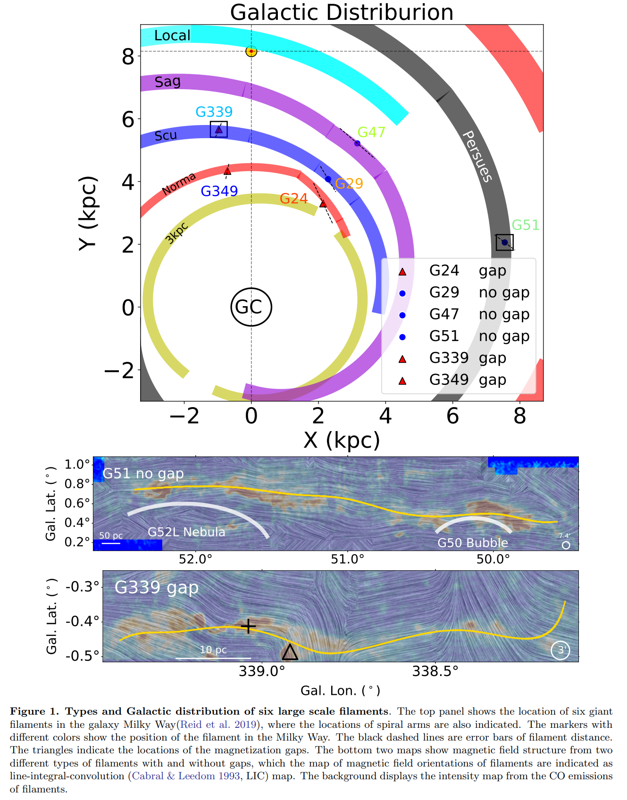

   大多数filament的磁场都与银盘一致，表明银河剪切可能是塑造filament的原因。在$\le10\,\rm pc$的分辨率下，磁场可以保持规则，湍流穿越时间比剪切时间短，这表明湍流运动不能有效地破坏磁场的规则方向。在一些filament中发现的不连续性可能是由filament重组、引力塌缩和恒星反馈等过程造成的。

## 2023-11-24

今日停更。

## 2023-11-27

1. [Quasi-periodic sub-pulse structure as a unifying feature for radio-emitting neutron stars](https://arxiv.org/abs/2311.13762)

   > Pulsar, Periodicity, Magnetar, Observation

   Michael Kramer的文章。之前发现脉冲星辐射中的子结构与旋转周期有关。这里扩展这一相关关系到六个数量级，并且覆盖了磁星和所有种类的射电发射中子星上，射电脉冲的准周期与自转周期的关系$P_\mu=(0.94\pm0.04)\times P(s)^{+0.97\pm0.05}$。

   如果FRB由磁星产生，那么或许可以从FRB的子结构尺度推断其周期。

   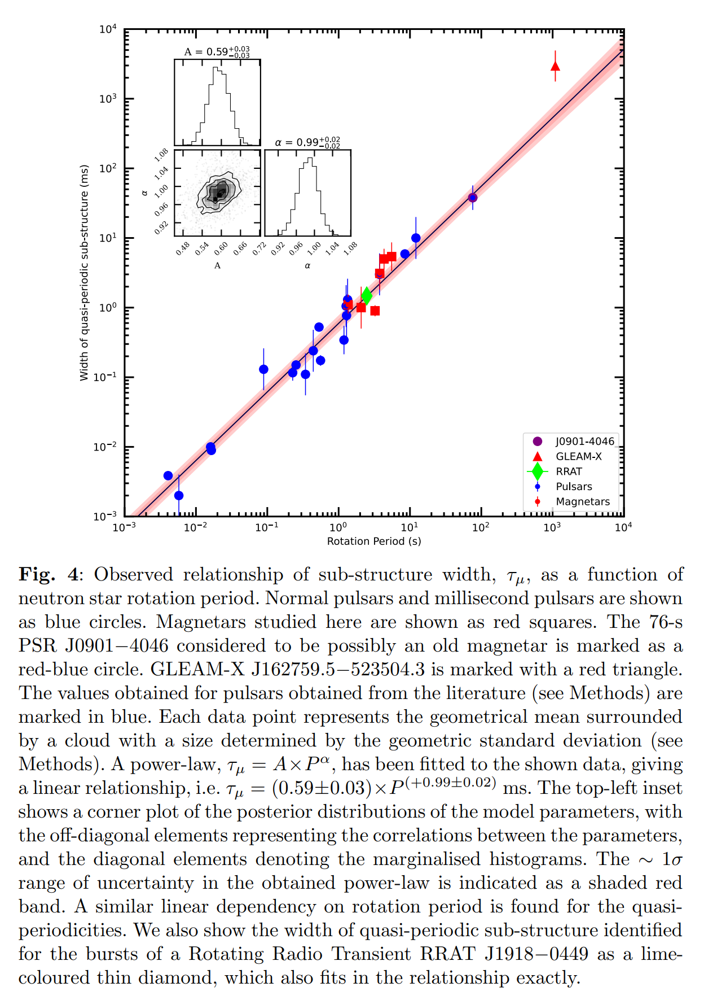

2. [Timing relationships and resulting communications challenges in relativistic travel](https://arxiv.org/abs/2311.14039)

   > Astronomy, Interstellar Communication

   研究相对论效应下的星际通信。

3. [The BOAT GRB 221009A: a Poynting-Flux-Dominated Narrow Jet Surrounded by a Matter-Dominated Structured Jet Wing](https://arxiv.org/abs/2311.14180)

   > High Energy, GRB, Theory

   张冰老师的文章，研究史上最亮`brightest-of-all-time, BOAT`的GRB 221009A。认为其宽波段的观测来自两个喷流成分，一个以`Poynting-flux`主导的铅笔束窄喷流和一个以物质为主的更宽的喷流。认为窄喷流可能存在于更多未被探测到的GRB中。

4. [RFI Detection with Spiking Neural Networks](https://arxiv.org/abs/2311.14303)

   > Radio, Deep Learning, RFI

   通过`ANN2SNN`转换，将最近邻域算法`NLN`和自动编码器架构转换为脉冲神经网络执行，代码在[SNN-RFI](https://github.com/pritchardn/SNN-NLN)。尽管在LOFAR和MeerKAT数据集上表现不如原始NLN算法，但是这一方法消除了NLN中计算和内存密集的采样步骤。 这也是第一项SNNs应用于天文学的工作。

   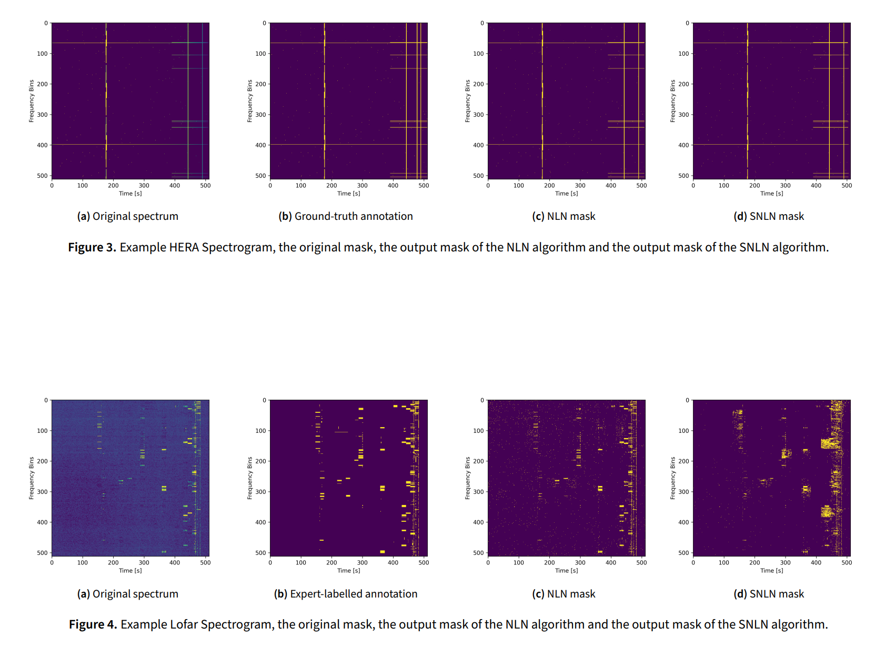

## 2023-11-28

1. [Exploring primordial curvature perturbation on small scales with the lensing effect of fast radio bursts](https://arxiv.org/abs/2311.15848)

   > Fast Radio Burst, Cosmology

   宇宙微波背景已经精确测量到了较大尺度上的原始曲率扰动。由原始密度扰动导致的引力塌缩形成原初黑洞，可以用来约束较小尺度上的原始曲率扰动。这里使用透镜效应限制原初黑洞的分布。

   由于目前并没有观测到有明显透镜的FRB，因此在$10^5-10^6\,\rm Mpc^{-1}$尺度区域，原始曲率扰动的振幅应该小于$8\times10^{-2}$，与`LOGO-Virgo-KAGRA`探测到的双黑洞的质量范围吻合。

   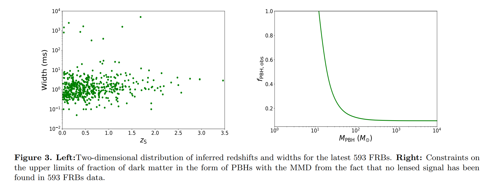

2. [Discovery of a young, highly scattered pulsar PSR J1032-5804 with the Australian SKA Pathfinder](https://arxiv.org/abs/2311.14880)

   > Pulsar, ISM

   在ASKAP巡天中，搜索高圆偏振的源，发现了一个年轻的高散射脉冲星`PSR J1032-5804`，周期78.7ms，DM 819，RM -2000，在3GHz的散射时标22ms，估计1GHz的散射是3845ms。多波段观测表明脉冲星周围存在脉冲星风星云和超新星遗迹。

   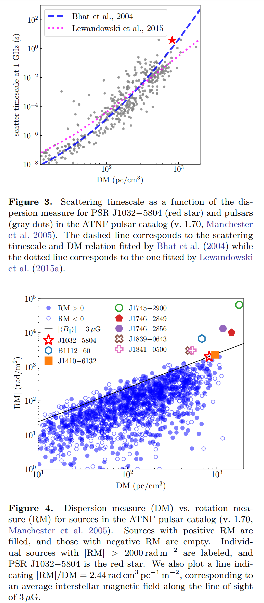

   结果凸显了从射电连续谱中识别极度散射脉冲星的可能性，未来巡天中可能有机会发现更多极端脉冲星，比如高度散射、高度间歇和高度加速的脉冲星。

3. [Robust Joint Estimation of Galaxy Redshift and Spectral Templates using Online Dictionary Learning](https://arxiv.org/abs/2311.14812)

   > Galaxy, Redshift, Machine Learning

   用字典学习从百万星系光谱中推导星系红移，代码在[这里](https://github.com/HyperspectralDictionaryLearning/BryanEtAl2023)。

## 2023-11-29

1. [HI, FRB, what's your z: The first FRB host galaxy redshift from radio observations](https://arxiv.org/abs/2311.16808)

   > Fast Radio Burst, Galaxy, Observation

   MeerKAT观测CRAFT巡天中探测到的非重复FRB 20230718A宿主星系的HI，得到红移0.0357。发现这个FRB的宿主星系正在与近邻一个伴星系相互作用（由HI气体桥为证）。

   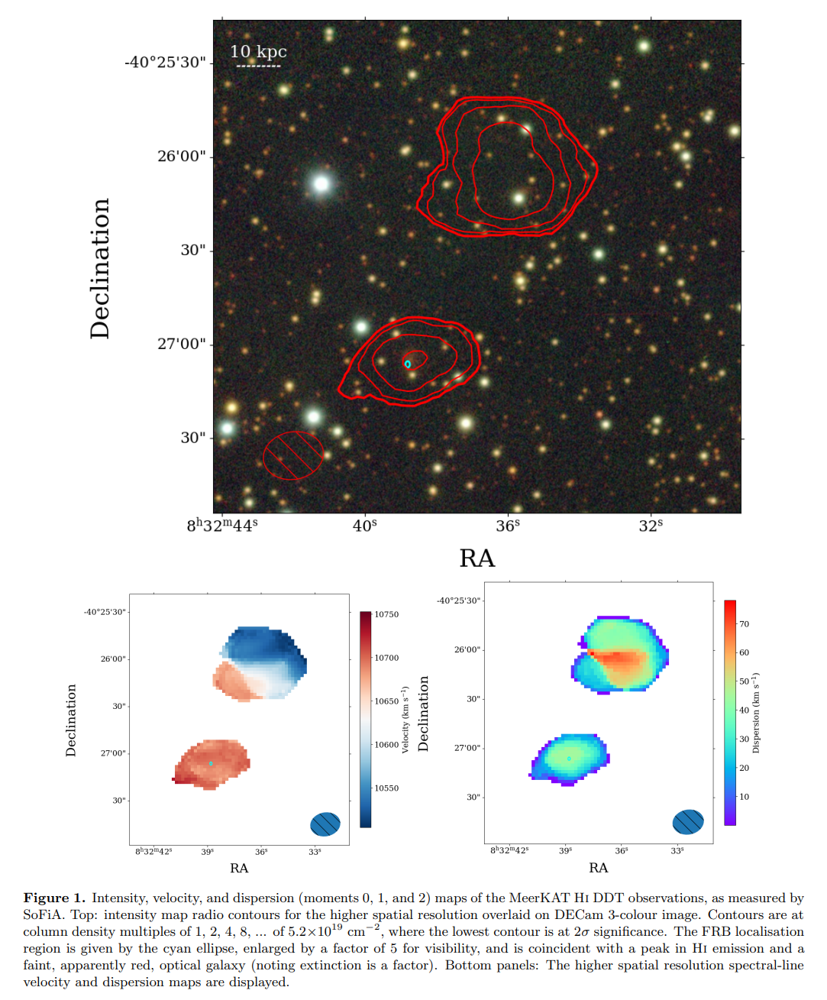

2. [Triple Flares within Five Years in ztf18aanlzzf: An Enhanced Tidal Disruption Rate in ULIRGs?](https://arxiv.org/abs/2311.16726)

   > Galaxy, Light Curve, TDE

   在`zft18aanlzzf`过去5年的光变曲线发现了三次耀斑。快速变亮后缓慢下降，加上强的$He_{II}$线和罕见的`Bowen fluorescence`线的光谱特征，表明这个源至少发生过两次TDE。用TiDE光变曲线建模得出黑洞质量为$10^6M_\odot$，与光谱测量一致。观测到的g/r波段有4天的延迟，与标准吸积盘模型预测有很大出入。

   表明ULIRG中TDE发生率较高。

   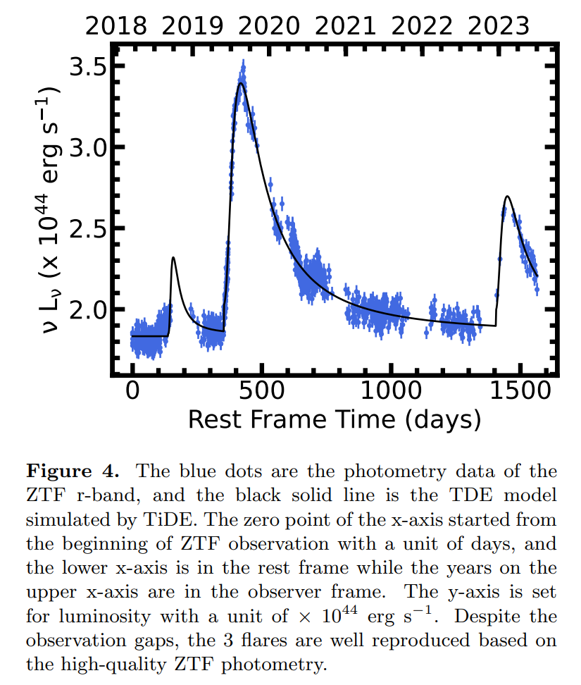

## 2023-11-30

1. [Predicting the Age of Astronomical Transients from Real-Time Multivariate Time Series](https://arxiv.org/abs/2311.17143)

   > Transient, Supernovae, Deep Learning

   根据多波段不均匀采样的超新星光变曲线，用`probabilisticRNN`拟合超新星爆发和亮度峰值的时间，并给出误差。

   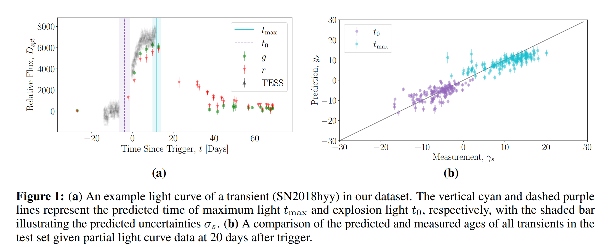

2. [Simulation of ionizing radiation in cell phone camera image sensors](https://arxiv.org/abs/2311.17253)

   > Astronomy, High Energy, Instrument

   分布式高能宇宙射线天文台[DECO](https://www-old.wipac.wisc.edu/deco)，使用大家的手机摄像头观测高能宇宙线。下面是app的截图和事件示例。

   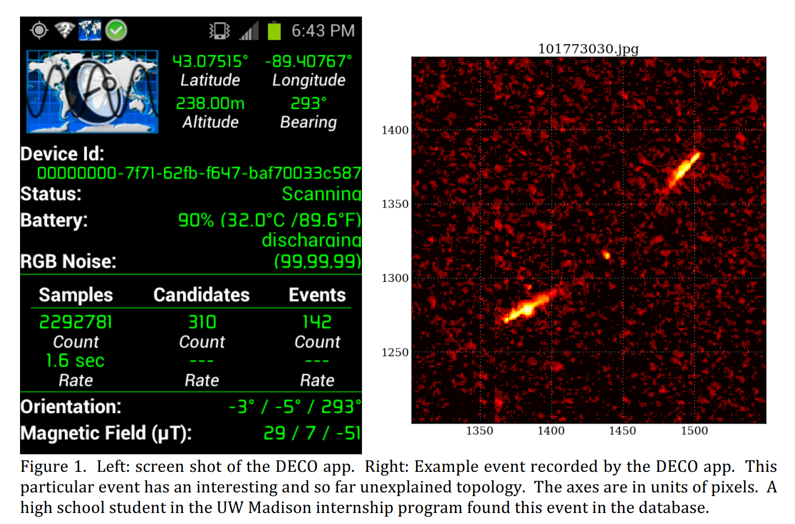

