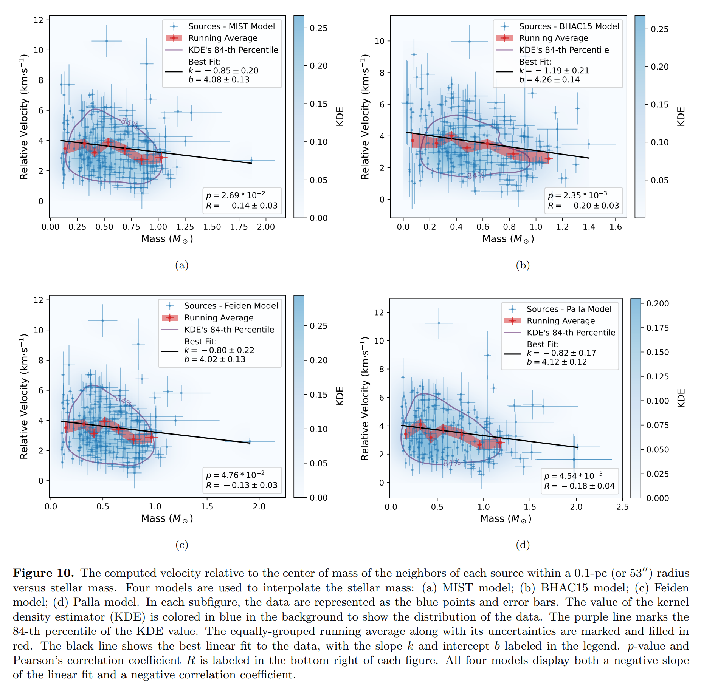
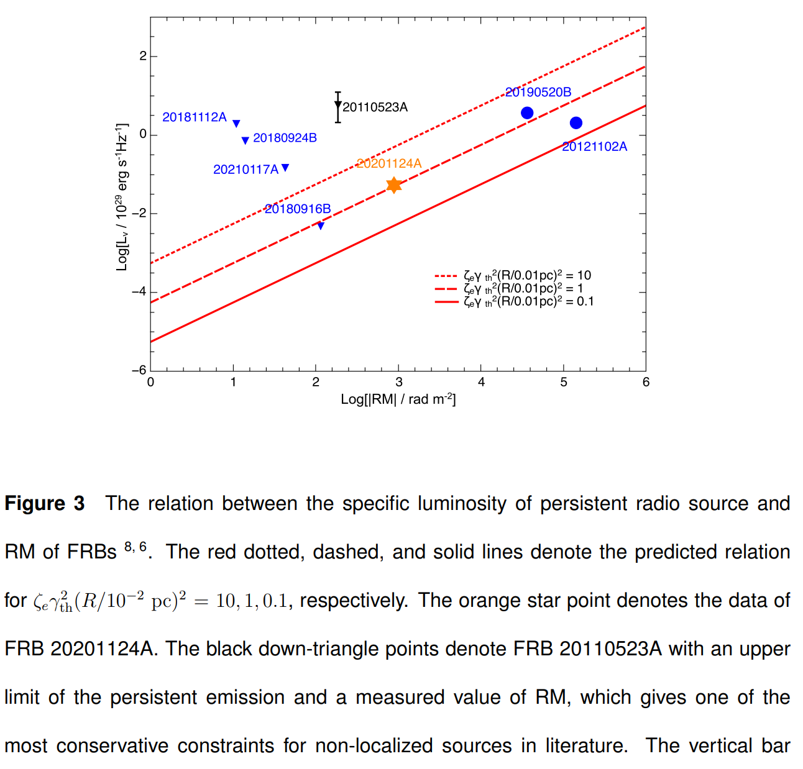

## 2023-12-01

1. [Active learning meets fractal decision boundaries: a cautionary tale from the Sitnikov three-body problem](https://arxiv.org/abs/2311.18010)

   > Simulation, Deep Learning

   主动学习优化的机器学习，现在越来越多地应用在天文混沌系统的模拟中，如N体问题，用以加快模拟速度。这里展示了在预测`Sitnikov`三体问题时主动学习会降低预测的准确度，因此在星团物理学、星系动力学或者宇宙学模拟中，通过主动学习优化可能是一个隐患。

   

## 2023-12-04

1. [Quantifying chaos and randomness in magnetar bursts](https://arxiv.org/abs/2312.00782)

   > Fast Radio Burst, Statistics

   在随机-混沌相空间中对比FRB和磁星普通爆发，不一致说明FRB与磁星的特殊爆发有关联，如FRB200428。

   

2. [New Continuum Observations of the Andromeda galaxy M31 with FAST](https://arxiv.org/abs/2312.00441)

   > Galaxy, Radio Continuum, Observation

   FAST观测M31的连续谱成像。

   

## 2023-12-05

1. [The Environments of Fast Radio Bursts Viewed Using Adaptive Optics](https://arxiv.org/abs/2312.01578)

   > Fast Radio Burst, Galaxy, Observation

   对5个FRB宿主星系的光学观测，发现FRB偏离星系中心的中位数为$2.09r_e$，位于宿主星系较暗，局域恒星质量表面密度较高的区域，且其中4个FRB的宿主星系表现出明显的旋臂特征。

   根据中心偏移的情况，FRB与Ca-rich transients、SGRB和LGRB不同，结合恒星质量分布情况，发现CC-SNe和FRB的环境可能有相似性。

   

2. [A targeted search for FRB counterparts with Konus-Wind](https://arxiv.org/abs/2312.01218)

   > Fast Radio Burst, High Energy, Crossmatch

   将FRB与硬X射线/软Gamma射线发射交叉匹配，使用的是`Konus-Wind`数据，没有发现相关性。

3. [Measuring distances to galaxies with globular cluster velocity dispersions](https://arxiv.org/abs/2312.01420)

   > Stellar, Cluster, Kinematics

   球状星团的绝对星等和恒星速度弥散有明确的相关关系。这里证明这一相关关系$M_V-\log_{10}\sigma$是线性的，且斜率对于银河系和M31的球状星团系统相同。

   

   据此，可以根据Gaia对94个银河系球状星团的视差测量，得到速度弥散与距离的关系。

## 2023-12-06

1. [Variable Chaplygin Gas: Contraining parameters using FRBs](https://arxiv.org/abs/2312.02411)

   > Fast Radio Burst, Cosmology

   Variable Chaplygin Gas是一种宇宙学模型，其中Chaplygin气体最初是由俄罗斯数学家Nikolai Chaplygin于1904年提出的，用于描述理想流体的动力学特性，特别是在空气动力学中的应用。气体的状态方程
   $$
   P=-\frac A\rho
   $$
   这个模型的数学形式与宇宙学中描述暗能量的一些方程形式相似。当修改$A=A(t)$时，提供了一种在演化过程中能够产生加速膨胀的机制。

   这里用FRB和SNIa来限制这一模型的参数，并获得了一致的哈勃常数估计。

2. [Hierarchical Cross-entropy Loss for Classification of Astrophysical Transients](https://arxiv.org/abs/2312.02266)

   > Transient, Deep Learning, Classification

   为多层感知器分类变星设计了一个层次化的损失函数，代码在[这里](https://github.com/villrv/hxe-for-tda/)。
   $$
   L(p,c)=-\sum_{h=0}^{H-1}W(c^h)\lambda(c^h)\log p(c^h|c^{h+1})
   $$
   

## 2023-12-07

1. [Short-lived repeating fast radio bursts from tidal disruption of white dwarfs by intermediate-mass black holes](https://arxiv.org/abs/2312.03107)

   > Fast Radio Burst, Theory

   提出FRB模型，中等质量黑洞对白矮星的潮汐瓦解触发重复FRB，估计光度和时间尺度分别为$L\sim1.96\times 10^{40}\,\rm erg/s$和$\Delta t\sim1.14\,\rm ms$，预计的重复FRB的事件率$10\,\rm yr^{-1}Gpc^{-3}$。

   

2. [A robust method for filling in masked data in astronomical images](https://arxiv.org/abs/2312.03064)

   > Astronomy, Method

   使用迭代中值滤波填充图像遮罩区域，代码在[这里](https://github.com/dokkum/maskfill)。
   $$
   F_{x,y}=\frac{1}{2d+1}\sum_{n=-d}^dF_{x+d,y+n}
   $$
   

## 2023-12-08

1. [Astronomy as a Field: A Guide for Aspiring Astrophysicists](https://arxiv.org/abs/2312.04041)

   > Astronomy, Career

   对天文学中的各个领域进行简单介绍，旨在引导学生了解天体物理学这一广泛领域。

   

2. [The Breakthrough Listen Search for Intelligent Life: Technosignature Search of 97 Nearby Galaxies](https://arxiv.org/abs/2312.03943)

   > SETI, Radio, Observation

   GBT对附近97个星系中心的无线电技术特征搜索。使用[turboSETI](https://github.com/lacker/seticore)进行窄带多普勒漂移搜索，信噪比阈值10，漂移率范围$\pm4\,\rm Hz/s$，光谱分辨率$3\,\rm Hz$，时间分辨率$18.25\,\rm s$，覆盖$1-11\,\rm GHz$。
   
   对等效各向同性辐射功率在$10^{26}\,\rm W$做出了限制，相当于Kardashev Type II civilizations。下面的图是用DBSCAN对找到的信号进行聚类，其中一类中的信号的图像。
   
   

## 2023-12-11

1. [The 3D Kinematics of the Orion Nebula Cluster II: Mass-dependent Kinematics of the Inner Cluster](https://arxiv.org/abs/2312.04751)

   > Stellar, Cluster, Kinematics, Dynamics

   根据Keck II 10m 望远镜上使用自适应光学的NIRSPEC得到Orion Nebula Cluster处246颗恒星高精度的径向速度和表面温度，结合HST测量的恒星自行，研究星团运动学。

   测量到的速度弥散$2.26\pm0.08\,\rm km/s$，超过维里平衡要求的$1.73\,\rm km/s$。最值得注意的是，发现每颗恒星相对于其邻居的速度与恒星质量呈负相关。

   

   统计ONC中心到恒星的空间向量和恒星自行的速度向量，发现向量相差0度的恒星要比相差180度的多，说明ONC恒星有膨胀的趋势，在90度的峰值说明星团有顺时针旋转的倾向。

   

2. [NEural Engine for Discovering Luminous Events (NEEDLE): identifying rare transient candidates in real time from host galaxy images](https://arxiv.org/abs/2312.04968)

   > Transient, Deep Learning, Classification

   根据暂现源的光变信息、宿主星系图像和探测图像等，从广泛的暂现源中找`偏好矮星系的超光度超新星（SLSNe）`和`发生在成核星系中心的潮汐破坏事件`（TDEs）。

   

## 2023-12-12

1. [Auroras on planets around pulsars](https://arxiv.org/abs/2312.05271)

   > Pulsar, Exoplanet, Radio, Auroras

   流体动力学模拟脉冲星周围的行星也能发出极光，flux在$0.1-30\,\rm mJy$之间，最高发射频率$\nu_{max}\sim2.8\,\rm MHz \cdot B_{sw}$，超过电离层的截止频率$10\,\rm MHz$，可以被现有仪器，如LOFAR、MeerKAT和SKA等（探测灵敏度0.1、0.01、0.001mJy）探测到。

2. [Discovery and Timing of Millisecond Pulsars in the Globular Cluster M5 (NGC 5904) with FAST and Arecibo](https://arxiv.org/abs/2312.05835)

   > Pulsar, Observation

   用FAST观测M5球状星团中的脉冲星，里面有我的名字。

3. [Search for "Ronin" Pulsars in Globular Clusters Using FAST: Discovery of Two New Slow Pulsars in M15](https://arxiv.org/abs/2312.05868)

   > Pulsar, Observation

   中值滤波去FAST数据红噪声，相位折叠找M15球状星团脉冲星。

4. [Three Pulsars Discovered in Globular Cluster M15 (NGC 7078) with FAST](https://arxiv.org/abs/2312.06067)

   > Pulsar, Observation

   同样在M15中发现了3个新的脉冲星，用的presto，其中两个跟上一篇一样。

5. [The FAST all sky HI survey (FASHI): The first release of catalog](https://arxiv.org/abs/2312.06097)

   > Galaxy, HI, Observation

   朱明他们的文章，河外HI星系的星表。

6. [Redshift-dependent RSD bias from Intrinsic Alignment with DESI Year 1 Spectra](https://arxiv.org/abs/2312.04518)

   > Galaxy, Cosmology

   上周的文章，讲的是因为星系三维形状和指向之间的内禀相关性对宇宙学测量的影响。有趣的是，她给自己的文章绘制轻松幽默、图文并茂的[总结](https://cmlamman.github.io/doc/fakeRSD_spectra_summary.pdf)。

   

## 2023-12-13

1. [The SARAO MeerKAT 1.3 GHz Galactic Plane Survey](https://arxiv.org/abs/2312.07275)

   > Radio, Continuum, Survey

   MeerKAT在1.3GHz对银道面的连续谱巡天，角分辨率$8''$，灵敏度$10-20\,\rm \mu Jy$，数据会发布在[这里](https://doi.org/10.48479/3wfd-e270)。

   

## 2023-12-14

1. [Characterization of the Repeating FRB 20220912A with the Allen Telescope Array](https://arxiv.org/abs/2312.07756)

   > Fast Radio Burst, Observation

   用`Allen Telescope Array`对FRB 20220192A的观测，541小时探测到35次爆发，流量在$4-431\,\rm Jy\cdot ms$，子结构之间时间间隔的中位数$5.82\pm1.16\,\rm ms$，发现中心频率与带宽的正相关。这是SETI Inst.的设施，由42个6.1米的镜子组成。

   

2. [An Argentinian window to the fast transient sky and to the very high resolution observations](https://arxiv.org/abs/2312.08292)

   > Astronomy, Radio, Instrument

   阿根廷要建一个射电阵`Multipurpose Interferometer Array`，64面5米的镜子，覆盖$100{\rm MHz}-2{\rm GHz}$，基线$50m-55km$，在1.4GHz的视场是4度，角分辨率1.5角秒，用于暂现源定位。

## 2023-12-15

1. [A systematic search for double eclipsing binaries in Zwicky Transient Facility data](https://arxiv.org/abs/2312.08529)

   > Stellar, Variable, Light Curve

   找ZTF中的`double eclipsing binary`，这是四联星。用BLS先从光变曲线中找一次周期信号，减去后再用BLS找周期信号。

   

## 2023-12-18

1. [Review of Hubble tension solutions with new SH0ES and SPT-3G data](https://arxiv.org/abs/2312.09814)

   > Cosmology, Hubble Tension, Review

   使用多组数据（`SPT/Planck/ACT`-CMB power spectra，`BAO`-Baryon Acoustic Oscillation，`Pantheon`-SN Ia）对11种宇宙学模型（$\Lambda$CDM及5种扩展+另外六种模型）。

   结果表明，时变电子质量模型和Majoron模型被排除，其中时变电子质量+空间曲率+早期暗能量模型会把Hubble Tension降低到$1.0-2.9\,\sigma$。但这11个模型都没有达到足够的统计意义使其成为宇宙学的和谐模型。

   

## 2023-12-19

1. [Phantom-Powered Nested Sampling](https://arxiv.org/abs/2312.11330)

   > Astronomy, Bayesian, Software, Method

   马尔科夫链的采样器在参数空间探索中会产生大量的`phantom points`，这些点自相关很强，会被丢弃造成浪费。这里更新嵌套采样[jaxns](https://github.com/joshuaalbert/jaxns)，将这些点利用起来，大大加速了采样效率。

## 2023-12-20

1. [The RATT PARROT: serendipitous discovery of a peculiarly scintillating pulsar in MeerKAT imaging observations of the Great Saturn-Jupiter Conjunction of 2020. I. Dynamic imaging and data analysis](https://arxiv.org/abs/2312.12165)

   > Pulsar, Observation

   MeerKAT在2020年对土星-木星汇合的偏振测量中，偶然发现一颗脉冲星。木星的辐射带很亮，且随时间剧烈变化，因此有必要开发动态成像技术，这篇文章介绍了一系列他们的工具，包括RFI标记[ratt-ru/tricolour](https://github.com/ratt-ru/tricolour)，mask tool [ratt-ru/breizorro](https://github.com/ratt-ru/breizorro)，定标[ratt-ru/CubiCal](https://github.com/ratt-ru/CubiCal)，以及其它数据处理[caracal-pipeline/stimela2](https://github.com/caracal-pipeline/stimela2)。

   多次观测展示了，木星的旋转磁层，对木卫四的射电探测，诸多背景星系以及这个明亮的射电变源`PSR J2009-2026`，持续了45分钟，虽然定性上与闪烁一致，但放大事件的规模和特征时间尺度都很奇怪。

   

2. [Celestial Machine Learning: Discovering the Planarity, Heliocentricity, and Orbital Equation of Mars with AI Feynman](https://arxiv.org/abs/2312.12315)

   > Astronomy, Machine Learning, Symbolic Regression

   开普勒当年做了两个范式的转变才发现了火星的椭圆轨道，首先将地心参考系转换到日心参考系，然后将火星轨道从三维空间降到二维空间。这里试着用[AI Feynman](https://github.com/SJ001/AI-Feynman)从天文观测中发现火星的椭圆轨道。

## 2023-12-21

1. [Memory in the Burst Occurrence of Repeating FRBs](https://arxiv.org/abs/2312.12978)

   > Fast Radio Burst, Statistics

   说FRB的waiting time，短的后面跟短的，长的后面跟长的。

## 2023-12-22

1. [Morphologies of Bright Complex Fast Radio Bursts with CHIME/FRB Voltage Data](https://arxiv.org/abs/2312.14133)

   > Fast Radio Burst, Morphology

   在CHIME有基带数据的爆发中，找到了7个亮度极高且异常复杂的爆发，表现出很多的上漂移以及$<50\mu s$的微结构。爆发的形态与磁层模型和相对论激波一致。

   

## 2023-12-25

1. [The Propagation of Fast Radio Bursts in the Magnetosphere Shapes Their Waiting-time and Flux Distributions](https://arxiv.org/abs/2312.14352)

   > Fast Radio Burst, Theory

   FRB等待时间双峰分布普遍表现出左峰低于右峰，认为可能是磁层中传播效应导致。在FRB传播过程中，会诱导带电粒子做圆周运动，形成电流环，产生与背景磁场方向相反的感应磁场。随着有效磁场强度的变化，后续FRB的吸收概率会受到影响，因此时间延迟较小的爆发更容易被吸收，也会对流量产生影响。

   

2. [Milliarcsecond Localisation of the Hyperactive Repeating FRB 20220912A](https://arxiv.org/abs/2312.14490)

   > Fast Radio Burst, Observation, Localization, Galaxy

   EVN对FRB20220912A的VLBI定位，在角秒尺度上，FRB与已知的持续射电源重合，但是在毫角秒尺度上没有致密射电源，因此持续射电源可能来自宿主星系的恒星形成。

## 2023-12-26

今日停更。

## 2023-12-27

1. [A nebular origin for the persistent radio emission of fast radio bursts](https://arxiv.org/abs/2312.15296)

   > Fast Radio Burst, Galaxy, Observation, PRS

   在VLA的15GHz波段探测到FRB20201124A的compact PRS，大概$20\mu\rm Jy$。

   

   如果PRS提供了FRB的RM，那么PRS的亮度和RM之间存在简单的线性关系
   $$
   L_\nu\propto(\zeta_e\gamma_{th}^2R^2)\times|RM|
   $$
   其中$\zeta_e$是观测波段中同步辐射非热电子和热电子的比例，$\gamma_{th}$是热电子的洛伦兹因子，$R$是等离子体屏的半径。这次的发现补充了低RM部分的观测，这与年轻的磁星作为FRB的中心引擎，而周围的电离星云为PRS提供动力的模型基本一致。

   

2. [Edge-on Low-surface-brightness Galaxy Candidates Detected from SDSS Images Using YOLO](https://arxiv.org/abs/2312.15712)

   > Galaxy, Deep Learning

   用YoLoV5在SDSS的数据上训练找低表面亮度星系的模型，然后搜索构建星表，发ApJS，之后可以抄。

## 2023-12-28

今日停更

## 2023-12-29

1. [A Physics-Informed Variational Autoencoder for Rapid Galaxy Inference and Anomaly Detection](https://arxiv.org/abs/2312.16687)

   > Galaxy, Deep Learning

   用卷积VAE从多波段图像中推断星系红移、恒星质量和恒星形成率，代码在[这里](https://github.com/jwuphysics/galaxy-autoencoders)。

