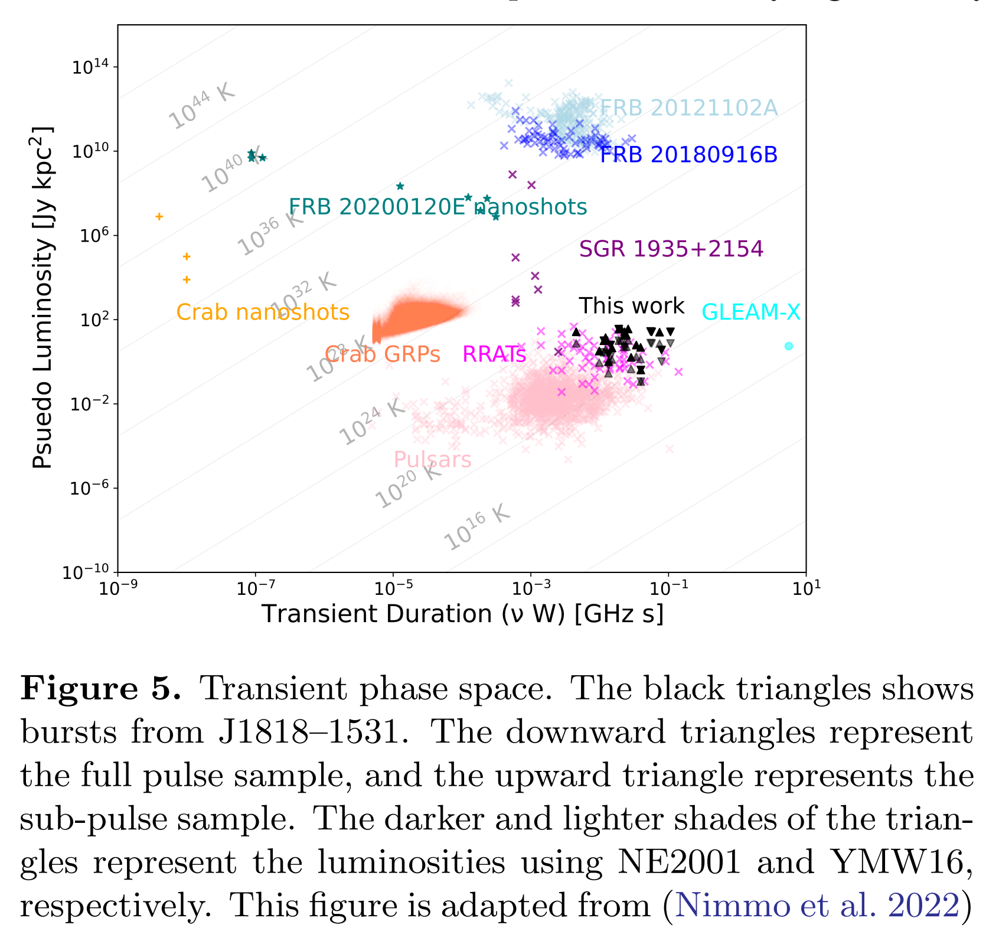

## 2024-01-01

1. [Discovery of Small Ultra-short-period Planets Orbiting KG Dwarfs in Kepler Survey Using GPU Phase Folding and Deep Learning Detection System](https://arxiv.org/abs/2312.17382)

   > Variable, Exoplanet, Light Curve, Method

   在GPU上做相位折叠找系外行星，在开普勒数据上比BOX周期图速度更快，并且找到了三个最小的行星。

## 2024-01-02

1. [The Sonified Hertzsprung-Russell Diagram](https://arxiv.org/abs/2401.00488)

   > Astronomy, Auditory, Sonify

   把开普勒的光变曲线插值直接写入wav文件，以此声化恒星光变曲线数据，并从Gaia数据中找到恒星在HR图上的位置，制作[网站](https://starsounder.space/)。

   

## 2024-01-03

1. [TOPCAT Corner Plot](https://arxiv.org/abs/2401.01156)

   > Astronomy, Software

   新版[TOPCAT](https://www.star.bris.ac.uk/~mbt/topcat/)加入了corner plot。

   

## 2024-01-04

1. [Development Of Raspberry Pi-based Processing Unit for UV Photon-Counting Detectors](https://arxiv.org/abs/2401.01443)

   > Optical, Instrument

   使用树莓派执行紫外光子计数，可以在$3\times3$和$5\times5$的窗口下实现每秒30帧的读取，这种低成本解决方案可以用于廉价的立方星中。

   

## 2024-01-05

1. [AstroLLaMA-Chat: Scaling AstroLLaMA with Conversational and Diverse Datasets](https://arxiv.org/abs/2401.01916)

   > Astronomy, Deep Learning

   [AstroLLaMA-Chat](https://huggingface.co/spaces/universeTBD/astrollama-7b-chat-alpha)，用arxiv上天文文章的introduction和conclusion微调[AstroLLaMA](https://huggingface.co/universeTBD)，并使用GPT4生成的对话来扩展模型的对话流畅性。

2. [The AO327 Drift Survey Catalog and Data Release of Pulsar Detections](https://arxiv.org/abs/2401.01947)

   > Pulsar, Catalog

   AO在327MHz的3100小时数据中探测到的206个脉冲星的星表。[AO327 星表数据集](http://ao327.nanograv.org/)可用于射电脉冲星的种群分析、时间和频率脉冲轮廓演变研究、脉冲星光束的锥体和核心发射、闪烁、脉冲强度分布等应用。它还是信号处理和脉冲星天文学技术教学的现成资源。

   

3. [NGC 2403 XMM4: evidence for a super-Eddington neutron star with a possible transient pulsation](https://arxiv.org/abs/2401.02177)

   > High Energy, Periodicity

   [hendrics](https://hendrics.stingray.science/en/stable/)是用于X射线数据分析的工具。这里用这个工具中的`henaccelsearch`对NGC2403的X射线数据进行搜索，并使用$Z_n^2$统计得到周期信号。

   主要想看一下这个$Z_n^2$的统计。参见[On More Sensitive Periodogram Statistics](https://arxiv.org/abs/1712.00734)中的说法，$R^2$和$Z^2$都相当与对FFT的谐波求和，但是傅里叶变换的谐波并不相互独立，这篇文章中推广了$R^2$到$\mathcal{R}_k^2$，结果表明$\mathcal{R}_k^2$优于FFT，相当于LombScargle，但是在各点测量的不确定度不同时，$\mathcal{R}_k^2$更好。

   原始的$R^2$（在某个频率或者周期$P$处）
   $$
   R^2=\frac2N\left[\left(\sum_{i=1}^n\cos\phi_i\right)^2+\left(\sum_{i=1}^n\sin\phi_i\right)^2\right]
   $$
   其中$\phi_i=2\pi t_i /P$是使用周期$P$将到达时间$t_i$转换的相位，$N$是事件的数量。

   原始的$Z^2$（在某个频率或者周期$P$处）
   $$
   Z_m^2=\frac2N\sum_{k=1}^m\left[\left(\sum_{i=1}^n\cos k\phi_i\right)^2+\left(\sum_{i=1}^n\sin k\phi_i\right)^2\right]
   $$
   其中$N$是时间的数量，$\phi_i$同样是相位，$k$相当于谐波的索引，$m$是计算功率用的谐波的数量。

   文章中有`generalization` 的$R^2$，下面只写对于重新分箱的数据的$\mathcal{R}_k^2$
   $$
   \mathcal{R}_k^2=\frac{\left(\sum_{i=1}^n\rho_i\cos k\phi_i\right)^2}{\sum_{i=1}^n\left(\rho_i\cos k\phi_i\right)^2}+\frac{\left(\sum_{i=1}^n\rho_i\sin k\phi_i\right)^2}{\sum_{i=1}^n\left(\rho_i\sin k\phi_i\right)^2}
   $$
   其中$n$是分箱的数量，$\phi_i$是分箱的中心时间的相位，$\rho_i=r_i/\sigma_i^2$是`mean-subtracted intensity`的$r_i$，除以`square of the uncertainty`的$\sigma_i^2$。非常像LSP的功率
   $$
   \mathcal{P}(\omega)=\frac{1}{2\sigma^2}\left[\frac{\left(\sum r_i\cos\omega(t_i-\tau)^2\right)}{\sum\cos\omega(t_i-\tau)}+\frac{\left(\sum r_i\sin\omega(t_i-\tau)^2\right)}{\sum\sin\omega(t_i-\tau)}\right]
   $$
   其中$n$是分箱的数量，$\sigma^2$是减去平均值的事件率的方差，$r_i$是第$i$个分箱中减去平均值的事件率，$\omega=2\pi/P=2\pi\nu$是角频率，$t_i$是分箱中心，$\tan(2\omega\tau)=\sum_{i=1}^n\sin2\omega t_i/\sum_{i=1}^n\cos2\omega t_i$。

## 2024-01-08

1. [An unidentified Fermi source emitting radio bursts in the Galactic bulge](https://arxiv.org/abs/2401.02498)

   > Radio, Transient, Observation

   VLA观测`Fermi-LAT`探测到的某一个$\gamma$射线源时，探测到射电脉冲，后续GBT观测到更多爆发，定位在$Ra=18h18m34.5106s,\ Dec=-15d31m34.1688s$。

   

   没有找到低于480s的明显周期，爆发都是100%线偏振，有12%的圆偏振，谱指数-2.7，且表现出明显的散射变化。可能是年轻的脉冲星、磁星或者双脉冲星系统。

   

2. [A new timestep criterion for N-body simulations](https://arxiv.org/abs/2401.02849)

   > Nbody, Simulation, Software

   提出一种N体模拟时间步长的动态时标。想记的是[REBOUND](https://github.com/hannorein/rebound)这个N体模拟积分工具。

## 2024-01-09

1. [Gnuastro: visualizing the full dynamic range in color images](https://arxiv.org/abs/2401.03814)

   > Astronomy, Optical, Software

   [Gnuastro](https://codeberg.org/gnuastro/gnuastro)中加入了`astscript-color-faint-gray`新功能，使用非线性变换为较亮的像素分配8bit的RGB值，较暗的像素以反灰度显示。

   

2. [An insight into chromatic behaviour of jitter in pulsars and its modelling: A case study of PSR J0437−4715](https://arxiv.org/abs/2401.03660)

   > Pulsar, Jitter, Timing

   脉冲轮廓形状变化带来测量TOA之间的相关性，导致`Jitter Noise`，限制了纳赫兹引力波探测灵敏度。对`PSR J0430-4715`的抖动噪声的`decorrelation`进行研究，发现了频率相关性。能改善色散测量，但是对计时模型没有明显改善。

## 2024-01-10

1. [Automatic detection of solar radio bursts in NenuFAR observations](https://arxiv.org/abs/2401.04469)

   > Solar Flare, Deep Learning

   用UNET从`NenuFAR`的太阳观测动态谱中分割太阳暴，代码在[这里](https://gitlab.obspm.fr/pmurphy/nenufar_ml)。

   

2. [Is it possible to know cosmological fine-tuning?](https://arxiv.org/abs/2401.04190)

   > Astronomy

   有点玄乎的文章，把学习和知识的获取的认识论概念数学化，评估`Fine-Tuning`。

   微调研究的是某些物理参数或它们之间的相关比率是否位于所谓的允许生命存在的小概率区间内，在这个区间之外就不可能存在碳基生命。

3. [PanGu-π: Enhancing Language Model Architectures via Nonlinearity Compensation](https://arxiv.org/abs/2312.17276)

   > LLM, Deep Learning

   华为的文章，构建了`PanGu-pi`的大语言模型。

## 2024-01-11

1. [Individual subpulses of PSR B1916+14 and their polarization properties](https://arxiv.org/abs/2401.05123)

   > Pulsar, Observation

   PSR B1916+14的子脉冲的偏振位置角与标准模型的偏差与线偏振度和圆偏振度相关，偏差较大的往往是漂移子脉冲。

   

## 2024-01-12

1. [NE2001p: A Native Python Implementation of the NE2001 Galactic Electron Density Model](https://arxiv.org/abs/2401.05475)

   > ISM, Fast Radio Burst

   NE2001的[python版本](https://github.com/stella-ocker/mwprop)。

   

2. [A spectral data release for 104 Type II Supernovae from the Tsinghua Supernova Group](https://arxiv.org/abs/2401.05889)

   > Supernovae, Spectrum

   用兴隆216和丽江2.4m望远镜得到的104颗Type II超新星的光谱。

## 2024-01-15

1. [TELAMON: Effelsberg monitoring of AGN jets with very-high-energy astroparticle emission -- I. Program description and sample characterization](https://arxiv.org/abs/2401.06296)

   > AGN, Radio, Continuum

   用Effelsberg观测AGN的射电光谱，在14-45GHz之间，发现大多数是平谱。主要看看他们单镜怎么看连续谱，Effelsberg每个接收机都有两个horn，观测时一个指向源，一个指向天空背景，因为阴天的时候地球大气会产生一些额外的类似的辐射。然后还对源附近做mapping观测，用于准确确定源的流量。

## 2024-01-16

今日停更。

## 2024-01-17

1. [MeerKAT Pulsar Timing Array parallaxes and proper motions](https://arxiv.org/abs/2401.06963)

   > Pulsar, PTA, Kinematics

   用MeerKAT脉冲星计时测量到脉冲星的视差和自行。

   

## 2024-01-18

1. [Detecting Dark Matter Substructures on Small Scales with Fast Radio Bursts](https://arxiv.org/abs/2401.08862)

   > Fast Radio Burst, Cosmology

   测量同一个FRB在不同望远镜到达的时间差，探测AU尺度的暗物质子结构。或者同一个望远镜测量到FRB爆发的不同透镜图像到达时间差的时间变化。后者相当于提供了一个等效2000AU的基线，要更灵敏。

   

## 2024-01-19

1. [A pulsar in a binary with a compact object in the mass gap between neutron stars and black holes](https://arxiv.org/abs/2401.09872)

   > Pulsar, Observation

   MeerKAT对`PSR J0514-4002E`的计时结果，这是位于球状星团NGC 1851中偏心的双毫秒脉冲星。伴星是致密天体，质量处于最大中子星和最小黑洞之间，因此要么是一个质量非常大的 NS，要么是一个低质量的 BH。这里认为伴星是由两个早期的NS合并形成。

   

2. [Ultra-deep ATCA imaging of 47 Tucanae reveals a central compact radio source](https://arxiv.org/abs/2401.09692)

   > Radio, Imaging

   澳大利亚ATCA阵列对球状星团`47Tuc`做了射电成像，在星团中心发现了一个微弱的平谱射电源，没有光学对应体，多波段数据表明不太可能是AGN、色球活动双星或者涉及白矮星双星，比较合理的解释是一个未被发现的毫秒脉冲星或者一个弱吸积黑洞。

   

3. [New-generation Maximum Entropy Method (ngMEM): a Lagrangian-based algorithm for dynamic reconstruction of interferometric data](https://arxiv.org/abs/2401.10177)

   > Radio, Imaging, VLBI, Method

   用最大熵的办法，在每个积分时间都在变化的VLBI测量数据中，重建图像，代码在【这里](https://github.com/AlejandroMus/ngMEM_constrained)。

4. [Decades of Transformation: Evolution of the NASA Astrophysics Data System's Infrastructure](https://arxiv.org/abs/2401.09685)

   > Astronomy

   关于ADS的前世今生。

   

## 2024-01-22

1. [Using GMM in Open Cluster Membership: An Insight](https://arxiv.org/abs/2401.10802)

   > Stellar, Cluster, Machine Learning

   用高斯混合模型GMM确定Gaia星表中星团的成员星，发现性能与星团距离之间存在一定的相关性，GMM对于距离大于3kpc的星团效果不佳。

## 2024-01-23

1. [The MeerKAT 1.3 GHz Survey of the Small Magellanic Cloud](https://arxiv.org/abs/2401.11024)

   > Galaxy, MeerKAT, Survey

   MeerKAT观测小麦哲伦云方向的连续谱的图像和星表，中心频率1.3GHz，带宽0.8GHz，视场7平方度，分辨率8角秒，灵敏度$11\mu\rm Jy/beam$。

   这个区域包含108,330个点源和517个`compact extended sources`，有新的超新星遗迹，中心有一个X射线磁星。探测到行星状星云的亮端，以及一些前景射电恒星和背景射电星系。

   

## 2024-01-24

1. [Apparently ultra-long period radio sources from self-lensed pulsar-black hole binaries](https://arxiv.org/abs/2401.12494)

   > Pulsar, Black Hole, Theory, Lensing

   脉冲星-黑洞系统对脉冲星发射的自引力透镜效应，对于edge-on的系统，每个周期都会发生一次。当脉冲星信号太弱无法探测时，可以产生超长周期（几分钟到几小时）的射电信号，每个这样的信号都是由若干放大后的脉冲组成。

   模型可以用于解释最近发现的三个长周期射电源，`GLEAM-XJ1627`、`PSR J0901-4046`、`GPM J1839-10`，要解释它们的信号的持续时间和周期，需要的透镜质量分别是$10^4M_\odot$，$4M_\odot$，$10^{3-6}M_\odot$。一台灵敏度为$10\rm mJy$的望远镜可以探测到银河系中大约20个这样的系统。

   

## 2024-01-25

1. [Detecting and Characterizing Exomoons and Exorings (Handbook of Exoplanets, 2nd Edition)](https://arxiv.org/abs/2401.13293)

   > Planetary Science, Exoplanet, Review

   探测系外行星卫星的综述。

## 2024-01-26

1. [TransientX: A high performance single pulse search package](https://arxiv.org/abs/2401.13834)

   > Transient, Software

   门云鹏的[TransientX](https://github.com/ypmen/TransientX)，搜索暂现源，流程包括消RFI、消色散、匹配滤波、聚类和候选图绘制。其中消色散是在CPU上实现的子带消色散，聚类使用DBSCAN，使用`kd-tree`消除重复候选。

2. [Rapid evolution of the recurrence time in the repeating partial tidal disruption event eRASSt J045650.3-203750](https://arxiv.org/abs/2401.14091)

   > High Energy, TDE, Observation

   对`eRASSt J045650.3-203750`的多波段观测（X-射线、紫外线、射电），证实其为重复出现的潮汐瓦解时间。长时间的观测发现X射线耀斑的重现时间Trecur发生了快速变化，从300天下降到190天左右，并且在X射线辐射峰值用ATCA探测到连续谱的辐射。重复的TDE可以成为探索银河系意外超大质量黑洞周围动力学的有效工具。

   

## 2024-01-29

1. [Variable white dwarfs in TMTS: Asteroseismological analysis of a ZZ Ceti star, TMTS J17184064+2524314](https://arxiv.org/abs/2401.14692)

   > Stellar, Variable, White Dwarf, Periodicity

   清华马化腾望远镜一直在监测北天，寻找变星。与Gaia星表交叉匹配取出白矮星的光变曲线，发现了第二颗`ZZ Ceti`，找到25.12小时的自转周期。根据星震学给出的固有光度推算出的距离为 $64\pm15\,\rm pc$，与 Gaia DR3 得出的 $70.1\pm0.2\,\rm pc$ 的距离相符，误差在不确定范围之内。

2. [Neutron-star Measurements in the Multi-messenger Era](https://arxiv.org/abs/2401.14930)

   > Pulsar, Review

   精确测量中子星的整体特性（如质量、半径和惯性矩）是一项重大挑战。本文全面回顾了测量中子星特性的不同方法以及对理论模型的依赖程度。

## 2024-01-30

1. [The Zwicky Transient Facility Bright Transient Survey. III. BTSbot: Automated Identification and Follow-up of Bright Transients with Deep Learning](https://arxiv.org/abs/2401.15167)

   > Transient, Deep Learning

   [BTSbot](https://github.com/nabeelre/BTSbot)是用ZTF图像和从光变曲线中提取恒星参数做变源分类的工具，用于在ZTF巡天项目中实现实时暂现源分类。

   

## 2024-01-31

1. [Similarity to earthquakes again: periodic radio pulses of the magnetar SGR 1935+2154 are accompanied by aftershocks like fast radio bursts](https://arxiv.org/abs/2401.16758)

   > Fast Radio Burst, Statistics

   又是这个FRB跟地震像的文章，这次换成了SGR1935，同样的偏离泊松就跟地震像了。

2. [The SRG/eROSITA all-sky survey: First X-ray catalogues and data release of the western Galactic hemisphere](https://arxiv.org/abs/2401.17274)

   > High Energy, Survey, Catalog

   `eROSITA`是`Spektrum Roentgen Gamma (SRG)`卫星上的X射线望远镜，观测频段0.2-2.3keV。今天他们在arXiv上放了30多篇文章，这篇是介绍他们的X射线星表。

