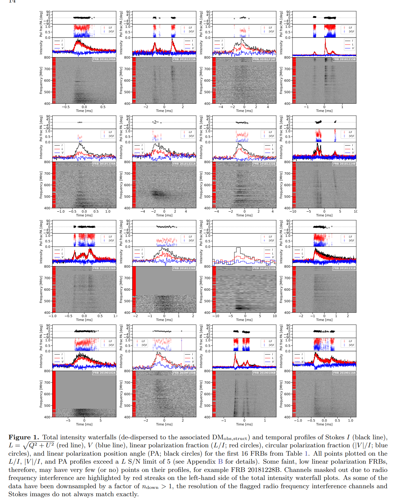
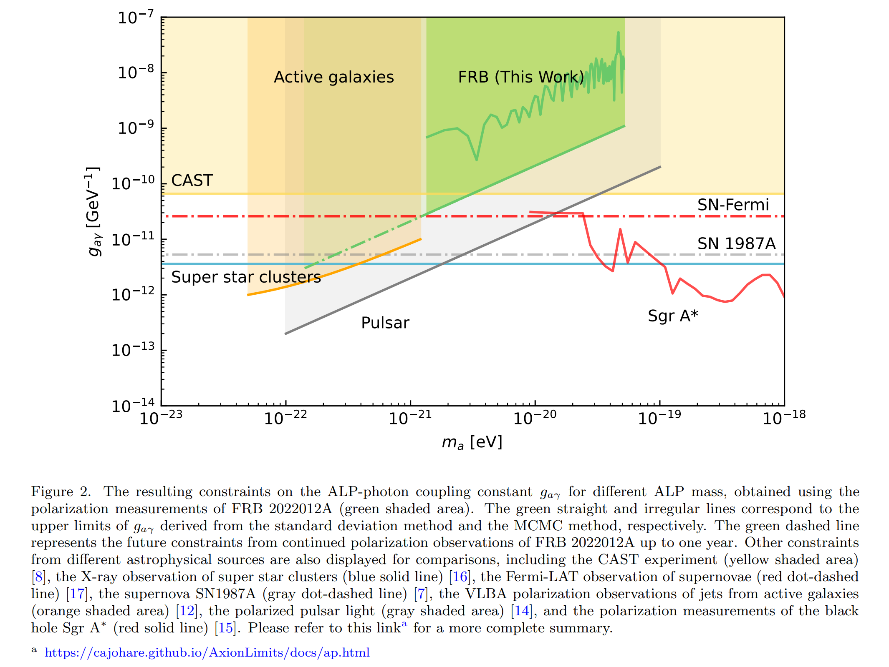
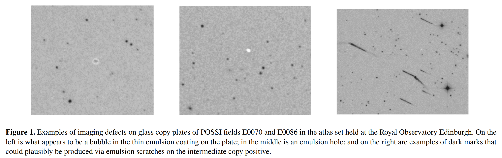
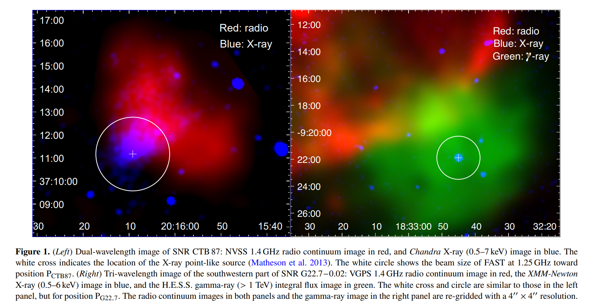

## 2024-02-01

1. [Polarization properties of the 128 non-repeating fast radio bursts from the first CHIME/FRB baseband catalog](https://arxiv.org/abs/2401.17378)

   > Fast Radio Burst, Polarization, CHIME

   CHIME的128个有基带数据的FRB的偏振分析，其中89个能测到RM。统计发现重复FRB和非重复FRB的RM分布一致。非重复FRB的PA分为四种形态，单成分恒定PA（57%）、单成分可变PA（10%）、多成分恒定PA（22%）、多成分可变PA（11%）。

   非重复FRB的线偏振度从<10%到100%，但是没有发现整个群体的频率依赖的消偏振现象，因此偏振度不同可能是FRB的本征辐射机制。

   

2. [Plasma lensing interpretation of FRB 20201124A bursts at the end of September 2021](https://arxiv.org/abs/2401.18036)

   > Fast Radio Burst, Theory

   当射电光子在非均匀电子密度体积中传播时，等离子体的透镜效应会使观测到的光通量在某些频率下极端放大。由于等离子体透镜是一个发散透镜，当它与源对齐时，可以极大地抑制观测到的通量。

   认为FRB20201124A在2021年9月份事件率激增后突然消失是等离子体透镜导致的。估计透镜和源之间的相对运动速度为$v=98(a/{\rm AU})\ {\rm km/s}$。

3. [HiFAST: an HI data calibration and imaging pipeline for FAST](https://arxiv.org/abs/2401.17364)

   > Radio, HI, Software

   王杰他们的HI数据定标处理流程，代码在[这里](https://hifast.readthedocs.io/en/v1.3/)。

## 2024-02-02

1. [Detecting Extragalactic Axion-like Dark Matter with Polarization Measurements of Fast Radio Bursts](https://arxiv.org/abs/2402.00473)

   > Fast Radio Burst, Theory

   轴子或类轴子粒子（ALPs）是暗物质（DM）中最有希望的候选粒子之一。探测类轴子暗物质的一种普遍方法是，在天体物理源发射的线偏振光的偏振角中，寻找周期性振荡特征。

   这里用FRB 20220912A的数据，测量ALP的质量和光子耦合常数的上限。

   

2. [On the nature of apparent transient sources on the National Geographic Society-Palomar Observatory Sky Survey glass copy plates](https://arxiv.org/abs/2402.00497)

   > Stellar, Variable, Machine Learning

   `Palomar Observatory`过去的巡天项目保留有照相底板，这里对这些玻璃拷贝板的数字化扫描数据进行分析，用随机森林进行图像分类，发现玻璃板上的暂现源可能是摄影乳剂的虚假伪影。

   

3.  [Discovery and timing of pulsar J2016+3711 in supernova remnant CTB 87 with FAST](https://arxiv.org/abs/2402.00578)

   > Pulsar, Discovery, Supernovae

   在超新星遗迹CTB87中发现了脉冲星，是FAST在SNR中发现的第一颗脉冲星，周期50.81ms，周期导数$7.2\times10^{-14}\rm\ {s\,s^{-1}}$。

   

## 2024-02-05

