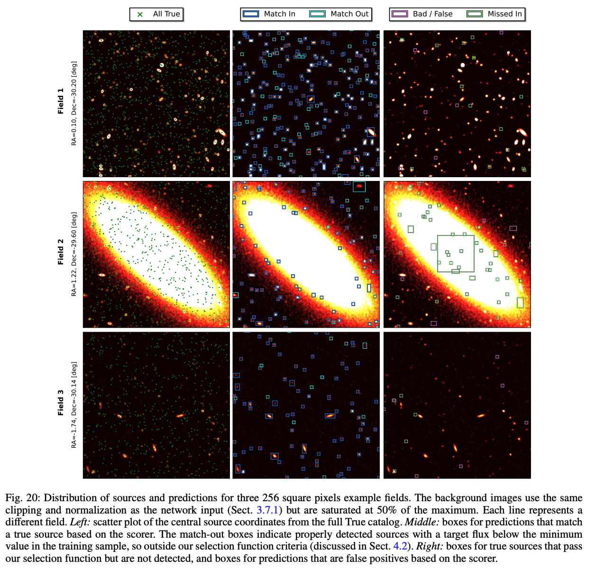
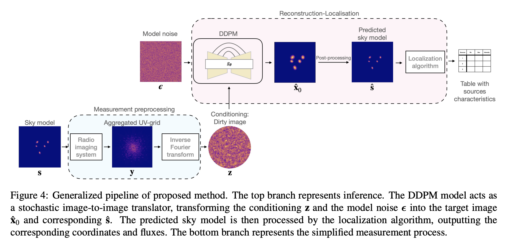

## 2024-02-01

1. [Polarization properties of the 128 non-repeating fast radio bursts from the first CHIME/FRB baseband catalog](https://arxiv.org/abs/2401.17378)

   > Fast Radio Burst, Polarization, CHIME

   CHIME的128个有基带数据的FRB的偏振分析，其中89个能测到RM。统计发现重复FRB和非重复FRB的RM分布一致。非重复FRB的PA分为四种形态，单成分恒定PA（57%）、单成分可变PA（10%）、多成分恒定PA（22%）、多成分可变PA（11%）。

   非重复FRB的线偏振度从<10%到100%，但是没有发现整个群体的频率依赖的消偏振现象，因此偏振度不同可能是FRB的本征辐射机制。

   

2. [Plasma lensing interpretation of FRB 20201124A bursts at the end of September 2021](https://arxiv.org/abs/2401.18036)

   > Fast Radio Burst, Theory

   当射电光子在非均匀电子密度体积中传播时，等离子体的透镜效应会使观测到的光通量在某些频率下极端放大。由于等离子体透镜是一个发散透镜，当它与源对齐时，可以极大地抑制观测到的通量。

   认为FRB20201124A在2021年9月份事件率激增后突然消失是等离子体透镜导致的。估计透镜和源之间的相对运动速度为$v=98(a/{\rm AU})\ {\rm km/s}$。

3. [HiFAST: an HI data calibration and imaging pipeline for FAST](https://arxiv.org/abs/2401.17364)

   > Radio, HI, Software

   王杰他们的HI数据定标处理流程，代码在[这里](https://hifast.readthedocs.io/en/v1.3/)。

## 2024-02-02

1. [Detecting Extragalactic Axion-like Dark Matter with Polarization Measurements of Fast Radio Bursts](https://arxiv.org/abs/2402.00473)

   > Fast Radio Burst, Theory

   轴子或类轴子粒子（ALPs）是暗物质（DM）中最有希望的候选粒子之一。探测类轴子暗物质的一种普遍方法是，在天体物理源发射的线偏振光的偏振角中，寻找周期性振荡特征。

   这里用FRB 20220912A的数据，测量ALP的质量和光子耦合常数的上限。

   

2. [On the nature of apparent transient sources on the National Geographic Society-Palomar Observatory Sky Survey glass copy plates](https://arxiv.org/abs/2402.00497)

   > Stellar, Variable, Machine Learning

   `Palomar Observatory`过去的巡天项目保留有照相底板，这里对这些玻璃拷贝板的数字化扫描数据进行分析，用随机森林进行图像分类，发现玻璃板上的暂现源可能是摄影乳剂的虚假伪影。

   

3.  [Discovery and timing of pulsar J2016+3711 in supernova remnant CTB 87 with FAST](https://arxiv.org/abs/2402.00578)

   > Pulsar, Discovery, Supernovae

   在超新星遗迹CTB87中发现了脉冲星，是FAST在SNR中发现的第一颗脉冲星，周期50.81ms，周期导数$7.2\times10^{-14}\rm\ {s\,s^{-1}}$。

   

## 2024-02-05

1. [Astronomical images sonification: inclusion or outreach?](https://arxiv.org/abs/2402.00952)

   > Astronomy, Sonify

   吹他们的[sonoUno](https://github.com/sonoUnoTeam/sonoUno-images)，把星系光谱变成[声音](https://www.sonouno.org.ar/galaxy-sdss-j115845-43-002715-7/)。

## 2024-02-06

1. [On the Broadening of the Pulse Width of FRB 20121102A due to Propagation and Instrumental Effects](https://arxiv.org/abs/2402.02360)

   > Fast Radio Burst, Statistics

   对多个望远镜探测到的FRB121102的爆发进行分析，发现仪器效应贡献了爆发宽度的$10^{-3}-10^{-1}$，散射展宽贡献了爆发宽度的$10^{-5}-10^{-2}$。改正了这两个展宽效应，推断每个爆发的本征宽度，发现本征宽度的平均值和弥散与中心频率的平方成反比，且大部分的爆发的本征宽度在1-10ms的范围内，导致流量和fluence之间的线性关系。

   

2. [Minute-Cadence Observations of the LAMOST Fields with the TMTS V. Machine Learning Classification of TMTS Catalogues of Periodic Variable Stars](https://arxiv.org/abs/2402.02604)

   > Stellar, Variable, Survey

   用清华马化腾望远镜观测LAMOST天区，每分钟1次曝光，在2020-2022年期间，收集了30,000个变星的光变曲线。

   

3. [Octofitter: Fast, Flexible, and Accurate Orbit Modelling to Detect Exoplanets](https://arxiv.org/abs/2402.01971)

   > Exoplanet, Software

   本文提出了一种快速、可微分的多方法轨道建模和行星探测代码[Octofitter](https://sefffal.github.io/Octofitter.jl/dev/)，可以可靠地恢复具有任意轨道运动的长序列图像中的微弱行星。

   

## 2024-02-07

1. [iSLAT: the Interactive Spectral-Line Analysis Tool for JWST and beyond](https://arxiv.org/abs/2402.04060)

   > Galaxy, Spectrum, Software

   [iSLAT](https://github.com/spexod/iSLAT)，交互式界面拟合JWST分子光谱。

   

## 2024-02-08

1. [Filling the radio transients gap (or: The case for a dedicated radio transients monitoring array in the southern hemisphere)](https://arxiv.org/abs/2402.04698)

   > Transient, Survey, Instrument

   讨论了与瞬变观测的发展和光学天文学的后续研究的比较，以及单毫米天线如何为南方的射电瞬变科学做出贡献。

   

## 2024-02-09

1. [Upper limits on the radio pulses from magnetars and a central compact object with FAST](https://arxiv.org/abs/2402.05647)

   > Pulsar, Magnetar, Observation

   用FAST看4个磁星，没找到射电信号，给出周期信号和单脉冲的流量上限。王亚楠她们的观测给上限之后可以用到，虽然也就只是用辐射计公式算数。

2. [YOLO-CIANNA: Galaxy detection with deep learning in radio data. I. A new YOLO-inspired source detection method applied to the SKAO SDC1](https://arxiv.org/abs/2402.05925)

   > Galaxy, Radio, Deep Learning

   用YOLO-V2做射电连续谱中星系搜寻，在4090上做到每秒500张512*512的图。

   

## 2024-02-12

1. [Determining Stellar Elemental Abundances from DESI Spectra with the Data-Driven Payne](https://arxiv.org/abs/2402.06242)

   > Stellar, Spectrum, Machine Learning

   用多层感知器从恒星光谱推断恒星元素丰度。

## 2024-02-13

1. [CHIME/FRB Outriggers: KKO Station System and Commissioning Results](https://arxiv.org/abs/2402.07898)

   > Fast Radio Burst, Instrument

   CHIME/FRB Outrigger项目旨在为CHIME增加VLBI定位能力，实现FRB亚角秒定位精度。这里介绍的是KKO，建立在CHIME西边66公里的位置，与CHIME交叉相关，可以在赤经上实现角秒量级的定位。

   为了证明CHIME - KKO基线的定位能力，我们对一组20颗明亮脉冲星收集了5个单独的观测结果，并旨在测量它们的位置在5弧秒内。接下来的两个Outrigger预计将于2024年投入使用，每年将能够对大约数百个快速射电暴进行亚角秒定位。

## 2024-02-14

1. [High-cadence Timing of Binary Pulsars with CHIME](https://arxiv.org/abs/2402.08188)

   > Pulsar, Timing

   CHIME对三个脉冲星2-4年的观测给出`Shapiro time delay`。

2. [The SRG/eROSITA All-Sky Survey: First catalog of superclusters in the western Galactic hemisphere](https://arxiv.org/abs/2402.08454)

   > Galaxy, Survey

   SRG/eROSITA的超星系团的目录。

   

## 2024-02-15

1. [Rapid spin changes around a magnetar fast radio burst](https://arxiv.org/abs/2402.09291)

   > Magnetar, Fast Radio Burst, Observation, High Energy

   观测到SGR1935两次glitch，都使磁星自转频率增加。这是迄今为止观测到的中子星旋转中最大的突变之一。在这些小glitch之间，磁星表现出一个快速的自旋下降阶段，伴随着持续的x射线发射和爆发速率的急剧增加和随后的下降。

   文章假设，强烈的、短暂的磁层风提供了迅速减缓恒星旋转的扭矩。第一个小故障的触发因素将恒星的地壳与它的磁层结合在一起，增强了各种x射线信号，并产生了改变磁层条件的风，这可能会产生快速射电暴。

   

2. [A pulsar-like swing in the polarisation position angle of a nearby fast radio burst](https://arxiv.org/abs/2402.09304)

   > Fast Radio Burst, Polarization

   CHIME探测到的非重复FRB20221022A，定位在宿主星系MCG+14-02-01，有着类似脉冲星的S形PA演化，可以用脉冲星的RVM模型描述。PA演化不利于远离源的冲击的发射模型，倾向于磁层模型。

   

3. [Fast Pulsars, Neutron Stars, and Astrophysical Strange Quark Matter Objects](https://arxiv.org/abs/2402.08835)

   > Pulsar, Review, Theory

   脉冲星理论综述，本章深入研究旋转中子星的理论框架，解决均匀和微分旋转场景及其对质量和半径的影响。此外，还研究了夸克星和奇异矮星的有趣概念。

4. [The Thousand-Pulsar-Array programme on MeerKAT -- XII. Discovery of long-term pulse profile evolution in 7 young pulsars](https://arxiv.org/abs/2402.09065)

   > Pulsar, Observation, Time Domain

   MeerKAT的Thousand-Pulsar-Array项目长时间观测脉冲星。这里是3年观测的第一个结果，研究脉冲星轮廓的长期演变。

   长期剖面变化通常与极化分数的变化有关，而与极化位角(PA)的变化无关。如果发射高度变化或岁差是引起剖面变率的原因，则预计PA会发生变化。PSR J1741-3927是我们样本中唯一显示出相关PA变化的脉冲星，这与正交偏振模式活动有关。

   

## 2024-02-16

1. [Predicting the Ages of Galaxies with an Artificial Neural Network](https://arxiv.org/abs/2402.09857)

   > Galaxy, Machine Learning

   用ANN建立`the equivalent widths of spectral indices` 和`星系年龄`之间的关系。

2. [Evaluation of the effectiveness of sonification for time series data exploration](https://arxiv.org/abs/2402.09953)

   > Astronomy, Sonify

   将光变曲线按照不同的方式（亮度映射为-音高、持续时间、持续时间+音高）映射为声音，让天文学家和非天文学家来找凌星。结果表明，视觉优于听觉，天文学家优于非天文学家，可视化导致保守的反应偏差（不愿回答“是的，有一个凌星”），而声音导致更自由的反应（倾向于回答“是的，有一个凌星”）。

   

3. [Radio-astronomical Image Reconstruction with Conditional Denoising Diffusion Model](https://arxiv.org/abs/2402.10204)

   > Radio, Deep Learning

   射电干涉阵成像的传统技术（CLEAN和PyBDSF）经常无法探测到弱源。这里用条件去噪扩散概率模型（DDPM），在CASA模拟的图像上训练，使用Photutils确定源的坐标和流量。DDPM可以在信噪比高于2的情况下实现90%的完备性，对源流量估计的准确度96%也超过了CLEAN+PyBDSF的57%。

   

## 2024-02-19

1. [Radio-only and radio-FUV SED modeling of 14 ULIRGs: insights into global properties of infrared bright galaxies](https://arxiv.org/abs/2402.10786)

   > Galaxy, Spectrum

   用`CIGALE`对14个ULIRGs的从紫外到射电波段SED拟合，使用`UltraNest`嵌套采样对仅射电SED建模。

   结果表明，星爆星系的射电频谱经常以弯曲和翻转为特征，引入射电数据能更好地约束尘埃亮度和恒星形成率。

   

## 2024-02-20

1. [Simultaneous multi-wavelength observations of the repeating fast radio burst FRB 20190520B with Swift and FAST](https://arxiv.org/abs/2402.12084)

   > Fast Radio Burst, Galaxy, Multi Wavelength, Observation

   对FRB190520同时的多波段（射电、光学、紫外、X射线）观测。在FAST探测到射电爆发时，没有伴随的其他波短的爆发，给出能量上限。

   文章发现，PRS比典型的脉冲星风星云、超新星遗迹、银河系x射线双星的扩展射流和超亮x射线源发出的射电声要大得多，这表明PRS的射电发射增强了。

   

2. [Low-mass Runaways from the Orion Nebula Cluster -- Kinematic Age Constraints on Star Cluster Formation](https://arxiv.org/abs/2402.12258)

   > Stellar, Cluster, Kinematics

   星团形成早期经历快速的演化，导致恒星逃逸。目前OB逃逸恒星得到了很好的研究，但是低质量逃逸恒星的研究还不足，尽管低质量逃逸恒星更常见。

   这里通过Gaia的天体测量，使用MAG2-MIKE进行了光谱测量，确定了ONC的27个逃逸恒星，并根据运动学回溯，证实3个YSO的逃逸年龄大于4Myr，最老的是4.7Myr。由此得到ONC的形成时间估计为5Myr，大约是10倍的自由落体时间，并且每个自由落体时间内平均恒星形成率$\lambda_{\rm eff}<0.05$。这些结果支持一个缓慢的、准平衡的星团形成的场景，由磁场和/或原恒星流出反馈调节。

   

3. [A uGMRT search for radio emission from planets around evolved stars](https://arxiv.org/abs/2402.11182)

   > Exoplanet, Radio

   uGMRT对三个系外行星（$\alpha-\rm Tau$、$\beta-\rm UMi$、$\beta-\rm Gem$）射电辐射的观测，没有探测到射电辐射，给出上限。

   

## 2024-02-21

1. [GalaPy, the highly optimised C++/Python spectral modelling tool for galaxies - I - Library presentation and photometric fitting](https://arxiv.org/abs/2402.12427)

   > Galaxy, Spectrum, Software

   [GalaPy](https://github.com/TommasoRonconi/galapy)，用于对星系从X射线到射电波段的SED拟合。它在不依赖模板的情况下动态生成模型，并充分利用贝叶斯参数空间采样。

   

2. [PySSED: an automated method of collating and fitting stellar spectral energy distributions](https://arxiv.org/abs/2402.12496)

   > Stellar, Spectru, Software

   [PySSED](https://github.com/iain-mcdonald/PySSED)，用于恒星的SED拟合，得到恒星的光度和温度，并确定偏离恒星大气模型，如红外或紫外线过量。

3. [Galactic Archaeology with Gaia](https://arxiv.org/abs/2402.12443)

   > Stellar, Kinematics, Review

   来自盖亚的精致的6D相空间和化学信息，以及它的互补光谱调查，给了我们大量的数据，让我们可以对银河系及其祖先进行定量而不是定性的观察。我们回顾了该领域在后盖亚时代的状态，并研究了将决定银河系晕研究未来方向的关键教训。

4. [Long-term evolution of solar activity and prediction of the following solar cycles](https://arxiv.org/abs/2402.13173)

   > Solar, Time Domain, Periodicity

   用迄今为止323年的太阳平均相对黑子数(ASN)序列最长记录资料的小波变换和经验函数拟合，证实了太阳世纪周期的存在，其长度约为104.0年，在几百年的时间尺度上，其量级有轻微增加的趋势。

   基于这一长期演化趋势，预测第25太阳周期的最大ASN约为146.7±33.40，明显强于第24太阳周期。高峰年大约出现在2024年，周期约为11±1年。太阳活动周期26从2030年左右开始，在2035 ~ 2036年达到最大值，最大ASN约为133.0±3.200，周期约为10年。

   

5. [The Radcliffe Wave is Oscillating](https://arxiv.org/abs/2402.12596)

   > Stellar, ISM, Kinematics

   使用$^{12}CO$测量的径向速度，加上年轻星团的3D速度，发现在空间上与Radcliffe Wave相关的恒星形成区（包括猎户座、仙父座、北美和天鹅座X）的运动就像它们是由银河系势能的重力加速度驱动的振荡波的一部分。指出Radcliffe Wave在穿过银道面振荡的同时，**也在从银道中心径向漂移**，表明超新星最终形成今天不断膨胀的Local Bubble的星团可能诞生于Radcliffe Wave。

   

## 2024-02-22

1. [RFI-DRUnet: Restoring dynamic spectra corrupted by radio frequency interference -- Application to pulsar observations](https://arxiv.org/abs/2402.13867)

   > Radio, RFI, Deep Learning

   [RFI-DRUnet](https://github.com/llxzhang/RFI-DRUnet)用UNet消除射电数据中的RFI并保留脉冲星信号。

   

2. [Kinetic Theory of Stellar Systems: A Tutorial](https://arxiv.org/abs/2402.13322)

   > Stellar, Dynamics, Review

   恒星系统——星团、星系、暗物质晕等——是我们宇宙演化史上无处不在的角色。本教程文章是对组成这些系统的大量恒星和/或其他自引力物体的集体动力学演化的介绍，也就是它们的动力学理论。

   我们首先介绍恒星系统的基本现象学，并解释为什么以及何时我们必须发展一种超越钱德拉塞卡尔传统的两体弛豫图像的动力学理论。我们研究构成恒星系统的轨道，这些轨道如何被扰动所改变，系统如何自洽地响应其引力势的波动，以及如何预测恒星系统在各种动力学范围内的长期命运。尽管我们的处理必然是数学化的，我们只发展了为了真正计算而方便的形式主义。文中我们给出了许多例子，展示了这些方程如何应用于主要的天体物理重要课题。

   此外，在20世纪60年代和70年代，恒星系统的动力学理论是一个初出茅庐的学科，与等离子体动力学理论并行发展。然而，这两个领域早已分道扬镳。但一旦有人能够同时精通以Plasmaish（等离子体语）和Galacticese（星系语）为代表的双语，并掌握了将两者相互转换的词典，就可以直接从一个领域中吸取想法以解决另一个领域的问题。因此，本教程文章的另一个目标是为我们的等离子体同行提供一个去除行话的恒星系统关键性质的理解，指出恒星和等离子体动力学计算间的许多直接类比，并最终说服他们相信，恒星动力学和等离子体动力学，在一个深刻、美丽且有用的意义上，是相同的。

   

## 2024-02-23

1. [The Jiao Tong University Spectroscopic Telescope Project](https://arxiv.org/abs/2402.14312)

   > Instrument, Cosmology

   交通大学光谱望远镜(JUST)是一个4.4米的望远镜，专门用于光谱观测。将使用三种类型的仪器进行光谱观测

   - **探索暗宇宙**：多光纤（2000光纤）中分辨率光谱仪（R=4000-5000），用于光谱绘制星系和大尺度结构
   - **追踪动态宇宙**：积分场单元（IFU）阵列（500根光纤）和用于多信使天文学瞬态源快速跟踪的长缝光谱仪
   - **寻找系外行星**：高分辨率光谱仪（R~100000），用于识别类似木星和类地行星，具有表征热系外行星大气特征的能力。

   

2. [Velocity recostruction with graph neural networks](https://arxiv.org/abs/2402.14239)

   > Stellar, Cluster, Galaxy, Deep Learning

   用图神经网络预测星团的视向速度。

   

## 2024-02-26

1. [Novelty Detection on Radio Astronomy Data using Signatures](https://arxiv.org/abs/2402.14892)

   > Radio, RFI, Deep Learning

   [SigNova](https://github.com/datasig-ac-uk/SigNova)用于识别分割射电干涉阵数据中的RFI，基于三个步骤，从观测数据中提取特征向量，计算特征向量与无RFI的数据的Mahalanobis距离，根据打分使用`Pysegments`定位有RFI的连续观测数据区块。

   

2. [Updated kinematics of the Radcliffe Wave: non-synchronous, dipole-like vertical oscillations](https://arxiv.org/abs/2402.15346)

   > Stellar, ISM, Radcliffe Wave

   结合年轻恒星的自行与云的径向速度，给出Radcliffe Wave上的云的z方向的速度。发现Vz的振荡与坐标不同步，表现出偶极模式。加入更多的年轻恒星，Vz的振幅没有明显的变化，表明偶极子内部没有明显的年龄梯度。

   认为Radcliffe Wave的演化速度慢，无法在其生命周期内（30Myr）完成一次振荡，挑战了其作为“波”的分类。

   

## 2024-02-27

1. [Re-Envisioning Numerical Information Field Theory (NIFTy.re): A Library for Gaussian Processes and Variational Inference](https://arxiv.org/abs/2402.16683)

   > Astronomy, Machine Learning

   [NIFTy.re](http://nifty.re/)是用JAX加速的高斯过程+变分推理实现的，从有噪声图像中恢复数据的贝叶斯推理框架。

   

2. [Neural Network Diffusion](https://arxiv.org/abs/2402.13144)

   > Deep Learning

   用扩散模型生成神经网络的参数，代码在[这里](https://github.com/NUS-HPC-AI-Lab/Neural-Network-Diffusion)。训练数据是从零开始训练的模型每一步的参数，参数只保留一部分可以被SGD优化，从而创建多条训练数据。

   

## 2024-02-28

1. [A Spectropolarimetric Study of Pictor A Radio Galaxy with MeerKAT](https://arxiv.org/abs/2402.17647)

   > Galaxy, Polarization, Radio

   MeerKAT对`Pictor A`进行的L波段偏振观测，证实了射电喷流的存在。

   

## 2024-02-29

1. [SDHDF: A new file format for spectral-domain radio astronomy data](https://arxiv.org/abs/2402.17973)

   > Astronomy, Software

   Parkes从2018年开始，谱线数据就开始用HDF5记录了。

2. [Concise Spectrotemporal Studies of Magnetar SGR J1935+2154 Bursts](https://arxiv.org/abs/2402.18151)

   > Magnetar, Statistics

   SGR1935从2014年被发现以来，每隔1-2年就会进入一次活跃爆发期。这里对过去51个亮爆发的光谱进行重分析。

