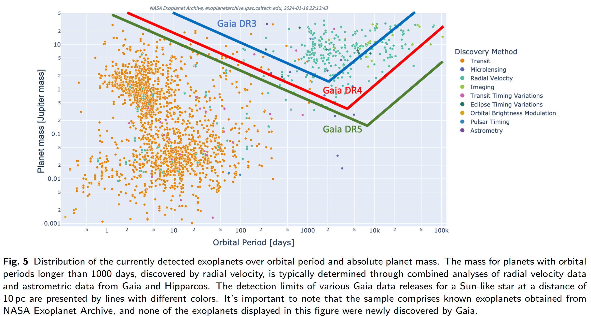
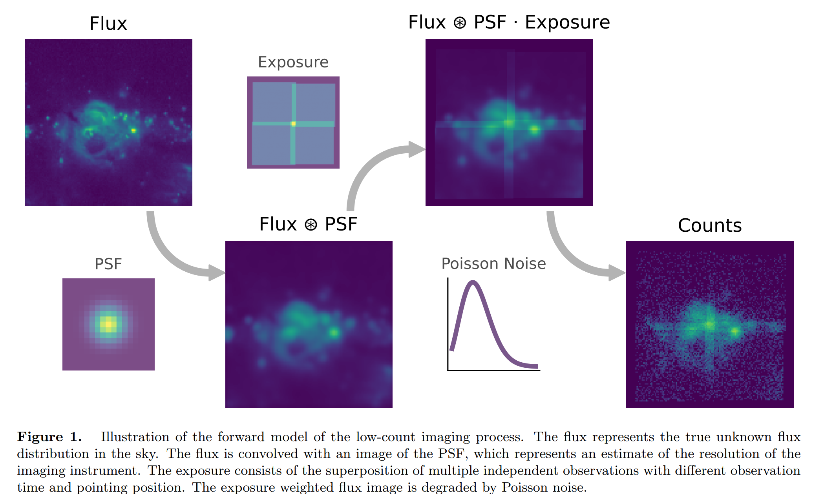

## 2024-03-01

1. [Scattering model of scintillation arcs in pulsar secondary spectra](https://arxiv.org/abs/2402.19370)

   > Pulsar, Scintillation, Simulation

   说对脉冲星闪烁的二次谱进行了全面地分析解释，之后可以看看。

   

## 2024-03-04

1. [A 'MeerKAT-meets-LOFAR' study of the complex multi-component (mini-)halo in the extreme sloshing cluster Abell 2142](https://arxiv.org/abs/2403.00414)

   > Galaxy, Radio

   Abell 2142星系团的多波段观测，研究其内部介质。

   

## 2024-03-05

今日停更。

## 2024-03-06

1. [Fast Radio Bursts in the Disks of Active Galactic Nuclei](https://arxiv.org/abs/2403.02606)

   > Fast Radio Burst, Theory

   大质量恒星或者致密天体会嵌入活动星系核的吸积盘中，此时致密的磁盘会严重吸收FRB，使其无法观测。外流会与磁盘相互作用，形成空腔，使FRB逃逸。

   这里研究FRB在AGN吸积盘中的产生和传播，预言这种情况下的FRB的DM和RM都会很大，并且AGN的环形磁场会导致法拉第转换，在冲击爆发过程中，DM和RM随时间呈现出非幂律演化模式。

2. [Wavelet Scattering Networks for Identifying Radio Galaxy Morphologies](https://arxiv.org/abs/2403.03016)

   > Galaxy, Machine Learning, Classification

   [scatternet](https://github.com/epfl-radio-astro/scatternet)是做星系分类的模型。基于[kymatio](https://www.kymat.io/)的小波散射变换`Wavelet Scattering Transform`，对星系图像做特征提取，使用支持向量机分类可以做到跟CNN一样的性能。

## 2024-03-07

1. [The first high-redshift cavity power measurements of cool-core galaxy clusters with the International LOFAR Telescope](https://arxiv.org/abs/2403.03242)

   > Galaxy, AGN

   AGN反馈会向星系团内介质ICM注入能量，抵消X射线辐射造成的辐射损失，防止ICM流向中心星系的过程中冷却下来，并激发极端的星爆活动，因此是星系团演化的关键因素。

   高红移的反馈未知，LOFAR通过观测13个高红移星系团，限制星系团中AGN的能量输出功率。数据表明，这一功率在红移0.4的位置到达峰值，向更高红移缓慢下降。

   

## 2024-03-08

1. [Relative alignment between gas structures and magnetic field in Orion A at different scales using different molecular gas tracers](https://arxiv.org/abs/2403.04274)

   > ISM, Star Formation, Magnetic Field

   研究Orion A区域$^{12}CO/^{13}CO/C^{18}O$等气体和Planck偏振观测的相关性。发现随着柱密度增加，磁场也逐渐从平行排列到垂直排列。从低密度示踪气体到高密度示踪气体，相对方向也从随机变为垂直。表明磁场在云形成过程中的重要作用。

   

## 2024-03-11

1. [The R2D2 deep neural network series paradigm for fast precision imaging in radio astronomy](https://arxiv.org/abs/2403.05452)

   > Radio, Deep Learning

   [BASPLib/R2D2](https://basp-group.github.io/BASPLib/)用深度学习做射电干涉成像。输入上一次迭代的图像和残差，输出迭代图像，用DNN做序列连接起来。

   

## 2024-03-12

1. [A VLBI Software Correlator for Fast Radio Transients](https://arxiv.org/abs/2403.05631)

   > Fast Radio Burst, Instrument, Software

   [PyFX](https://github.com/leungcalvin/pyfx-public)用于`CHIME/FRB Outriggers`项目的VLBI数据相关。

2. [Bounding the Photon Mass with Ultra-Wide Bandwidth Pulsar Timing Data and De-dispersed Pulses of Fast Radio Bursts](https://arxiv.org/abs/2403.06422)

   > Fast Radio Burst, Pulsar, Cosmology

   如果光子有质量，在传播过程中导致的时间延迟正比于$m_\gamma^2\nu^{-4}$，偏离一般的色散关系。这里用PPTA的数据限制光子质量$9.52\times10^{-46}\,\rm kg$。这一工作也可以使用散射小的FRB爆发实现。
   $$
   \frac{m_\gamma}{\left(1.62\times10^{-43}{\,\rm kg}\right)}\le\left\{\frac{\Delta t_{\rm rest,\mu s}^{\rm extr}}{\nu_{\rm low,GHz}^{-4}-\nu_{\rm high,GHz}^{-4}}\left[{\rm DM_{MW}+{\rm DM_{halo}}+\frac{{\rm DM_{IGM}+{\rm DM_{host}/(1+z_d)}}}{(1+z_d)^2}}\right]^{-1}_{\rm pc\, cm^{-3}}\right\}^{1/2}
   $$

## 2024-03-13

1. [Type IV-like Solar Radio Burst Consisting of a Series of Spikes Observed by PSP](https://arxiv.org/abs/2403.07804)

   > Solar Flare, Radio, Observation

   Parker太阳探测器探测到一次IV型太阳暴，这一事件持续了20小时，频率范围0.5-15MHz，由一系列中心频率从约5MHz缓慢漂移到1MHz的尖峰组成，每个尖峰的频率漂移更快，频率范围短至几MHz，持续时间短至几分钟。

   这些小尺度的尖峰是由伴随日冕物质抛射（CME）向外运动的磁环中的一群孤独动能阿尔芬波（SKAW）产生的，其中单个尖峰的频率漂移是由SKAW的传播引起的，而中心频率漂移可能是由磁环的运动引起的。

   

## 2024-03-14

1. [Narrowly-Banded Spectra with Peak Frequency Around 1 GHz of FRB 20201124A: Implications for Energy Function and Radiation Physics](https://arxiv.org/abs/2403.08558)

   > Fast Radio Burst, Statistics

   统计FRB20201124A的分布，认为FRB20201124A在一个较窄的频率范围内进行maser辐射，而FRB20121102A和FRB20190520B在一个较宽的频率范围内，围绕几个特定频率进行maser辐射的块状等离子体条件。

   

2. [Astrometric detection of exoplanets](https://arxiv.org/abs/2403.08226)

   > Exoplanet, Review

   介绍用于实现高精度天体测量的不同技术。随后，探讨如何利用相对和绝对天体测量来探测系外行星。最后，介绍盖亚天体测量巡天的探测极限，预计盖亚在其任务结束时将发现10,000多颗系外行星，超过大多数系外行星巡天探测的产量。

   

## 2024-03-15

1. [JAXbind: Bind any function to JAX](https://arxiv.org/abs/2403.08847)

   > Astronomy, Software

   [JAXbind](https://github.com/NIFTy-PPL/JAXbind)用于将函数绑定到JAX后端运行。JAX是google开发的，利用autograd加速python函数的微分、向量化和并行。

2. [PAPERCLIP: Associating Astronomical Observations and Natural Language with Multi-Modal Models](https://arxiv.org/abs/2403.08851)

   > Astronomy, Deep Learning

   [PAPERCLIP](https://www.github.com/smsharma/PAPERCLIP-Hubble)通过微调CLIP模型，将Hubble观测申请的摘要和观测获得的图像联系起来。

   

   结果表明在与天文数据进行交互时，这种自然语言的表征索引是很有潜力的。

   

3. [Digitization of Astronomical Photographic Plate of China and Astrometric Measurement of Single-exposure Plates](https://arxiv.org/abs/2403.09094)

   > Astronomy, Photography

   我国的天文照相观测从1901年开始，在一个世纪内拍摄了约3万张底板，现存于上海台佘山资料馆。这里对底板进行数字化扫描，得到了29314块底板的数字化图像，并以Gaia DR2作为参考，对其中15696块底板进行天体测量。数据在[这里](https://nadc.china-vo.org/res/r100742/)。

## 2024-03-18

1. [TRANSLIENT: Detecting Transients Resulting from Point Source Motion or Astrometric Errors](https://arxiv.org/abs/2403.09771)

   > Transient, Software

   [AstroPack](https://github.com/EranOfek/AstroPack)中包含了[translient](https://github.com/ofersp/translient)的MATLAB实现，通过图像微分在光学图像中探测移动天体。

   

2. [Measurements of All-Particle Energy Spectrum and Mean Logarithmic Mass of Cosmic Rays from 0.3 to 30 PeV with LHAASO-KM2A](https://arxiv.org/abs/2403.10010)

   > High Energy, Statistics

   LHAASO的2021年9月到2022年12月收集的数据，对0.3-30PeV的能量范围内宇宙射线的全粒子能谱的测量。

   

   膝点在3.67PeV，低能段谱指数-2.7412，高能段谱指数-3.128。结果表明，在全粒子能谱中观测到的膝点对应的是轻成分的膝点，而不是中重成分的膝点。

## 2024-03-19

1. [The FAST Galactic Plane Pulsar Snapshot Survey: V. PSR J1901+0658 in a double neutron star system](https://arxiv.org/abs/2403.11635)

   > Pulsar, Observation, Binary

   GPPS的一个双中子星系统。

## 2024-03-20

1. [Light Curve Classification with DistClassiPy: a new distance-based classifier](https://arxiv.org/abs/2403.12120)

   > Stellar, Light Curve, Machine Learning

   [DistClassiPy](https://github.com/sidchaini/DistClassiPy)使用18种距离来对变星进行分类，示例代码在[LightCurveDistanceClassification](https://github.com/sidchaini/LightCurveDistanceClassification)。

   

## 2024-03-21

1. [Timing analysis of the newly discovered black hole candidate Swift J1727.8-1613 with Insight-HXMT](https://arxiv.org/abs/2403.13127)

   > High Energy, X Ray, QPO

   慧眼对`Swift J1727.8-1613`的X射线计时观测，这可能是一个新的黑洞，在2023年爆发，数据发布在[这里](http://hxmtweb.ihep.ac.cn/)。在整个观测过程中都探测到了明显的低频准周期震荡，表明这个源可能有`high spin`。

   

## 2024-03-22

1. [Joint Deconvolution of Astronomical Images in the Presence of Poisson Noise](https://arxiv.org/abs/2403.13933)

   > Astronomy, Imaging, Software

   天文观测的图像经过多重卷积（点测光函数、曝光方式、泊松噪声）得到观测图像，如下图所示。

   

   [Jolideco](https://github.com/jolideco/jolideco)通过高斯混合模型GMM+泊松噪声，从天文观测图像中重建真实流量图。

   

2. [Hubble Space Telescope images of SN 1987A: Evolution of the ejecta and the equatorial ring from 2009 to 2022](https://arxiv.org/abs/2403.14361)

   > Supernovae, Imaging

   Hubble对超新星SN1987A的成像观测，为研究超新星如何演变成年轻的超新星遗迹提供了一个独特的机会。赤道环在爆炸后约8200天达到最大值，之后持续减弱。与此相反，喷出物一直亮到大约11000天后，其发射才趋于平稳。西侧比东侧更亮，我们认为这是由于东侧的 ER 发射出了更强的 X 射线。

   

3. [RG-CAT: Detection Pipeline and Catalogue of Radio Galaxies in the EMU Pilot Survey](https://arxiv.org/abs/2403.14235)

   > Galaxy, Radio, Catalog

   介绍ASKAP的宇宙进化图（EMU-PS）项目中，天体探测和编目流程。主要使用基于[DINO](https://github.com/IDEA-Research/DINO)的[Gal-DINO](https://github.com/Nikhel1/Gal-DINO)在[RadioGalaxyNET](https://data.csiro.au/collection/csiro%3A61068v1)数据集上训练后，在ASKAP成图中找星系。

   

## 2024-03-25

1. [A Classifier-Based Approach to Multi-Class Anomaly Detection for Astronomical Transients](https://arxiv.org/abs/2403.14742)

   > Transient, Machine Learning, Anomaly Detection

   用训练好的神经网络分类器的倒数第二层作为异常检测的特征值，然后使用`Multi-Class Isolation Forests`为分类器每一个类别单独训练，从中得到光变曲线的异常值得分，代码在[这里](https://zenodo.org/record/2612896#.YYAz1NbMJhE)。

   

## 2024-03-26

1. [High-cadence monitoring of the emission properties of magnetar XTE J1810-197 with the Stockert radio telescope](https://arxiv.org/abs/2403.15471)

   > Magnetar, Observation, Statistics

   用Stockert-25米望远镜对`XTE J1810-197`进行观测。FETCH漏掉很多信号，他们考虑磁星发射有周期，并且只在周期很小的相位区间内出现，而RFI则跟磁星旋转周期无关。因此考虑on-off相位的噪声水平来筛选是否存在单脉冲，提高探测完备性。

   在2018年12月到2019年年中，每小时几个单脉冲，从2020年9月开始，每小时有数百个单脉冲，并且平均脉冲轮廓也在2021年3月发生了变化。在2021年3月之前，平均脉冲轮廓是单成分，流量高达1000Jyms，宽度10毫秒左右。3月之后变成双峰，宽度也是双峰分布， 第二个峰在1毫秒，流量高达500Jyms。认为是磁层中发射区域漂移导致的。另外还发现，探测到的单脉冲的流量取决于自转相位，最高流量出现在脉冲轮廓峰值的中心。

   

2. [Large-scale Array for Radio Astronomy on the Farside](https://arxiv.org/abs/2403.16409)

   > Astronomy, Radio, Instrument

   陈学雷老师他们想在月球背面放望远镜阵列，由一个主站负责数据收集和处理，下设 20 个站，最大基线为 10 千米。每个台站由 12 个薄膜天线单元组成，台站通过电力线和光纤与主站相连。阵列将在月夜进行 0.1-50 兆赫波段的干涉观测，由再生燃料电池（RFCs）供电。整个阵列可以用重型火箭运载到月球表面，并在 8 个月内用漫游车进行部署。

## 2024-03-27

1. [Short-term Classification of Strong Solar Energetic Particle Events using Multivariate Time Series Classifiers](https://arxiv.org/abs/2403.17418)

   > Solar, Machine Learning, Classification

   用`time series forest`、`supervised time series forest`和`bag of SFA symbols`对太阳高能粒子（SEP）事件进行强弱分类，发现STSF效果最好。

   

2. [The Relativistic Spin Precession in the Compact Double Neutron Star System PSR~J1946+2052](https://arxiv.org/abs/2403.17828)

   > Pulsar, Relativity

   孟令祺的文章，讲FAST对`PSR J1946+2052`脉冲双星系统的观测，用来检验广义相对论。

## 2024-03-28

1. [Recovery of High-energy Low-frequency Quasi-periodic Oscillations from Black Hole X-ray Binary MAXI J1535-571 with a Hilbert-Huang Transform Method](https://arxiv.org/abs/2403.18272)

   > High Energy, Periodicity, Time Domain, QPO

   用希尔伯特-黄变换来找`MAXI J1535-571`的准周期，其中模式分解用的[vmdpy](https://github.com/vrcarva/vmdpy)。

   

## 2024-03-29

1. [Estimating Galaxy Parameters with Self-Organizing Maps and the Effect of Missing Data](https://arxiv.org/abs/2403.18888)

   > Galaxy, Machine Learning

   使用[SOMPY](https://github.com/sevamoo/SOMPY)，`Self-Organizing Maps, SOM`来估计星系参数，讨论缺失波段数据的影响。

