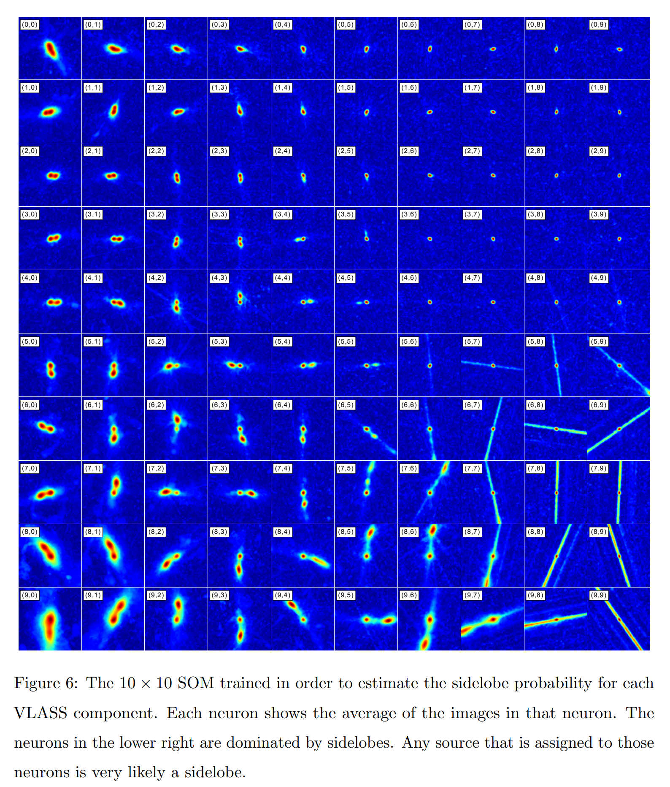

## 2024-04-01

1. [Deeper Learning in Astronomy](https://arxiv.org/abs/2403.19937)

   > April Fools

   老师在官僚主义的重压下开展新的研究，会越来越依赖年轻人群体（训练集），学生学习的过程是监督学习。等他们开始有自己的想法了，就进入了无监督学习阶段。有时也会出现导师向学生学习的情况，这就是反向传播。

2. [FOOD I: A New Division Scheme For The Stelliferous Era](https://arxiv.org/abs/2403.20144)

   > April Fools

   根据吃饭时间重新定义低中高红移。

   

3. [Circular reasoning: Solving the Hubble tension with a non-π value of π](https://arxiv.org/abs/2403.20219)

   > April Fools

   把$\pi$作为自由参数和哈勃常数一起拟合，解决Hubble Tension的问题。拟合得到$H_0=71.3\pm1.1\,\rm km/s/Mpc$和$\pi=3.206\pm0.038$。

4. [pastamarkers: astrophysical data visualization with pasta-like markers](https://arxiv.org/abs/2403.20314)

   > April Fools

   用面条形状做marker。

   

5. [The impact of void-finding algorithms on galaxy classification](https://arxiv.org/abs/2403.20008)

   > Galaxy, Cosmology

   研究不同的空洞查找算法，对大尺度结构上星系分类的影响，使用[VAST](https://vast.readthedocs.io/en/latest/index.html)中提供的`VoidFinder`和`V2`算法。

   

6. [Adventures in Andromeda: The Interplay of Interstellar Dust and Gas in our Big Neighbour](https://arxiv.org/abs/2403.19798)

   > ISM, Observation

   一篇研究M31星际尘埃和气体的相互作用的博士论文。

## 2024-04-02

1. [Radio Frequency Interference Detection Using Efficient Multi-Scale Convolutional Attention UNet](https://arxiv.org/abs/2404.00277)

   > Radio, Deep Learning, RFI

   用`aoflagger`标记云南40米望远镜数据中的RFI，然后用`multi-scale convolutional attention mechanism` + `efficient channel attention mechanism`组成的UNet来训练找RFI。

2. [Anomaly Detection and Approximate Similarity Searches of Transients in Real-time Data Streams](https://arxiv.org/abs/2404.01235)

   > Transient, Machine Learning, Anomaly Detection

   用随机森林和孤立森林找ZTF光变曲线中的异常值，将数据标记为正常和异常进行分类。

   

## 2024-04-03

1. [CSST Strong Lensing Preparation: a Framework for Detecting Strong Lenses in the Multi-color Imaging Survey by the China Survey Space Telescope (CSST)](https://arxiv.org/abs/2404.01780)

   > Gravitational Lensing, Deep Learning

   用Swin Transformer做目标检测找强透镜系统。

   

2. [MHONGOOSE - A MeerKAT Nearby Galaxy HI Survey](https://arxiv.org/abs/2404.01774)

   > Galaxy, Survey

   MeerKAT观测附近30个星系的HI分布，主要科学目标之一是探测样本星系外围的冷吸积气体。发现伴星系的数量与主目标星系的质量有明显的关系。

   

## 2024-04-04

1. [Adaptation of the Phase Distance Correlation Periodogram to Account for Measurement Uncertainties](https://arxiv.org/abs/2404.02506)

   > Light Curve, Periodicity, Software

   [PDC](https://github.com/SPARTA-dev/PDC) 将时间序列测量的不确定性考虑到周期图中，利用能量距离的概念设计了测量值-不确定性对之间的距离函数。

   

## 2024-04-05

1. [DESI 2024 III: Baryon Acoustic Oscillations from Galaxies and Quasars](https://arxiv.org/abs/2404.03000)

   > Cosmology, DESI

   主要由美国能源部资助的暗能量光谱巡天项目 (DESI) 今天进行了第一次的关键宇宙学结果发布：通过对大量星系和类星体的光谱红移进行测量，天文学家获得了前所未有清晰的宇宙三维地图，并借此在不同红移上、利用不同类型的示踪天体测量了宇宙中一把可以用来定标宇宙学的“尺子”：重子声学震荡 （BAO）。

   

## 2024-04-08

1. [Evolutionary Origin of Ultra-long Period Radio Transients](https://arxiv.org/abs/2404.03882)

   > Magnetar, Theory

   认为两个超长周期射电暂现源GLEAM-X J162759.5-523504.3和GPM J1839-10是中子星和`fallback disk`相互作用使中子星自转速度下降到1000多秒。

## 2024-04-09

1. [Sen2Chain: An Open-Source Toolbox for Processing Sentinel-2 Satellite Images and Producing Time-Series of Spectral Indices](https://arxiv.org/abs/2404.04305)

   > Earth, Planetary Science

   [Sen2Chain](https://framagit.org/espace-dev/sen2chain) 用于处理卫星遥感数据的工具。

   

## 2024-04-10

1. [Reconstructing rotation curves with artificial neural networks](https://arxiv.org/abs/2404.05833)

   > Galaxy, Cosmology, Deep Learning

   用简单的全连接神经网络对星系旋转曲线做回归。

## 2024-04-11

1. [Searching for short-period variables in M31: method and catalogs](https://arxiv.org/abs/2404.07127)

   > Stellar, Variable, Periodicity

   用3.6米的CFHT在g/r波段对M31连续看了三晚上，搜索其中的变星。找到5859个变星、19个银河系前景M矮星的要办，17个以前未知的候选小行星，和一个候选微透镜事件。找变源的方法是，用眼睛看？！

   

2. [Tianyu: search for the second solar system and explore the dynamic universe](https://arxiv.org/abs/2404.07149)

   > Astronomy, Instrument, Exoplanet

   上海交大提出`Tianyu`，在冷湖方两个望远镜，配备高速CMOS摄像机，以每小时一次的频率测量光变曲线，找系外长周期凌日冷巨行星。由于Kepler和TESS的巡天计划观测基线有限，对长周期行星不敏感。

## 2024-04-12

1. [Addition of the Local Volume sample of galaxies from the FAST HI survey](https://arxiv.org/abs/2404.07636)

   > Galaxy, Radio, Statistics

   在Local Volume中发现了20个新的光学矮星系，并确认为是FASHI目录中星系的光学对应体。内容没啥，主要是作者的单位，俄乌友好还是得看中国。

   

2. [The Sydney Radio Star Catalogue: properties of radio stars at megahertz to gigahertz frequencies](https://arxiv.org/abs/2404.07418)

   > Stellar, Radio, Catalog

   [Sydney Radio Star Catalogue](https://radiostars.org/data/) 是使用ASKAP探测到的839个有射电辐射的恒星，其中包含了一些变源，可以找找看能不能用FAST看看。X射线观测表明，这些恒星的射电亮度都过高，表明射电辐射是相干辐射。

3. [Galmoss: A package for GPU-accelerated Galaxy Profile Fitting](https://arxiv.org/abs/2404.07780)

   > Galaxy, Optical, Software

   [Galmoss](https://github.com/Chenmi0619/GALMoss/) 使用GPU加速的，包含多种星系轮廓的，星系拟合。

4. [oMEGACat II -- Photometry and proper motions for 1.4 million stars in Omega Centauri and its rotation in the plane of the sky](https://arxiv.org/abs/2404.03722)

   > Stellar, Cluster, Photometry, Kinematics

   用20多年的哈勃空间望远镜观测数据，通过追踪Omega Cen里数百万颗恒星的缓慢运动，来刻画这个年老球状星团的旋转。给出了140万颗恒星的星表，算出了星团旋转倾角为$43.6\pm1.5^\circ$，数据会在文章接收后发布。之后可以用我们的方法算一下。

   

## 2024-04-15

1. [A generalizable method for estimating meteor shower false positives](https://arxiv.org/abs/2404.08507)

   > Astronomy, Meteor

   用KDE估计流星雨`false positives`。

## 2024-04-16

1. [Transient Classifiers for Fink: Benchmarks for LSST](https://arxiv.org/abs/2404.08798)

   > Stellar, Variable, Software, Periodicity

   [Fink](https://github.com/astrolabsoftware/fink-science)用LSTM做LSST光变曲线分类器，对是否存在周期的分类准确率可以做到99%，多标签分类准确率也可以做到97%。

2. [Constraining Near-Simultaneous Radio Emission from Short Gamma-ray Bursts using CHIME/FRB](https://arxiv.org/abs/2404.09242)

   > Fast Radio Burst, GRB, Statistics

   搜索CHIME探测到的FRB的GRB对应体，没找到任何显著的时间和空间上的重合。

3. [Polarized radio emission of RRAT J1854+0306](https://arxiv.org/abs/2404.09418)

   > Pulsar, RRAT, Observation

   FAST对`RRAT J1854+0306`的观测，表现出S形偏振位置角曲线，单脉冲有不同的脉冲轮廓，脉冲强度与宽度相关，亮脉冲通常具有多个峰值的宽轮廓，表明RRAT与正常脉冲星有相同的物理起源。

## 2024-04-17

1. [Can AI Understand Our Universe? Test of Fine-Tuning GPT by Astrophysical Data](https://arxiv.org/abs/2404.10019)

   > Astronomy, Deep Learning

   用星系、类星体、恒星、GRB的数据微调chatGPT，用来进行GRB分类，推断类星体的红移，以及估计黑洞参数。数据像这样，发布在[kaggle/sdssiii](https://www.kaggle.com/datasets/ywangscience/sdss-iii-iv)。

   ```json
   {
       "messages": [
           {
           	"role": "system",
           	"content": "from SDSS optical spectrum, infer redshift of one value:"
           }, 
           {
               "role": "user",
               "content": "1000 85 69 47 47 43 14 22 48 63 28 46 48 55 54 65 80 61 61 0 58 43 52 40 68 66 65 54 80 77 76 73 96 67 77 95 84 105 107 99 110 115 124 108 127 106 125 134 118 101 151 111 109 137 122 150 205 210 225 193 221 240 239 227 256 276 288 311 318 333 324 310 316 341 334 350 332 362 333 331 304 327 373 386 388 388 369 383 362 388 403 408 410 337 409 395 442 345 311 404"
           }, 
           {
               "role": "assistant", 
               "content": "0.597"
           }
       ]
   }
   ```

2. [Rotation and flipping invariant self-organizing maps with astronomical images: A cookbook and application to the VLA Sky Survey QuickLook images](https://arxiv.org/abs/2404.10109)

   > Radio, Machine Learning, Software

   [PINK](https://github.com/HITS-AIN/PINK) 实现SOM，将天体图像降维分类，并实现旋转和翻转不变性，并在VLA的巡天数据中应用，文章详细介绍了代码使用。

   

3. [The Thousand-Pulsar-Array programme on MeerKAT XIV: On the high linearly polarized pulsar signals](https://arxiv.org/abs/2404.10254)

   > Pulsar, Polarization, Observation

   脉冲星的偏振位置角的S形摆动可以用旋转矢量模型（RVM）解释，但是MeerKAT的`Thousand-Pulsar-Array`中有59%的脉冲星没法用RVM拟合，由于存在正交偏振模式`orthogonal polarization modes`或者偏振位置角的高度无序分布造成的。

   对`PSR J1645-0317`的研究表明，只使用线偏振度超过80%的样本就可以恢复RVM，通过这种偏振度筛选后再进行RVM拟合，TPA中就只有9颗无法用RVM拟合了。因此结果倾向于认为辐射机制是相干曲率辐射。

## 2024-04-18

1. [The S-PLUS Fornax Project (S+FP): SExtractor detection and measurement of nearby galaxies in large photometric surveys](https://arxiv.org/abs/2404.10847)

   > Galaxy, Survey, Catalog

   用SExtractor提取[Southern Photometric Local Universe Survey, S+](https://splus.cloud/)项目观测的星系。

   

2. [Signature of systemic rotation in 21 Galactic Globular Clusters from APOGEE-2](https://arxiv.org/abs/2404.10902)

   > Stellar, Cluster, Kinematics

   球状星团一般认为是`quasi-relaxed non-rotating`的系统，近年来的观测证据发现其存在能够测量到的旋转。这里使用`APOGEE-2 Value-Added Catalogs DR17`数据，分析21个球状星团的径向速度，发现了旋转的证据。

   

## 2024-04-19

1. [Finding the particularity of the active episode of SGR J1935+2154 during which FRB 20200428 occurred: Implication from a statistics of Fermi/GBM X-ray bursts](https://arxiv.org/abs/2404.11877)

   > Fast Radio Burst, Statistics

   发现在FRB20200428发生的期间，SGR1935的X射线暴的等待时间短于其它期间，并且根据是否偏离Omori Law将爆发区分为独立事件或者非独立事件，认为此期间比其它期间有更多的依赖性后随事件发生，可能属于自组织临界系统，类似地震。

   

2. [Coherent Inverse Compton Scattering in Fast Radio Bursts Revisited](https://arxiv.org/abs/2404.11948)

   > Fast Radio Burst, Theory

   逆康普顿散射作为FRB辐射机制。

3. [Modelling stochastic and quasi-periodic behaviour in stellar time-series: Gaussian process regression versus power-spectrum fitting](https://arxiv.org/abs/2404.11662)

   > Stellar, Light Curve, Periodicity

   用高斯过程拟合光变曲线的准周期性为，要比频域拟合更准，尤其是在时间采样不规则的情况下。

## 2024-04-22

1. [Insights from the Gaussian Processes Method for the FRB-associated X-ray Burst of SGR 1935+2154](https://arxiv.org/abs/2404.12976)

   > Fast Radio Burst, Magnetar, Statistics

   用`stochastically driven damped simple harmonic oscillator`随机阻尼简谐振荡的核函数的高斯过程拟合SGR1935的X射线暴光变曲线，认为平衡态时，能量释放到X射线暴之间有延迟，与FRB有关的X射线暴没有延迟。

2. [The Peculiar Radio Evolution of the Tidal Disruption Event ASASSN-19bt](https://arxiv.org/abs/2404.12431)

   > TDE, Radio, Observation

   ATCA、ALMA和MeerKAT对`ASASSN-19bt`潮汐瓦解事件的观测，在光学耀发后的40-1464天期间，其射电亮度迅速增加，在光学发现后的457天趋于平稳。

   

## 2024-04-23

1. [Atacama Large Aperture Submillimeter Telescope \mbox{(AtLAST)} Science: Probing the Transient and Time-variable Sky](https://arxiv.org/abs/2404.13133)

   > Radio, Transient, Survey

   用ALMA做亚毫米波做暂现源巡天，寻找包括新星、活动星系核、黑洞双星在内的瞬变事件。

## 2024-04-24

1. [On the X-ray efficiency of the white dwarf pulsar candidate ZTF J190132.9+145808.7](https://arxiv.org/abs/2404.14722)

   > White Dwarf, High Energy

   大质量快速旋转的白矮星是通过双白矮星合并形成，有更小的半径和更高的密度。虽然大质量白矮星在光学波段通常表现出高温颜色，但是其自转周期约为1e4秒以上。最近ZTF发现`ZTF J1901+14`这个白矮星，旋转周期较短，为416s。这篇文章探测到的来自这个白矮星微弱的x射线辐射。

   由于白矮星自旋下降，预计会发射出非热x射线，类似于孤立的中子星，被称为白矮星脉冲星。此类白矮星包括`AE Aqr`，自转周期33s，`AP Sco`，自转周期330s，以及Hurley-Walker等人发现的两个长周期变源。这种白矮星可以将粒子加速到与中子星一样高的能量。

   [Kilic et al. (2023)](https://ui.adsabs.harvard.edu/abs/2023MNRAS.518.2341K/abstract)中编目了25个超大质量白矮星，其中有强磁场和快速旋转的，可以挑出来做FAST观测。现在这篇文章中也挑出了4个。

## 2024-04-25

今日停更。

## 2024-04-26

1. [A candidate period of 4.605 day for FRB 20121102A and one possible implication of its origin](https://arxiv.org/abs/2404.16669)

   > Fast Radio Burst, Statistics, Periodicity

   结合多个望远镜观测FRB121102的数据，根据流量阈值进行补全，使用相位折叠找到了一个4.6天的周期，在$10^{38}\,\rm erg$以上的爆发中更明显。

   

2. [Soft X-ray prompt emission from a high-redshift gamma-ray burst EP240315a](https://arxiv.org/abs/2404.16425)

   > High Energy, Xray

   爱因斯坦探针（EP）探测到长伽马射线暴`EP240315a`在软X射线波段的光变曲线，这一爆发来自红移$z=4.859$，展示了EP通过GRB研究早期宇宙的巨大潜力。

   

## 2024-04-29

1. [On the Existence of "Maia variables"](https://arxiv.org/abs/2404.16988)

   > Stellar, Variable

   通过对31个所谓的“玛雅变星”的分析，发现这些目标大多位于δ Scuti、β Cephei或SPB恒星不稳定带内，表明其可能不是一类新的变星。

2. [Cosmology-independent Photon Mass Limits from Localized Fast Radio Bursts by using Artificial Neural Networks](https://arxiv.org/abs/2404.17154)

   > Fast Radio Burst, Cosmology, Deep Learning

   用神经网络从FRB观测中重建哈勃函数$H(z)$，估计光子质量。

## 2024-04-30

1. [Two-Dimensional (2D) Hybrid Method: Expanding 2D Correlation Spectroscopy (2D-COS) for Time Series Analysis](https://arxiv.org/abs/2404.17622)

   > Light Curve, Periodicity, Software

   `2D Hybrid`用于探测有红噪声干扰下的，类星体光变曲线中的周期性。对非均匀采样的光变曲线做WWZ变换，以及对于一个模拟信号做WWZ变换，将变换出来的两个功率谱做卷积，有周期信号的位置就加强了。跟我们搞音频那个差不多。

   

2. [Broadband Multi-wavelength Properties of M87 during the 2018 EHT Campaign including a Very High Energy Flaring Episode](https://arxiv.org/abs/2404.17623)

   > Black Hole, Observation

   对M87的黑洞的超多波段的同时观测，与2017年相比，2018年的X射线流量增强了2被，射电波段和毫米波波段的流量保持一致，喷流位置角单调增加，与EHT图像中黑洞边缘亮点位置的变化一致。

   

3. [Weighted Stacking of Radio Images Affected by Noise and Interfering Signals](https://arxiv.org/abs/2404.17691)

   > Radio, RFI, Software

   对射电观测得到的数据立方做加权叠加，以消除干扰信号，权重为数据立方每个通道每个像素的附近像素的反方差。

   

4. [The Rotation Curve and Spiral Structure of Milky Way from the Hydrogen 21-cm Line Detection with Campus Radio Telescope](https://arxiv.org/abs/2404.17893)

   > Radio, Milky Way

   华中科技大学的人自己搞的锅盖天线测银河系旋转曲线。

5. [ELEPHANT: ExtragaLactic alErt Pipeline for Hostless AstroNomical Transients](https://arxiv.org/abs/2404.18165)

   > Transient, Software

   [ELEPHANT](https://github.com/COINtoolbox/extragalactic_hostless)，检测ZTF中与宿主星系无关的暂现源`hostless`，这些现象与能量极高的事件有关。

6. [Self-supervised contrastive learning of radio data for source detection, classification and peculiar object discovery](https://arxiv.org/abs/2404.18462)

   > Radio, Software

   用对比学习[SimCLR](https://github.com/google-research/simclr)从`ASKA EMU`和`SARAO MeerKAT GPS`探测的无标签图像中构建射电图像的大模型。

   

