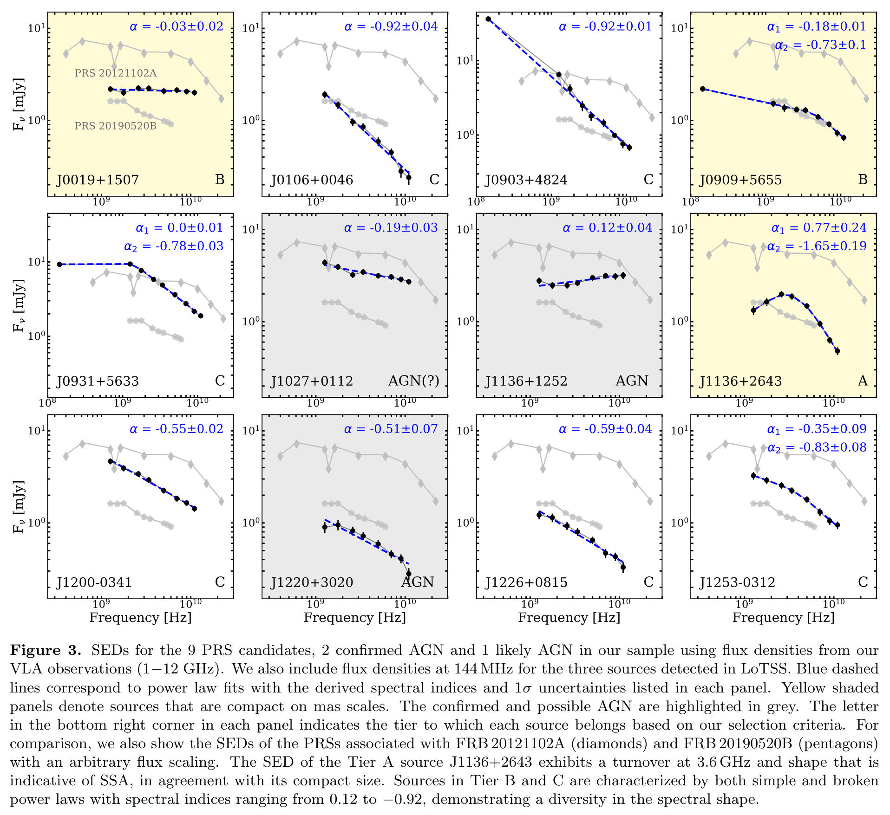
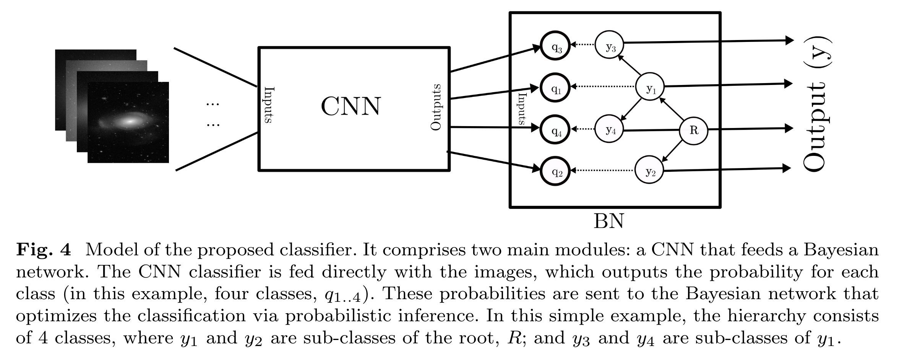
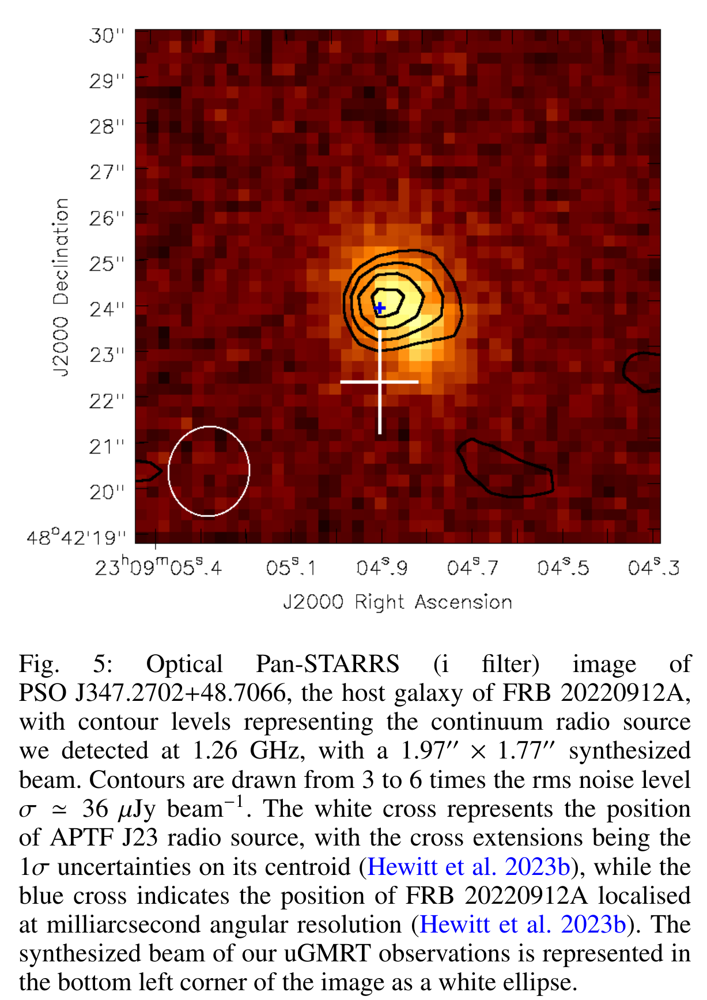
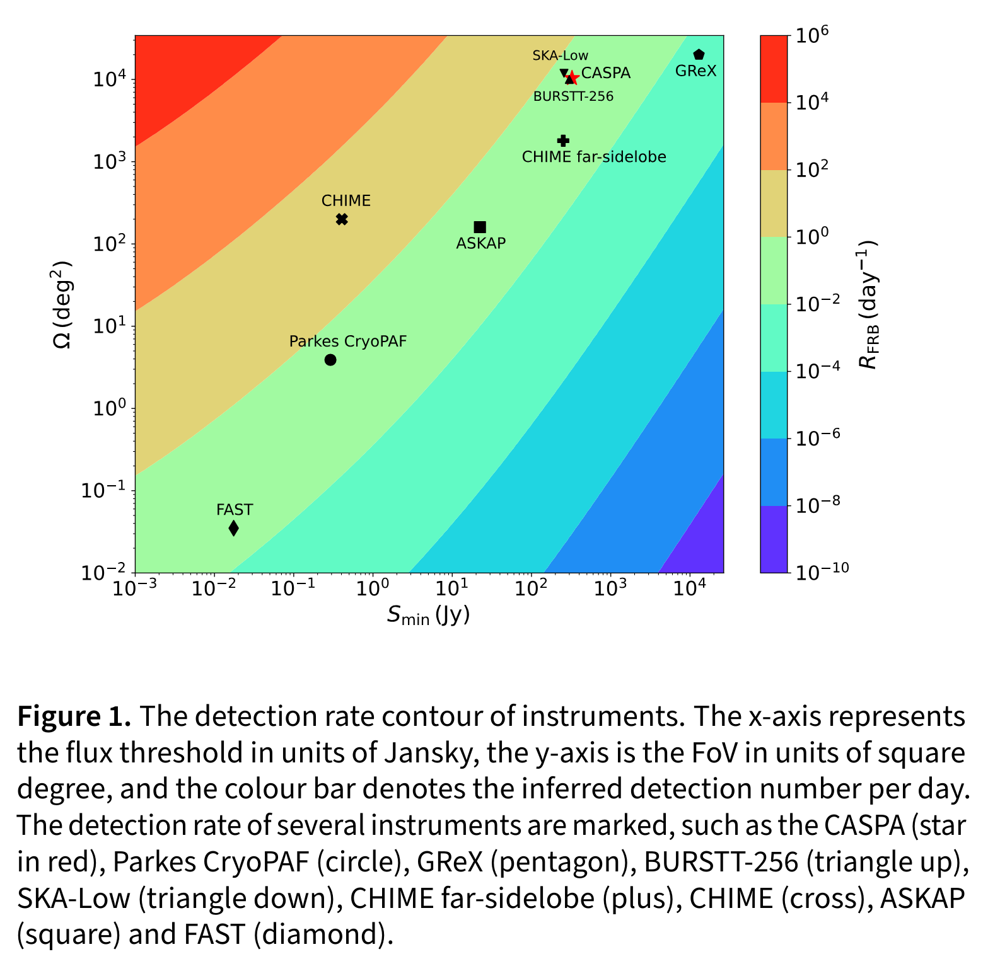
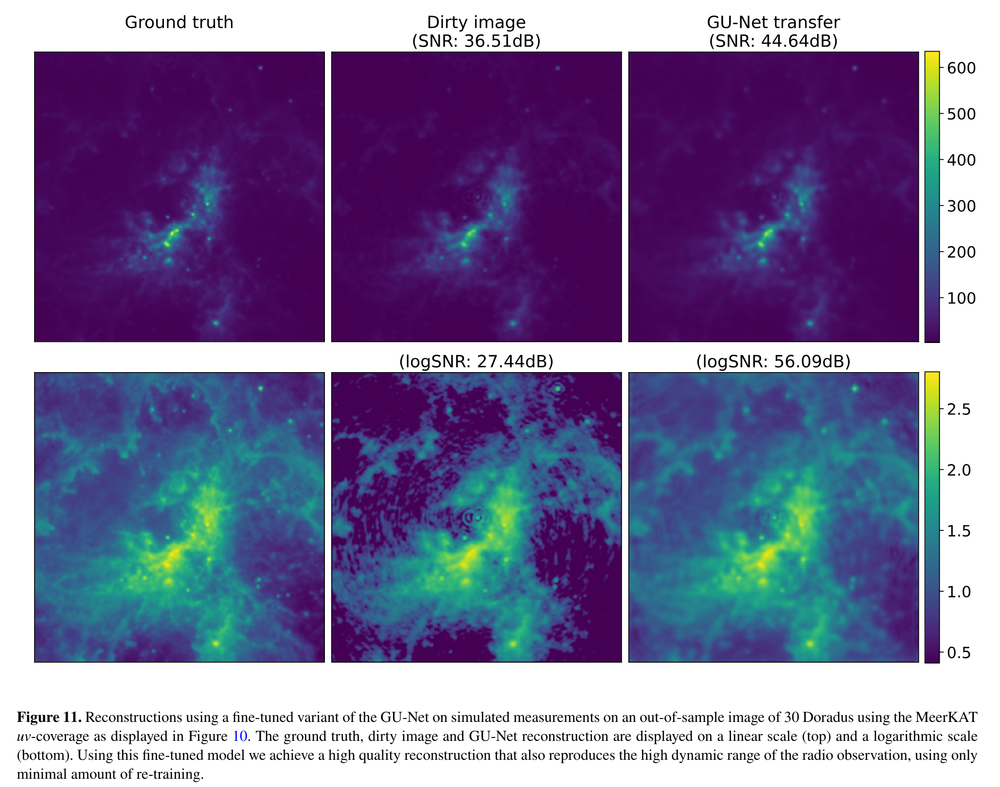
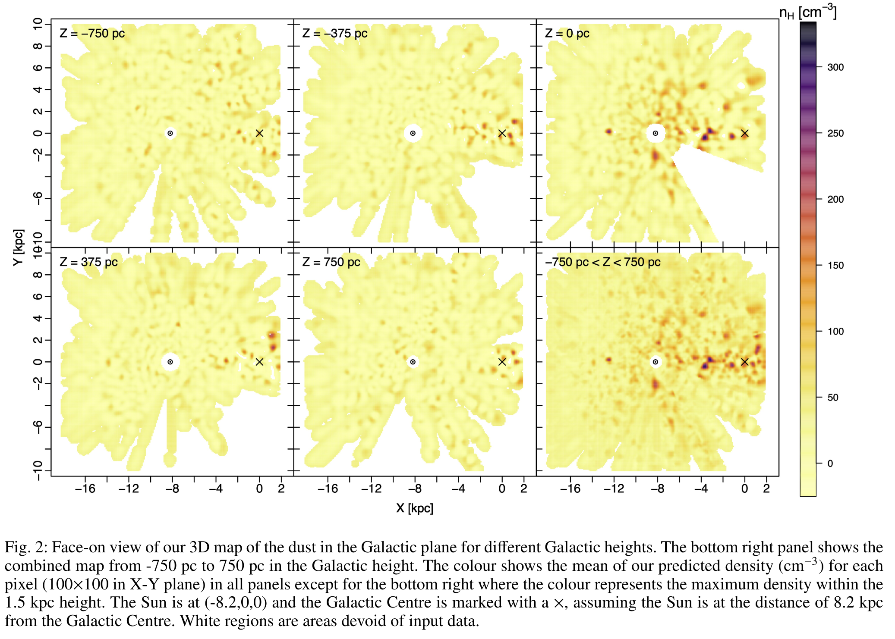
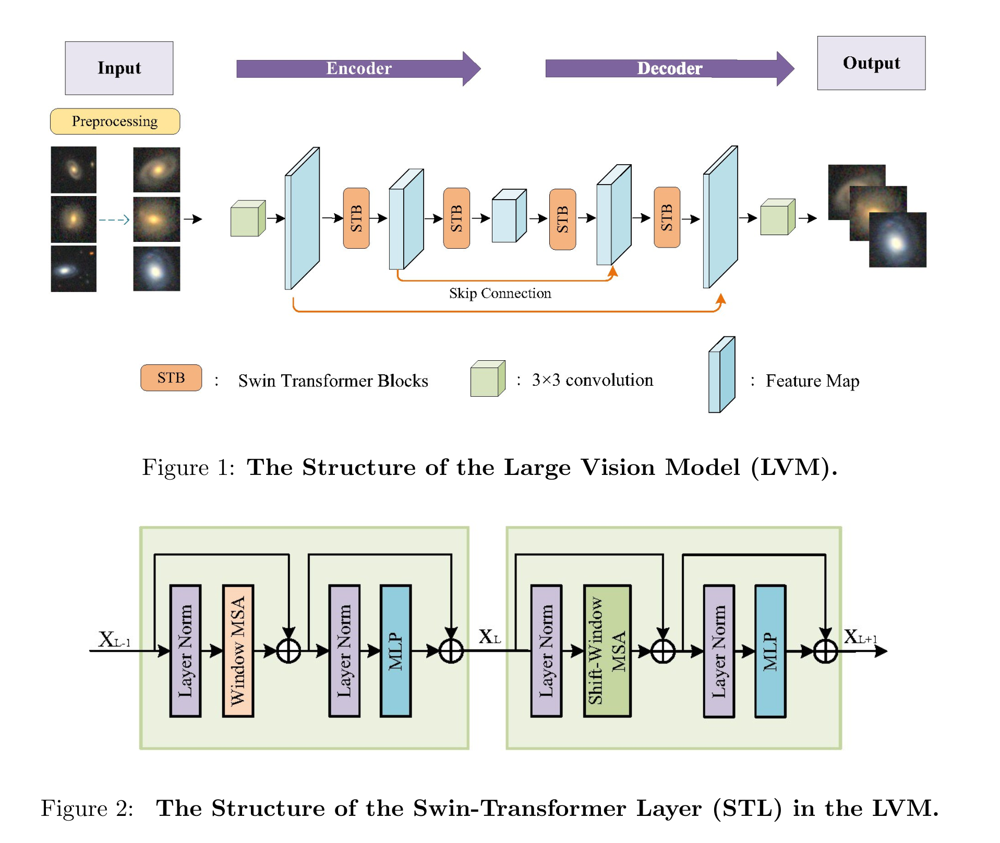
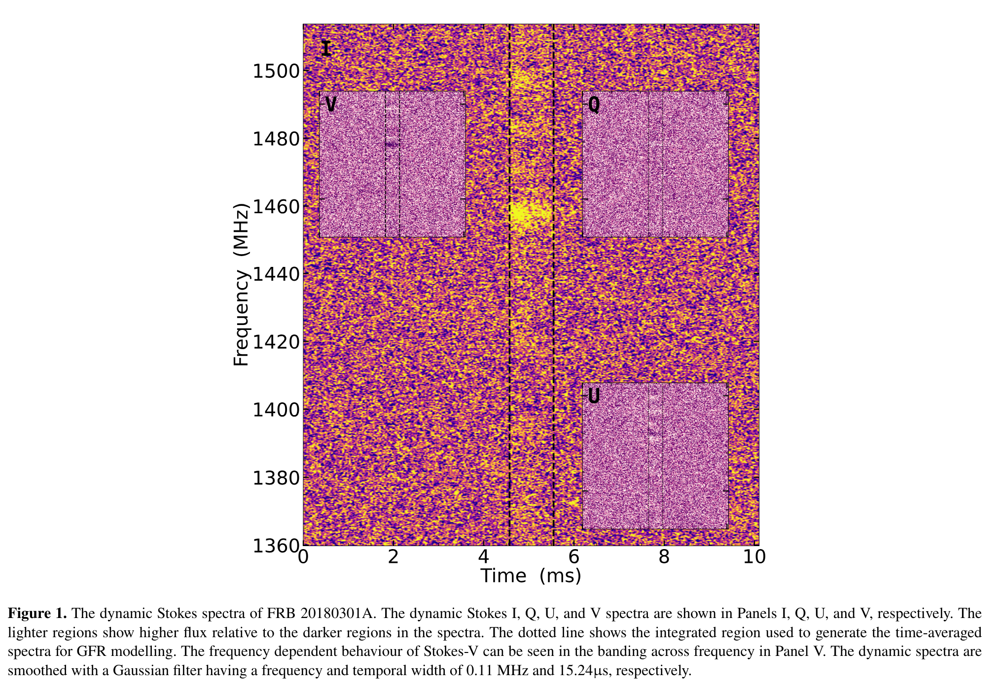
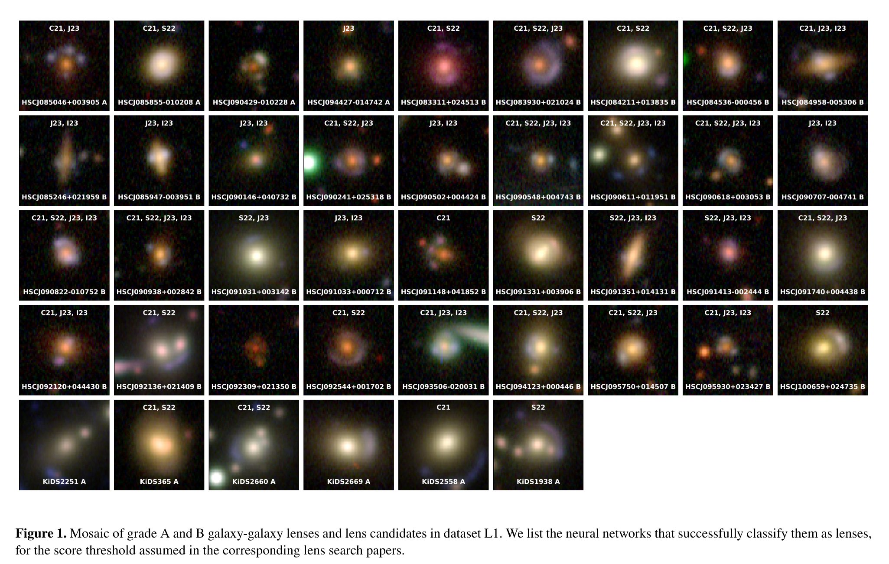
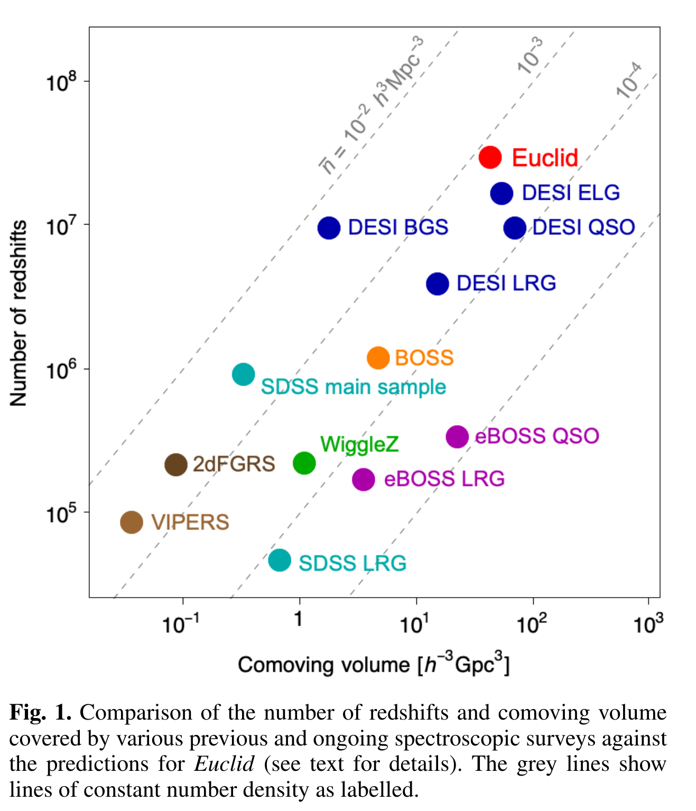

## 2024-05-01

1. [Status Report on Global Pulsar-Timing-Array Efforts to Detect Gravitational Waves](https://arxiv.org/abs/2404.19529)

   > Pulsar, Gravitational Wave, Review

   关于PTA的综述。

## 2024-05-02

1. [Assessing the accuracy of the star formation rate measurements by direct star count in molecular clouds](https://arxiv.org/abs/2405.00095)

   > ISM, Statistics, SFR

   YSO计数估计SFR基于SFH恒定的假设。这里使用蒙特卡洛模拟检验这样的估算的有效性，从恒定或者随时间变化的SFH中合成星团。发现只用使用`Class 0`恒星才能得到真实的SFR，且与SFH是否恒定无关。对于恒定的SFH，演化程度较高的原恒星群`Class I/F/II/III`推导出的SFR只在较晚的时间段才能再现真实的SFR，当SFH可变时，这些类原恒星无法估计SFR。

## 2024-05-03

1. [A Radio Study of Persistent Radio Sources in Nearby Dwarf Galaxies: Implications for Fast Radio Bursts](https://arxiv.org/abs/2405.00784)

   > Fast Radio Burst, Galaxy, Observation

   用VLA对附近$z<0.055$的9个PRS在$1-12\,\rm GHz$的观测，并将这些PRS与FRB121102和FRB190520的PRS进行对比，发现了一个最有希望可能与FRB有关的PRS`J11336+2643`，另外`J0019+1507` 和`J0909+5955`的物理尺寸与FRB-PRS相当，但是表现出平坦的谱指数，表明它们起源于背景AGN。

   

## 2024-05-06

1. [PINT: Maximum-likelihood estimation of pulsar timing noise parameters](https://arxiv.org/abs/2405.01977)

   > Pulsar, Timing, Software

   [PINT](https://github.com/nanograv/PINT)是用于脉冲星计时的软件。这篇文章介绍了PINT新添加的功能，用于描述单脉冲噪声过程，对非相关和相关噪声过程进行参数估计。

## 2024-05-07

1. [Bayesian and Convolutional Networks for Hierarchical Morphological Classification of Galaxies](https://arxiv.org/abs/2405.02366)

   > Galaxy, Deep Learning, Classification

   用CNN+贝叶斯网络做的星系形态分类。

   

2. [New physics as a possible explanation for the Amaterasu particle](https://arxiv.org/abs/2405.03528)

   > High Energy, Theory

   `Amaterasu particle`，天照粒子，是`The Telescope Array experiment`探测到的最高能量的事件，能量为240EeV。

   文章介绍`Lorentz Invariance Violation`形式的新物理学可以为天照粒子提供一个合理的解释。

## 2024-05-08

1. [Orbital and Precession Periods in Repeating FRB 20121102A](https://arxiv.org/abs/2405.03721)

   > Fast Radio Burst, Theory

   结合前几天121102的5天的周期，以及它的157天的周期，说明较短的周期是围绕黑洞旋转并被吸积的恒星的轨道周期，较长的周期是黑洞周围的吸积盘进动周期。

## 2024-05-09

1. [The Northern Cross Fast Radio Burst project IV. Multiwavelength study of the actively repeating FRB 20220912A](https://arxiv.org/abs/2405.04802)

   > Fast Radio Burst, Observation

   `Northern Cross radio telescope`在2022年10月16日到2023年12月31日对FRB20220912A的观测，在408MHz看到16次爆发，在1.4GHz没看到爆发，这个源后来在低频活跃。探测到FRB位置的射电连续谱源（不是PRS），流量为240uJy，与之前EVN测量一致。

   

2. [Diffusion-HMC: Parameter Inference with Diffusion Model driven Hamiltonian Monte Carlo](https://arxiv.org/abs/2405.05255)

   > Cosmology, Deep Learning

   用扩散模型替代蒙特卡洛拟合参数。

## 2024-05-10

1. [Identification of problematic epochs in Astronomical Time Series through Transfer Learning](https://arxiv.org/abs/2405.05591)

   > Imaging, Deep Learning

   用在ImageNet上训练好的EfficientNet作为特征提取器，提取LSST图像的特征，使用k近邻检查图像序列与第一张图像之间的距离，排除异常值，以提高光变曲线的质量。

## 2024-05-13

1. [Birth and Evolution of Fast Radio Bursts: Strong Population-Based Evidence for a Neutron-Star Origin](https://arxiv.org/abs/2405.06281)

   > Fast Radio Burst, Statistics

   统计`frbpoppy`中的CHIME/FRB，发现在z<1内，每秒有$4\pm3\times10^3$个非重复FRB，发现FRB诞生率与恒星形成率同步演化，只有较短的时间延迟0.1-1Gyr，与磁星类似，因此认为FRB是由中子星发射的。

## 2024-05-14

1. [On the energy budget of starquake-induced repeating fast radio bursts](https://arxiv.org/abs/2405.07152)

   > Fast Radio Burst, Theory

   在星震过程中，能量可以通过以下等任何形式释放出来。

   - 磁能 - 通过环形磁场储存6.3e46 erg的磁能
   - 应变能 - 通过自旋下降积累足够的应变能需要很长时间
   - 旋转能 - 周期短于0.1秒的磁星的旋转能量可与FRB能量预算匹配
   - 引力能 - 引力能很多，但是这些能量转化为辐射的机制和效率未知

2. [A Fast Radio Burst monitor with a Compact All-Sky Phased Array (CASPA)](https://arxiv.org/abs/2405.07439)

   > Fast Radio Burst, Instrument

   CSIRO的相控阵FRB巡天，覆盖$10^4$平方度，每周可探测到几个FRB。

   

## 2024-05-15

1. [Periodic Activities of Fast Radio Burst Repeaters from Precessing Magnetars with Evolving Obliquity](https://arxiv.org/abs/2405.08326)

   > Fast Radio Burst, Theory

   对于一个给定的磁星，早期的可观测概率随着磁星年龄的增加而增加，后期的可观测概率随着磁星年龄的增加而减少

## 2024-05-16

1. [Learned radio interferometric imaging for varying visibility coverage](https://arxiv.org/abs/2405.08958)

   > Radio, Deep Learning

   [LeIA](https://github.com/astro-informatics/LeIA)用U-Net做干涉阵成像。

   

2. [Are persistent emission luminosity and rotation measure of fast radio bursts related?](https://arxiv.org/abs/2001.10761)

   > Fast Radio Burst, Galaxy, PRS, Theory

   杨元培老师的文章，估计RM和PRS之间的光度关系。
   $$
   L_{\nu,{\rm max}}=\left(5.7\times10^{29}\,{\rm erg\, s^{-1}\,Hz^{-1}}\right)\zeta_e\xi_B^{-1}\times\left(\frac{|{\rm RM}|}{10^5\,{\rm rad\,m^{-2}}}\right)\left(\frac{R}{0.01\,{\rm pc}}\right)^2
   $$

## 2024-05-17

1. [3D structure of the Milky Way out to 10 kpc from the Sun. Catalogue of large molecular clouds in the Galactic Plane](https://arxiv.org/abs/2405.09634)

   > ISM

   提出了一个新颖的银河平面三维地图，它延伸到距离太阳 10 kpc 的地方，揭示了银河系平面上的多尺度超密度和大空洞，并为银河系结构和旋臂提供了新的启示。结尾还有一封离开天文的信。

   

2. [Low-frequency, wideband study of an active repeater, FRB 20240114A, with the GMRT](https://arxiv.org/abs/2405.09749)

   > Fast Radio Burst, Observation

   GMRT对FRB20240114A的观测，探测到135个爆发，做简单的等待时间和能量分布统计。

## 2024-05-20

1. [A Versatile Framework for Analyzing Galaxy Image Data by Implanting Human-in-the-loop on a Large Vision Model](https://arxiv.org/abs/2405.10890)

   > Astronomy, Deep Learning

   用Swing Transformer做星系图像大模型，给Encoder后端接不同的模块实现分类、目标检测等任务。

   

## 2024-05-21

1. [Towards solving the origin of circular polarisation in FRB 20180301A](https://arxiv.org/abs/2405.11515)

   > Fast Radio Burst, Polarization

   用广义法拉第旋转效应[GFR](https://github.com/pavanuttarkar/GFR_codebase)解释FRB180301的一个爆发中圆偏振随频率变化的特征。

   

## 2024-05-22

1. [Force-free wave interaction in magnetar magnetospheres: Computational modeling in axisymmetry](https://arxiv.org/abs/2405.12272)

   > Magnetar, Simulation

   高磁化中子星的地壳地震会破坏其磁层，引发X射线和快速射电暴等高能现象。在沿弯曲磁场线传播时，我们观察到阿尔费文波（AW）向快速磁声波（FMS）的连续转换。长波长的FMS波可能会通过光柱之外的再连接产生FRB。

2. [Systematic comparison of neural networks used in discovering strong gravitational lenses](https://arxiv.org/abs/2405.12975)

   > Galaxy, Gravitational Lensing, Deep Learning

   测试了四个找引力透镜的模型，发现这些模型都在自己的测试集上表现的好，在包含真透镜和非透镜的数据上表现不相上下。

   

## 2024-05-23

今日停更。

## 2024-05-24

1. [High-Time Resolution GPU Imager for FRB searches at low radio frequencies](https://arxiv.org/abs/2405.13478)

   > Fast Radio Burst, Instrument, Software

   [BLINK](https://github.com/PaCER-BLINK-Project/imager)是给MWA做的GPU实时成像搜索FRB的工具，用GPU成像，时间分辨率50ms，用微分找FRB。

2. [Surveying Image Segmentation Approaches in Astronomy](https://arxiv.org/abs/2405.14238)

   > Astronomy, Deep Learning, Review

   天文图像分割的综述。

3. [Euclid. I. Overview of the Euclid mission](https://arxiv.org/abs/2405.13491)

   > Cosmology, Instrument

   Euclid是欧空局的一项中型任务，对14000平方度的天区进行高分辨率的光学和近红外成像和光谱分析，提供弱引力透镜的测量，探测宇宙一半年龄的结构形成。

   

## 2024-05-27

1. [AstroPT: Scaling Large Observation Models for Astronomy](https://arxiv.org/abs/2405.14930)

   > Astronomy, Deep Learning

   [AstroPT](https://github.com/Smith42/astroPT)用GPT-2的模型架构，在DESI的860万个图像上训练了100万到21亿参数的模型，发现AstroPT模型的表现与文本模型表现出类似的缩放规律，并且随着模型规模提升，下游任务的表现也提高。

## 2024-05-28

1. [Mitigation of self-generated RFI using ASKAP's phased array feeds](https://arxiv.org/abs/2405.16309)

   > RFI, Instrument

   ASKAP的PAF的RIF消除。

## 2024-05-29

1. [NotPlaNET: Removing False Positives from Planet Hunters TESS with Machine Learning](https://arxiv.org/abs/2405.18278)

   > Transient, Variable, Deep Learning

   [NotPlaNET](https://github.com/vtardugno/TESS-CNN)用一维CNN做TESS系外行星光变曲线分类，减少误报。

## 2024-05-30

1. [The discovery and significance of fast radio bursts](https://arxiv.org/abs/2405.19106)

   > Fast Radio Burst, Review

   Lorimer写的发现FRB的回忆以及进来的研究进展。

## 2024-05-31

1. [The Pulsar Science Collaboratory: Multi-Epoch Scintillation Studies of Pulsars](https://arxiv.org/abs/2405.19434)

   > Pulsar, Scintillation

   用Green Bank Observatory的20米望远镜对9个脉冲星的长时间观测，并获得了4个脉冲星的闪烁弧测量。发现了脉冲星的色散测量与其散射延迟随时间的总体变化之间存在相关性。

